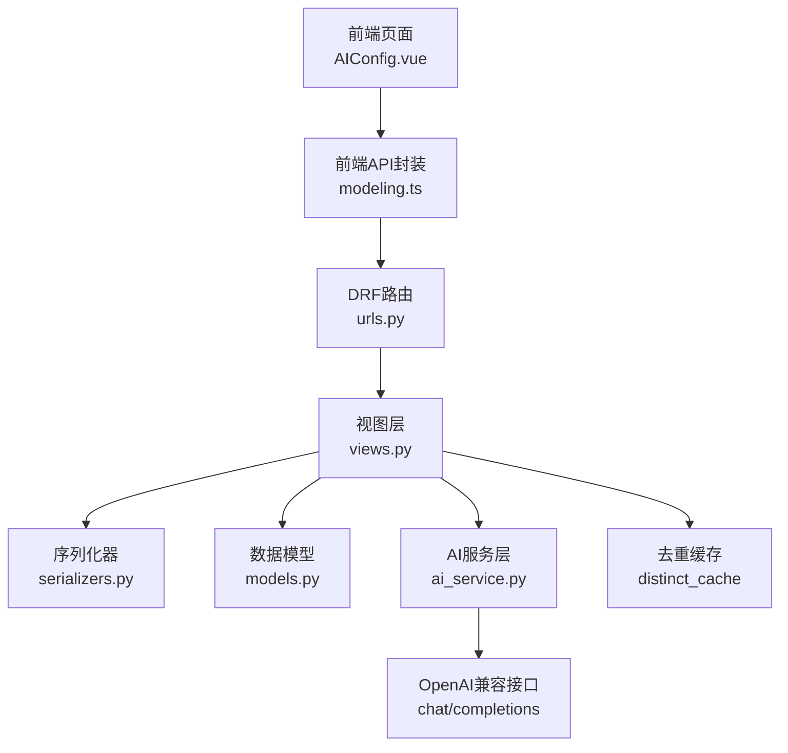
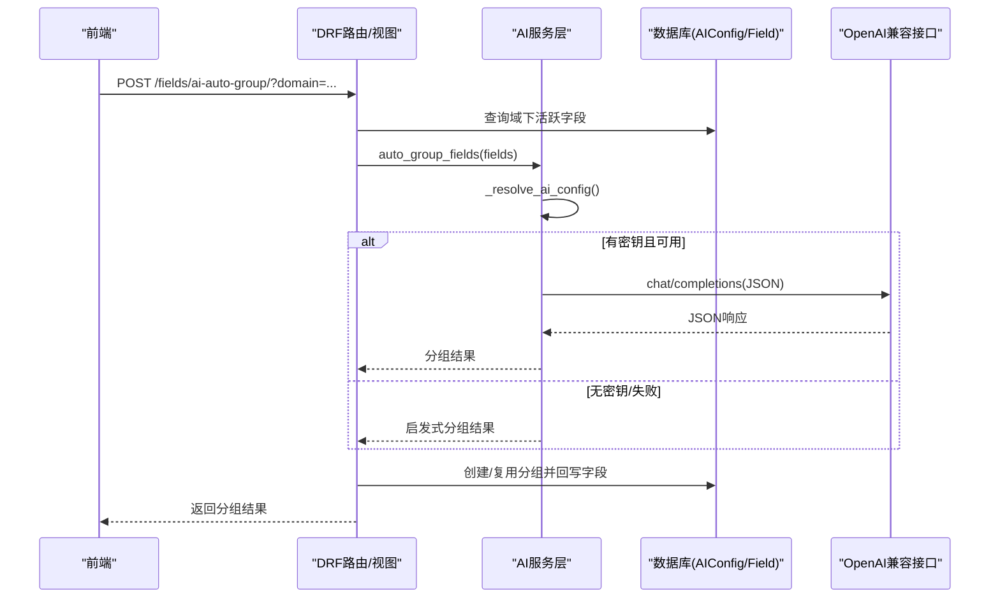
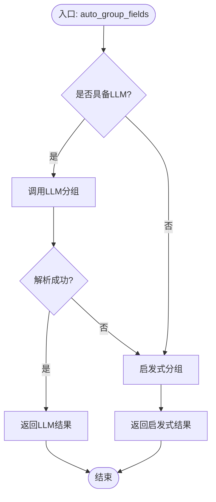
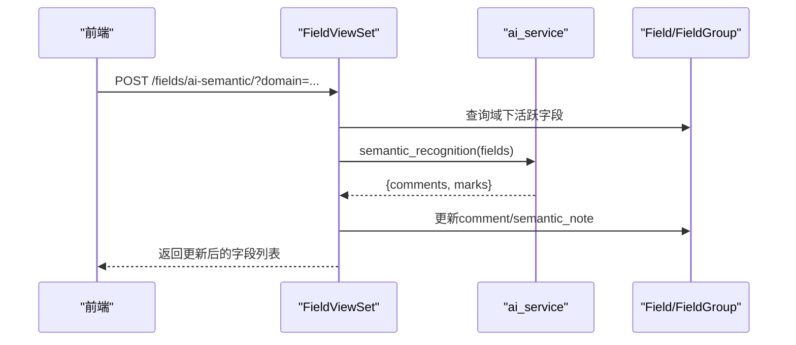
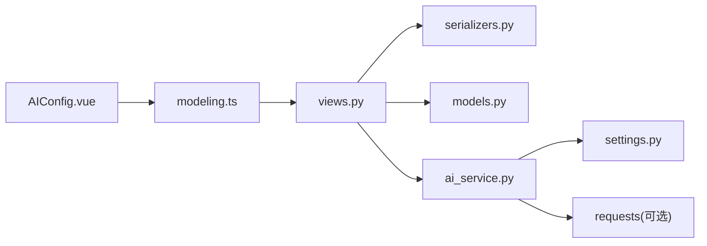

# AI智能服务

<cite>
**本文引用的文件**   
- [ai_service.py](file://backend/apps/modeling/ai_service.py)
- [models.py](file://backend/apps/modeling/models.py)
- [views.py](file://backend/apps/modeling/views.py)
- [serializers.py](file://backend/apps/modeling/serializers.py)
- [settings.py](file://backend/config/settings.py)
- [urls.py](file://backend/apps/modeling/urls.py)
- [AIConfig.vue](file://frontend/src/views/settings/AIConfig.vue)
- [modeling.ts](file://frontend/src/api/modeling.ts)
- [test_api.py](file://backend/test_api.py)
</cite>

## 目录
1. [简介](#简介)
2. [项目结构](#项目结构)
3. [核心组件](#核心组件)
4. [架构总览](#架构总览)
5. [详细组件分析](#详细组件分析)
6. [依赖关系分析](#依赖关系分析)
7. [性能与成本优化](#性能与成本优化)
8. [故障排查指南](#故障排查指南)
9. [结论](#结论)
10. [附录：使用示例与评估方法](#附录使用示例与评估方法)

## 简介
本文件为 MetaData002 的 AI 智能服务提供全面文档，覆盖 OpenAI 兼容接口集成、AI 辅助建模能力（字段自动分组、语义识别、注释补全、跨表去重检测）、提示词工程设计与优化策略、降级机制、配置管理界面与 API 调用方式，以及性能优化与成本控制建议。

## 项目结构
后端采用 Django + DRF 架构，AI 能力集中在 modeling 应用内；前端通过 Vue + Ant Design Vue 提供 AI 配置与交互页面。关键路径如下：
- 路由注册：apps/modeling/urls.py
- 视图层：apps/modeling/views.py（暴露 AI 相关 action）
- 序列化器：apps/modeling/serializers.py（AIConfigSerializer 等）
- 模型层：apps/modeling/models.py（AIConfig、Field、StandardField 等）
- AI 服务层：apps/modeling/ai_service.py（OpenAI 兼容调用与启发式回退）
- 全局设置：config/settings.py（环境变量注入 AI 参数）
- 前端配置页：frontend/src/views/settings/AIConfig.vue
- 前端 API 封装：frontend/src/api/modeling.ts

图表来源
- [urls.py:1-20](file://backend/apps/modeling/urls.py#L1-L20)
- [views.py:1780-1822](file://backend/apps/modeling/views.py#L1780-L1822)
- [ai_service.py:56-76](file://backend/apps/modeling/ai_service.py#L56-L76)
- [models.py:387-418](file://backend/apps/modeling/models.py#L387-L418)

章节来源
- [urls.py:1-20](file://backend/apps/modeling/urls.py#L1-L20)
- [views.py:1780-1822](file://backend/apps/modeling/views.py#L1780-L1822)
- [ai_service.py:1-100](file://backend/apps/modeling/ai_service.py#L1-L100)
- [models.py:387-418](file://backend/apps/modeling/models.py#L387-L418)

## 核心组件
- AI 服务层（ai_service.py）
  - 统一封装字段智能能力：自动分组、语义识别（注释补全 + 同义/歧义标识）、跨表去重检测、Excel 字段推断、自然语言生成计算表达式、表间映射推断。
  - 通过 _resolve_ai_config 优先读取数据库 AIConfig（enabled=True），未启用或失败时回退到 settings 环境变量。
  - 具备 test_connection 连接测试、_chat 调用 OpenAI 兼容接口、_parse_json 解析 JSON 响应。
  - 每个能力均实现 LLM 分支与启发式降级分支，确保无密钥或网络异常时仍可工作。
- 数据模型（models.py）
  - AIConfig：存储 OpenAI 兼容接口的连接参数与可配置提示词（prompt_auto_group、prompt_semantic、prompt_dedup、prompt_infer）。
  - Field/StandardField/Table：承载字段、标准字段与表信息，供 AI 分析与结果落库。
- 视图层（views.py）
  - AIConfigViewSet：current（获取/更新生效配置）、test-connection（测试连接，支持临时覆盖）。
  - FieldViewSet：ai-auto-group、ai-semantic、detect-standards、apply-standards 等 action，驱动 AI 能力并落库。
- 序列化器（serializers.py）
  - AIConfigSerializer：保护 api_key 不回显，返回 has_api_key 与 prompt_defaults。
- 前端（AIConfig.vue、modeling.ts）
  - 提供厂商预设、模型选择、温度/超时配置、提示词编辑与恢复默认、连接测试与保存。
  - 封装 aiConfigApi.current/update/testConnection 等接口。

章节来源
- [ai_service.py:1-100](file://backend/apps/modeling/ai_service.py#L1-L100)
- [models.py:387-418](file://backend/apps/modeling/models.py#L387-L418)
- [views.py:1780-1822](file://backend/apps/modeling/views.py#L1780-L1822)
- [serializers.py:248-279](file://backend/apps/modeling/serializers.py#L248-L279)
- [AIConfig.vue:1-305](file://frontend/src/views/settings/AIConfig.vue#L1-L305)
- [modeling.ts:440-445](file://frontend/src/api/modeling.ts#L440-L445)

## 架构总览
AI 智能服务在请求链路中位于视图层与外部大模型之间，承担“指令拼装—LLM 调用—结果解析—降级处理”的职责。

图表来源
- [views.py:1154-1181](file://backend/apps/modeling/views.py#L1154-L1181)
- [ai_service.py:171-203](file://backend/apps/modeling/ai_service.py#L171-L203)
- [ai_service.py:56-76](file://backend/apps/modeling/ai_service.py#L56-L76)

## 详细组件分析

### AI 服务层（ai_service.py）
- 配置解析与连接判断
  - _resolve_ai_config：优先读取 enabled=True 的 AIConfig，缺失则回退到 settings 环境变量（AI_API_BASE、AI_API_KEY、AI_MODEL、AI_TIMEOUT）。
  - _has_llm：存在 API Key 且 requests 可用即视为具备真实大模型调用条件。
- OpenAI 兼容接口调用
  - _chat：构造 Authorization Bearer、Content-Type、model、messages、temperature、response_format=json_object，POST 至 {api_base}/chat/completions。
  - test_connection：发送最小请求验证配置可用性，返回 ok/message。
- 提示词工程
  - DEFAULT_PROMPT_AUTO_GROUP、DEFAULT_PROMPT_SEMANTIC、DEFAULT_PROMPT_DEDUP、DEFAULT_PROMPT_INFER：内置默认指令，仅包含指令部分，字段数据由函数动态拼接。
  - PROMPT_META：提示词元数据（key/label/default）。
  - _resolve_prompt：优先读 AIConfig 对应字段，为空则用内置默认。
- 字段自动分组
  - auto_group_fields：先尝试 LLM，失败回退启发式（关键词匹配业务主题，非数据类型）。
  - _auto_group_llm：组装 prompt + fields JSON，解析 groups 并校验 field_ids。
  - _auto_group_heuristic：按编码/英文名/中文名关键词归入客户信息、商品信息、订单信息、组织信息、联系方式、财务信息、状态标识、审计追踪、基础标识、其他信息。
- 语义识别（注释补全 + 同义/歧义标识）
  - semantic_recognition：LLM 分支生成 comments/marks；启发式分支对空注释回填 name，纯英文注释保留原值，按规范化名称聚类标记疑似同义/歧义。
- 跨表去重检测（等价组）
  - detect_duplicate_fields：LLM 分支综合编码/名称/去重值集合；启发式分支使用并查集按编码归一化、名称归一化、去重值集合完全相同进行合并，要求跨 2+ 张表且成员≥2。
  - _normalize_code/_normalize_name：编码与中文名称归一化规则。
- Excel 字段推断
  - infer_fields_from_excel：LLM 分支根据列名与样本行推断类型/长度/必填/注释；启发式分支基于样本值类型判断布尔/日期/数字/字符串。
- 自然语言生成计算表达式
  - generate_formula：收集域内活跃字段与计算字段，附带样本值（distinct_values 缓存或临时采样），结合可用函数签名，构建 system prompt，调用 LLM 生成表达式，自动 validate_expression 验证，失败携带错误重试一次。
- 表间字段映射推断
  - infer_mappings：收集域内活跃表与字段，优先 LLM 分析外键/业务关联；无 LLM 时降级为启发式（编码精确匹配，排除主键-主键组合）。

图表来源
- [ai_service.py:171-203](file://backend/apps/modeling/ai_service.py#L171-L203)
- [ai_service.py:205-236](file://backend/apps/modeling/ai_service.py#L205-L236)

章节来源
- [ai_service.py:1-100](file://backend/apps/modeling/ai_service.py#L1-L100)
- [ai_service.py:171-236](file://backend/apps/modeling/ai_service.py#L171-L236)
- [ai_service.py:240-310](file://backend/apps/modeling/ai_service.py#L240-L310)
- [ai_service.py:326-433](file://backend/apps/modeling/ai_service.py#L326-L433)
- [ai_service.py:437-552](file://backend/apps/modeling/ai_service.py#L437-L552)
- [ai_service.py:558-748](file://backend/apps/modeling/ai_service.py#L558-L748)
- [ai_service.py:754-800](file://backend/apps/modeling/ai_service.py#L754-L800)

### 视图层（views.py）
- AIConfigViewSet
  - current：获取/更新生效配置（不存在则创建默认）。
  - test-connection：支持传入临时配置覆盖测试，返回 ok/message。
- FieldViewSet
  - ai-auto-group：对域下 active 字段分组，创建/复用分组并回写 group。
  - ai-semantic：补全空注释、翻译英文注释为中文、写入 semantic_note。
  - detect-standards：检测跨表冗余（标准字段）建议，不落库，返回 members 明细。
  - apply-standards：应用去重建议，创建/复用 StandardField 并回写 Field.standard_field。
  - standard-fields：聚合标准字段与独立物理字段，供前端分组 Tab 展示。

图表来源
- [views.py:1183-1225](file://backend/apps/modeling/views.py#L1183-L1225)
- [ai_service.py:240-310](file://backend/apps/modeling/ai_service.py#L240-L310)

章节来源
- [views.py:1780-1822](file://backend/apps/modeling/views.py#L1780-L1822)
- [views.py:1154-1353](file://backend/apps/modeling/views.py#L1154-L1353)

### 数据模型（models.py）
- AIConfig
  - 字段：name、provider、api_base、api_key、model、temperature、timeout、enabled、prompt_* 系列。
  - 单例语义：仅 enabled=True 的一条作为生效配置。
- Field/StandardField/Table
  - Field：code/name/comment/semantic_note/field_type/length/required/default_value/date_format/validation_rule/group/standard_field/is_primary_key/release_to_concept/release_to_archive/archive_category/ownership/distinct_values/distinct_synced_at/sort_order/status。
  - StandardField：standard_code/standard_name/note/source/属性配置（field_type/length/required/default_value/enum_values/date_format/validation_rule/release_to_archive/is_active/status/ownership/primary_field/primary_field_manual）。
  - Table：domain/name/code/description/type/data_source/external_table_name/schema/is_primary/source_config/status/er_node_x/er_node_y。

章节来源
- [models.py:387-418](file://backend/apps/modeling/models.py#L387-L418)
- [models.py:301-367](file://backend/apps/modeling/models.py#L301-L367)
- [models.py:162-300](file://backend/apps/modeling/models.py#L162-L300)

### 序列化器（serializers.py）
- AIConfigSerializer
  - api_key 只写不回显，has_api_key 标识是否已配置，prompt_defaults 返回内置默认提示词。
  - update 逻辑：传空 api_key 视为不修改，避免误清空。

章节来源
- [serializers.py:248-279](file://backend/apps/modeling/serializers.py#L248-L279)

### 前端（AIConfig.vue、modeling.ts）
- AIConfig.vue
  - 厂商预设（deepseek/openai/qwen/zhipu/moonshot/custom），选择模型自动带出接口地址。
  - 高级设置：配置名称、启用开关、服务厂商、接口地址、采样温度、超时时间。
  - 提示词配置：四个任务提示词编辑与恢复默认。
  - 连接测试：调用 aiConfigApi.testConnection，显示测试结果。
- modeling.ts
  - aiConfigApi：current/update/testConnection。
  - fieldApi：aiAutoGroup/aiSemantic/detectStandards/applyStandards/standardFields。
  - computedFieldApi：generateFormula/validateExpression/previewData 等。

章节来源
- [AIConfig.vue:1-305](file://frontend/src/views/settings/AIConfig.vue#L1-L305)
- [modeling.ts:440-445](file://frontend/src/api/modeling.ts#L440-L445)
- [modeling.ts:99-119](file://frontend/src/api/modeling.ts#L99-L119)
- [modeling.ts:375-391](file://frontend/src/api/modeling.ts#L375-L391)

## 依赖关系分析
- 组件耦合
  - views.py 依赖 ai_service.py 与 models.py；ai_service.py 依赖 settings 与可选 requests。
  - serializers.py 依赖 models.py；前端依赖 modeling.ts 与后端 DRF 路由。
- 外部依赖
  - OpenAI 兼容接口（HTTP POST /chat/completions）。
  - 数据库（PostgreSQL/MySQL/SQL Server/Oracle，通过 distinct_cache.ENGINE_MAP）。
- 潜在循环依赖
  - ai_service.py 内部函数相互调用但无循环导入；views.py 仅在 action 中按需 import 模型以避免启动期循环。

图表来源
- [views.py:1780-1822](file://backend/apps/modeling/views.py#L1780-L1822)
- [ai_service.py:1-100](file://backend/apps/modeling/ai_service.py#L1-L100)
- [settings.py:109-114](file://backend/config/settings.py#L109-L114)

章节来源
- [views.py:1780-1822](file://backend/apps/modeling/views.py#L1780-L1822)
- [ai_service.py:1-100](file://backend/apps/modeling/ai_service.py#L1-L100)
- [settings.py:109-114](file://backend/config/settings.py#L109-L114)

## 性能与成本优化
- 调用频率控制
  - 批量操作前尽量合并字段（如 detect-standards 一次性传入所有字段），减少多次 LLM 调用。
  - 使用 response_format=json_object 降低解析失败重试次数。
- 超时与重试
  - 合理设置 AI_TIMEOUT（默认 30s），在网络抖动场景适当提高；对 generate_formula 已内置一次重试。
- 缓存与采样
  - 充分利用 distinct_values 缓存，必要时临时采样（limit=10）避免重复查询。
  - 对 Excel 推断限制样本行数（rows[:5]），降低 token 用量。
- 模型选择与温度
  - 生产环境建议使用稳定模型（如 gpt-4o-mini），temperature 保持较低（0.2）提升一致性。
- 降级策略
  - 无密钥或网络异常自动回退启发式算法，保证功能可用，避免阻塞业务流程。

[本节为通用指导，无需特定文件引用]

## 故障排查指南
- 连接测试失败
  - 检查 AI_API_KEY 是否为空；确认 api_base 是否正确；查看 test_connection 返回 message。
  - 若 requests 未安装，将返回缺少依赖的错误。
- 解析失败
  - 检查 LLM 返回是否为 JSON；_parse_json 会去除代码块包裹，仍失败需调整 prompt 或模型。
- 分组/语义/去重结果不理想
  - 调整对应 prompt_* 字段（prompt_auto_group/prompt_semantic/prompt_dedup/prompt_infer），或使用启发式结果对比。
- 公式生成失败
  - 检查 availableFunctions 与 availableReferences 是否完整；确认 selected_refs 是否存在且有效；查看 validate_expression 错误信息。

章节来源
- [ai_service.py:78-90](file://backend/apps/modeling/ai_service.py#L78-L90)
- [ai_service.py:92-99](file://backend/apps/modeling/ai_service.py#L92-L99)
- [views.py:1801-1822](file://backend/apps/modeling/views.py#L1801-L1822)

## 结论
MetaData002 的 AI 智能服务以 ai_service.py 为核心，统一封装 OpenAI 兼容接口调用与启发式降级，配合 views.py 的 action 完成字段分组、语义识别、跨表去重、Excel 推断、公式生成与映射推断。前端 AIConfig.vue 提供直观的配置管理与提示词调优。系统具备良好的容错性与可扩展性，适合在生产环境中稳定运行。

[本节为总结，无需特定文件引用]

## 附录：使用示例与评估方法
- 配置 AI 服务
  - 在「系统设置-AI配置」页面填写 API Key、选择模型与温度/超时，点击“测试连接”验证。
  - 可通过环境变量 AI_API_BASE/AI_API_KEY/AI_MODEL/AI_TIMEOUT 快速注入。
- 字段自动分组
  - 调用 /fields/ai-auto-group/?domain={id}，返回分组结果并自动落库。
- 语义识别
  - 调用 /fields/ai-semantic/?domain={id}，自动补全注释与语义标识。
- 跨表去重检测
  - 调用 /fields/detect-standards/?domain={id}，查看建议组；确认后调用 /fields/apply-standards/?domain={id} 应用。
- 公式生成
  - 调用 /computed-fields/generate-formula/，传入 description、domainId、selectedRefs/currentExpression，返回 expression/explanation/reasoning/risk/code/name/output_type。
- 效果评估
  - 分组质量：人工抽检分组合理性，统计“其他信息”占比。
  - 语义识别：检查 comment 覆盖率与 semantic_note 准确性。
  - 去重检测：评估等价组数量与成员数，核对跨表一致性。
  - 公式生成：通过 validate-expression/preview-data 验证语法与输出正确性。

章节来源
- [AIConfig.vue:1-305](file://frontend/src/views/settings/AIConfig.vue#L1-L305)
- [settings.py:109-114](file://backend/config/settings.py#L109-L114)
- [views.py:1154-1353](file://backend/apps/modeling/views.py#L1154-L1353)
- [modeling.ts:375-391](file://frontend/src/api/modeling.ts#L375-L391)
- [test_api.py:1-155](file://backend/test_api.py#L1-L155)