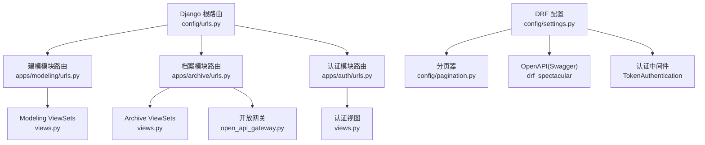
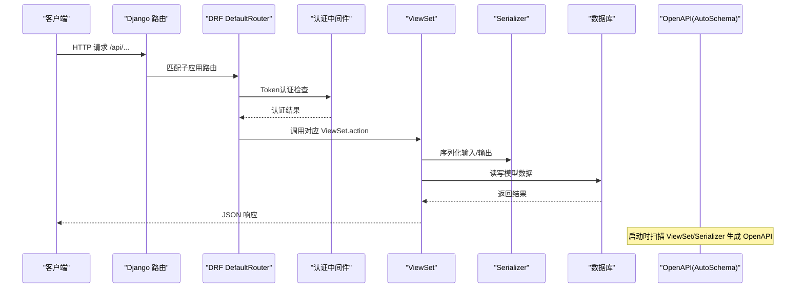
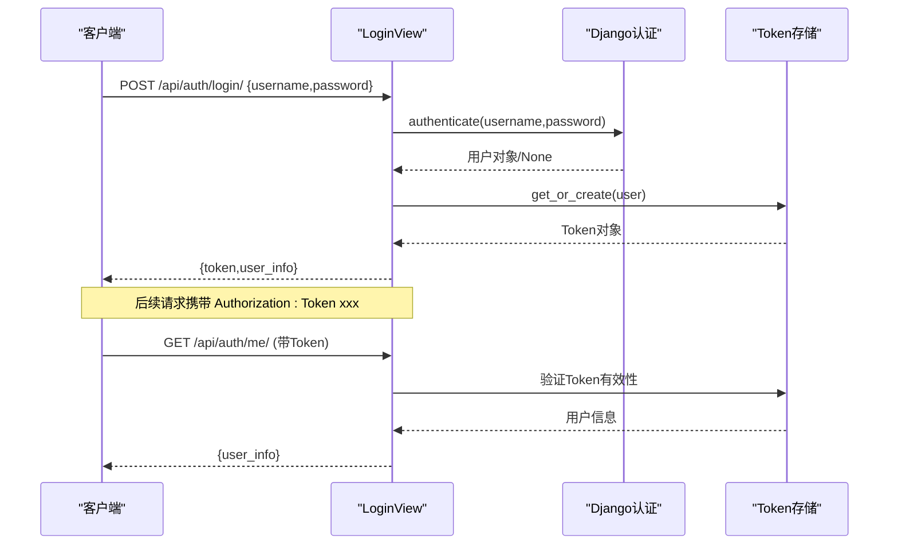
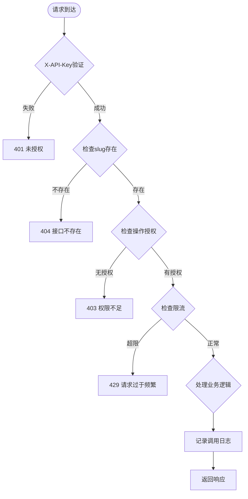
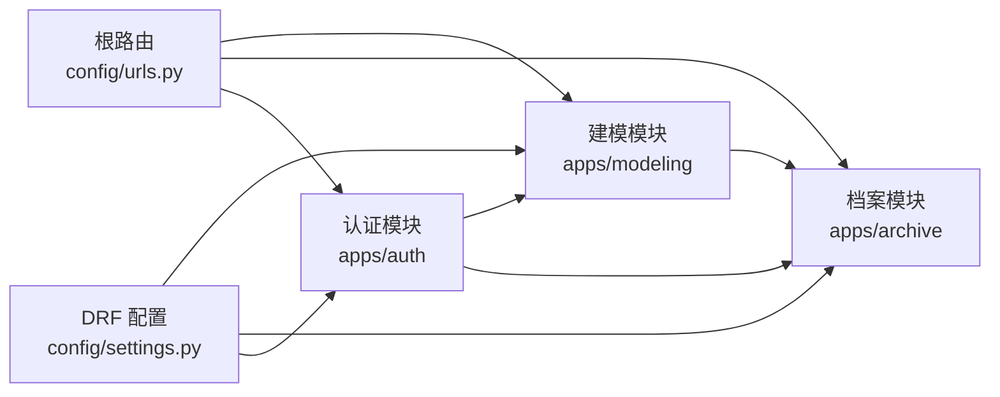

# API参考文档

<cite>
**本文引用的文件**   
- [backend/config/urls.py](file://backend/config/urls.py)
- [backend/apps/modeling/urls.py](file://backend/apps/modeling/urls.py)
- [backend/apps/archive/urls.py](file://backend/apps/archive/urls.py)
- [backend/apps/auth/urls.py](file://backend/apps/auth/urls.py)
- [backend/config/settings.py](file://backend/config/settings.py)
- [backend/config/pagination.py](file://backend/config/pagination.py)
- [backend/apps/modeling/views.py](file://backend/apps/modeling/views.py)
- [backend/apps/archive/views.py](file://backend/apps/archive/views.py)
- [backend/apps/auth/views.py](file://backend/apps/auth/views.py)
- [backend/apps/archive/open_api_gateway.py](file://backend/apps/archive/open_api_gateway.py)
- [backend/apps/archive/open_api_auth.py](file://backend/apps/archive/open_api_auth.py)
- [backend/apps/modeling/serializers.py](file://backend/apps/modeling/serializers.py)
- [backend/apps/archive/serializers.py](file://backend/apps/archive/serializers.py)
- [backend/test_api.py](file://backend/test_api.py)
- [.ai/route_index.md](file://.ai/route_index.md)
</cite>

## 更新摘要
**变更内容**
- 新增认证模块API：用户登录、登出、当前用户信息获取
- 增强档案模块开放网关：提供外部系统集成的标准化接口
- 完善认证授权机制：实现Token认证和权限控制
- 新增API密钥管理：支持外部系统通过API Key访问档案数据

## 目录
1. [简介](#简介)
2. [项目结构](#项目结构)
3. [核心组件](#核心组件)
4. [架构总览](#架构总览)
5. [详细组件分析](#详细组件分析)
6. [依赖分析](#依赖分析)
7. [性能考虑](#性能考虑)
8. [故障排查指南](#故障排查指南)
9. [结论](#结论)
10. [附录](#附录)

## 简介
本文件为 MetaData002 系统的完整 API 参考文档，覆盖建模（modeling）、档案（archive）与认证（auth）三大模块的 RESTful 接口。内容包括：
- 所有端点的 HTTP 方法与 URL 模式、请求参数与响应格式
- **新增** 完整的认证与授权机制说明（JWT令牌使用、权限控制、API密钥管理）
- 分页、过滤、搜索、排序规范
- 错误码定义与错误处理策略
- Swagger/OpenAPI 文档访问方式与在线调试方法
- API 版本管理与向后兼容性策略
- 客户端集成示例与最佳实践

## 项目结构
后端基于 Django + DRF，路由通过根 urls 聚合到 apps.modeling、apps.archive 与 apps.auth 三个子模块；每个子模块使用 DefaultRouter 自动注册 ViewSet 端点。分页采用自定义 StandardPagination，支持 page_size 覆盖。OpenAPI 由 drf_spectacular 自动生成。

**图表来源**
- [backend/config/urls.py:1-10](file://backend/config/urls.py#L1-L10)
- [backend/apps/modeling/urls.py:1-20](file://backend/apps/modeling/urls.py#L1-L20)
- [backend/apps/archive/urls.py:1-29](file://backend/apps/archive/urls.py#L1-L29)
- [backend/apps/auth/urls.py:1-16](file://backend/apps/auth/urls.py#L1-L16)
- [backend/config/settings.py:94-111](file://backend/config/settings.py#L94-L111)

**章节来源**
- [backend/config/urls.py:1-10](file://backend/config/urls.py#L1-L10)
- [backend/apps/modeling/urls.py:1-20](file://backend/apps/modeling/urls.py#L1-L20)
- [backend/apps/archive/urls.py:1-29](file://backend/apps/archive/urls.py#L1-L29)
- [backend/apps/auth/urls.py:1-16](file://backend/apps/auth/urls.py#L1-L16)
- [backend/config/settings.py:94-111](file://backend/config/settings.py#L94-L111)

## 核心组件
- 路由层
  - 根路由将 /api/* 分发至 modeling、archive 与 auth 三个子应用
  - 各子应用使用 DefaultRouter 注册 ViewSet，自动生成标准 CRUD 路由与 action 路由
- 视图层
  - modeling：数据源、域、表、字段、分组、映射、标准字段、AI 配置、计算字段等
  - archive：档案、记录、同步日志、操作日志、版本、变更批次/明细、一致性检查、**开放网关**等
  - **auth：用户登录、登出、当前用户信息、用户管理、角色管理等**
- 序列化层
  - 针对列表/详情/创建/更新分别提供不同 Serializer，控制字段可见性与校验规则
- 分页与查询
  - 统一分页 StandardPagination，支持 page_size 覆盖
  - 内置过滤（django_filters）、搜索（SearchFilter）、排序（OrderingFilter）

**章节来源**
- [backend/apps/modeling/views.py:31-147](file://backend/apps/modeling/views.py#L31-L147)
- [backend/apps/archive/views.py:246-342](file://backend/apps/archive/views.py#L246-L342)
- [backend/apps/auth/views.py:42-74](file://backend/apps/auth/views.py#L42-L74)
- [backend/config/pagination.py:1-14](file://backend/config/pagination.py#L1-L14)

## 架构总览
下图展示从请求进入 Django 到 DRF ViewSet 处理的整体流程，以及 OpenAPI 文档生成位置。

**图表来源**
- [backend/config/urls.py:1-10](file://backend/config/urls.py#L1-L10)
- [backend/config/settings.py:94-111](file://backend/config/settings.py#L94-L111)

## 详细组件分析

### 认证模块 API（/api/auth/）
**新增功能**：完整的用户认证与权限管理系统

#### 用户认证
- **登录接口**
  - 端点：POST /api/auth/login/
  - 能力：用户名密码验证，返回Token和用户信息
  - 请求体：{username, password}
  - 成功响应：{token, user:{id, username, display_name, is_admin, roles}}
  - 失败响应：{detail: "用户名或密码错误"}
  - 状态码：200/401

- **登出接口**
  - 端点：POST /api/auth/logout/
  - 能力：删除用户Token，使会话失效
  - 成功响应：{detail: "已登出"}
  - 状态码：200

- **当前用户信息**
  - 端点：GET /api/auth/me/
  - 能力：获取当前登录用户信息
  - 成功响应：{token: null, user:{...}}
  - 状态码：200/401

#### 用户管理（管理员权限）
- **用户CRUD**
  - 端点：/api/auth/users/
  - 能力：创建、查询、更新用户（禁止删除，仅禁用）
  - 关键action：reset-password（重置密码并失效旧Token）
  - 权限：需要管理员权限

- **角色管理**
  - 端点：/api/auth/roles/
  - 能力：CRUD角色，管理角色×域字段权限
  - 关键action：permissions（批量设置字段可见性和可编辑性）
  - 权限：需要管理员权限

**章节来源**
- [backend/apps/auth/views.py:42-74](file://backend/apps/auth/views.py#L42-L74)
- [backend/apps/auth/views.py:76-182](file://backend/apps/auth/views.py#L76-L182)
- [backend/apps/auth/urls.py:1-16](file://backend/apps/auth/urls.py#L1-L16)

#### 认证流程序列图

**图表来源**
- [backend/apps/auth/views.py:42-74](file://backend/apps/auth/views.py#L42-L74)

### 档案模块开放网关 API（/api/open/{slug}/）
**增强功能**：为外部系统集成提供的标准化数据访问接口

#### 开放网关特性
- **API密钥认证**：使用 X-API-Key 头部进行身份验证
- **细粒度权限控制**：支持 read/create/update/delete 操作授权
- **限流保护**：按密钥维度每分钟调用次数限制
- **审计日志**：完整记录所有API调用
- **动态筛选**：支持查询参数动态过滤

#### 网关端点
- **列表查询**
  - 端点：GET /api/open/{slug}/
  - 能力：分页查询、动态筛选、字段投影
  - 查询参数：page, page_size, field=value, field__contains=模糊匹配
  - 成功响应：{count, page, page_size, records:[...]}
  - 状态码：200/401/403/404/429

- **单条查询**
  - 端点：GET /api/open/{slug}/{record_key}/
  - 能力：根据主键值获取单条记录
  - 成功响应：{暴露字段..., record_key}
  - 状态码：200/404

- **新增记录**
  - 端点：POST /api/open/{slug}/
  - 能力：创建新记录（主键必填，仅允许档案维护字段）
  - 成功响应：{record_key, data:...}
  - 状态码：201/400

- **更新记录**
  - 端点：PATCH /api/open/{slug}/{record_key}/
  - 能力：修改记录（仅允许档案维护字段）
  - 成功响应：{record_key, data:...}
  - 状态码：200/400

- **软删除**
  - 端点：DELETE /api/open/{slug}/{record_key}/
  - 能力：标记记录为停用状态
  - 成功响应：{record_key, status: "deleted"}
  - 状态码：200/404

- **接口文档**
  - 端点：GET /api/open/{slug}/docs/
  - 能力：返回该接口的完整文档和使用示例
  - 成功响应：包含字段定义、操作说明、示例代码

**章节来源**
- [backend/apps/archive/open_api_gateway.py:1-400](file://backend/apps/archive/open_api_gateway.py#L1-L400)
- [backend/apps/archive/open_api_auth.py:1-137](file://backend/apps/archive/open_api_auth.py#L1-L137)
- [backend/apps/archive/urls.py:19-28](file://backend/apps/archive/urls.py#L19-L28)

#### 开放网关工作流程

**图表来源**
- [backend/apps/archive/open_api_gateway.py:158-198](file://backend/apps/archive/open_api_gateway.py#L158-L198)
- [backend/apps/archive/open_api_auth.py:39-108](file://backend/apps/archive/open_api_auth.py#L39-L108)

### 建模模块 API（/api/）
- 数据源 DataSource
  - 端点：/api/data-sources/
  - 能力：CRUD、连接测试、列出 schema、外部表清单
  - 关键 action
    - POST /api/data-sources/test-connection/ 测试未保存的连接参数
    - GET /api/data-sources/{id}/test-connection/ 测试已有数据源连接
    - GET /api/data-sources/{id}/schemas/?include_counts=true|false
    - GET /api/data-sources/{id}/external-tables/?schema=&has_data=true|false
  - 过滤/搜索：search_fields=name,db_type,host
- 域 Domain
  - 端点：/api/domains/
  - 能力：CRUD、状态切换前置 P0 检查、配置完整性检查、主键状态检查
  - 关键 action
    - GET /api/domains/{id}/check-config/
    - GET /api/domains/{id}/pk-status/
  - 过滤：filterset_fields=status；搜索：search_fields=name,code
- 表 Table
  - 端点：/api/tables/
  - 能力：CRUD、切换启用/停用、预览数据（本地/外部）
  - 关键 action
    - PUT /api/tables/{id}/toggle-status/
    - GET /api/tables/{id}/preview-data/?limit=100
  - 过滤：domain,type,status；搜索：name,code
- 字段 Field
  - 端点：/api/fields/
  - 能力：CRUD、批量更新属性、去重检测与等价组应用、标准字段关联、刷新去重值、归档预览、分类管理
  - 典型 action（按 views 中实现）：batch-update-attributes、detect-duplicates、apply-equivalence、standard-fields、refresh-distinct、archive-preview、field-categories
- 字段分组 FieldGroup
  - 端点：/api/field-groups/
  - 能力：CRUD，层级不超过3层，防环校验
- 字段映射 FieldMapping
  - 端点：/api/field-mappings/
  - 能力：CRUD，用于多表关系映射
- 标准字段 StandardField
  - 端点：/api/standard-fields/
  - 能力：CRUD、成员管理、设置主字段、成员去重值查看
  - 关键 action：set-primary-field、members-distinct、add_member/remove_member
- AI 配置 AIConfig
  - 端点：/api/ai-config/
  - 能力：CRUD、测试连接、获取默认 prompt
- 计算字段 ComputedField
  - 端点：/api/computed-fields/
  - 能力：CRUD、公式验证/表达式验证、试算、依赖图、批量重算、可用函数/引用、技术函数插件管理（上传/卸载/重载/列表/模板）

**章节来源**
- [backend/apps/modeling/views.py:31-147](file://backend/apps/modeling/views.py#L31-L147)
- [backend/apps/modeling/views.py:430-503](file://backend/apps/modeling/views.py#L430-L503)
- [backend/apps/modeling/views.py:504-800](file://backend/apps/modeling/views.py#L504-L800)
- [backend/apps/modeling/serializers.py:1-200](file://backend/apps/modeling/serializers.py#L1-L200)

### 档案模块 API（/api/）
- 档案 Archive
  - 端点：/api/archives/
  - 能力：CRUD、同步 schema、立即刷新数据、预检刷新、一致性检查
  - 关键 action
    - POST /api/archives/{id}/sync-schema/
    - POST /api/archives/{id}/refresh-data/
    - GET /api/archives/{id}/refresh-preview/
    - POST /api/archives/{id}/consistency-check/
- 档案记录 ArchiveRecord
  - 端点：/api/records/
  - 能力：CRUD（create 受控，禁止人工新增），版本历史、回滚、对比
  - 关键 action
    - GET /api/records/{id}/versions/
    - GET /api/records/{id}/versions/compare/?v1=&v2=
    - POST /api/records/{id}/rollback/
- 同步日志 SyncLog
  - 端点：/api/sync-logs/
- 操作日志 OperationLog
  - 端点：/api/operation-logs/
- 记录版本 RecordVersion
  - 端点：/api/record-versions/
  - 能力：全局版本列表、定版/取消定版
- 档案 API 配置 ArchiveApi
  - 端点：/api/archive-apis/
- 变更批次 ChangeBatch
  - 端点：/api/change-batches/
- 变更明细 ChangeDetail
  - 端点：/api/change-details/
  - 能力：导出 Excel（GET /api/change-details/export/?archive=N）
- 一致性问题 ConsistencyIssue
  - 端点：/api/consistency-issues/
  - 能力：只读、批量审核（reviewed/ignored/reopen）
- 一致性检查规则 ConsistencyCheckRule
  - 端点：/api/consistency-rules/

**章节来源**
- [backend/apps/archive/views.py:246-342](file://backend/apps/archive/views.py#L246-L342)
- [backend/apps/archive/views.py:396-601](file://backend/apps/archive/views.py#L396-L601)
- [backend/apps/archive/serializers.py:1-200](file://backend/apps/archive/serializers.py#L1-L200)

### 通用规范

#### 分页
- 类：StandardPagination
- 默认页大小：20
- 前端可覆盖：page_size（最大 100000）
- 返回结构遵循 DRF 标准分页（results、count、next、previous 等）

**章节来源**
- [backend/config/pagination.py:1-14](file://backend/config/pagination.py#L1-L14)
- [backend/config/settings.py:94-101](file://backend/config/settings.py#L94-L101)

#### 过滤、搜索、排序
- 过滤：django_filters，按各 ViewSet 的 filterset_fields 生效
- 搜索：SearchFilter，按 search_fields 生效
- 排序：OrderingFilter，按 ViewSet 的 ordering_fields（如未显式声明则按默认排序）

**章节来源**
- [backend/config/settings.py:105-109](file://backend/config/settings.py#L105-L109)
- [backend/apps/modeling/views.py:31-36](file://backend/apps/modeling/views.py#L31-L36)
- [backend/apps/modeling/views.py:430-435](file://backend/apps/modeling/views.py#L430-L435)
- [backend/apps/modeling/views.py:504-509](file://backend/apps/modeling/views.py#L504-L509)

#### 认证与授权
**重大更新**：现已实现完整的认证授权体系

- **Token认证**：使用 DRF 的 TokenAuthentication
- **全局强制登录**：所有API默认需要认证，除登录接口外
- **权限控制**：基于角色的细粒度权限管理
- **API密钥**：外部系统通过API Key访问档案数据

**认证流程**：
1. 用户通过 /api/auth/login/ 获取Token
2. 在后续请求头中添加 `Authorization: Token {token}`
3. 系统验证Token有效性并执行相应权限检查

**API密钥认证**（外部系统）：
1. 通过管理界面创建API密钥
2. 在请求头中添加 `X-API-Key: mdm_xxxx`
3. 系统验证密钥并执行限流和审计

**章节来源**
- [backend/config/settings.py:94-111](file://backend/config/settings.py#L94-L111)
- [backend/apps/auth/views.py:42-74](file://backend/apps/auth/views.py#L42-L74)
- [backend/apps/archive/open_api_auth.py:39-108](file://backend/apps/archive/open_api_auth.py#L39-L108)

#### 错误处理与错误码
- 业务错误：通常返回 4xx（如 400 参数错误、403 无权限、404 不存在）
- 常见错误体包含 success/error 或 detail/message 等字段（因端点而异）
- 连接测试失败会返回 success=false 并附带 error 信息
- **新增**：认证相关错误（401未授权、403权限不足、429限流）
- 建议客户端对非 2xx 响应进行统一解析与提示

**章节来源**
- [backend/apps/modeling/views.py:100-147](file://backend/apps/modeling/views.py#L100-L147)
- [backend/apps/auth/views.py:42-74](file://backend/apps/auth/views.py#L42-L74)
- [backend/apps/archive/open_api_gateway.py:158-198](file://backend/apps/archive/open_api_gateway.py#L158-L198)
- [backend/test_api.py:1-155](file://backend/test_api.py#L1-L155)

#### OpenAPI/Swagger 文档
- 使用 drf_spectacular AutoSchema
- 标题/描述/版本在 SPECTACULAR_SETTINGS 中配置
- 可通过 /api/schema/ 或 /swagger/（取决于部署）访问

**章节来源**
- [backend/config/settings.py:113-117](file://backend/config/settings.py#L113-L117)

#### API 版本管理与向后兼容
- 当前未引入 URL 前缀版本（如 /v1/）
- 建议未来通过 URL 前缀或 Header 版本控制，保持向后兼容（新增字段不破坏旧客户端）

**章节来源**
- [backend/config/urls.py:1-10](file://backend/config/urls.py#L1-L10)

### 请求/响应示例（节选）
以下为常用端点的示例结构与状态码说明（以路径与字段为主，避免粘贴具体代码内容）。

#### 认证相关
- **用户登录（POST）**
  - 路径：/api/auth/login/
  - 请求体：{username, password}
  - 成功响应：{token: "abc123...", user: {id: 1, username: "admin", display_name: "管理员", is_admin: true, roles: []}}
  - 失败响应：{detail: "用户名或密码错误"}
  - 状态码：200/401

- **获取当前用户（GET）**
  - 路径：/api/auth/me/
  - 请求头：Authorization: Token {token}
  - 成功响应：{token: null, user: {...}}
  - 失败响应：{detail: "认证凭据无效"}
  - 状态码：200/401

- **用户登出（POST）**
  - 路径：/api/auth/logout/
  - 请求头：Authorization: Token {token}
  - 成功响应：{detail: "已登出"}
  - 状态码：200

#### 档案开放网关
- **列表查询（GET）**
  - 路径：/api/open/{slug}/?page=1&page_size=20&field=value
  - 请求头：X-API-Key: mdm_xxxx
  - 成功响应：{count: 100, page: 1, page_size: 20, records: [{field1: value1, field2: value2, record_key: "key123"}]}
  - 失败响应：{detail: "无效的API密钥"}
  - 状态码：200/401/403/404/429

- **新增记录（POST）**
  - 路径：/api/open/{slug}/
  - 请求头：X-API-Key: mdm_xxxx
  - 请求体：{field1: value1, field2: value2, ...}
  - 成功响应：{record_key: "key123", data: {field1: value1, field2: value2}}
  - 失败响应：{detail: "主键字段必填：CODE"}
  - 状态码：201/400

#### 数据源连接测试（POST）
- 路径：/api/data-sources/test-connection/
- 请求体：{db_type, host, port, db_name, username, password}
- 成功响应：{success: true, message: "..."}
- 失败响应：{success: false, error: "..."}
- 状态码：200（成功/失败均返回 200，以 body.success 区分）

**章节来源**
- [backend/apps/auth/views.py:42-74](file://backend/apps/auth/views.py#L42-L74)
- [backend/apps/archive/open_api_gateway.py:201-247](file://backend/apps/archive/open_api_gateway.py#L201-L247)
- [backend/apps/archive/open_api_gateway.py:251-317](file://backend/apps/archive/open_api_gateway.py#L251-L317)
- [backend/apps/modeling/views.py:80-147](file://backend/apps/modeling/views.py#L80-L147)

## 依赖分析
- 模块依赖
  - archive 依赖 modeling（读取域/表/字段/标准字段/计算字段）
  - auth 模块独立，但被其他模块引用进行权限控制
  - 三者均依赖 DRF、django_filters、drf_spectacular
- 路由依赖
  - 根路由聚合三个子应用路由
- 运行时依赖
  - PostgreSQL、Redis（缓存）
  - 可选 AI 服务（OpenAI 兼容）

**图表来源**
- [.ai/route_index.md:14-22](file://.ai/route_index.md#L14-L22)
- [backend/config/urls.py:1-10](file://backend/config/urls.py#L1-L10)
- [backend/config/settings.py:94-111](file://backend/config/settings.py#L94-L111)

**章节来源**
- [.ai/route_index.md:14-22](file://.ai/route_index.md#L14-L22)

## 性能考虑
- 分页上限 max_page_size=100000，防止极端值拖垮服务
- 外部表预览限制 limit≤500，默认 100
- 去重取值缓存 distinct_values 上限 100 条，减少重复查询
- 计算字段批量重算与依赖解析（DAG）提升效率
- 外部数据库连接动态创建与及时释放，避免连接泄漏
- **新增**：API密钥调用限流，防止滥用
- **新增**：Token认证缓存，减少数据库查询

**章节来源**
- [backend/config/pagination.py:1-14](file://backend/config/pagination.py#L1-L14)
- [backend/apps/modeling/views.py:723-800](file://backend/apps/modeling/views.py#L723-L800)
- [backend/apps/archive/open_api_auth.py:90-108](file://backend/apps/archive/open_api_auth.py#L90-L108)
- [.ai/route_index.md:33-44](file://.ai/route_index.md#L33-L44)

## 故障排查指南
- 常见错误
  - 连接失败：检查数据源配置与网络连通性
  - 权限不足：确认账号具备所需数据库权限
  - 约束冲突：检查唯一约束/外键约束
  - 类型不匹配：核对字段类型与长度
  - **新增**：认证失败：检查Token是否有效，API密钥是否正确
  - **新增**：限流错误：检查API密钥调用频率是否超过限制
- 定位方法
  - 查看后端日志与错误堆栈
  - 使用 test_api.py 快速验证基本流程
  - 打开 OpenAPI 文档比对请求/响应结构
  - **新增**：检查API密钥状态和授权配置

**章节来源**
- [backend/test_api.py:1-155](file://backend/test_api.py#L1-L155)

## 结论
本系统现已提供完善的建模、档案管理和认证授权API，涵盖数据源管理、域表字段建模、档案同步与版本控制、一致性检查与变更审计、用户认证与权限管理、外部系统集成等核心功能。通过 DRF 与 Spectacular 实现了标准化接口与文档自动化。新增的认证模块和开放网关显著提升了系统的安全性和可扩展性。

## 附录

### 客户端集成示例（Python）
- **基础请求封装**
  - 使用 urllib/requests 发送 JSON 请求
  - 统一处理非 2xx 响应，提取 error/detail 字段
- **认证集成**
  - 登录后保存Token，在后续请求中添加Authorization头
  - 外部系统使用API密钥，添加X-API-Key头
- **分页与筛选**
  - 使用 page/page_size 控制分页
  - 使用 filters 与 search 参数进行过滤与搜索
- **错误处理**
  - 对 4xx/5xx 进行统一捕获与提示
  - 重试策略：对瞬时错误（如网络抖动）进行有限重试
  - **新增**：处理认证相关错误（401、403、429）

**章节来源**
- [backend/test_api.py:1-155](file://backend/test_api.py#L1-L155)

### 在线调试方法
- 访问 OpenAPI 文档（/api/schema/ 或 /swagger/）
- 使用浏览器或 Postman 导入 OpenAPI 进行调试
- 结合 test_api.py 快速验证端到端流程
- **新增**：使用API密钥管理界面创建和测试外部访问密钥

**章节来源**
- [backend/config/settings.py:113-117](file://backend/config/settings.py#L113-L117)

### 认证最佳实践
- **用户认证**
  - 首次登录获取Token并安全存储
  - 每次请求携带Authorization头
  - 定期刷新Token，避免过期
- **API密钥管理**
  - 为每个外部系统创建独立的API密钥
  - 设置合理的限流策略
  - 定期轮换密钥，提高安全性
  - 监控API调用日志，发现异常行为

**章节来源**
- [backend/apps/auth/views.py:42-74](file://backend/apps/auth/views.py#L42-L74)
- [backend/apps/archive/open_api_auth.py:24-66](file://backend/apps/archive/open_api_auth.py#L24-L66)