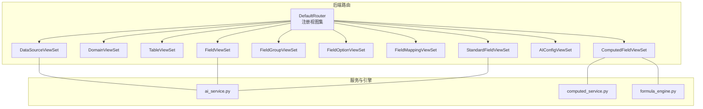
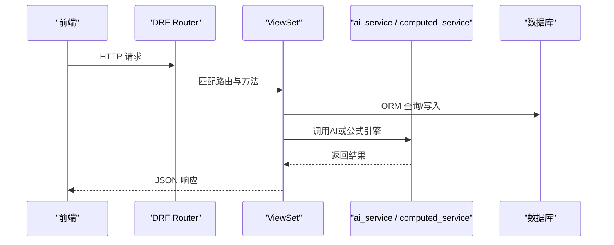
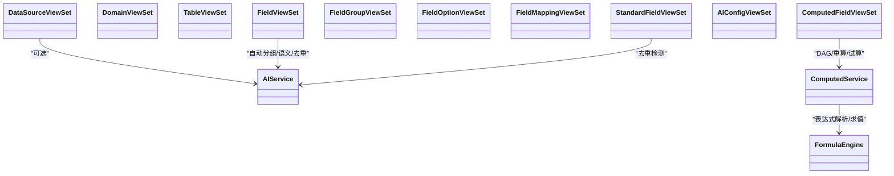

# 数据建模API

<cite>
**本文档引用的文件**   
- [urls.py](file://backend/apps/modeling/urls.py)
- [views.py](file://backend/apps/modeling/views.py)
- [models.py](file://backend/apps/modeling/models.py)
- [serializers.py](file://backend/apps/modeling/serializers.py)
- [ai_service.py](file://backend/apps/modeling/ai_service.py)
- [computed_service.py](file://backend/apps/modeling/computed_service.py)
- [formula_engine.py](file://backend/apps/modeling/formula_engine.py)
- [modeling.ts](file://frontend/src/api/modeling.ts)
</cite>

## 目录
1. [简介](#简介)
2. [项目结构](#项目结构)
3. [核心组件](#核心组件)
4. [架构总览](#架构总览)
5. [详细组件分析](#详细组件分析)
6. [依赖关系分析](#依赖关系分析)
7. [性能与扩展性](#性能与扩展性)
8. [故障排查指南](#故障排查指南)
9. [结论](#结论)
10. [附录：API参考与示例](#附录api参考与示例)

## 简介
本文件为 MetaData002 系统“数据建模模块”的完整 API 文档，覆盖域管理、表管理、字段管理、标准字段、字段分组、字段映射、AI配置与计算字段等全部端点。文档包含：
- HTTP方法与URL模式
- 请求参数与响应格式（含分页、过滤、搜索、排序）
- 错误处理规范
- 批量操作与复杂查询示例
- 字段映射配置、AI辅助功能与计算字段的用法
- 权限控制与认证要求说明

## 项目结构
后端采用 Django + Django REST Framework 的 ModelViewSet 路由注册方式，所有建模相关资源通过 DefaultRouter 统一挂载。前端通过 TypeScript 封装的调用层访问后端接口。

图表来源 
- [urls.py:1-20](file://backend/apps/modeling/urls.py#L1-L20)

章节来源
- [urls.py:1-20](file://backend/apps/modeling/urls.py#L1-L20)

## 核心组件
- 数据源 DataSource：多数据库类型连接、Schema/外部表枚举、连接测试
- 域 Domain：主数据域，启用前进行P0/P1/P2配置检查
- 表 Table：本地表/数据源表，支持预览、Excel导入导出、ER图坐标保存
- 字段 Field：物理字段属性、分组、去重值缓存、批量更新、AI语义识别
- 标准字段 StandardField：概念层一等公民，跨表去重归并，主字段自动分配
- 字段分组 FieldGroup：多层嵌套（最多3层），树形展示与重排
- 字段映射 FieldMapping：表间字段映射关系，支持AI推断
- AI配置 AIConfig：OpenAI兼容接口配置，提示词可配置
- 计算字段 ComputedField：Excel风格公式，DAG执行顺序，批量重算与试算

章节来源
- [models.py:1-489](file://backend/apps/modeling/models.py#L1-L489)
- [serializers.py:1-310](file://backend/apps/modeling/serializers.py#L1-L310)

## 架构总览
数据建模API遵循RESTful风格，使用DRF的ModelViewSet提供CRUD能力，并通过@action扩展业务动作。AI能力与公式引擎作为独立服务层被调用。

图表来源 
- [urls.py:1-20](file://backend/apps/modeling/urls.py#L1-L20)
- [views.py:1-800](file://backend/apps/modeling/views.py#L1-L800)

## 详细组件分析

### 数据源 Data Source
- 路由前缀：/data-sources/
- CRUD：GET/POST/PUT/PATCH/DELETE
- 常用查询参数：page, page_size, search(name, db_type, host), filters(status)
- 自定义动作：
  - GET /data-sources/{id}/test-connection/ 测试已有数据源连接
  - POST /data-sources/test-connection/ 测试未保存的连接参数
  - GET /data-sources/{id}/schemas/?include_counts=true|false 列出Schema及可选表计数
  - GET /data-sources/{id}/external-tables/?schema=&has_data=true|false 列出外部表

请求示例（测试连接参数）
- 方法：POST
- URL：/data-sources/test-connection/
- 请求体：{db_type, host, port, db_name, username, password}
- 响应：{success, message|error}

错误处理
- 不支持的数据库类型：400
- 连接失败：200但success=false（设计如此）

章节来源
- [views.py:31-147](file://backend/apps/modeling/views.py#L31-L147)
- [views.py:148-224](file://backend/apps/modeling/views.py#L148-L224)
- [views.py:226-324](file://backend/apps/modeling/views.py#L226-L324)

### 域 Domain
- 路由前缀：/domains/
- CRUD：GET/POST/PUT/PATCH/DELETE
- 查询参数：search(name, code), filters(status)
- 自定义动作：
  - GET /domains/{id}/check-config/ 返回8项检查结果与是否可启用
  - GET /domains/{id}/pk-status/ 返回各表主键与映射配置状态

启用拦截
- 将状态变更为active时，若存在P0失败项则抛出验证异常阻止启用

章节来源
- [views.py:327-468](file://backend/apps/modeling/views.py#L327-L468)
- [views.py:430-503](file://backend/apps/modeling/views.py#L430-L503)

### 表 Table
- 路由前缀：/tables/
- CRUD：GET/POST/PUT/PATCH/DELETE
- 查询参数：domain, type, status, search(name, code)
- 自定义动作：
  - PUT /tables/{id}/toggle-status/ 切换启用/停用（有映射时禁止停用）
  - GET /tables/{id}/preview-data/?limit=100 预览数据（本地或外部）
  - POST /tables/preview-excel/ 单文件预览解析列与样本行
  - POST /tables/import-excel/ 批量导入Excel建表
  - PUT /tables/{id}/save-er-position/ 保存ER图节点坐标
  - POST /tables/batch-reset-er-position/?domain= 批量重置坐标
  - POST /tables/{id}/set-primary/ 设置为主表

章节来源
- [views.py:504-917](file://backend/apps/modeling/views.py#L504-L917)

### 字段 Field
- 路由前缀：/fields/
- CRUD：GET/POST/PUT/PATCH/DELETE
- 查询参数：table, table__domain, status, field_type, group
- 批量与AI动作：
  - POST /fields/batch/?table= 批量保存字段名称
  - PUT /fields/batch-attributes/ 批量更新字段属性（含选项）
  - PUT /fields/{id}/deprecate/ 作废字段
  - POST /fields/ai-auto-group/?domain= AI自动分组
  - POST /fields/ai-semantic/?domain= AI语义识别（注释补全/翻译/歧义标注）
  - POST /fields/detect-standards/?domain= 检测跨表冗余建议
  - POST /fields/apply-standards/?domain= 应用去重（创建/复用标准字段）
  - GET /fields/standard-fields/?domain= 标准字段聚合视图
  - POST /fields/refresh-distinct/?domain= 刷新去重缓存
  - POST /fields/{id}/load-sample-values/ 加载单个字段样本值
  - GET /fields/manual-candidates/?domain= 手动新增标准字段的候选
  - GET /fields/archive-preview/?domain= 只读预览释放到档案的字段

章节来源
- [views.py:976-1491](file://backend/apps/modeling/views.py#L976-L1491)

### 字段分组 FieldGroup
- 路由前缀：/field-groups/
- CRUD：GET/POST/PATCH/DELETE
- 查询参数：domain, parent, tree=1（树形模式）
- 自定义动作：
  - POST /field-groups/reorder/ 同父级内批量重排序

章节来源
- [views.py:919-967](file://backend/apps/modeling/views.py#L919-L967)

### 枚举选项 FieldOption
- 路由前缀：/field-options/
- CRUD：GET/POST/DELETE
- 查询参数：field

章节来源
- [views.py:969-974](file://backend/apps/modeling/views.py#L969-L974)

### 字段映射 FieldMapping
- 路由前缀：/field-mappings/
- CRUD：GET/POST/DELETE
- 自定义动作：
  - POST /field-mappings/infer-mappings/?domain= AI推断映射建议

章节来源
- [views.py:1600-2253](file://backend/apps/modeling/views.py#L1600-L2253)

### 标准字段 StandardField
- 路由前缀：/standard-fields/
- CRUD：GET/POST/PUT/PATCH/DELETE
- 自定义动作：
  - GET /standard-fields/{id}/members-distinct/ 成员去重取值对比
  - POST /standard-fields/{id}/remove-member/ 移除成员
  - POST /standard-fields/{id}/add-member/ 添加成员
  - POST /standard-fields/{id}/set-primary-field/ 设置主字段（人工或自动）
  - POST /standard-fields/{id}/rename/ 重命名（级联）
  - POST /standard-fields/rename-solo/ 重命名独立物理字段

章节来源
- [views.py:1493-1600](file://backend/apps/modeling/views.py#L1493-L1600)

### AI配置 AIConfig
- 路由前缀：/ai-config/
- 自定义动作：
  - GET /ai-config/current/ 获取当前生效配置
  - PUT /ai-config/current/ 更新配置（空字符串不覆盖密钥）
  - POST /ai-config/test-connection/ 测试连接

章节来源
- [views.py:1600-2253](file://backend/apps/modeling/views.py#L1600-L2253)

### 计算字段 ComputedField
- 路由前缀：/computed-fields/
- CRUD：GET/POST/PUT/PATCH/DELETE
- 自定义动作：
  - POST /computed-fields/{id}/validate-formula/ 校验表达式（含函数参数数量）
  - POST /computed-fields/validate-expression/ 免实例表达式校验
  - POST /computed-fields/preview-data/ 免实例数据预览（基于去重值组合）
  - POST /computed-fields/generate-formula/ AI生成表达式
  - POST /computed-fields/{id}/trial-calculate/ 枚举试算
  - GET /computed-fields/dependency-graph/?domain= DAG拓扑图
  - POST /computed-fields/batch-recalculate/ 批量重算
  - GET /computed-fields/available-functions/ 可用函数清单
  - GET /computed-fields/available-references/?domain= 可用引用字段
  - 插件管理：/computed-fields/plugins/(list/upload/unload/reload/template)

章节来源
- [views.py:1600-2253](file://backend/apps/modeling/views.py#L1600-L2253)

## 依赖关系分析
- 路由注册：DefaultRouter将所有ViewSet按basename注册为RESTful路径
- 序列化器：不同动作使用不同Serializer以精简字段与增强校验
- AI服务：优先调用OpenAI兼容接口，失败回退启发式算法
- 公式引擎：词法分析→语法分析→AST求值，内置丰富函数库
- 计算字段服务：解析依赖、构建DAG、拓扑排序、批量重算与试算

图表来源 
- [urls.py:1-20](file://backend/apps/modeling/urls.py#L1-L20)
- [ai_service.py:1-800](file://backend/apps/modeling/ai_service.py#L1-L800)
- [computed_service.py:1-630](file://backend/apps/modeling/computed_service.py#L1-L630)
- [formula_engine.py:1-800](file://backend/apps/modeling/formula_engine.py#L1-L800)

章节来源
- [urls.py:1-20](file://backend/apps/modeling/urls.py#L1-L20)
- [ai_service.py:1-800](file://backend/apps/modeling/ai_service.py#L1-L800)
- [computed_service.py:1-630](file://backend/apps/modeling/computed_service.py#L1-L630)
- [formula_engine.py:1-800](file://backend/apps/modeling/formula_engine.py#L1-L800)

## 性能与扩展性
- 去重值缓存：字段distinct_values缓存减少频繁采样；支持强制刷新
- 批量操作：批量更新属性、批量导入Excel、批量重置坐标
- 分页与全量：前端对管理类默认拉取全量（避免分页截断）
- 连接池：动态别名连接临时创建，使用后清理
- 公式引擎：表达式预编译AST，支持IFERROR惰性求值，避免无效计算

[本节为通用指导，无需特定文件来源]

## 故障排查指南
- 数据源连接失败：检查db_type、host/port/db_name/用户名密码；Oracle需service_name；SQL Server需ODBC驱动
- 表停用失败：存在字段映射时需先解除映射
- 启用域失败：存在P0配置项失败（如缺少主表、主键为空、标准编码重复等）
- AI生成失败：未配置API Key或网络不可达；查看提示词与模型配置
- 公式校验失败：检查函数名、参数个数、字段引用格式{表名.字段名}
- 循环依赖：计算字段之间形成环，需调整依赖关系

章节来源
- [views.py:31-147](file://backend/apps/modeling/views.py#L31-L147)
- [views.py:690-722](file://backend/apps/modeling/views.py#L690-L722)
- [views.py:430-468](file://backend/apps/modeling/views.py#L430-L468)
- [ai_service.py:1-800](file://backend/apps/modeling/ai_service.py#L1-L800)
- [formula_engine.py:1-800](file://backend/apps/modeling/formula_engine.py#L1-L800)

## 结论
本API体系围绕“域-表-字段-标准字段-映射-AI-计算字段”的主数据建模流程展开，提供完善的CRUD、批量操作、AI辅助与公式计算能力。通过清晰的错误处理与性能优化策略，满足企业级数据建模需求。

[本节为总结，无需特定文件来源]

## 附录：API参考与示例

### 通用规范
- 分页：page, page_size（部分前端调用使用page_size=100000以拉全量）
- 搜索：search（字段由ViewSet定义）
- 过滤：filterset_fields（如status、domain、type等）
- 排序：按默认排序（如created_at desc）
- 认证与权限：由全局中间件控制（本仓库未暴露具体实现）

### 数据源
- GET /data-sources/ 列表
- POST /data-sources/ 创建
- PUT /data-sources/{id}/ 更新
- DELETE /data-sources/{id}/ 删除
- GET /data-sources/{id}/test-connection/ 测试连接
- POST /data-sources/test-connection/ 测试参数
- GET /data-sources/{id}/schemas/?include_counts=true 列出Schema
- GET /data-sources/{id}/external-tables/?schema=&has_data=true 列出外部表

章节来源
- [views.py:31-147](file://backend/apps/modeling/views.py#L31-L147)
- [views.py:148-224](file://backend/apps/modeling/views.py#L148-L224)
- [views.py:226-324](file://backend/apps/modeling/views.py#L226-L324)

### 域
- GET /domains/ 列表
- POST /domains/ 创建
- PUT /domains/{id}/ 更新
- PATCH /domains/{id}/ 部分更新
- DELETE /domains/{id}/ 删除
- GET /domains/{id}/check-config/ 配置检查
- GET /domains/{id}/pk-status/ 主键与映射状态

章节来源
- [views.py:430-503](file://backend/apps/modeling/views.py#L430-L503)

### 表
- GET /tables/ 列表
- POST /tables/ 创建
- PUT /tables/{id}/ 更新
- PATCH /tables/{id}/ 部分更新
- DELETE /tables/{id}/ 删除
- PUT /tables/{id}/toggle-status/ 切换状态
- GET /tables/{id}/preview-data/?limit=100 预览数据
- POST /tables/preview-excel/ 预览Excel
- POST /tables/import-excel/ 导入Excel
- PUT /tables/{id}/save-er-position/ 保存坐标
- POST /tables/batch-reset-er-position/?domain= 重置坐标
- POST /tables/{id}/set-primary/ 设为主表

章节来源
- [views.py:504-917](file://backend/apps/modeling/views.py#L504-L917)

### 字段
- GET /fields/ 列表
- POST /fields/ 创建
- PUT /fields/{id}/ 更新
- PATCH /fields/{id}/ 部分更新
- DELETE /fields/{id}/ 删除
- POST /fields/batch/?table= 批量保存名称
- PUT /fields/batch-attributes/ 批量更新属性
- PUT /fields/{id}/deprecate/ 作废
- POST /fields/ai-auto-group/?domain= AI自动分组
- POST /fields/ai-semantic/?domain= AI语义识别
- POST /fields/detect-standards/?domain= 检测标准字段
- POST /fields/apply-standards/?domain= 应用去重
- GET /fields/standard-fields/?domain= 标准字段聚合
- POST /fields/refresh-distinct/?domain= 刷新去重缓存
- POST /fields/{id}/load-sample-values/ 加载样本值
- GET /fields/manual-candidates/?domain= 手动候选
- GET /fields/archive-preview/?domain= 档案预览

章节来源
- [views.py:976-1491](file://backend/apps/modeling/views.py#L976-L1491)

### 字段分组
- GET /field-groups/ 列表
- POST /field-groups/ 创建
- PATCH /field-groups/{id}/ 更新
- DELETE /field-groups/{id}/ 删除
- POST /field-groups/reorder/ 重排序

章节来源
- [views.py:919-967](file://backend/apps/modeling/views.py#L919-L967)

### 枚举选项
- GET /field-options/ 列表
- POST /field-options/ 创建
- DELETE /field-options/{id}/ 删除

章节来源
- [views.py:969-974](file://backend/apps/modeling/views.py#L969-L974)

### 字段映射
- GET /field-mappings/ 列表
- POST /field-mappings/ 创建
- DELETE /field-mappings/{id}/ 删除
- POST /field-mappings/infer-mappings/?domain= AI推断映射

章节来源
- [views.py:1600-2253](file://backend/apps/modeling/views.py#L1600-L2253)

### 标准字段
- GET /standard-fields/ 列表
- POST /standard-fields/ 创建
- PUT /standard-fields/{id}/ 更新
- PATCH /standard-fields/{id}/ 部分更新
- DELETE /standard-fields/{id}/ 删除
- GET /standard-fields/{id}/members-distinct/ 成员去重
- POST /standard-fields/{id}/remove-member/ 移除成员
- POST /standard-fields/{id}/add-member/ 添加成员
- POST /standard-fields/{id}/set-primary-field/ 设置主字段
- POST /standard-fields/{id}/rename/ 重命名
- POST /standard-fields/rename-solo/ 重命名独立字段

章节来源
- [views.py:1493-1600](file://backend/apps/modeling/views.py#L1493-L1600)

### AI配置
- GET /ai-config/current/ 获取当前配置
- PUT /ai-config/current/ 更新配置
- POST /ai-config/test-connection/ 测试连接

章节来源
- [views.py:1600-2253](file://backend/apps/modeling/views.py#L1600-L2253)

### 计算字段
- GET /computed-fields/ 列表
- POST /computed-fields/ 创建
- PUT /computed-fields/{id}/ 更新
- PATCH /computed-fields/{id}/ 部分更新
- DELETE /computed-fields/{id}/ 删除
- POST /computed-fields/{id}/validate-formula/ 校验表达式
- POST /computed-fields/validate-expression/ 表达式校验
- POST /computed-fields/preview-data/ 预览数据
- POST /computed-fields/generate-formula/ AI生成表达式
- POST /computed-fields/{id}/trial-calculate/ 枚举试算
- GET /computed-fields/dependency-graph/?domain= 依赖图
- POST /computed-fields/batch-recalculate/ 批量重算
- GET /computed-fields/available-functions/ 可用函数
- GET /computed-fields/available-references/?domain= 可用引用
- 插件：/computed-fields/plugins/(list/upload/unload/reload/template)

章节来源
- [views.py:1600-2253](file://backend/apps/modeling/views.py#L1600-L2253)

### 分页、过滤、搜索、排序规范
- 分页：page, page_size（前端常使用page_size=100000以拉全量）
- 搜索：search（由ViewSet.search_fields定义）
- 过滤：filterset_fields（如status、domain、type、group等）
- 排序：默认排序（如created_at desc），可按需要扩展

章节来源
- [modeling.ts:1-481](file://frontend/src/api/modeling.ts#L1-L481)

### 权限与认证
- 认证：由全局中间件控制（本仓库未暴露实现细节）
- 权限：按角色控制（本仓库未暴露实现细节）
- 建议：在网关或中间件层统一鉴权，敏感操作（如启用域、停用表）需二次确认

[本节为通用指导，无需特定文件来源]

### 典型JSON示例（节选）
- 数据源连接测试（POST /data-sources/test-connection/）
  - 请求体：{db_type:"postgresql", host:"127.0.0.1", port:5432, db_name:"mydb", username:"", password:""}
  - 响应：{success:true, message:"连接成功！postgresql://127.0.0.1:5432/mydb"}

- 域配置检查（GET /domains/{id}/check-config/）
  - 响应：{checks:[...], can_enable:true/false, p0_fail_count:N, p1_warn_count:N, p2_warn_count:N}

- 表状态切换（PUT /tables/{id}/toggle-status/）
  - 请求体：{status:"deprecated"}
  - 响应：TableListSerializer数据或错误信息

- 字段AI自动分组（POST /fields/ai-auto-group/?domain={id}）
  - 响应：{groups:[{group_id, name, field_ids:[...]}]}

- 计算字段表达式预览（POST /computed-fields/preview-data/）
  - 请求体：{expression:"IF({订单.金额}>1000,\"高\",\"低\")", domain:{id}, max_combinations:50}
  - 响应：{valid:true, errors:[], columns:["订单.金额"], rows:[{inputs:{...}, output:"高", error:null}], total_possible:N, truncated:false}

章节来源
- [views.py:31-147](file://backend/apps/modeling/views.py#L31-L147)
- [views.py:430-468](file://backend/apps/modeling/views.py#L430-L468)
- [views.py:690-722](file://backend/apps/modeling/views.py#L690-L722)
- [views.py:1154-1181](file://backend/apps/modeling/views.py#L1154-L1181)
- [computed_service.py:508-590](file://backend/apps/modeling/computed_service.py#L508-L590)