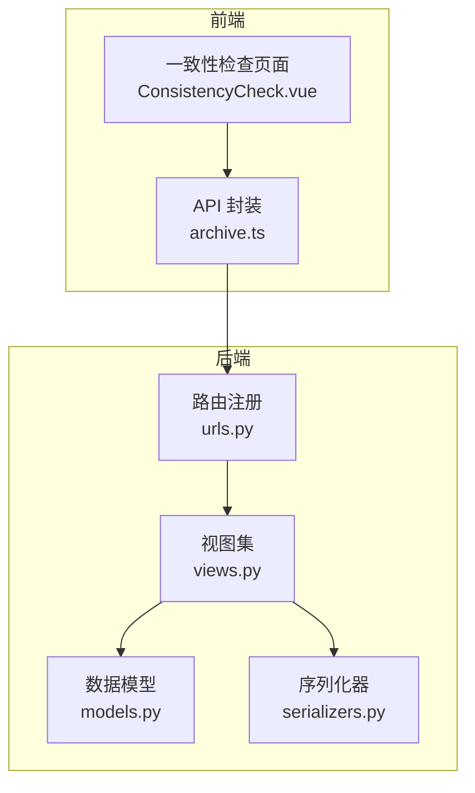
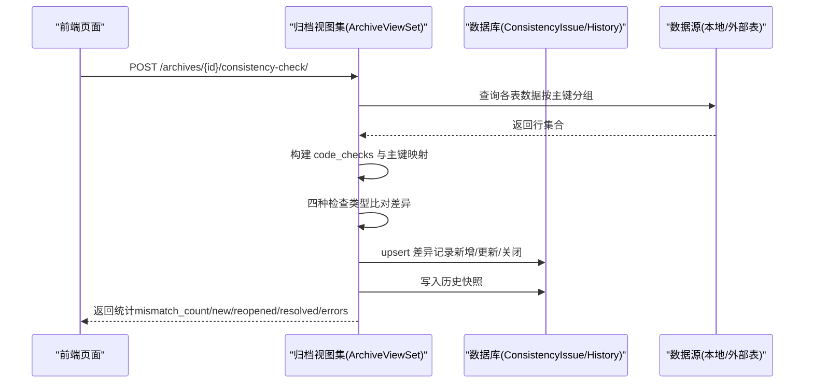
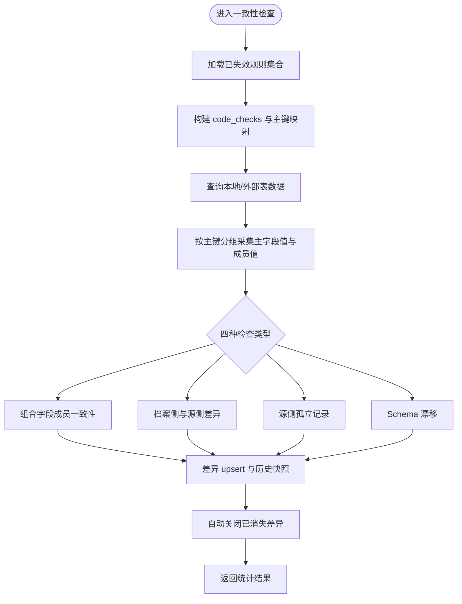
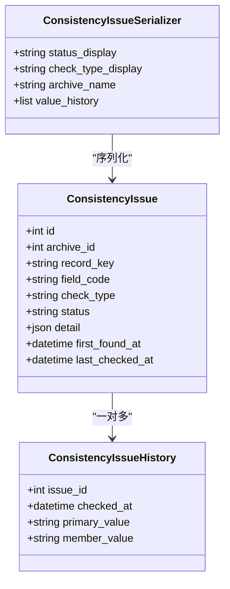
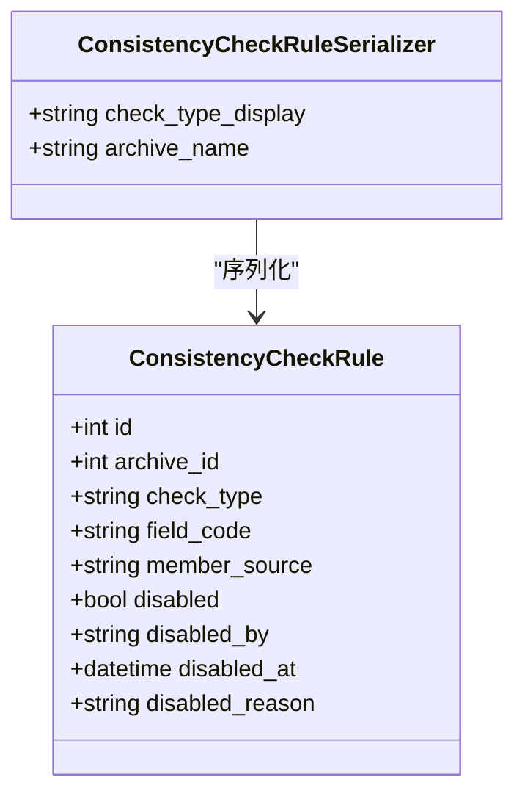
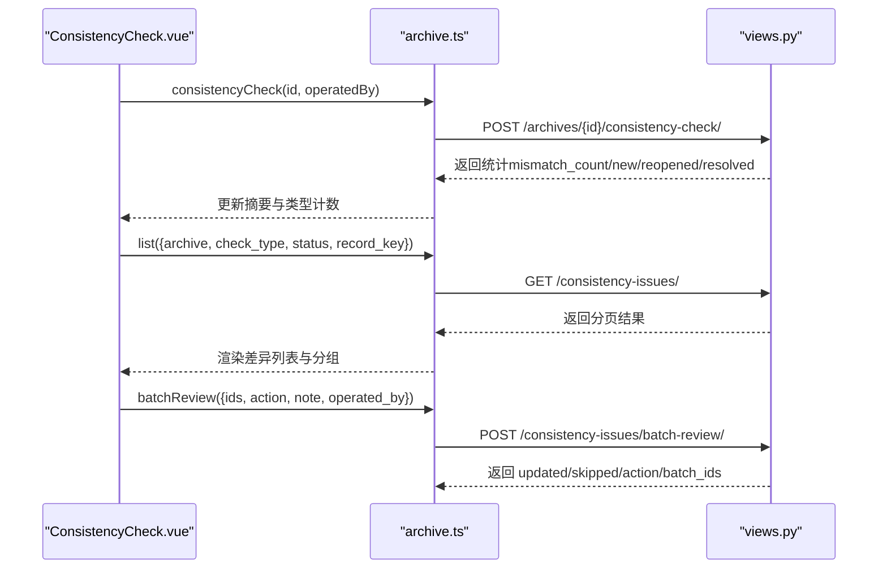
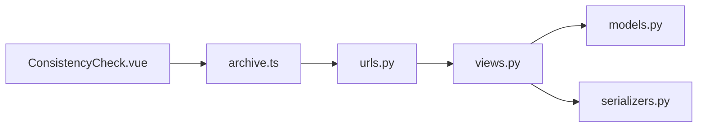

# 一致性检查API

<cite>
**本文引用的文件**   
- [backend/apps/archive/models.py](file://backend/apps/archive/models.py)
- [backend/apps/archive/views.py](file://backend/apps/archive/views.py)
- [backend/apps/archive/serializers.py](file://backend/apps/archive/serializers.py)
- [backend/apps/archive/urls.py](file://backend/apps/archive/urls.py)
- [frontend/src/api/archive.ts](file://frontend/src/api/archive.ts)
- [frontend/src/views/archive/ConsistencyCheck.vue](file://frontend/src/views/archive/ConsistencyCheck.vue)
</cite>

## 目录
1. [简介](#简介)
2. [项目结构](#项目结构)
3. [核心组件](#核心组件)
4. [架构总览](#架构总览)
5. [详细组件分析](#详细组件分析)
6. [依赖关系分析](#依赖关系分析)
7. [性能考量](#性能考量)
8. [故障排查指南](#故障排查指南)
9. [结论](#结论)
10. [附录：配置示例与最佳实践](#附录配置示例与最佳实践)

## 简介
本文件为 MetaData002 系统“一致性检查”功能的完整 API 文档，覆盖以下能力：
- 一致性检查规则的配置、执行与管理接口
- 检查任务的调度机制与执行状态监控
- 检查结果的问题记录与修复建议
- 批量检查与定时任务配置方法
- 检查规则的优先级与依赖关系管理
- 检查结果的统计分析与报告生成
- 问题解决的跟踪与闭环管理接口
- 完整的一致性检查配置示例与性能优化建议

该功能通过四种检查类型保障档案数据与源端建模结构的一致性，支持差异发现、审核、忽略、重新打开与自动消失的闭环管理。

## 项目结构
后端采用 Django + DRF 的分层设计：
- models.py：定义一致性相关的数据模型（差异记录、规则、历史快照等）
- views.py：实现一致性检查的执行逻辑、批量标记、规则管理等视图集
- serializers.py：序列化器用于请求/响应结构与校验
- urls.py：路由注册，暴露 RESTful 接口

前端通过 Vue 页面调用上述接口，提供一致性检查执行、结果展示、批量操作与规则失效管理的交互界面。

**图表来源** 
- [backend/apps/archive/urls.py:1-21](file://backend/apps/archive/urls.py#L1-L21)
- [backend/apps/archive/views.py:396-600](file://backend/apps/archive/views.py#L396-L600)
- [backend/apps/archive/models.py:274-379](file://backend/apps/archive/models.py#L274-L379)
- [backend/apps/archive/serializers.py:500-552](file://backend/apps/archive/serializers.py#L500-L552)
- [frontend/src/api/archive.ts:22-25](file://frontend/src/api/archive.ts#L22-L25)
- [frontend/src/views/archive/ConsistencyCheck.vue:335-351](file://frontend/src/views/archive/ConsistencyCheck.vue#L335-L351)

**章节来源**
- [backend/apps/archive/urls.py:1-21](file://backend/apps/archive/urls.py#L1-L21)
- [backend/apps/archive/views.py:396-600](file://backend/apps/archive/views.py#L396-L600)
- [backend/apps/archive/models.py:274-379](file://backend/apps/archive/models.py#L274-L379)
- [backend/apps/archive/serializers.py:500-552](file://backend/apps/archive/serializers.py#L500-L552)
- [frontend/src/api/archive.ts:22-25](file://frontend/src/api/archive.ts#L22-L25)
- [frontend/src/views/archive/ConsistencyCheck.vue:335-351](file://frontend/src/views/archive/ConsistencyCheck.vue#L335-L351)

## 核心组件
- 一致性差异记录（ConsistencyIssue）：记录不同检查类型的差异详情、状态、审核信息与历史快照
- 一致性检查规则（ConsistencyCheckRule）：按检查类型+字段+成员来源粒度控制规则生效/失效
- 一致性差异历史（ConsistencyIssueHistory）：每次检查的差异值快照，保留变化轨迹
- 变更批次与明细（ArchiveChangeBatch/Detail）：一致性审核动作落批与明细，形成闭环审计

这些模型在 views.py 中通过视图集暴露 CRUD 与批量操作接口，并在一致性检查执行时进行 upsert 与状态流转。

**章节来源**
- [backend/apps/archive/models.py:274-379](file://backend/apps/archive/models.py#L274-L379)
- [backend/apps/archive/serializers.py:500-552](file://backend/apps/archive/serializers.py#L500-L552)

## 架构总览
一致性检查的核心流程包括：
- 触发检查：前端调用归档视图的一致性检查端点
- 构建检查映射：根据域建模信息生成主字段与非主字段的比对映射
- 采集数据：从本地或外部数据源拉取表数据，按主键分组收集主字段值与成员值
- 比对差异：对四种检查类型分别计算差异并汇总
- 差异 upsert：将差异写入 ConsistencyIssue，更新历史快照，自动关闭已消失的差异
- 统计返回：返回本次检查的统计信息（新增、重现、消失、错误等）

**图表来源** 
- [backend/apps/archive/views.py:396-600](file://backend/apps/archive/views.py#L396-L600)
- [backend/apps/archive/views.py:1202-1234](file://backend/apps/archive/views.py#L1202-L1234)
- [backend/apps/archive/views.py:1259-1331](file://backend/apps/archive/views.py#L1259-L1331)

## 详细组件分析

### 一致性检查执行接口
- 端点：POST /archives/{id}/consistency-check/
- 功能：执行四种检查类型（组合字段成员一致性、档案侧与源侧差异、源侧孤立记录、Schema 漂移），upsert 差异记录并返回统计
- 输入参数：operated_by（可选）
- 输出统计：checked_fields、tables_checked、mismatch_count、mismatch_records、new_issues、reopened_issues、resolved_issues、open_total、errors、by_type、checked_at

**图表来源** 
- [backend/apps/archive/views.py:396-600](file://backend/apps/archive/views.py#L396-L600)
- [backend/apps/archive/views.py:1202-1234](file://backend/apps/archive/views.py#L1202-L1234)

**章节来源**
- [backend/apps/archive/views.py:396-600](file://backend/apps/archive/views.py#L396-L600)
- [backend/apps/archive/views.py:1202-1234](file://backend/apps/archive/views.py#L1202-L1234)

### 一致性差异记录列表与批量标记
- 列表端点：GET /consistency-issues/
- 过滤参数：archive、status、field_code、record_key、check_type
- 批量标记端点：POST /consistency-issues/batch-review/
- 动作：reviewed（已审核）、ignored（忽略）、reopen（重新打开）
- 行为：写变更日志批次（change_source='consistency'）与明细，返回 updated/skipped/action/batch_ids

**图表来源** 
- [backend/apps/archive/models.py:274-379](file://backend/apps/archive/models.py#L274-L379)
- [backend/apps/archive/serializers.py:500-552](file://backend/apps/archive/serializers.py#L500-L552)
- [backend/apps/archive/views.py:2203-2284](file://backend/apps/archive/views.py#L2203-L2284)

**章节来源**
- [backend/apps/archive/views.py:2203-2284](file://backend/apps/archive/views.py#L2203-L2284)
- [backend/apps/archive/serializers.py:500-552](file://backend/apps/archive/serializers.py#L500-L552)

### 一致性检查规则管理
- 列表端点：GET /consistency-rules/
- 过滤参数：archive、check_type、disabled
- 切换端点：POST /consistency-rules/{id}/toggle/
- 批量失效端点：POST /consistency-rules/disable/
- 批量启用端点：POST /consistency-rules/enable/
- 删除端点：DELETE /consistency-rules/{id}/

规则粒度：check_type + field_code + member_source，支持按档案维度控制生效/失效。

**图表来源** 
- [backend/apps/archive/models.py:334-362](file://backend/apps/archive/models.py#L334-L362)
- [backend/apps/archive/serializers.py:517-527](file://backend/apps/archive/serializers.py#L517-L527)
- [backend/apps/archive/views.py:2286-2362](file://backend/apps/archive/views.py#L2286-L2362)

**章节来源**
- [backend/apps/archive/views.py:2286-2362](file://backend/apps/archive/views.py#L2286-L2362)
- [backend/apps/archive/serializers.py:517-527](file://backend/apps/archive/serializers.py#L517-L527)

### 前端调用与交互
- 前端通过 archive.ts 封装一致性检查调用：POST /archives/{id}/consistency-check/
- ConsistencyCheck.vue 页面提供：
  - 执行检查按钮
  - 按检查类型分组展示差异
  - 批量标记（已审核/忽略/重新打开）
  - 失效规则弹窗与规则管理抽屉

**图表来源** 
- [frontend/src/api/archive.ts:22-25](file://frontend/src/api/archive.ts#L22-L25)
- [frontend/src/views/archive/ConsistencyCheck.vue:335-351](file://frontend/src/views/archive/ConsistencyCheck.vue#L335-L351)
- [backend/apps/archive/views.py:2203-2284](file://backend/apps/archive/views.py#L2203-L2284)

**章节来源**
- [frontend/src/api/archive.ts:22-25](file://frontend/src/api/archive.ts#L22-L25)
- [frontend/src/views/archive/ConsistencyCheck.vue:335-351](file://frontend/src/views/archive/ConsistencyCheck.vue#L335-L351)

## 依赖关系分析
- 视图集依赖模型：ConsistencyIssue、ConsistencyCheckRule、ConsistencyIssueHistory
- 视图集依赖序列化器：ConsistencyIssueSerializer、ConsistencyCheckRuleSerializer
- 路由注册统一暴露接口路径
- 前端依赖 API 封装与类型定义

**图表来源** 
- [backend/apps/archive/urls.py:1-21](file://backend/apps/archive/urls.py#L1-L21)
- [backend/apps/archive/views.py:396-600](file://backend/apps/archive/views.py#L396-L600)
- [backend/apps/archive/models.py:274-379](file://backend/apps/archive/models.py#L274-L379)
- [backend/apps/archive/serializers.py:500-552](file://backend/apps/archive/serializers.py#L500-L552)
- [frontend/src/api/archive.ts:22-25](file://frontend/src/api/archive.ts#L22-L25)
- [frontend/src/views/archive/ConsistencyCheck.vue:335-351](file://frontend/src/views/archive/ConsistencyCheck.vue#L335-L351)

**章节来源**
- [backend/apps/archive/urls.py:1-21](file://backend/apps/archive/urls.py#L1-L21)
- [backend/apps/archive/views.py:396-600](file://backend/apps/archive/views.py#L396-L600)
- [backend/apps/archive/models.py:274-379](file://backend/apps/archive/models.py#L274-L379)
- [backend/apps/archive/serializers.py:500-552](file://backend/apps/archive/serializers.py#L500-L552)
- [frontend/src/api/archive.ts:22-25](file://frontend/src/api/archive.ts#L22-L25)
- [frontend/src/views/archive/ConsistencyCheck.vue:335-351](file://frontend/src/views/archive/ConsistencyCheck.vue#L335-L351)

## 性能考量
- 数据拉取限制：查询本地/外部表时限制行数（如 LIMIT 1000），避免大表拖慢检查
- 批量写入：使用 bulk_create/bulk_update 减少数据库往返
- 索引与筛选：差异记录按 archive/status/check_type 建立索引，提升列表与过滤性能
- 预检模式：refresh-preview 提供零写入试算，便于确认影响范围后再执行同步
- 计算字段重算：同步后批量重算计算字段，失败不阻塞主流程

[本节为通用指导，无需具体文件引用]

## 故障排查指南
- 检查失败错误：查看返回统计中的 errors 数组，定位具体表或数据源异常
- 差异未出现：确认对应规则未被失效（ConsistencyCheckRule.disabled=True）
- 差异未关闭：检查是否仍有数据差异；若已消失则自动关闭
- 批量标记失败：确认 ids 非空且 action 合法（reviewed/ignored/reopen）
- 规则切换无效：确认参数 archive、check_type、field_code、member_source 正确

**章节来源**
- [backend/apps/archive/views.py:396-600](file://backend/apps/archive/views.py#L396-L600)
- [backend/apps/archive/views.py:2203-2284](file://backend/apps/archive/views.py#L2203-L2284)
- [backend/apps/archive/views.py:2286-2362](file://backend/apps/archive/views.py#L2286-L2362)

## 结论
一致性检查功能通过四种检查类型全面保障档案数据与源端建模结构的一致性，提供差异发现、审核、忽略、重新打开与自动消失的闭环管理。配合规则失效管理与变更日志批次，形成可追溯、可审计、可扩展的质量保障体系。

[本节为总结性内容，无需具体文件引用]

## 附录：配置示例与最佳实践

### 一致性检查规则配置示例
- 失效某类型规则：POST /consistency-rules/disable/
  - 参数：archive、check_type、field_code（可选）、member_source（可选）、reason（可选）、operated_by（可选）
- 恢复规则：POST /consistency-rules/enable/
  - 参数：archive、check_type、field_code（可选）、member_source（可选）
- 切换规则状态：POST /consistency-rules/{id}/toggle/
  - 参数：operated_by（可选）、reason（可选）

**章节来源**
- [backend/apps/archive/views.py:2286-2362](file://backend/apps/archive/views.py#L2286-L2362)
- [backend/apps/archive/serializers.py:517-527](file://backend/apps/archive/serializers.py#L517-L527)

### 批量检查与定时任务配置方法
- 批量检查：前端调用 POST /archives/{id}/consistency-check/，支持 operated_by 标识
- 定时任务：可通过后台任务框架（如 Celery/Django-Q）周期性触发同一端点，结合 cron 或调度器配置频率
- 预检优先：先调用 refresh-preview 评估影响范围，再决定是否执行同步或检查

**章节来源**
- [frontend/src/api/archive.ts:22-25](file://frontend/src/api/archive.ts#L22-L25)
- [backend/apps/archive/views.py:396-600](file://backend/apps/archive/views.py#L396-L600)

### 检查规则的优先级与依赖关系管理
- 规则粒度：check_type + field_code + member_source，支持细粒度控制
- 优先级：已失效的规则不参与新差异产生；未失效规则按检查类型顺序执行
- 依赖关系：组合字段成员一致性依赖主字段设置；Schema 漂移依赖建模结构活跃状态

**章节来源**
- [backend/apps/archive/models.py:334-362](file://backend/apps/archive/models.py#L334-L362)
- [backend/apps/archive/views.py:1136-1160](file://backend/apps/archive/views.py#L1136-L1160)

### 检查结果的统计分析与报告生成功能
- 统计字段：checked_fields、tables_checked、mismatch_count、mismatch_records、new_issues、reopened_issues、resolved_issues、open_total、errors、by_type、checked_at
- 报告生成：可将统计与差异明细导出为 Excel（变更日志导出接口可用于辅助报告）

**章节来源**
- [backend/apps/archive/views.py:396-600](file://backend/apps/archive/views.py#L396-L600)
- [frontend/src/api/archive.ts:72-73](file://frontend/src/api/archive.ts#L72-L73)

### 问题解决的跟踪与闭环管理接口
- 批量标记：POST /consistency-issues/batch-review/，支持 reviewed/ignored/reopen
- 变更日志：一致性审核动作落批与明细，形成审计闭环
- 历史快照：ConsistencyIssueHistory 保留每次检查的差异值轨迹

**章节来源**
- [backend/apps/archive/views.py:2203-2284](file://backend/apps/archive/views.py#L2203-L2284)
- [backend/apps/archive/models.py:364-379](file://backend/apps/archive/models.py#L364-L379)

### 性能优化建议
- 限制查询行数：本地/外部表查询限制上限，避免全表扫描
- 批量写入：bulk_create/bulk_update 减少数据库往返
- 索引优化：差异记录按 archive/status/check_type 建索引
- 预检模式：refresh-preview 零写入试算，降低误操作风险
- 计算字段重算：失败不阻塞主流程，确保稳定性

[本节为通用指导，无需具体文件引用]