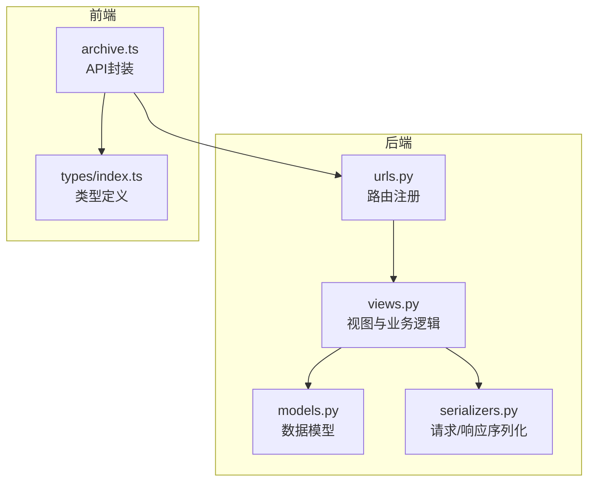
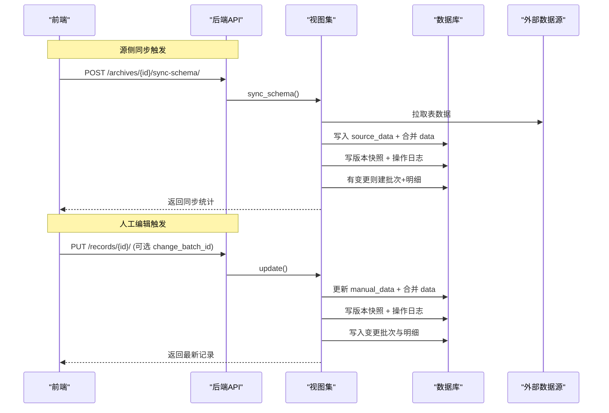
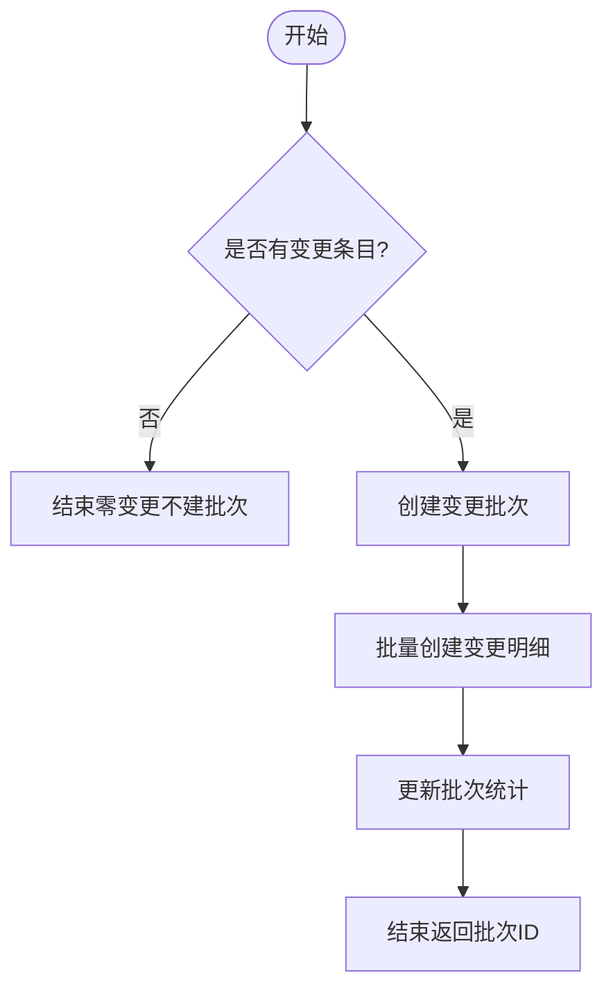
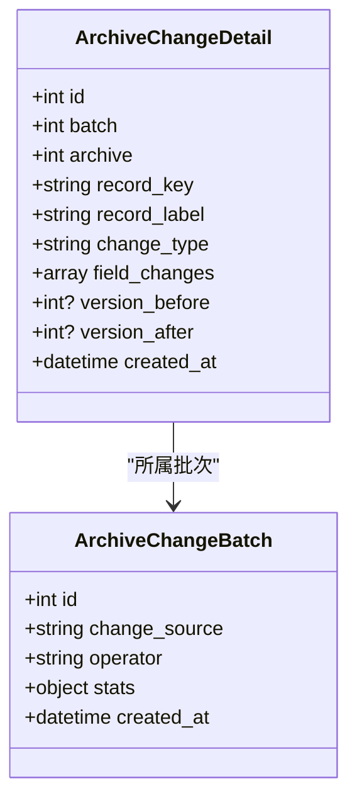
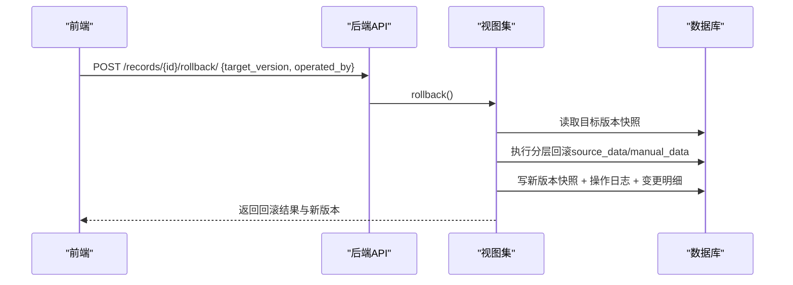
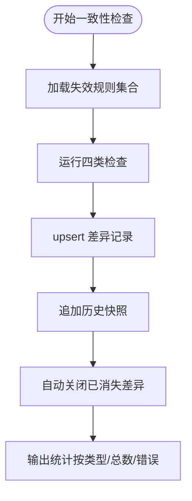
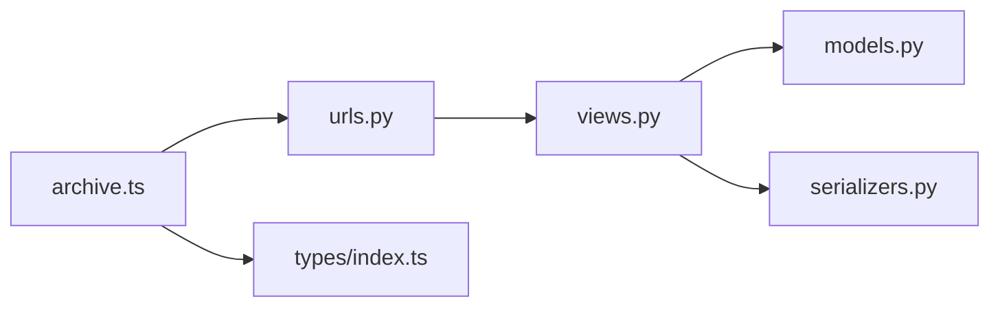

# 变更追踪API

<cite>
**本文引用的文件**   
- [backend/apps/archive/models.py](file://backend/apps/archive/models.py)
- [backend/apps/archive/views.py](file://backend/apps/archive/views.py)
- [backend/apps/archive/serializers.py](file://backend/apps/archive/serializers.py)
- [backend/apps/archive/urls.py](file://backend/apps/archive/urls.py)
- [frontend/src/api/archive.ts](file://frontend/src/api/archive.ts)
- [frontend/src/types/index.ts](file://frontend/src/types/index.ts)
</cite>

## 目录
1. [简介](#简介)
2. [项目结构](#项目结构)
3. [核心组件](#核心组件)
4. [架构总览](#架构总览)
5. [详细组件分析](#详细组件分析)
6. [依赖关系分析](#依赖关系分析)
7. [性能考量](#性能考量)
8. [故障排查指南](#故障排查指南)
9. [结论](#结论)
10. [附录：完整API清单与示例](#附录完整api清单与示例)

## 简介
本文件为 MetaData002 系统“变更追踪”功能的完整 API 文档，覆盖变更记录的创建、查询与审计；变更批次的管理与明细追踪；变更来源标识与操作者信息记录；变更历史统计与分析；回滚与撤销机制；变更通知与告警集成点；日志导出与报表生成。读者可据此快速对接后端接口并实现前端功能。

## 项目结构
变更追踪能力集中在 backend/apps/archive 模块中，包含数据模型、视图集、序列化器与路由注册；前端通过 TypeScript API 封装调用。

**图表来源** 
- [backend/apps/archive/models.py:1-379](file://backend/apps/archive/models.py#L1-L379)
- [backend/apps/archive/views.py:1-2487](file://backend/apps/archive/views.py#L1-L2487)
- [backend/apps/archive/serializers.py:1-552](file://backend/apps/archive/serializers.py#L1-L552)
- [backend/apps/archive/urls.py:1-21](file://backend/apps/archive/urls.py#L1-L21)
- [frontend/src/api/archive.ts:1-139](file://frontend/src/api/archive.ts#L1-L139)
- [frontend/src/types/index.ts:1-388](file://frontend/src/types/index.ts#L1-L388)

**章节来源**
- [backend/apps/archive/urls.py:1-21](file://backend/apps/archive/urls.py#L1-L21)
- [backend/apps/archive/models.py:1-379](file://backend/apps/archive/models.py#L1-L379)

## 核心组件
- 变更批次（ArchiveChangeBatch）：一次源侧同步或一次人工编辑为一个批次，零变更不建批次。
- 变更明细（ArchiveChangeDetail）：一条记录在一个批次中的字段级旧值→新值变更。
- 版本快照（ArchiveRecordVersion）：每次增删改/回滚/定版/模型同步均产生版本快照。
- 操作日志（ArchiveOperationLog）：记录关键操作的摘要。
- 一致性差异（ConsistencyIssue）：四类检查产生的差异清单及状态流转。
- 域变更统计（domain_change_stats）：按域聚合最近变更与数量。

**章节来源**
- [backend/apps/archive/models.py:206-272](file://backend/apps/archive/models.py#L206-L272)
- [backend/apps/archive/models.py:75-110](file://backend/apps/archive/models.py#L75-L110)
- [backend/apps/archive/models.py:174-204](file://backend/apps/archive/models.py#L174-L204)
- [backend/apps/archive/models.py:274-332](file://backend/apps/archive/models.py#L274-L332)
- [backend/apps/archive/views.py:2458-2487](file://backend/apps/archive/views.py#L2458-L2487)

## 架构总览
变更追踪贯穿“源数据同步”和“档案侧人工编辑”两条主线，统一落库到批次与明细，并通过版本快照与操作日志提供审计能力。一致性检查作为独立流程产出差异清单，支持批量审核与忽略。

**图表来源** 
- [backend/apps/archive/views.py:275-329](file://backend/apps/archive/views.py#L275-L329)
- [backend/apps/archive/views.py:1530-1561](file://backend/apps/archive/views.py#L1530-L1561)
- [backend/apps/archive/views.py:198-377](file://backend/apps/archive/views.py#L198-L377)
- [backend/apps/archive/views.py:1056-1085](file://backend/apps/archive/views.py#L1056-L1085)

## 详细组件分析

### 变更批次管理（ArchiveChangeBatch）
- 作用：将一次同步或一次人工编辑归并为一个批次，便于统计与整批回滚。
- 关键字段：change_source（sync/manual/consistency）、operator、stats（新增/修改/停用/复活计数）。
- 创建时机：
  - 源侧同步：_sync_data_from_sources 收尾时根据 change_entries 批量创建。
  - 人工编辑：UpdateSerializer 在保存时自动创建或挂入 start-manual 开启的批次。
  - 一致性审核：batch-review 按档案维度创建批次。
- 整批回滚：/change-batches/{id}/rollback/ 将受影响记录恢复到本批之前状态，跳过后续已编辑记录。

**图表来源** 
- [backend/apps/archive/views.py:1056-1085](file://backend/apps/archive/views.py#L1056-L1085)
- [backend/apps/archive/views.py:1848-1949](file://backend/apps/archive/views.py#L1848-L1949)

**章节来源**
- [backend/apps/archive/models.py:206-233](file://backend/apps/archive/models.py#L206-L233)
- [backend/apps/archive/views.py:1848-1949](file://backend/apps/archive/views.py#L1848-L1949)
- [backend/apps/archive/serializers.py:478-491](file://backend/apps/archive/serializers.py#L478-L491)

### 变更明细追踪（ArchiveChangeDetail）
- 作用：记录每条记录在批次中的字段级变更（旧值→新值），支持按记录/批次/类型筛选。
- 关键字段：record_key（主键快照）、record_label（组合字段值快照）、field_changes、version_before/version_after。
- 查询过滤：archive、batch、record、change_type、change_source、record_key。
- 导出：/change-details/export/?archive=... 导出 Excel（批次汇总+明细双 Sheet，上限5万行）。
- 单条回滚：/change-details/{id}/rollback/ 恢复到本条变更前状态（v18 语义优先使用 version_before 快照）。

**图表来源** 
- [backend/apps/archive/models.py:235-272](file://backend/apps/archive/models.py#L235-L272)
- [backend/apps/archive/models.py:206-233](file://backend/apps/archive/models.py#L206-L233)

**章节来源**
- [backend/apps/archive/models.py:235-272](file://backend/apps/archive/models.py#L235-L272)
- [backend/apps/archive/views.py:1951-2103](file://backend/apps/archive/views.py#L1951-L2103)
- [backend/apps/archive/serializers.py:457-476](file://backend/apps/archive/serializers.py#L457-L476)

### 版本快照与回滚（ArchiveRecordVersion）
- 作用：对记录的每次增删改/回滚/定版/模型同步进行快照，支持对比与回滚。
- 操作类型：create/update/delete/rollback/pin/schema_sync。
- 版本对比：/records/{id}/versions/compare/?v1=&v2= 返回字段级差异。
- 回滚方式：
  - 按版本号：/records/{id}/rollback/ target_version
  - 按时间点：/records/{id}/rollback-to-change/ target_detail_id（恢复该明细对应的版本快照）
  - 整批撤销：/change-batches/{id}/rollback/ 撤销整批影响记录（跳过后续已编辑记录）
  - 单条明细回滚：/change-details/{id}/rollback/ 恢复到本条变更前状态

**图表来源** 
- [backend/apps/archive/views.py:1674-1693](file://backend/apps/archive/views.py#L1674-L1693)
- [backend/apps/archive/views.py:1694-1729](file://backend/apps/archive/views.py#L1694-L1729)
- [backend/apps/archive/views.py:2105-2201](file://backend/apps/archive/views.py#L2105-L2201)

**章节来源**
- [backend/apps/archive/models.py:75-110](file://backend/apps/archive/models.py#L75-L110)
- [backend/apps/archive/views.py:1637-1758](file://backend/apps/archive/views.py#L1637-L1758)
- [backend/apps/archive/serializers.py:381-433](file://backend/apps/archive/serializers.py#L381-L433)

### 操作日志与审计（ArchiveOperationLog）
- 作用：记录关键操作（创建/更新/删除/回滚/定版/取消定版/同步/模型同步）的摘要。
- 查询过滤：archive、operation_type、operator。
- 典型写入点：记录创建/更新/删除、版本定版/取消定版、同步刷新、回滚执行等。

**章节来源**
- [backend/apps/archive/models.py:174-204](file://backend/apps/archive/models.py#L174-L204)
- [backend/apps/archive/views.py:1768-1782](file://backend/apps/archive/views.py#L1768-L1782)
- [backend/apps/archive/serializers.py:445-454](file://backend/apps/archive/serializers.py#L445-L454)

### 一致性检查与差异清单（ConsistencyIssue）
- 检查类型：
  - composite_member：组合字段非主字段成员值≠主字段值
  - archive_source_diff：档案侧人工覆盖与源侧数据差异
  - orphan_source_record：源侧孤立记录（无法关联主表主键）
  - schema_drift：档案 schema 与建模结构不一致
- 规则失效：ConsistencyCheckRule 支持按 check_type + field_code + member_source 失效规则。
- 批量标记：/consistency-issues/batch-review/ reviewed/ignored/reopen，写入变更批次与明细。

**图表来源** 
- [backend/apps/archive/views.py:396-601](file://backend/apps/archive/views.py#L396-L601)
- [backend/apps/archive/views.py:2203-2284](file://backend/apps/archive/views.py#L2203-L2284)

**章节来源**
- [backend/apps/archive/models.py:274-332](file://backend/apps/archive/models.py#L274-L332)
- [backend/apps/archive/views.py:396-601](file://backend/apps/archive/views.py#L396-L601)
- [backend/apps/archive/serializers.py:500-527](file://backend/apps/archive/serializers.py#L500-L527)

### 域变更统计（domain_change_stats）
- 作用：返回每个域的档案数、最近变更时间、近7天变更数。
- 用途：域概览页展示变更活跃度。

**章节来源**
- [backend/apps/archive/views.py:2458-2487](file://backend/apps/archive/views.py#L2458-L2487)

## 依赖关系分析
- 视图层依赖模型层：变更批次、明细、版本、操作日志、一致性差异等。
- 序列化层负责请求/响应结构与只读字段控制。
- 路由层集中注册所有变更追踪相关端点。
- 前端通过 TypeScript API 封装调用，类型定义与后端一致。

**图表来源** 
- [backend/apps/archive/urls.py:1-21](file://backend/apps/archive/urls.py#L1-L21)
- [backend/apps/archive/views.py:1-23](file://backend/apps/archive/views.py#L1-L23)
- [backend/apps/archive/serializers.py:1-7](file://backend/apps/archive/serializers.py#L1-L7)
- [frontend/src/api/archive.ts:1-139](file://frontend/src/api/archive.ts#L1-L139)
- [frontend/src/types/index.ts:1-388](file://frontend/src/types/index.ts#L1-L388)

**章节来源**
- [backend/apps/archive/urls.py:1-21](file://backend/apps/archive/urls.py#L1-L21)
- [backend/apps/archive/views.py:1-23](file://backend/apps/archive/views.py#L1-L23)

## 性能考量
- 零变更不建批次：避免噪声数据，降低存储与查询压力。
- 批量写入：变更明细 bulk_create，减少数据库往返。
- 分页与过滤：列表接口支持分页与多条件过滤，建议前端按需分页。
- 导出限制：Excel 导出上限 50000 行，超出仅导最新，避免大对象阻塞。
- 计算字段重算：同步后异步重算，失败不阻断主流程。

[本节为通用指导，无需具体文件引用]

## 故障排查指南
- 同步失败：查看 sync-stats.errors 与 OperationLog（SYNC）；确认数据源连接与权限。
- 变更未落库：检查是否触发了变更条目（change_entries）；确认主键字段配置正确。
- 回滚无效：确认目标版本快照存在；若为存量历史明细无版本映射，需降级字段级回滚。
- 一致性差异过多：检查组合字段主字段设置；必要时禁用特定规则（ConsistencyCheckRule）。
- 导出异常：确认 archive 参数传入；注意文件名编码与浏览器下载行为。

**章节来源**
- [backend/apps/archive/views.py:296-329](file://backend/apps/archive/views.py#L296-L329)
- [backend/apps/archive/views.py:1056-1085](file://backend/apps/archive/views.py#L1056-L1085)
- [backend/apps/archive/views.py:2061-2103](file://backend/apps/archive/views.py#L2061-L2103)
- [backend/apps/archive/views.py:2203-2284](file://backend/apps/archive/views.py#L2203-L2284)

## 结论
变更追踪体系以“批次+明细+版本快照+操作日志”为核心，覆盖源侧同步与档案侧编辑全链路，提供完整的审计、回滚、统计与导出能力。结合一致性检查与规则失效机制，确保数据质量与可追溯性。

[本节为总结，无需具体文件引用]

## 附录：完整API清单与示例

### 路由与端点
- 变更批次
  - GET /change-batches/ 列表（支持 archive、change_source 过滤）
  - POST /change-batches/start-manual/ 开启人工批次
  - POST /change-batches/{id}/rollback/ 整批撤销
- 变更明细
  - GET /change-details/ 列表（支持 archive、batch、record、change_type、change_source、record_key）
  - GET /change-details/export/?archive=... 导出 Excel
  - POST /change-details/{id}/rollback/ 单条明细回滚
- 版本与回滚
  - GET /records/{id}/versions/ 版本历史
  - GET /records/{id}/versions/compare/?v1=&v2= 版本差异
  - POST /records/{id}/rollback/ 按版本回滚
  - POST /records/{id}/rollback-to-change/ 按时间点回滚
  - POST /records/{id}/pin/ 定版当前版本
- 操作日志
  - GET /operation-logs/ 列表（支持 archive、operation_type、operator）
- 一致性差异
  - GET /consistency-issues/ 列表（支持 archive、status、field_code、record_key、check_type）
  - POST /consistency-issues/batch-review/ 批量标记 reviewed/ignored/reopen
- 一致性规则
  - GET /consistency-rules/ 列表
  - POST /consistency-rules/disable/ 失效规则
  - POST /consistency-rules/enable/ 启用规则
  - POST /consistency-rules/{id}/toggle/ 切换状态
- 域变更统计
  - GET /domain-change-stats/ 域变更概况

**章节来源**
- [backend/apps/archive/urls.py:1-21](file://backend/apps/archive/urls.py#L1-L21)
- [backend/apps/archive/views.py:1848-2103](file://backend/apps/archive/views.py#L1848-L2103)
- [backend/apps/archive/views.py:2203-2362](file://backend/apps/archive/views.py#L2203-L2362)
- [backend/apps/archive/views.py:2458-2487](file://backend/apps/archive/views.py#L2458-L2487)

### 请求/响应要点
- 变更批次
  - 开启人工批次：{archive, operated_by}
  - 整批撤销：{operated_by}，返回 rolled_back_records、skipped_edited、skipped_deleted、skipped_legacy、batch_id
- 变更明细
  - 导出：?archive=...，返回 Excel Blob
  - 单条回滚：{operated_by}，返回 rolled_back_fields、batch_id、new_version、changes/message
- 版本与回滚
  - 版本历史：分页返回 VersionSerializer
  - 版本差异：{version_1, version_2, diff[]}
  - 按版本回滚：{target_version, operated_by}
  - 按时间点回滚：{target_detail_id, operated_by}
  - 定版：{operated_by, note}
- 操作日志
  - 列表：分页返回 OperationLogSerializer
- 一致性差异
  - 批量标记：{ids, action, note?, operated_by?}，返回 updated、skipped、action、batch_ids
- 一致性规则
  - 失效/启用/切换：按字段指定 archive、check_type、field_code、member_source、reason、operated_by
- 域变更统计
  - 返回 domain_id、domain_name、archive_count、last_change_at、change_count_7d

**章节来源**
- [backend/apps/archive/serializers.py:457-527](file://backend/apps/archive/serializers.py#L457-L527)
- [backend/apps/archive/views.py:1863-1949](file://backend/apps/archive/views.py#L1863-L1949)
- [backend/apps/archive/views.py:1974-2103](file://backend/apps/archive/views.py#L1974-L2103)
- [backend/apps/archive/views.py:1637-1758](file://backend/apps/archive/views.py#L1637-L1758)
- [backend/apps/archive/views.py:2222-2284](file://backend/apps/archive/views.py#L2222-L2284)
- [backend/apps/archive/views.py:2304-2362](file://backend/apps/archive/views.py#L2304-L2362)
- [backend/apps/archive/views.py:2458-2487](file://backend/apps/archive/views.py#L2458-L2487)

### 前端调用示例（TypeScript）
- 开启人工批次：changeLogApi.startManualBatch(archiveId, operatedBy)
- 导出变更日志：changeLogApi.exportExcel(archiveId)
- 整批撤销：changeLogApi.rollbackBatch(batchId, operatedBy)
- 单条明细回滚：changeLogApi.rollback(detailId, operatedBy)
- 版本历史与对比：archiveRecordApi.listVersions(id)、archiveRecordApi.compareVersions(id, v1, v2)
- 按版本/时间点回滚：archiveRecordApi.rollback(id, targetVersion, operatedBy)、archiveRecordApi.rollbackToChange(id, targetDetailId, operatedBy)
- 定版：archiveRecordApi.pinVersion(id, operatedBy, note)
- 一致性批量标记：consistencyApi.batchReview({ids, action, note, operated_by})
- 规则管理：consistencyRuleApi.disable/enable/toggle
- 域变更统计：domainChangeApi.stats()

**章节来源**
- [frontend/src/api/archive.ts:1-139](file://frontend/src/api/archive.ts#L1-L139)

### 数据模型速览
- 变更批次：ArchiveChangeBatch（change_source、operator、stats）
- 变更明细：ArchiveChangeDetail（record_key、record_label、field_changes、version_before/after）
- 版本快照：ArchiveRecordVersion（operation_type、change_summary、is_pinned）
- 操作日志：ArchiveOperationLog（operation_type、change_summary）
- 一致性差异：ConsistencyIssue（check_type、status、value_history）

**章节来源**
- [backend/apps/archive/models.py:206-332](file://backend/apps/archive/models.py#L206-L332)