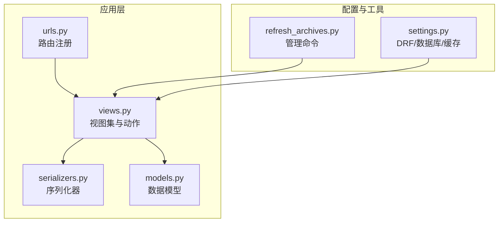
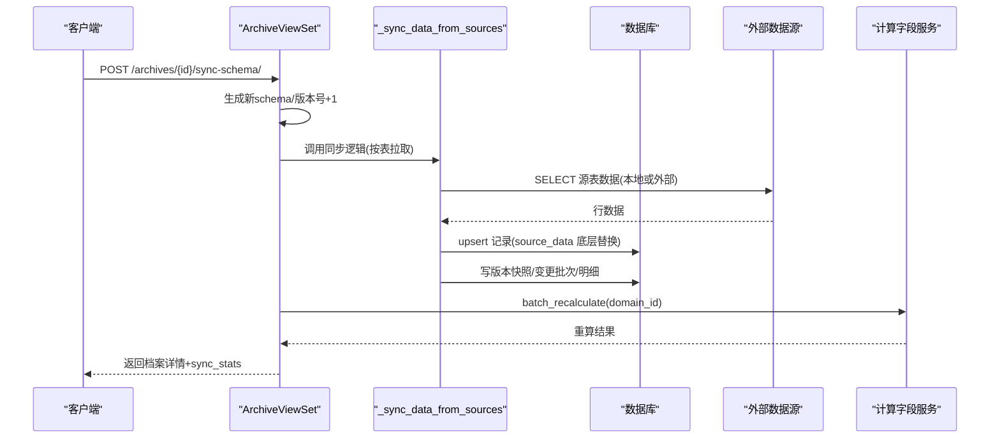
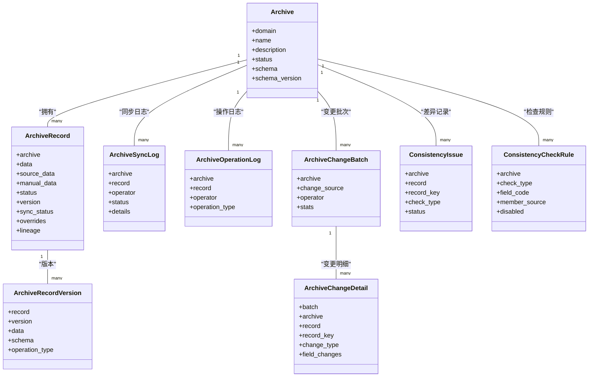

# 同步操作API

<cite>
**本文引用的文件**   
- [backend/apps/archive/models.py](file://backend/apps/archive/models.py)
- [backend/apps/archive/views.py](file://backend/apps/archive/views.py)
- [backend/apps/archive/serializers.py](file://backend/apps/archive/serializers.py)
- [backend/apps/archive/urls.py](file://backend/apps/archive/urls.py)
- [backend/config/settings.py](file://backend/config/settings.py)
- [backend/apps/archive/management/commands/refresh_archives.py](file://backend/apps/archive/management/commands/refresh_archives.py)
</cite>

## 目录
1. [简介](#简介)
2. [项目结构](#项目结构)
3. [核心组件](#核心组件)
4. [架构总览](#架构总览)
5. [详细组件分析](#详细组件分析)
6. [依赖关系分析](#依赖关系分析)
7. [性能考虑](#性能考虑)
8. [故障排查指南](#故障排查指南)
9. [结论](#结论)
10. [附录](#附录)

## 简介
本文件为 MetaData002 系统“数据同步”能力的完整 API 文档，聚焦档案（Archive）与源端数据的同步策略、任务执行与监控。涵盖：
- 同步策略：全量刷新、增量/差异比对、一致性检查（组合字段成员一致性、档案侧与源侧差异、孤立源记录、Schema 漂移）。
- 任务执行与监控：模型同步（schema 更新+拉数）、立即刷新（仅数据层换底重合并）、预检（dry-run 预览）、变更批次与明细、版本快照、回滚。
- 异步处理与进度：通过管理命令与外部调度器触发；当前实现以同步接口为主，可通过外部任务队列扩展。
- 错误恢复与重试：失败分类、日志记录、批次级撤销、单条/批量回滚、一致性差异审核闭环。
- 校验与完整性：一致性检查规则可配置失效；血缘追踪与人工覆盖保护。
- 日志与审计：同步日志、操作日志、变更批次/明细、版本历史。
- 性能监控与调优：统计指标、样本差异、告警项、计算字段重算结果。

## 项目结构
后端采用 Django + DRF 的模块化设计，档案模块位于 apps/archive，包含模型、视图、序列化器与路由；设置文件定义数据库、缓存、分页与 DRF 规范；提供管理命令用于外部调度刷新。

图表来源
- [backend/apps/archive/views.py:1-120](file://backend/apps/archive/views.py#L1-L120)
- [backend/apps/archive/serializers.py:1-120](file://backend/apps/archive/serializers.py#L1-L120)
- [backend/apps/archive/models.py:1-120](file://backend/apps/archive/models.py#L1-L120)
- [backend/apps/archive/urls.py:1-21](file://backend/apps/archive/urls.py#L1-L21)
- [backend/config/settings.py:90-120](file://backend/config/settings.py#L90-L120)
- [backend/apps/archive/management/commands/refresh_archives.py:1-39](file://backend/apps/archive/management/commands/refresh_archives.py#L1-L39)

章节来源
- [backend/apps/archive/urls.py:1-21](file://backend/apps/archive/urls.py#L1-L21)
- [backend/config/settings.py:90-120](file://backend/config/settings.py#L90-L120)

## 核心组件
- 档案与记录
  - Archive：档案配置，含 schema 快照与版本号。
  - ArchiveRecord：主数据实例，双层存储 source_data（源底层）+ manual_data（人工覆盖），data 为合并物化结果，含 sync_status、overrides、lineage。
- 版本与审计
  - ArchiveRecordVersion：版本快照，支持对比与回滚。
  - ArchiveOperationLog：操作日志（创建/更新/删除/同步/回滚等）。
  - ArchiveChangeBatch / ArchiveChangeDetail：变更批次与明细，统一记录源侧同步与人工编辑。
- 同步与一致性
  - ArchiveSyncLog：同步日志（状态、详情、时间）。
  - ConsistencyIssue / ConsistencyCheckRule / ConsistencyIssueHistory：一致性差异与规则失效管理。
- API 暴露
  - ArchiveApi：对外数据服务 API 配置（路径、暴露字段、筛选条件、授权角色）。

章节来源
- [backend/apps/archive/models.py:5-120](file://backend/apps/archive/models.py#L5-L120)
- [backend/apps/archive/models.py:112-204](file://backend/apps/archive/models.py#L112-L204)
- [backend/apps/archive/models.py:206-332](file://backend/apps/archive/models.py#L206-L332)
- [backend/apps/archive/models.py:334-379](file://backend/apps/archive/models.py#L334-L379)
- [backend/apps/archive/serializers.py:435-552](file://backend/apps/archive/serializers.py#L435-L552)

## 架构总览
档案同步的核心流程包括：
- Schema 同步：从域生成最新 schema，可选拉取实际数据并触发计算字段重算。
- 数据刷新：按表拉取源数据，写入 source_data 底层，合并 data，维护 lineage 与版本。
- 一致性检查：四类检查类型，支持规则失效与差异历史。
- 变更与回滚：批次化记录变更，支持整批/单条/时点回滚。
- 日志与监控：同步日志、操作日志、变更明细、版本历史、统计与样本。

图表来源
- [backend/apps/archive/views.py:275-329](file://backend/apps/archive/views.py#L275-L329)
- [backend/apps/archive/views.py:930-1085](file://backend/apps/archive/views.py#L930-L1085)
- [backend/apps/archive/views.py:1530-1560](file://backend/apps/archive/views.py#L1530-L1560)

章节来源
- [backend/apps/archive/views.py:275-329](file://backend/apps/archive/views.py#L275-L329)
- [backend/apps/archive/views.py:930-1085](file://backend/apps/archive/views.py#L930-L1085)

## 详细组件分析

### 同步策略与接口

- 模型同步（Schema 更新+拉数）
  - 接口：POST /archives/{id}/sync-schema/
  - 行为：重新生成 schema，bump schema_version，拉取源数据，触发计算字段重算，记录操作日志。
  - 返回：档案详情 + sync_stats（新增/更新/停用/复活/错误/警告/一致性检查摘要）。
  - 适用场景：模型变更后的全量重建与数据拉取。

- 立即刷新（仅数据层换底重合并）
  - 接口：POST /archives/{id}/refresh-data/
  - 行为：不改变 schema，仅整层刷新 source_data，合并 data，重算计算字段，记录操作日志。
  - 适用场景：频繁数据刷新，避免 schema 变动开销。

- 刷新预检（dry-run）
  - 接口：GET /archives/{id}/refresh-preview/
  - 行为：零写入，对比 schema 变化与数据变化，统计将新增/更新/停用的记录数及字段变化样本，提示档案维护字段被波及情况。
  - 适用场景：确认刷新影响范围后再执行。

- 一致性检查
  - 接口：POST /archives/{id}/consistency-check/
  - 行为：四类检查（组合字段成员一致性、档案侧与源侧差异、孤立源记录、Schema 漂移），支持规则失效，产出差异记录与历史快照。
  - 适用场景：数据质量治理与问题发现。

章节来源
- [backend/apps/archive/views.py:275-329](file://backend/apps/archive/views.py#L275-L329)
- [backend/apps/archive/views.py:331-342](file://backend/apps/archive/views.py#L331-L342)
- [backend/apps/archive/views.py:344-394](file://backend/apps/archive/views.py#L344-L394)
- [backend/apps/archive/views.py:396-600](file://backend/apps/archive/views.py#L396-L600)

### 数据同步执行流程

- 核心同步方法
  - _sync_data_from_sources：按域内表顺序（主表优先）拉取数据，构建 code→物理列映射，upsert 记录，维护 lineage，统计变更，清理停用记录，落变更批次与明细。
  - refresh_archive_data：封装同步与计算字段重算，记录操作日志，供接口与管理命令复用。

- 数据读取
  - _query_local_table：本地表查询（LIMIT 1000）。
  - _query_external_table：外部数据源动态连接（PostgreSQL/MySQL/SQL Server/Oracle），按库类型构造 SQL。

- 合并与物化
  - _merge_record_data：source_data 底层 + manual_data 覆盖 + 计算字段保留，重建 lineage，清理非法键。

- 一致性检查辅助
  - _build_code_to_physical：code→物理列映射（主字段优先，非主成员仅检查不写入）。
  - _build_code_checks/_collect_check_values/_run_consistency_check：组合字段成员一致性检查。
  - _check_archive_source_diff/_check_orphan_source_records/_check_schema_drift：三类差异检查。

章节来源
- [backend/apps/archive/views.py:930-1085](file://backend/apps/archive/views.py#L930-L1085)
- [backend/apps/archive/views.py:1259-1331](file://backend/apps/archive/views.py#L1259-L1331)
- [backend/apps/archive/views.py:1332-1517](file://backend/apps/archive/views.py#L1332-L1517)
- [backend/apps/archive/views.py:1087-1134](file://backend/apps/archive/views.py#L1087-L1134)
- [backend/apps/archive/views.py:1136-1234](file://backend/apps/archive/views.py#L1136-L1234)
- [backend/apps/archive/views.py:602-787](file://backend/apps/archive/views.py#L602-L787)

### 变更批次与明细

- 变更批次（ArchiveChangeBatch）
  - 来源：SYNC（源侧同步）、MANUAL（人工编辑）、CONSISTENCY（一致性审核）。
  - 统计：新增/修改/停用/复活数量，明细计数。

- 变更明细（ArchiveChangeDetail）
  - 内容：记录标识、记录信息、变更类型、字段级旧值→新值、版本映射（version_before/version_after）。
  - 导出：Excel 导出（批次汇总+变更明细，上限 50000 行）。

章节来源
- [backend/apps/archive/models.py:206-272](file://backend/apps/archive/models.py#L206-L272)
- [backend/apps/archive/serializers.py:457-527](file://backend/apps/archive/serializers.py#L457-L527)
- [backend/apps/archive/views.py:1848-1949](file://backend/apps/archive/views.py#L1848-L1949)
- [backend/apps/archive/views.py:1951-2060](file://backend/apps/archive/views.py#L1951-L2060)

### 版本管理与回滚

- 版本快照（ArchiveRecordVersion）
  - 操作类型：create/update/delete/rollback/pin/schema_sync。
  - 功能：版本列表、差异对比、定版/取消定版。

- 回滚机制
  - 版本回滚：恢复到指定版本快照。
  - 时点回滚：基于变更明细 version_after 定位快照进行回滚。
  - 批次回滚：整批撤销，跳过后续编辑/已删除/存量无版本映射的记录。
  - 单条回滚：恢复到该条变更前状态（兼容存量字段级 old 值恢复）。

- 回滚执行器
  - _execute_field_rollback：按 ownership 分层写回（source→source_data，archive→manual_data/回落），合并物化，写版本快照/操作日志/变更明细。

章节来源
- [backend/apps/archive/models.py:75-110](file://backend/apps/archive/models.py#L75-L110)
- [backend/apps/archive/serializers.py:380-433](file://backend/apps/archive/serializers.py#L380-L433)
- [backend/apps/archive/views.py:1637-1757](file://backend/apps/archive/views.py#L1637-L1757)
- [backend/apps/archive/views.py:1694-1728](file://backend/apps/archive/views.py#L1694-L1728)
- [backend/apps/archive/views.py:1882-1949](file://backend/apps/archive/views.py#L1882-L1949)
- [backend/apps/archive/views.py:2061-2102](file://backend/apps/archive/views.py#L2061-L2102)
- [backend/apps/archive/views.py:2105-2200](file://backend/apps/archive/views.py#L2105-L2200)

### 一致性检查与规则管理

- 检查类型
  - composite_member：组合字段非主字段成员值≠主字段值。
  - archive_source_diff：档案侧人工覆盖与源侧数据差异。
  - orphan_source_record：源侧数据无法关联主表主键。
  - schema_drift：档案 schema 与建模结构不一致。

- 规则失效
  - 可按 check_type + field_code + member_source 失效特定规则，失效后不产生新差异。
  - 支持切换/批量启用/禁用。

- 差异记录与历史
  - 差异记录（ConsistencyIssue）：状态（open/reviewed/ignored/resolved）、审核备注、最近检查时间。
  - 历史快照（ConsistencyIssueHistory）：每次检查追加值历史。

章节来源
- [backend/apps/archive/models.py:274-332](file://backend/apps/archive/models.py#L274-L332)
- [backend/apps/archive/models.py:334-379](file://backend/apps/archive/models.py#L334-L379)
- [backend/apps/archive/views.py:396-600](file://backend/apps/archive/views.py#L396-L600)
- [backend/apps/archive/views.py:2203-2283](file://backend/apps/archive/views.py#L2203-L2283)
- [backend/apps/archive/views.py:2286-2362](file://backend/apps/archive/views.py#L2286-L2362)

### 同步日志与操作日志

- 同步日志（ArchiveSyncLog）
  - 状态：pending/success/partial/failed。
  - 详情：按表维度记录 status/message/conflicts。
  - 接口：只读列表，支持按档案/状态过滤。

- 操作日志（ArchiveOperationLog）
  - 类型：create/update/delete/rollback/pin/unpin/sync/schema_sync。
  - 接口：只读列表，支持按档案/操作类型/操作人过滤。

章节来源
- [backend/apps/archive/models.py:112-137](file://backend/apps/archive/models.py#L112-L137)
- [backend/apps/archive/models.py:174-204](file://backend/apps/archive/models.py#L174-L204)
- [backend/apps/archive/serializers.py:435-454](file://backend/apps/archive/serializers.py#L435-L454)
- [backend/apps/archive/views.py:1760-1782](file://backend/apps/archive/views.py#L1760-L1782)

### 外部调度与异步处理

- 管理命令
  - refresh_archives：遍历已发布档案，逐个执行数据刷新（source_data 整层拉取+合并+计算字段重算），输出统计与错误。
  - 参数：--archive-id 指定单个档案。

- 异步扩展建议
  - 当前接口为同步执行，适合中小规模；大规模可引入 Celery/RQ 等任务队列，将 _sync_data_from_sources 与 batch_recalculate 放入后台任务，提供任务 ID 与进度查询接口。

章节来源
- [backend/apps/archive/management/commands/refresh_archives.py:1-39](file://backend/apps/archive/management/commands/refresh_archives.py#L1-L39)
- [backend/apps/archive/views.py:1530-1560](file://backend/apps/archive/views.py#L1530-L1560)

## 依赖关系分析

图表来源
- [backend/apps/archive/models.py:5-120](file://backend/apps/archive/models.py#L5-L120)
- [backend/apps/archive/models.py:112-204](file://backend/apps/archive/models.py#L112-L204)
- [backend/apps/archive/models.py:206-332](file://backend/apps/archive/models.py#L206-L332)
- [backend/apps/archive/models.py:334-379](file://backend/apps/archive/models.py#L334-L379)

章节来源
- [backend/apps/archive/models.py:5-379](file://backend/apps/archive/models.py#L5-L379)

## 性能考虑
- 数据读取限制：本地/外部表查询默认 LIMIT 1000，避免大表一次性加载导致内存压力。
- 合并与物化：_merge_record_data 按 schema 逐字段合并，减少不必要写入；计算字段按需重算。
- 索引优化：对常用过滤字段建立索引（如 archive/status、created_at 等）。
- 批量操作：bulk_create/bulk_update 降低数据库往返次数。
- 外部连接：动态连接外部数据源，使用独立 alias 避免冲突，及时释放连接。
- 计算字段重算：在同步完成后统一触发，避免中间态多次重算。

章节来源
- [backend/apps/archive/views.py:1259-1331](file://backend/apps/archive/views.py#L1259-L1331)
- [backend/apps/archive/views.py:1332-1517](file://backend/apps/archive/views.py#L1332-L1517)
- [backend/config/settings.py:90-120](file://backend/config/settings.py#L90-L120)

## 故障排查指南
- 同步失败常见原因
  - 外部数据源连接失败：检查 db_type、host/port/db_name、驱动包安装。
  - 权限不足：写权限探测失败需确认账号具备 UPDATE/INSERT 权限。
  - 约束冲突：唯一约束/外键约束导致插入失败，需核对数据与约束。
  - 数据类型不匹配：字段类型与源数据不一致，需调整映射或清洗数据。
  - Schema 漂移：字段不存在或类型变化，需先执行 schema 同步。

- 错误分类与日志
  - 错误分类：permission/connection/constraint/data_type/verify/runtime/config。
  - 同步日志：ArchiveSyncLog.details 包含 phase/checks/summary/error_by_type/errors[:50]/diffs[:50]/finished_at。
  - 操作日志：ArchiveOperationLog.change_summary 记录关键步骤与统计。

- 恢复与重试
  - 批次回滚：整批撤销受影响记录，跳过后续编辑/已删除/存量无版本映射记录。
  - 单条/时点回滚：恢复到指定版本或变更明细前状态。
  - 一致性差异：批量标记 reviewed/ignored/reopen，形成闭环。

- 调试建议
  - 使用 refresh-preview 预检，确认影响范围。
  - 查看变更批次与明细，定位具体字段变化。
  - 检查一致性差异与规则失效配置，排除误报。

章节来源
- [backend/apps/archive/views.py:1530-1560](file://backend/apps/archive/views.py#L1530-L1560)
- [backend/apps/archive/views.py:1848-1949](file://backend/apps/archive/views.py#L1848-L1949)
- [backend/apps/archive/views.py:2203-2283](file://backend/apps/archive/views.py#L2203-L2283)

## 结论
MetaData002 的数据同步能力围绕“档案”这一核心实体，构建了完整的同步策略、执行流程、监控与恢复机制。通过双层存储、版本快照、变更批次与一致性检查，确保数据一致性与可追溯性。建议在大规模场景下引入异步任务队列以提升吞吐与稳定性，并结合外部调度器实现定时刷新与健康检查。

## 附录

### API 路由总览
- /archives：档案配置（CRUD + sync-schema/refresh-data/refresh-preview/consistency-check）
- /records：档案记录（禁止人工新增，支持更新/软删除/版本/回滚）
- /sync-logs：同步日志（只读）
- /operation-logs：操作日志（只读）
- /record-versions：全局版本（只读 + pin/unpin）
- /archive-apis：数据服务 API 管理
- /change-batches：变更批次（只读 + start-manual/rollback）
- /change-details：变更明细（只读 + export/rollback）
- /consistency-issues：一致性差异（只读 + batch-review）
- /consistency-rules：一致性规则（CRUD + toggle/disable/enable）

章节来源
- [backend/apps/archive/urls.py:1-21](file://backend/apps/archive/urls.py#L1-L21)

### 同步配置示例
- 环境变量
  - DJANGO_SECRET_KEY、DEBUG、ALLOWED_HOSTS
  - DB_NAME/USER/PASSWORD/HOST/PORT（默认 PostgreSQL）
  - REDIS_HOST/REDIS_PORT（缓存）
  - ARCHIVE_AUTO_REFRESH_MINUTES（自动刷新间隔，0=禁用）
- 数据源配置
  - db_type：postgresql/mysql/sqlserver/oracle
  - host/port/db_name/username/password
  - external_table_name/schema（按库类型适配）

章节来源
- [backend/config/settings.py:1-123](file://backend/config/settings.py#L1-L123)