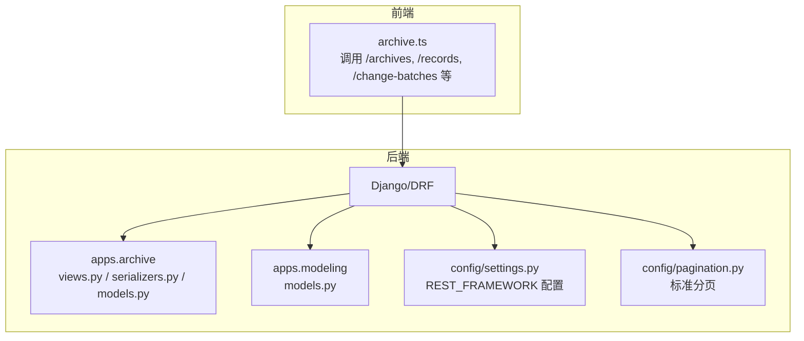
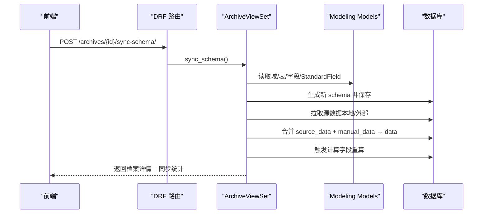
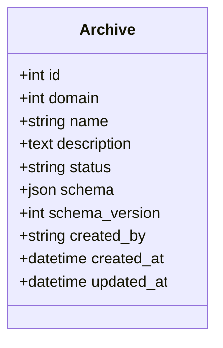
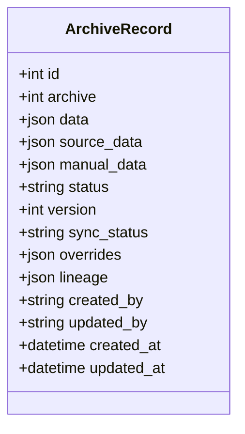
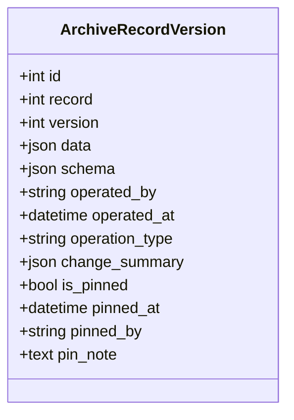
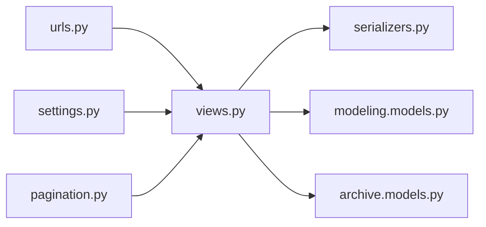

# 数据记录管理API

<cite>
**本文引用的文件**   
- [backend/apps/archive/models.py](file://backend/apps/archive/models.py)
- [backend/apps/archive/views.py](file://backend/apps/archive/views.py)
- [backend/apps/archive/serializers.py](file://backend/apps/archive/serializers.py)
- [backend/apps/archive/urls.py](file://backend/apps/archive/urls.py)
- [backend/apps/modeling/models.py](file://backend/apps/modeling/models.py)
- [backend/config/settings.py](file://backend/config/settings.py)
- [backend/config/pagination.py](file://backend/config/pagination.py)
- [frontend/src/api/archive.ts](file://frontend/src/api/archive.ts)
</cite>

## 目录
1. [简介](#简介)
2. [项目结构](#项目结构)
3. [核心组件](#核心组件)
4. [架构总览](#架构总览)
5. [详细组件分析](#详细组件分析)
6. [依赖关系分析](#依赖关系分析)
7. [性能考量](#性能考量)
8. [故障排查指南](#故障排查指南)
9. [结论](#结论)
10. [附录：接口清单与示例](#附录接口清单与示例)

## 简介
本文件为 MetaData002 系统“档案记录管理”的完整 API 文档，覆盖档案配置、档案记录的增删改查、批量导入/导出、查询与搜索、分页、数据同步（增量/全量）、权限控制与访问限制、错误处理与异常场景。文档面向技术与非技术读者，提供从高层架构到代码级实现细节的说明，并附带可视化图示与可追溯来源。

## 项目结构
后端采用 Django + DRF 架构，档案模块位于 apps.archive，建模模块位于 apps.modeling。路由通过 DefaultRouter 注册多个 ViewSet，统一暴露 RESTful 接口；序列化器负责字段校验与转换；模型定义数据表结构与业务约束。

**图表来源** 
- [backend/apps/archive/urls.py:1-21](file://backend/apps/archive/urls.py#L1-L21)
- [backend/config/settings.py:92-101](file://backend/config/settings.py#L92-L101)
- [backend/config/pagination.py:1-14](file://backend/config/pagination.py#L1-L14)

**章节来源**
- [backend/apps/archive/urls.py:1-21](file://backend/apps/archive/urls.py#L1-L21)
- [backend/config/settings.py:92-101](file://backend/config/settings.py#L92-L101)
- [backend/config/pagination.py:1-14](file://backend/config/pagination.py#L1-L14)

## 核心组件
- 档案配置（Archive）：每个域一个档案，包含 schema 快照与版本。
- 档案记录（ArchiveRecord）：主数据实例，双层存储（source_data + manual_data），合并物化 data，维护 lineage 与 overrides。
- 版本快照（ArchiveRecordVersion）：每次变更生成快照，支持定版与回滚。
- 同步日志（ArchiveSyncLog）：记录同步过程状态与详情。
- 操作日志（ArchiveOperationLog）：记录创建、更新、删除、回滚、同步等操作。
- 数据服务API（ArchiveApi）：对外暴露档案数据的接口配置（路径、暴露字段、筛选条件、角色授权）。
- 变更批次与明细（ArchiveChangeBatch / ArchiveChangeDetail）：记录源侧同步与人工编辑的变更，支持整批撤销与单条回滚。
- 一致性差异（ConsistencyIssue / ConsistencyCheckRule / History）：检查组合字段成员一致性、档案与源差异、孤立记录、schema 漂移等。

**章节来源**
- [backend/apps/archive/models.py:5-379](file://backend/apps/archive/models.py#L5-L379)

## 架构总览
档案记录管理的核心流程包括：
- Schema 同步与刷新：根据域建模生成/更新 schema，拉取源数据，重算计算字段。
- 记录生命周期：软删除、版本快照、回滚、定版。
- 变更追踪：批次化记录变更明细，支持按时间点或批次回滚。
- 一致性检查：多类型规则检查，结果 upsert 并保留历史轨迹。
- 数据服务API：基于 schema 暴露字段与筛选条件，配合角色授权进行访问控制。

**图表来源** 
- [backend/apps/archive/views.py:275-329](file://backend/apps/archive/views.py#L275-L329)
- [backend/apps/modeling/models.py:32-123](file://backend/apps/modeling/models.py#L32-L123)

## 详细组件分析

### 档案配置（Archive）
- 功能：CRUD、Schema 同步、数据刷新预检、一致性检查。
- 关键字段：domain、name、description、status、schema（JSON 快照）、schema_version。
- 行为：创建时自动生成 schema；同步时更新 schema 并拉取数据；预检仅读不写。

**图表来源** 
- [backend/apps/archive/models.py:5-31](file://backend/apps/archive/models.py#L5-L31)

**章节来源**
- [backend/apps/archive/models.py:5-31](file://backend/apps/archive/models.py#L5-L31)
- [backend/apps/archive/views.py:246-329](file://backend/apps/archive/views.py#L246-L329)

### 档案记录（ArchiveRecord）
- 功能：软删除、版本快照、回滚、定版、变更批次与明细。
- 关键字段：archive、data（合并物化）、source_data（底层）、manual_data（覆盖层）、status、version、sync_status、overrides、lineage。
- 行为：更新时按 ownership 分层写入；合并时 source_data 优先，archive 字段 manual_data 覆盖；计算字段不参与人工覆盖。

**图表来源** 
- [backend/apps/archive/models.py:33-73](file://backend/apps/archive/models.py#L33-L73)

**章节来源**
- [backend/apps/archive/models.py:33-73](file://backend/apps/archive/models.py#L33-L73)
- [backend/apps/archive/serializers.py:121-378](file://backend/apps/archive/serializers.py#L121-L378)

### 版本快照（ArchiveRecordVersion）
- 功能：记录每次操作的快照，支持对比、定版、回滚。
- 关键字段：record、version、data、schema、operated_by、operated_at、operation_type、change_summary、is_pinned、pinned_at、pinned_by、pin_note。

**图表来源** 
- [backend/apps/archive/models.py:75-110](file://backend/apps/archive/models.py#L75-L110)

**章节来源**
- [backend/apps/archive/models.py:75-110](file://backend/apps/archive/models.py#L75-L110)
- [backend/apps/archive/serializers.py:381-433](file://backend/apps/archive/serializers.py#L381-L433)

### 同步日志（ArchiveSyncLog）
- 功能：记录同步过程的状态与详情，便于审计与排障。
- 关键字段：archive、record、operator、status、details、started_at、finished_at。

**章节来源**
- [backend/apps/archive/models.py:112-137](file://backend/apps/archive/models.py#L112-L137)

### 操作日志（ArchiveOperationLog）
- 功能：记录创建、更新、删除、回滚、同步等操作，支持按档案与操作类型过滤。
- 关键字段：archive、record、operator、operation_type、change_summary、created_at。

**章节来源**
- [backend/apps/archive/models.py:174-204](file://backend/apps/archive/models.py#L174-L204)

### 数据服务API（ArchiveApi）
- 功能：配置对外暴露的档案数据接口，支持字段暴露、筛选条件、角色授权。
- 关键字段：archive、name、description、path、exposed_fields、filter_conditions、auth_roles、status。

**章节来源**
- [backend/apps/archive/models.py:139-172](file://backend/apps/archive/models.py#L139-L172)

### 变更批次与明细（ArchiveChangeBatch / ArchiveChangeDetail）
- 功能：记录源侧同步与人工编辑的变更，支持整批撤销与单条回滚。
- 关键字段：batch（archive、change_source、operator、stats、created_at）、detail（record_key、record_label、change_type、field_changes、version_before、version_after）。

**章节来源**
- [backend/apps/archive/models.py:206-272](file://backend/apps/archive/models.py#L206-L272)

### 一致性差异（ConsistencyIssue / Rule / History）
- 功能：检查组合字段成员一致性、档案与源差异、孤立记录、schema 漂移；支持失效规则与历史快照。
- 关键字段：issue（archive、record_key、field_code、check_type、primary_value、member_value、status、review_note）、rule（disabled、disabled_by、disabled_reason）、history（checked_at、values）。

**章节来源**
- [backend/apps/archive/models.py:274-379](file://backend/apps/archive/models.py#L274-L379)

## 依赖关系分析
- 视图层依赖序列化器进行输入校验与输出格式化。
- 视图层依赖建模模块获取域、表、字段、标准字段信息以生成 schema 与映射。
- 路由层通过 DefaultRouter 注册各 ViewSet，暴露 RESTful 端点。
- 配置层设置 DRF 分页、过滤器、OpenAPI 文档等。

**图表来源** 
- [backend/apps/archive/urls.py:1-21](file://backend/apps/archive/urls.py#L1-L21)
- [backend/config/settings.py:92-101](file://backend/config/settings.py#L92-L101)
- [backend/config/pagination.py:1-14](file://backend/config/pagination.py#L1-L14)

**章节来源**
- [backend/apps/archive/urls.py:1-21](file://backend/apps/archive/urls.py#L1-L21)
- [backend/config/settings.py:92-101](file://backend/config/settings.py#L92-L101)
- [backend/config/pagination.py:1-14](file://backend/config/pagination.py#L1-L14)

## 性能考量
- 分页：默认每页 20 条，支持 page_size 覆盖，上限 100000。
- 查询优化：select_related、prefetch_related、只读字段投影。
- 批量操作：bulk_create/bulk_update 减少数据库往返。
- 计算字段重算：仅在必要时触发，避免阻塞主流程。
- 外部数据源连接：动态创建临时连接，使用完毕后清理。

**章节来源**
- [backend/config/pagination.py:1-14](file://backend/config/pagination.py#L1-L14)
- [backend/apps/archive/views.py:1259-1331](file://backend/apps/archive/views.py#L1259-L1331)

## 故障排查指南
- 同步失败：查看 SyncLog 的 details 与 errors，确认数据源连接与表结构。
- 一致性差异：检查 check_type 与 rule 失效配置，定位具体字段与成员来源。
- 版本回滚：确认目标版本存在且未被后续编辑覆盖，注意存量明细无版本映射的情况。
- 权限问题：检查 ArchiveApi 的 auth_roles 与当前用户角色是否匹配。

**章节来源**
- [backend/apps/archive/views.py:1760-1775](file://backend/apps/archive/views.py#L1760-L1775)
- [backend/apps/archive/views.py:2203-2284](file://backend/apps/archive/views.py#L2203-L2284)

## 结论
MetaData002 的档案记录管理提供了完整的 CRUD、同步、版本控制、变更追踪与一致性检查能力。通过双层存储与合并逻辑，确保源数据与人工覆盖的清晰边界；通过批次化变更与回滚机制，提升数据治理的可操作性与安全性。建议在生产环境中合理配置权限与监控，结合一致性检查与操作日志，保障数据质量与可追溯性。

## 附录：接口清单与示例

### 档案配置（/archives）
- 列表：GET /archives/
- 详情：GET /archives/{id}/
- 创建：POST /archives/
- 更新：PUT /archives/{id}/
- 删除：DELETE /archives/{id}/
- Schema 同步：POST /archives/{id}/sync-schema/
- 数据刷新：POST /archives/{id}/refresh-data/
- 刷新预检：GET /archives/{id}/refresh-preview/
- 一致性检查：POST /archives/{id}/consistency-check/

**章节来源**
- [backend/apps/archive/urls.py:1-21](file://backend/apps/archive/urls.py#L1-L21)
- [frontend/src/api/archive.ts:10-25](file://frontend/src/api/archive.ts#L10-L25)

### 档案记录（/records）
- 列表：GET /records/?archive={id}&search={keyword}&page=1&page_size=20
- 详情：GET /records/{id}/
- 更新：PUT /records/{id}/（禁止新增）
- 删除：DELETE /records/{id}/（软删除）
- 版本列表：GET /records/{id}/versions/
- 版本对比：GET /records/{id}/versions/compare/?v1={v1}&v2={v2}
- 回滚：POST /records/{id}/rollback/
- 按变更回滚：POST /records/{id}/rollback-to-change/
- 定版：POST /records/{id}/pin/

**章节来源**
- [backend/apps/archive/views.py:1563-1758](file://backend/apps/archive/views.py#L1563-L1758)
- [frontend/src/api/archive.ts:27-48](file://frontend/src/api/archive.ts#L27-L48)

### 同步日志（/sync-logs）
- 列表：GET /sync-logs/?archive={id}&status={status}

**章节来源**
- [backend/apps/archive/views.py:1760-1775](file://backend/apps/archive/views.py#L1760-L1775)

### 操作日志（/operation-logs）
- 列表：GET /operation-logs/?archive={id}&operation_type={type}&operator={user}

**章节来源**
- [backend/apps/archive/views.py:1768-1782](file://backend/apps/archive/views.py#L1768-L1782)

### 全局版本（/record-versions）
- 列表：GET /record-versions/?archive={id}&record={id}&operation_type={type}&is_pinned={true|false}&operated_by={user}
- 定版：POST /record-versions/{id}/pin/
- 取消定版：POST /record-versions/{id}/unpin/

**章节来源**
- [backend/apps/archive/views.py:1784-1846](file://backend/apps/archive/views.py#L1784-L1846)

### 变更批次（/change-batches）
- 列表：GET /change-batches/?archive={id}&change_source={sync|manual|consistency}
- 开启人工批次：POST /change-batches/start-manual/
- 整批撤销：POST /change-batches/{id}/rollback/

**章节来源**
- [backend/apps/archive/views.py:1848-1949](file://backend/apps/archive/views.py#L1848-L1949)
- [frontend/src/api/archive.ts:65-82](file://frontend/src/api/archive.ts#L65-L82)

### 变更明细（/change-details）
- 列表：GET /change-details/?archive={id}&batch={id}&record={id}&change_type={type}&change_source={source}&record_key={key}
- 导出 Excel：GET /change-details/export/?archive={id}
- 单条回滚：POST /change-details/{id}/rollback/

**章节来源**
- [backend/apps/archive/views.py:1951-2103](file://backend/apps/archive/views.py#L1951-L2103)
- [frontend/src/api/archive.ts:65-82](file://frontend/src/api/archive.ts#L65-L82)

### 一致性差异（/consistency-issues）
- 列表：GET /consistency-issues/?archive={id}&status={open|reviewed|ignored|resolved}&field_code={code}&record_key={key}&check_type={type}
- 批量标记：POST /consistency-issues/batch-review/（action: reviewed|ignored|reopen）

**章节来源**
- [backend/apps/archive/views.py:2203-2284](file://backend/apps/archive/views.py#L2203-L2284)
- [frontend/src/api/archive.ts:96-102](file://frontend/src/api/archive.ts#L96-L102)

### 一致性规则（/consistency-rules）
- 列表：GET /consistency-rules/?archive={id}&check_type={type}&disabled={true|false}
- 失效：POST /consistency-rules/disable/
- 启用：POST /consistency-rules/enable/
- 切换：POST /consistency-rules/{id}/toggle/
- 删除：DELETE /consistency-rules/{id}/

**章节来源**
- [backend/apps/archive/views.py:2286-2362](file://backend/apps/archive/views.py#L2286-L2362)
- [frontend/src/api/archive.ts:104-114](file://frontend/src/api/archive.ts#L104-L114)

### 数据服务API（/archive-apis）
- 列表：GET /archive-apis/?archive={id}&status={enabled|disabled}
- 详情：GET /archive-apis/{id}/
- 创建：POST /archive-apis/
- 更新：PUT /archive-apis/{id}/
- 删除：DELETE /archive-apis/{id}/
- 数据获取：GET /archive-apis/{id}/data/

**章节来源**
- [backend/apps/archive/views.py:2386-2400](file://backend/apps/archive/views.py#L2386-L2400)
- [frontend/src/api/archive.ts:130-139](file://frontend/src/api/archive.ts#L130-L139)

### 字段验证与数据转换
- 字段所有权（ownership）：source（源系统维护，档案侧只读）与 archive（档案维护，可编辑）。
- 计算字段（computed）：不参与人工覆盖，由 computed_service 重算。
- 双层合并：_merge_record_data 将 source_data 与 manual_data 合并为 data，同时重建 lineage。
- 校验拦截：更新时若尝试修改 source 字段，抛出 ValidationError。

**章节来源**
- [backend/apps/archive/serializers.py:185-378](file://backend/apps/archive/serializers.py#L185-L378)
- [backend/apps/archive/views.py:161-223](file://backend/apps/archive/views.py#L161-L223)

### 权限控制与访问限制
- ArchiveApi 的 auth_roles 字段用于角色/部门授权，前端需携带认证信息。
- 记录新增被禁止（统一由同步产生），防止档案侧直接写入。
- 版本定版后不可修改，需先取消定版。

**章节来源**
- [backend/apps/archive/models.py:139-172](file://backend/apps/archive/models.py#L139-L172)
- [backend/apps/archive/views.py:1568-1573](file://backend/apps/archive/views.py#L1568-L1573)
- [backend/apps/archive/views.py:1730-1758](file://backend/apps/archive/views.py#L1730-L1758)

### 错误处理与异常场景
- 参数错误：如缺少必填参数、非法状态值，返回 400。
- 权限拒绝：如尝试新增记录，返回 403。
- 资源不存在：如版本或变更记录不存在，返回 404。
- 同步失败：errors 数组记录具体错误，便于排查。

**章节来源**
- [backend/apps/archive/views.py:1650-1657](file://backend/apps/archive/views.py#L1650-L1657)
- [backend/apps/archive/views.py:1568-1573](file://backend/apps/archive/views.py#L1568-L1573)
- [backend/apps/archive/views.py:2222-2235](file://backend/apps/archive/views.py#L2222-L2235)