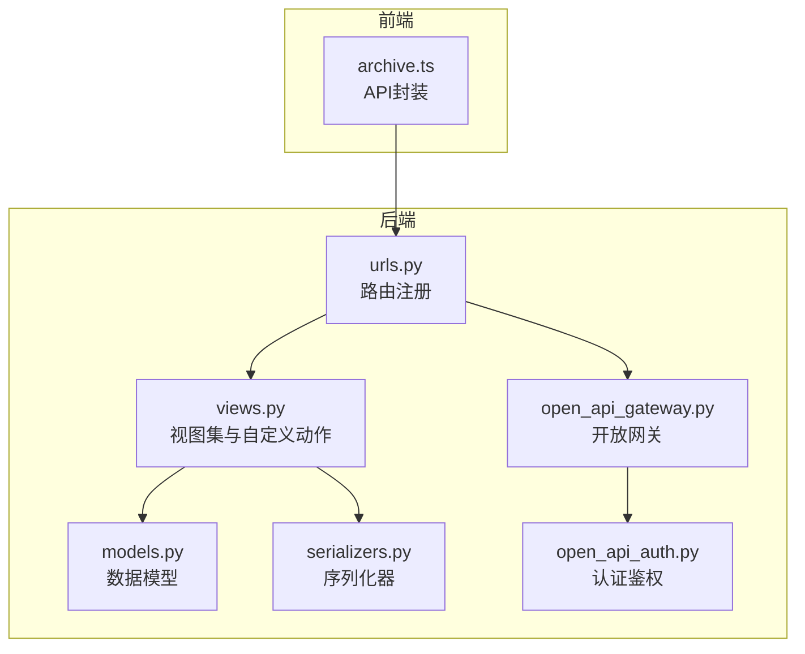
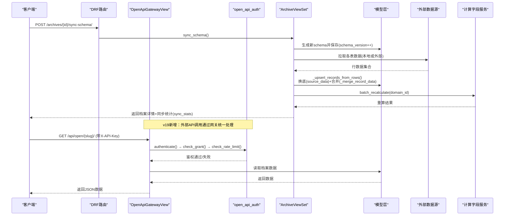
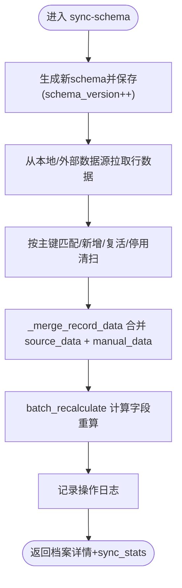
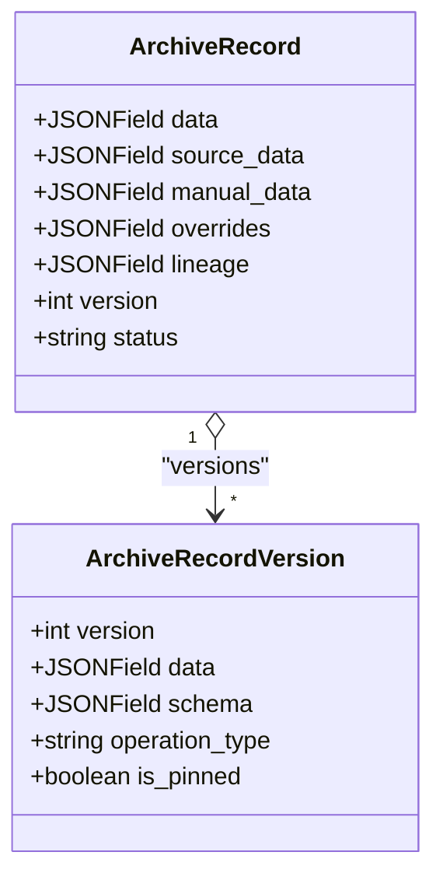
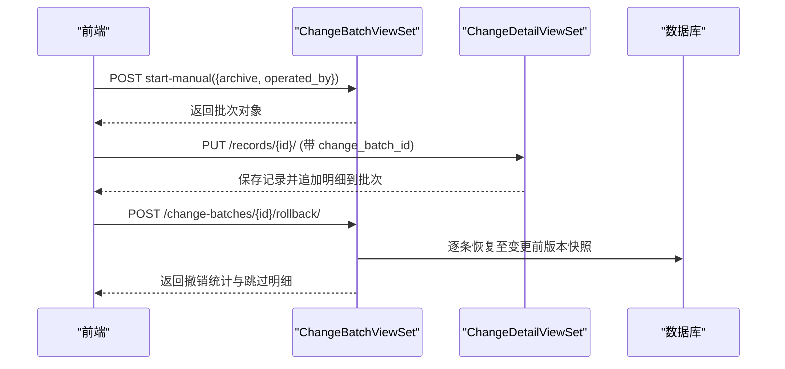
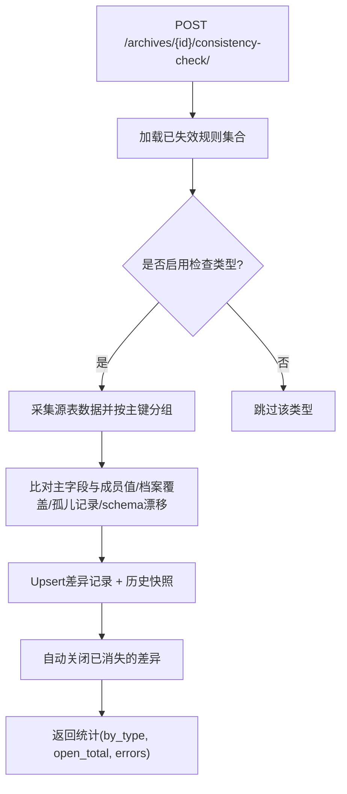
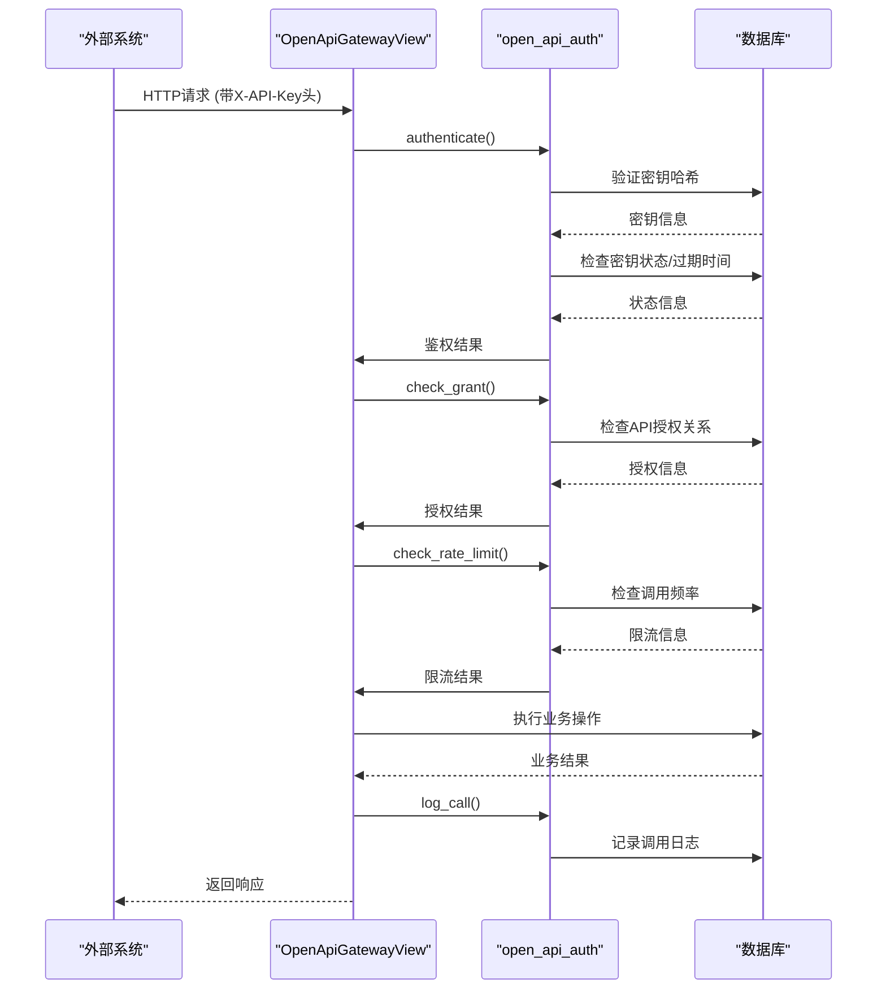
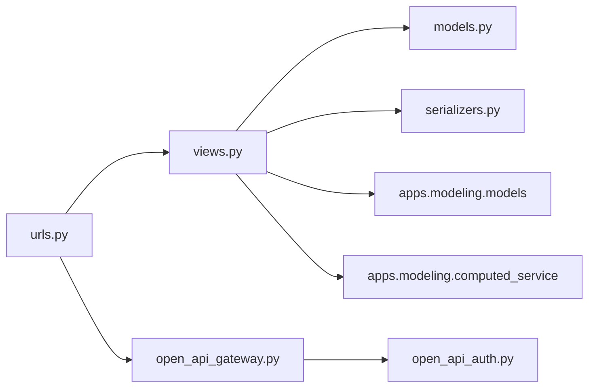

# 档案管理API

<cite>
**本文引用的文件**   
- [urls.py](file://backend/apps/archive/urls.py)
- [views.py](file://backend/apps/archive/views.py)
- [models.py](file://backend/apps/archive/models.py)
- [serializers.py](file://backend/apps/archive/serializers.py)
- [open_api_gateway.py](file://backend/apps/archive/open_api_gateway.py)
- [open_api_auth.py](file://backend/apps/archive/open_api_auth.py)
- [archive.ts](file://frontend/src/api/archive.ts)
</cite>

## 更新摘要
**变更内容**   
- 新增开放API网关模块，提供六个标准化端点用于外部系统集成
- 实现API密钥认证机制，支持密钥生成、轮换、吊销和授权管理
- 添加速率限制功能，防止API滥用
- 集成全面审计日志记录，追踪所有API调用
- 增强数据服务API管理能力，支持暴露字段配置和筛选条件

## 目录
1. [简介](#简介)
2. [项目结构](#项目结构)
3. [核心组件](#核心组件)
4. [架构总览](#架构总览)
5. [详细组件分析](#详细组件分析)
6. [依赖关系分析](#依赖关系分析)
7. [性能考量](#性能考量)
8. [故障排查指南](#故障排查指南)
9. [结论](#结论)
10. [附录：API端点规范与示例](#附录api端点规范与示例)

## 简介
本文件为 MetaData002 系统"档案管理模块"的完整 API 文档，覆盖档案配置管理、数据记录操作、版本控制、变更追踪、一致性检查与规则配置等全部相关端点。**v19版本新增开放API网关功能**，提供标准化的外部系统集成接口，包含API密钥认证、速率限制和全面审计日志。文档包含请求/响应格式说明、成功与错误场景示例、批量操作与异步任务使用方法（通过同步接口返回统计与批次ID），并提供架构图与流程图帮助理解数据流与处理逻辑。

## 项目结构
后端采用 Django + DRF 的 ViewSet 路由注册方式，统一在 apps/archive 下提供 RESTful 接口；前端通过 TypeScript 封装调用。**v19版本新增开放API网关模块**，提供独立的鉴权、限流和日志记录功能。



**图表来源** 
- [urls.py:1-29](file://backend/apps/archive/urls.py#L1-L29)
- [open_api_gateway.py:1-400](file://backend/apps/archive/open_api_gateway.py#L1-L400)
- [open_api_auth.py:1-137](file://backend/apps/archive/open_api_auth.py#L1-L137)

**章节来源**
- [urls.py:1-29](file://backend/apps/archive/urls.py#L1-L29)

## 核心组件
- 档案配置（Archive）：定义域级档案结构与 schema 快照，支持同步模型变更与数据刷新。
- 档案记录（ArchiveRecord）：双层存储（source_data + manual_data），合并物化为 data，维护血缘 lineage 与修正保护 overrides。
- 版本快照（ArchiveRecordVersion）：每次关键操作生成版本快照，支持对比、回滚与定版。
- 同步日志（ArchiveSyncLog）：记录数据同步过程的状态与详情。
- 操作日志（ArchiveOperationLog）：记录创建、更新、删除、回滚、定版等操作。
- **数据服务API（ArchiveApi）**：对外暴露档案数据的查询接口，支持字段暴露与筛选条件。
- **API密钥管理（ApiKey）**：v19新增，支持密钥生成、轮换、吊销和授权管理。
- **API调用日志（ApiCallLog）**：v19新增，记录所有API调用的详细信息。
- **变更批次与明细（ArchiveChangeBatch / ArchiveChangeDetail）**：统一记录源侧同步与人工编辑的变更，支持整批撤销与单条回滚。
- **一致性差异与规则（ConsistencyIssue / ConsistencyCheckRule）**：四类一致性检查与规则失效管理。

**章节来源**
- [models.py:1-541](file://backend/apps/archive/models.py#L1-L541)
- [serializers.py:1-552](file://backend/apps/archive/serializers.py#L1-L552)

## 架构总览
档案数据同步与合并的核心流程如下，**v19版本新增开放API网关架构**：



**图表来源** 
- [views.py:275-329](file://backend/apps/archive/views.py#L275-L329)
- [open_api_gateway.py:158-197](file://backend/apps/archive/open_api_gateway.py#L158-L197)
- [open_api_auth.py:39-108](file://backend/apps/archive/open_api_auth.py#L39-L108)

**章节来源**
- [views.py:275-329](file://backend/apps/archive/views.py#L275-L329)
- [views.py:930-1085](file://backend/apps/archive/views.py#L930-L1085)

## 详细组件分析

### 档案配置管理（Archive）
- 列表/详情/创建/更新/删除：标准CRUD，创建时自动生成 schema 快照。
- 自定义动作：
  - POST /archives/{id}/sync-schema/：同步模型变更，重新生成 schema，拉取数据并触发计算字段重算。
  - POST /archives/{id}/refresh-data/：仅刷新 source_data 并重算计算字段，不改变 schema。
  - GET /archives/{id}/refresh-preview/：预检模式，零写入，返回 schema 变化与数据变化样本。
  - POST /archives/{id}/consistency-check/：执行四类一致性检查，生成差异记录与历史快照。



**图表来源** 
- [views.py:275-329](file://backend/apps/archive/views.py#L275-L329)
- [views.py:930-1085](file://backend/apps/archive/views.py#L930-L1085)

**章节来源**
- [views.py:275-329](file://backend/apps/archive/views.py#L275-L329)
- [views.py:331-394](file://backend/apps/archive/views.py#L331-L394)
- [views.py:396-600](file://backend/apps/archive/views.py#L396-L600)

### 数据记录操作（ArchiveRecord）
- 列表/详情/更新/删除：软删除（状态置为已停用），保留数据快照可回滚。
- 版本管理：
  - GET /records/{id}/versions/：分页列出版本快照。
  - GET /records/{id}/versions/compare/?v1=&v2=：对比两个版本的字段差异。
  - POST /records/{id}/rollback/：回滚到指定版本（按 ownership 分层写回）。
  - POST /records/{id}/rollback-to-change/：按时间点回滚（恢复到目标变更明细对应的版本快照）。
  - POST /records/{id}/pin/：定版当前版本快照。



**图表来源** 
- [models.py:33-109](file://backend/apps/archive/models.py#L33-L109)

**章节来源**
- [views.py:1563-1757](file://backend/apps/archive/views.py#L1563-L1757)
- [serializers.py:121-377](file://backend/apps/archive/serializers.py#L121-L377)

### 变更追踪与批量操作（ChangeBatch / ChangeDetail）
- 变更批次：记录一次同步或一次人工编辑会话的统计信息。
- 变更明细：逐条记录的字段级旧值→新值，支持按时间点回滚与整批撤销。
- 批量操作：
  - POST /change-batches/start-manual/：开启人工批次（后续 PUT records 带 change_batch_id 攒入该批）。
  - POST /change-batches/{id}/rollback/：整批撤销（跳过后续被编辑的记录并列出）。
  - POST /change-details/{id}/rollback/：单条变更明细回滚（恢复到变更前版本快照）。
  - GET /change-details/export/?archive=：导出单个档案的全部变更日志 Excel。



**图表来源** 
- [views.py:1848-1948](file://backend/apps/archive/views.py#L1848-L1948)
- [views.py:1951-2102](file://backend/apps/archive/views.py#L1951-L2102)

**章节来源**
- [views.py:1848-1948](file://backend/apps/archive/views.py#L1848-L1948)
- [views.py:1951-2102](file://backend/apps/archive/views.py#L1951-L2102)

### 一致性检查与规则（ConsistencyIssue / ConsistencyCheckRule）
- 四类检查：
  - composite_member：组合字段非主字段成员值≠主字段值
  - archive_source_diff：档案侧人工覆盖与源侧数据差异
  - orphan_source_record：源侧数据无法关联主表主键
  - schema_drift：档案 schema 与当前建模结构不一致
- 规则失效：可按 check_type + field_code + member_source 粒度禁用规则，禁用后不计入统计。
- 批量标记：reviewed/ignored/reopen，写入变更日志批次。



**图表来源** 
- [views.py:396-600](file://backend/apps/archive/views.py#L396-L600)
- [views.py:2203-2283](file://backend/apps/archive/views.py#L2203-L2283)

**章节来源**
- [views.py:396-600](file://backend/apps/archive/views.py#L396-L600)
- [views.py:2203-2283](file://backend/apps/archive/views.py#L2203-L2283)
- [views.py:2286-2362](file://backend/apps/archive/views.py#L2286-L2362)

### 开放API网关（v19新增）
**新增功能**：提供六个标准化端点用于外部系统集成，支持API密钥认证、速率限制和全面审计日志。

#### 网关端点
- `GET /api/open/{slug}/`：列表查询（exposed投影+静态筛选+动态参数+分页上限500）
- `GET /api/open/{slug}/docs/`：接口文档（自动生成Swagger风格文档）
- `GET /api/open/{slug}/{record_key}/`：单条记录查询
- `POST /api/open/{slug}/`：新增记录（exposed∩ownership=archive，主键必填）
- `PATCH /api/open/{slug}/{record_key}/`：修改记录（archive字段diff写manual_data，source字段400）
- `DELETE /api/open/{slug}/{record_key}/`：软停用记录（status=deleted）

#### 认证流程


**图表来源** 
- [open_api_gateway.py:163-197](file://backend/apps/archive/open_api_gateway.py#L163-L197)
- [open_api_auth.py:39-108](file://backend/apps/archive/open_api_auth.py#L39-L108)

#### 密钥管理
- 密钥生成：`mdm_` + 32位随机hex，明文仅创建/轮换时返回一次
- 密钥存储：SHA-256哈希，不落库明文
- 密钥状态：ACTIVE（启用）、REVOKED（已吊销）
- 密钥授权：每个密钥可授权多个API，独立配置允许的操作范围

**章节来源**
- [open_api_gateway.py:1-400](file://backend/apps/archive/open_api_gateway.py#L1-L400)
- [open_api_auth.py:1-137](file://backend/apps/archive/open_api_auth.py#L1-L137)
- [models.py:252-327](file://backend/apps/archive/models.py#L252-L327)

### 数据服务API（ArchiveApi）
- 管理端：CRUD 数据服务API，设置暴露字段、筛选条件、角色授权。
- 数据端：GET /archive-apis/{id}/data/ 返回暴露字段定义与启用记录（按筛选条件过滤）。
- **v19增强**：支持slug路径标识、允许操作范围配置、速率限制设置。

**章节来源**
- [views.py:2386-2448](file://backend/apps/archive/views.py#L2386-L2448)
- [serializers.py:530-552](file://backend/apps/archive/serializers.py#L530-L552)

## 依赖关系分析
- 路由注册：DefaultRouter 将多个 ViewSet 映射到 /api/ 前缀路径，**v19新增开放网关路由**。
- 视图依赖：
  - 模型层：Archive、ArchiveRecord、ArchiveRecordVersion、ArchiveSyncLog、ArchiveOperationLog、ArchiveApi、ApiKey、ApiKeyGrant、ApiCallLog、ArchiveChangeBatch、ArchiveChangeDetail、ConsistencyIssue、ConsistencyCheckRule、ConsistencyIssueHistory。
  - 建模层：Domain、Table、Field、StandardField、ComputedField、FieldGroup、DataSource。
  - 计算字段服务：computed_service.batch_recalculate 与 recalculate_affected。
- 序列化器：用于输入校验与输出格式化，部分包含业务逻辑（如创建/更新时的双层拆分与合并）。



**图表来源** 
- [urls.py:1-29](file://backend/apps/archive/urls.py#L1-L29)
- [open_api_gateway.py:1-400](file://backend/apps/archive/open_api_gateway.py#L1-L400)
- [open_api_auth.py:1-137](file://backend/apps/archive/open_api_auth.py#L1-L137)

**章节来源**
- [urls.py:1-29](file://backend/apps/archive/urls.py#L1-L29)
- [views.py:1-3881](file://backend/apps/archive/views.py#L1-L3881)

## 性能考量
- 数据拉取限制：本地/外部表查询默认 LIMIT 1000，避免一次性拉取过大数据集。
- 合并策略：source_data 整层替换，manual_data 仅覆盖 archive 字段，减少不必要的版本递增。
- 计算字段重算：仅在 schema 同步或人工编辑后触发，避免频繁重算。
- 索引与排序：变更记录与版本快照按时间倒序，提升列表性能。
- 预检模式：refresh-preview 零写入，适合大规模变更前的风险评估。
- **v19新增性能优化**：
  - 进程内滑动窗口限流，重启清零（多实例部署需Redis）
  - API调用日志保留90天，自动清理
  - 分页查询限制最大500条记录
  - 密钥验证使用恒定时间比较防时序攻击

[本节为通用指导，无需引用具体文件]

## 故障排查指南
- 同步失败：查看 sync-stats.errors 与 OperationLog 中的错误信息。
- 数据未更新：确认 refresh-preview 是否有数据变化；检查主键字段配置与映射。
- 一致性差异持续：检查规则是否被禁用；核对组合字段主字段设置。
- 回滚无效：确认目标版本存在且未被后续编辑覆盖；对于存量历史明细无版本映射的情况，使用字段级 old 值兼容路径。
- **v19新增故障排查**：
  - 401错误：检查X-API-Key头是否正确，密钥是否有效/未过期
  - 403错误：检查API是否启用，密钥是否获得相应授权
  - 429错误：检查是否超过速率限制，调整rate_limit_per_min配置
  - 404错误：检查slug路径是否存在，记录key是否正确

**章节来源**
- [views.py:930-1085](file://backend/apps/archive/views.py#L930-L1085)
- [views.py:1951-2102](file://backend/apps/archive/views.py#L1951-L2102)
- [open_api_auth.py:39-108](file://backend/apps/archive/open_api_auth.py#L39-L108)

## 结论
本模块通过双层存储与版本快照机制，实现了档案数据的稳定同步、精确追溯与灵活回滚；一致性检查与规则管理保障了数据质量；变更批次与明细提供了强大的审计能力。**v19版本新增的开放API网关功能**为外部系统集成提供了标准化接口，具备完善的认证、授权、限流和审计能力。建议在生产环境结合定时任务与监控告警，确保数据同步与一致性检查的稳定运行，同时合理配置API密钥策略和速率限制以保障系统安全。

[本节为总结性内容，无需引用具体文件]

## 附录：API端点规范与示例

### 路由总览
- /archives/：档案配置 CRUD
- /archives/{id}/sync-schema/：同步模型与数据
- /archives/{id}/refresh-data/：刷新数据
- /archives/{id}/refresh-preview/：预检
- /archives/{id}/consistency-check/：一致性检查
- /records/：记录列表（禁止人工新增）
- /records/{id}/versions/：版本历史
- /records/{id}/versions/compare/：版本对比
- /records/{id}/rollback/：回滚到版本
- /records/{id}/rollback-to-change/：按时间点回滚
- /records/{id}/pin/：定版
- /sync-logs/：同步日志
- /operation-logs/：操作日志
- /record-versions/：全局版本管理
- /change-batches/：变更批次
- /change-batches/start-manual/：开启人工批次
- /change-batches/{id}/rollback/：整批撤销
- /change-details/：变更明细
- /change-details/export/：导出Excel
- /change-details/{id}/rollback/：单条回滚
- /consistency-issues/：一致性差异
- /consistency-issues/batch-review/：批量标记
- /consistency-rules/：一致性规则
- /consistency-rules/disable/：禁用规则
- /consistency-rules/enable/：启用规则
- /consistency-rules/{id}/toggle/：切换规则
- /archive-apis/：数据服务API管理
- /archive-apis/{id}/data/：获取暴露数据
- **/api/open/{slug}/**：开放API网关（v19新增）
- **/api-keys/**：API密钥管理（v19新增）
- **/api-call-stats/**：API调用统计（v19新增）

**章节来源**
- [urls.py:1-29](file://backend/apps/archive/urls.py#L1-L29)
- [archive.ts:1-179](file://frontend/src/api/archive.ts#L1-L179)

### 请求/响应示例（成功与错误）
- 同步 schema（成功）
  - 请求：POST /archives/{id}/sync-schema/ body: {operated_by: "system"}
  - 响应：档案详情 + sync_stats（records_created/updated/deactivated/reactivated/errors/warnings/computed_recalculated）
- 刷新数据（成功）
  - 请求：POST /archives/{id}/refresh-data/ body: {operated_by: "system"}
  - 响应：档案详情 + sync_stats
- 预检（成功）
  - 请求：GET /archives/{id}/refresh-preview/
  - 响应：{schema_changes:{added,removed,changed,has_changes}, data_changes:{tables_checked,would_create,would_update,would_deactivate,changes_sample,errors,warnings,archive_owned_impact}}
- 一致性检查（成功）
  - 请求：POST /archives/{id}/consistency-check/ body: {operated_by: "system"}
  - 响应：统计 by_type（composite_member/archive_source_diff/orphan_source_record/schema_drift）、open_total、errors、checked_at
- 版本对比（成功）
  - 请求：GET /records/{id}/versions/compare/?v1=1&v2=2
  - 响应：{version_1, version_2, diff:[{field,old_value,new_value}]}
- 回滚到版本（成功）
  - 请求：POST /records/{id}/rollback/ body: {target_version: 2, operated_by: "admin"}
  - 响应：记录详情（已回滚）
- 整批撤销（成功）
  - 请求：POST /change-batches/{id}/rollback/ body: {operated_by: "admin"}
  - 响应：{rolled_back_records, skipped_edited, skipped_deleted, skipped_legacy, batch_id}
- 单条回滚（成功）
  - 请求：POST /change-details/{id}/rollback/ body: {operated_by: "admin"}
  - 响应：{rolled_back_fields, batch_id, new_version, changes}
- **开放API网关（成功）**
  - 请求：GET /api/open/store-master/ headers: {X-API-Key: mdm_xxxx}
  - 响应：{count: 100, page: 1, page_size: 20, records: [{...暴露字段..., record_key: "..."}]}
- **开放API网关（错误）**
  - 缺少密钥：401 Unauthorized，响应体：{detail: "缺少认证头 X-API-Key"}
  - 无效密钥：401 Unauthorized，响应体：{detail: "无效的 API 密钥"}
  - 密钥过期：401 Unauthorized，响应体：{detail: "API 密钥已过期"}
  - 未授权：403 Forbidden，响应体：{detail: "该密钥未获得此接口的授权"}
  - 超出限流：429 Too Many Requests，响应体：{detail: "请求过于频繁，限流 100 次/分钟，请稍后重试"}
- 错误场景（示例）
  - 参数缺失：400 Bad Request，响应体包含 error 描述
  - 权限不足：403 Forbidden（如记录不允许人工新增）
  - 资源不存在：404 Not Found

**章节来源**
- [views.py:275-329](file://backend/apps/archive/views.py#L275-L329)
- [views.py:331-394](file://backend/apps/archive/views.py#L331-L394)
- [views.py:396-600](file://backend/apps/archive/views.py#L396-L600)
- [views.py:1649-1672](file://backend/apps/archive/views.py#L1649-L1672)
- [views.py:1674-1692](file://backend/apps/archive/views.py#L1674-L1692)
- [views.py:1882-1948](file://backend/apps/archive/views.py#L1882-L1948)
- [views.py:2061-2102](file://backend/apps/archive/views.py#L2061-L2102)
- [open_api_gateway.py:208-247](file://backend/apps/archive/open_api_gateway.py#L208-L247)
- [open_api_auth.py:39-108](file://backend/apps/archive/open_api_auth.py#L39-L108)

### 批量操作与异步任务
- 批量操作：通过 change-batches/start-manual/ 开启批次，随后多次 PUT /records/{id}/ 携带 change_batch_id 将变更攒入同一批次；批次封口后支持整批撤销。
- 异步任务：当前实现以同步接口为主，返回统计与批次ID供前端轮询或展示；如需真正异步，可在后端引入 Celery 等任务队列，将耗时操作（如大表同步、计算字段重算）放入后台任务，并通过回调或轮询接口获取进度。
- **v19新增批量操作**：
  - API密钥批量授权：创建密钥时可一次性授权多个API
  - 调用日志批量查询：支持按API过滤和分页查询
  - 密钥轮换：支持批量轮换密钥而不影响现有授权关系

**章节来源**
- [views.py:1863-1880](file://backend/apps/archive/views.py#L1863-L1880)
- [views.py:1882-1948](file://backend/apps/archive/views.py#L1882-L1948)
- [open_api_gateway.py:95-100](file://backend/apps/archive/open_api_gateway.py#L95-L100)
- [views.py:3797-3815](file://backend/apps/archive/views.py#L3797-L3815)

### 开放API网关使用示例
#### 基本用法
```bash
# 获取接口文档
curl -H 'X-API-Key: mdm_xxxx' http://localhost:8000/api/open/store-master/docs/

# 查询数据列表
curl -H 'X-API-Key: mdm_xxxx' "http://localhost:8000/api/open/store-master/?page=1&page_size=20"

# 查询单条记录
curl -H 'X-API-Key: mdm_xxxx' http://localhost:8000/api/open/store-master/123/

# 新增记录
curl -X POST -H 'X-API-Key: mdm_xxxx' -H 'Content-Type: application/json' \
  -d '{"name": "新门店", "address": "北京市朝阳区"}' \
  http://localhost:8000/api/open/store-master/

# 修改记录
curl -X PATCH -H 'X-API-Key: mdm_xxxx' -H 'Content-Type: application/json' \
  -d '{"name": "更新后的名称"}' \
  http://localhost:8000/api/open/store-master/123/

# 删除记录（软停用）
curl -X DELETE -H 'X-API-Key: mdm_xxxx' \
  http://localhost:8000/api/open/store-master/123/
```

#### Python SDK示例
```python
import requests

# 基础配置
API_KEY = 'mdm_xxxxxxxx'
BASE_URL = 'http://localhost:8000/api/open/store-master/'

headers = {'X-API-Key': API_KEY}

# 查询数据
response = requests.get(BASE_URL, headers=headers, params={'page': 1, 'page_size': 20})
data = response.json()
print(f"共 {data['count']} 条记录")

# 新增记录
new_record = {
    'name': '新门店',
    'address': '北京市朝阳区',
    'phone': '1234567890'
}
response = requests.post(BASE_URL, headers=headers, json=new_record)
if response.status_code == 201:
    print(f"记录创建成功，record_key: {response.json()['record_key']}")
```

**章节来源**
- [open_api_gateway.py:103-155](file://backend/apps/archive/open_api_gateway.py#L103-L155)
- [open_api_gateway.py:208-399](file://backend/apps/archive/open_api_gateway.py#L208-L399)