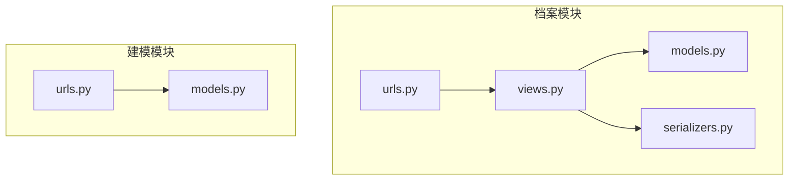
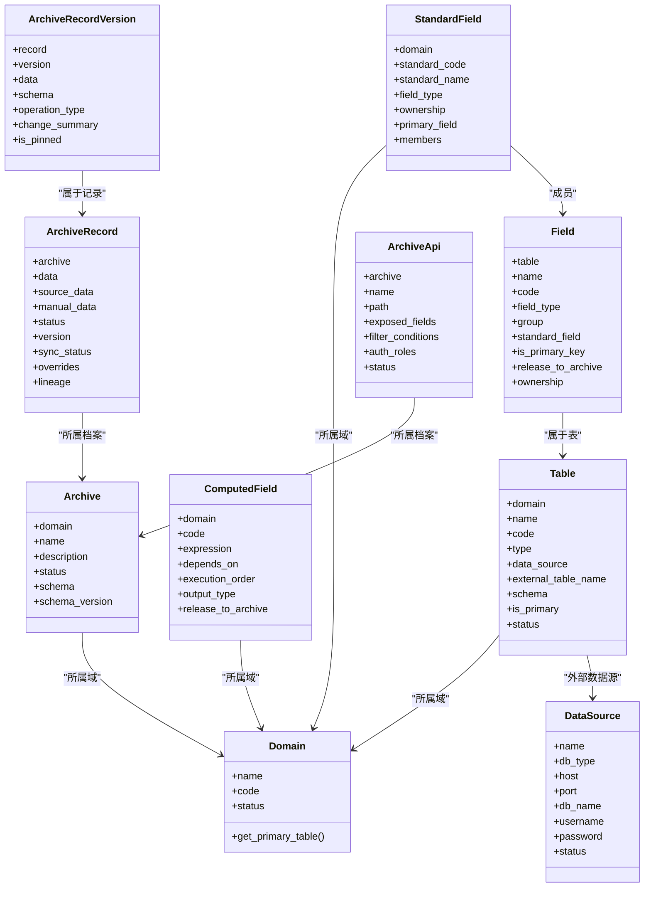
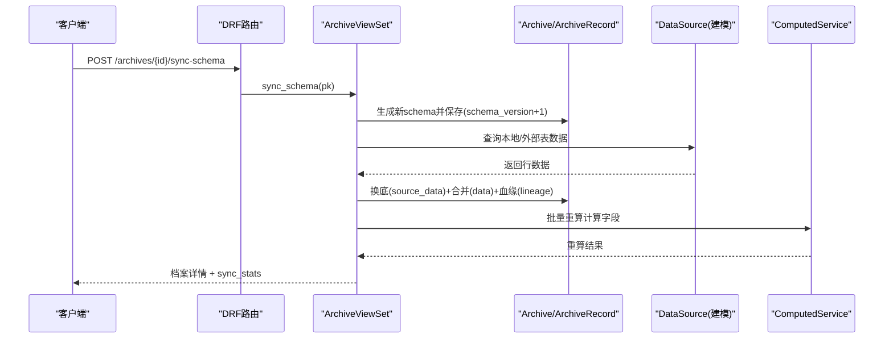

# 档案配置API

<cite>
**本文引用的文件**   
- [backend/apps/archive/models.py](file://backend/apps/archive/models.py)
- [backend/apps/archive/views.py](file://backend/apps/archive/views.py)
- [backend/apps/archive/serializers.py](file://backend/apps/archive/serializers.py)
- [backend/apps/archive/urls.py](file://backend/apps/archive/urls.py)
- [backend/apps/modeling/models.py](file://backend/apps/modeling/models.py)
- [backend/apps/modeling/urls.py](file://backend/apps/modeling/urls.py)
- [backend/apps/modeling/migrations/0033_fieldmapping_join_type.py](file://backend/apps/modeling/migrations/0033_fieldmapping_join_type.py)
</cite>

## 更新摘要
**变更内容**   
- 增强了档案同步引擎的JOIN行为支持，_join_header_rows和_sync_detail_rows方法现在接受join_type参数实现不同的JOIN逻辑
- 扩展了查询条件操作符支持'starts_with'和'contains'操作
- 更新了FieldMapping模型的连接类型配置选项
- 完善了预组合头表与明细表的关联关系处理

## 目录
1. [简介](#简介)
2. [项目结构](#项目结构)
3. [核心组件](#核心组件)
4. [架构总览](#架构总览)
5. [详细组件分析](#详细组件分析)
6. [依赖关系分析](#依赖关系分析)
7. [性能考虑](#性能考虑)
8. [故障排查指南](#故障排查指南)
9. [结论](#结论)
10. [附录](#附录)

## 简介
本文件为 MetaData002 系统的"档案配置管理"提供完整的 API 文档，覆盖档案与记录的 CRUD、Schema 同步、数据刷新、版本回滚、一致性检查、变更批次与明细、以及档案对外数据服务 API 的配置。同时说明字段定义、验证规则、业务约束、档案与数据源的关联关系配置接口，并给出请求响应示例要点与状态流转、权限控制机制说明。

**更新** 本次更新重点增强了档案同步引擎的JOIN行为支持和查询条件操作符功能。

## 项目结构
后端采用 Django + DRF 的模块化设计：
- apps/archive：档案域模型、序列化器、视图集与路由
- apps/modeling：建模域（数据源、域、表、字段、标准字段等）与路由
- 路由通过 DefaultRouter 注册各资源端点



图表来源
- [backend/apps/archive/urls.py:1-21](file://backend/apps/archive/urls.py#L1-L21)
- [backend/apps/modeling/urls.py:1-20](file://backend/apps/modeling/urls.py#L1-L20)

章节来源
- [backend/apps/archive/urls.py:1-21](file://backend/apps/archive/urls.py#L1-L21)
- [backend/apps/modeling/urls.py:1-20](file://backend/apps/modeling/urls.py#L1-L20)

## 核心组件
- 档案 Archive：一个域一个档案，包含名称、描述、状态、Schema 快照与版本号
- 档案记录 ArchiveRecord：主数据实例，双层存储（source_data 底层 + manual_data 人工覆盖），合并物化 data，含血缘 lineage 与修正保护 overrides
- 版本快照 ArchiveRecordVersion：记录每次操作的快照与差异摘要
- 同步日志 ArchiveSyncLog：记录一次同步过程的状态与详情
- 操作日志 ArchiveOperationLog：记录创建、更新、删除、回滚、定版、同步等操作
- 数据服务 API ArchiveApi：对外暴露档案数据的接口配置（路径、暴露字段、筛选条件、角色授权）
- 变更批次与明细：ArchiveChangeBatch / ArchiveChangeDetail：统一记录源侧同步与档案侧编辑的变更
- 一致性检查：ConsistencyIssue / ConsistencyCheckRule / ConsistencyIssueHistory：支持组合字段成员一致性、档案与源差异、孤立源记录、Schema 漂移四类检查

章节来源
- [backend/apps/archive/models.py:5-379](file://backend/apps/archive/models.py#L5-L379)
- [backend/apps/modeling/models.py:4-489](file://backend/apps/modeling/models.py#L4-L489)

## 架构总览
档案系统围绕"域-表-字段-标准字段-计算字段"的建模体系，结合"双层存储+合并物化"的数据模型，实现从多源拉取、合并、人工覆盖、计算重算、版本回滚与一致性校验的全链路能力。



图表来源
- [backend/apps/modeling/models.py:4-489](file://backend/apps/modeling/models.py#L4-L489)
- [backend/apps/archive/models.py:5-379](file://backend/apps/archive/models.py#L5-L379)

## 详细组件分析

### 档案配置 API（CRUD）
- 列表：GET /archives
  - 过滤：domain, status；搜索：name
  - 返回：id, domain, domain_name, name, description, status, schema_version, created_by, created_at, updated_at, record_count, api_count
- 详情：GET /archives/{id}
  - 返回：同上，额外包含 schema（只读）
- 创建：POST /archives
  - 必填：domain, name；可选：description, created_by
  - 行为：自动根据域生成 schema 快照，记录操作日志
- 更新：PUT/PATCH /archives/{id}
  - 仅允许修改可写字段（如 name/description/status）
- 删除：DELETE /archives/{id}
  - 级联删除相关记录（按模型外键策略）

章节来源
- [backend/apps/archive/serializers.py:51-98](file://backend/apps/archive/serializers.py#L51-L98)
- [backend/apps/archive/views.py:246-274](file://backend/apps/archive/views.py#L246-L274)
- [backend/apps/archive/urls.py:6](file://backend/apps/archive/urls.py#L6)

### 档案 Schema 同步与数据刷新
- 同步 Schema 并拉取数据：POST /archives/{id}/sync-schema/
  - 行为：重新生成 schema，schema_version+1，从数据源整层拉取 source_data，触发计算字段批量重算，记录操作日志
  - 返回：档案详情 + sync_stats（新增/更新/停用/复活统计、错误、警告、计算字段重算结果）
- 仅刷新数据：POST /archives/{id}/refresh-data/
  - 行为：不重建 schema，仅换底重合并 + 计算字段重算
  - 返回：档案详情 + sync_stats
- 预检（dry-run）：GET /archives/{id}/refresh-preview/
  - 行为：对比新旧 schema 差异（新增/移除/属性变化），试算数据变化（新增/更新/停用数量与样本），评估对档案维护字段的波及影响
  - 返回：{schema_changes, data_changes}

章节来源
- [backend/apps/archive/views.py:275-329](file://backend/apps/archive/views.py#L275-L329)
- [backend/apps/archive/views.py:331-342](file://backend/apps/archive/views.py#L331-L342)
- [backend/apps/archive/views.py:344-394](file://backend/apps/archive/views.py#L344-L394)
- [backend/apps/archive/views.py:789-928](file://backend/apps/archive/views.py#L789-L928)
- [backend/apps/archive/views.py:930-1085](file://backend/apps/archive/views.py#L930-L1085)

### 档案记录 API（CRUD）
- 列表：GET /records
  - 过滤：archive, status, sync_status；搜索：search（JSON 文本模糊匹配）
  - 排序：改过（unsynced）置顶，其余按更新时间倒序
- 详情：GET /records/{id}
  - 返回：id, archive, archive_name, data, status, version, sync_status, overrides, lineage, created_by, updated_by, created_at, updated_at
- 创建：POST /records
  - 行为：禁止在档案端人工新增主数据记录（统一由源侧同步产生），返回 403
- 更新：PUT/PATCH /records/{id}
  - 行为：按 ownership 分层写入（source 字段不可编辑，archive 字段写入 manual_data），合并物化 data，增量版本快照，变更日志批次
  - 支持 change_batch_id 攒批保存
- 删除：DELETE /records/{id}
  - 行为：软删除（status=DELETED），保留数据快照，记录版本与操作日志

章节来源
- [backend/apps/archive/views.py:1563-1603](file://backend/apps/archive/views.py#L1563-L1603)
- [backend/apps/archive/views.py:1605-1636](file://backend/apps/archive/views.py#L1605-L1636)
- [backend/apps/archive/serializers.py:121-183](file://backend/apps/archive/serializers.py#L121-L183)
- [backend/apps/archive/serializers.py:185-378](file://backend/apps/archive/serializers.py#L185-L378)

### 版本管理与回滚
- 查看版本历史：GET /records/{id}/versions
  - 返回：version, data, schema, operated_by, operated_at, operation_type, change_summary, is_pinned, pinned_at, pinned_by, pin_note, record_label
- 版本差异对比：GET /records/{id}/versions/compare?v1=&v2=
  - 返回：diff（字段级 old/new）
- 回滚到指定版本：POST /records/{id}/rollback
  - 行为：按 ownership 分层写回（source→source_data，archive→manual_data/回落），记录版本快照与操作日志
- 按时间点回滚：POST /records/{id}/rollback-to-change
  - 行为：恢复目标变更明细对应的版本快照（需 version_after 映射）
- 定版当前版本：POST /records/{id}/pin
  - 行为：锁定当前版本快照，记录操作日志

章节来源
- [backend/apps/archive/views.py:1637-1757](file://backend/apps/archive/views.py#L1637-L1757)
- [backend/apps/archive/serializers.py:381-433](file://backend/apps/archive/serializers.py#L381-L433)

### 一致性检查与规则管理
- 一致性检查：POST /archives/{id}/consistency-check
  - 类型：composite_member、archive_source_diff、orphan_source_record、schema_drift
  - 行为：扫描源表与档案记录，生成差异记录与历史快照，支持规则失效过滤
  - 返回：stats（按类型统计、新发现/重新打开/已消失计数、open_total、errors、checked_at）
- 差异记录列表：GET /consistency-issues
  - 过滤：archive, status, field_code, record_key, check_type
- 批量标记：POST /consistency-issues/batch-review
  - 动作：reviewed/ignored/reopen，写入变更日志批次与明细
- 规则管理：
  - 列表/创建/更新/删除：/consistency-rules
  - 切换失效：POST /consistency-rules/{id}/toggle
  - 批量失效/启用：POST /consistency-rules/disable, /consistency-rules/enable

章节来源
- [backend/apps/archive/views.py:396-600](file://backend/apps/archive/views.py#L396-L600)
- [backend/apps/archive/views.py:2203-2362](file://backend/apps/archive/views.py#L2203-L2362)
- [backend/apps/archive/serializers.py:500-552](file://backend/apps/archive/serializers.py#L500-552)

### 变更批次与明细
- 批次列表：GET /change-batches
  - 过滤：archive, change_source
- 开启人工批次：POST /change-batches/start-manual
  - 用途：前端先开批次，随后逐条 PUT /records/{id} 带 change_batch_id 攒批保存
- 批次回滚：POST /change-batches/{id}/rollback
  - 行为：将本批影响的记录恢复到本批之前的状态，跳过后续被编辑的记录
- 明细列表：GET /change-details
  - 过滤：archive, batch, record, change_type, change_source, record_key
- 导出 Excel：GET /change-details/export?archive=
  - 内容：Sheet1 批次汇总 + Sheet2 变更明细（上限 50000 行）
- 单条明细回滚：POST /change-details/{id}/rollback
  - 行为：恢复到本条变更前状态（优先使用 version_before 快照，否则降级旧逻辑）

章节来源
- [backend/apps/archive/views.py:1848-2103](file://backend/apps/archive/views.py#L1848-L2103)
- [backend/apps/archive/serializers.py:457-498](file://backend/apps/archive/serializers.py#L457-L498)

### 数据服务 API（对外暴露档案数据）
- 列表/详情/创建/更新/删除：/archive-apis
  - 字段：archive, name, description, path, exposed_fields, filter_conditions, auth_roles, status, created_by, created_at, updated_at
  - 暴露字段为空表示全部；筛选条件为 JSON 数组；角色/部门授权为字符串数组
- 过滤：archive, status

章节来源
- [backend/apps/archive/serializers.py:530-552](file://backend/apps/archive/serializers.py#L530-552)
- [backend/apps/archive/urls.py:11](file://backend/apps/archive/urls.py#L11)

### 档案与数据源的关联关系配置
- 数据源配置：/data-sources（建模模块）
  - 字段：name, db_type, host, port, db_name, username, password, status
  - 类型：postgresql/mysql/sqlserver/oracle
- 域/表/字段/标准字段/计算字段：/domains, /tables, /fields, /standard-fields, /computed-fields（建模模块）
  - 表类型：local/source；外部表名与 schema 用于连接数据源
  - 字段维护方 ownership：source（源系统维护，档案侧只读）/archive（档案维护，档案侧可编辑）
  - 标准字段 primary_field：组合字段的主字段决定数据源头与一致性检查口径

**更新** 新增了连接类型（join_type）配置，支持LEFT JOIN和INNER JOIN两种模式。

章节来源
- [backend/apps/modeling/urls.py:1-20](file://backend/apps/modeling/urls.py#L1-L20)
- [backend/apps/modeling/models.py:4-489](file://backend/apps/modeling/models.py#L4-L489)

### 增强JOIN行为支持

**新增功能** 档案同步引擎现在支持灵活的JOIN行为配置：

#### JOIN类型配置
- **LEFT JOIN**（默认）：保留无匹配的行，适用于需要完整数据集合的场景
- **INNER JOIN**：仅保留匹配成功的行，适用于严格数据完整性要求的场景

#### 预组合头表JOIN支持
- `_join_header_rows` 方法现在接受 `join_type` 参数
- 当 `join_type='inner'` 时，无匹配头表的明细行将被过滤掉
- 当 `join_type='left'` 时，即使没有匹配的头表数据，明细行也会被保留

#### 嵌套数据源JOIN支持
- `_sync_detail_rows` 方法中的嵌套数据源加载也支持JOIN类型配置
- 每个嵌套数据源可以独立配置JOIN类型，满足不同数据关联需求

章节来源
- [backend/apps/archive/views.py:1803-1840](file://backend/apps/archive/views.py#L1803-L1840)
- [backend/apps/archive/views.py:1952-2033](file://backend/apps/archive/views.py#L1952-L2033)
- [backend/apps/modeling/models.py:557-563](file://backend/apps/modeling/models.py#L557-L563)

### 扩展查询条件操作符

**新增功能** 查询条件操作符现在支持更多类型的匹配：

#### 支持的操作符
- **eq**：等于
- **ne**：不等于  
- **gt**：大于
- **ge**：大于等于
- **lt**：小于
- **le**：小于等于
- **in**：在列表中
- **starts_with**：**新增** 以某值开头
- **contains**：**新增** 包含某值

#### 使用示例
```json
[
  {"field": "name", "operator": "starts_with", "value": "张"},
  {"field": "description", "operator": "contains", "value": "重要"}
]
```

章节来源
- [backend/apps/archive/views.py:1780-1798](file://backend/apps/archive/views.py#L1780-L1798)
- [backend/apps/modeling/models.py:564-565](file://backend/apps/modeling/models.py#L564-L565)

## 依赖关系分析
- 视图依赖模型与序列化器：ArchiveViewSet/RecordViewSet 等通过 serializers 进行输入输出校验与转换
- 数据同步依赖建模模块：_sync_data_from_sources/_query_external_table 调用 DataSource 配置与跨库连接
- 计算字段重算依赖 computed_service：batch_recalculate/recalculate_affected
- 一致性检查依赖 StandardField/Field/Table 的结构信息



图表来源
- [backend/apps/archive/views.py:275-329](file://backend/apps/archive/views.py#L275-L329)
- [backend/apps/archive/views.py:930-1085](file://backend/apps/archive/views.py#L930-L1085)

章节来源
- [backend/apps/archive/views.py:246-329](file://backend/apps/archive/views.py#L246-L329)
- [backend/apps/modeling/models.py:4-489](file://backend/apps/modeling/models.py#L4-L489)

## 性能考虑
- 数据拉取限制：外部表查询默认 LIMIT/TOP 1000，避免大表拖慢
- 合并与物化：_merge_record_data 按 schema 逐项合并，减少不必要写入
- 版本快照：仅在 data 有差异时递增版本并落快照，降低冗余
- 变更批次：零变更不建批次，减少噪声
- 一致性检查：支持规则失效过滤，避免无效差异堆积
- 计算字段重算：按执行顺序批量处理，失败不阻塞主流程
- **JOIN优化**：INNER JOIN可减少不必要的数据传输，LEFT JOIN确保数据完整性

## 故障排查指南
- 同步失败：查看 sync_stats.errors 与 ArchiveSyncLog.details，定位具体表或数据源问题
- 数据不一致：运行 consistency-check，查看 by_type 统计与 mismatch_records，必要时禁用特定规则
- 回滚异常：确认目标版本存在且 version_after 映射有效；若缺失则降级到旧字段级恢复逻辑
- 权限拒绝：记录创建被禁止（403），应通过源侧同步而非档案端新增
- 计算字段重算失败：查看 warnings/errors，检查表达式依赖与执行顺序
- **JOIN相关问题**：检查join_type配置是否符合预期，确认关联字段映射正确

章节来源
- [backend/apps/archive/views.py:930-1085](file://backend/apps/archive/views.py#L930-L1085)
- [backend/apps/archive/views.py:2203-2362](file://backend/apps/archive/views.py#L2203-L2362)
- [backend/apps/archive/views.py:1563-1603](file://backend/apps/archive/views.py#L1563-L1603)

## 结论
档案配置 API 以"域-表-字段-标准字段-计算字段"为核心，结合"双层存储+合并物化"的数据模型，提供了完善的 CRUD、Schema 同步、数据刷新、版本回滚、一致性检查与变更追踪能力。通过数据源配置与字段维护方（ownership）控制，实现了源系统与档案侧的职责分离与数据治理。

**更新** 本次增强功能进一步提升了档案同步的灵活性和数据处理能力，特别是JOIN行为和查询操作符的扩展，使得系统能够更好地适应复杂的数据关联场景和查询需求。建议在生产环境配合权限控制与审计日志，确保数据安全与可追溯性。

## 附录

### 字段定义与验证规则
- 档案 Archive
  - 字段：domain（唯一）、name、description、status（draft/active/archived）、schema（只读）、schema_version（只读）
  - 验证：一个域只能创建一个档案
- 档案记录 ArchiveRecord
  - 字段：archive、data（合并物化）、source_data（底层）、manual_data（覆盖层）、status（active/deleted）、version、sync_status（unsynced/synced/partial/error/stale）、overrides、lineage
  - 验证：source 字段不可编辑；计算字段不允许人工覆盖；合并时按 ownership 优先级
- 数据服务 API ArchiveApi
  - 字段：archive、name、path（唯一）、exposed_fields（空=全部）、filter_conditions、auth_roles、status（enabled/disabled）

章节来源
- [backend/apps/archive/models.py:5-172](file://backend/apps/archive/models.py#L5-L172)
- [backend/apps/archive/serializers.py:51-98](file://backend/apps/archive/serializers.py#L51-L98)
- [backend/apps/archive/serializers.py:530-552](file://backend/apps/archive/serializers.py#L530-552)

### 请求响应示例要点
- 创建档案
  - 请求：POST /archives {domain, name, description?, created_by?}
  - 响应：档案详情（含 schema 快照）
- 同步 Schema 并拉取数据
  - 请求：POST /archives/{id}/sync-schema {operated_by?}
  - 响应：档案详情 + sync_stats（records_created/updated/deactivated/reactivated/tables_synced/errors/warnings/computed_recalculated）
- 刷新数据（预检）
  - 请求：GET /archives/{id}/refresh-preview
  - 响应：{schema_changes:{added,removed,changed,has_changes}, data_changes:{would_create,would_update,would_deactivate,changes_sample,archive_owned_impact}}
- 更新记录
  - 请求：PUT /records/{id} {data?, status?, updated_by?, change_batch_id?}
  - 响应：记录详情（data/version/sync_status/overrides/lineage）
- 版本回滚
  - 请求：POST /records/{id}/rollback {target_version, operated_by}
  - 响应：记录详情（回滚后）
- 一致性检查
  - 请求：POST /archives/{id}/consistency-check
  - 响应：stats（by_type 统计、new/reopened/resolved/open_total/errors/checked_at）

章节来源
- [backend/apps/archive/views.py:246-329](file://backend/apps/archive/views.py#L246-L329)
- [backend/apps/archive/views.py:331-394](file://backend/apps/archive/views.py#L331-L394)
- [backend/apps/archive/views.py:1563-1757](file://backend/apps/archive/views.py#L1563-L1757)
- [backend/apps/archive/views.py:396-600](file://backend/apps/archive/views.py#L396-L600)

### 状态变更流程
- 档案状态：draft → active → archived
- 记录状态：active ↔ deleted（软删除）
- 同步状态：unsynced → synced/partial/error → stale（源删）
- 版本操作：create/update/delete/rollback/pin/schema_sync

章节来源
- [backend/apps/archive/models.py:5-110](file://backend/apps/archive/models.py#L5-L110)

### 权限控制机制
- 记录创建：禁止档案端人工新增（403），必须由源侧同步
- 字段维护方：ownership=source 的字段在档案侧只读，编辑将被拦截
- 数据服务 API：auth_roles 控制访问角色/部门；exposed_fields 控制暴露字段子集
- 一致性检查：支持规则失效（disabled=True）过滤，避免无效差异

章节来源
- [backend/apps/archive/views.py:1563-1603](file://backend/apps/archive/views.py#L1563-L1603)
- [backend/apps/archive/serializers.py:185-378](file://backend/apps/archive/serializers.py#L185-L378)
- [backend/apps/archive/serializers.py:530-552](file://backend/apps/archive/serializers.py#L530-552)
- [backend/apps/archive/views.py:2203-2362](file://backend/apps/archive/views.py#L2203-L2362)

### JOIN类型配置示例

**新增** 连接类型配置示例：

#### FieldMapping JOIN类型配置
```json
{
  "source_table": 1,
  "source_field": 10,
  "target_table": 2, 
  "target_field": 20,
  "relation_type": "reference",
  "join_type": "left",  // 或 "inner"
  "conditions": []
}
```

#### 预组合头表JOIN配置
```json
{
  "header_table": 1,
  "detail_table": 2,
  "header_link_field": 10,
  "detail_link_field": 20,
  "row_key_field": 25,
  "display_sort_field": 26,
  "display_sort_desc": true,
  "conditions": [
    {"field": "status", "operator": "eq", "value": "active"}
  ]
}
```

章节来源
- [backend/apps/modeling/models.py:557-563](file://backend/apps/modeling/models.py#L557-L563)
- [backend/apps/modeling/models.py:577-622](file://backend/apps/modeling/models.py#L577-L622)
- [backend/apps/modeling/migrations/0033_fieldmapping_join_type.py:1-19](file://backend/apps/modeling/migrations/0033_fieldmapping_join_type.py#L1-L19)

### 查询条件操作符示例

**新增** 查询条件操作符使用示例：

#### starts_with 操作符
```json
[
  {"field": "name", "operator": "starts_with", "value": "张"}
]
```
效果：匹配所有以"张"开头的姓名

#### contains 操作符  
```json
[
  {"field": "description", "operator": "contains", "value": "重要"}
]
```
效果：匹配所有包含"重要"的描述

#### 组合查询
```json
[
  {"field": "status", "operator": "eq", "value": "active"},
  {"field": "name", "operator": "starts_with", "value": "张"},
  {"field": "description", "operator": "contains", "value": "重要"}
]
```
效果：AND组合，同时满足三个条件

章节来源
- [backend/apps/archive/views.py:1780-1798](file://backend/apps/archive/views.py#L1780-L1798)
- [backend/apps/modeling/models.py:564-565](file://backend/apps/modeling/models.py#L564-L565)