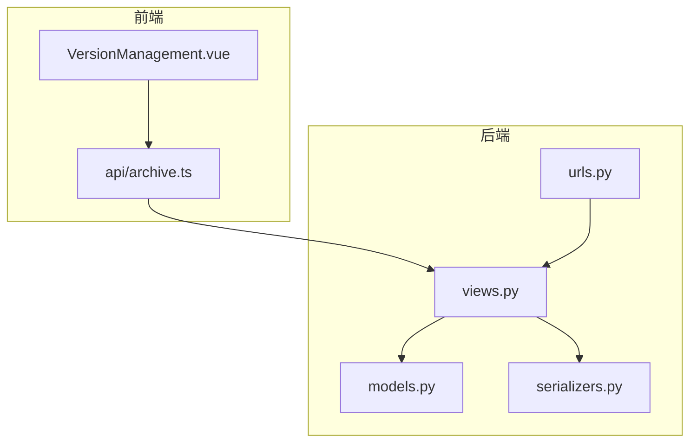
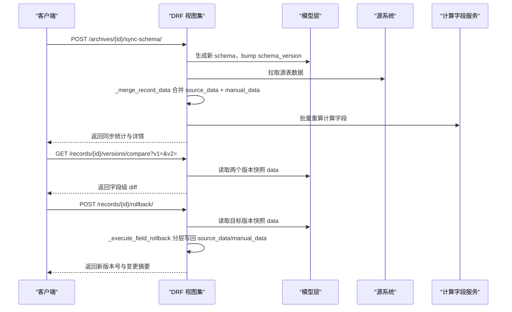
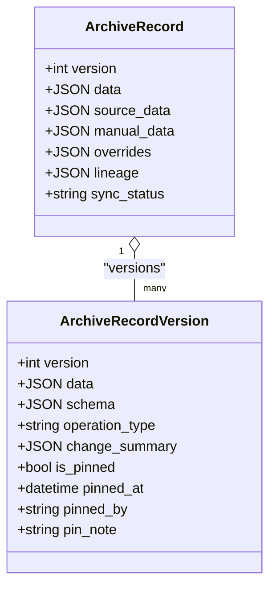
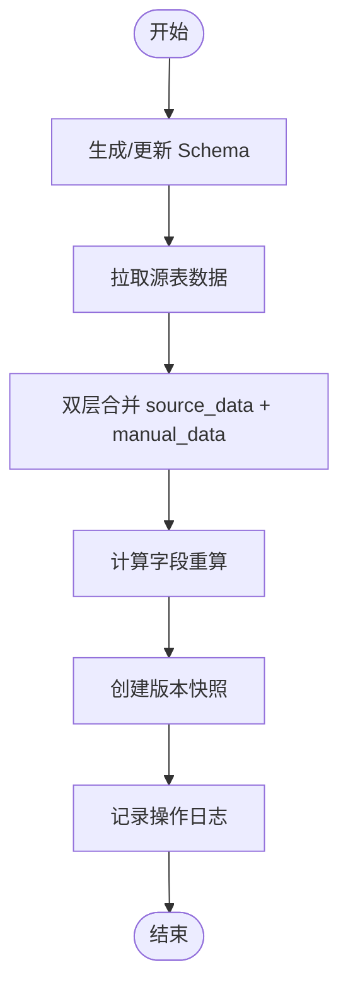
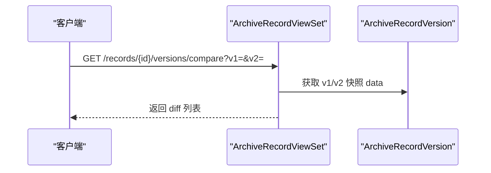
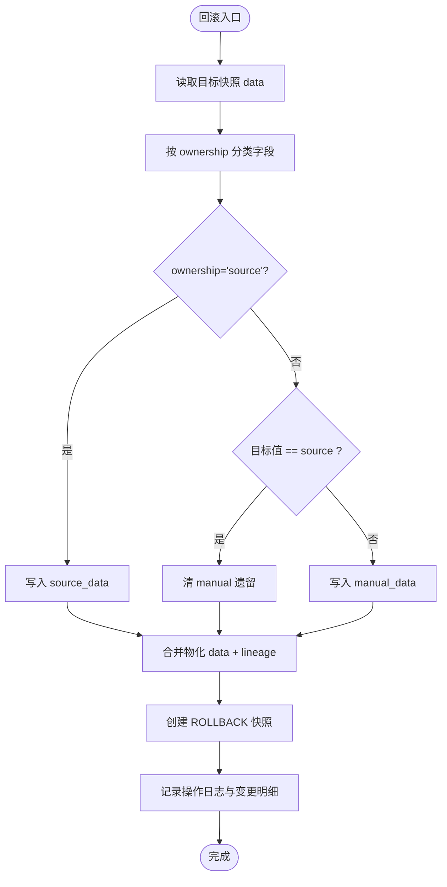
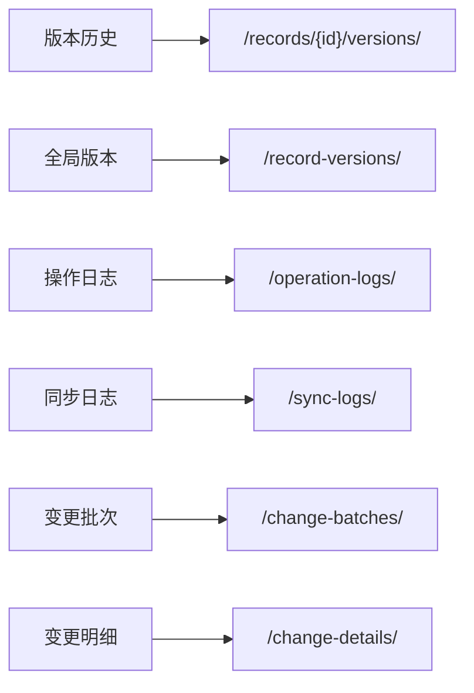
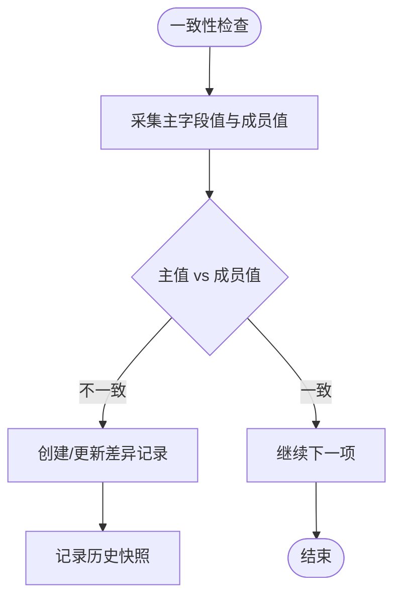
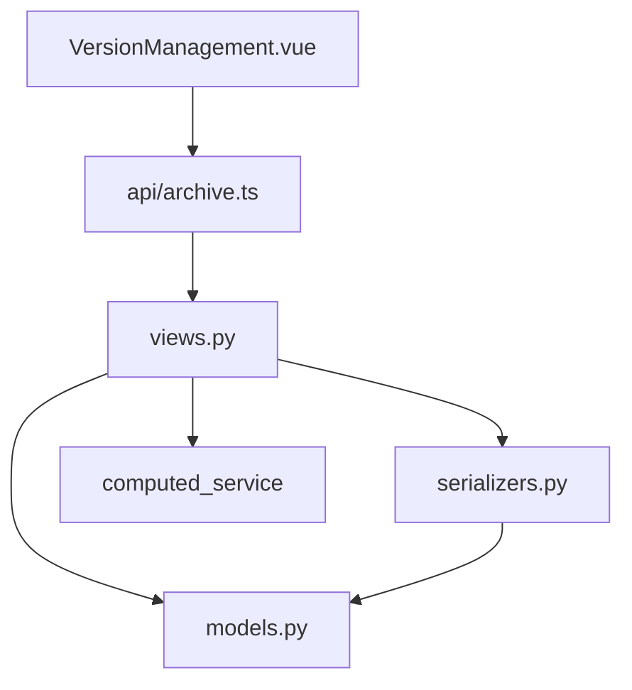

# 版本控制API

<cite>
**本文引用的文件**   
- [backend/apps/archive/models.py](file://backend/apps/archive/models.py)
- [backend/apps/archive/views.py](file://backend/apps/archive/views.py)
- [backend/apps/archive/serializers.py](file://backend/apps/archive/serializers.py)
- [backend/apps/archive/urls.py](file://backend/apps/archive/urls.py)
- [frontend/src/api/archive.ts](file://frontend/src/api/archive.ts)
- [frontend/src/views/archive/VersionManagement.vue](file://frontend/src/views/archive/VersionManagement.vue)
</cite>

## 目录
1. [简介](#简介)
2. [项目结构](#项目结构)
3. [核心组件](#核心组件)
4. [架构总览](#架构总览)
5. [详细组件分析](#详细组件分析)
6. [依赖关系分析](#依赖关系分析)
7. [性能考量](#性能考量)
8. [故障排查指南](#故障排查指南)
9. [结论](#结论)
10. [附录：完整API规范与示例](#附录完整api规范与示例)

## 简介
本文件为 MetaData002 系统的“版本控制”能力提供完整的API文档，覆盖数据版本的创建、发布（同步）、回滚、比较、历史查询与审计、冲突检测与解决机制的接口说明。同时给出版本快照生成机制与存储策略、差异对比与合并语义、以及最佳实践与操作示例，帮助开发者快速集成与使用。

## 项目结构
后端采用 Django + DRF 架构，版本控制相关能力集中在 archive 应用内：
- models.py：定义档案、记录、版本快照、变更批次与明细、一致性差异等模型
- views.py：实现版本相关的视图集与自定义动作（版本列表、对比、回滚、定版等）
- serializers.py：序列化器，封装版本、回滚、全局版本、变更日志等数据结构
- urls.py：注册路由，暴露 REST API
- 前端：archive.ts 提供调用封装；VersionManagement.vue 展示变更日志与版本管理界面

**图表来源**
- [backend/apps/archive/models.py:1-379](file://backend/apps/archive/models.py#L1-L379)
- [backend/apps/archive/views.py:1-2487](file://backend/apps/archive/views.py#L1-L2487)
- [backend/apps/archive/serializers.py:1-552](file://backend/apps/archive/serializers.py#L1-L552)
- [backend/apps/archive/urls.py:1-21](file://backend/apps/archive/urls.py#L1-L21)
- [frontend/src/api/archive.ts:1-139](file://frontend/src/api/archive.ts#L1-L139)
- [frontend/src/views/archive/VersionManagement.vue:1-628](file://frontend/src/views/archive/VersionManagement.vue#L1-L628)

**章节来源**
- [backend/apps/archive/models.py:1-379](file://backend/apps/archive/models.py#L1-L379)
- [backend/apps/archive/views.py:1-2487](file://backend/apps/archive/views.py#L1-L2487)
- [backend/apps/archive/serializers.py:1-552](file://backend/apps/archive/serializers.py#L1-L552)
- [backend/apps/archive/urls.py:1-21](file://backend/apps/archive/urls.py#L1-L21)
- [frontend/src/api/archive.ts:1-139](file://frontend/src/api/archive.ts#L1-L139)
- [frontend/src/views/archive/VersionManagement.vue:1-628](file://frontend/src/views/archive/VersionManagement.vue#L1-L628)

## 核心组件
- 版本快照（ArchiveRecordVersion）：每次新增、修改、删除、回滚、定版、模型同步均产生快照，包含 data、schema、操作人、时间、类型、变更摘要、是否定版等
- 双层存储（source_data / manual_data）：源侧整层替换，人工覆盖层按 ownership 决定优先级；合并物化结果写入 data
- 变更批次与明细（ArchiveChangeBatch / ArchiveChangeDetail）：统一记录来源（同步/人工/一致性），支持整批撤销与单条回滚
- 一致性检查（ConsistencyIssue / ConsistencyCheckRule）：四类检查规则，支持失效配置与批量审核
- 操作与同步日志（OperationLog / SyncLog）：审计追踪

**章节来源**
- [backend/apps/archive/models.py:75-110](file://backend/apps/archive/models.py#L75-L110)
- [backend/apps/archive/models.py:206-272](file://backend/apps/archive/models.py#L206-L272)
- [backend/apps/archive/models.py:274-332](file://backend/apps/archive/models.py#L274-L332)
- [backend/apps/archive/models.py:174-204](file://backend/apps/archive/models.py#L174-L204)
- [backend/apps/archive/models.py:112-137](file://backend/apps/archive/models.py#L112-L137)

## 架构总览
版本控制的核心流程包括：
- 版本快照生成：在记录创建、更新、删除、回滚、定版、模型同步时自动创建
- 数据同步与合并：从源系统拉取数据，按 schema 与 ownership 进行双层合并，计算字段重算
- 版本对比：基于两个版本快照的 data 字段级差异
- 版本回滚：按目标版本或时间点恢复，按 ownership 分层写回 source_data/manual_data
- 变更批次与审计：所有变更落批与明细，支持导出与整批撤销
- 一致性检查：四类检查规则，支持失效与批量审核

**图表来源**
- [backend/apps/archive/views.py:275-329](file://backend/apps/archive/views.py#L275-L329)
- [backend/apps/archive/views.py:1637-1672](file://backend/apps/archive/views.py#L1637-L1672)
- [backend/apps/archive/views.py:1674-1692](file://backend/apps/archive/views.py#L1674-L1692)
- [backend/apps/archive/views.py:2105-2200](file://backend/apps/archive/views.py#L2105-L2200)

## 详细组件分析

### 版本快照与存储策略
- 快照字段：version、data、schema、operated_by、operated_at、operation_type、change_summary、is_pinned/pinned_at/pinned_by/pin_note
- 触发时机：
  - 创建记录：CREATE 快照
  - 更新记录：UPDATE 快照（含状态切换）
  - 删除记录：DELETE 快照（软删除，保留快照）
  - 回滚：ROLLBACK 快照
  - 定版：PIN/UNPIN 标记
  - 模型同步：SCHEMA_SYNC 快照（schema 变更）
- 存储策略：
  - 双层存储：source_data（源侧整层替换）、manual_data（人工覆盖层）
  - 合并逻辑：ownership='source' 取 source_data；ownership='archive' 优先 manual_data，否则 fallback 到 source_data；computed 字段保留现值
  - 血缘 lineage：记录每个字段的来源与更新时间

**图表来源**
- [backend/apps/archive/models.py:33-73](file://backend/apps/archive/models.py#L33-L73)
- [backend/apps/archive/models.py:75-110](file://backend/apps/archive/models.py#L75-L110)

**章节来源**
- [backend/apps/archive/models.py:33-73](file://backend/apps/archive/models.py#L33-L73)
- [backend/apps/archive/models.py:75-110](file://backend/apps/archive/models.py#L75-L110)
- [backend/apps/archive/views.py:1530-1560](file://backend/apps/archive/views.py#L1530-L1560)
- [backend/apps/archive/views.py:2105-2200](file://backend/apps/archive/views.py#L2105-L2200)

### 版本创建与发布（同步）
- 创建版本快照：
  - 新建记录：初始 version=1，CREATE 快照
  - 编辑记录：version+1，UPDATE 快照，记录变更摘要
  - 删除记录：version+1，DELETE 快照（软删除）
- 发布（同步）：
  - 同步 schema：POST /archives/{id}/sync-schema/，生成新 schema，bump schema_version
  - 刷新数据：POST /archives/{id}/refresh-data/，仅拉取源数据并合并
  - 预检：GET /archives/{id}/refresh-preview/，零写入预览 schema 与数据变化

**图表来源**
- [backend/apps/archive/views.py:275-329](file://backend/apps/archive/views.py#L275-L329)
- [backend/apps/archive/views.py:1530-1560](file://backend/apps/archive/views.py#L1530-L1560)
- [backend/apps/archive/views.py:1332-1517](file://backend/apps/archive/views.py#L1332-L1517)

**章节来源**
- [backend/apps/archive/views.py:275-329](file://backend/apps/archive/views.py#L275-L329)
- [backend/apps/archive/views.py:1530-1560](file://backend/apps/archive/views.py#L1530-L1560)
- [backend/apps/archive/views.py:1332-1517](file://backend/apps/archive/views.py#L1332-L1517)

### 版本差异对比
- 接口：GET /records/{id}/versions/compare/?v1=<num>&v2=<num>
- 行为：读取两个版本快照的 data，逐字段比较，返回 diff 列表（field、old_value、new_value）

**图表来源**
- [backend/apps/archive/views.py:1649-1672](file://backend/apps/archive/views.py#L1649-L1672)

**章节来源**
- [backend/apps/archive/views.py:1649-1672](file://backend/apps/archive/views.py#L1649-L1672)

### 版本回滚与合并语义
- 回滚接口：
  - 按版本号：POST /records/{id}/rollback/，target_version
  - 按时间点：POST /records/{id}/rollback-to-change/，target_detail_id
  - 单条明细回滚：POST /change-details/{id}/rollback/
  - 整批撤销：POST /change-batches/{id}/rollback/
- 合并语义：
  - ownership='source'：直接写 source_data，清 manual 遗留
  - ownership='archive'：目标值等于 source 则回落（清 manual），否则写 manual
  - computed 字段：保留现值，由计算服务负责
- 执行器：_execute_field_rollback 统一分层写回，生成 ROLLBACK 快照与变更明细

**图表来源**
- [backend/apps/archive/views.py:1674-1692](file://backend/apps/archive/views.py#L1674-L1692)
- [backend/apps/archive/views.py:1694-1728](file://backend/apps/archive/views.py#L1694-L1728)
- [backend/apps/archive/views.py:2061-2102](file://backend/apps/archive/views.py#L2061-L2102)
- [backend/apps/archive/views.py:2105-2200](file://backend/apps/archive/views.py#L2105-L2200)

**章节来源**
- [backend/apps/archive/views.py:1674-1692](file://backend/apps/archive/views.py#L1674-L1692)
- [backend/apps/archive/views.py:1694-1728](file://backend/apps/archive/views.py#L1694-L1728)
- [backend/apps/archive/views.py:2061-2102](file://backend/apps/archive/views.py#L2061-L2102)
- [backend/apps/archive/views.py:2105-2200](file://backend/apps/archive/views.py#L2105-L2200)

### 版本历史查询与审计
- 版本历史：GET /records/{id}/versions/
- 全局版本：GET /record-versions/（支持 archive、record、operation_type、is_pinned、operated_by 过滤）
- 操作日志：GET /operation-logs/（支持 archive、operation_type、operator 过滤）
- 同步日志：GET /sync-logs/（支持 archive、status 过滤）
- 变更批次与明细：GET /change-batches/、GET /change-details/（支持多条件过滤与导出 Excel）

**图表来源**
- [backend/apps/archive/views.py:1637-1647](file://backend/apps/archive/views.py#L1637-L1647)
- [backend/apps/archive/views.py:1784-1803](file://backend/apps/archive/views.py#L1784-L1803)
- [backend/apps/archive/views.py:1768-1781](file://backend/apps/archive/views.py#L1768-L1781)
- [backend/apps/archive/views.py:1760-1765](file://backend/apps/archive/views.py#L1760-L1765)
- [backend/apps/archive/views.py:1848-1861](file://backend/apps/archive/views.py#L1848-L1861)
- [backend/apps/archive/views.py:1951-1972](file://backend/apps/archive/views.py#L1951-L1972)

**章节来源**
- [backend/apps/archive/views.py:1637-1647](file://backend/apps/archive/views.py#L1637-L1647)
- [backend/apps/archive/views.py:1784-1803](file://backend/apps/archive/views.py#L1784-L1803)
- [backend/apps/archive/views.py:1768-1781](file://backend/apps/archive/views.py#L1768-L1781)
- [backend/apps/archive/views.py:1760-1765](file://backend/apps/archive/views.py#L1760-L1765)
- [backend/apps/archive/views.py:1848-1861](file://backend/apps/archive/views.py#L1848-L1861)
- [backend/apps/archive/views.py:1951-1972](file://backend/apps/archive/views.py#L1951-L1972)

### 版本发布的审批流程与工作流集成
- 当前实现未内置审批工作流，但可通过以下方式扩展：
  - 在 sync-schema/refresh-data 前增加前置校验（如权限、审批状态）
  - 通过 OperationLog 与 ChangeBatch/ChangeDetail 审计轨迹，结合外部工作流引擎（如 BPMN）驱动
  - 使用 Pin（定版）作为“基线”，在发布前锁定关键版本
- 建议集成点：
  - 在 ArchiveViewSet.sync_schema 中插入审批钩子
  - 在 RecordVersionViewSet.pin/unpin 中记录审批节点
  - 通过 ChangeBatch.change_source='consistency' 表示一致性处理后的发布

**章节来源**
- [backend/apps/archive/views.py:275-329](file://backend/apps/archive/views.py#L275-L329)
- [backend/apps/archive/views.py:1730-1757](file://backend/apps/archive/views.py#L1730-L1757)
- [backend/apps/archive/views.py:1805-1845](file://backend/apps/archive/views.py#L1805-L1845)

### 版本冲突检测与解决机制
- 冲突检测：
  - 一致性检查四类：组合字段成员一致性、档案侧与源侧差异、源侧孤立记录、Schema 漂移
  - 预检接口：GET /archives/{id}/refresh-preview/ 可预览数据变化与波及影响
- 解决机制：
  - 人工覆盖层（manual_data）保护字段不被源侧刷新覆盖（overrides）
  - 一致性差异清单（ConsistencyIssue）支持批量标记 reviewed/ignored/reopen
  - 整批撤销与单条回滚用于快速修复

**图表来源**
- [backend/apps/archive/views.py:396-600](file://backend/apps/archive/views.py#L396-L600)
- [backend/apps/archive/views.py:602-787](file://backend/apps/archive/views.py#L602-L787)

**章节来源**
- [backend/apps/archive/views.py:396-600](file://backend/apps/archive/views.py#L396-L600)
- [backend/apps/archive/views.py:602-787](file://backend/apps/archive/views.py#L602-L787)

## 依赖关系分析
- 视图集依赖模型：Archive、ArchiveRecord、ArchiveRecordVersion、ArchiveChangeBatch、ArchiveChangeDetail、ConsistencyIssue、ConsistencyCheckRule
- 序列化器依赖模型与工具函数：_record_pk_key、_composite_label_codes、_build_record_label
- 前端依赖后端 API：archive.ts 封装了所有版本控制相关端点
- 计算字段服务：batch_recalculate 与 recalculate_affected 在同步与更新后触发

**图表来源**
- [backend/apps/archive/views.py:1-23](file://backend/apps/archive/views.py#L1-L23)
- [backend/apps/archive/serializers.py:1-8](file://backend/apps/archive/serializers.py#L1-L8)
- [frontend/src/api/archive.ts:1-139](file://frontend/src/api/archive.ts#L1-L139)
- [frontend/src/views/archive/VersionManagement.vue:1-628](file://frontend/src/views/archive/VersionManagement.vue#L1-L628)

**章节来源**
- [backend/apps/archive/views.py:1-23](file://backend/apps/archive/views.py#L1-L23)
- [backend/apps/archive/serializers.py:1-8](file://backend/apps/archive/serializers.py#L1-L8)
- [frontend/src/api/archive.ts:1-139](file://frontend/src/api/archive.ts#L1-L139)
- [frontend/src/views/archive/VersionManagement.vue:1-628](file://frontend/src/views/archive/VersionManagement.vue#L1-L628)

## 性能考量
- 双层存储减少比对开销：source_data 整层替换，避免字段级比对
- 合并物化惰性计算：仅在读取 data 时合并，避免频繁全量合并
- 变更批次聚合：零变更不建批次，减少噪声
- 分页与索引：版本历史、变更明细、操作日志均支持分页与索引优化
- 计算字段重算：批量重算与受影响字段重算，避免全量重算

[本节为通用指导，无需特定文件引用]

## 故障排查指南
- 常见错误：
  - 参数缺失：如 compare_versions 缺少 v1/v2，rollback_to_change 缺少 target_detail_id
  - 权限限制：记录不允许人工新增（create 被拒绝）
  - 无版本映射：早期历史明细无法按时间点回滚
- 排查步骤：
  - 检查请求参数与路径
  - 查看 OperationLog/SyncLog 定位失败点
  - 使用 refresh-preview 预检数据变化
  - 检查一致性差异清单与规则失效配置

**章节来源**
- [backend/apps/archive/views.py:1649-1672](file://backend/apps/archive/views.py#L1649-L1672)
- [backend/apps/archive/views.py:1694-1728](file://backend/apps/archive/views.py#L1694-L1728)
- [backend/apps/archive/views.py:1568-1573](file://backend/apps/archive/views.py#L1568-L1573)

## 结论
MetaData002 的版本控制功能提供了完善的快照、对比、回滚、审计与一致性检查能力，通过双层存储与合并语义确保数据一致性与可追溯性。建议在生产环境中结合审批工作流与外部系统集成，进一步提升发布安全性与可控性。

[本节为总结，无需特定文件引用]

## 附录：完整API规范与示例

### 版本历史与对比
- GET /records/{id}/versions/
  - 描述：分页返回记录的所有版本快照
  - 响应：VersionSerializer 列表
- GET /records/{id}/versions/compare/?v1=<num>&v2=<num>
  - 描述：对比两个版本的 data 差异
  - 响应：{version_1, version_2, diff: [{field, old_value, new_value}]}

**章节来源**
- [backend/apps/archive/views.py:1637-1672](file://backend/apps/archive/views.py#L1637-L1672)
- [backend/apps/archive/serializers.py:381-398](file://backend/apps/archive/serializers.py#L381-L398)

### 版本回滚
- POST /records/{id}/rollback/
  - 请求体：{target_version, operated_by}
  - 描述：恢复到指定版本，按 ownership 分层写回
- POST /records/{id}/rollback-to-change/
  - 请求体：{target_detail_id, operated_by}
  - 描述：恢复到某变更明细对应的版本快照
- POST /change-details/{id}/rollback/
  - 请求体：{operated_by}
  - 描述：单条变更明细回滚（v18 语义：恢复到变更前状态）
- POST /change-batches/{id}/rollback/
  - 请求体：{operated_by}
  - 描述：整批撤销，跳过后续编辑的记录并列出

**章节来源**
- [backend/apps/archive/views.py:1674-1728](file://backend/apps/archive/views.py#L1674-L1728)
- [backend/apps/archive/views.py:2061-2102](file://backend/apps/archive/views.py#L2061-L2102)
- [backend/apps/archive/views.py:1882-1948](file://backend/apps/archive/views.py#L1882-L1948)

### 版本定版
- POST /records/{id}/pin/
  - 请求体：{operated_by, note}
  - 描述：定版当前版本快照
- POST /record-versions/{id}/pin/
  - 请求体：{operated_by, note}
  - 描述：定版任意版本快照
- POST /record-versions/{id}/unpin/
  - 请求体：{operated_by}
  - 描述：取消定版

**章节来源**
- [backend/apps/archive/views.py:1730-1757](file://backend/apps/archive/views.py#L1730-L1757)
- [backend/apps/archive/views.py:1805-1845](file://backend/apps/archive/views.py#L1805-L1845)

### 版本发布（同步）
- POST /archives/{id}/sync-schema/
  - 请求体：{operated_by}
  - 描述：同步模型变更，拉取源数据，重算计算字段
- POST /archives/{id}/refresh-data/
  - 请求体：{operated_by}
  - 描述：仅刷新源数据，不改变 schema
- GET /archives/{id}/refresh-preview/
  - 描述：预检 schema 与数据变化（零写入）

**章节来源**
- [backend/apps/archive/views.py:275-329](file://backend/apps/archive/views.py#L275-L329)
- [backend/apps/archive/views.py:331-342](file://backend/apps/archive/views.py#L331-L342)
- [backend/apps/archive/views.py:344-394](file://backend/apps/archive/views.py#L344-L394)

### 版本历史与审计
- GET /record-versions/
  - 描述：全局版本列表（支持 archive、record、operation_type、is_pinned、operated_by 过滤）
- GET /operation-logs/
  - 描述：操作日志（支持 archive、operation_type、operator 过滤）
- GET /sync-logs/
  - 描述：同步日志（支持 archive、status 过滤）
- GET /change-batches/
  - 描述：变更批次列表（支持 archive、change_source 过滤）
- GET /change-details/
  - 描述：变更明细列表（支持 archive、batch、record、change_type、change_source、record_key 过滤）
- GET /change-details/export/?archive=<id>
  - 描述：导出单个档案的全部变更日志 Excel

**章节来源**
- [backend/apps/archive/views.py:1784-1803](file://backend/apps/archive/views.py#L1784-L1803)
- [backend/apps/archive/views.py:1768-1781](file://backend/apps/archive/views.py#L1768-L1781)
- [backend/apps/archive/views.py:1760-1765](file://backend/apps/archive/views.py#L1760-L1765)
- [backend/apps/archive/views.py:1848-1861](file://backend/apps/archive/views.py#L1848-L1861)
- [backend/apps/archive/views.py:1951-1972](file://backend/apps/archive/views.py#L1951-L1972)
- [backend/apps/archive/views.py:1974-2059](file://backend/apps/archive/views.py#L1974-L2059)

### 一致性检查与规则
- POST /archives/{id}/consistency-check/
  - 请求体：{operated_by}
  - 描述：执行四类一致性检查，upsert 差异记录
- GET /consistency-issues/
  - 描述：一致性差异清单（支持 archive、status、field_code、record_key、check_type 过滤）
- POST /consistency-issues/batch-review/
  - 请求体：{ids, action, note, operated_by}
  - 描述：批量标记 reviewed/ignored/reopen
- GET /consistency-rules/
  - 描述：一致性检查规则失效配置
- POST /consistency-rules/disable/
  - 描述：失效指定规则
- POST /consistency-rules/enable/
  - 描述：启用指定规则
- POST /consistency-rules/{id}/toggle/
  - 描述：切换规则失效/启用状态

**章节来源**
- [backend/apps/archive/views.py:396-600](file://backend/apps/archive/views.py#L396-L600)
- [backend/apps/archive/views.py:2203-2283](file://backend/apps/archive/views.py#L2203-L2283)
- [backend/apps/archive/views.py:2286-2362](file://backend/apps/archive/views.py#L2286-L2362)

### 前端调用示例
- 版本历史：archiveRecordApi.listVersions(id)
- 版本对比：archiveRecordApi.compareVersions(id, v1, v2)
- 版本回滚：archiveRecordApi.rollback(id, targetVersion, operatedBy)
- 按时间点回滚：archiveRecordApi.rollbackToChange(id, targetDetailId, operatedBy)
- 定版：archiveRecordApi.pinVersion(id, operatedBy, note)
- 同步 schema：archiveApi.syncSchema(id, operatedBy)
- 刷新数据：archiveApi.refreshData(id, operatedBy)
- 预检：archiveApi.refreshPreview(id)
- 一致性检查：archiveApi.consistencyCheck(id, operatedBy)
- 变更批次：changeLogApi.listBatches(params)
- 变更明细：changeLogApi.listDetails(params)
- 导出 Excel：changeLogApi.exportExcel(archiveId)

**章节来源**
- [frontend/src/api/archive.ts:1-139](file://frontend/src/api/archive.ts#L1-L139)