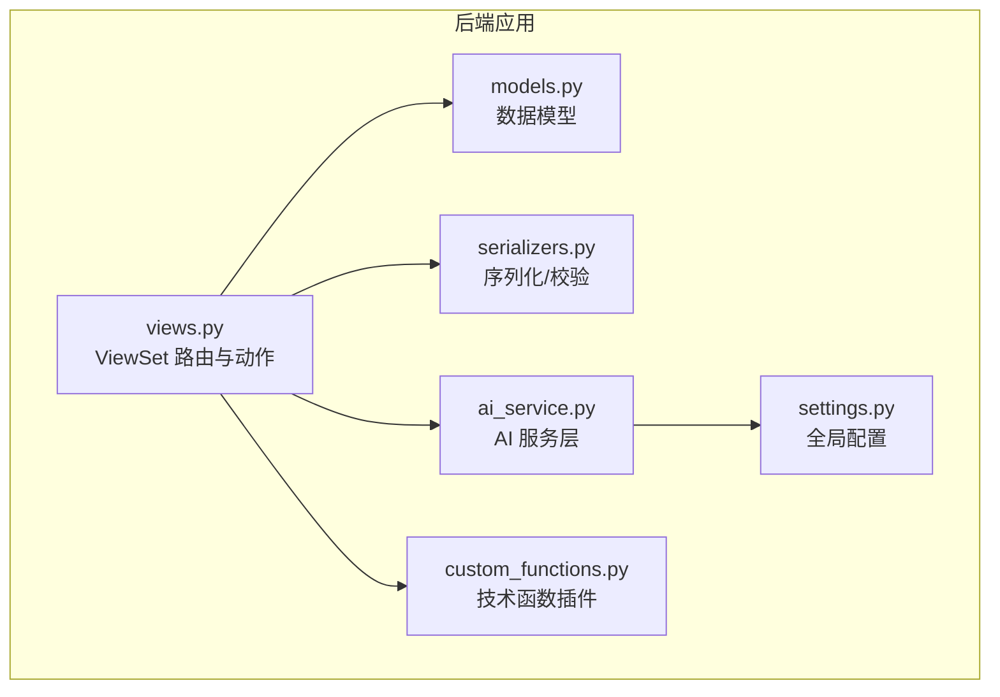
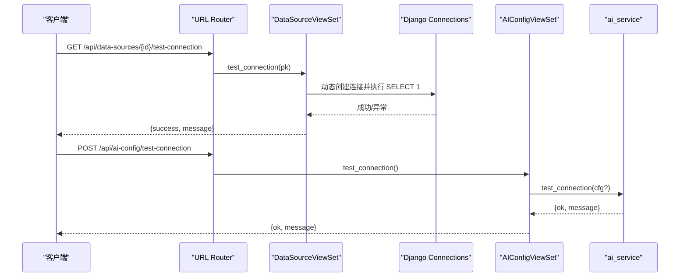
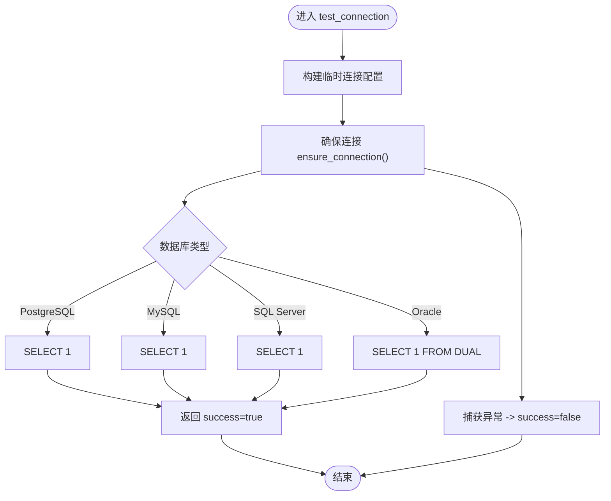
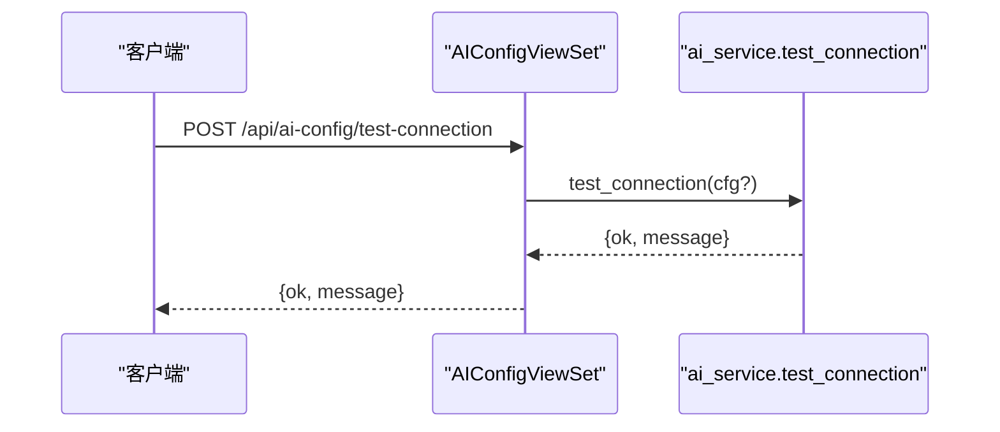
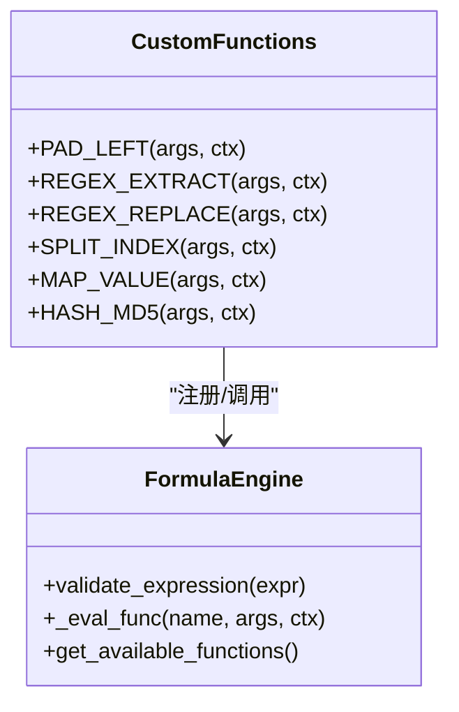
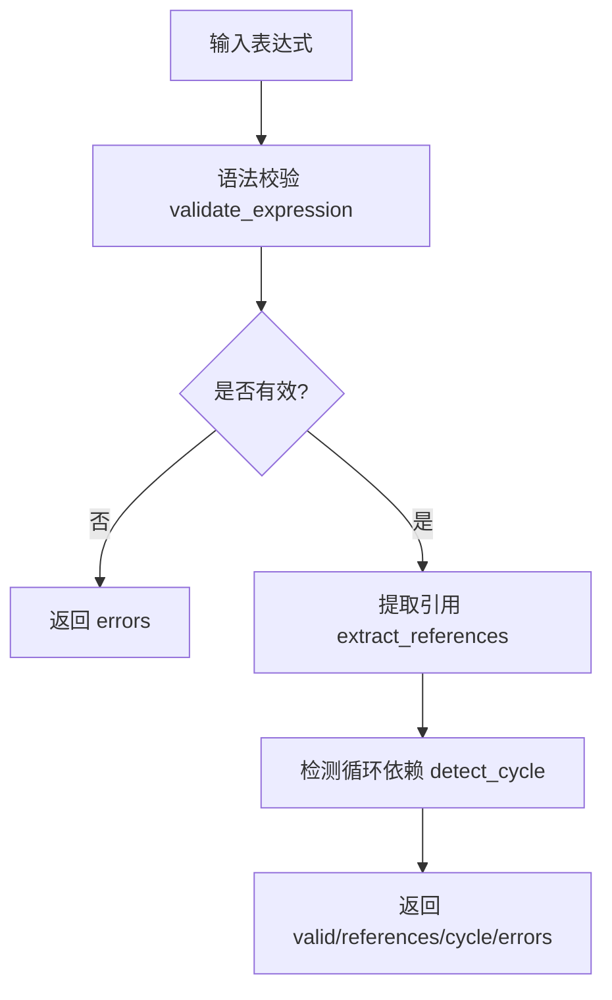
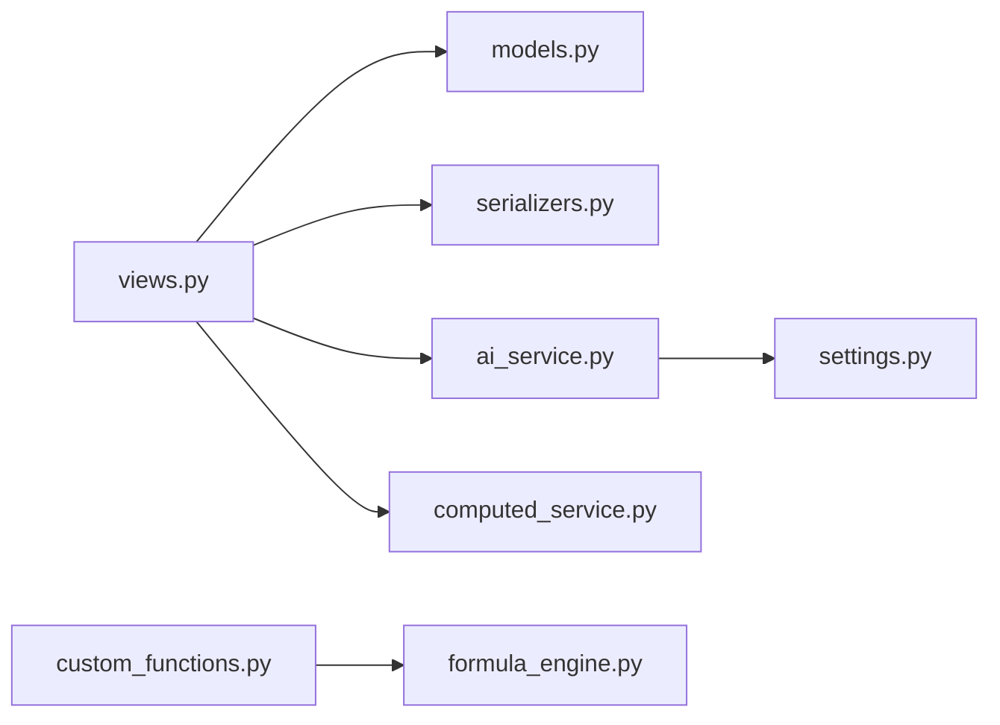

# 系统设置API

<cite>
**本文引用的文件**
- [backend/apps/modeling/urls.py](file://backend/apps/modeling/urls.py)
- [backend/apps/modeling/views.py](file://backend/apps/modeling/views.py)
- [backend/apps/modeling/models.py](file://backend/apps/modeling/models.py)
- [backend/apps/modeling/serializers.py](file://backend/apps/modeling/serializers.py)
- [backend/apps/modeling/ai_service.py](file://backend/apps/modeling/ai_service.py)
- [backend/apps/modeling/custom_functions.py](file://backend/apps/modeling/custom_functions.py)
- [backend/config/settings.py](file://backend/config/settings.py)
</cite>

## 目录
1. [简介](#简介)
2. [项目结构](#项目结构)
3. [核心组件](#核心组件)
4. [架构总览](#架构总览)
5. [详细组件分析](#详细组件分析)
6. [依赖关系分析](#依赖关系分析)
7. [性能考量](#性能考量)
8. [故障排查指南](#故障排查指南)
9. [结论](#结论)
10. [附录](#附录)

## 简介
本文件为 MetaData002 系统的“系统设置”模块 API 文档，聚焦以下能力：
- 数据源配置管理：连接测试、配置验证、状态查询、Schema/外部表枚举与预览。
- AI 服务配置：连接参数管理、提示词模板、连接测试。
- 技术函数管理：自定义公式函数的注册、管理与调用（通过表达式引擎）。
- 系统健康检查与监控：AI 连接测试、数据源连通性检测等。
- 安全与权限：密钥保护、只读字段、请求校验与错误处理策略。

## 项目结构
系统设置相关接口集中在 modeling 应用内，采用 Django REST Framework 的 ViewSet + Router 组织路由；模型定义在 models.py，序列化器在 serializers.py，AI 能力封装在 ai_service.py，技术函数插件入口在 custom_functions.py。

**图表来源**
- [backend/apps/modeling/views.py:1-120](file://backend/apps/modeling/views.py#L1-L120)
- [backend/apps/modeling/models.py:1-120](file://backend/apps/modeling/models.py#L1-L120)
- [backend/apps/modeling/serializers.py:1-120](file://backend/apps/modeling/serializers.py#L1-L120)
- [backend/apps/modeling/ai_service.py:1-120](file://backend/apps/modeling/ai_service.py#L1-L120)
- [backend/apps/modeling/custom_functions.py:1-60](file://backend/apps/modeling/custom_functions.py#L1-L60)
- [backend/config/settings.py:1-120](file://backend/config/settings.py#L1-L120)

**章节来源**
- [backend/apps/modeling/urls.py:1-20](file://backend/apps/modeling/urls.py#L1-L20)
- [backend/apps/modeling/views.py:1-120](file://backend/apps/modeling/views.py#L1-L120)

## 核心组件
- 数据源配置（DataSource）：支持 PostgreSQL、MySQL、SQL Server、Oracle 的动态连接与测试。
- AI 服务配置（AIConfig）：单例语义，提供 current/test-connection 端点，支持临时覆盖测试。
- 计算字段与表达式引擎：语法校验、依赖解析、循环检测、自然语言生成表达式。
- 技术函数插件：通过装饰器注册，自动纳入校验、求值与前端函数库展示。

**章节来源**
- [backend/apps/modeling/models.py:1-120](file://backend/apps/modeling/models.py#L1-L120)
- [backend/apps/modeling/serializers.py:1-120](file://backend/apps/modeling/serializers.py#L1-L120)
- [backend/apps/modeling/ai_service.py:1-120](file://backend/apps/modeling/ai_service.py#L1-L120)
- [backend/apps/modeling/custom_functions.py:1-60](file://backend/apps/modeling/custom_functions.py#L1-L60)

## 架构总览
系统设置模块通过 DRF Router 暴露 RESTful 接口，各 ViewSet 负责业务逻辑，调用 ai_service 进行 AI 能力，使用 settings 获取环境变量或数据库配置。

**图表来源**
- [backend/apps/modeling/views.py:74-147](file://backend/apps/modeling/views.py#L74-L147)
- [backend/apps/modeling/views.py:1780-1822](file://backend/apps/modeling/views.py#L1780-L1822)
- [backend/apps/modeling/ai_service.py:78-90](file://backend/apps/modeling/ai_service.py#L78-L90)

## 详细组件分析

### 数据源配置管理（/api/data-sources）
- 列表/详情/更新：标准 CRUD，密码字段 write_only，状态与时间戳只读。
- 连接测试（已保存）：GET /{id}/test-connection
- 连接测试（未保存参数）：POST /test-connection（传入 db_type/host/port/db_name/username/password）
- Schema 列表：GET /{id}/schemas?include_counts=true|false
- 外部表列表：GET /{id}/external-tables?schema=&has_data=true|false
- 数据预览：GET /tables/{id}/preview-data?limit=...

行为要点
- 动态构建临时连接别名，避免污染默认连接。
- 针对 Oracle/SQL Server 特殊 OPTIONS 配置。
- 统一异常返回 success=false 或 error 信息。

**图表来源**
- [backend/apps/modeling/views.py:94-147](file://backend/apps/modeling/views.py#L94-L147)

**章节来源**
- [backend/apps/modeling/views.py:31-147](file://backend/apps/modeling/views.py#L31-L147)
- [backend/apps/modeling/views.py:148-324](file://backend/apps/modeling/views.py#L148-L324)
- [backend/apps/modeling/models.py:1-30](file://backend/apps/modeling/models.py#L1-L30)
- [backend/apps/modeling/serializers.py:5-13](file://backend/apps/modeling/serializers.py#L5-L13)

### AI 服务配置（/api/ai-config）
- current：GET/PUT/PATCH /current（不存在则自动创建默认）
- test-connection：POST /test-connection（可传入临时 api_base/api_key/model 覆盖）
- 序列化器保护 api_key 不回显，提供 has_api_key 标识与 prompt_defaults 默认提示词

行为要点
- 优先读取数据库中 enabled=True 的配置，回退到环境变量。
- 失败时返回 400，包含错误原因。

**图表来源**
- [backend/apps/modeling/views.py:1780-1822](file://backend/apps/modeling/views.py#L1780-L1822)
- [backend/apps/modeling/ai_service.py:78-90](file://backend/apps/modeling/ai_service.py#L78-L90)

**章节来源**
- [backend/apps/modeling/views.py:1780-1822](file://backend/apps/modeling/views.py#L1780-L1822)
- [backend/apps/modeling/serializers.py:248-279](file://backend/apps/modeling/serializers.py#L248-L279)
- [backend/apps/modeling/ai_service.py:19-54](file://backend/apps/modeling/ai_service.py#L19-L54)

### 技术函数管理（表达式引擎与插件）
- 注册：在 custom_functions.py 中使用 @register_function 装饰器注册函数，自动纳入：
  - 表达式语法校验与参数个数校验
  - 求值执行
  - 前端函数库展示
  - AI 自然语言生成表达式的可用函数清单
- 调用：通过计算字段的表达式引擎执行，错误抛出 FormulaRuntimeError 被 IFERROR 友好捕获。

**图表来源**
- [backend/apps/modeling/custom_functions.py:1-108](file://backend/apps/modeling/custom_functions.py#L1-L108)

**章节来源**
- [backend/apps/modeling/custom_functions.py:1-108](file://backend/apps/modeling/custom_functions.py#L1-L108)

### 计算字段与表达式（系统设置相关）
- 表达式验证：POST /computed-fields/validate-expression（无需实例）
- 公式验证：POST /computed-fields/{id}/validate-formula（可选 expression）
- 依赖解析与循环检测：创建/更新后自动解析依赖，支持 DAG 拓扑顺序。

**图表来源**
- [backend/apps/modeling/views.py:1931-1979](file://backend/apps/modeling/views.py#L1931-L1979)

**章节来源**
- [backend/apps/modeling/views.py:1882-1979](file://backend/apps/modeling/views.py#L1882-L1979)

### 域与表（辅助系统设置）
- 域配置完整性检查：GET /domains/{id}/check-config（P0/P1/P2 级别检查）
- 主键状态检查：GET /domains/{id}/pk-status
- 表状态切换：PUT /tables/{id}/toggle-status（存在映射时禁止停用）
- Excel 导入与预览：POST /tables/preview-excel、POST /tables/import-excel

**章节来源**
- [backend/apps/modeling/views.py:327-503](file://backend/apps/modeling/views.py#L327-L503)
- [backend/apps/modeling/views.py:504-917](file://backend/apps/modeling/views.py#L504-L917)

## 依赖关系分析
- views 依赖 models、serializers、ai_service、formula_engine（通过 computed_service 间接）。
- ai_service 依赖 settings 环境变量与数据库 AIConfig。
- custom_functions 通过 register_function 注入 formula_engine。

**图表来源**
- [backend/apps/modeling/views.py:1-120](file://backend/apps/modeling/views.py#L1-L120)
- [backend/apps/modeling/ai_service.py:1-120](file://backend/apps/modeling/ai_service.py#L1-L120)
- [backend/apps/modeling/custom_functions.py:1-60](file://backend/apps/modeling/custom_functions.py#L1-L60)

**章节来源**
- [backend/apps/modeling/views.py:1-120](file://backend/apps/modeling/views.py#L1-L120)
- [backend/apps/modeling/ai_service.py:1-120](file://backend/apps/modeling/ai_service.py#L1-L120)

## 性能考量
- 数据源连接：每次测试/查询均动态创建临时连接别名，避免连接池污染；建议在生产环境启用连接复用与超时控制。
- 外部表扫描：schema/表列表可能涉及全库元数据查询，建议在大数据量场景增加分页或限制 schema。
- AI 调用：网络 I/O 为主，需合理设置 timeout 与重试策略；无 LLM 时回退启发式算法保证可用性。
- 表达式验证：解析与依赖检测复杂度与引用数量线性相关，建议对复杂表达式做缓存。

[本节为通用指导，不直接分析具体文件]

## 故障排查指南
- 数据源连接失败
  - 检查 db_type 是否受支持（postgresql/mysql/sqlserver/oracle）。
  - 确认 host/port/db_name/username/password 正确。
  - Oracle 需 service_name，SQL Server 需 ODBC 驱动。
  - 参考：连接测试实现路径 [backend/apps/modeling/views.py:94-147](file://backend/apps/modeling/views.py#L94-L147)
- AI 连接失败
  - 检查 api_key 是否为空，requests 是否安装。
  - 若传临时 cfg，确保 api_key 非空；否则沿用已存配置。
  - 参考：AI 连接测试实现路径 [backend/apps/modeling/ai_service.py:78-90](file://backend/apps/modeling/ai_service.py#L78-L90)
- 表达式验证失败
  - 检查函数名与参数个数是否匹配，字段引用是否完整（花括号）。
  - 查看 validate-expression 返回 errors 与 references。
  - 参考：表达式验证路径 [backend/apps/modeling/views.py:1931-1979](file://backend/apps/modeling/views.py#L1931-L1979)
- 表停用失败
  - 若存在字段映射关系，需先解除映射再停用。
  - 参考：toggle_status 实现路径 [backend/apps/modeling/views.py:690-722](file://backend/apps/modeling/views.py#L690-L722)

**章节来源**
- [backend/apps/modeling/views.py:94-147](file://backend/apps/modeling/views.py#L94-L147)
- [backend/apps/modeling/ai_service.py:78-90](file://backend/apps/modeling/ai_service.py#L78-L90)
- [backend/apps/modeling/views.py:1931-1979](file://backend/apps/modeling/views.py#L1931-L1979)
- [backend/apps/modeling/views.py:690-722](file://backend/apps/modeling/views.py#L690-L722)

## 结论
系统设置模块围绕数据源、AI 配置与表达式引擎三大核心，提供了完善的连接测试、配置校验与状态查询能力。通过插件化技术函数与 AI 自然语言生成，显著降低建模与公式编写门槛。生产部署建议关注连接复用、超时控制与安全密钥管理。

[本节为总结，不直接分析具体文件]

## 附录

### API 端点一览（系统设置相关）
- 数据源
  - GET/POST/PUT/PATCH /api/data-sources/
  - GET /api/data-sources/{id}/test-connection
  - POST /api/data-sources/test-connection
  - GET /api/data-sources/{id}/schemas
  - GET /api/data-sources/{id}/external-tables
- AI 配置
  - GET/PUT/PATCH /api/ai-config/current
  - POST /api/ai-config/test-connection
- 计算字段
  - POST /api/computed-fields/validate-expression
  - POST /api/computed-fields/{id}/validate-formula

**章节来源**
- [backend/apps/modeling/urls.py:1-20](file://backend/apps/modeling/urls.py#L1-L20)
- [backend/apps/modeling/views.py:31-147](file://backend/apps/modeling/views.py#L31-L147)
- [backend/apps/modeling/views.py:1780-1822](file://backend/apps/modeling/views.py#L1780-L1822)
- [backend/apps/modeling/views.py:1931-1979](file://backend/apps/modeling/views.py#L1931-L1979)

### 配置示例与环境变量
- 环境变量（settings.py）
  - AI_API_BASE、AI_API_KEY、AI_MODEL、AI_TIMEOUT
- 数据库配置（settings.py）
  - DATABASES.default（ENGINE/NAME/USER/PASSWORD/HOST/PORT）
- AI 配置（数据库 AIConfig）
  - name/provider/api_base/api_key/model/temperature/timeout/enabled/prompt_*

**章节来源**
- [backend/config/settings.py:56-123](file://backend/config/settings.py#L56-L123)
- [backend/apps/modeling/models.py:387-419](file://backend/apps/modeling/models.py#L387-L419)

### 安全与权限说明
- 敏感字段保护：DataSource.password、AIConfig.api_key 写-only，不在响应中回显。
- 只读字段：id、status、created_at、updated_at 等由服务端维护。
- 请求校验：使用 DRF Serializer 进行字段校验与业务规则检查。
- 错误处理：统一返回结构化错误信息，便于前端提示与日志追踪。

**章节来源**
- [backend/apps/modeling/serializers.py:5-13](file://backend/apps/modeling/serializers.py#L5-L13)
- [backend/apps/modeling/serializers.py:248-279](file://backend/apps/modeling/serializers.py#L248-L279)