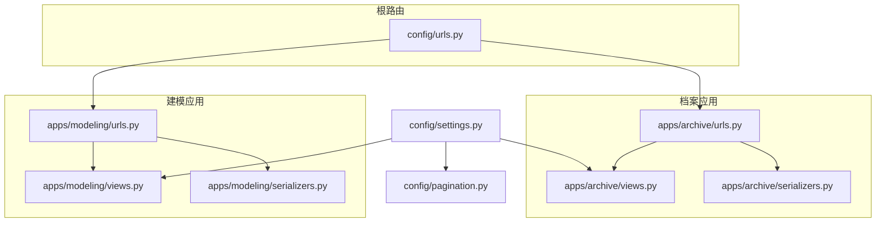
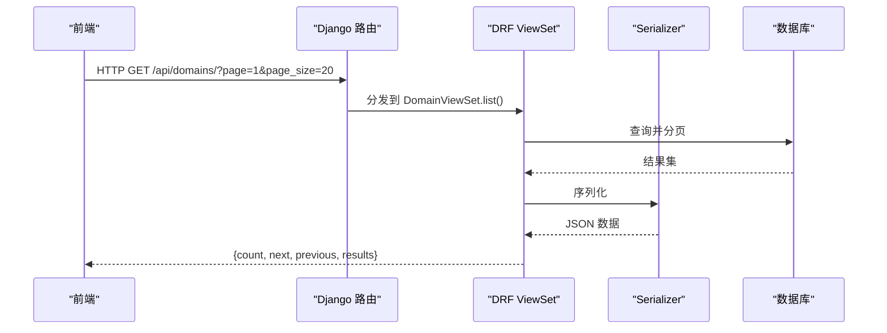
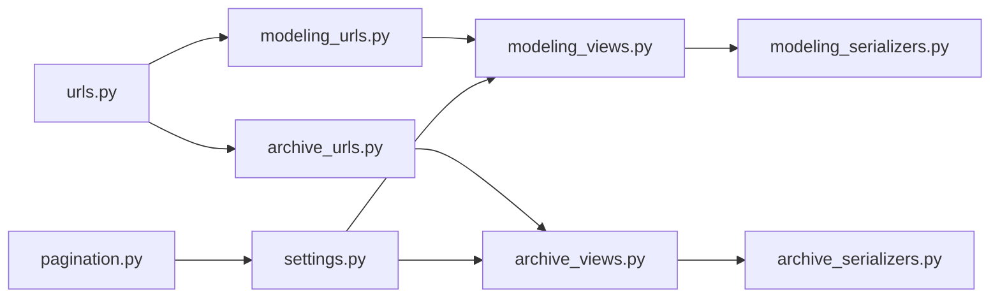

# 通用API规范

<cite>
**本文引用的文件**   
- [settings.py](file://backend/config/settings.py)
- [urls.py](file://backend/config/urls.py)
- [pagination.py](file://backend/config/pagination.py)
- [modeling_urls.py](file://backend/apps/modeling/urls.py)
- [archive_urls.py](file://backend/apps/archive/urls.py)
- [modeling_views.py](file://backend/apps/modeling/views.py)
- [archive_views.py](file://backend/apps/archive/views.py)
- [modeling_serializers.py](file://backend/apps/modeling/serializers.py)
- [archive_serializers.py](file://backend/apps/archive/serializers.py)
- [apiError.ts](file://frontend/src/utils/apiError.ts)
- [archive_api_ts](file://frontend/src/api/archive.ts)
</cite>

## 目录
1. [简介](#简介)
2. [项目结构](#项目结构)
3. [核心组件](#核心组件)
4. [架构总览](#架构总览)
5. [详细组件分析](#详细组件分析)
6. [依赖关系分析](#依赖关系分析)
7. [性能考虑](#性能考虑)
8. [故障排查指南](#故障排查指南)
9. [结论](#结论)
10. [附录](#附录)

## 简介
本规范面向 MetaData002 系统的后端 API，统一定义请求与响应格式、错误码与错误处理策略、分页/排序/过滤/搜索规范、认证授权机制（含 JWT 与权限控制）、文件上传下载、批量操作与异步任务处理方式，并提供客户端集成指南、版本管理与向后兼容性说明，以及 Swagger/OpenAPI 文档的访问与使用方法。

## 项目结构
系统采用 Django + DRF 构建，路由按应用拆分：
- 根路由聚合 modeling 与 archive 两个子应用
- modeling 应用提供数据源、域、表、字段、标准字段、计算字段等建模能力
- archive 应用提供档案配置、记录、同步日志、变更批次、一致性检查等能力
- 统一分页类 StandardPagination 在 DRF 中启用

**图示来源** 
- [urls.py:1-9](file://backend/config/urls.py#L1-L9)
- [modeling_urls.py:1-20](file://backend/apps/modeling/urls.py#L1-L20)
- [archive_urls.py:1-21](file://backend/apps/archive/urls.py#L1-L21)
- [settings.py:92-107](file://backend/config/settings.py#L92-L107)
- [pagination.py:1-14](file://backend/config/pagination.py#L1-L14)

**章节来源**
- [urls.py:1-9](file://backend/config/urls.py#L1-L9)
- [modeling_urls.py:1-20](file://backend/apps/modeling/urls.py#L1-L20)
- [archive_urls.py:1-21](file://backend/apps/archive/urls.py#L1-L21)
- [settings.py:92-107](file://backend/config/settings.py#L92-L107)
- [pagination.py:1-14](file://backend/config/pagination.py#L1-L14)

## 核心组件
- 统一分页：StandardPagination，默认每页 20，支持 ?page_size=N 覆盖，最大上限 100000
- 统一过滤/搜索/排序：DRF 内置 DjangoFilterBackend、SearchFilter、OrderingFilter
- 序列化器：各资源使用独立 Serializer，区分 List/Detail/Create/Update
- 视图集：ModelViewSet 提供标准 CRUD，配合 @action 扩展业务端点
- 路由：DefaultRouter 自动注册，路径前缀为 /api/<app>/<resource>/

关键要点
- 列表接口默认返回分页对象，包含 results、count、next、previous
- 过滤参数通过 filterset_fields 声明；搜索通过 search_fields；排序通过 ordering 参数
- 自定义动作通过 @action(detail=True/False, methods=[...], url_path=...) 暴露

**章节来源**
- [pagination.py:1-14](file://backend/config/pagination.py#L1-L14)
- [settings.py:92-101](file://backend/config/settings.py#L92-L101)
- [modeling_views.py:31-40](file://backend/apps/modeling/views.py#L31-L40)
- [archive_views.py:246-258](file://backend/apps/archive/views.py#L246-L258)

## 架构总览
后端基于 Django + DRF，OpenAPI 由 drf_spectacular 自动生成。前端通过 axios 调用 RESTful 接口，统一错误解析工具提取可读消息。

**图示来源** 
- [settings.py:92-107](file://backend/config/settings.py#L92-L107)
- [modeling_views.py:430-468](file://backend/apps/modeling/views.py#L430-L468)

## 详细组件分析

### 统一请求与响应规范
- 请求
  - Content-Type: application/json（除文件上传）
  - 分页：?page=整数 & ?page_size=整数（受 max_page_size 限制）
  - 过滤：filters 由 filterset_fields 决定
  - 搜索：?search=关键字（由 search_fields 决定）
  - 排序：?ordering=字段名 或 -字段名（降序）
- 响应
  - 成功：HTTP 2xx，JSON 体遵循分页或资源对象结构
  - 失败：HTTP 4xx/5xx，JSON 体包含 error/detail/message 或字段级错误数组

注意
- 列表接口返回分页对象；详情接口返回单条记录
- 非字段校验错误可能出现在 non_field_errors 数组中

**章节来源**
- [pagination.py:1-14](file://backend/config/pagination.py#L1-L14)
- [settings.py:92-101](file://backend/config/settings.py#L92-L101)

### 错误码与错误处理策略
- 状态码
  - 200/201/204：成功
  - 400：参数校验失败、业务规则不满足
  - 401：未认证
  - 403：无权限
  - 404：资源不存在
  - 500：服务端异常
- 错误体
  - 优先读取 data.error 或 data.detail 或 data.message
  - 其次读取 non_field_errors
  - 再次读取字段级错误对象（键为字段名，值为字符串数组）
- 前端解析
  - 使用 extractApiError 从 axios 错误中提取可读消息

最佳实践
- 后端统一抛出 ValidationError，DRF 会生成结构化错误体
- 前端对网络错误与业务错误分别处理，兜底显示中文提示

**章节来源**
- [apiError.ts:1-29](file://frontend/src/utils/apiError.ts#L1-L29)

### 分页、排序、过滤与搜索规范
- 分页
  - 默认 page_size=20，允许 ?page_size=N 覆盖，上限 100000
- 排序
  - 使用 Orderin gFilter，字段名前加 - 表示降序
- 过滤
  - 使用 DjangoFilterBackend，filterset_fields 声明可过滤字段
- 搜索
  - 使用 SearchFilter，search_fields 声明可搜索字段

示例（以 DomainViewSet 为例）
- 过滤：?status=active
- 搜索：?search=主数据
- 排序：?ordering=-created_at

**章节来源**
- [pagination.py:1-14](file://backend/config/pagination.py#L1-L14)
- [modeling_views.py:430-468](file://backend/apps/modeling/views.py#L430-L468)

### 认证授权机制（JWT 与权限控制）
- 当前中间件链包含 AuthenticationMiddleware，但未显式配置 JWT 认证类
- 建议方案
  - 引入 djangorestframework-simplejwt，设置 DEFAULT_AUTHENTICATION_CLASSES 为 JWTAuthentication
  - 设置 DEFAULT_PERMISSION_CLASSES 为 IsAuthenticated 或自定义权限
  - 登录接口返回 access_token 与 refresh_token，前端在后续请求头携带 Authorization: Bearer <token>
- 权限控制
  - 使用 DRF 的 Permission 类进行细粒度控制（如 IsAdminUser、IsOwner）
  - 针对敏感操作（如删除、同步）增加额外鉴权逻辑

注意
- 若需跨域，需在 settings 中配置 CORS（当前错误输出中出现 corsheaders.middleware.CorsMiddleware）

**章节来源**
- [settings.py:26-34](file://backend/config/settings.py#L26-L34)

### 文件上传与下载
- 上传
  - 使用 multipart/form-data，字段名通常为 file 或 files
  - 后端接收后校验类型、大小，落盘或转存至对象存储
- 下载
  - 返回 Blob，Content-Disposition 中包含文件名
  - 前端通过 downloadBlob 解析并触发浏览器下载

参考
- 前端已实现 downloadBlob，用于从响应头解析文件名并下载

**章节来源**
- [archive_api_ts:116-128](file://frontend/src/api/archive.ts#L116-L128)

### 批量操作与异步任务
- 批量操作
  - 变更批次：POST /change-batches/start-manual/ 开启批次，随后 PUT /records/{id}/ 带 change_batch_id 攒批保存
  - 整批撤销：POST /change-batches/{id}/rollback/ 回滚批次影响记录
- 异步任务
  - 长耗时操作（如数据同步、重算）建议放入 Celery 队列，返回任务 ID，前端轮询或 WebSocket 通知

最佳实践
- 明确批次边界，确保原子性与可追溯性
- 异步任务需幂等设计，支持重试与失败告警

**章节来源**
- [archive_views.py:1863-1886](file://backend/apps/archive/views.py#L1863-L1886)

### OpenAPI/Swagger 文档
- 启用 drf_spectacular，SPECTACULAR_SETTINGS 定义标题、描述、版本
- 访问地址通常为 /api/schema/ 或 /swagger/（取决于路由配置）
- 建议使用 Spectacular UI 或 Redoc 展示

**章节来源**
- [settings.py:103-107](file://backend/config/settings.py#L103-L107)

## 依赖关系分析
- 路由层：根 urls 聚合 modeling 与 archive 子路由
- 视图层：ModelViewSet 提供 CRUD，@action 扩展业务
- 序列化层：按资源定义 List/Detail/Create/Update 序列化器
- 配置层：DRF 全局配置（分页、过滤、搜索、排序、Schema）

**图示来源** 
- [urls.py:1-9](file://backend/config/urls.py#L1-L9)
- [modeling_urls.py:1-20](file://backend/apps/modeling/urls.py#L1-L20)
- [archive_urls.py:1-21](file://backend/apps/archive/urls.py#L1-L21)
- [settings.py:92-107](file://backend/config/settings.py#L92-L107)
- [pagination.py:1-14](file://backend/config/pagination.py#L1-L14)

**章节来源**
- [urls.py:1-9](file://backend/config/urls.py#L1-L9)
- [modeling_urls.py:1-20](file://backend/apps/modeling/urls.py#L1-L20)
- [archive_urls.py:1-21](file://backend/apps/archive/urls.py#L1-L21)
- [settings.py:92-107](file://backend/config/settings.py#L92-L107)

## 性能考虑
- 分页上限保护：max_page_size=100000，防止极端值拖垮服务
- 查询优化：select_related/prefetch_related 减少 N+1
- 缓存：Redis 作为默认缓存后端，适合热点数据与去重缓存
- 外部数据源连接：动态创建临时 alias，避免连接泄漏

建议
- 对高频读接口增加 Redis 缓存
- 对大数据量导出使用流式响应或异步任务

**章节来源**
- [pagination.py:1-14](file://backend/config/pagination.py#L1-L14)
- [settings.py:68-74](file://backend/config/settings.py#L68-L74)

## 故障排查指南
- 常见错误
  - 400：参数缺失或校验失败，查看 non_field_errors 与字段级错误
  - 401/403：认证或权限问题，检查 Token 与权限类
  - 500：服务端异常，查看日志与堆栈
- 前端错误解析
  - 使用 extractApiError 提取可读消息，兜底显示中文提示
- 调试技巧
  - 打开 DEBUG 模式，查看 DRF 错误详情
  - 使用 Swagger UI 验证接口参数与响应结构

**章节来源**
- [apiError.ts:1-29](file://frontend/src/utils/apiError.ts#L1-L29)

## 结论
本规范统一了 MetaData002 的 API 风格与交互约定，涵盖分页、过滤、搜索、排序、错误处理、认证授权、文件传输、批量与异步等关键方面。通过标准化与最佳实践，提升前后端协作效率与系统可维护性。

## 附录

### API 版本管理与向后兼容
- 版本策略
  - URL 前缀版本化：/api/v1/...
  - 头部版本协商：Accept: application/vnd.metadata.v1+json
- 向后兼容
  - 新增字段只增不改，废弃字段标记 deprecated
  - 删除字段需经过弃用期，提供迁移脚本
  - 错误码与响应结构保持稳定，新增错误码不破坏现有解析

### 客户端集成指南
- 基础配置
  - BaseURL: http(s)://host/api
  - Headers: Authorization: Bearer <token>, Content-Type: application/json
- 分页与筛选
  - 列表接口统一使用 ?page=&page_size=
  - 过滤/搜索/排序参数见各资源 filterset_fields/search_fields/ordering
- 错误处理
  - 捕获网络错误与业务错误，使用 extractApiError 提取消息
  - 对 401 刷新 Token，对 403 提示无权限

### 常用端点速查
- 建模
  - /api/data-sources/
  - /api/domains/
  - /api/tables/
  - /api/fields/
  - /api/standard-fields/
  - /api/computed-fields/
- 档案
  - /api/archives/
  - /api/records/
  - /api/sync-logs/
  - /api/operation-logs/
  - /api/record-versions/
  - /api/archive-apis/
  - /api/change-batches/
  - /api/change-details/
  - /api/consistency-issues/
  - /api/consistency-rules/

**章节来源**
- [modeling_urls.py:1-20](file://backend/apps/modeling/urls.py#L1-L20)
- [archive_urls.py:1-21](file://backend/apps/archive/urls.py#L1-L21)