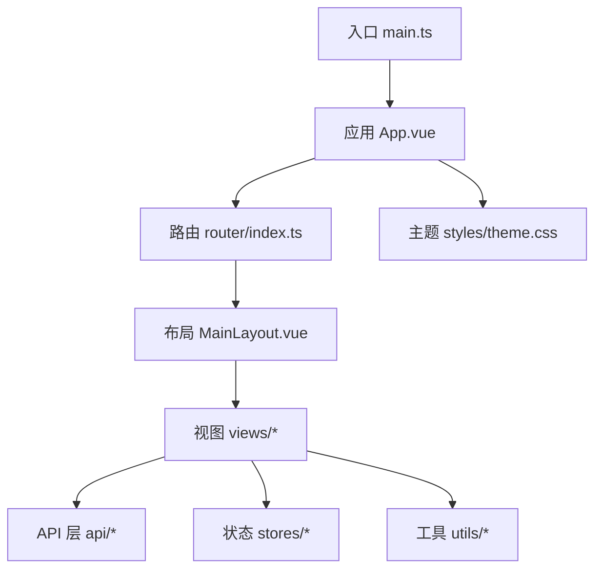
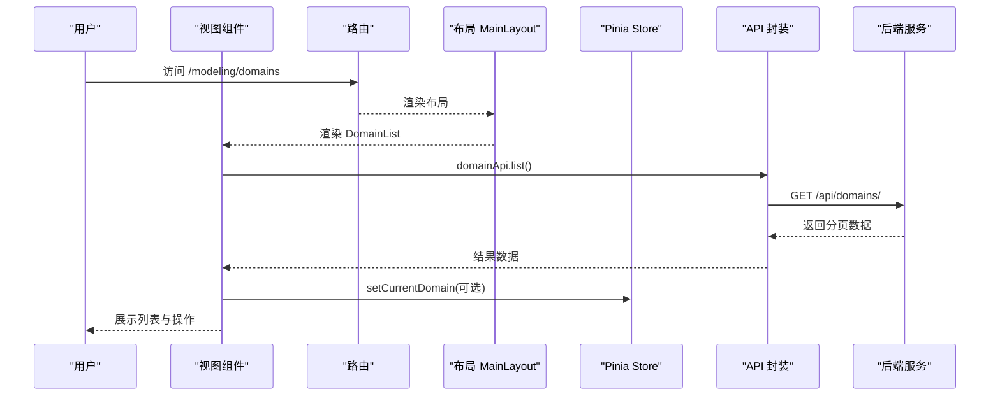
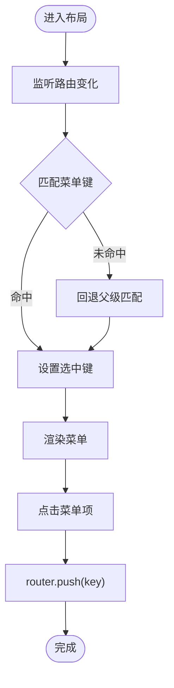
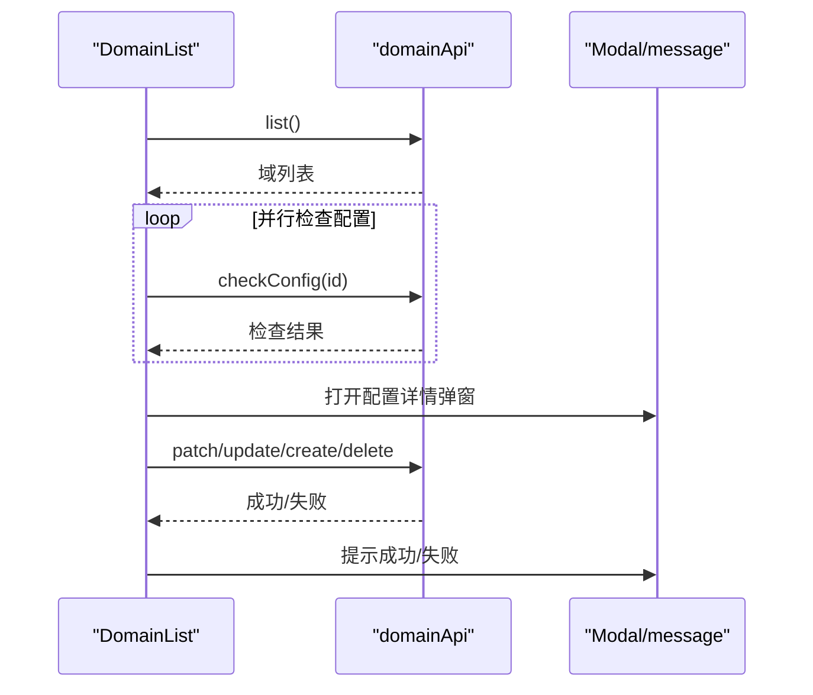
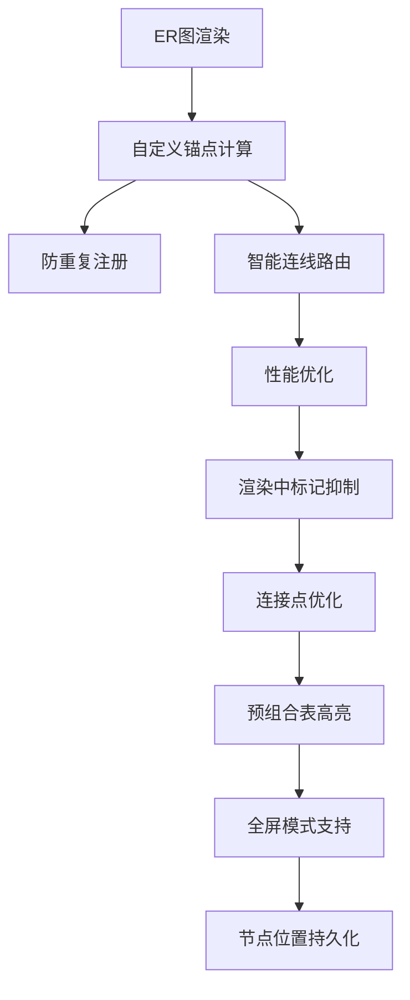
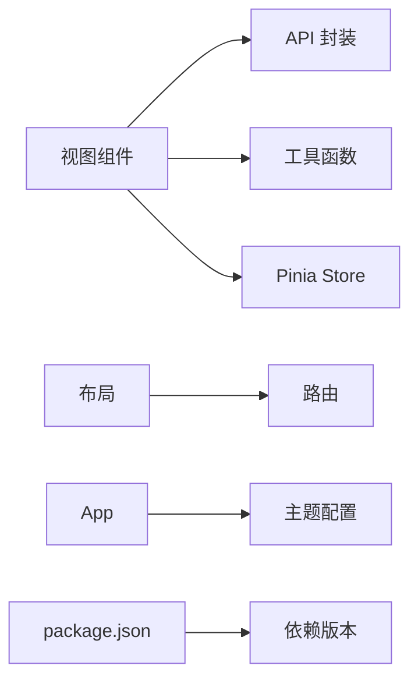

# 前端组件

<cite>
**本文引用的文件**   
- [main.ts](file://frontend/src/main.ts)
- [App.vue](file://frontend/src/App.vue)
- [index.ts](file://frontend/src/router/index.ts)
- [MainLayout.vue](file://frontend/src/layouts/MainLayout.vue)
- [modeling.ts](file://frontend/src/stores/modeling.ts)
- [theme.css](file://frontend/src/styles/theme.css)
- [index.ts](file://frontend/src/api/index.ts)
- [modeling.ts](file://frontend/src/api/modeling.ts)
- [DomainList.vue](file://frontend/src/views/modeling/DomainList.vue)
- [ArchiveList.vue](file://frontend/src/views/archive/ArchiveList.vue)
- [FormulaEditor.vue](file://frontend/src/views/modeling/components/FormulasEditor.vue)
- [DomainFieldMapping.vue](file://frontend/src/views/modeling/DomainFieldMapping.vue)
- [formula.ts](file://frontend/src/utils/formula.ts)
- [date.ts](file://frontend/src/utils/date.ts)
- [package.json](file://frontend/package.json)
</cite>

## 更新摘要
**变更内容**   
- DomainFieldMapping.vue组件进行了重大ER图功能增强，包括连接点修复、智能路由、节点定位改进、性能优化和UI完善
- 实现了自定义锚点计算函数erFieldRowAnchor，解决x6内置bbox anchor的dy语义问题
- 添加了防重复注册机制，防止SPA路由切换和HMR导致的重复注册问题
- 优化了ER图渲染性能，通过erRenderInProgress标记抑制初始渲染触发的位置保存请求
- 改进了连线连接点处理，使用connectionPoint: 'anchor'避免boundary二次求交导致的连线偏移
- 实现了智能左右出线逻辑，根据节点相对位置自动选择最佳连线方向
- 增强了预组合表高亮功能和全屏模式支持

## 目录
1. [简介](#简介)
2. [项目结构](#项目结构)
3. [核心组件](#核心组件)
4. [架构总览](#架构总览)
5. [详细组件分析](#详细组件分析)
6. [依赖关系分析](#依赖关系分析)
7. [性能考虑](#性能考虑)
8. [故障排查指南](#故障排查指南)
9. [结论](#结论)
10. [附录](#附录)

## 简介
本文件为 MetaData002 前端应用的组件文档，聚焦 Vue 3 + Ant Design Vue + Pinia + Vue Router 的组件架构与使用方式。内容涵盖：
- 组件层次结构与路由配置
- 状态管理模式（Pinia）与数据流
- 核心 UI 组件（表格、表单、编辑器等）的功能、属性与事件
- 主题系统与样式定制（CSS 变量与响应式）
- 组件通信机制（props、事件、全局状态）
- 使用示例与扩展指南
- 性能优化技巧与调试方法

## 项目结构
前端采用按功能域划分的目录组织：
- src/api：HTTP 客户端封装与各模块 API 定义
- src/components：通用组件（当前为空，后续可扩展）
- src/layouts：页面布局（侧边栏、面包屑、用户信息）
- src/router：路由表与懒加载配置
- src/stores：Pinia Store（领域建模相关）
- src/styles：全局样式与主题变量
- src/types：TypeScript 类型定义
- src/utils：工具函数（日期、公式格式化、错误提取）
- src/views：业务视图（建模、档案、设置）
- index.html、vite.config.ts、package.json：构建与依赖



**图表来源**
- [main.ts:1-14](file://frontend/src/main.ts#L1-L14)
- [App.vue:1-15](file://frontend/src/App.vue#L1-L15)
- [index.ts:1-45](file://frontend/src/router/index.ts#L1-L45)
- [MainLayout.vue:1-162](file://frontend/src/layouts/MainLayout.vue#L1-L162)
- [theme.css:1-13](file://frontend/src/styles/theme.css#L1-L13)

**章节来源**
- [main.ts:1-14](file://frontend/src/main.ts#L1-L14)
- [App.vue:1-15](file://frontend/src/App.vue#L1-L15)
- [index.ts:1-45](file://frontend/src/router/index.ts#L1-L45)
- [MainLayout.vue:1-162](file://frontend/src/layouts/MainLayout.vue#L1-L162)
- [theme.css:1-13](file://frontend/src/styles/theme.css#L1-L13)

## 核心组件
- 根应用与主题注入
  - App.vue 通过 a-config-provider 注入 Ant Design Vue 主题 token，统一主色与圆角等。
- 全局初始化
  - main.ts 创建 Vue 应用，注册 Pinia、Router、Antd，并挂载到 #app。
- 布局组件
  - MainLayout.vue 提供侧边菜单、面包屑、用户信息与内容区，菜单高亮与路由同步。
- 路由
  - router/index.ts 定义模块化路由（建模、档案、设置），子路由懒加载，meta.title 驱动面包屑。
- 状态管理
  - stores/modeling.ts 暴露 useModelingStore，维护 currentDomain 及 setter。
- 样式与主题
  - styles/theme.css 定义 CSS 变量（侧边栏宽度、头部高度、背景与边框色）。
- API 客户端
  - api/index.ts 基于 axios 封装 baseURL、超时、响应拦截器（统一错误处理）。
  - api/modeling.ts 各模块 API 方法与类型定义（域、表、字段、计算字段、插件等）。

**章节来源**
- [App.vue:1-15](file://frontend/src/App.vue#L1-L15)
- [main.ts:1-14](file://frontend/src/main.ts#L1-L14)
- [MainLayout.vue:1-162](file://frontend/src/layouts/MainLayout.vue#L1-L162)
- [index.ts:1-45](file://frontend/src/router/index.ts#L1-L45)
- [modeling.ts:1-14](file://frontend/src/stores/modeling.ts#L1-L14)
- [theme.css:1-13](file://frontend/src/styles/theme.css#L1-L13)
- [index.ts:1-22](file://frontend/src/api/index.ts#L1-L22)
- [modeling.ts:1-481](file://frontend/src/api/modeling.ts#L1-L481)

## 架构总览
整体采用"视图 → API → 后端"的数据流，配合 Pinia 进行跨组件状态共享；路由驱动页面切换与布局渲染；主题通过 a-config-provider 与 CSS 变量共同生效。



**图表来源**
- [index.ts:1-45](file://frontend/src/router/index.ts#L1-L45)
- [MainLayout.vue:1-162](file://frontend/src/layouts/MainLayout.vue#L1-L162)
- [DomainList.vue:1-338](file://frontend/src/views/modeling/DomainList.vue#L1-L338)
- [modeling.ts:1-481](file://frontend/src/api/modeling.ts#L1-L481)
- [index.ts:1-22](file://frontend/src/api/index.ts#L1-L22)
- [modeling.ts:1-14](file://frontend/src/stores/modeling.ts#L1-L14)

## 详细组件分析

### 布局组件 MainLayout
- 职责
  - 侧边菜单与折叠状态
  - 面包屑根据 route.meta.title 动态生成
  - 用户头像与名称展示
  - 路由点击跳转与菜单高亮同步
- 关键实现要点
  - 使用 watchEffect 监听路由变化，匹配最长前缀作为选中菜单项
  - 菜单项通过 computed 生成，支持分组与禁用
  - 面包屑由首页标题与当前页 meta.title 组合
- 交互流程
  - 点击菜单 → onMenuClick → router.push(key)



**图表来源**
- [MainLayout.vue:1-162](file://frontend/src/layouts/MainLayout.vue#L1-L162)

**章节来源**
- [MainLayout.vue:1-162](file://frontend/src/layouts/MainLayout.vue#L1-L162)

### 路由配置 router/index.ts
- 特点
  - 使用 createWebHistory('/'), 根路径重定向至 /modeling/domains
  - 三大模块：/modeling、/archive、/settings，均复用 MainLayout
  - 子路由懒加载，meta.title 用于面包屑
- 建议
  - 新增页面时补充 meta.title，确保面包屑一致
  - 保持路由层级清晰，避免过深嵌套

**章节来源**
- [index.ts:1-45](file://frontend/src/router/index.ts#L1-L45)

### 状态管理 modeling.ts（Pinia）
- 设计
  - 单一 store：useModelingStore，维护 currentDomain（当前域）
  - 提供 setCurrentDomain(domain | null) 更新状态
- 使用场景
  - 在需要跨页面共享域上下文的组件中调用
- 扩展建议
  - 可按模块拆分多个 store（如 archive、settings）
  - 对复杂对象可引入持久化或缓存策略

**章节来源**
- [modeling.ts:1-14](file://frontend/src/stores/modeling.ts#L1-L14)

### 主题与样式 theme.css
- 变量
  - --sidebar-width、--header-height、--color-bg-subtle、--color-border-light
- 使用建议
  - 通过 CSS 变量统一控制布局尺寸与颜色
  - 结合 Ant Design 主题 token（App.vue）形成双轨主题体系

**章节来源**
- [theme.css:1-13](file://frontend/src/styles/theme.css#L1-L13)
- [App.vue:1-15](file://frontend/src/App.vue#L1-L15)

### API 封装与建模模块接口
- 基础封装
  - baseURL=/api，超时 30s，统一响应拦截器抛出结构化错误（保留 response）
- 建模模块
  - domainApi：域 CRUD、checkConfig、pkStatus
  - tableApi：表 CRUD、预览 Excel/数据、ER 位置保存、批量重置
  - fieldApi：字段 CRUD、批量更新、AI 分组/语义/去重、标准字段、归档预览
  - standardFieldApi：标准字段聚合视图与成员管理
  - computedFieldApi：计算字段 CRUD、验证、预览、AI 生成、依赖图、批处理、函数库与引用、技术函数插件管理
  - aiConfigApi：AI 配置获取、更新、连接测试
  - fieldGroupApi、fieldOptionApi、fieldMappingApi：分组、选项、映射管理
  - detailConfigApi：明细子表注册管理，支持预组合配置、头表关联检测、行键检测
  - configTableApi：配置表 CRUD、数据同步
- 类型
  - types/index.ts 定义 Domain、Table、Field、Archive、Version、Diff、Consistency 等完整类型

**章节来源**
- [index.ts:1-22](file://frontend/src/api/index.ts#L1-L22)
- [modeling.ts:1-481](file://frontend/src/api/modeling.ts#L1-L481)
- [types/index.ts:1-388](file://frontend/src/types/index.ts#L1-L388)

### 视图组件：域管理 DomainList.vue
- 功能
  - 域列表展示、启用/停用开关、删除确认
  - 新建/编辑弹窗（表单校验与提交）
  - 配置检查详情弹窗（P0/P1/P2 级别与消息）
  - 异步加载每个域的配置状态（不阻塞主列表）
- 数据流
  - loadData → domainApi.list → 逐条 domainApi.checkConfig
  - 提交/停用/删除 → 对应 API → message 提示 → 刷新列表
- 交互
  - 启用需前置检查，失败时给出明确错误提示
  - 停用需二次确认



**图表来源**
- [DomainList.vue:1-338](file://frontend/src/views/modeling/DomainList.vue#L1-L338)
- [modeling.ts:1-481](file://frontend/src/api/modeling.ts#L1-L481)

**章节来源**
- [DomainList.vue:1-338](file://frontend/src/views/modeling/DomainList.vue#L1-L338)

### 视图组件：档案管理 ArchiveList.vue
- 功能
  - 档案列表分页展示、状态标签、操作（编辑、一致性检查、刷新预检、删除）
  - 刷新预检弹窗：显示 schema 变更、数据变化样本、告警与错误
  - 新建档案弹窗：选择域、填写基本信息
- 数据流
  - loadData → archiveApi.list
  - doRefreshPreview → archiveApi.refreshPreview（或类似接口）→ 展示差异
  - handleCreate → archiveApi.create

**章节来源**
- [ArchiveList.vue:1-200](file://frontend/src/views/archive/ArchiveList.vue#L1-L200)

### 视图组件：字段映射 DomainFieldMapping.vue（重大更新）

**更新** 该组件进行了重大ER图功能增强，包含以下新功能：

#### ER图连接点修复与智能路由
- **自定义锚点计算**：实现了erFieldRowAnchor函数，解决x6内置bbox anchor的dy语义问题
  - 使用cell模型bbox直接计算锚点位置，不依赖HTML渲染完成
  - 支持左右两侧字段行的精确锚点定位
  - 解决了锚点偏下h/2或落在节点上缘的问题
- **防重复注册机制**：Graph.registerAnchor使用force参数(true)，防止SPA路由切换和HMR导致的重复注册异常
- **智能连线路由**：根据节点相对位置自动选择最佳连线方向
  - 源节点在左 → 源从右缘出、目标从左缘入
  - 源节点在右 → 反向处理
  - 避免了连线穿越节点的视觉问题

#### 性能优化改进
- **渲染性能优化**：通过erRenderInProgress标记抑制初始渲染触发的位置保存请求
  - 解决了每次进入页面触发150+次PUT请求的性能问题
  - 仅在用户手动拖拽节点时保存位置信息
- **连接点优化**：使用connectionPoint: 'anchor'跳过默认boundary二次求交
  - 避免了线段从节点另一侧穿入时的连线偏移问题
  - 确保了字段行锚点计算的准确性

#### 增强的ER图功能
- **预组合表高亮**：可视化展示头表与明细表的预组合关系
  - 绿色虚线连接表示预组合关联
  - 高亮按钮可切换预组合表的边框高亮效果
  - 预组合表节点显示绿色边框和阴影效果
- **全屏模式支持**：通过浏览器全屏API实现沉浸式查看体验
  - 全屏状态下隐藏映射列表，专注于ER图展示
  - 支持退出全屏后自动恢复原有布局
  - 全屏容器自适应高度，充分利用屏幕空间
- **节点位置持久化**：节点位置保存到数据库，刷新后保持布局
  - 支持批量重置布局功能
  - 智能网格布局算法，自动排列节点位置

#### 三面板布局设计
- **左侧面板（12列）**：预组合列表和关联字段
  - 预组合表选择：显示已注册的预组合配置（头表+明细表）
  - 关联字段选择：支持主键标记（⚿符号）、推荐标签和禁用状态
  - 新增selectDetailSourceField函数处理字段选择逻辑，防止自动推荐覆盖用户选择
- **中间面板（1列）**：箭头指示器
  - 显示 → 符号，直观表示数据流向
  - 增强视觉引导，提升用户体验
- **右侧面板（11列）**：主表选择和关联字段列表
  - 主表选择：排除源表后的目标表列表
  - 主表字段选择：仅主键可选，非主键字段禁用显示
  - 新增selectDetailTargetField函数处理主表字段选择，确保只允许主键字段

#### 增强的字段选择功能
- **主键标记**：所有主键字段显示 ⚿ 符号和黄色高亮
- **推荐标签**：系统自动推荐的字段显示绿色"推荐"标签
- **禁用状态**：非主键字段和已注册表显示禁用状态，不可选择
- **智能推荐**：基于字段名匹配算法，自动推荐最佳关联字段



**图表来源**
- [DomainFieldMapping.vue:1016-1026](file://frontend/src/views/modeling/DomainFieldMapping.vue#L1016-L1026)
- [DomainFieldMapping.vue:1309-1363](file://frontend/src/views/modeling/DomainFieldMapping.vue#L1309-L1363)
- [DomainFieldMapping.vue:1001-1002](file://frontend/src/views/modeling/DomainFieldMapping.vue#L1001-L1002)
- [DomainFieldMapping.vue:1401-1415](file://frontend/src/views/modeling/DomainFieldMapping.vue#L1401-L1415)
- [DomainFieldMapping.vue:2249-2264](file://frontend/src/views/modeling/DomainFieldMapping.vue#L2249-L2264)

**章节来源**
- [DomainFieldMapping.vue:1-2510](file://frontend/src/views/modeling/DomainFieldMapping.vue#L1-L2510)

### 编辑器组件：FormulaEditor.vue（计算字段公式编辑器）
- 功能概览
  - AI 自然语言生成表达式（附带说明、风险、推理过程）
  - 基础信息：编码、名称、输出类型
  - 解析依赖字段与未使用引用（蓝/橙标签，可删除）
  - 公式编辑区：语法验证、格式化、实时预览
  - 侧边栏：函数库（分类搜索）、字段引用（两级级联）、技术函数插件（上传/重载/卸载/模板下载）
  - 数据预览面板：输入参数与输出结果的中国式两行表头，支持全部/前 50 条切换
- 关键交互
  - 表达式变更 → 防抖验证与预览
  - 验证成功后自动合并引用字段，供 AI 生成参考
  - 插件上传后自动 AST 安全校验并刷新函数库
- 数据结构
  - ComputedFieldModel、FormulaValidationResult、PreviewDataResult、AvailableFunction、AvailableReference、PluginInfo 等

```mermaid
classDiagram
class FormulaEditor {
+open : boolean
+domainId : number
+field : ComputedFieldModel|null
+form : {code,name,expression,output_type}
+validationResult : FormulaValidationResult|null
+previewResult : PreviewDataResult|null
+aiDescription : string
+plugins : PluginInfo[]
+functions : AvailableFunction[]
+references : AvailableReference[]
+computedReferences : AvailableReference[]
+handleValidate()
+handlePreviewData(silent)
+handleAiGenerate()
+handleFormatExpression()
+loadSidebarData()
+loadPlugins()
+handlePluginUpload(file)
+handlePluginReload(filename)
+handlePluginUnload(filename)
}
class ApiComputedField {
+validateFormula(id, expression?)
+validateExpression(expression, domainId)
+previewData(expression, domainId, maxCombinations?)
+generateFormula(description, domainId, selectedRefs?, currentExpression?)
+availableFunctions()
+availableReferences(domainId)
+pluginList()
+pluginUpload(file)
+pluginReload(filename)
+pluginUnload(filename)
+pluginTemplate()
}
FormulaEditor --> ApiComputedField : "调用"
```

**图表来源**
- [FormulaEditor.vue:1-800](file://frontend/src/views/modeling/components/FormulasEditor.vue#L1-L800)
- [modeling.ts:1-481](file://frontend/src/api/modeling.ts#L1-L481)

**章节来源**
- [FormulaEditor.vue:1-800](file://frontend/src/views/modeling/components/FormulasEditor.vue#L1-L800)
- [modeling.ts:1-481](file://frontend/src/api/modeling.ts#L1-L481)

### 工具函数
- 公式格式化 formula.ts
  - 保护字段引用与字符串字面量，函数名大写化，补全右括号，长表达式换行缩进
- 日期格式化 date.ts
  - formatDateTime、formatDate 统一时间格式

**章节来源**
- [formula.ts:1-95](file://frontend/src/utils/formula.ts#L1-L95)
- [date.ts:1-27](file://frontend/src/utils/date.ts#L1-L27)

## 依赖关系分析
- 运行时依赖
  - vue、vue-router、pinia、ant-design-vue、axios、dayjs
- 开发依赖
  - vite、typescript、@vitejs/plugin-vue、vue-tsc
- 组件间依赖
  - 视图依赖 API 层与工具函数
  - 布局依赖路由与图标
  - 编辑器依赖公式工具与 API



**图表来源**
- [package.json:1-29](file://frontend/package.json#L1-L29)
- [main.ts:1-14](file://frontend/src/main.ts#L1-L14)

**章节来源**
- [package.json:1-29](file://frontend/package.json#L1-L29)

## 性能考虑
- 列表与大数据
  - 使用分页与滚动加载，避免一次性渲染大量 DOM
  - 表格列宽与固定列合理配置，减少横向滚动开销
- 请求与缓存
  - 合理使用防抖（如公式验证 800ms）降低频繁请求
  - 并行请求（Promise.all）加速侧边栏数据加载
- 组件渲染
  - 使用 computed 缓存派生数据，避免重复计算
  - 条件渲染与 v-if/v-show 按需使用，减少不必要更新
- 网络与错误
  - 统一错误拦截，快速失败与友好提示
  - 大文件上传（Excel/插件）使用 FormData，避免内存峰值过高
- ER图性能优化
  - **渲染性能优化**：通过erRenderInProgress标记抑制初始渲染触发的位置保存请求，避免150+次不必要的PUT请求
  - **连接点优化**：使用connectionPoint: 'anchor'跳过boundary二次求交，提升连线计算性能
  - **节点位置持久化**：避免重复计算布局，支持用户自定义布局保存
  - **字段级高亮**：仅影响相关节点，减少DOM操作范围
  - **全屏模式优化**：隐藏不必要的UI元素，专注ER图展示
  - **预组合表高亮**：高效的边框和阴影效果，不影响整体性能
- 三面板布局优化
  - 预组合列表虚拟滚动，支持大量配置项
  - 字段选择区域独立滚动，提升交互流畅度
  - 响应式设计适配不同屏幕尺寸

## 故障排查指南
- 常见问题
  - 路由高亮异常：检查 watchEffect 中的路径匹配逻辑与 allMenuKeys 是否覆盖所有路由
  - 表单提交失败：查看 API 响应拦截器抛出的错误对象，定位后端 detail/message/error
  - 公式验证失败：检查表达式语法、引用字段是否存在、函数库是否加载成功
  - 插件加载失败：确认 .py 文件命名与函数签名，查看 AST 校验错误详情
  - **ER图全屏问题**：检查浏览器全屏API支持情况，使用降级方案
  - **ER图连线异常**：检查自定义锚点计算是否正确，connectionPoint配置是否为'anchor'
  - **ER图性能问题**：确认erRenderInProgress标记是否正常工作，避免过多位置保存请求
  - **字段映射冲突**：检查联合主键映射的唯一性约束
  - **预组合表配置错误**：确认头表和明细表的关联字段正确配置
  - **字段选择失效**：检查 selectDetailSourceField 和 selectDetailTargetField 函数的调用逻辑
  - **三面板布局错位**：检查栅格系统的响应式断点和样式冲突
  - **重复注册问题**：确认Graph.registerAnchor的force参数设置为true
- 调试建议
  - 使用浏览器开发者工具 Network 面板观察请求与响应
  - 在关键函数前后添加 console.log 或断点
  - 利用 message.error 的错误提示快速定位问题范围
  - 使用浏览器全屏API兼容性检测工具
  - 检查左右面板布局的响应式设计在不同屏幕尺寸下的表现
  - 验证字段选择逻辑的主键验证规则
  - 测试预组合配置的自动检测功能
  - **监控ER图性能**：使用Performance面板分析渲染性能，检查是否有过多的位置保存请求
  - **验证连线质量**：检查连线是否正确连接到字段行，避免穿越节点的情况

**章节来源**
- [index.ts:1-22](file://frontend/src/api/index.ts#L1-L22)
- [DomainList.vue:1-338](file://frontend/src/views/modeling/DomainList.vue#L1-L338)
- [FormulaEditor.vue:1-800](file://frontend/src/views/modeling/components/FormulasEditor.vue#L1-L800)
- [DomainFieldMapping.vue:1001-1026](file://frontend/src/views/modeling/DomainFieldMapping.vue#L1001-L1026)
- [DomainFieldMapping.vue:1309-1363](file://frontend/src/views/modeling/DomainFieldMapping.vue#L1309-L1363)

## 结论
MetaData002 前端以清晰的模块划分与统一的 API/状态管理为基础，结合 Ant Design Vue 的主题与组件生态，提供了高效的建模与档案管理体验。通过公式编辑器与 AI 能力，显著提升了计算字段配置效率。**最新的字段映射组件经过重大ER图功能增强，实现了自定义锚点计算、智能连线路由、性能优化和UI完善，大幅改善了用户体验和操作效率。**特别是连接点修复解决了x6内置anchor的dy语义问题，性能优化避免了大量的不必要请求，智能路由确保了连线的视觉效果。建议在后续迭代中继续完善通用组件库、增强错误边界与性能监控，提升可维护性与用户体验。

## 附录
- 组件使用示例
  - 表格组件：a-table 的 dataSource、columns、rowKey、pagination、scroll 与 bodyCell 插槽
  - 表单组件：a-form 的 model、layout、form-item 与 v-model:value 双向绑定
  - 编辑器组件：FormulaEditor 的 open、domainId、field 与 update:open/saved/save-and-trial 事件
  - 字段映射组件：DomainFieldMapping 的三面板布局、智能字段选择、JOIN类型选择、全屏模式控制
- 自定义扩展指南
  - 新增视图：在 router/index.ts 添加路由与 meta.title，并在 views 下创建组件
  - 新增 API：在 api/modeling.ts 中添加方法与类型，遵循 withFullPage 约定
  - 新增 Store：在 stores 下创建新 store，导出 useXxxStore，在组件中调用
  - 主题定制：在 App.vue 调整 token，或在 theme.css 扩展 CSS 变量
  - **ER图扩展**：基于 @antv/x6 图形库扩展节点类型和连线样式，使用自定义锚点函数
  - 字段映射扩展：基于新的三面板布局模式扩展更多映射类型
  - 预组合配置：基于 detailConfigApi 扩展预组合表的关联检测和行键识别功能
  - **性能优化扩展**：在新增功能时考虑erRenderInProgress标记的使用，避免不必要的性能开销