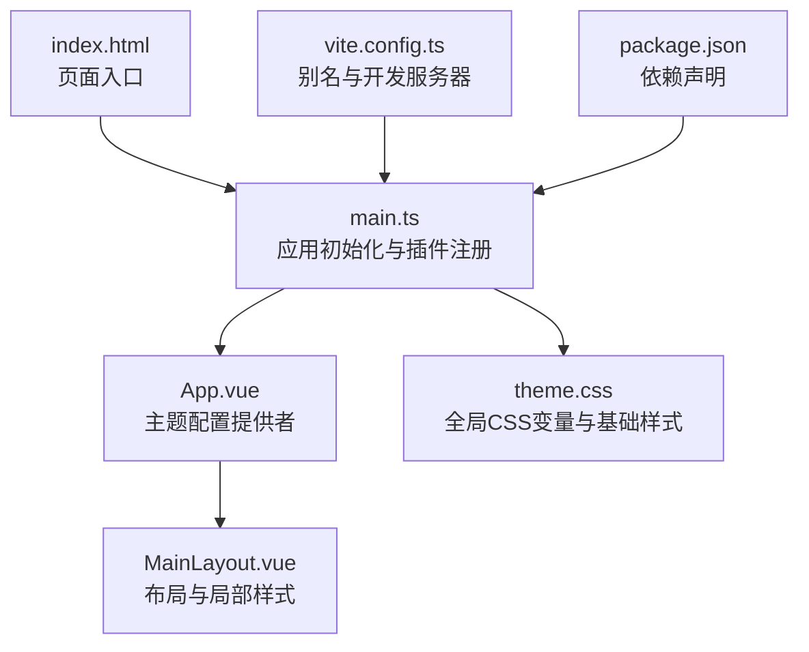
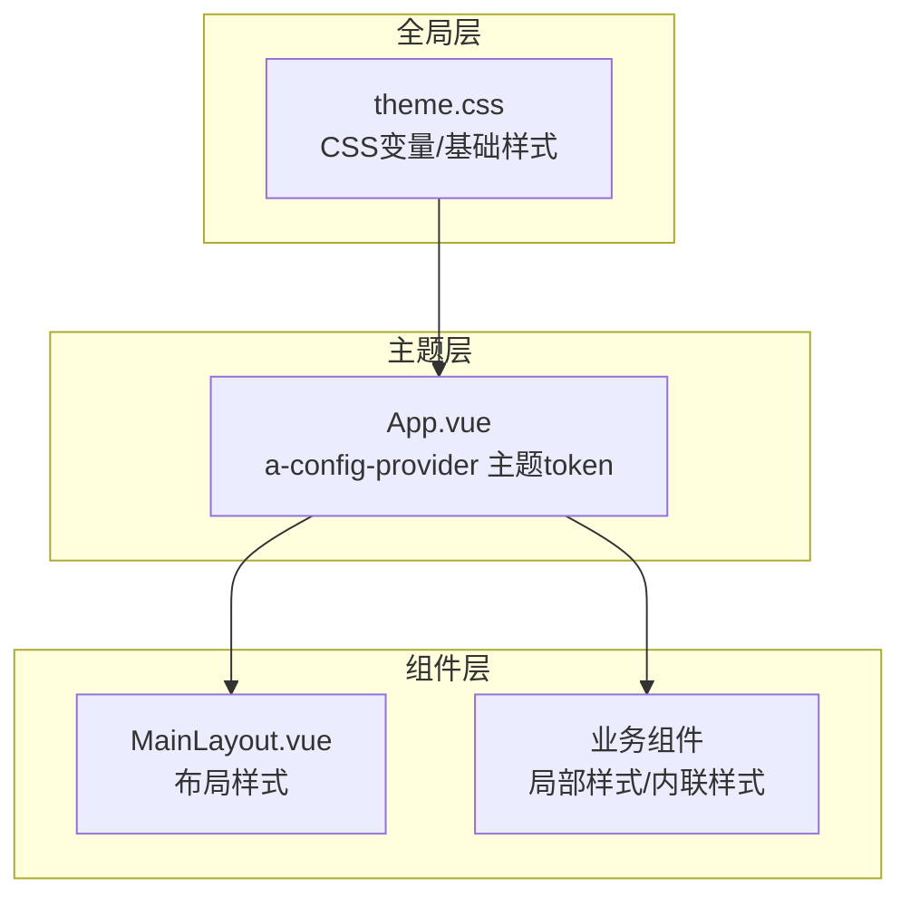
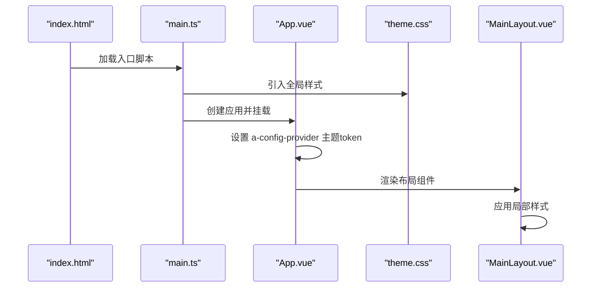

# 样式与主题

<cite>
**本文引用的文件**   
- [frontend/src/styles/theme.css](file://frontend/src/styles/theme.css)
- [frontend/src/App.vue](file://frontend/src/App.vue)
- [frontend/src/main.ts](file://frontend/src/main.ts)
- [frontend/index.html](file://frontend/index.html)
- [frontend/vite.config.ts](file://frontend/vite.config.ts)
- [frontend/package.json](file://frontend/package.json)
- [frontend/src/layouts/MainLayout.vue](file://frontend/src/layouts/MainLayout.vue)
</cite>

## 目录
1. [简介](#简介)
2. [项目结构](#项目结构)
3. [核心组件](#核心组件)
4. [架构总览](#架构总览)
5. [详细组件分析](#详细组件分析)
6. [依赖分析](#依赖加载关系)
7. [性能考虑](#性能考虑)
8. [故障排查指南](#故障排查指南)
9. [结论](#结论)
10. [附录](#附录)

## 简介
本文件为 MetaData002 前端应用的样式系统与主题配置提供系统化文档。内容涵盖：
- CSS 变量与全局主题设计（颜色、字体、间距）
- Ant Design Vue 主题定制方法（token 覆盖与组件样式修改）
- 响应式设计与移动端适配策略
- 组件样式的组织方式与命名规范
- 样式调试工具与性能优化技巧
- 暗色主题支持与多语言样式适配建议

## 项目结构
前端采用 Vite + Vue 3 + Ant Design Vue 的技术栈，样式入口集中在应用根组件与全局样式文件中，并通过构建配置进行资源解析与开发服务器代理。

图表来源
- [frontend/index.html:1-14](file://frontend/index.html#L1-L14)
- [frontend/src/main.ts:1-14](file://frontend/src/main.ts#L1-L14)
- [frontend/src/App.vue:1-15](file://frontend/src/App.vue#L1-L15)
- [frontend/src/layouts/MainLayout.vue:1-162](file://frontend/src/layouts/MainLayout.vue#L1-L162)
- [frontend/src/styles/theme.css:1-13](file://frontend/src/styles/theme.css#L1-L13)
- [frontend/vite.config.ts:1-22](file://frontend/vite.config.ts#L1-L22)
- [frontend/package.json:1-29](file://frontend/package.json#L1-L29)

章节来源
- [frontend/index.html:1-14](file://frontend/index.html#L1-L14)
- [frontend/src/main.ts:1-14](file://frontend/src/main.ts#L1-L14)
- [frontend/src/App.vue:1-15](file://frontend/src/App.vue#L1-L15)
- [frontend/src/styles/theme.css:1-13](file://frontend/src/styles/theme.css#L1-L13)
- [frontend/vite.config.ts:1-22](file://frontend/vite.config.ts#L1-L22)
- [frontend/package.json:1-29](file://frontend/package.json#L1-L29)

## 核心组件
- 全局样式与变量：通过 theme.css 定义 CSS 变量与基础排版，作为全应用的基础视觉层。
- 主题提供者：在 App.vue 中使用 a-config-provider 注入 Ant Design Vue 的 token，统一控制主色、圆角等。
- 布局样式：MainLayout.vue 包含侧边栏、头部与内容区的局部样式，体现间距与布局规则。
- 构建与入口：main.ts 负责引入 Ant Design 样式与全局主题；vite.config.ts 提供路径别名与开发代理；index.html 设置视口与语言。

章节来源
- [frontend/src/styles/theme.css:1-13](file://frontend/src/styles/theme.css#L1-L13)
- [frontend/src/App.vue:1-15](file://frontend/src/App.vue#L1-L15)
- [frontend/src/layouts/MainLayout.vue:1-162](file://frontend/src/layouts/MainLayout.vue#L1-L162)
- [frontend/src/main.ts:1-14](file://frontend/src/main.ts#L1-L14)
- [frontend/vite.config.ts:1-22](file://frontend/vite.config.ts#L1-L22)
- [frontend/index.html:1-14](file://frontend/index.html#L1-L14)

## 架构总览
样式系统由“全局变量 + 主题提供者 + 组件样式”三层构成，遵循“就近覆盖、集中管理”的原则：
- 全局层：CSS 变量定义通用尺寸、背景、边框等基础值。
- 主题层：Ant Design 的 token 覆盖主色、圆角等关键属性，确保组件风格一致。
- 组件层：各组件使用 scoped 样式或内联样式，避免污染全局。

图表来源
- [frontend/src/styles/theme.css:1-13](file://frontend/src/styles/theme.css#L1-L13)
- [frontend/src/App.vue:1-15](file://frontend/src/App.vue#L1-L15)
- [frontend/src/layouts/MainLayout.vue:1-162](file://frontend/src/layouts/MainLayout.vue#L1-L162)

## 详细组件分析

### 全局样式与主题变量（theme.css）
- 作用：定义 CSS 自定义属性（如侧边栏宽度、头部高度、浅色背景与边框），并设置 body 基础字体族。
- 设计要点：
  - 使用 :root 声明变量，便于跨组件复用与统一维护。
  - 基础字体选择系统默认无衬线字体栈，保证跨平台一致性。
- 扩展建议：
  - 增加颜色语义变量（如 --color-text-primary、--color-success、--color-warning、--color-error）。
  - 补充间距变量（如 --spacing-xs、--spacing-sm、--spacing-md、--spacing-lg）。
  - 引入断点变量（如 --breakpoint-sm、--breakpoint-md、--breakpoint-lg）以支持响应式。

章节来源
- [frontend/src/styles/theme.css:1-13](file://frontend/src/styles/theme.css#L1-L13)

### Ant Design Vue 主题定制（App.vue）
- 作用：通过 a-config-provider 的 theme.token 覆盖主题变量，统一组件外观。
- 当前覆盖项：
  - colorPrimary：主色调
  - borderRadius：组件圆角
- 扩展建议：
  - 覆盖更多 token，如 colorBgContainer、colorTextBase、fontSize、lineHeight、borderRadiusLG 等。
  - 将主题配置抽离到独立模块，便于多环境切换与动态主题。

章节来源
- [frontend/src/App.vue:1-15](file://frontend/src/App.vue#L1-L15)

### 布局样式（MainLayout.vue）
- 作用：定义侧边栏、头部与内容区域的布局与局部样式，体现间距与层级。
- 关键点：
  - 侧边栏与头部高度、边框颜色与背景色保持一致性。
  - 内容区使用 margin/padding 形成统一的留白节奏。
  - 用户信息与头像区域使用 flex 布局与 gap 控制间距。
- 扩展建议：
  - 将常用间距与颜色提取为 CSS 变量，减少硬编码。
  - 针对小屏设备添加媒体查询，调整侧边栏折叠与头部布局。

章节来源
- [frontend/src/layouts/MainLayout.vue:1-162](file://frontend/src/layouts/MainLayout.vue#L1-L162)

### 应用入口与样式加载（main.ts）
- 作用：创建 Vue 应用实例，注册 Pinia、Router、Antd，并引入 Ant Design 重置样式与全局主题。
- 关键点：
  - 引入 ant-design-vue/dist/reset.css 以统一浏览器默认样式差异。
  - 引入 theme.css 使全局变量生效。
- 扩展建议：
  - 按需引入 Ant Design 样式以减少包体积。
  - 根据环境动态切换主题样式文件。

章节来源
- [frontend/src/main.ts:1-14](file://frontend/src/main.ts#L1-L14)

### 构建与入口（vite.config.ts、index.html）
- vite.config.ts：
  - 配置 @ 路径别名指向 src，简化导入路径。
  - 开发服务器端口与 /api 代理至后端服务。
- index.html：
  - 设置 viewport 与 lang="zh-CN"，为响应式与多语言奠定基础。
- 扩展建议：
  - 在构建阶段启用 CSS 压缩与资源哈希，提升缓存命中率。
  - 通过环境变量注入不同主题的样式入口。

章节来源
- [frontend/vite.config.ts:1-22](file://frontend/vite.config.ts#L1-L22)
- [frontend/index.html:1-14](file://frontend/index.html#L1-L14)

### 依赖声明（package.json）
- 关键依赖：
  - ant-design-vue：UI 组件库
  - vue、vue-router、pinia：框架与状态路由
  - axios：HTTP 请求
  - dayjs：日期处理
- 开发依赖：
  - vite、@vitejs/plugin-vue、typescript、vue-tsc：构建与类型检查

章节来源
- [frontend/package.json:1-29](file://frontend/package.json#L1-L29)

## 依赖分析
样式相关依赖加载顺序与关系如下：
- index.html 加载 main.ts 模块
- main.ts 引入 Ant Design 重置样式与全局 theme.css
- App.vue 通过 a-config-provider 注入主题 token
- MainLayout.vue 使用组件级样式与 Ant Design 组件

图表来源
- [frontend/index.html:1-14](file://frontend/index.html#L1-L14)
- [frontend/src/main.ts:1-14](file://frontend/src/main.ts#L1-L14)
- [frontend/src/App.vue:1-15](file://frontend/src/App.vue#L1-L15)
- [frontend/src/styles/theme.css:1-13](file://frontend/src/styles/theme.css#L1-L13)
- [frontend/src/layouts/MainLayout.vue:1-162](file://frontend/src/layouts/MainLayout.vue#L1-L162)

## 性能考虑
- 样式体积控制：
  - 按需引入 Ant Design 样式，避免全量引入 reset.css 带来的冗余。
  - 使用 CSS 变量替代重复的颜色与尺寸常量，减少重复代码。
- 构建优化：
  - 启用 CSS 压缩与资源指纹，提高缓存命中。
  - 对静态资源进行懒加载与预加载策略优化。
- 运行时优化：
  - 避免在组件中频繁计算复杂样式，尽量使用 CSS 变量与类名切换。
  - 合理使用 scoped 样式，减少全局污染与重排重绘。

[本节为通用指导，不直接分析具体文件]

## 故障排查指南
- 主题未生效：
  - 确认 main.ts 已引入 ant-design-vue 的 reset.css 与 theme.css。
  - 检查 App.vue 的 a-config-provider 是否正确包裹 router-view。
- 样式冲突：
  - 优先使用 CSS 变量与 token 覆盖，避免直接覆盖组件内部类名。
  - 使用浏览器开发者工具的“元素”面板查看最终样式来源与作用域。
- 响应式异常：
  - 检查 index.html 的 viewport 是否设置正确。
  - 在媒体查询中验证断点与布局变化是否符合预期。

章节来源
- [frontend/src/main.ts:1-14](file://frontend/src/main.ts#L1-L14)
- [frontend/src/App.vue:1-15](file://frontend/src/App.vue#L1-L15)
- [frontend/index.html:1-14](file://frontend/index.html#L1-L14)

## 结论
本项目样式系统以 CSS 变量为基础，结合 Ant Design Vue 的 token 机制实现主题化与组件风格统一。通过合理的结构与加载顺序，保证了可维护性与可扩展性。后续可在变量体系、响应式与主题切换方面进一步完善，以提升用户体验与开发效率。

[本节为总结性内容，不直接分析具体文件]

## 附录

### 颜色体系与字体规范（建议）
- 颜色体系：
  - 语义化变量：--color-text-primary、--color-success、--color-warning、--color-error
  - 中性色：--color-bg-subtle、--color-border-light、--color-text-secondary
- 字体规范：
  - 全局字体族已在 theme.css 中设置，建议补充字号阶梯与行高变量。
- 间距标准：
  - 建议定义 --spacing-* 系列变量，统一组件内外边距。

[本节为概念性内容，不直接分析具体文件]

### Ant Design Vue 主题定制方法（实践清单）
- Token 覆盖：
  - colorPrimary、borderRadius、colorBgContainer、colorTextBase、fontSize、lineHeight
- 组件样式修改：
  - 优先使用主题 token，其次通过 CSS 变量覆盖，最后才考虑覆盖组件类名。
- 动态主题：
  - 将主题配置模块化，支持运行时切换与持久化存储。

[本节为概念性内容，不直接分析具体文件]

### 响应式设计实现方案（实践清单）
- 断点设置：
  - 在 theme.css 中定义 --breakpoint-sm/md/lg，并在媒体查询中引用。
- 移动端适配：
  - 侧边栏在小屏下自动折叠，头部信息改为图标或下拉菜单。
  - 表格与表单在小屏下启用横向滚动或堆叠布局。

[本节为概念性内容，不直接分析具体文件]

### 组件样式组织与命名规范（实践清单）
- 组织方式：
  - 全局变量与基础样式放在 theme.css
  - 组件样式使用 scoped 或模块样式，避免全局污染
- 命名规范：
  - 使用 BEM 或前缀命名（如 layout-header、content-area）
  - 避免使用通用类名（如 .box、.text）

[本节为概念性内容，不直接分析具体文件]

### 样式调试工具与性能优化技巧（实践清单）
- 调试工具：
  - 浏览器开发者工具的元素面板、样式面板、网络面板
  - 使用 CSS 变量调试器查看变量值与作用域
- 性能优化：
  - 减少样式重排与重绘，合并动画与过渡
  - 使用 will-change 与 transform 提升渲染性能

[本节为概念性内容，不直接分析具体文件]

### 暗色主题支持与多语言样式适配（实践清单）
- 暗色主题：
  - 在 theme.css 中定义 dark 变量集，通过 data-theme 切换
  - Ant Design 支持 dark 模式，可通过 theme.dark 启用
- 多语言样式：
  - 在 index.html 设置正确的 lang 属性
  - 文本方向与对齐方式根据语言切换（如 RTL）

[本节为概念性内容，不直接分析具体文件]