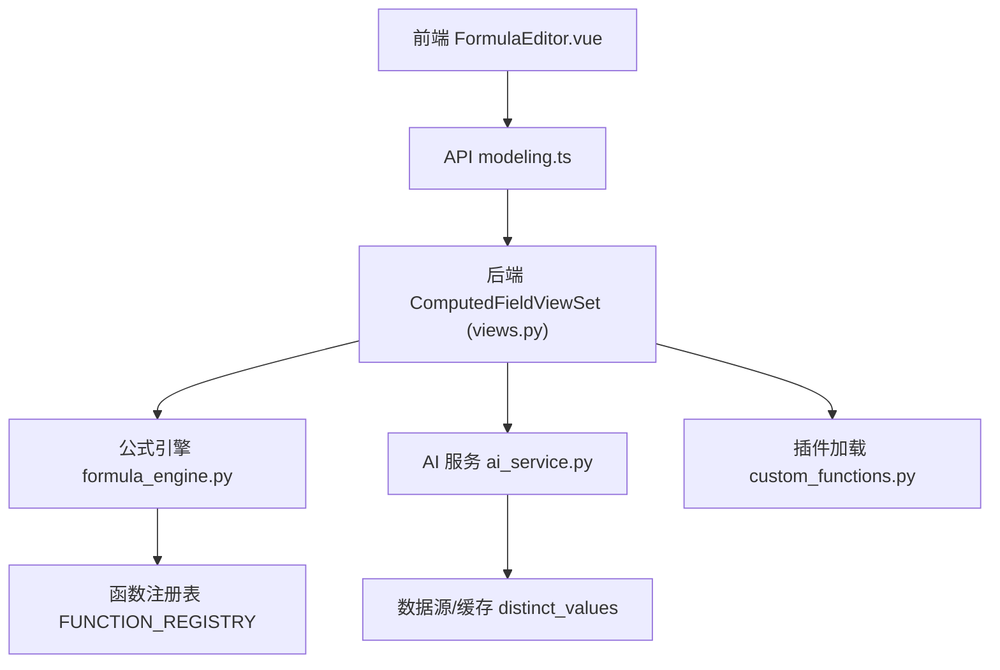
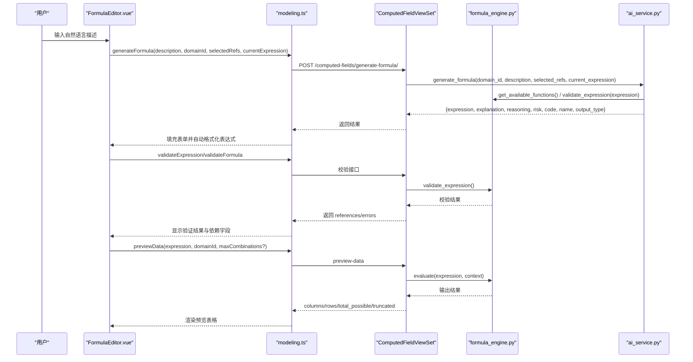
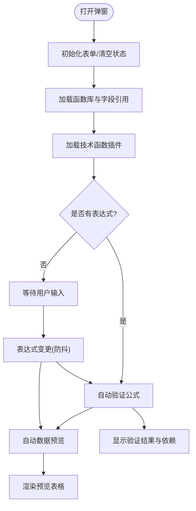
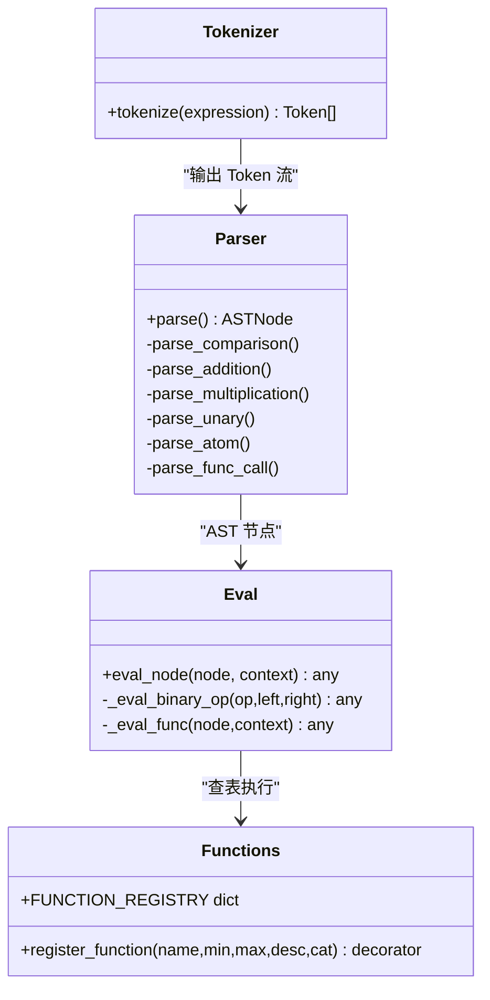
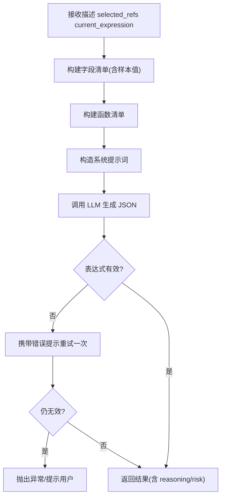
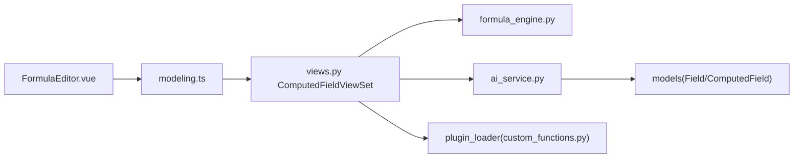

# 公式编辑器组件

<cite>
**本文引用的文件**   
- [FormulaEditor.vue](file://frontend/src/views/modeling/components/FormulaEditor.vue)
- [formula.ts](file://frontend/src/utils/formula.ts)
- [modeling.ts](file://frontend/src/api/modeling.ts)
- [ai_service.py](file://backend/apps/modeling/ai_service.py)
- [formula_engine.py](file://backend/apps/modeling/formula_engine.py)
- [custom_functions.py](file://backend/apps/modeling/custom_functions.py)
- [views.py](file://backend/apps/modeling/views.py)
</cite>

## 目录
1. [简介](#简介)
2. [项目结构](#项目结构)
3. [核心组件](#核心组件)
4. [架构总览](#架构总览)
5. [详细组件分析](#详细组件分析)
6. [依赖关系分析](#依赖关系分析)
7. [性能与优化](#性能与优化)
8. [故障排查指南](#故障排查指南)
9. [结论](#结论)
10. [附录：使用示例与样式定制](#附录使用示例与样式定制)

## 简介
本组件为“FormulaEditor 公式编辑器”，面向主数据建模场景，提供 Excel 风格公式编辑、AI 自然语言生成表达式、实时语法验证、依赖字段分析、数据预览、技术函数插件扩展等能力。前端以 Vue 3 + Ant Design Vue 实现，后端基于 Django REST Framework，内置自研公式引擎（词法/语法解析、AST 求值）与 AI 服务层（OpenAI 兼容接口 + 启发式回退）。

## 项目结构
- 前端
  - 组件：FormulaEditor.vue（弹窗式编辑器，含 AI 生成区、公式编辑区、侧边栏函数库/字段引用、数据预览面板）
  - 工具：formula.ts（表达式格式化）
  - API：modeling.ts（计算字段相关接口封装）
- 后端
  - 视图：ComputedFieldViewSet（校验、预览、AI 生成、插件管理等动作）
  - 引擎：formula_engine.py（表达式解析器、函数注册表、求值器）
  - AI：ai_service.py（LLM 调用、提示词管理、样本值采样、公式生成流程）
  - 插件：custom_functions.py（技术函数插件入口，供用户扩展）

图表来源
- [FormulaEditor.vue:1-120](file://frontend/src/views/modeling/components/FormulaEditor.vue#L1-L120)
- [modeling.ts:356-407](file://frontend/src/api/modeling.ts#L356-L407)
- [views.py:1882-2200](file://backend/apps/modeling/views.py#L1882-L2200)
- [formula_engine.py:1-120](file://backend/apps/modeling/formula_engine.py#L1-L120)
- [ai_service.py:558-747](file://backend/apps/modeling/ai_service.py#L558-L747)

章节来源
- [FormulaEditor.vue:1-120](file://frontend/src/views/modeling/components/FormulaEditor.vue#L1-L120)
- [modeling.ts:356-407](file://frontend/src/api/modeling.ts#L356-L407)
- [views.py:1882-2200](file://backend/apps/modeling/views.py#L1882-L2200)

## 核心组件
- FormulaEditor.vue
  - Props：open、domainId、field
  - Emits：update:open、saved、save-and-trial
  - 功能：AI 自然语言生成表达式、Excel 风格公式编辑、实时验证、依赖字段展示、数据预览、函数库/字段引用侧边栏、技术函数插件上传/重载/卸载
- formula.ts
  - 表达式格式化：函数名大写化、补全右括号、长参数换行缩进、保护字段引用与字符串字面量
- modeling.ts
  - 计算字段 API 封装：validateExpression、validateFormula、previewData、generateFormula、availableFunctions、availableReferences、插件管理等

章节来源
- [FormulaEditor.vue:345-420](file://frontend/src/views/modeling/components/FormulaEditor.vue#L345-L420)
- [formula.ts:1-95](file://frontend/src/utils/formula.ts#L1-L95)
- [modeling.ts:356-407](file://frontend/src/api/modeling.ts#L356-L407)

## 架构总览

图表来源
- [FormulaEditor.vue:767-800](file://frontend/src/views/modeling/components/FormulaEditor.vue#L767-L800)
- [modeling.ts:375-407](file://frontend/src/api/modeling.ts#L375-L407)
- [views.py:2035-2060](file://backend/apps/modeling/views.py#L2035-L2060)
- [ai_service.py:558-747](file://backend/apps/modeling/ai_service.py#L558-L747)
- [formula_engine.py:775-867](file://backend/apps/modeling/formula_engine.py#L775-L867)

## 详细组件分析

### FormulaEditor.vue 组件分析
- 界面结构
  - AI 生成区块：自然语言输入、说明与风险提示、思考过程折叠面板
  - 基础信息：字段编码、名称、输出类型（AI 生成时仅回填空白项）
  - 依赖字段列表：已引用（蓝色可删除）、未使用（橙色可删除）
  - 公式编辑区：表达式文本框、格式化/验证按钮、验证结果
  - 侧边栏：字段引用（按表分组）、函数库（分类排序）、技术函数插件（上传/重载/卸载/模板下载）
  - 数据预览面板：两行表头（输入参数/输出结果），支持“前 50 条/全部”切换
- 交互逻辑
  - 打开弹窗：初始化表单、加载函数库与字段引用、加载插件；编辑模式已有表达式则自动验证与预览
  - 表达式变更：防抖触发验证与预览
  - 验证：新建模式调用 validateExpression，编辑模式调用 validateFormula；成功后同步更新 AI 参考引用集合
  - 预览：根据 showAllPreview 决定请求数量（默认 50，全部不截断）
  - AI 生成：携带 selectedRefs（用户选中的引用字段）+ 当前表达式（修改模式），生成后自动格式化并回填基础信息
  - 插件管理：上传 .py 文件进行 AST 安全校验，动态加载/重载/卸载，刷新函数库
- 状态与计算
  - groupedReferences/currentRefFields：按表分组与搜索过滤
  - groupedFunctions/currentCategoryFns：函数分类与搜索过滤
  - previewColumnList：构建中国式两行表头列定义
  - unusedReferences：对比验证结果与表达式实际引用，标记未使用的引用

图表来源
- [FormulaEditor.vue:540-570](file://frontend/src/views/modeling/components/FormulaEditor.vue#L540-L570)
- [FormulaEditor.vue:685-754](file://frontend/src/views/modeling/components/FormulaEditor.vue#L685-L754)
- [FormulaEditor.vue:767-800](file://frontend/src/views/modeling/components/FormulaEditor.vue#L767-L800)

章节来源
- [FormulaEditor.vue:1-343](file://frontend/src/views/modeling/components/FormulaEditor.vue#L1-L343)
- [FormulaEditor.vue:345-570](file://frontend/src/views/modeling/components/FormulaEditor.vue#L345-L570)
- [FormulaEditor.vue:571-754](file://frontend/src/views/modeling/components/FormulaEditor.vue#L571-L754)
- [FormulaEditor.vue:755-800](file://frontend/src/views/modeling/components/FormulaEditor.vue#L755-L800)

### 公式引擎与验证流程
- 词法分析 tokenize：识别数字、字符串、布尔、字段引用{表名.字段名}、函数名、运算符、括号、逗号
- 语法分析 Parser：递归下降，构建 AST（Number/String/Bool/Ref/BinaryOp/FuncCall/UnaryMinus）
- 求值器 eval_node：上下文查找字段值、执行二元运算、函数调用（含 IFERROR 惰性求值）
- 验证 validate_expression：仅语法与函数参数个数校验，不执行
- 引用提取 extract_references：正则匹配 {表名.字段名}

图表来源
- [formula_engine.py:99-197](file://backend/apps/modeling/formula_engine.py#L99-L197)
- [formula_engine.py:253-366](file://backend/apps/modeling/formula_engine.py#L253-L366)
- [formula_engine.py:669-768](file://backend/apps/modeling/formula_engine.py#L669-L768)
- [formula_engine.py:372-387](file://backend/apps/modeling/formula_engine.py#L372-L387)

章节来源
- [formula_engine.py:1-120](file://backend/apps/modeling/formula_engine.py#L1-L120)
- [formula_engine.py:775-867](file://backend/apps/modeling/formula_engine.py#L775-L867)

### AI 自然语言生成表达式
- 工作流
  - 收集可用字段清单（物理字段 + 计算字段），附带中文名、类型、样本值（distinct_values 或临时采样）
  - 收集可用函数清单（内置 + 技术函数插件）
  - 构造系统提示词（含字段/函数清单、规则、输出 JSON 格式）
  - 调用 LLM（OpenAI 兼容），失败时回退到启发式模拟（若配置缺失）
  - 生成后自动验证表达式，失败则携带错误重试一次
  - 返回 expression/explanation/reasoning/risk/code/name/output_type
- 风险预警
  - risk 字段用于提示空值、类型不一致、建议错误处理等
- 思考过程
  - reasoning 字段包含完整推导步骤，前端以折叠面板展示

图表来源
- [ai_service.py:558-747](file://backend/apps/modeling/ai_service.py#L558-L747)

章节来源
- [ai_service.py:558-747](file://backend/apps/modeling/ai_service.py#L558-L747)
- [views.py:2035-2060](file://backend/apps/modeling/views.py#L2035-L2060)

### 数据预览逻辑
- 输入：表达式、域 ID、可选 max_combinations（缺省/None 表示不截断）
- 处理：解析引用字段 → 枚举去重值组合 → 逐组求值 → 汇总 columns/rows/total_possible/truncated
- 输出：valid/errors/columns/rows/total_possible/truncated

章节来源
- [views.py:2013-2032](file://backend/apps/modeling/views.py#L2013-L2032)
- [formula_engine.py:775-867](file://backend/apps/modeling/formula_engine.py#L775-L867)

### 技术函数插件机制
- 插件规范：@register_function 装饰器，category='技术函数'，签名固定 (args, ctx)
- 生命周期：上传 .py → AST 安全校验 → 写入 tech_plugins/ → 动态加载 → 刷新函数库
- 操作：upload/unload/reload/template/list

章节来源
- [custom_functions.py:1-108](file://backend/apps/modeling/custom_functions.py#L1-L108)
- [views.py:2122-2200](file://backend/apps/modeling/views.py#L2122-L2200)

## 依赖关系分析
- 前端依赖
  - FormulaEditor.vue 依赖 modeling.ts 的 computedFieldApi
  - formula.ts 被 FormulaEditor.vue 与 TrialCalculation 复用
- 后端依赖
  - views.py ComputedFieldViewSet 依赖 formula_engine.py、ai_service.py、plugin_loader
  - ai_service.py 依赖 settings/AIConfig 与数据库模型 Field/ComputedField
  - formula_engine.py 维护全局函数注册表，custom_functions.py 通过装饰器注入

图表来源
- [modeling.ts:356-407](file://frontend/src/api/modeling.ts#L356-L407)
- [views.py:1882-2200](file://backend/apps/modeling/views.py#L1882-L2200)
- [ai_service.py:558-747](file://backend/apps/modeling/ai_service.py#L558-L747)
- [formula_engine.py:372-387](file://backend/apps/modeling/formula_engine.py#L372-L387)

章节来源
- [modeling.ts:356-407](file://frontend/src/api/modeling.ts#L356-L407)
- [views.py:1882-2200](file://backend/apps/modeling/views.py#L1882-L2200)

## 性能与优化
- 表达式变更防抖：800ms 延迟触发验证与预览，避免频繁请求
- 预览分页控制：默认 50 条，支持“全部”模式（不截断）
- 函数库/字段引用并行加载：Promise.all 并发获取 availableFunctions 与 availableReferences
- 插件热重载：无需重启服务，AST 校验保障安全
- 表达式格式化：占位符保护字段引用与字符串字面量，减少误改开销

章节来源
- [FormulaEditor.vue:685-697](file://frontend/src/views/modeling/components/FormulaEditor.vue#L685-L697)
- [FormulaEditor.vue:572-595](file://frontend/src/views/modeling/components/FormulaEditor.vue#L572-L595)
- [formula.ts:1-95](file://frontend/src/utils/formula.ts#L1-L95)

## 故障排查指南
- AI 未配置
  - 现象：generate_formula 报错“AI 服务未配置”
  - 处理：在系统设置-AI配置中填写 API Key，或使用启发式回退
- 表达式语法错误
  - 现象：validateExpression/validateFormula 返回 errors
  - 处理：检查函数名大小写、参数个数、字段引用格式{表名.字段名}
- 循环依赖
  - 现象：validateFormula 返回 cycle 路径
  - 处理：调整计算字段依赖顺序，避免环
- 预览无数据
  - 现象：预览为空或提示“无可预览数据”
  - 处理：确保引用字段存在去重值缓存或可采样

章节来源
- [ai_service.py:578-579](file://backend/apps/modeling/ai_service.py#L578-L579)
- [views.py:1959-2010](file://backend/apps/modeling/views.py#L1959-L2010)
- [views.py:2013-2032](file://backend/apps/modeling/views.py#L2013-L2032)

## 结论
FormulaEditor 组件将 Excel 风格公式编辑、AI 自然语言生成、实时验证、依赖分析与数据预览有机整合，配合自研公式引擎与插件机制，满足复杂主数据建模场景下的灵活表达与高效开发需求。通过合理的性能优化与完善的错误处理，提供了稳定易用的用户体验。

## 附录：使用示例与样式定制

### 基础用法
- 在父组件中引入 FormulaEditor，绑定 open、domainId、field，监听 update:open/saved/save-and-trial 事件

章节来源
- [FormulaEditor.vue:353-363](file://frontend/src/views/modeling/components/FormulaEditor.vue#L353-L363)
- [modeling.ts:356-407](file://frontend/src/api/modeling.ts#L356-L407)

### AI 集成
- 在 AI 生成区块输入自然语言描述，点击“AI 生成”
- 可选择 selectedRefs 缩小范围，提升准确率
- 支持对已有表达式进行修改（传入 currentExpression）

章节来源
- [FormulaEditor.vue:767-800](file://frontend/src/views/modeling/components/FormulaEditor.vue#L767-L800)
- [ai_service.py:558-747](file://backend/apps/modeling/ai_service.py#L558-L747)

### 自定义函数插件
- 编写 Python 插件，使用 @register_function 装饰器注册函数
- 在前端“技术函数”标签页上传 .py 文件，完成 AST 校验与加载
- 支持重载/卸载/模板下载

章节来源
- [custom_functions.py:1-108](file://backend/apps/modeling/custom_functions.py#L1-L108)
- [views.py:2122-2200](file://backend/apps/modeling/views.py#L2122-L2200)

### 样式定制与主题适配
- 组件使用 Ant Design Vue 组件，可通过全局主题变量覆盖颜色、字号、间距
- 预览表格样式可通过 CSS 类 preview-table、preview-th-top、preview-td-output 等进行定制
- 侧边栏级联布局可通过 cascade、cascade-l1、cascade-l2 类调整宽度与高亮

章节来源
- [FormulaEditor.vue:282-341](file://frontend/src/views/modeling/components/FormulaEditor.vue#L282-L341)
- [theme.css](file://frontend/src/styles/theme.css)