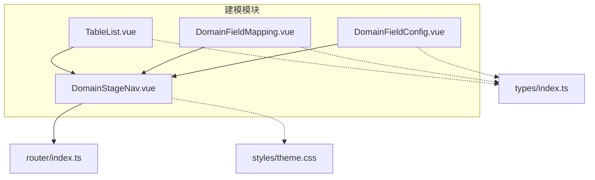
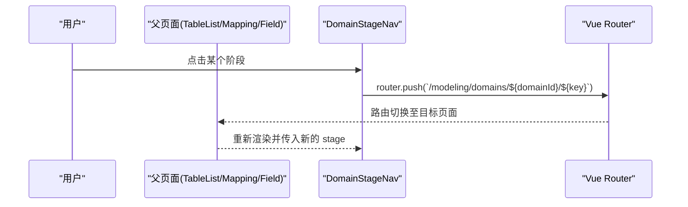
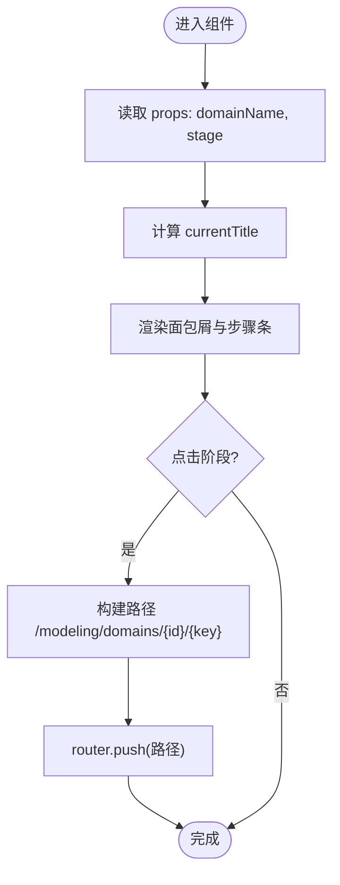
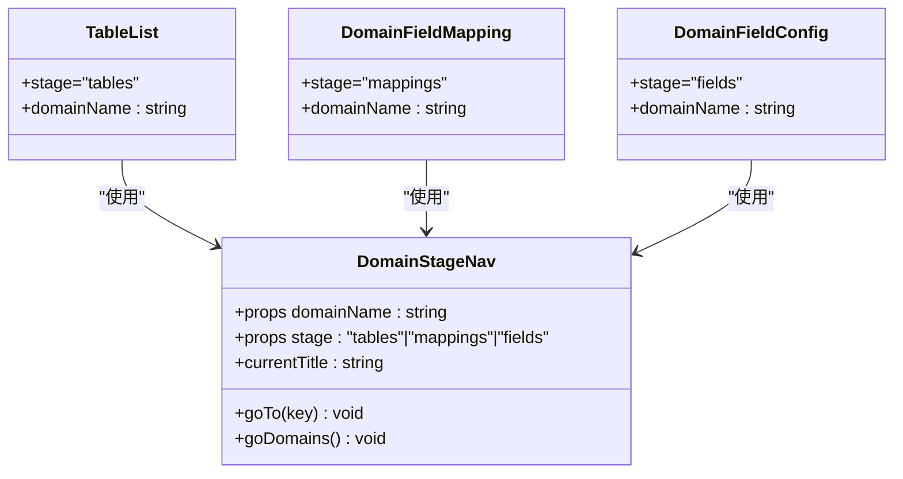

# 域阶段导航组件

<cite>
**本文引用的文件**
- [DomainStageNav.vue](file://frontend/src/views/modeling/components/DomainStageNav.vue)
- [TableList.vue](file://frontend/src/views/modeling/TableList.vue)
- [DomainFieldMapping.vue](file://frontend/src/views/modeling/DomainFieldMapping.vue)
- [DomainFieldConfig.vue](file://frontend/src/views/modeling/DomainFieldConfig.vue)
- [index.ts（路由）](file://frontend/src/router/index.ts)
- [index.ts（类型定义）](file://frontend/src/types/index.ts)
- [theme.css（主题变量）](file://frontend/src/styles/theme.css)
</cite>

## 目录
1. [简介](#简介)
2. [项目结构](#项目结构)
3. [核心组件](#核心组件)
4. [架构总览](#架构总览)
5. [详细组件分析](#详细组件分析)
6. [依赖关系分析](#依赖关系分析)
7. [性能与体验优化](#性能与体验优化)
8. [故障排查指南](#故障排查指南)
9. [结论](#结论)
10. [附录：使用示例与扩展建议](#附录使用示例与扩展建议)

## 简介
本组件为“域阶段导航”，用于主数据建模模块中，围绕一个“域”提供多阶段工作流导航。当前实现包含三个阶段：管理表、关系管理、字段管理。组件负责：
- 展示面包屑与阶段步骤条
- 根据当前路由状态高亮并标记已完成阶段
- 点击阶段进行路由跳转
- 通过 props 接收域名称与当前阶段，驱动视图状态

该组件轻量、无外部状态依赖，适合在多个页面复用。

## 项目结构
- 组件位置：frontend/src/views/modeling/components/DomainStageNav.vue
- 使用方：TableList.vue、DomainFieldMapping.vue、DomainFieldConfig.vue
- 路由：frontend/src/router/index.ts 定义了 /modeling/domains/:id/(tables|mappings|fields)
- 类型：frontend/src/types/index.ts 定义了 Domain、Table、Field 等模型
- 样式：组件内 scoped 样式；全局主题变量位于 frontend/src/styles/theme.css

图表来源
- [DomainStageNav.vue:1-169](file://frontend/src/views/modeling/components/DomainStageNav.vue#L1-L169)
- [TableList.vue:1-100](file://frontend/src/views/modeling/TableList.vue#L1-L100)
- [DomainFieldMapping.vue:1-120](file://frontend/src/views/modeling/DomainFieldMapping.vue#L1-L120)
- [DomainFieldConfig.vue:1-60](file://frontend/src/views/modeling/DomainFieldConfig.vue#L1-L60)
- [index.ts（路由）:1-45](file://frontend/src/router/index.ts#L1-L45)
- [index.ts（类型定义）:1-60](file://frontend/src/types/index.ts#L1-L60)
- [theme.css:1-13](file://frontend/src/styles/theme.css#L1-L13)

章节来源
- [DomainStageNav.vue:1-169](file://frontend/src/views/modeling/components/DomainStageNav.vue#L1-L169)
- [index.ts（路由）:1-45](file://frontend/src/router/index.ts#L1-L45)

## 核心组件
- 组件职责
  - 渲染面包屑：主数据建模 → 域列表 → 当前域名 → 当前阶段标题
  - 渲染阶段步骤条：按固定顺序显示“管理表”“关系管理”“字段管理”
  - 交互：点击阶段跳转到对应路由
  - 状态：根据当前 stage 计算高亮与完成态
- Props 接口
  - domainName: string — 当前域的名称
  - stage: 'tables' | 'mappings' | 'fields' — 当前阶段键值
- 内部逻辑
  - 从路由参数获取 domainId，拼接目标路由
  - 阶段顺序 order = ['tables','mappings','fields']
  - stages 配置项 key/title 映射
  - currentTitle 由 stage 动态计算

章节来源
- [DomainStageNav.vue:35-64](file://frontend/src/views/modeling/components/DomainStageNav.vue#L35-L64)
- [DomainStageNav.vue:48-55](file://frontend/src/views/modeling/components/DomainStageNav.vue#L48-L55)

## 架构总览
组件与路由的关系如下：
- 父页面传入 stage 与 domainName
- 组件内部通过 vue-router 的 useRoute/useRouter 读取 id 并执行 push
- 路由表定义了三个子路由，分别对应三个页面

图表来源
- [DomainStageNav.vue:57-63](file://frontend/src/views/modeling/components/DomainStageNav.vue#L57-L63)
- [index.ts（路由）:11-18](file://frontend/src/router/index.ts#L11-L18)

## 详细组件分析

### 组件结构与样式
- 模板结构
  - 顶部面包屑区：静态文案 + 动态域名与当前阶段标题
  - 底部步骤条：v-for 渲染 stages，箭头分隔符
- 样式要点
  - 容器圆角、浅背景、边框
  - 步骤项 hover/active/done 三类状态
  - 数字圆形徽标，done 态显示对勾
  - 颜色采用 Ant Design 风格蓝/绿/灰

章节来源
- [DomainStageNav.vue:1-33](file://frontend/src/views/modeling/components/DomainStageNav.vue#L1-L33)
- [DomainStageNav.vue:66-168](file://frontend/src/views/modeling/components/DomainStageNav.vue#L66-L168)

### 阶段导航逻辑
- 阶段顺序与标题
  - order 数组决定“已完成”判定：当当前阶段索引大于某阶段索引时，该阶段为 done
  - stages 数组维护 key 与 title 映射
- 当前标题计算
  - computed 属性 currentTitle 基于 stage 查找 titles
- 路由跳转
  - goTo(key) 将跳转到 /modeling/domains/{domainId}/{key}
  - goDomains() 返回到 /modeling/domains

图表来源
- [DomainStageNav.vue:48-63](file://frontend/src/views/modeling/components/DomainStageNav.vue#L48-L63)

### 权限控制与操作限制
- 当前实现未内置权限校验或禁用逻辑
- 如需限制访问，可在父页面层拦截路由或根据角色/状态隐藏/禁用阶段入口
- 建议在后续扩展中增加 disabled 状态与提示

章节来源
- [DomainStageNav.vue:39-42](file://frontend/src/views/modeling/components/DomainStageNav.vue#L39-L42)

### 数据同步机制
- 组件不直接读写业务数据，仅依赖路由参数与 props
- 父页面负责加载域信息、表/字段/映射数据，并在切换阶段后刷新所需数据

章节来源
- [TableList.vue:404-435](file://frontend/src/views/modeling/TableList.vue#L404-L435)
- [DomainFieldMapping.vue:395-415](file://frontend/src/views/modeling/DomainFieldMapping.vue#L395-L415)
- [DomainFieldConfig.vue:640-696](file://frontend/src/views/modeling/DomainFieldConfig.vue#L640-L696)

### 不同阶段的业务含义与操作限制
- 管理表（tables）
  - 作用：创建本地/外部表、设置主表与主键、启用/停用表
  - 典型操作：新建表、设主表、设置主键、预览数据
- 关系管理（mappings）
  - 作用：建立表间字段映射，支持联合主键、AI 推断、ER 图可视化
  - 典型操作：新建映射、编辑、删除、AI 自动建立、全屏 ER 图
- 字段管理（fields）
  - 作用：字段分类、分组、属性配置、组合字段、计算字段
  - 典型操作：拖拽分类、批量重算、公式编辑器、枚举试算

章节来源
- [TableList.vue:1-120](file://frontend/src/views/modeling/TableList.vue#L1-L120)
- [DomainFieldMapping.vue:1-120](file://frontend/src/views/modeling/DomainFieldMapping.vue#L1-L120)
- [DomainFieldConfig.vue:1-120](file://frontend/src/views/modeling/DomainFieldConfig.vue#L1-L120)

## 依赖关系分析
- 运行时依赖
  - Vue 3 Composition API（computed）
  - Vue Router（useRoute、useRouter）
  - Ant Design Vue（Breadcrumb、Button 等）
- 组件耦合
  - 与路由强耦合（硬编码路径）
  - 与父页面松耦合（仅通过 props 通信）
- 类型依赖
  - types/index.ts 中的 Domain、Table、Field 等被各页面引用

图表来源
- [DomainStageNav.vue:35-64](file://frontend/src/views/modeling/components/DomainStageNav.vue#L35-L64)
- [TableList.vue:1-10](file://frontend/src/views/modeling/TableList.vue#L1-L10)
- [DomainFieldMapping.vue:1-10](file://frontend/src/views/modeling/DomainFieldMapping.vue#L1-L10)
- [DomainFieldConfig.vue:1-10](file://frontend/src/views/modeling/DomainFieldConfig.vue#L1-L10)

章节来源
- [index.ts（路由）:11-18](file://frontend/src/router/index.ts#L11-L18)
- [index.ts（类型定义）:17-47](file://frontend/src/types/index.ts#L17-L47)

## 性能与体验优化
- 性能
  - 组件无复杂计算，render 开销低
  - 避免在 steps 上引入过多响应式对象
- 用户体验
  - 加载状态：父页面在数据加载时显示 loading，组件本身无需额外处理
  - 错误提示：统一通过 message/error 工具提示
  - 操作确认：危险操作（删除、废弃）使用 Modal.confirm/popconfirm
  - 可访问性：为步骤项添加 aria-label，键盘导航支持 Tab/Enter
  - 响应式：在小屏设备上考虑步骤条换行或滚动

[本节为通用建议，不直接分析具体文件]

## 故障排查指南
- 常见问题
  - 点击阶段无跳转：检查路由是否已定义对应 path，确保 domainId 存在
  - 阶段高亮异常：确认传入的 stage 值与组件定义的联合类型一致
  - 面包屑域名为空：确认父页面是否正确传递 domainName
- 定位方法
  - 打开浏览器开发者工具，查看路由变化与 console 日志
  - 在 goTo/goDomains 处打断点，确认路径拼接正确

章节来源
- [DomainStageNav.vue:57-63](file://frontend/src/views/modeling/components/DomainStageNav.vue#L57-L63)
- [index.ts（路由）:11-18](file://frontend/src/router/index.ts#L11-L18)

## 结论
DomainStageNav 是一个简洁、可复用的阶段导航组件，聚焦于“展示+跳转”。其设计清晰、耦合度低，便于在多页面复用。未来可扩展方向包括：
- 增加权限控制与禁用态
- 支持自定义阶段配置（title、icon、条件显示）
- 增强可访问性与键盘导航
- 主题化与样式定制

[本节为总结，不直接分析具体文件]

## 附录：使用示例与扩展建议

### 基础用法
- 在 TableList.vue 中使用
  - 传入 stage="tables" 与 domainName
- 在 DomainFieldMapping.vue 中使用
  - 传入 stage="mappings" 与 domainName
- 在 DomainFieldConfig.vue 中使用
  - 传入 stage="fields" 与 domainName

章节来源
- [TableList.vue:1-10](file://frontend/src/views/modeling/TableList.vue#L1-L10)
- [DomainFieldMapping.vue:1-10](file://frontend/src/views/modeling/DomainFieldMapping.vue#L1-L10)
- [DomainFieldConfig.vue:1-10](file://frontend/src/views/modeling/DomainFieldConfig.vue#L1-L10)

### 自定义阶段
- 若需新增阶段（如“发布阶段”），建议：
  - 扩展 stage 联合类型
  - 在 stages 与 order 中追加新阶段
  - 在路由表中新增对应 path
  - 在父页面中传入新 stage 值

章节来源
- [DomainStageNav.vue:39-53](file://frontend/src/views/modeling/components/DomainStageNav.vue#L39-L53)
- [index.ts（路由）:11-18](file://frontend/src/router/index.ts#L11-L18)

### 条件显示
- 可根据用户角色或业务状态，在父页面决定是否渲染组件或传入 disabled 状态（需组件扩展）

### 样式定制
- 组件使用 scoped 样式，可通过覆盖类名调整外观
- 全局主题变量位于 theme.css，可统一调整背景色、边框色等

章节来源
- [DomainStageNav.vue:66-168](file://frontend/src/views/modeling/components/DomainStageNav.vue#L66-L168)
- [theme.css:1-13](file://frontend/src/styles/theme.css#L1-L13)