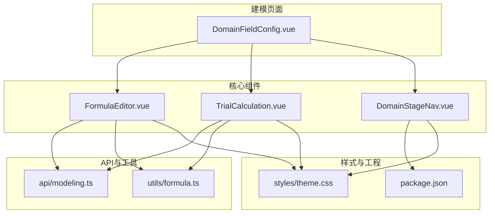
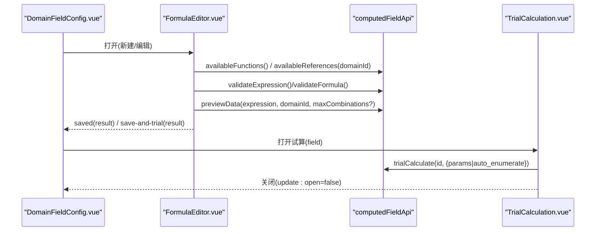
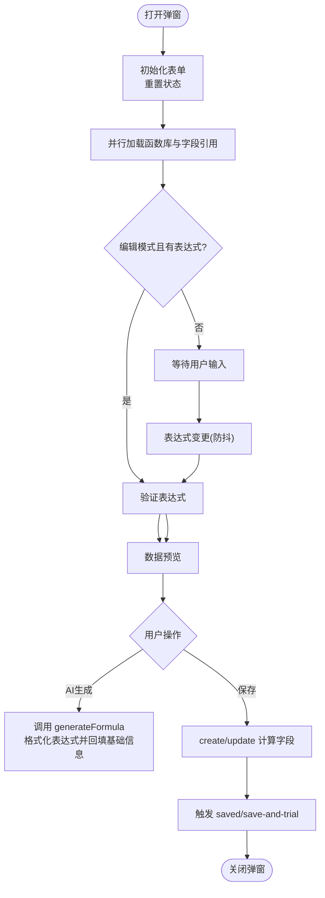
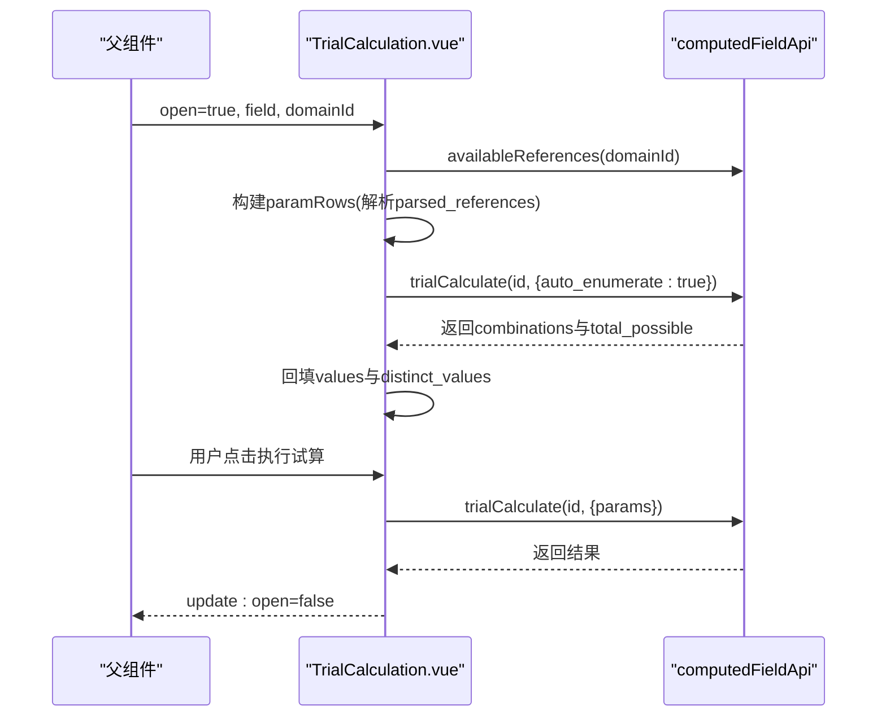
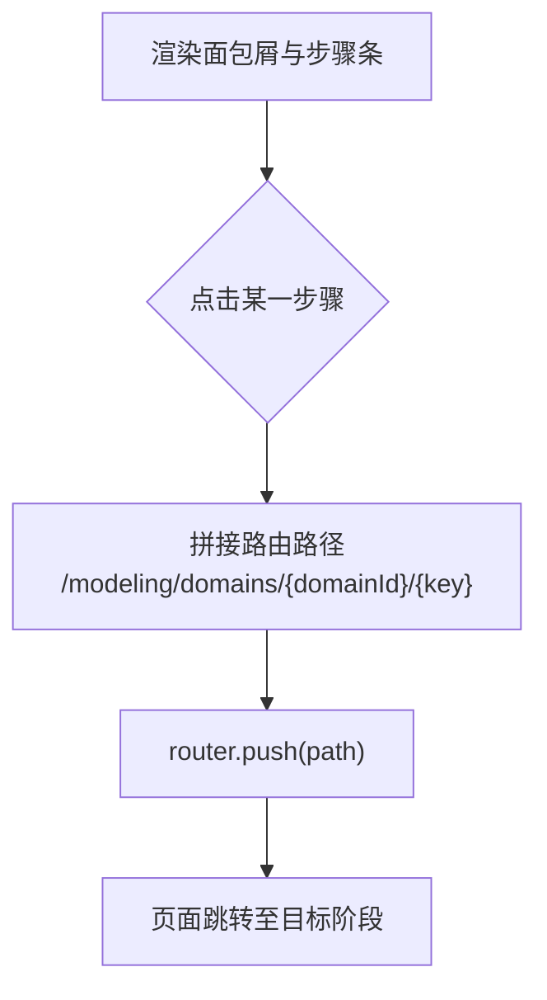
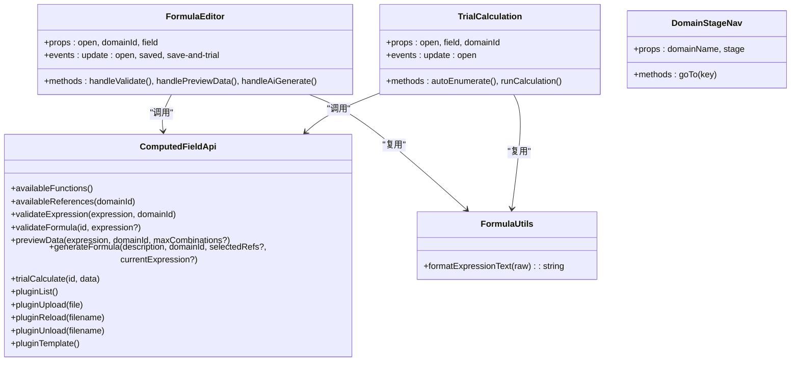

# 核心UI组件

<cite>
**本文引用的文件**   
- [FormulaEditor.vue](file://frontend/src/views/modeling/components/FormulaEditor.vue)
- [TrialCalculation.vue](file://frontend/src/views/modeling/components/TrialCalculation.vue)
- [DomainStageNav.vue](file://frontend/src/views/modeling/components/DomainStageNav.vue)
- [modeling.ts](file://frontend/src/api/modeling.ts)
- [formula.ts](file://frontend/src/utils/formula.ts)
- [theme.css](file://frontend/src/styles/theme.css)
- [package.json](file://frontend/package.json)
- [DomainFieldConfig.vue](file://frontend/src/views/modeling/DomainFieldConfig.vue)
</cite>

## 目录
1. [简介](#简介)
2. [项目结构](#项目结构)
3. [核心组件总览](#核心组件总览)
4. [架构概览](#架构概览)
5. [组件详细分析](#组件详细分析)
6. [依赖关系分析](#依赖关系分析)
7. [性能与优化建议](#性能与优化建议)
8. [调试与排错指南](#调试与排错指南)
9. [样式定制与主题适配](#样式定制与主题适配)
10. [组合模式与复用策略](#组合模式与复用策略)
11. [结论](#结论)

## 简介
本文件为 MetaData002 前端应用的核心 UI 组件文档，聚焦以下三个关键组件：
- 公式编辑器（FormulaEditor）：支持自然语言生成、表达式编辑、函数库与字段引用插入、数据预览、技术函数插件管理。
- 试算组件（TrialCalculation）：基于计算字段的笛卡尔积参数枚举与结果展示。
- 域阶段导航（DomainStageNav）：用于“主数据建模”域内“管理表/关系管理/字段管理”的阶段式导航。

文档涵盖每个组件的 props 接口、事件发射机制、插槽使用方式、样式定制选项、主题适配方案、性能优化建议、调试技巧以及组件间的组合与复用策略。

## 项目结构
- 组件位于 modeling 视图下的 components 目录，API 定义在 api/modeling.ts，工具函数在 utils/formula.ts，全局主题变量在 styles/theme.css。
- 组件通过 Vue 3 + Ant Design Vue 构建，依赖 Vite 打包。

**图表来源** 
- [DomainFieldConfig.vue:1-200](file://frontend/src/views/modeling/DomainFieldConfig.vue#L1-L200)
- [FormulaEditor.vue:1-120](file://frontend/src/views/modeling/components/FormulaEditor.vue#L1-L120)
- [TrialCalculation.vue:1-120](file://frontend/src/views/modeling/components/TrialCalculation.vue#L1-L120)
- [DomainStageNav.vue:1-64](file://frontend/src/views/modeling/components/DomainStageNav.vue#L1-L64)
- [modeling.ts:356-407](file://frontend/src/api/modeling.ts#L356-L407)
- [formula.ts:1-95](file://frontend/src/utils/formula.ts#L1-L95)
- [theme.css:1-13](file://frontend/src/styles/theme.css#L1-L13)
- [package.json:1-29](file://frontend/package.json#L1-L29)

**章节来源**
- [DomainFieldConfig.vue:1-200](file://frontend/src/views/modeling/DomainFieldConfig.vue#L1-L200)
- [package.json:1-29](file://frontend/package.json#L1-L29)

## 核心组件总览
- 公式编辑器（FormulaEditor）
  - 功能：AI 自然语言生成表达式、基础信息编辑、表达式验证与格式化、函数库与字段引用侧栏、数据预览面板、技术函数插件上传/重载/卸载。
  - Props：open、domainId、field。
  - 事件：update:open、saved、save-and-trial。
  - 插槽：无自定义插槽，使用 Ant Design Modal 默认 footer 插槽进行按钮布局。
- 试算组件（TrialCalculation）
  - 功能：根据计算字段的 parsed_references 自动构建参数表格，支持手动输入或选择去重值，执行试算并分页展示结果。
  - Props：open、field、domainId。
  - 事件：update:open。
  - 插槽：无自定义插槽。
- 域阶段导航（DomainStageNav）
  - 功能：面包屑+步骤条，支持跳转到“管理表/关系管理/字段管理”。
  - Props：domainName、stage。
  - 事件：无显式事件，内部通过 vue-router 跳转。
  - 插槽：无自定义插槽。

**章节来源**
- [FormulaEditor.vue:345-363](file://frontend/src/views/modeling/components/FormulaEditor.vue#L345-L363)
- [TrialCalculation.vue:111-119](file://frontend/src/views/modeling/components/TrialCalculation.vue#L111-L119)
- [DomainStageNav.vue:39-43](file://frontend/src/views/modeling/components/DomainStageNav.vue#L39-L43)

## 架构概览
组件间交互与数据流：
- DomainFieldConfig 作为页面容器，负责打开 FormulaEditor 和 TrialCalculation，并处理保存后联动打开试算。
- FormulaEditor 调用 computedFieldApi 获取函数库、可用字段、验证表达式、预览数据、生成公式、插件管理等。
- TrialCalculation 调用 trialCalculate 接口执行试算，并使用 formatExpressionText 统一格式化表达式展示。
- DomainStageNav 通过路由跳转切换阶段。

**图表来源** 
- [FormulaEditor.vue:572-595](file://frontend/src/views/modeling/components/FormulaEditor.vue#L572-L595)
- [FormulaEditor.vue:711-735](file://frontend/src/views/modeling/components/FormulaEditor.vue#L711-L735)
- [FormulaEditor.vue:737-754](file://frontend/src/views/modeling/components/FormulaEditor.vue#L737-L754)
- [FormulaEditor.vue:878-930](file://frontend/src/views/modeling/components/FormulaEditor.vue#L878-L930)
- [TrialCalculation.vue:203-227](file://frontend/src/views/modeling/components/TrialCalculation.vue#L203-L227)
- [TrialCalculation.vue:229-256](file://frontend/src/views/modeling/components/TrialCalculation.vue#L229-L256)
- [modeling.ts:356-407](file://frontend/src/api/modeling.ts#L356-L407)

## 组件详细分析

### 公式编辑器（FormulaEditor）
- 功能要点
  - AI 自然语言生成：描述需求 → 自动生成编码、名称、输出类型与表达式；支持附带已选引用字段与当前表达式以增量修改。
  - 表达式编辑：支持格式化、验证、实时预览；侧栏提供函数库与字段引用两级级联选择插入。
  - 数据预览：按输入参数去重组合展示前 N 条或全部，支持错误提示与列分组显示。
  - 技术函数插件：上传 .py 插件，AST 安全校验后加载，支持重载与卸载，同步刷新函数库。
- Props 接口
  - open: boolean（控制弹窗可见性）
  - domainId: number（域ID，用于拉取函数库、字段引用、预览等）
  - field?: ComputedFieldModel | null（编辑模式时传入已有计算字段）
- 事件发射
  - update:open: boolean（双向绑定控制弹窗）
  - saved: ComputedFieldModel（保存成功回调）
  - save-and-trial: ComputedFieldModel（保存并打开试算）
- 插槽使用
  - 使用 Ant Design Modal 的 #footer 插槽自定义按钮布局（取消、保存、保存并试算）。
- 关键流程
  - 打开弹窗：初始化表单、加载函数库与字段引用、编辑模式自动验证与预览。
  - 表达式变更：防抖触发验证与预览。
  - AI 生成：携带 selectedRefsForAi 与 currentExpression，生成后自动格式化并回填基础信息。
  - 保存：新建或更新计算字段，成功后触发 saved/save-and-trial。
- 数据结构与复杂度
  - 函数库与字段引用：按分类/表分组，O(n) 过滤与 Map 聚合。
  - 预览列构建：columns 映射到 displayNameMap，O(m) 计算。
  - 未使用引用：Set 合并与过滤，O(k)。
- 错误处理
  - 网络请求失败：提取 API 错误消息并提示。
  - 插件上传/重载/卸载：状态映射与错误提示。
- 性能优化
  - 防抖验证（800ms），避免频繁请求。
  - 并行加载函数库与字段引用（Promise.all）。
  - 预览数量可控（默认 50，可切换全部）。
- 调试技巧
  - 控制台打印 loadSidebarData、handleValidate、handlePreviewData 的返回数据。
  - 检查 selectedRefsForAi 与 validationResult.references 的一致性。
  - 插件上传后确认 availableFunctions 是否刷新。

**图表来源** 
- [FormulaEditor.vue:540-570](file://frontend/src/views/modeling/components/FormulaEditor.vue#L540-L570)
- [FormulaEditor.vue:686-697](file://frontend/src/views/modeling/components/FormulaEditor.vue#L686-L697)
- [FormulaEditor.vue:767-808](file://frontend/src/views/modeling/components/FormulaEditor.vue#L767-L808)
- [FormulaEditor.vue:878-930](file://frontend/src/views/modeling/components/FormulaEditor.vue#L878-L930)

**章节来源**
- [FormulaEditor.vue:345-363](file://frontend/src/views/modeling/components/FormulaEditor.vue#L345-L363)
- [FormulaEditor.vue:572-595](file://frontend/src/views/modeling/components/FormulaEditor.vue#L572-L595)
- [FormulaEditor.vue:711-735](file://frontend/src/views/modeling/components/FormulaEditor.vue#L711-L735)
- [FormulaEditor.vue:737-754](file://frontend/src/views/modeling/components/FormulaEditor.vue#L737-L754)
- [FormulaEditor.vue:767-808](file://frontend/src/views/modeling/components/FormulaEditor.vue#L767-L808)
- [FormulaEditor.vue:878-930](file://frontend/src/views/modeling/components/FormulaEditor.vue#L878-L930)
- [modeling.ts:356-407](file://frontend/src/api/modeling.ts#L356-L407)

### 试算组件（TrialCalculation）
- 功能要点
  - 自动枚举：打开弹窗即自动枚举参数组合，回填测试值与下拉选项。
  - 手动设置：支持多选标签输入，构建笛卡尔积。
  - 结果展示：分页表格，显示输入与输出，错误行高亮。
- Props 接口
  - open: boolean
  - field?: ComputedFieldModel | null
  - domainId: number
- 事件发射
  - update:open: boolean
- 插槽使用
  - 无自定义插槽。
- 关键流程
  - 打开弹窗：从 parsed_references 构建参数行，拉取 display_name 与 distinct_values，自动枚举。
  - 执行试算：收集非空 values，调用 trialCalculate，渲染结果。
- 数据结构与复杂度
  - paramRows：O(r) 构建，r 为引用字段数。
  - resultColumns：动态计算输入列 + 输出列。
- 错误处理
  - 自动枚举失败与试算失败均捕获并提示。
- 性能优化
  - 分页展示结果，限制滚动区域高度。
- 调试技巧
  - 检查 paramRows.values 是否正确填充。
  - 查看 result.combinations 长度与 truncated 标志。

**图表来源** 
- [TrialCalculation.vue:163-201](file://frontend/src/views/modeling/components/TrialCalculation.vue#L163-L201)
- [TrialCalculation.vue:203-227](file://frontend/src/views/modeling/components/TrialCalculation.vue#L203-L227)
- [TrialCalculation.vue:229-256](file://frontend/src/views/modeling/components/TrialCalculation.vue#L229-L256)
- [modeling.ts:382-387](file://frontend/src/api/modeling.ts#L382-L387)

**章节来源**
- [TrialCalculation.vue:111-119](file://frontend/src/views/modeling/components/TrialCalculation.vue#L111-L119)
- [TrialCalculation.vue:163-201](file://frontend/src/views/modeling/components/TrialCalculation.vue#L163-L201)
- [TrialCalculation.vue:203-227](file://frontend/src/views/modeling/components/TrialCalculation.vue#L203-L227)
- [TrialCalculation.vue:229-256](file://frontend/src/views/modeling/components/TrialCalculation.vue#L229-L256)
- [modeling.ts:382-387](file://frontend/src/api/modeling.ts#L382-L387)

### 域阶段导航（DomainStageNav）
- 功能要点
  - 面包屑：主数据建模 → 域列表 → 域名 → 当前阶段。
  - 步骤条：管理表 → 关系管理 → 字段管理，支持点击跳转。
- Props 接口
  - domainName: string
  - stage: 'tables' | 'mappings' | 'fields'
- 事件发射
  - 无显式事件，内部通过 vue-router.push 跳转。
- 插槽使用
  - 无自定义插槽。
- 关键流程
  - 读取 route.params.id 作为 domainId。
  - goTo(key) 构造路由路径并跳转。
- 样式与主题
  - 使用 scoped 样式，颜色与字体遵循 Ant Design 风格。

**图表来源** 
- [DomainStageNav.vue:57-63](file://frontend/src/views/modeling/components/DomainStageNav.vue#L57-L63)

**章节来源**
- [DomainStageNav.vue:39-43](file://frontend/src/views/modeling/components/DomainStageNav.vue#L39-L43)
- [DomainStageNav.vue:57-63](file://frontend/src/views/modeling/components/DomainStageNav.vue#L57-L63)

## 依赖关系分析
- 组件对外部 API 的依赖集中在 computedFieldApi，包括：
  - availableFunctions、availableReferences、validateExpression/validateFormula、previewData、generateFormula、trialCalculate、pluginList/Upload/Reload/Unload/Template。
- 工具函数 formatExpressionText 被 FormulaEditor 与 TrialCalculation 共同复用，保证表达式格式一致。
- 样式 theme.css 提供全局变量，组件使用 scoped 样式覆盖局部样式。

**图表来源** 
- [FormulaEditor.vue:345-363](file://frontend/src/views/modeling/components/FormulaEditor.vue#L345-L363)
- [TrialCalculation.vue:111-119](file://frontend/src/views/modeling/components/TrialCalculation.vue#L111-L119)
- [modeling.ts:356-407](file://frontend/src/api/modeling.ts#L356-L407)
- [formula.ts:1-95](file://frontend/src/utils/formula.ts#L1-L95)

**章节来源**
- [modeling.ts:356-407](file://frontend/src/api/modeling.ts#L356-L407)
- [formula.ts:1-95](file://frontend/src/utils/formula.ts#L1-L95)

## 性能与优化建议
- 公式编辑器
  - 表达式验证与预览采用防抖（800ms），减少无效请求。
  - 并行加载函数库与字段引用，缩短首屏时间。
  - 预览数据默认限制 50 条，支持切换全部，避免大数据量渲染卡顿。
  - 侧栏搜索与分组使用 Map 聚合，降低重复计算。
- 试算组件
  - 结果表格分页展示，限制滚动区域高度，提升渲染性能。
  - 自动枚举仅在打开弹窗时执行一次，避免重复计算。
- 通用
  - 使用 Ant Design 组件内置虚拟化与按需加载，减少包体积。
  - 避免在模板中进行复杂计算，尽量使用 computed 缓存。

[本节为通用指导，不直接分析具体文件]

## 调试与排错指南
- 常见问题
  - 函数库或字段引用加载失败：检查后端服务是否正常，查看 sidebarError 状态。
  - 表达式验证失败：检查语法与引用字段是否存在，查看 validationResult.errors。
  - 数据预览为空：确认引用字段是否有去重值缓存，必要时手动输入测试值。
  - 插件上传失败：确认文件格式为 .py，查看后端返回 details 中的错误详情。
- 调试技巧
  - 在浏览器控制台打印 API 响应数据，确认字段结构与预期一致。
  - 检查 selectedRefsForAi 与 validationResult.references 的一致性，确保 AI 生成携带正确引用。
  - 对于试算，检查 paramRows.values 是否为空，确保至少一个参数有值。

**章节来源**
- [FormulaEditor.vue:572-595](file://frontend/src/views/modeling/components/FormulaEditor.vue#L572-L595)
- [FormulaEditor.vue:711-735](file://frontend/src/views/modeling/components/FormulaEditor.vue#L711-L735)
- [FormulaEditor.vue:737-754](file://frontend/src/views/modeling/components/FormulaEditor.vue#L737-L754)
- [TrialCalculation.vue:203-227](file://frontend/src/views/modeling/components/TrialCalculation.vue#L203-L227)

## 样式定制与主题适配
- 全局主题变量
  - 在 theme.css 中定义 --sidebar-width、--header-height、--color-bg-subtle、--color-border-light 等变量，便于整体主题切换。
- 组件样式
  - 各组件使用 scoped 样式，避免全局污染。
  - 公式编辑器与试算组件使用 monospace 字体展示表达式，增强可读性。
  - 数据预览表格使用 sticky 表头，提升长表格浏览体验。
- 定制建议
  - 通过覆盖 Ant Design 组件样式类（如 .ant-modal、.ant-table）实现主题适配。
  - 使用 CSS 变量替换硬编码颜色，便于深色模式支持。

**章节来源**
- [theme.css:1-13](file://frontend/src/styles/theme.css#L1-L13)
- [FormulaEditor.vue:933-1435](file://frontend/src/views/modeling/components/FormulaEditor.vue#L933-L1435)
- [TrialCalculation.vue:259-300](file://frontend/src/views/modeling/components/TrialCalculation.vue#L259-L300)
- [DomainStageNav.vue:66-169](file://frontend/src/views/modeling/components/DomainStageNav.vue#L66-L169)

## 组合模式与复用策略
- 组合模式
  - DomainFieldConfig 作为页面容器，组合 DomainStageNav、FormulaEditor、TrialCalculation，统一管理状态与路由。
  - FormulaEditor 与 TrialCalculation 共享 formula.ts 的 formatExpressionText，保证表达式格式一致。
- 复用策略
  - 将常用逻辑（如表达式格式化、错误提取）抽取到 utils 模块，供多组件复用。
  - API 调用集中管理在 api/modeling.ts，统一错误处理与类型定义。
- 扩展建议
  - 新增计算字段类型或函数类别时，仅需更新 API 返回结构与侧栏分组逻辑。
  - 插件系统支持热重载，无需重启服务即可生效。

**章节来源**
- [DomainFieldConfig.vue:1-200](file://frontend/src/views/modeling/DomainFieldConfig.vue#L1-L200)
- [formula.ts:1-95](file://frontend/src/utils/formula.ts#L1-L95)
- [modeling.ts:356-407](file://frontend/src/api/modeling.ts#L356-L407)

## 结论
MetaData002 前端核心 UI 组件围绕公式编辑、试算与阶段导航三大场景构建，具备完善的 API 集成、良好的用户体验与可扩展性。通过合理的组件拆分、工具函数复用与样式主题管理，实现了高效开发与维护。建议在后续迭代中继续优化性能与错误提示，增强主题适配能力，以满足更复杂的业务需求。

[本节为总结，不直接分析具体文件]