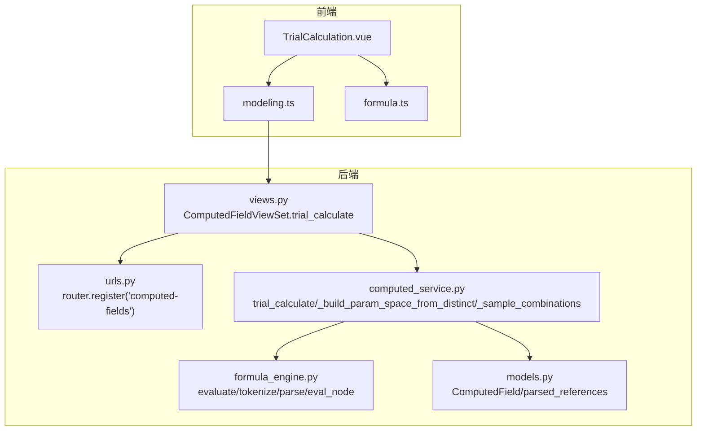
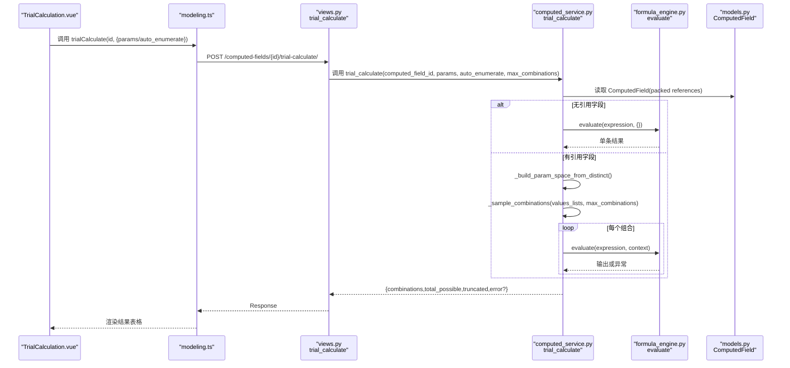
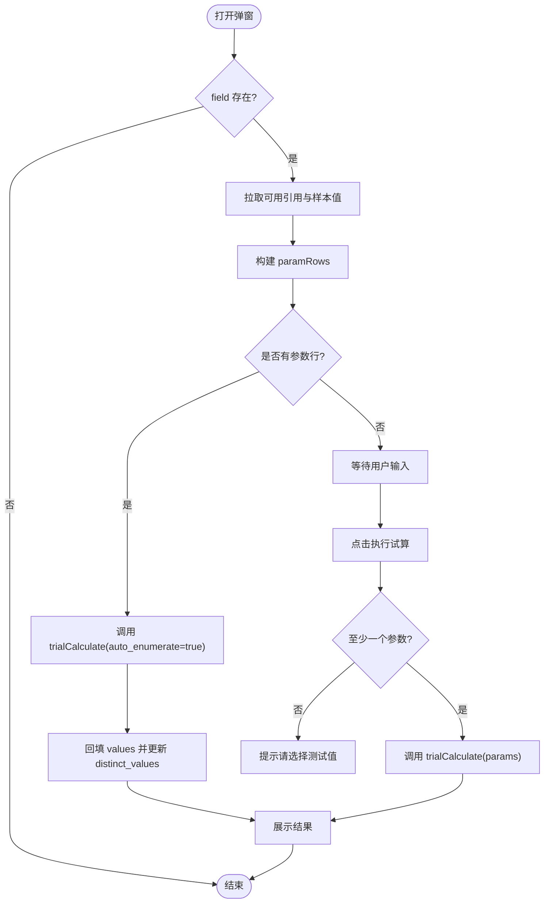
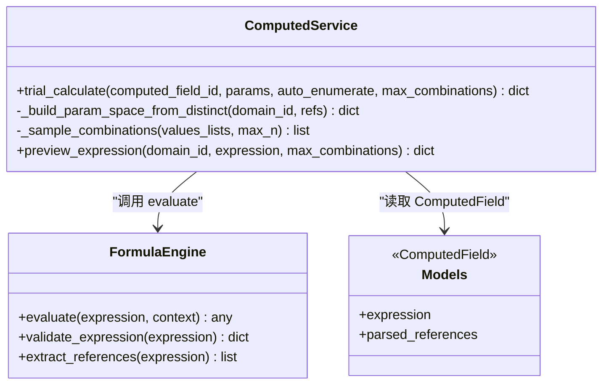
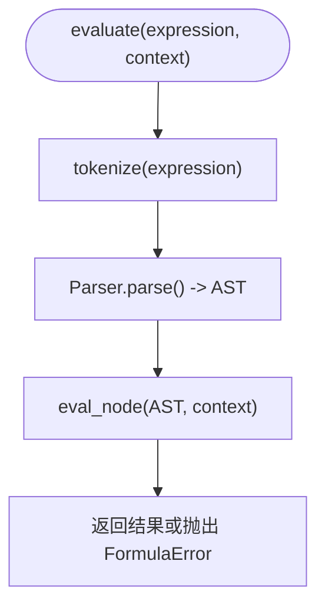
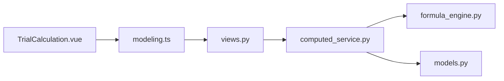

# 试算组件

<cite>
**本文引用的文件**   
- [TrialCalculation.vue](file://frontend/src/views/modeling/components/TrialCalculation.vue)
- [modeling.ts](file://frontend/src/api/modeling.ts)
- [formula_engine.py](file://backend/apps/modeling/formula_engine.py)
- [computed_service.py](file://backend/apps/modeling/computed_service.py)
- [views.py](file://backend/apps/modeling/views.py)
- [urls.py](file://backend/apps/modeling/urls.py)
- [models.py](file://backend/apps/modeling/models.py)
- [formula.ts](file://frontend/src/utils/formula.ts)
</cite>

## 目录
1. [简介](#简介)
2. [项目结构](#项目结构)
3. [核心组件](#核心组件)
4. [架构总览](#架构总览)
5. [详细组件分析](#详细组件分析)
6. [依赖关系分析](#依赖关系分析)
7. [性能考量](#性能考量)
8. [故障排查指南](#故障排查指南)
9. [结论](#结论)
10. [附录：使用示例与接口说明](#附录使用示例与接口说明)

## 简介
本文件为 TrialCalculation 试算组件的完整技术文档。该组件用于对“计算字段”表达式进行枚举式试算，支持批量参数组合、结果展示、错误处理与数据对比等能力。其前端通过 API 调用后端服务，由公式引擎解析并执行表达式，返回笛卡尔积组合下的输出结果与统计信息。

## 项目结构
- 前端
  - 组件：TrialCalculation.vue（弹窗式试算界面）
  - API：modeling.ts（封装 trialCalculate、availableReferences 等接口）
  - 工具：formula.ts（表达式格式化，供编辑器与试算展示复用）
- 后端
  - 视图：views.py（ComputedFieldViewSet.trial_calculate action）
  - 路由：urls.py（注册 computed-fields 路由）
  - 服务：computed_service.py（trial_calculate、参数空间构建、采样策略）
  - 引擎：formula_engine.py（词法/语法/求值、内置函数、错误类型）
  - 模型：models.py（ComputedField 定义及关键字段）

图表来源
- [TrialCalculation.vue:1-300](file://frontend/src/views/modeling/components/TrialCalculation.vue#L1-L300)
- [modeling.ts:356-407](file://frontend/src/api/modeling.ts#L356-L407)
- [views.py:2062-2081](file://backend/apps/modeling/views.py#L2062-L2081)
- [urls.py:15-15](file://backend/apps/modeling/urls.py#L15-L15)
- [computed_service.py:373-439](file://backend/apps/modeling/computed_service.py#L373-L439)
- [formula_engine.py:775-796](file://backend/apps/modeling/formula_engine.py#L775-L796)
- [models.py:425-452](file://backend/apps/modeling/models.py#L425-L452)

章节来源
- [TrialCalculation.vue:1-300](file://frontend/src/views/modeling/components/TrialCalculation.vue#L1-L300)
- [modeling.ts:356-407](file://frontend/src/api/modeling.ts#L356-L407)
- [views.py:2062-2081](file://backend/apps/modeling/views.py#L2062-L2081)
- [urls.py:15-15](file://backend/apps/modeling/urls.py#L15-L15)
- [computed_service.py:373-439](file://backend/apps/modeling/computed_service.py#L373-L439)
- [formula_engine.py:775-796](file://backend/apps/modeling/formula_engine.py#L775-L796)
- [models.py:425-452](file://backend/apps/modeling/models.py#L425-L452)

## 核心组件
- TrialCalculation.vue
  - 功能：打开弹窗后自动拉取可用引用与去重样本，支持自动枚举或手动输入参数，执行试算并展示结果表格。
  - Props：open、field（ComputedFieldModel）、domainId
  - Emits：update:open
  - 关键状态：paramRows（参数行）、calculating（加载态）、result（试算结果）
  - 交互流程：watch(open) → availableReferences → autoEnumerate → runCalculation → 展示结果
- modeling.ts
  - 提供 computedFieldApi.trialCalculate、availableReferences 等封装方法
- formula_engine.py
  - 提供 evaluate、validate_expression、extract_references 等核心能力
- computed_service.py
  - 实现 trial_calculate、参数空间构建、采样策略、预览等
- views.py
  - ComputedFieldViewSet.trial_calculate action 接收请求并调用服务层
- urls.py
  - 注册 /computed-fields/ 路由，使 trial-calculate 可访问
- models.py
  - ComputedField 包含 expression、parsed_references、execution_order、output_type 等关键字段

章节来源
- [TrialCalculation.vue:111-119](file://frontend/src/views/modeling/components/TrialCalculation.vue#L111-L119)
- [modeling.ts:382-391](file://frontend/src/api/modeling.ts#L382-L391)
- [formula_engine.py:775-796](file://backend/apps/modeling/formula_engine.py#L775-L796)
- [computed_service.py:373-439](file://backend/apps/modeling/computed_service.py#L373-L439)
- [views.py:2062-2081](file://backend/apps/modeling/views.py#L2062-L2081)
- [urls.py:15-15](file://backend/apps/modeling/urls.py#L15-L15)
- [models.py:425-452](file://backend/apps/modeling/models.py#L425-L452)

## 架构总览
试算流程从前端弹窗发起，经 API 到后端视图，再由服务层完成参数空间构建与组合采样，最后调用公式引擎执行表达式并返回结果。

图表来源
- [TrialCalculation.vue:203-256](file://frontend/src/views/modeling/components/TrialCalculation.vue#L203-L256)
- [modeling.ts:382-391](file://frontend/src/api/modeling.ts#L382-L391)
- [views.py:2062-2081](file://backend/apps/modeling/views.py#L2062-L2081)
- [computed_service.py:373-439](file://backend/apps/modeling/computed_service.py#L373-L439)
- [formula_engine.py:775-796](file://backend/apps/modeling/formula_engine.py#L775-L796)
- [models.py:425-452](file://backend/apps/modeling/models.py#L425-L452)

## 详细组件分析

### 前端组件：TrialCalculation.vue
- Props
  - open: boolean（控制弹窗显示）
  - field?: ComputedFieldModel | null（当前计算字段）
  - domainId: number（域ID，用于获取可用引用）
- Emits
  - update:open: boolean（关闭弹窗）
- 状态与数据流
  - paramRows: 参数行数组，每项包含 ref、table_name、field_code、values、distinct_values
  - calculating: 是否正在计算
  - result: 试算结果，包含 combinations、total_possible、truncated、error?
- 关键逻辑
  - watch(open) 时拉取可用引用与去重样本，构建 paramRows
  - autoEnumerate：调用 trialCalculate({auto_enumerate:true}) 自动枚举并回填 values
  - runCalculation：校验至少一个参数，构造 params 并调用 trialCalculate(params)
  - 结果展示：动态生成输入列（按 displayNameMap），输出列高亮 error
- 样式与交互
  - 表达式代码风格展示（复用 formatExpressionText）
  - 参数选择器支持多选标签，下拉选项合并 distinct_values 与已选值
  - 空结果兜底提示（0 种组合）

图表来源
- [TrialCalculation.vue:163-227](file://frontend/src/views/modeling/components/TrialCalculation.vue#L163-L227)
- [TrialCalculation.vue:229-256](file://frontend/src/views/modeling/components/TrialCalculation.vue#L229-L256)

章节来源
- [TrialCalculation.vue:111-119](file://frontend/src/views/modeling/components/TrialCalculation.vue#L111-L119)
- [TrialCalculation.vue:163-227](file://frontend/src/views/modeling/components/TrialCalculation.vue#L163-L227)
- [TrialCalculation.vue:229-256](file://frontend/src/views/modeling/components/TrialCalculation.vue#L229-L256)

### 后端服务：computed_service.py
- trial_calculate
  - 入参：computed_field_id、params、auto_enumerate、max_combinations
  - 行为：
    - 若无 parsed_references，直接 evaluate(expression,{})
    - 若 auto_enumerate，则 _build_param_space_from_distinct 构建参数空间
    - 计算 total_possible，若超过 max_combinations 则 truncated=true
    - 使用 _sample_combinations 采样组合，逐条 evaluate 并收集结果
  - 返回：{combinations,total_possible,truncated,error?}
- _build_param_space_from_distinct
  - 根据引用字段查询 Field，若 distinct_values 为空则按需 ensure_distinct_cache
  - 每列最多取前 10 个值避免组合爆炸；无缓存时降级为占位 ['']
- _sample_combinations
  - 全量 product 当 total <= max_n
  - 否则先轮转采样保证各列取值覆盖，再随机补足（固定种子保证稳定）
- preview_expression
  - 免实例数据预览：验证表达式、提取引用、构建参数空间、采样并逐行计算

图表来源
- [computed_service.py:373-439](file://backend/apps/modeling/computed_service.py#L373-L439)
- [computed_service.py:442-471](file://backend/apps/modeling/computed_service.py#L442-L471)
- [computed_service.py:474-505](file://backend/apps/modeling/computed_service.py#L474-L505)
- [formula_engine.py:775-796](file://backend/apps/modeling/formula_engine.py#L775-L796)
- [models.py:425-452](file://backend/apps/modeling/models.py#L425-L452)

章节来源
- [computed_service.py:373-439](file://backend/apps/modeling/computed_service.py#L373-L439)
- [computed_service.py:442-471](file://backend/apps/modeling/computed_service.py#L442-L471)
- [computed_service.py:474-505](file://backend/apps/modeling/computed_service.py#L474-L505)

### 公式引擎：formula_engine.py
- 词法分析 tokenize：识别数字、字符串、布尔、字段引用、函数名、运算符、括号、逗号
- 语法分析 Parser：递归下降，产出 AST（Number/String/Bool/Ref/FuncCall/BinaryOp/UnaryMinus）
- 求值 eval_node：上下文 {"表名.字段名": 值}，支持二元运算、函数调用、IFERROR 惰性求值
- 内置函数：逻辑、文本、数学、判空、日期等，通过 register_function 装饰器注册
- 公开 API：evaluate、validate_expression、extract_references

图表来源
- [formula_engine.py:775-796](file://backend/apps/modeling/formula_engine.py#L775-L796)
- [formula_engine.py:99-197](file://backend/apps/modeling/formula_engine.py#L99-L197)
- [formula_engine.py:253-366](file://backend/apps/modeling/formula_engine.py#L253-L366)
- [formula_engine.py:669-698](file://backend/apps/modeling/formula_engine.py#L669-L698)

章节来源
- [formula_engine.py:775-796](file://backend/apps/modeling/formula_engine.py#L775-L796)
- [formula_engine.py:99-197](file://backend/apps/modeling/formula_engine.py#L99-L197)
- [formula_engine.py:253-366](file://backend/apps/modeling/formula_engine.py#L253-L366)
- [formula_engine.py:669-698](file://backend/apps/modeling/formula_engine.py#L669-L698)

### 视图与路由：views.py 与 urls.py
- views.py
  - ComputedFieldViewSet.trial_calculate：接收 params/auto_enumerate/max_combinations，调用 service 层
- urls.py
  - router.register(r'computed-fields', ...) 暴露 RESTful 路径

章节来源
- [views.py:2062-2081](file://backend/apps/modeling/views.py#L2062-L2081)
- [urls.py:15-15](file://backend/apps/modeling/urls.py#L15-L15)

## 依赖关系分析
- 前端依赖
  - TrialCalculation.vue 依赖 modeling.ts 的 computedFieldApi 与 utils/formula.ts 的 formatExpressionText
- 后端依赖
  - views.py 依赖 computed_service.py
  - computed_service.py 依赖 formula_engine.py 与 models.py
- 外部依赖
  - 数据库：Field.distinct_values 缓存（必要时 ensure_distinct_cache）
  - 第三方库：Django REST Framework、Ant Design Vue

图表来源
- [TrialCalculation.vue:104-109](file://frontend/src/views/modeling/components/TrialCalculation.vue#L104-L109)
- [modeling.ts:382-391](file://frontend/src/api/modeling.ts#L382-L391)
- [views.py:2062-2081](file://backend/apps/modeling/views.py#L2062-L2081)
- [computed_service.py:373-439](file://backend/apps/modeling/computed_service.py#L373-L439)
- [formula_engine.py:775-796](file://backend/apps/modeling/formula_engine.py#L775-L796)
- [models.py:425-452](file://backend/apps/modeling/models.py#L425-L452)

章节来源
- [TrialCalculation.vue:104-109](file://frontend/src/views/modeling/components/TrialCalculation.vue#L104-L109)
- [modeling.ts:382-391](file://frontend/src/api/modeling.ts#L382-L391)
- [views.py:2062-2081](file://backend/apps/modeling/views.py#L2062-L2081)
- [computed_service.py:373-439](file://backend/apps/modeling/computed_service.py#L373-L439)
- [formula_engine.py:775-796](file://backend/apps/modeling/formula_engine.py#L775-L796)
- [models.py:425-452](file://backend/apps/modeling/models.py#L425-L452)

## 性能考量
- 组合爆炸控制
  - max_combinations 限制默认 100，超出则 truncated=true，前端提示截断
  - 参数空间每列最多取 10 个 distinct_values，避免笛卡尔积过大
- 采样策略
  - 全量 product 当 total <= max_n
  - 否则轮转+随机采样，固定种子保证结果稳定可复现
- 异步与进度反馈
  - 前端 calculating 状态控制按钮 loading，提升交互体验
  - 自动枚举与手动试算均异步调用，失败统一 message.error 提示
- 缓存与降级
  - 字段去重值缓存 distinct_values，缺失时按需 ensure_distinct_cache，失败不阻断（降级为占位）
- 表达式格式化
  - 长表达式换行缩进，提高可读性，减少误操作

[本节为通用指导，不直接分析具体文件]

## 故障排查指南
- 常见错误类型
  - 语法错误：FormulaSyntaxError（位置、未闭合、非法字符）
  - 引用错误：FormulaReferenceError（字段引用未找到）
  - 运行时错误：FormulaRuntimeError（除零、类型不匹配、函数参数数量不符）
  - 循环依赖：CircularDependencyError（计算字段间环检测）
- 前端排查
  - 检查是否至少选择一个参数的测试值
  - 查看 result.error 与 combinations[].error 定位具体组合的错误原因
  - 确认 availableReferences 拉取成功，displayNameMap 正确映射中文名
- 后端排查
  - 检查 ComputedField.expression 与 parsed_references 是否正确
  - 确认字段 distinct_values 缓存是否有效，必要时刷新
  - 查看 _sample_combinations 的采样结果是否符合预期
- 恢复机制
  - 单个组合失败不影响其他组合，错误记录在 error 字段
  - 自动枚举失败时回退到空参数提示，引导用户手动输入

章节来源
- [formula_engine.py:23-52](file://backend/apps/modeling/formula_engine.py#L23-L52)
- [formula_engine.py:669-698](file://backend/apps/modeling/formula_engine.py#L669-L698)
- [computed_service.py:373-439](file://backend/apps/modeling/computed_service.py#L373-L439)
- [TrialCalculation.vue:222-256](file://frontend/src/views/modeling/components/TrialCalculation.vue#L222-L256)

## 结论
TrialCalculation 组件通过前后端协作实现了安全、可控的枚举式试算能力。借助公式引擎与采样策略，既保证了表达式的正确性与可解释性，又有效控制了组合爆炸风险。结合清晰的错误处理与友好的交互设计，开发者可以快速验证复杂计算字段的逻辑与边界情况。

[本节为总结性内容，不直接分析具体文件]

## 附录：使用示例与接口说明

### 组件 Props 与事件
- Props
  - open: boolean
  - field?: ComputedFieldModel | null
  - domainId: number
- Emits
  - update:open: boolean

章节来源
- [TrialCalculation.vue:111-119](file://frontend/src/views/modeling/components/TrialCalculation.vue#L111-L119)

### API 接口定义
- 试算接口
  - URL: /computed-fields/{id}/trial-calculate/
  - 方法: POST
  - 请求体: {params?: Record<string, any[]>; auto_enumerate?: boolean; max_combinations?: number}
  - 响应: {combinations: [{inputs:{}, output:any, error:string|null}], total_possible:number, truncated:boolean, error?:string}
- 可用引用接口
  - URL: /computed-fields/available-references/?domain={domainId}
  - 方法: GET
  - 响应: {fields:[], computed_fields:[]}

章节来源
- [modeling.ts:382-391](file://frontend/src/api/modeling.ts#L382-L391)
- [views.py:2062-2081](file://backend/apps/modeling/views.py#L2062-L2081)

### 使用示例场景
- 基础试算
  - 打开弹窗，传入 field 与 domainId
  - 自动拉取可用引用与样本值，自动枚举一次以填充参数
  - 点击“执行试算”，展示结果表格
- 批量处理
  - 为多个参数选择多个测试值，触发笛卡尔积组合
  - 关注 total_possible 与 truncated 标志，必要时调整 max_combinations
- 结果导出
  - 遍历 result.combinations，提取 inputs 与 output/error
  - 将数据转换为 CSV/Excel 格式导出（前端自行实现）

[本节为概念性说明，不直接分析具体文件]

### 试算结果展示格式
- 成功记录
  - combinations[].output: 计算结果
  - combinations[].error: null
- 失败记录
  - combinations[].output: null
  - combinations[].error: 错误消息（如语法错误、引用未找到、运行时错误）
- 统计信息
  - total_possible: 理论组合总数
  - truncated: 是否被截断（超过 max_combinations）

章节来源
- [computed_service.py:373-439](file://backend/apps/modeling/computed_service.py#L373-L439)
- [TrialCalculation.vue:67-95](file://frontend/src/views/modeling/components/TrialCalculation.vue#L67-L95)

### 性能优化策略
- 异步处理：前端 async/await，后端串行 evaluate
- 进度反馈：calculating 状态与 message 提示
- 用户交互优化：自动枚举、参数预填、动态列头、滚动表格
- 组合控制：max_combinations、distinct_values 上限、采样策略

[本节为通用指导，不直接分析具体文件]