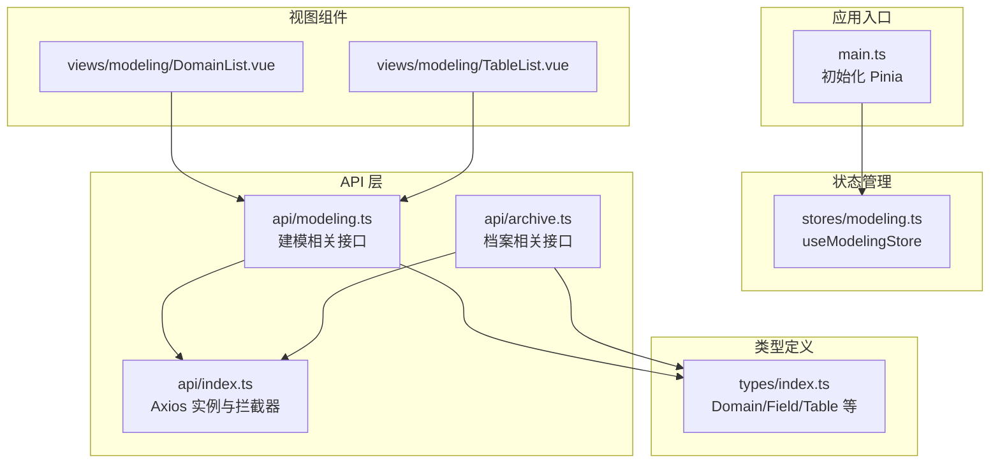
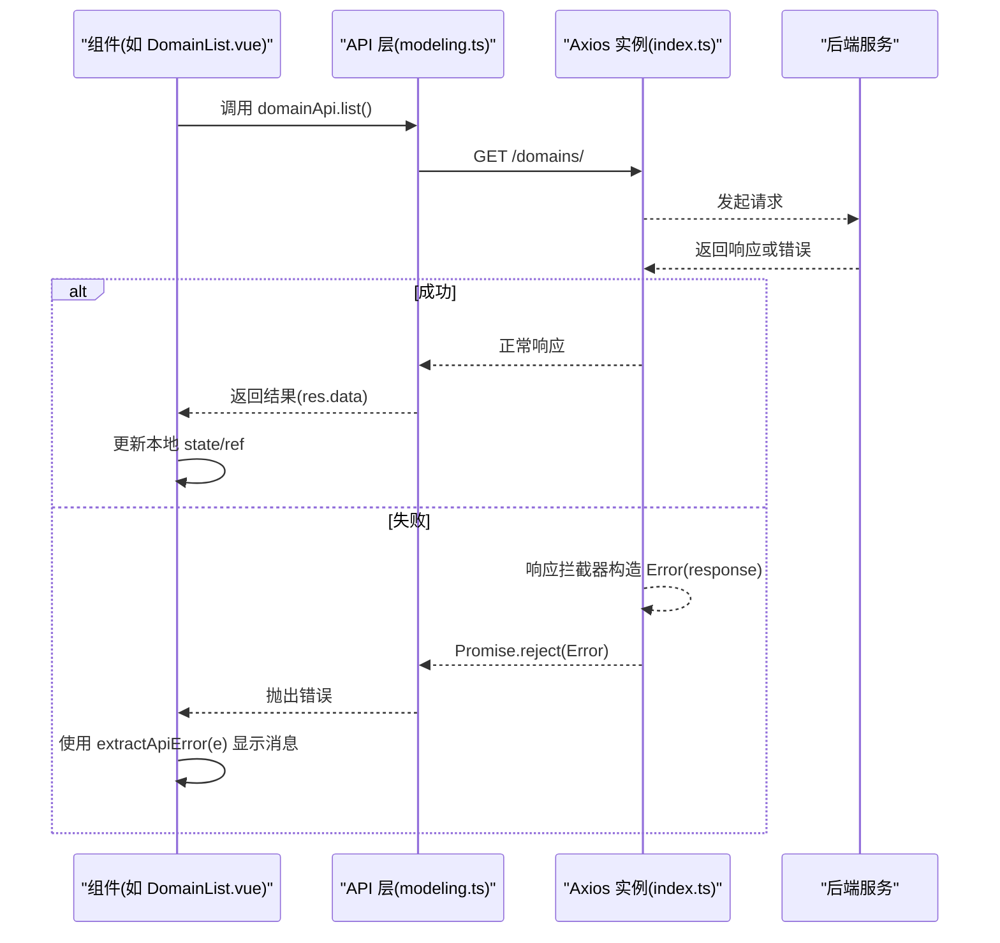
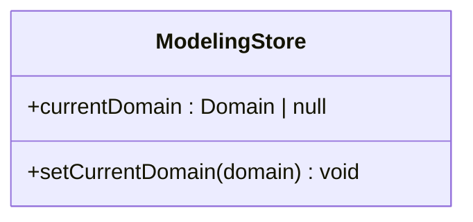
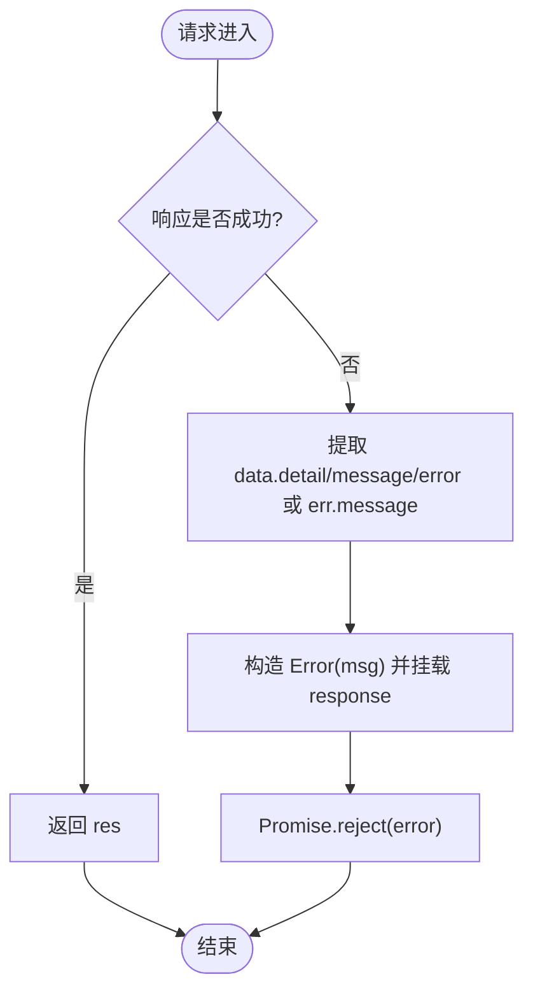
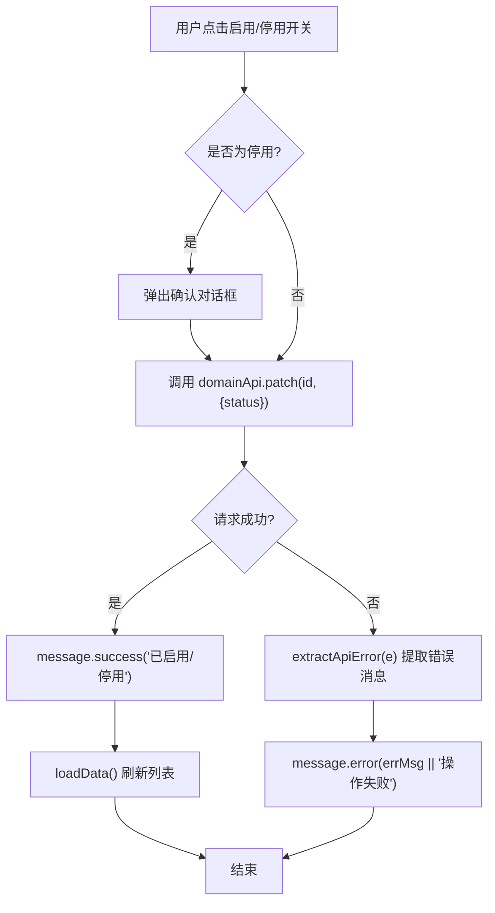
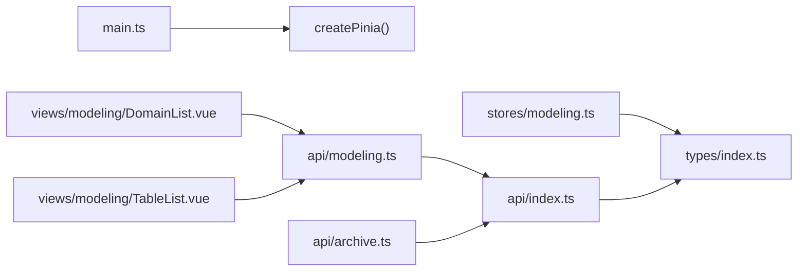

# 状态管理

<cite>
**本文引用的文件**   
- [main.ts](file://frontend/src/main.ts)
- [modeling.ts](file://frontend/src/stores/modeling.ts)
- [index.ts](file://frontend/src/api/index.ts)
- [modeling.ts](file://frontend/src/api/modeling.ts)
- [archive.ts](file://frontend/src/api/archive.ts)
- [apiError.ts](file://frontend/src/utils/apiError.ts)
- [index.ts](file://frontend/src/types/index.ts)
- [DomainList.vue](file://frontend/src/views/modeling/DomainList.vue)
- [TableList.vue](file://frontend/src/views/modeling/TableList.vue)
</cite>

## 目录
1. [简介](#简介)
2. [项目结构](#项目结构)
3. [核心组件](#核心组件)
4. [架构总览](#架构总览)
5. [详细组件分析](#详细组件分析)
6. [依赖关系分析](#依赖关系分析)
7. [性能考量](#性能考量)
8. [故障排查指南](#故障排查指南)
9. [结论](#结论)
10. [附录](#附录)

## 简介
本文件为 MetaData002 前端应用的状态管理系统文档，聚焦 Pinia 状态管理的架构设计与 store 组织方式，API 层封装设计（请求拦截器、错误处理与响应数据转换），以及状态与组件的绑定方式（computed、watch、方法调用）。同时给出状态更新流程图、最佳实践、异步操作处理方式与错误边界处理策略，并说明当前持久化与缓存策略的实现现状与建议。

## 项目结构
前端采用 Vue 3 + TypeScript + Vite + Pinia + Axios 的技术栈。状态管理通过 Pinia 提供，目前仅有一个 modeling store；API 层基于 Axios 统一封装，包含响应拦截器的错误处理；类型定义集中在 types 模块；业务页面以组件形式组织，直接调用 API 层进行数据获取与更新。

图表来源 
- [main.ts:1-14](file://frontend/src/main.ts#L1-L14)
- [modeling.ts:1-14](file://frontend/src/stores/modeling.ts#L1-L14)
- [index.ts:1-22](file://frontend/src/api/index.ts#L1-L22)
- [modeling.ts:1-481](file://frontend/src/api/modeling.ts#L1-L481)
- [archive.ts:1-139](file://frontend/src/api/archive.ts#L1-L139)
- [index.ts:1-388](file://frontend/src/types/index.ts#L1-L388)

章节来源
- [main.ts:1-14](file://frontend/src/main.ts#L1-L14)
- [package.json:1-29](file://frontend/package.json#L1-L29)

## 核心组件
- Pinia Store：当前仅实现 modeling store，用于维护建模域上下文（如 currentDomain）及简单操作方法（setCurrentDomain）。
- API 封装：统一的 axios 实例，设置 baseURL、超时与默认头；响应拦截器统一提取后端错误消息，保留原始 response 供上层读取结构化错误信息。
- 类型系统：集中定义 Domain、Table、Field、Archive、ChangeBatch 等数据结构，确保前后端契约一致。
- 组件使用：页面组件直接调用 API 层函数完成数据加载与更新，并通过本地 ref/computed/watch 驱动 UI。

章节来源
- [modeling.ts:1-14](file://frontend/src/stores/modeling.ts#L1-L14)
- [index.ts:1-22](file://frontend/src/api/index.ts#L1-L22)
- [index.ts:1-388](file://frontend/src/types/index.ts#L1-L388)

## 架构总览
整体数据流遵循“组件 → API 层 → Axios 实例 → 后端”的单向流程；错误在 Axios 响应拦截器中统一捕获并转换为带结构化信息的 Error；组件侧通过 try/catch 与工具函数 extractApiError 展示用户友好的错误提示。Pinia store 当前承担轻量级全局上下文职责，尚未承载复杂业务状态。

图表来源 
- [modeling.ts:1-481](file://frontend/src/api/modeling.ts#L1-L481)
- [index.ts:1-22](file://frontend/src/api/index.ts#L1-L22)
- [apiError.ts:1-29](file://frontend/src/utils/apiError.ts#L1-L29)
- [DomainList.vue:1-338](file://frontend/src/views/modeling/DomainList.vue#L1-L338)

## 详细组件分析

### Pinia Store：modeling
- 目标：维护建模域上下文（currentDomain）并提供设置方法（setCurrentDomain）。
- 数据结构：ref<Domain | null> 存储当前选中的域对象。
- 方法：setCurrentDomain(domain) 更新 currentDomain。
- 复杂度：O(1) 读写；无副作用。
- 扩展建议：可结合路由参数或用户会话自动恢复 currentDomain；如需跨页共享更多建模状态（如表/字段缓存），可在该 store 中扩展。

图表来源 
- [modeling.ts:1-14](file://frontend/src/stores/modeling.ts#L1-L14)

章节来源
- [modeling.ts:1-14](file://frontend/src/stores/modeling.ts#L1-L14)

### API 层封装：axios 实例与拦截器
- 配置：baseURL=/api，timeout=30s，Content-Type=application/json。
- 响应拦截器：成功原样返回；失败时从 response.data 中提取 detail/message/error 或通用 message，构造 Error 并将原始 response 挂载到 error.response，便于上层读取结构化错误（如 sync_stats）。
- 上传场景：multipart/form-data 的请求在对应 API 方法中显式设置 headers。

图表来源 
- [index.ts:1-22](file://frontend/src/api/index.ts#L1-L22)

章节来源
- [index.ts:1-22](file://frontend/src/api/index.ts#L1-L22)

### API 层封装：建模接口（modeling.ts）
- 覆盖范围：数据源、域、表、字段、标准字段、计算字段、AI 配置、字段分组、枚举选项、字段映射等。
- 分页策略：对管理类列表默认拉全量（page_size=100000），避免被默认每页 20 条截断。
- 文件上传：Excel 预览/导入使用 FormData 并设置 multipart/form-data。
- 类型安全：所有接口均带有泛型类型约束，保证返回值与 types/index.ts 保持一致。

章节来源
- [modeling.ts:1-481](file://frontend/src/api/modeling.ts#L1-L481)
- [index.ts:1-388](file://frontend/src/types/index.ts#L1-L388)

### API 层封装：档案接口（archive.ts）
- 覆盖范围：档案配置、记录、版本、同步日志、变更日志、一致性检查规则、数据服务等。
- Blob 下载：downloadBlob 工具函数根据 Content-Disposition 解析文件名并触发浏览器下载。
- 错误处理：沿用全局拦截器，上层通过 extractApiError 提取可读错误。

章节来源
- [archive.ts:1-139](file://frontend/src/api/archive.ts#L1-L139)
- [apiError.ts:1-29](file://frontend/src/utils/apiError.ts#L1-L29)

### 组件与状态绑定：computed、watch、方法调用
- computed：用于派生 UI 列、过滤后的表列表、滚动高度等，提升渲染性能与代码可读性。
- watch：监听 Tab 切换或关键状态变化，按需触发数据加载（如切换到“数据预览”Tab 再加载预览数据）。
- 方法调用：组件内直接调用 API 层函数，结合 try/catch 与 extractApiError 进行错误处理与用户提示。
- 示例模式：
  - 列表加载：onMounted 触发 loadData，设置 loading 状态，成功后更新本地数组。
  - 表单提交：校验后调用 create/update，成功后关闭弹窗并刷新列表。
  - 开关操作：乐观更新本地状态，失败回滚并提示。

章节来源
- [DomainList.vue:1-338](file://frontend/src/views/modeling/DomainList.vue#L1-L338)
- [TableList.vue:1-800](file://frontend/src/views/modeling/TableList.vue#L1-L800)

### 状态更新流程图（以“启用/停用域”为例）

图表来源 
- [DomainList.vue:1-338](file://frontend/src/views/modeling/DomainList.vue#L1-L338)
- [apiError.ts:1-29](file://frontend/src/utils/apiError.ts#L1-L29)

## 依赖关系分析
- main.ts 初始化 Pinia 并注册到 Vue 应用。
- stores/modeling.ts 导出 useModelingStore，供组件按需引入。
- api/index.ts 提供 axios 实例与拦截器，被 api/modeling.ts、api/archive.ts 引用。
- api/modeling.ts、api/archive.ts 依赖 types/index.ts 的类型定义。
- 组件通过 import 直接调用 API 层函数，不直接依赖 axios。

图表来源 
- [main.ts:1-14](file://frontend/src/main.ts#L1-L14)
- [modeling.ts:1-14](file://frontend/src/stores/modeling.ts#L1-L14)
- [index.ts:1-22](file://frontend/src/api/index.ts#L1-L22)
- [modeling.ts:1-481](file://frontend/src/api/modeling.ts#L1-L481)
- [archive.ts:1-139](file://frontend/src/api/archive.ts#L1-L139)
- [index.ts:1-388](file://frontend/src/types/index.ts#L1-L388)

章节来源
- [main.ts:1-14](file://frontend/src/main.ts#L1-L14)
- [modeling.ts:1-14](file://frontend/src/stores/modeling.ts#L1-L14)
- [index.ts:1-22](file://frontend/src/api/index.ts#L1-L22)
- [modeling.ts:1-481](file://frontend/src/api/modeling.ts#L1-L481)
- [archive.ts:1-139](file://frontend/src/api/archive.ts#L1-L139)
- [index.ts:1-388](file://frontend/src/types/index.ts#L1-L388)

## 性能考量
- 列表全量加载：管理类列表默认 page_size=100000，适合小数据集；若数据量增长，应改为服务端分页并在组件中使用虚拟滚动。
- 懒加载：仅在需要时加载数据（如预览 Tab 切换后再请求），减少不必要的网络开销。
- 计算属性：使用 computed 派生 UI 所需数据，避免重复计算与频繁 re-render。
- 防抖/节流：对搜索输入、频繁开关操作可考虑加防抖/节流，降低请求频率。
- 内存管理：大列表渲染注意 rowKey 与 key 的唯一性，避免不必要的重排。

[本节为通用指导，无需引用具体文件]

## 故障排查指南
- 常见错误来源：
  - 后端返回非 2xx：由 Axios 响应拦截器统一捕获，构造 Error 并挂载 response。
  - 字段校验失败：DRF 可能返回 non_field_errors 或字段级错误数组，extractApiError 会拼接为可读字符串。
  - 网络异常：err.message 作为兜底消息。
- 定位步骤：
  - 打开浏览器开发者工具 Network，查看请求 URL、参数与响应体。
  - 在控制台打印 e.response.data，确认后端返回的错误结构。
  - 使用 extractApiError(e) 获取用户友好消息，必要时补充中文兜底文案。
- 常见问题修复：
  - 401/403：检查鉴权逻辑与 token 有效性。
  - 400：检查请求参数是否符合后端校验规则。
  - 500：联系后端排查服务端异常。

章节来源
- [index.ts:1-22](file://frontend/src/api/index.ts#L1-L22)
- [apiError.ts:1-29](file://frontend/src/utils/apiError.ts#L1-L29)

## 结论
当前状态管理采用最小化的 Pinia store，主要职责为建模域上下文管理；API 层通过 Axios 拦截器实现了统一的错误处理与结构化错误透传；组件侧通过 computed/watch 与方法调用完成状态绑定与交互。建议在后续迭代中逐步将更多跨组件共享的业务状态迁移至 Pinia，并结合路由与本地存储实现状态持久化与缓存优化。

[本节为总结，无需引用具体文件]

## 附录

### 状态与组件绑定的最佳实践
- 使用 ref 管理组件级状态，使用 computed 派生 UI 数据，使用 watch 监听关键状态变化触发副作用。
- 对长列表使用虚拟滚动与分页，避免一次性渲染大量 DOM。
- 对频繁触发的操作（搜索、筛选）使用防抖/节流。
- 对写操作采用乐观更新，失败时回滚并提示用户。

[本节为通用指导，无需引用具体文件]

### 异步操作与错误边界处理
- 所有异步调用包裹 try/catch，使用 extractApiError 提取错误消息。
- 在网络不稳定环境下，增加重试机制与超时控制。
- 对于长时间任务（如批量导入），提供进度反馈与取消能力。

[本节为通用指导，无需引用具体文件]

### 状态持久化与缓存策略（现状与建议）
- 现状：当前未实现 Pinia 状态的持久化与缓存；部分数据在组件内通过 ref 缓存（如 fieldsMap）。
- 建议：
  - 使用 pinia-plugin-persistedstate 将必要状态（如 currentDomain、用户信息）持久化到 localStorage/sessionStorage。
  - 对只读且变化不频繁的数据（如数据源列表、枚举选项）进行内存缓存，并设置过期时间。
  - 对大列表数据采用分页+增量更新，避免全量刷新。

[本节为通用指导，无需引用具体文件]