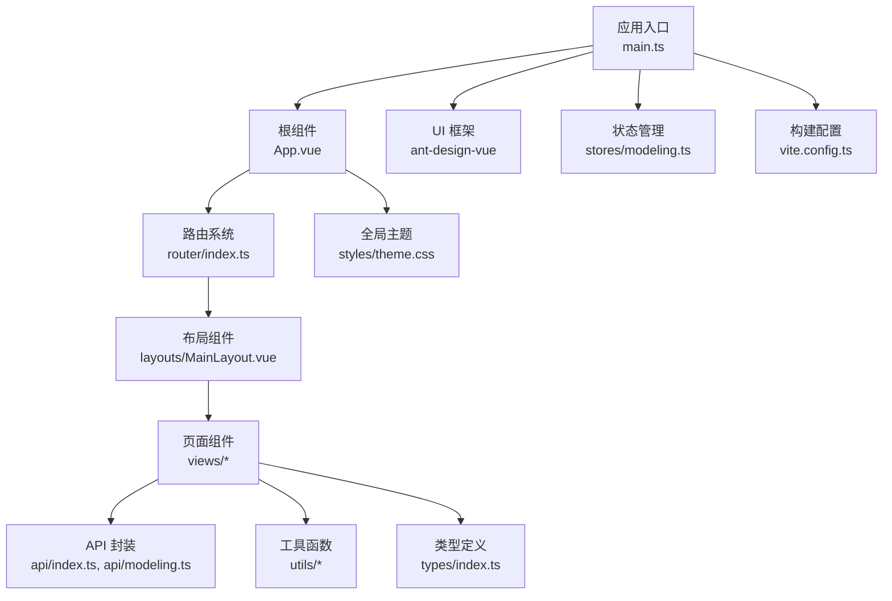
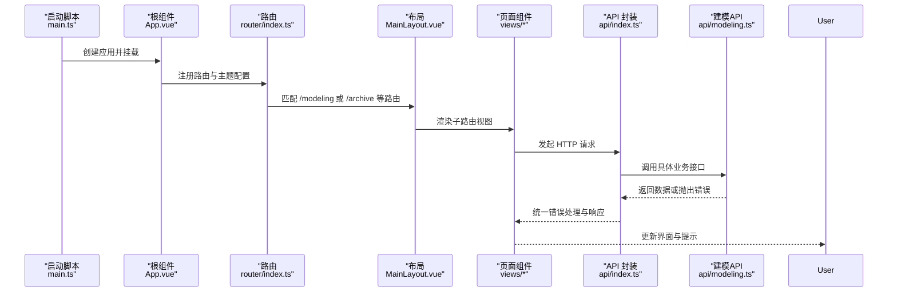
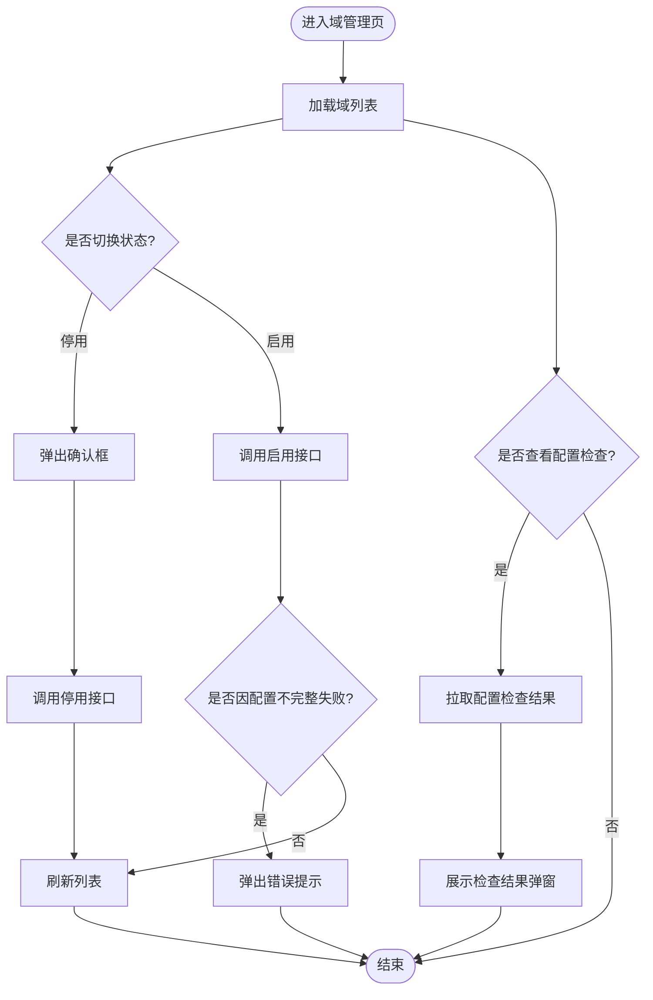
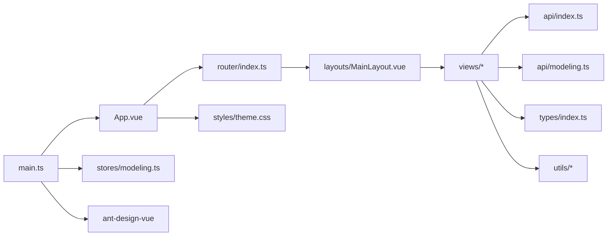

# 组件架构设计

<cite>
**本文引用的文件**   
- [main.ts](file://frontend/src/main.ts)
- [App.vue](file://frontend/src/App.vue)
- [index.ts（路由）](file://frontend/src/router/index.ts)
- [MainLayout.vue](file://frontend/src/layouts/MainLayout.vue)
- [package.json](file://frontend/package.json)
- [theme.css](file://frontend/src/styles/theme.css)
- [modeling.ts（Pinia Store）](file://frontend/src/stores/modeling.ts)
- [vite.config.ts](file://frontend/vite.config.ts)
- [DomainList.vue](file://frontend/src/views/modeling/DomainList.vue)
- [index.ts（API 基础封装）](file://frontend/src/api/index.ts)
- [modeling.ts（建模 API）](file://frontend/src/api/modeling.ts)
- [index.ts（类型定义）](file://frontend/src/types/index.ts)
- [apiError.ts](file://frontend/src/utils/apiError.ts)
- [date.ts](file://frontend/src/utils/date.ts)
- [formula.ts](file://frontend/src/utils/formula.ts)
- [ArchiveList.vue](file://frontend/src/views/archive/ArchiveList.vue)
</cite>

## 目录
1. [简介](#简介)
2. [项目结构](#项目结构)
3. [核心组件](#核心组件)
4. [架构总览](#架构总览)
5. [详细组件分析](#详细组件分析)
6. [依赖关系分析](#依赖关系分析)
7. [性能考量](#性能考量)
8. [故障排查指南](#故障排查指南)
9. [结论](#结论)
10. [附录](#附录)

## 简介
本文件面向 MetaData002 前端应用，系统化阐述 Vue 3 应用的组件架构与工程化配置。内容覆盖：
- 应用入口、根组件与主题配置
- Ant Design Vue 的全局集成与主题定制
- 路由系统与页面组织、导航与面包屑联动
- 布局组件、页面组件与通用组件的职责划分
- 状态管理（Pinia）与 API 层封装
- 开发规范与最佳实践建议

## 项目结构
前端采用 Vite + Vue 3 + TypeScript 的工程化方案，按功能域组织视图与 API，使用 Pinia 进行状态管理，Ant Design Vue 提供 UI 能力。

图表来源
- [main.ts:1-14](file://frontend/src/main.ts#L1-L14)
- [App.vue:1-15](file://frontend/src/App.vue#L1-L15)
- [index.ts（路由）:1-45](file://frontend/src/router/index.ts#L1-L45)
- [MainLayout.vue:1-162](file://frontend/src/layouts/MainLayout.vue#L1-L162)
- [package.json:1-29](file://frontend/package.json#L1-L29)
- [theme.css:1-13](file://frontend/src/styles/theme.css#L1-L13)
- [modeling.ts（Pinia Store）:1-14](file://frontend/src/stores/modeling.ts#L1-L14)
- [vite.config.ts:1-22](file://frontend/vite.config.ts#L1-L22)
- [index.ts（API 基础封装）:1-22](file://frontend/src/api/index.ts#L1-L22)
- [modeling.ts（建模 API）:1-481](file://frontend/src/api/modeling.ts#L1-L481)
- [index.ts（类型定义）:1-388](file://frontend/src/types/index.ts#L1-L388)
- [apiError.ts:1-29](file://frontend/src/utils/apiError.ts#L1-L29)
- [date.ts:1-27](file://frontend/src/utils/date.ts#L1-L27)
- [formula.ts:1-95](file://frontend/src/utils/formula.ts#L1-L95)

章节来源
- [main.ts:1-14](file://frontend/src/main.ts#L1-L14)
- [package.json:1-29](file://frontend/package.json#L1-L29)
- [vite.config.ts:1-22](file://frontend/vite.config.ts#L1-L22)

## 核心组件
- 应用入口 main.ts：创建 Vue 应用实例，注册 Pinia、Router、Ant Design Vue，挂载到 DOM，并引入全局样式。
- 根组件 App.vue：通过 a-config-provider 注入 Ant Design 主题 token，包裹 router-view。
- 路由 index.ts：定义历史模式、首页重定向与模块级路由分组（建模、档案、设置），子路由按需加载，meta 携带标题用于面包屑。
- 布局 MainLayout.vue：侧边栏菜单、头部用户信息、面包屑与内容区；菜单高亮与路由同步，点击跳转。
- API 层 index.ts：基于 axios 的拦截器统一处理错误消息，保留原始 response 供上层读取结构化错误。
- 建模 API modeling.ts：按领域划分接口（数据源、域、表、字段、标准字段、计算字段、AI 配置等），统一分页参数策略。
- 类型定义 types/index.ts：集中定义前后端交互的数据模型与枚举，保证强类型约束。
- 工具 utils：日期格式化、表达式格式化、API 错误提取等。
- 状态 stores/modeling.ts：Pinia store 维护当前域上下文。

章节来源
- [main.ts:1-14](file://frontend/src/main.ts#L1-L14)
- [App.vue:1-15](file://frontend/src/App.vue#L1-L15)
- [index.ts（路由）:1-45](file://frontend/src/router/index.ts#L1-L45)
- [MainLayout.vue:1-162](file://frontend/src/layouts/MainLayout.vue#L1-L162)
- [index.ts（API 基础封装）:1-22](file://frontend/src/api/index.ts#L1-L22)
- [modeling.ts（建模 API）:1-481](file://frontend/src/api/modeling.ts#L1-L481)
- [index.ts（类型定义）:1-388](file://frontend/src/types/index.ts#L1-L388)
- [apiError.ts:1-29](file://frontend/src/utils/apiError.ts#L1-L29)
- [date.ts:1-27](file://frontend/src/utils/date.ts#L1-L27)
- [formula.ts:1-95](file://frontend/src/utils/formula.ts#L1-L95)
- [modeling.ts（Pinia Store）:1-14](file://frontend/src/stores/modeling.ts#L1-L14)

## 架构总览
下图展示从入口到页面渲染的关键调用链与依赖关系。

图表来源
- [main.ts:1-14](file://frontend/src/main.ts#L1-L14)
- [App.vue:1-15](file://frontend/src/App.vue#L1-L15)
- [index.ts（路由）:1-45](file://frontend/src/router/index.ts#L1-L45)
- [MainLayout.vue:1-162](file://frontend/src/layouts/MainLayout.vue#L1-L162)
- [index.ts（API 基础封装）:1-22](file://frontend/src/api/index.ts#L1-L22)
- [modeling.ts（建模 API）:1-481](file://frontend/src/api/modeling.ts#L1-L481)

## 详细组件分析

### 应用入口与根组件
- 入口 main.ts：初始化 Vue 应用，安装 Pinia、Router、Antd，并引入主题样式。
- 根组件 App.vue：通过 a-config-provider 注入主题 token（主色、圆角等），所有页面共享该主题。

章节来源
- [main.ts:1-14](file://frontend/src/main.ts#L1-L14)
- [App.vue:1-15](file://frontend/src/App.vue#L1-L15)
- [theme.css:1-13](file://frontend/src/styles/theme.css#L1-L13)

### 路由系统与页面组织
- 路由 index.ts：
  - 使用 createWebHistory('/'), 根路径重定向至 /modeling/domains
  - 以模块维度划分路由组（/modeling、/archive、/settings），子路由懒加载
  - meta.title 用于面包屑显示
- 布局 MainLayout.vue：
  - 侧边栏菜单与路由 key 映射，watchEffect 监听 route.path 实现高亮同步
  - 面包屑由首页 + route.meta.title 动态生成
  - 点击菜单项通过 router.push(key) 导航

章节来源
- [index.ts（路由）:1-45](file://frontend/src/router/index.ts#L1-L45)
- [MainLayout.vue:1-162](file://frontend/src/layouts/MainLayout.vue#L1-L162)

### 布局组件职责
- MainLayout.vue 负责：
  - 侧边栏折叠状态、菜单项与图标
  - 头部用户信息与面包屑
  - 内容区域承载 router-view
  - 菜单高亮与路由同步逻辑

章节来源
- [MainLayout.vue:1-162](file://frontend/src/layouts/MainLayout.vue#L1-L162)

### 页面组件示例：域管理
- DomainList.vue：
  - 列表展示、新建/编辑弹窗、删除确认
  - 启用/停用开关带二次确认与后端校验提示
  - 配置检查详情弹窗，异步拉取并展示检查结果
  - 操作列跳转到表管理、关系管理、字段管理等子页

图表来源
- [DomainList.vue:1-338](file://frontend/src/views/modeling/DomainList.vue#L1-L338)

章节来源
- [DomainList.vue:1-338](file://frontend/src/views/modeling/DomainList.vue#L1-L338)

### 页面组件示例：档案管理
- ArchiveList.vue：
  - 列表分页展示、新建档案表单
  - 刷新预检弹窗，展示 schema 变更与数据变化样本
  - 操作包括编辑、一致性检查、从数据源同步、删除

章节来源
- [ArchiveList.vue:1-200](file://frontend/src/views/archive/ArchiveList.vue#L1-L200)

### API 层与错误处理
- api/index.ts：
  - 统一 baseURL、超时与 Content-Type
  - 响应拦截器将后端错误消息标准化为 Error，并保留 response 以便上层读取结构化错误
- modeling.ts：
  - 按领域暴露 API 方法，统一分页参数策略（全量拉取场景）
  - 包含数据源、域、表、字段、标准字段、计算字段、AI 配置等接口
- apiError.ts：
  - 从 axios 错误对象中提取可读的后端错误消息，兼容 DRF 多种错误格式

章节来源
- [index.ts（API 基础封装）:1-22](file://frontend/src/api/index.ts#L1-L22)
- [modeling.ts（建模 API）:1-481](file://frontend/src/api/modeling.ts#L1-L481)
- [apiError.ts:1-29](file://frontend/src/utils/apiError.ts#L1-L29)

### 类型定义与工具函数
- types/index.ts：集中定义 DataSource、Domain、Table、Field、Archive、Version、ChangeLog 等类型，确保前后端契约一致。
- utils/date.ts：时间格式化函数，支持 ISO/Date 输入。
- utils/formula.ts：表达式格式化（函数名大写、括号补全、长表达式换行缩进），供公式编辑器与试算展示复用。

章节来源
- [index.ts（类型定义）:1-388](file://frontend/src/types/index.ts#L1-L388)
- [date.ts:1-27](file://frontend/src/utils/date.ts#L1-L27)
- [formula.ts:1-95](file://frontend/src/utils/formula.ts#L1-L95)

### 状态管理（Pinia）
- stores/modeling.ts：
  - 定义 modeling store，维护 currentDomain 上下文
  - 提供 setCurrentDomain 方法更新当前域

章节来源
- [modeling.ts（Pinia Store）:1-14](file://frontend/src/stores/modeling.ts#L1-L14)

### 构建与代理配置
- vite.config.ts：
  - 配置 @ 别名指向 src
  - 开发服务器端口与 /api 代理到后端服务

章节来源
- [vite.config.ts:1-22](file://frontend/vite.config.ts#L1-L22)

## 依赖关系分析
下图展示关键模块间的依赖关系与调用方向。

图表来源
- [main.ts:1-14](file://frontend/src/main.ts#L1-L14)
- [App.vue:1-15](file://frontend/src/App.vue#L1-L15)
- [index.ts（路由）:1-45](file://frontend/src/router/index.ts#L1-L45)
- [MainLayout.vue:1-162](file://frontend/src/layouts/MainLayout.vue#L1-L162)
- [index.ts（API 基础封装）:1-22](file://frontend/src/api/index.ts#L1-L22)
- [modeling.ts（建模 API）:1-481](file://frontend/src/api/modeling.ts#L1-L481)
- [index.ts（类型定义）:1-388](file://frontend/src/types/index.ts#L1-L388)
- [theme.css:1-13](file://frontend/src/styles/theme.css#L1-L13)
- [modeling.ts（Pinia Store）:1-14](file://frontend/src/stores/modeling.ts#L1-L14)

章节来源
- [package.json:1-29](file://frontend/package.json#L1-L29)
- [vite.config.ts:1-22](file://frontend/vite.config.ts#L1-L22)

## 性能考量
- 路由懒加载：子路由通过 () => import(...) 按需加载，减少首屏体积。
- 列表全量拉取策略：对不需要分页的列表使用大 page_size 一次性获取，避免多次请求。
- 异步非阻塞：如域配置检查在列表加载后并行拉取，不阻塞主流程。
- 错误拦截与提示：统一错误处理减少重复代码，提升可维护性与用户体验。
- 表达式格式化优化：通过占位符保护与宽度前缀计算，避免误改字段引用与字符串字面量。

[本节为通用指导，不涉及具体文件分析]

## 故障排查指南
- API 错误定位：
  - 使用 extractApiError 提取后端错误消息，结合 console 输出定位问题
  - 注意拦截器已保留 response，可在调用方读取结构化错误（如 sync_stats）
- 路由跳转异常：
  - 检查路由 meta.title 是否正确设置，确保面包屑显示正常
  - 确认菜单 key 与路由 path 对应关系，避免高亮错乱
- 主题未生效：
  - 确认 App.vue 中 a-config-provider 的 theme.token 配置正确
  - 检查 theme.css 变量是否被覆盖
- 列表数据为空：
  - 检查 API 分页参数与后端返回结构是否匹配
  - 关注 loading 状态与 finally 分支是否正确重置

章节来源
- [apiError.ts:1-29](file://frontend/src/utils/apiError.ts#L1-L29)
- [index.ts（API 基础封装）:1-22](file://frontend/src/api/index.ts#L1-L22)
- [index.ts（路由）:1-45](file://frontend/src/router/index.ts#L1-L45)
- [App.vue:1-15](file://frontend/src/App.vue#L1-L15)
- [theme.css:1-13](file://frontend/src/styles/theme.css#L1-L13)

## 结论
MetaData002 前端采用清晰的模块化分层与职责分离：入口与根组件负责应用装配与主题注入，路由与布局承担导航与页面组织，页面组件聚焦业务交互，API 层统一网络与错误处理，类型定义保障契约一致性。整体架构具备良好的扩展性与可维护性，便于后续功能迭代与团队协作。

[本节为总结性内容，不涉及具体文件分析]

## 附录
- 组件分层建议：
  - 布局组件：仅负责壳结构与导航，不包含复杂业务逻辑
  - 页面组件：封装业务状态与交互，调用 API 与工具函数
  - 通用组件：可复用的 UI 片段，保持单一职责
- 开发规范建议：
  - 使用 TypeScript 强类型约束，避免 any 滥用
  - API 调用统一走封装层，错误处理集中在拦截器与工具函数
  - 路由 meta.title 必须填写，保证面包屑一致性
  - 主题变量集中管理，避免硬编码颜色值
- 国际化支持建议：
  - 当前未启用 i18n，建议在需要时引入 vue-i18n，并通过语言包统一管理文案

[本节为概念性内容，不涉及具体文件分析]