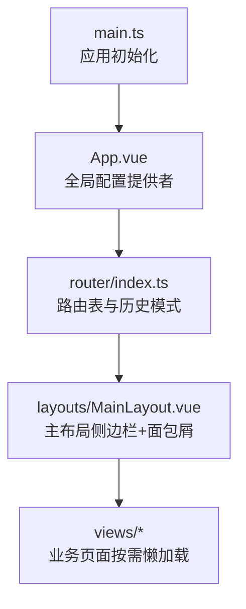
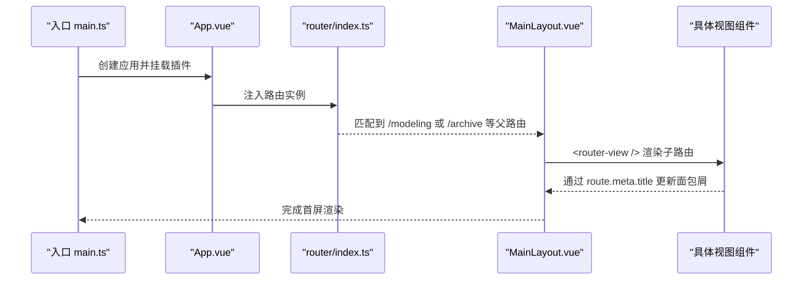
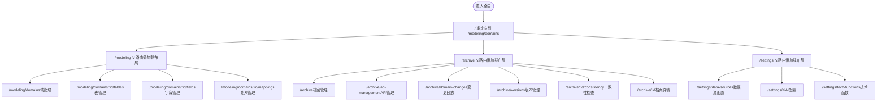

# 路由与导航

<cite>
**本文引用的文件**   
- [frontend/src/router/index.ts](file://frontend/src/router/index.ts)
- [frontend/src/layouts/MainLayout.vue](file://frontend/src/layouts/MainLayout.vue)
- [frontend/src/App.vue](file://frontend/src/App.vue)
- [frontend/src/main.ts](file://frontend/src/main.ts)
- [frontend/src/views/modeling/DomainList.vue](file://frontend/src/views/modeling/DomainList.vue)
- [frontend/src/views/modeling/TableList.vue](file://frontend/src/views/modeling/TableList.vue)
- [frontend/src/views/archive/ArchiveDetail.vue](file://frontend/src/views/archive/ArchiveDetail.vue)
</cite>

## 目录
1. [简介](#简介)
2. [项目结构](#项目结构)
3. [核心组件](#核心组件)
4. [架构总览](#架构总览)
5. [详细组件分析](#详细组件分析)
6. [依赖关系分析](#依赖关系分析)
7. [性能考虑](#性能考虑)
8. [故障排查指南](#故障排查指南)
9. [结论](#结论)
10. [附录](#附录)

## 简介
本文件为 MetaData002 前端应用的路由系统与导航体系提供完整文档。内容覆盖 Vue Router 的配置与路由表结构、动态路由与嵌套路由、路由参数传递、主布局组件（侧边栏菜单、面包屑导航）的实现与扩展方式，以及路由元信息与页面标题管理。同时给出路由懒加载与性能优化建议，并说明如何扩展导航组件与未来可落地的路由守卫方案。

## 项目结构
当前前端采用 Vue 3 + Vue Router 4 的单页应用结构。路由定义集中在 router/index.ts，主布局在 layouts/MainLayout.vue，视图按功能模块划分在 views 目录下。应用入口 main.ts 挂载 Pinia、Ant Design Vue 与 Router。App.vue 通过 ConfigProvider 统一主题。



图表来源 
- [frontend/src/main.ts:1-14](file://frontend/src/main.ts#L1-L14)
- [frontend/src/App.vue:1-15](file://frontend/src/App.vue#L1-L15)
- [frontend/src/router/index.ts:1-45](file://frontend/src/router/index.ts#L1-L45)
- [frontend/src/layouts/MainLayout.vue:1-162](file://frontend/src/layouts/MainLayout.vue#L1-L162)

章节来源
- [frontend/src/main.ts:1-14](file://frontend/src/main.ts#L1-L14)
- [frontend/src/App.vue:1-15](file://frontend/src/App.vue#L1-L15)
- [frontend/src/router/index.ts:1-45](file://frontend/src/router/index.ts#L1-L45)

## 核心组件
- 路由配置：使用 createWebHistory 与 createRouter 构建路由实例，集中声明根重定向与三大模块路由（建模、档案、设置），所有子路由均通过懒加载引入。
- 主布局：包含侧边栏菜单、面包屑导航与用户信息区；菜单高亮基于当前路由路径匹配；面包屑根据 route.meta.title 动态生成。
- 视图组件：各业务页面以懒加载方式注册到对应路由，支持动态路由参数（如 :id）。

章节来源
- [frontend/src/router/index.ts:1-45](file://frontend/src/router/index.ts#L1-L45)
- [frontend/src/layouts/MainLayout.vue:1-162](file://frontend/src/layouts/MainLayout.vue#L1-L162)

## 架构总览
下图展示从应用启动到页面渲染的调用链，以及路由与布局、视图之间的交互关系。



图表来源 
- [frontend/src/main.ts:1-14](file://frontend/src/main.ts#L1-L14)
- [frontend/src/App.vue:1-15](file://frontend/src/App.vue#L1-L15)
- [frontend/src/router/index.ts:1-45](file://frontend/src/router/index.ts#L1-L45)
- [frontend/src/layouts/MainLayout.vue:1-162](file://frontend/src/layouts/MainLayout.vue#L1-L162)

## 详细组件分析

### 路由表结构与导航
- 根路径重定向：访问 / 时重定向至 /modeling/domains。
- 模块路由：
  - /modeling：嵌套路由包含域管理、表管理、字段管理、关系管理等。
  - /archive：嵌套路由包含档案管理、API 管理、变更日志、版本管理、一致性检查与详情。
  - /settings：嵌套路由包含数据源配置、AI 配置、技术函数。
- 动态路由：
  - /modeling/domains/:id/tables
  - /modeling/domains/:id/fields
  - /modeling/domains/:id/mappings
  - /archive/:id/consistency
  - /archive/:id
- 路由元信息：每个子路由通过 meta.title 定义页面标题，用于面包屑与后续标题管理。
- 懒加载：所有组件均以 () => import(...) 形式按需加载。



图表来源 
- [frontend/src/router/index.ts:1-45](file://frontend/src/router/index.ts#L1-L45)

章节来源
- [frontend/src/router/index.ts:1-45](file://frontend/src/router/index.ts#L1-L45)

### 主布局组件（侧边栏菜单、面包屑导航）
- 侧边栏菜单：
  - 使用 Ant Design Vue 的 a-menu 与 v-model:selectedKeys 控制选中项。
  - 菜单项通过 computed 计算生成，包含图标、标签与子菜单。
  - 高亮逻辑：监听 route.path，按最长前缀匹配选择菜单 key；当子路由无直接菜单项时回退到父级 key。
- 面包屑导航：
  - 使用 a-breadcrumb，首项为“首页”，第二项取自 route.meta.title。
- 用户信息区：
  - 显示头像与用户名（示例为管理员）。
- 路由跳转：
  - 点击菜单项通过 router.push(key) 进行程序化导航。

```mermaid
classDiagram
class MainLayout {
+collapsed : boolean
+selectedKeys : string[]
+menuItems : Array
+breadcrumbItems : Array
+onMenuClick({key})
}
class Router {
+push(path)
}
class Route {
+path : string
+meta : object
}
MainLayout --> Router : "程序化导航"
MainLayout --> Route : "读取 path/meta"
```

图表来源 
- [frontend/src/layouts/MainLayout.vue:1-162](file://frontend/src/layouts/MainLayout.vue#L1-L162)

章节来源
- [frontend/src/layouts/MainLayout.vue:1-162](file://frontend/src/layouts/MainLayout.vue#L1-L162)

### 动态路由与参数传递
- 动态段定义：
  - /modeling/domains/:id/...
  - /archive/:id/...
- 参数获取：
  - 在视图中通过 useRoute() 获取 route.params.id。
- 典型用法：
  - 表管理、字段管理、关系管理页面根据 id 加载对应域的数据。
  - 档案详情与一致性检查页面根据 id 加载对应档案数据。

章节来源
- [frontend/src/router/index.ts:1-45](file://frontend/src/router/index.ts#L1-L45)
- [frontend/src/views/modeling/TableList.vue:1-200](file://frontend/src/views/modeling/TableList.vue#L1-L200)
- [frontend/src/views/archive/ArchiveDetail.vue:1-200](file://frontend/src/views/archive/ArchiveDetail.vue#L1-L200)

### 路由元信息与页面标题管理
- 元信息：每个子路由通过 meta.title 指定页面标题。
- 面包屑：MainLayout 中根据 route.meta.title 动态生成第二项。
- 页面标题：可在路由守卫或 onMounted 钩子中根据 route.meta.title 设置 document.title（当前代码未实现，建议补充）。

章节来源
- [frontend/src/router/index.ts:1-45](file://frontend/src/router/index.ts#L1-L45)
- [frontend/src/layouts/MainLayout.vue:1-162](file://frontend/src/layouts/MainLayout.vue#L1-L162)

### 路由懒加载与性能优化
- 懒加载：所有子路由组件均采用 () => import(...) 语法，减少初始包体积。
- 建议优化：
  - 对大型第三方库按需引入。
  - 对静态资源进行压缩与 CDN 缓存。
  - 结合浏览器缓存策略与 HTTP 缓存头。
  - 对首屏关键路由预加载（如 /modeling/domains）。

章节来源
- [frontend/src/router/index.ts:1-45](file://frontend/src/router/index.ts#L1-L45)

### 导航组件的使用与自定义扩展
- 使用方式：
  - 在视图组件中通过 useRouter().push('/path') 进行跳转。
  - 在模板中使用 <a @click="router.push(...)"> 触发导航。
- 自定义扩展：
  - 新增菜单项：在 menuItems 中添加 key、label、icon 与 children。
  - 新增路由：在 router/index.ts 中追加路由定义与 meta.title。
  - 面包屑扩展：如需多级面包屑，可在 route.meta.breadcrumbs 中定义层级数组并在 MainLayout 中解析。

章节来源
- [frontend/src/layouts/MainLayout.vue:1-162](file://frontend/src/layouts/MainLayout.vue#L1-L162)
- [frontend/src/router/index.ts:1-45](file://frontend/src/router/index.ts#L1-L45)

### 路由守卫（权限验证与登录检查）
- 现状：当前路由表未定义全局前置守卫（beforeEach）或后置守卫（afterEach）。
- 建议实现：
  - 登录检查：在进入受保护路由前校验本地令牌或会话状态，未登录则重定向至登录页。
  - 权限验证：根据 route.meta.roles 或后端返回的用户角色列表判断是否允许访问。
  - 错误处理：捕获 403/401 响应并提示用户。

[本节为概念性说明，不直接分析具体文件]

## 依赖关系分析
- 入口依赖：main.ts 引入 App.vue、router、样式与 UI 框架。
- 路由依赖：router/index.ts 仅依赖 vue-router 与视图组件（懒加载）。
- 布局依赖：MainLayout.vue 依赖 vue-router 的 useRouter/useRoute 与 Ant Design Vue 组件。
- 视图依赖：各视图组件依赖各自 API 与工具函数。


图表来源 
- [frontend/src/main.ts:1-14](file://frontend/src/main.ts#L1-L14)
- [frontend/src/App.vue:1-15](file://frontend/src/App.vue#L1-L15)
- [frontend/src/router/index.ts:1-45](file://frontend/src/router/index.ts#L1-L45)
- [frontend/src/layouts/MainLayout.vue:1-162](file://frontend/src/layouts/MainLayout.vue#L1-L162)

章节来源
- [frontend/src/main.ts:1-14](file://frontend/src/main.ts#L1-L14)
- [frontend/src/App.vue:1-15](file://frontend/src/App.vue#L1-L15)
- [frontend/src/router/index.ts:1-45](file://frontend/src/router/index.ts#L1-L45)
- [frontend/src/layouts/MainLayout.vue:1-162](file://frontend/src/layouts/MainLayout.vue#L1-L162)

## 性能考虑
- 路由层面：
  - 保持组件懒加载，避免一次性加载全部视图。
  - 对首屏关键路由进行预加载或预取。
- 布局层面：
  - 菜单高亮逻辑已使用 watchEffect 与最短匹配算法，复杂度低，无需进一步优化。
- 视图层面：
  - 大数据表格分页与虚拟滚动（已在部分页面实现）。
  - 图片与静态资源压缩与缓存。
- 网络层面：
  - 接口请求合并与去抖。
  - 错误重试与超时控制。

[本节为通用指导，不直接分析具体文件]

## 故障排查指南
- 面包屑标题为空：
  - 检查对应路由是否设置了 meta.title。
  - 确认 MainLayout 中 breadcrumbItems 的计算逻辑是否正确读取 route.meta.title。
- 菜单高亮异常：
  - 检查 allMenuKeys 是否包含当前路由路径或其父级路径。
  - 确认 selectedKeys 的赋值逻辑与 watchEffect 的依赖是否为 route.path。
- 动态路由参数无效：
  - 确认路由定义中包含对应的动态段（如 :id）。
  - 在视图中通过 useRoute().params.id 获取参数。
- 页面无法加载：
  - 检查组件懒加载路径是否正确。
  - 查看控制台是否有模块导入错误或网络错误。

章节来源
- [frontend/src/router/index.ts:1-45](file://frontend/src/router/index.ts#L1-L45)
- [frontend/src/layouts/MainLayout.vue:1-162](file://frontend/src/layouts/MainLayout.vue#L1-L162)

## 结论
当前路由系统结构清晰、职责明确，采用懒加载与元信息驱动的面包屑机制，具备良好的可扩展性与维护性。建议在后续迭代中补充路由守卫以实现权限与登录校验，并完善页面标题管理与错误处理流程，以提升用户体验与安全性。

[本节为总结性内容，不直接分析具体文件]

## 附录
- 常用导航方法：
  - 编程式导航：router.push('/path')
  - 命名路由导航：router.push({ name: 'RouteName', params: {...} })
- 元信息扩展建议：
  - route.meta.roles：用于权限控制
  - route.meta.breadcrumbs：用于多级面包屑
  - route.meta.keepAlive：用于组件缓存

[本节为概念性说明，不直接分析具体文件]