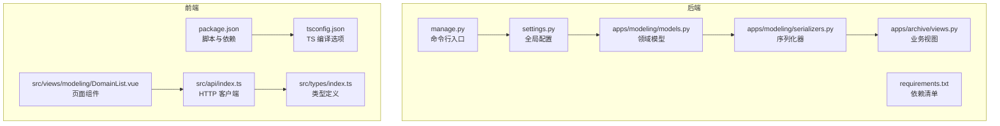
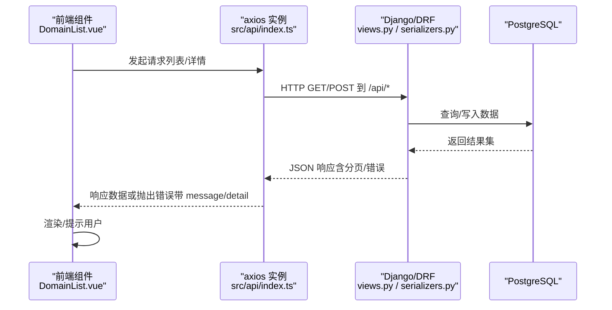
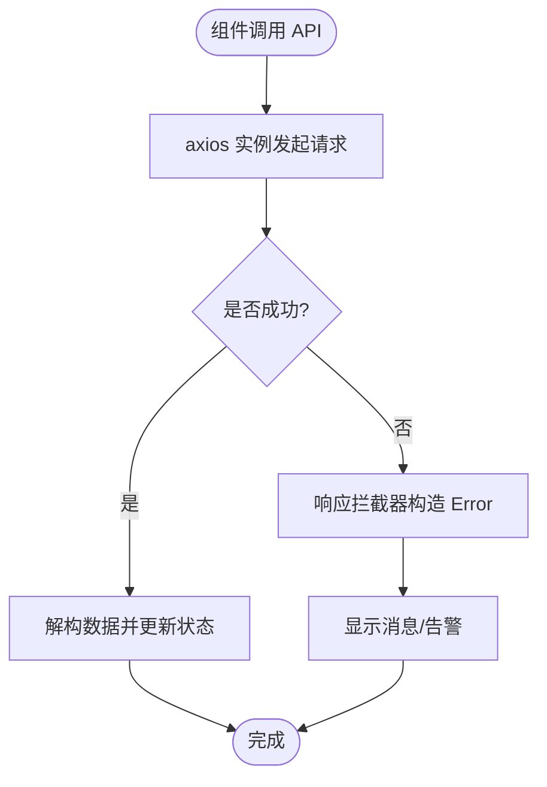
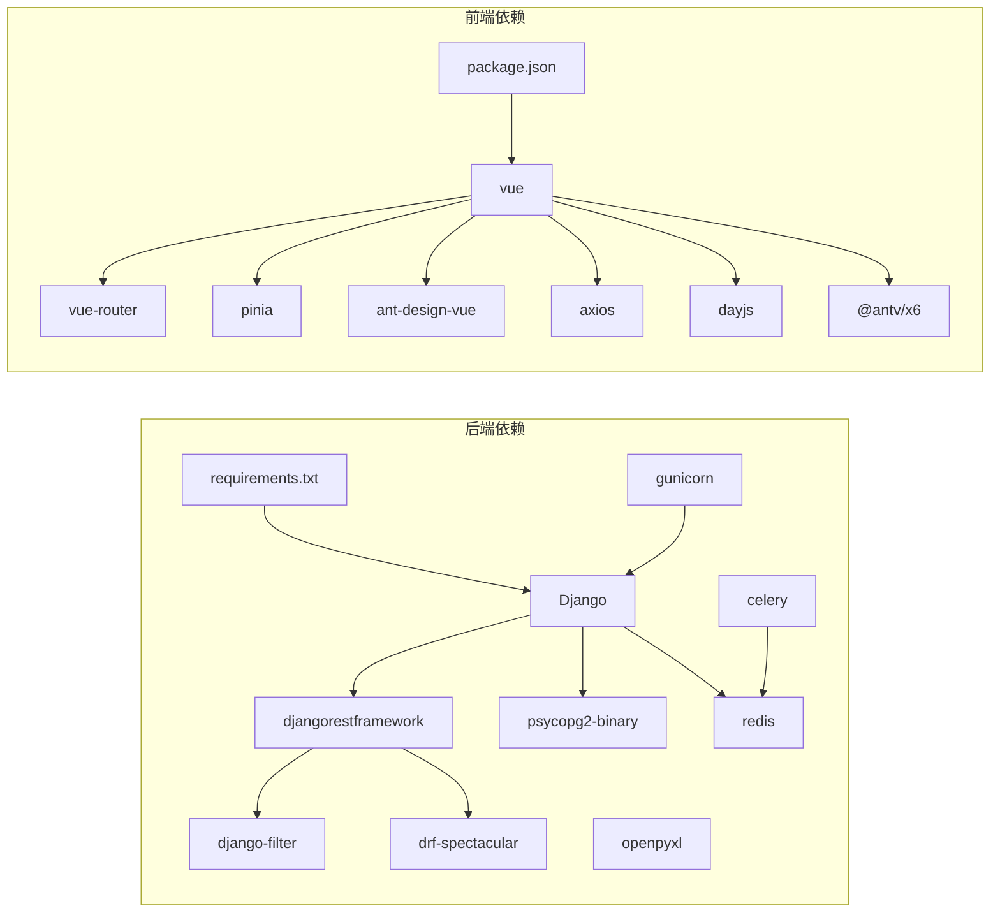

# 代码规范

<cite>
**本文引用的文件**   
- [backend/config/settings.py](file://backend/config/settings.py)
- [backend/requirements.txt](file://backend/requirements.txt)
- [backend/manage.py](file://backend/manage.py)
- [backend/apps/modeling/models.py](file://backend/apps/modeling/models.py)
- [backend/apps/modeling/serializers.py](file://backend/apps/modeling/serializers.py)
- [backend/apps/archive/views.py](file://backend/apps/archive/views.py)
- [frontend/package.json](file://frontend/package.json)
- [frontend/tsconfig.json](file://frontend/tsconfig.json)
- [frontend/src/api/index.ts](file://frontend/src/api/index.ts)
- [frontend/src/types/index.ts](file://frontend/src/types/index.ts)
- [frontend/src/views/modeling/DomainList.vue](file://frontend/src/views/modeling/DomainList.vue)
- [.gitignore](file://.gitignore)
</cite>

## 目录
1. [简介](#简介)
2. [项目结构](#项目结构)
3. [核心组件](#核心组件)
4. [架构总览](#架构总览)
5. [详细组件分析](#详细组件分析)
6. [依赖关系分析](#依赖关系分析)
7. [性能考量](#性能考量)
8. [故障排查指南](#故障排查指南)
9. [结论](#结论)
10. [附录](#附录)

## 简介
本文件为 MetaData002 项目的“代码规范与最佳实践”总纲，覆盖后端 Python/Django、前端 TypeScript/Vue 3 的编码标准、Git 工作流、API 设计与错误处理模式。目标是在保证一致性与可维护性的前提下，提升团队协作效率与交付质量。

## 项目结构
- 后端（Django + DRF）：按应用拆分 apps.modeling、apps.archive；配置集中于 config.settings；REST 接口通过 serializers 与 viewsets 组织。
- 前端（Vue 3 + Vite + TS）：src 下按功能域划分 views、components、stores、api、types、utils；统一 axios 实例与类型定义。
- 工程化：Python 依赖 requirements.txt；TypeScript 编译与模块解析由 tsconfig.json 管理；Node 脚本与构建在 package.json。

**图表来源** 
- [backend/config/settings.py:1-123](file://backend/config/settings.py#L1-L123)
- [backend/manage.py:1-21](file://backend/manage.py#L1-L21)
- [backend/apps/modeling/models.py:1-200](file://backend/apps/modeling/models.py#L1-L200)
- [backend/apps/modeling/serializers.py:1-200](file://backend/apps/modeling/serializers.py#L1-L200)
- [backend/apps/archive/views.py:1-200](file://backend/apps/archive/views.py#L1-L200)
- [backend/requirements.txt:1-11](file://backend/requirements.txt#L1-L11)
- [frontend/package.json:1-29](file://frontend/package.json#L1-L29)
- [frontend/tsconfig.json:1-25](file://frontend/tsconfig.json#L1-L25)
- [frontend/src/api/index.ts:1-22](file://frontend/src/api/index.ts#L1-L22)
- [frontend/src/types/index.ts:1-388](file://frontend/src/types/index.ts#L1-L388)
- [frontend/src/views/modeling/DomainList.vue:1-200](file://frontend/src/views/modeling/DomainList.vue#L1-L200)

**章节来源**
- [backend/config/settings.py:1-123](file://backend/config/settings.py#L1-L123)
- [backend/requirements.txt:1-11](file://backend/requirements.txt#L1-L11)
- [frontend/package.json:1-29](file://frontend/package.json#L1-L29)
- [frontend/tsconfig.json:1-25](file://frontend/tsconfig.json#L1-L25)

## 核心组件
- Django 配置与中间件：集中式 settings 管理数据库、缓存、DRF、国际化等；中间件链包含安全、会话、CSRF、认证等。
- 建模与档案：modeling 提供数据源、域、表、字段、标准字段等模型；archive 提供归档、版本、变更、一致性检查等能力。
- 前端 API 客户端：统一的 axios 实例封装 baseURL、超时、响应拦截与错误信息规范化。
- 类型系统：前端 types/index.ts 完整映射后端数据结构，确保前后端契约一致。

**章节来源**
- [backend/config/settings.py:1-123](file://backend/config/settings.py#L1-L123)
- [backend/apps/modeling/models.py:1-200](file://backend/apps/modeling/models.py#L1-L200)
- [backend/apps/archive/views.py:1-200](file://backend/apps/archive/views.py#L1-L200)
- [frontend/src/api/index.ts:1-22](file://frontend/src/api/index.ts#L1-L22)
- [frontend/src/types/index.ts:1-388](file://frontend/src/types/index.ts#L1-L388)

## 架构总览
后端采用 Django + DRF 的分层架构：models → serializers → views（viewsets），配合 django-filter、drf-spectacular 实现过滤与文档生成；前端以 Vue 3 单页应用为主，Vite 构建，Pinia 状态管理，Ant Design Vue 组件库。

**图表来源** 
- [frontend/src/views/modeling/DomainList.vue:1-200](file://frontend/src/views/modeling/DomainList.vue#L1-L200)
- [frontend/src/api/index.ts:1-22](file://frontend/src/api/index.ts#L1-L22)
- [backend/apps/archive/views.py:1-200](file://backend/apps/archive/views.py#L1-L200)
- [backend/apps/modeling/serializers.py:1-200](file://backend/apps/modeling/serializers.py#L1-L200)

## 详细组件分析

### Python/Django 编码规范（PEP8 落地）
- 文件与包结构
  - 每个应用位于 backend/apps/<app_name>，包含 models.py、serializers.py、views.py、urls.py、tests.py、migrations/ 等。
  - 配置集中在 backend/config/settings.py，环境变量驱动敏感配置。
- 命名约定
  - 类名使用 PascalCase（如 DataSource、Domain、Table）。
  - 函数/方法使用 snake_case（如 get_table_count、validate）。
  - 常量全大写（如 ACTIVE、DEPRECATED）。
  - 模块与包使用小写（如 apps.modeling）。
- 注释与文档
  - 类与方法顶部使用中文 docstring 说明职责与约束（见 models.py 中的注释风格）。
  - 复杂逻辑（如 schema 生成、合并策略）需附步骤说明。
- 模型设计
  - 使用 TextChoices 表达枚举（如 DBType、Status、Type）。
  - 合理设置 verbose_name、help_text、ordering、unique_together。
  - 避免 N+1：使用 select_related/prefetch_related 优化查询。
- 序列化器
  - 明确 fields/read_only_fields/extra_kwargs（如 password write_only）。
  - 自定义字段使用 SerializerMethodField，并在方法内做必要校验。
- 视图与 API
  - 使用 viewsets 与 action 装饰器组织 RESTful 接口。
  - 统一 Response 结构与错误码，便于前端处理。
- 依赖与环境
  - requirements.txt 锁定主要依赖版本范围。
  - 通过环境变量注入密钥与连接参数。

**章节来源**
- [backend/apps/modeling/models.py:1-200](file://backend/apps/modeling/models.py#L1-L200)
- [backend/apps/modeling/serializers.py:1-200](file://backend/apps/modeling/serializers.py#L1-L200)
- [backend/config/settings.py:1-123](file://backend/config/settings.py#L1-L123)
- [backend/requirements.txt:1-11](file://backend/requirements.txt#L1-L11)

### TypeScript/Vue 3 编码规范
- 模块与路径别名
  - tsconfig.json 启用 ESNext 模块、bundler 解析、strict 模式与路径别名 @/*。
- 类型定义
  - 所有 API 响应与实体均在前端 types/index.ts 中显式声明（如 Domain、Table、ArchiveRecord、SyncStats 等）。
  - 泛型分页响应 PaginatedResponse<T> 统一列表结构。
- 组件开发（SFC）
  - 使用 <script setup lang="ts">，变量与函数保持局部作用域清晰。
  - Props 与事件通过 defineProps/defineEmits 或组合式 API 明确类型。
  - 模板中使用 Ant Design Vue 组件时，注意 v-model 绑定与 loading 状态。
- API 调用与错误处理
  - 统一 axios 实例设置 baseURL、timeout、Content-Type。
  - 响应拦截器将后端 detail/message/error 归一化为 Error 对象，并保留 response 供上层读取结构化错误。
- 工具与格式化
  - 建议使用 Prettier 统一格式；ESLint 进行静态检查（本项目未内置配置文件，建议新增 .prettierrc 与 eslint.config.js）。

**图表来源** 
- [frontend/src/api/index.ts:1-22](file://frontend/src/api/index.ts#L1-L22)
- [frontend/src/types/index.ts:1-388](file://frontend/src/types/index.ts#L1-L388)
- [frontend/src/views/modeling/DomainList.vue:1-200](file://frontend/src/views/modeling/DomainList.vue#L1-L200)

**章节来源**
- [frontend/tsconfig.json:1-25](file://frontend/tsconfig.json#L1-L25)
- [frontend/src/api/index.ts:1-22](file://frontend/src/api/index.ts#L1-L22)
- [frontend/src/types/index.ts:1-388](file://frontend/src/types/index.ts#L1-L388)
- [frontend/src/views/modeling/DomainList.vue:1-200](file://frontend/src/views/modeling/DomainList.vue#L1-L200)

### Git 提交信息与分支管理策略
- 提交信息规范（建议 Conventional Commits）
  - feat: 新功能
  - fix: 修复缺陷
  - docs: 文档变更
  - style: 不影响逻辑的样式/空格/分号等
  - refactor: 重构（非新功能、非修复）
  - perf: 性能优化
  - test: 测试相关
  - chore: 构建流程、依赖管理等
  - 示例：feat(modeling): 增加标准字段分组层级校验
- 分支策略
  - main：稳定发布分支
  - develop：集成开发分支
  - feature/<ticket>-<desc>：功能分支
  - hotfix/<ticket>-<desc>：紧急修复分支
  - release/<version>：预发布分支
- 代码审查
  - 所有 PR 至少 1 人审查；CI 通过后合并；禁止直接推送到 main。

[本节为通用规范说明，不直接分析具体文件]

### 代码格式化与静态检查
- Python
  - 推荐 Black 作为唯一格式化工具；flake8 用于静态检查（导入顺序、未使用变量、行长度等）。
  - 建议在 pre-commit 钩子中集成 black/flake8。
- TypeScript/Vue
  - 推荐 Prettier 统一代码风格；ESLint 结合 vue-eslint-parser 检查 Vue SFC。
  - 建议在 VS Code 中启用保存时自动格式化与 ESLint 修复。

[本节为通用规范说明，不直接分析具体文件]

### API 设计规范与错误处理模式
- REST 设计
  - 资源名词复数、动词用 HTTP 方法表达（GET/POST/PUT/PATCH/DELETE）。
  - 列表接口支持分页（count/next/previous/results）、过滤（django-filter）、排序（OrderingFilter）。
- 错误处理
  - 后端：DRF 默认返回 {detail/message/error} 结构；自定义异常应保持一致。
  - 前端：axios 响应拦截器统一捕获错误，构造 Error 并保留 response，便于上层展示与重试。
- 鉴权与权限
  - 基于角色/权限控制访问；敏感操作记录审计日志。

**章节来源**
- [backend/config/settings.py:92-101](file://backend/config/settings.py#L92-L101)
- [frontend/src/api/index.ts:9-19](file://frontend/src/api/index.ts#L9-L19)

## 依赖关系分析
- 后端依赖：Django、DRF、django-filter、drf-spectacular、psycopg2-binary、redis、celery、gunicorn、openpyxl 等。
- 前端依赖：Vue 3、Vue Router、Pinia、Ant Design Vue、Axios、DayJS、X6 等。
- 构建与运行：Vite 构建前端；Gunicorn 部署后端；Celery 异步任务（预留）。

**图表来源** 
- [backend/requirements.txt:1-11](file://backend/requirements.txt#L1-L11)
- [frontend/package.json:1-29](file://frontend/package.json#L1-L29)

**章节来源**
- [backend/requirements.txt:1-11](file://backend/requirements.txt#L1-L11)
- [frontend/package.json:1-29](file://frontend/package.json#L1-L29)

## 性能考量
- 数据库查询优化
  - 使用 select_related/prefetch_related 减少 N+1。
  - 对高频查询字段建立索引（如 domain/code、table/domain）。
- 序列化与响应体积
  - 按需返回字段，避免大对象；分页限制 PAGE_SIZE。
- 缓存
  - Redis 作为默认缓存后端，热点数据（如字典、枚举）可缓存。
- 前端
  - 组件懒加载与路由懒加载；列表虚拟滚动（大数据量场景）。
  - 防抖/节流输入与搜索。

[本节为通用指导，不直接分析具体文件]

## 故障排查指南
- Django 运行时错误
  - 常见 KeyError 或配置缺失：检查 settings 中 ATOMIC_REQUESTS、DATABASES、CACHES 等键是否存在。
  - DEBUG=True 会输出详细堆栈，生产环境务必关闭。
- 前端网络错误
  - 统一错误拦截器已提取 detail/message/error；若仍失败，检查 baseURL、跨域、超时时间。
- 日志与调试
  - 后端开启结构化日志；前端使用浏览器开发者工具 Network 面板查看请求/响应。

**章节来源**
- [backend/config/settings.py:56-74](file://backend/config/settings.py#L56-L74)
- [frontend/src/api/index.ts:9-19](file://frontend/src/api/index.ts#L9-L19)

## 结论
通过统一的 Python/TypeScript 编码规范、清晰的模块边界、一致的 API 契约与完善的错误处理机制，MetaData002 可在团队规模增长与复杂度提升时保持高可维护性。建议持续引入自动化检查（Black、flake8、Prettier、ESLint）与 CI 门禁，保障代码质量与交付稳定性。

[本节为总结性内容，不直接分析具体文件]

## 附录
- 环境变量与安全
  - 敏感信息（SECRET_KEY、DB_*、AI_*）通过环境变量注入，严禁硬编码。
- 忽略文件
  - .gitignore 已排除虚拟环境、构建产物、IDE 配置与临时文件。

**章节来源**
- [backend/config/settings.py:6-8](file://backend/config/settings.py#L6-L8)
- [.gitignore:1-48](file://.gitignore#L1-L48)