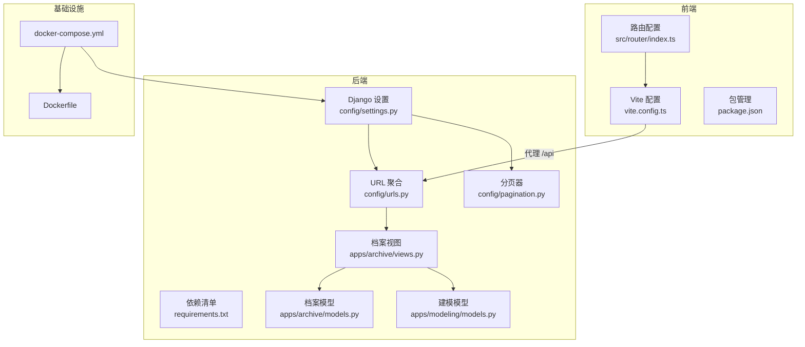
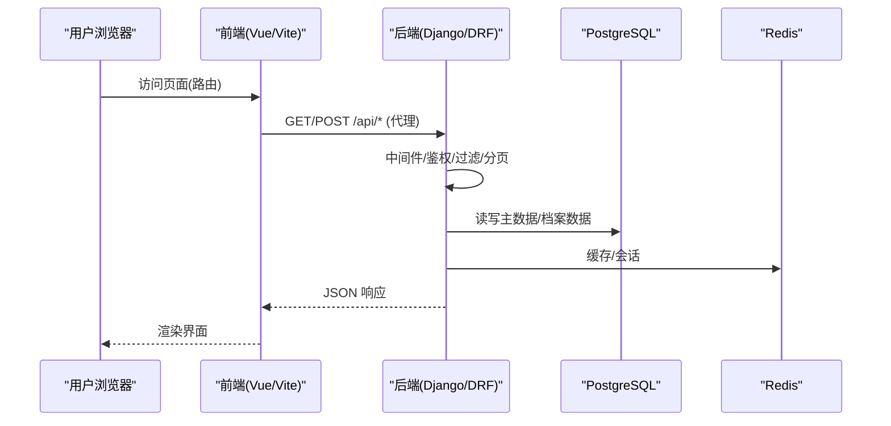
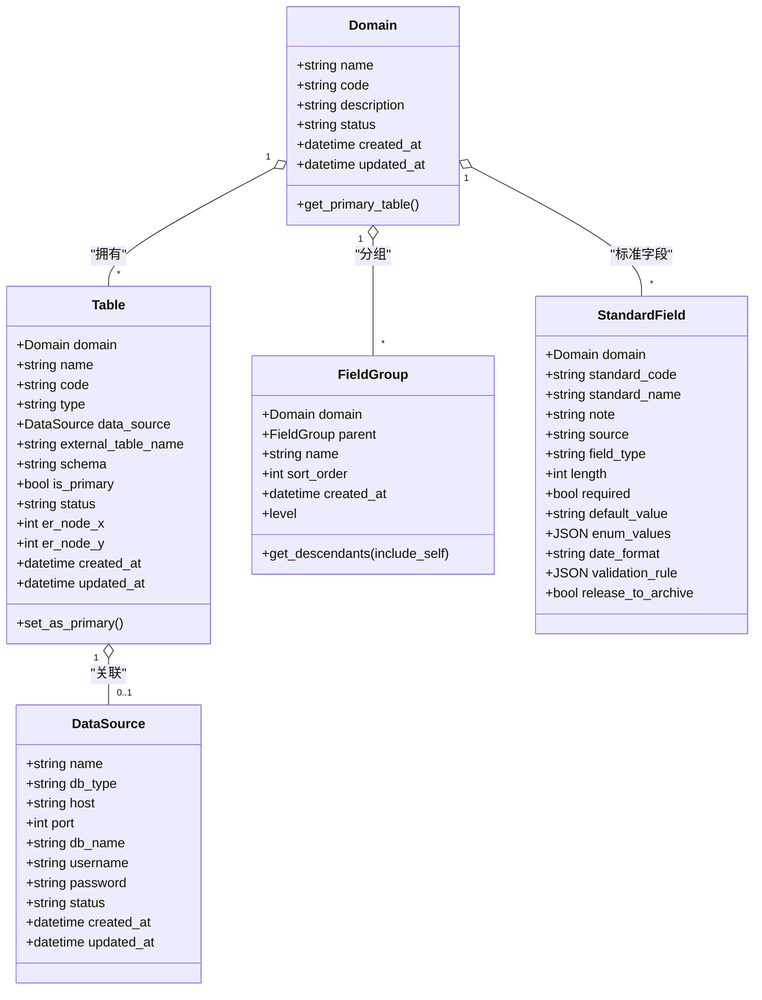
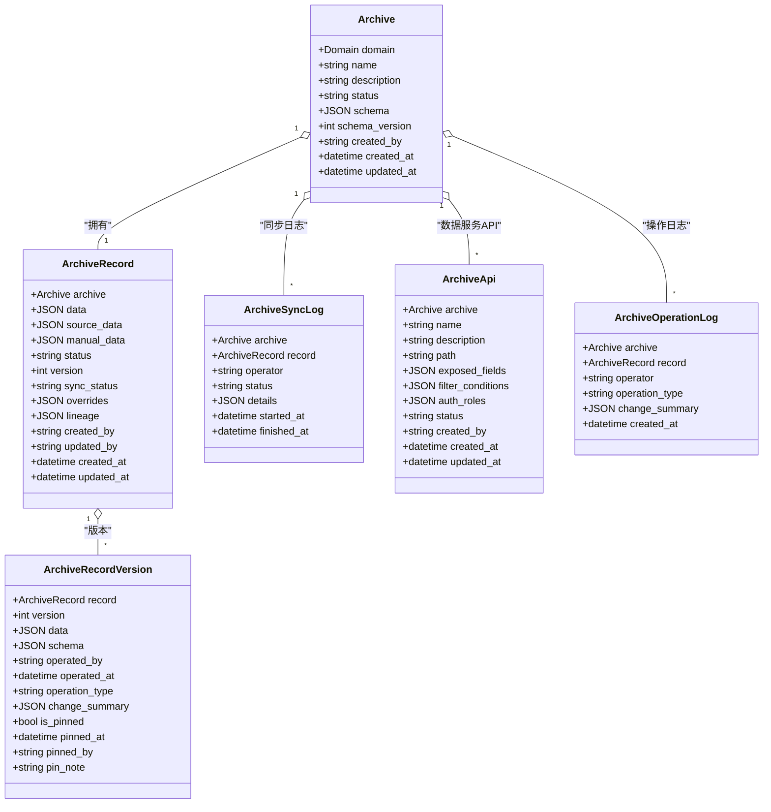
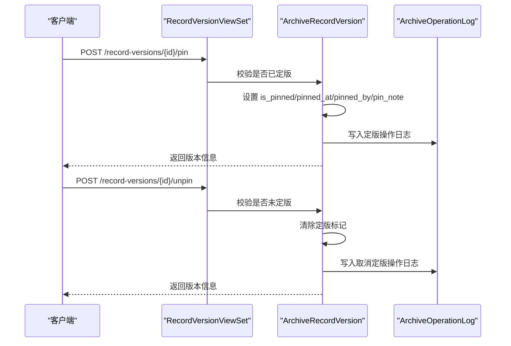
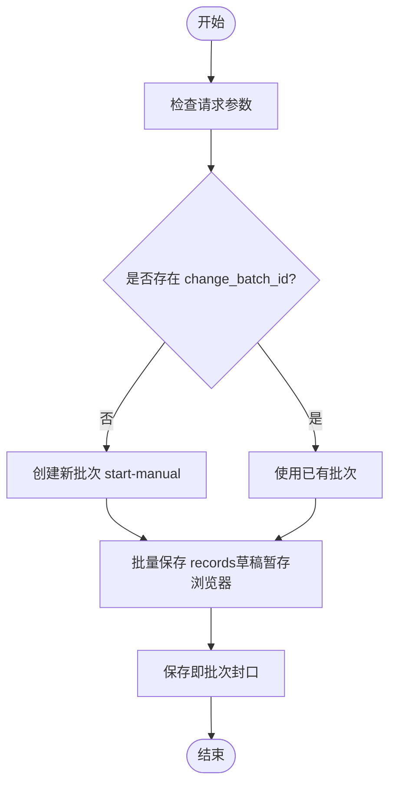
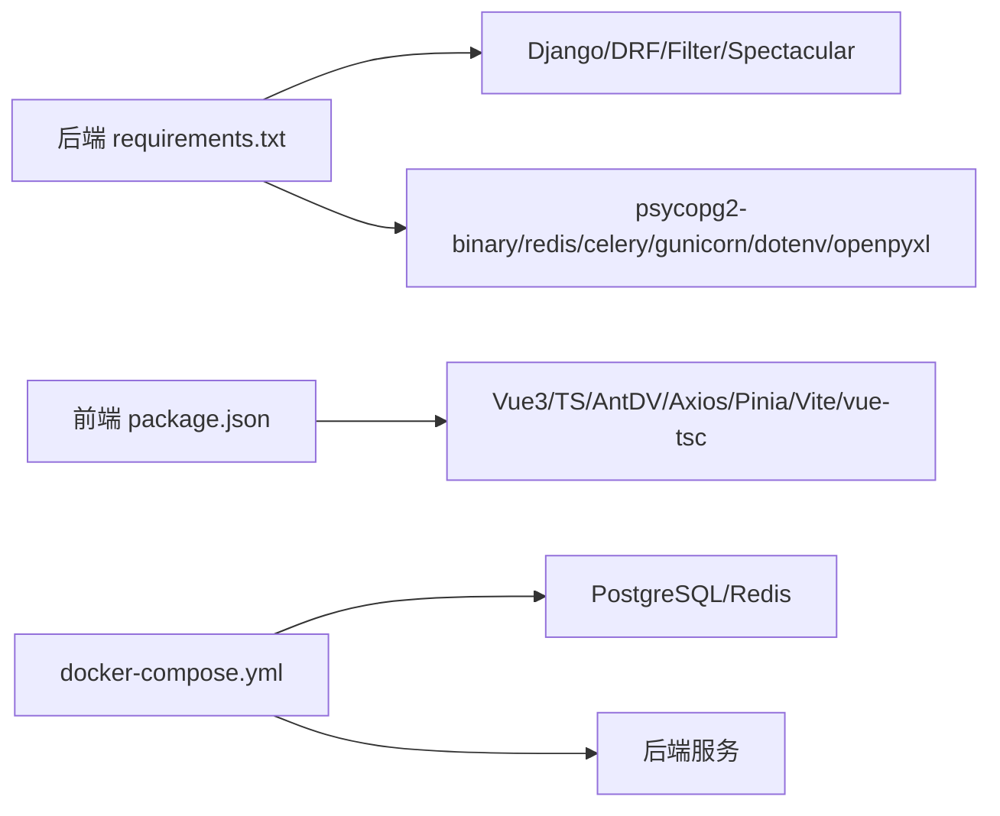

# 开发工作流程

<cite>
**本文引用的文件**   
- [backend/config/settings.py](file://backend/config/settings.py)
- [backend/config/urls.py](file://backend/config/urls.py)
- [backend/config/pagination.py](file://backend/config/pagination.py)
- [backend/Dockerfile](file://backend/Dockerfile)
- [backend/docker-compose.yml](file://backend/docker-compose.yml)
- [backend/requirements.txt](file://backend/requirements.txt)
- [backend/apps/modeling/models.py](file://backend/apps/modeling/models.py)
- [backend/apps/archive/models.py](file://backend/apps/archive/models.py)
- [backend/apps/archive/views.py](file://backend/apps/archive/views.py)
- [frontend/package.json](file://frontend/package.json)
- [frontend/src/router/index.ts](file://frontend/src/router/index.ts)
- [frontend/vite.config.ts](file://frontend/vite.config.ts)
- [scripts/check-all.ps1](file://scripts/check-all.ps1)
- [.ai/constitution.md](file://.ai/constitution.md)
</cite>

## 目录
1. [引言](#引言)
2. [项目结构](#项目结构)
3. [核心组件](#核心组件)
4. [架构总览](#架构总览)
5. [详细组件分析](#详细组件分析)
6. [依赖分析](#依赖分析)
7. [性能考虑](#性能考虑)
8. [故障排查指南](#故障排查指南)
9. [结论](#结论)
10. [附录](#附录)

## 引言
本文件为 MetaData002 项目建立“从需求到上线”的标准开发工作流程，覆盖需求评审、技术方案设计、代码实现、代码审查、测试验证、部署发布；定义 Git 工作流规范（分支策略、提交规范、合并请求流程）；明确版本管理与发布流程（版本号规范、变更日志维护、回滚策略）；提供新功能开发的模板与脚手架；并给出团队协作规范（任务分配、进度跟踪、知识分享）以及紧急修复与热补丁处理流程。

## 项目结构
项目采用前后端分离架构：
- 后端：Django + DRF + PostgreSQL + Redis，模块按 apps.modeling（建模引擎）、apps.archive（档案与数据服务）划分，统一通过 config.urls 路由聚合。
- 前端：Vue 3 + TypeScript + Vite，路由集中在 src/router/index.ts，API 代理至后端 8000 端口。
- 容器化：Dockerfile 构建 Python 镜像，docker-compose 编排 DB、Redis、后端服务。
- 质量门禁：scripts/check-all.ps1 统一执行后端 check/test 与前端类型检查/构建。

图表来源
- [frontend/src/router/index.ts:1-45](file://frontend/src/router/index.ts#L1-L45)
- [frontend/vite.config.ts:1-22](file://frontend/vite.config.ts#L1-L22)
- [backend/config/urls.py:1-9](file://backend/config/urls.py#L1-L9)
- [backend/config/settings.py:1-123](file://backend/config/settings.py#L1-L123)
- [backend/config/pagination.py:1-14](file://backend/config/pagination.py#L1-L14)
- [backend/Dockerfile:1-20](file://backend/Dockerfile#L1-L20)
- [backend/docker-compose.yml:1-58](file://backend/docker-compose.yml#L1-L58)

章节来源
- [backend/config/settings.py:1-123](file://backend/config/settings.py#L1-L123)
- [backend/config/urls.py:1-9](file://backend/config/urls.py#L1-L9)
- [backend/config/pagination.py:1-14](file://backend/config/pagination.py#L1-L14)
- [backend/Dockerfile:1-20](file://backend/Dockerfile#L1-L20)
- [backend/docker-compose.yml:1-58](file://backend/docker-compose.yml#L1-L58)
- [backend/requirements.txt:1-11](file://backend/requirements.txt#L1-L11)
- [frontend/package.json:1-29](file://frontend/package.json#L1-L29)
- [frontend/src/router/index.ts:1-45](file://frontend/src/router/index.ts#L1-L45)
- [frontend/vite.config.ts:1-22](file://frontend/vite.config.ts#L1-L22)

## 核心组件
- 后端核心
  - Django 应用与中间件、数据库与缓存、DRF/Spectacular 配置、AI 服务参数、定时刷新开关等均在 settings.py 中集中管理。
  - URL 聚合将 admin 与两个业务模块（modeling、archive）统一挂载在 /api 下。
  - 标准分页器 StandardPagination 支持 page_size 覆盖，便于大数据量场景。
- 前端核心
  - Vue Router 定义域管理、档案管理、系统设置三大功能域的路由与页面映射。
  - Vite 配置本地开发端口 3000，并将 /api 请求代理至后端 8000。
  - package.json 定义脚本 dev/build/preview 与依赖版本。
- 基础设施
  - Dockerfile 基于 python:3.12-slim，安装系统依赖与 Python 依赖。
  - docker-compose 编排 PostgreSQL、Redis、后端服务，含健康检查与卷持久化。

章节来源
- [backend/config/settings.py:1-123](file://backend/config/settings.py#L1-L123)
- [backend/config/urls.py:1-9](file://backend/config/urls.py#L1-L9)
- [backend/config/pagination.py:1-14](file://backend/config/pagination.py#L1-L14)
- [frontend/src/router/index.ts:1-45](file://frontend/src/router/index.ts#L1-L45)
- [frontend/vite.config.ts:1-22](file://frontend/vite.config.ts#L1-L22)
- [frontend/package.json:1-29](file://frontend/package.json#L1-L29)
- [backend/Dockerfile:1-20](file://backend/Dockerfile#L1-L20)
- [backend/docker-compose.yml:1-58](file://backend/docker-compose.yml#L1-L58)

## 架构总览
下图展示从浏览器到后端 API 的调用链路，以及关键配置与模型关系。

图表来源
- [frontend/src/router/index.ts:1-45](file://frontend/src/router/index.ts#L1-L45)
- [frontend/vite.config.ts:1-22](file://frontend/vite.config.ts#L1-L22)
- [backend/config/urls.py:1-9](file://backend/config/urls.py#L1-L9)
- [backend/config/settings.py:1-123](file://backend/config/settings.py#L1-L123)

## 详细组件分析

### 建模领域模型（Modeling）
- 数据源配置 DataSource：多数据库类型支持（PostgreSQL/MySQL/SQL Server/Oracle），状态与时间戳字段。
- 域 Domain：主数据域，包含启用/废弃状态。
- 表 Table：域下的实体表，支持本地表与外部数据源表，主表标记 is_primary，ER 图坐标持久化。
- 字段分组 FieldGroup：多层嵌套分组（最多3层），支持祖先/后代查询。
- 标准字段 StandardField：概念层一等公民，跨表去重与属性配置统一承载，支持枚举、校验规则、释放到档案开关等。

图表来源
- [backend/apps/modeling/models.py:1-200](file://backend/apps/modeling/models.py#L1-L200)

章节来源
- [backend/apps/modeling/models.py:1-200](file://backend/apps/modeling/models.py#L1-L200)

### 档案领域模型（Archive）
- Archive：档案配置，与 Domain 一对一，保存 Schema 快照与版本号。
- ArchiveRecord：档案记录，双层存储（source_data 源同步底层、manual_data 人工覆盖层），包含 sync_status、overrides、lineage、version 等。
- ArchiveRecordVersion：版本快照，支持定版与回滚。
- ArchiveSyncLog：同步日志，记录每次同步的状态与详情。
- ArchiveApi：数据服务 API 配置，暴露字段、筛选条件、角色/部门授权。
- ArchiveOperationLog：操作日志，统一记录各类操作的变更摘要。

图表来源
- [backend/apps/archive/models.py:1-200](file://backend/apps/archive/models.py#L1-L200)

章节来源
- [backend/apps/archive/models.py:1-200](file://backend/apps/archive/models.py#L1-L200)

### 版本定版与取消定版流程（序列图）

图表来源
- [backend/apps/archive/views.py:1806-1846](file://backend/apps/archive/views.py#L1806-L1846)

章节来源
- [backend/apps/archive/views.py:1806-1846](file://backend/apps/archive/views.py#L1806-L1846)

### 变更批次与手动编辑批次（流程图）

图表来源
- [backend/apps/archive/views.py:1848-1864](file://backend/apps/archive/views.py#L1848-L1864)

章节来源
- [backend/apps/archive/views.py:1848-1864](file://backend/apps/archive/views.py#L1848-L1864)

## 依赖分析
- 后端依赖
  - Django、DRF、django-filter、drf-spectacular、psycopg2-binary、redis、celery、gunicorn、python-dotenv、openpyxl 等。
- 前端依赖
  - Vue 3、TypeScript、Ant Design Vue、Axios、Pinia、Vite、vue-tsc 等。
- 运行时依赖
  - PostgreSQL、Redis、Python 3.12。

图表来源
- [backend/requirements.txt:1-11](file://backend/requirements.txt#L1-L11)
- [frontend/package.json:1-29](file://frontend/package.json#L1-L29)
- [backend/docker-compose.yml:1-58](file://backend/docker-compose.yml#L1-L58)

章节来源
- [backend/requirements.txt:1-11](file://backend/requirements.txt#L1-L11)
- [frontend/package.json:1-29](file://frontend/package.json#L1-L29)
- [backend/docker-compose.yml:1-58](file://backend/docker-compose.yml#L1-L58)

## 性能考虑
- 分页策略：StandardPagination 默认 20 条，允许前端通过 page_size 覆盖，最大上限 100000，避免极端值拖垮服务。
- 缓存：Redis 作为默认缓存后端，用于会话与热点数据。
- 数据库：PostgreSQL 作为主库，连接池与健康检查在 settings 中配置。
- 构建与代理：Vite 本地开发端口 3000，/api 代理至 8000，减少跨域问题。
- 容器化：Dockerfile 最小化基础镜像，仅安装必要系统依赖，提升构建与运行效率。

章节来源
- [backend/config/pagination.py:1-14](file://backend/config/pagination.py#L1-L14)
- [backend/config/settings.py:1-123](file://backend/config/settings.py#L1-L123)
- [frontend/vite.config.ts:1-22](file://frontend/vite.config.ts#L1-L22)
- [backend/Dockerfile:1-20](file://backend/Dockerfile#L1-L20)

## 故障排查指南
- 常见问题定位
  - 后端检查：使用 manage.py check 进行静态检查。
  - 单元测试：manage.py test apps.modeling apps.archive --verbosity 2。
  - 前端类型检查：npx vue-tsc --noEmit。
  - 前端构建：npx vite build --mode production。
- 一键检查脚本
  - scripts/check-all.ps1 统一执行上述步骤，汇总结果并返回退出码。
- 常见错误
  - 环境变量缺失（如 DJANGO_SECRET_KEY、DB_*、REDIS_*、AI_*）。
  - 数据库/Redis 不可达或健康检查失败。
  - 前端代理配置错误导致 /api 请求失败。

章节来源
- [scripts/check-all.ps1:1-90](file://scripts/check-all.ps1#L1-L90)
- [backend/config/settings.py:1-123](file://backend/config/settings.py#L1-L123)
- [backend/docker-compose.yml:1-58](file://backend/docker-compose.yml#L1-L58)
- [frontend/vite.config.ts:1-22](file://frontend/vite.config.ts#L1-L22)

## 结论
本工作流程以“需求→设计→实现→审查→测试→发布”为主线，结合 Git 分支策略、提交规范、MR 流程、版本与发布规范、协作机制与紧急修复流程，确保 MetaData002 项目在高质量与高效率下持续交付。建议团队严格遵循本规范，并结合 .ai/constitution.md 中的架构决策与交互决策，保持技术一致性与用户体验一致性。

## 附录

### 端到端开发流程（从需求到上线）
- 需求评审
  - 输入：产品需求文档、用户故事、验收标准。
  - 输出：需求评审纪要、影响范围评估、风险识别。
- 技术方案设计
  - 输入：需求评审输出。
  - 输出：技术方案文档（数据模型、接口设计、架构图、时序图）、风险评估与缓解措施。
- 代码实现
  - 输入：技术方案文档。
  - 输出：可运行的代码、单元测试、集成测试、文档更新。
- 代码审查
  - 输入：待合并的代码分支。
  - 输出：审查意见、修改建议、批准合并。
- 测试验证
  - 输入：合并后的代码。
  - 输出：测试报告（单元/集成/端到端）、性能与安全测试结果。
- 部署发布
  - 输入：测试通过的代码与制品。
  - 输出：生产环境部署、监控告警、回滚预案。

### Git 工作流规范
- 分支策略
  - main：生产稳定分支，受保护，仅允许通过 MR 合并。
  - develop：开发主干，集成各功能分支。
  - feature/*：功能分支，命名如 feature/xxx。
  - hotfix/*：紧急修复分支，命名如 hotfix/yyy。
  - release/*：预发布分支，命名如 release/vX.Y.Z。
- 提交规范
  - 格式：<type>(<scope>): <subject>
  - 类型：feat、fix、docs、style、refactor、test、chore、build、ci、perf、revert。
  - 示例：feat(modeling): 新增域主表设置入口。
- 合并请求流程
  - 创建 MR：选择目标分支（develop/main），填写描述与影响范围。
  - 审查：至少一名负责人审查通过。
  - 自动化：CI 通过（check-all.ps1、lint、test、build）。
  - 合并：squash merge，保留语义清晰的提交历史。

### 版本管理与发布流程
- 版本号规范
  - 语义化版本：MAJOR.MINOR.PATCH（如 1.2.3）。
  - MAJOR：不兼容的 API/数据模型变更。
  - MINOR：向后兼容的功能新增。
  - PATCH：向后兼容的问题修复。
- 变更日志维护
  - 位置：CHANGELOG.md（根目录）。
  - 内容：按版本列出新增、修复、破坏性变更、已知问题。
  - 更新时机：每次发布前由负责人更新。
- 回滚策略
  - 代码回滚：回退到上一个稳定标签或提交。
  - 数据回滚：基于 ArchiveChangeDetail 的 field_changes 逆向回放，或使用版本快照恢复。
  - 灰度发布：先小流量验证，再全量发布。

### 新功能开发模板与脚手架
- 后端模板
  - 新建 app：python manage.py startapp <app_name>。
  - 模型：在 models.py 中定义模型类，编写迁移。
  - 序列化器：在 serializers.py 中定义序列化器。
  - 视图集：在 views.py 中定义 ViewSet，注册路由。
  - 测试：在 tests.py 中编写单元测试。
- 前端模板
  - 新建页面：在 src/views/<module>/ 下创建 Vue 组件。
  - 路由：在 src/router/index.ts 中注册路由。
  - API：在 src/api/ 下定义接口函数。
  - 状态管理：在 src/stores/ 中使用 Pinia 管理状态。
  - 样式：在 src/styles/ 中维护主题与公共样式。

### 团队协作规范
- 任务分配
  - 使用项目管理工具（如 Jira/Trello）分配任务，明确负责人与截止日期。
  - 每日站会同步进度与阻塞问题。
- 进度跟踪
  - 每周迭代计划与回顾，更新任务状态。
  - 使用看板可视化任务流转（待办、进行中、已完成）。
- 知识分享
  - 定期技术分享会，沉淀最佳实践与经验教训。
  - 维护团队知识库（Confluence/Wiki），记录架构决策与常见问题。

### 紧急修复与热补丁处理流程
- 触发条件
  - 生产环境出现严重故障，影响用户正常使用。
- 处理流程
  - 快速响应：立即拉起应急会议，确定影响范围与修复方案。
  - 分支创建：从 main 拉取 hotfix/* 分支。
  - 修复与验证：快速修复并本地验证，必要时补充测试用例。
  - 合并与发布：优先合并到 main，跳过非必要审查，快速发布。
  - 复盘与改进：事后复盘，完善监控与预防机制。

章节来源
- [.ai/constitution.md:1-171](file://.ai/constitution.md#L1-L171)