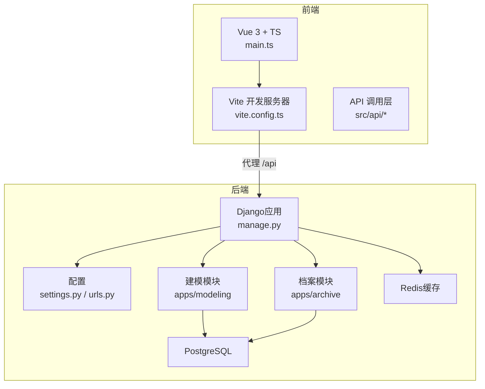
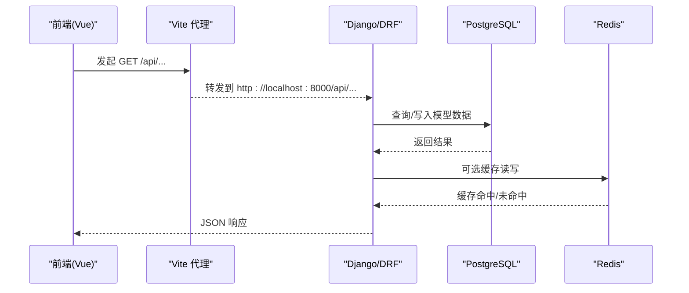
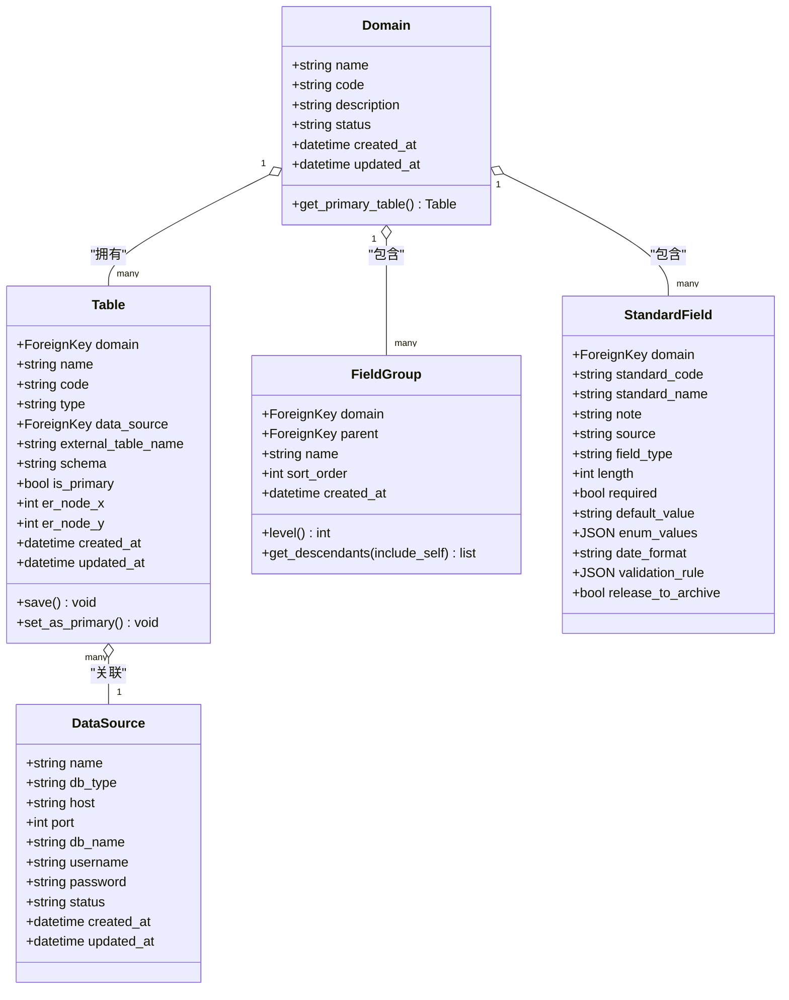
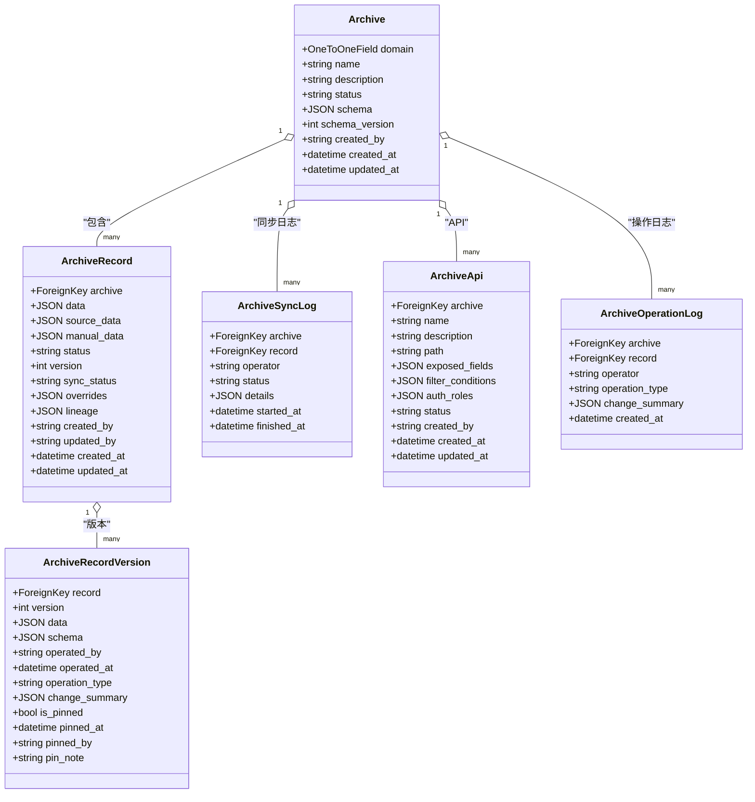
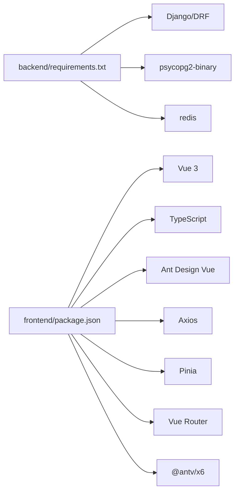

# 开发指南

<cite>
**本文引用的文件**   
- [backend/requirements.txt](file://backend/requirements.txt)
- [backend/Dockerfile](file://backend/Dockerfile)
- [backend/docker-compose.yml](file://backend/docker-compose.yml)
- [backend/manage.py](file://backend/manage.py)
- [backend/config/settings.py](file://backend/config/settings.py)
- [backend/config/urls.py](file://backend/config/urls.py)
- [backend/apps/modeling/models.py](file://backend/apps/modeling/models.py)
- [backend/apps/archive/models.py](file://backend/apps/archive/models.py)
- [frontend/package.json](file://frontend/package.json)
- [frontend/tsconfig.json](file://frontend/tsconfig.json)
- [frontend/vite.config.ts](file://frontend/vite.config.ts)
- [frontend/src/main.ts](file://frontend/src/main.ts)
- [scripts/check-all.ps1](file://scripts/check-all.ps1)
- [.ai/constitution.md](file://.ai/constitution.md)
</cite>

## 目录
1. [简介](#简介)
2. [项目结构](#项目结构)
3. [核心组件](#核心组件)
4. [架构总览](#架构总览)
5. [详细组件分析](#详细组件分析)
6. [依赖关系分析](#依赖关系分析)
7. [性能考虑](#性能考虑)
8. [故障排查指南](#故障排查指南)
9. [结论](#结论)
10. [附录](#附录)

## 简介
本指南面向 MetaData002（主数据管理系统）的开发者，覆盖环境搭建、IDE与代码规范、Git工作流、测试策略、调试技巧、新功能开发流程、常见问题与贡献规范。系统采用“模型驱动 + AI增强”的架构：后端基于 Django + DRF + PostgreSQL + Redis，前端基于 Vue 3 + TypeScript + Ant Design Vue + Vite，提供建模引擎、档案管理与AI质量规则能力。

## 项目结构
- 后端 backend
  - apps/modeling：建模域（数据源、域、表、字段分组、标准字段等）
  - apps/archive：档案模块（档案配置、记录、版本、同步日志、API暴露等）
  - config：Django 配置（settings、urls、wsgi）、分页配置
  - scripts：运维脚本（迁移、回刷等）
  - Dockerfile、docker-compose.yml：容器化运行
- 前端 frontend
  - src：Vue 3 + TS 源码（路由、视图、组件、状态、样式、类型定义、工具函数）
  - vite.config.ts：Vite 开发与代理配置
  - package.json：依赖与脚本
  - tsconfig.json：TS 编译选项
- 根目录
  - scripts/check-all.ps1：一键检查脚本（后端 check/test + 前端 tsc/build）
  - .ai/constitution.md：项目宪法（技术栈、关键决策、已知问题）

图表来源
- [backend/manage.py:1-21](file://backend/manage.py#L1-L21)
- [backend/config/settings.py:1-123](file://backend/config/settings.py#L1-L123)
- [backend/config/urls.py:1-9](file://backend/config/urls.py#L1-L9)
- [frontend/src/main.ts:1-14](file://frontend/src/main.ts#L1-L14)
- [frontend/vite.config.ts:1-22](file://frontend/vite.config.ts#L1-L22)

章节来源
- [backend/requirements.txt:1-11](file://backend/requirements.txt#L1-L11)
- [backend/Dockerfile:1-20](file://backend/Dockerfile#L1-L20)
- [backend/docker-compose.yml:1-58](file://backend/docker-compose.yml#L1-L58)
- [frontend/package.json:1-29](file://frontend/package.json#L1-L29)
- [frontend/tsconfig.json:1-25](file://frontend/tsconfig.json#L1-L25)
- [frontend/vite.config.ts:1-22](file://frontend/vite.config.ts#L1-L22)
- [frontend/src/main.ts:1-14](file://frontend/src/main.ts#L1-L14)
- [scripts/check-all.ps1:1-90](file://scripts/check-all.ps1#L1-L90)
- [.ai/constitution.md:1-171](file://.ai/constitution.md#L1-L171)

## 核心组件
- 后端核心
  - Django 应用入口与命令：manage.py
  - 配置中心：settings（数据库、缓存、DRF、Spectacular、AI 服务、本地覆盖）
  - URL 路由：统一挂载 apps.modeling 与 apps.archive 的 api 前缀
  - 建模领域模型：DataSource、Domain、Table、FieldGroup、StandardField 等
  - 档案领域模型：Archive、ArchiveRecord、ArchiveRecordVersion、ArchiveSyncLog、ArchiveApi、ArchiveOperationLog
- 前端核心
  - 应用初始化：main.ts（Pinia、Router、Antd 插件挂载）
  - 构建与开发：Vite + Vue 插件，端口 3000，/api 代理到 8000
  - 类型系统：tsconfig 严格模式、路径别名 @/*
- 工程化
  - 依赖管理：backend/requirements.txt、frontend/package.json
  - 容器化：Dockerfile、docker-compose.yml
  - 全量检查：scripts/check-all.ps1

章节来源
- [backend/manage.py:1-21](file://backend/manage.py#L1-L21)
- [backend/config/settings.py:1-123](file://backend/config/settings.py#L1-L123)
- [backend/config/urls.py:1-9](file://backend/config/urls.py#L1-L9)
- [backend/apps/modeling/models.py:1-200](file://backend/apps/modeling/models.py#L1-L200)
- [backend/apps/archive/models.py:1-200](file://backend/apps/archive/models.py#L1-L200)
- [frontend/src/main.ts:1-14](file://frontend/src/main.ts#L1-L14)
- [frontend/vite.config.ts:1-22](file://frontend/vite.config.ts#L1-L22)
- [frontend/package.json:1-29](file://frontend/package.json#L1-L29)
- [frontend/tsconfig.json:1-25](file://frontend/tsconfig.json#L1-L25)
- [backend/requirements.txt:1-11](file://backend/requirements.txt#L1-L11)
- [backend/Dockerfile:1-20](file://backend/Dockerfile#L1-L20)
- [backend/docker-compose.yml:1-58](file://backend/docker-compose.yml#L1-L58)
- [scripts/check-all.ps1:1-90](file://scripts/check-all.ps1#L1-L90)

## 架构总览
系统采用前后端分离架构，前端通过 Vite 启动开发服务器并代理 /api 请求至后端；后端基于 Django + DRF 提供 RESTful API，使用 PostgreSQL 作为持久化存储，Redis 作为缓存。建模与档案两大业务域通过清晰的模型边界协作，支持多数据源接入与档案数据的同步、版本与审计。

图表来源
- [frontend/vite.config.ts:12-21](file://frontend/vite.config.ts#L12-L21)
- [backend/config/urls.py:4-8](file://backend/config/urls.py#L4-L8)
- [backend/config/settings.py:56-74](file://backend/config/settings.py#L56-L74)

## 详细组件分析

### 后端环境与运行
- 依赖与环境
  - Python 包：Django、DRF、django-filter、drf-spectacular、psycopg2-binary、redis、celery、gunicorn、python-dotenv、openpyxl
  - 容器镜像：python:3.12-slim，安装 gcc、libpq-dev 后安装 requirements
- 运行方式
  - 本地：python manage.py runserver
  - 容器：docker-compose up，自动执行 migrate 并启动 runserver
  - 环境变量：SECRET_KEY、DEBUG、ALLOWED_HOSTS、DB_*、REDIS_*、AI_*、ARCHIVE_AUTO_REFRESH_MINUTES
- 配置要点
  - 数据库：PostgreSQL（默认），可通过 local_settings 覆盖为 SQLite（开发）
  - 缓存：Redis（默认 localhost:6379/db1）
  - DRF：分页、过滤、搜索、排序、OpenAPI Schema
  - Spectacular：自动生成接口文档

章节来源
- [backend/requirements.txt:1-11](file://backend/requirements.txt#L1-L11)
- [backend/Dockerfile:1-20](file://backend/Dockerfile#L1-L20)
- [backend/docker-compose.yml:1-58](file://backend/docker-compose.yml#L1-L58)
- [backend/manage.py:1-21](file://backend/manage.py#L1-L21)
- [backend/config/settings.py:1-123](file://backend/config/settings.py#L1-L123)

### 前端环境与运行
- 依赖与脚本
  - 依赖：Vue 3、TypeScript、Ant Design Vue、Axios、Pinia、Vue Router、@antv/x6
  - 脚本：dev、build、preview
- 开发与构建
  - Vite 开发服务器端口 3000，/api 代理到 8000
  - TS 编译：vue-tsc --noEmit（在检查脚本中执行）
  - 路径别名：@/* -> ./src
- 应用初始化
  - main.ts 挂载 Pinia、Router、Antd，渲染 App.vue

章节来源
- [frontend/package.json:1-29](file://frontend/package.json#L1-L29)
- [frontend/vite.config.ts:1-22](file://frontend/vite.config.ts#L1-L22)
- [frontend/tsconfig.json:1-25](file://frontend/tsconfig.json#L1-L25)
- [frontend/src/main.ts:1-14](file://frontend/src/main.ts#L1-L14)

### 建模领域模型（modeling）
- 实体关系概览
  - DataSource：数据源配置（名称、类型、主机、端口、库名、用户名、密码、状态）
  - Domain：主数据域（名称、编码、描述、状态）
  - Table：域下实体表（类型：本地/数据源表；是否主表；外部表名与 schema；ER图坐标）
  - FieldGroup：字段分组（支持多层嵌套，最多3层）
  - StandardField：标准字段（概念层一等公民，跨表去重与属性配置源）
- 关键行为
  - Table.save 强制 type 与 data_source 一致性
  - Table.set_as_primary 设置主表并自动调整组合字段的主字段归属

图表来源
- [backend/apps/modeling/models.py:1-200](file://backend/apps/modeling/models.py#L1-L200)

章节来源
- [backend/apps/modeling/models.py:1-200](file://backend/apps/modeling/models.py#L1-L200)

### 档案领域模型（archive）
- 实体关系概览
  - Archive：档案配置（与 Domain 一对一，schema 快照与版本号）
  - ArchiveRecord：档案记录（双层存储：source_data + manual_data，合并为 data；sync_status、overrides、lineage）
  - ArchiveRecordVersion：版本快照（操作类型、变更摘要、定版标记）
  - ArchiveSyncLog：同步日志（状态、详情、时间）
  - ArchiveApi：数据服务API（暴露字段、筛选条件、角色/部门授权）
  - ArchiveOperationLog：操作日志（操作类型、变更摘要）
- 关键行为
  - ArchiveRecord 双层存储：刷新时整层替换 source_data，manual_data 仅允许 ownership='archive' 字段键
  - 合并逻辑：data = _merge_record_data（computed 保留现值、source 直通、archive 优先 manual）
  - 版本与审计：每次变更生成版本快照与操作日志，支持回滚与导出

图表来源
- [backend/apps/archive/models.py:1-200](file://backend/apps/archive/models.py#L1-L200)

章节来源
- [backend/apps/archive/models.py:1-200](file://backend/apps/archive/models.py#L1-L200)

### 路由与接口组织
- 根路由：/admin、/api（聚合 modeling 与 archive）
- 建议遵循 DRF 风格：按资源划分 ViewSet/Serializer，统一错误处理与分页

章节来源
- [backend/config/urls.py:1-9](file://backend/config/urls.py#L1-L9)

## 依赖关系分析
- 后端依赖
  - Django、DRF、django-filter、drf-spectacular、psycopg2-binary、redis、celery、gunicorn、python-dotenv、openpyxl
- 前端依赖
  - Vue 3、TypeScript、Ant Design Vue、Axios、Pinia、Vue Router、@antv/x6
- 运行时依赖
  - PostgreSQL、Redis（由 docker-compose 提供）

图表来源
- [backend/requirements.txt:1-11](file://backend/requirements.txt#L1-L11)
- [frontend/package.json:1-29](file://frontend/package.json#L1-L29)

章节来源
- [backend/requirements.txt:1-11](file://backend/requirements.txt#L1-L11)
- [frontend/package.json:1-29](file://frontend/package.json#L1-L29)

## 性能考虑
- 数据库
  - 合理使用索引（如 ArchiveRecord 的 (archive, status) 索引）
  - 避免 N+1 查询，使用 select_related/prefetch_related
  - 大对象 JSON 字段注意序列化开销，必要时拆分或物化
- 缓存
  - 热点数据入 Redis（列表、字典、枚举值）
  - 合理设置过期时间与更新策略
- 异步任务
  - Celery 用于耗时任务（如批量同步、计算字段重算）
- 前端
  - 列表分页与懒加载
  - 减少不必要的重渲染（Pinia 状态粒度设计）
  - 图片与静态资源优化（Vite 打包）

[本节为通用指导，不直接分析具体文件]

## 故障排查指南
- 常见环境问题
  - 数据库连接失败：检查 DB_* 环境变量与 docker-compose 健康检查
  - Redis 不可用：确认 REDIS_HOST/PORT 与容器状态
  - 权限与驱动：SQL Server/Oracle 需额外驱动与参数（参考 settings 与 views 中的动态连接配置）
- 后端调试
  - 使用 DEBUG=1 获取详细堆栈
  - 使用 drf-spectacular 查看接口文档与参数校验
  - 使用 django-debug-toolbar（可选）定位慢查询
- 前端调试
  - 浏览器 DevTools 网络面板查看 /api 请求与响应
  - vue-tsc 检查类型错误
  - Vite HMR 快速验证修改
- 数据同步与版本
  - 查看 ArchiveSyncLog 与 ArchiveOperationLog 定位同步与操作问题
  - 使用 ArchiveRecordVersion 对比差异与回滚

章节来源
- [backend/config/settings.py:56-74](file://backend/config/settings.py#L56-L74)
- [backend/apps/modeling/views.py:101-134](file://backend/apps/modeling/views.py#L101-L134)
- [backend/apps/archive/models.py:112-200](file://backend/apps/archive/models.py#L112-L200)
- [scripts/check-all.ps1:50-76](file://scripts/check-all.ps1#L50-L76)

## 结论
MetaData002 以清晰的领域模型与模块化架构支撑主数据建模与档案管理，结合 AI 能力提升效率。通过容器化与标准化工程脚本，团队可高效协作与交付。建议在后续迭代中持续完善测试覆盖率、性能监控与可观测性。

[本节为总结性内容，不直接分析具体文件]

## 附录

### 开发环境搭建步骤
- 后端
  - 安装 Python 3.12+，创建虚拟环境
  - 安装依赖：pip install -r backend/requirements.txt
  - 配置环境变量（SECRET_KEY、DB_*、REDIS_*、AI_*）
  - 启动：python backend/manage.py migrate && python backend/manage.py runserver
- 前端
  - 安装 Node.js 18+
  - 进入 frontend 目录，npm install
  - 启动：npm run dev（访问 http://localhost:3000，/api 代理到 8000）
- 容器化（推荐）
  - 在项目根目录执行：docker-compose up
  - 自动拉起 PostgreSQL、Redis、后端服务，并执行迁移

章节来源
- [backend/requirements.txt:1-11](file://backend/requirements.txt#L1-L11)
- [backend/manage.py:1-21](file://backend/manage.py#L1-L21)
- [backend/docker-compose.yml:1-58](file://backend/docker-compose.yml#L1-L58)
- [frontend/package.json:1-29](file://frontend/package.json#L1-L29)
- [frontend/vite.config.ts:12-21](file://frontend/vite.config.ts#L12-L21)

### IDE 配置与代码格式化
- 后端（Python/Django）
  - 推荐 VS Code + Pylance + Black + isort + flake8
  - 设置保存时格式化与导入排序
- 前端（Vue/TS）
  - 推荐 VS Code + Volar + ESLint + Prettier
  - 启用保存时格式化与类型检查（vue-tsc）
- Git Hooks
  - 可在 .githooks 中集成 pre-commit（格式检查、lint、测试）

[本节为通用指导，不直接分析具体文件]

### 代码规范与命名约定
- Python
  - 遵循 PEP8，类名 PascalCase，函数/变量 snake_case
  - Django 模型字段 verbose_name 与 help_text 中文说明
- TypeScript/Vue
  - 组件文件名 PascalCase，文件扩展名 .vue
  - 常量 UPPER_SNAKE_CASE，变量 camelCase
  - 类型定义放在 types/index.ts，接口明确
- 注释与文档
  - 复杂逻辑添加行内注释
  - API 使用 drf-spectacular 自动生成文档

[本节为通用指导，不直接分析具体文件]

### Git 工作流与分支策略
- 分支模型
  - main：生产分支
  - develop：集成分支
  - feature/*：功能分支
  - hotfix/*：紧急修复
- 提交信息
  - 使用 Conventional Commits（feat/fix/docs/chore）
- 合并流程
  - Pull Request 需通过 CI（check-all.ps1）与至少一名 Reviewer 批准

[本节为通用指导，不直接分析具体文件]

### 测试策略与框架使用
- 后端
  - 使用 Django TestCase 编写单元测试
  - 针对 API 使用 APITestCase 进行接口测试
  - 数据模型与业务逻辑覆盖核心路径
- 前端
  - 使用 Vitest/Jest + Vue Test Utils 编写组件测试
  - 端到端测试可使用 Cypress/Playwright（可选）
- 自动化
  - scripts/check-all.ps1 集成后端 test 与前端 build/tsc

章节来源
- [scripts/check-all.ps1:50-76](file://scripts/check-all.ps1#L50-L76)

### 调试技巧与工具
- 后端
  - DEBUG=1 输出详细错误
  - 使用 logging 模块记录关键路径
  - 数据库查询优化：EXPLAIN ANALYZE、索引建议
- 前端
  - Network 面板查看请求/响应
  - Vue DevTools 调试组件状态
  - 控制台断点与 Source Map

[本节为通用指导，不直接分析具体文件]

### 新功能开发完整流程
- 需求分析
  - 明确输入/输出、边界条件、异常处理
- 设计
  - 后端：模型/序列化器/视图/URL
  - 前端：路由/组件/状态/类型
- 实现
  - 遵循代码规范与命名约定
  - 编写单元测试与接口测试
- 审查与合并
  - PR 描述变更影响与测试用例
  - 通过 CI 与人工审查
- 部署上线
  - 容器镜像构建与发布
  - 数据库迁移与回滚预案

[本节为通用指导，不直接分析具体文件]

### 常见问题排查与解决方案
- 数据库连接失败
  - 检查 docker-compose 健康检查与环境变量
- Redis 不可用
  - 确认端口与网络连通性
- 接口 4xx/5xx
  - 查看后端日志与 drf-spectacular 文档
  - 前端 axios 拦截器确保错误体可读
- 同步与版本问题
  - 查看 ArchiveSyncLog 与 ArchiveOperationLog
  - 使用 ArchiveRecordVersion 对比差异

章节来源
- [backend/config/settings.py:56-74](file://backend/config/settings.py#L56-L74)
- [backend/apps/archive/models.py:112-200](file://backend/apps/archive/models.py#L112-L200)

### 贡献代码的流程与规范
- Fork 仓库并创建功能分支
- 提交符合规范的 Commit 信息
- 推送分支并创建 Pull Request
- 通过 CI 检查与至少一名 Reviewer 批准
- 合并后删除分支并保持仓库整洁

[本节为通用指导，不直接分析具体文件]