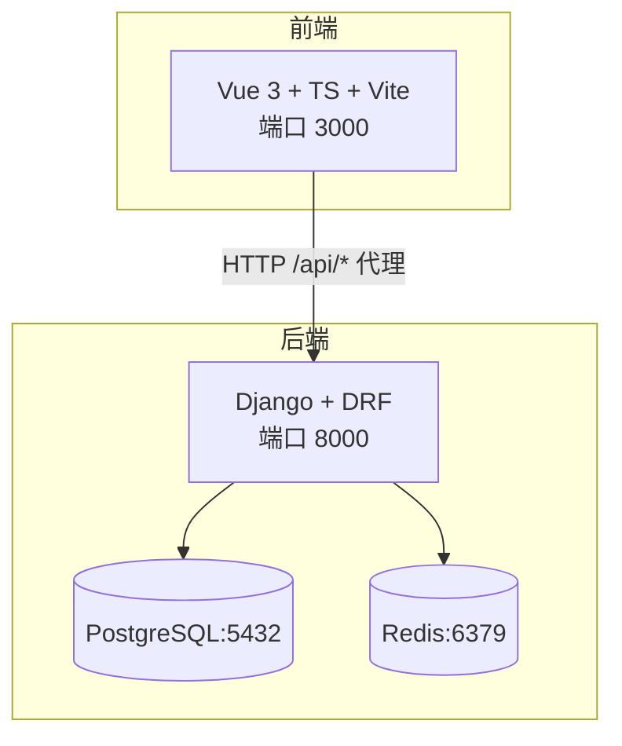
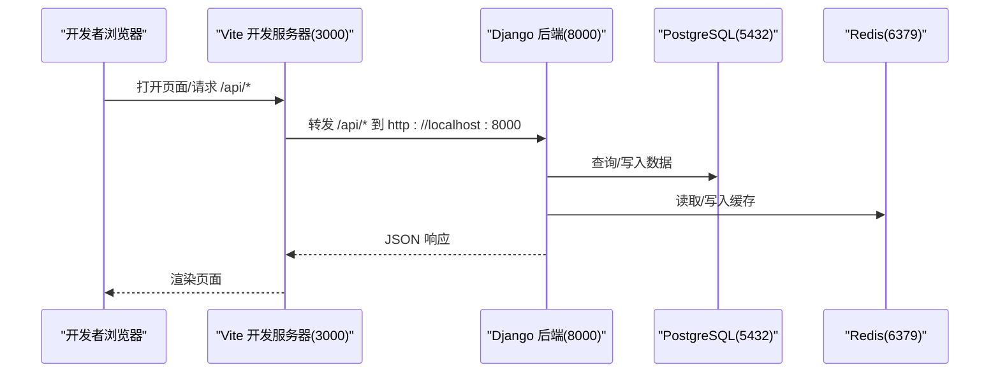
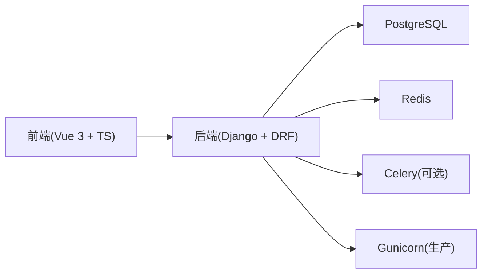

# 开发环境搭建

<cite>
**本文引用的文件**   
- [backend/requirements.txt](file://backend/requirements.txt)
- [frontend/package.json](file://frontend/package.json)
- [backend/config/settings.py](file://backend/config/settings.py)
- [backend/local_settings.py](file://backend/local_settings.py)
- [backend/manage.py](file://backend/manage.py)
- [backend/Dockerfile](file://backend/Dockerfile)
- [backend/docker-compose.yml](file://backend/docker-compose.yml)
- [frontend/vite.config.ts](file://frontend/vite.config.ts)
- [.gitignore](file://.gitignore)
- [.ai/constitution.md](file://.ai/constitution.md)
</cite>

## 目录
1. [简介](#简介)
2. [项目结构](#项目结构)
3. [核心组件](#核心组件)
4. [架构总览](#架构总览)
5. [详细组件分析](#详细组件分析)
6. [依赖关系分析](#依赖关系分析)
7. [性能注意事项](#性能注意事项)
8. [故障排查指南](#故障排查指南)
9. [结论](#结论)
10. [附录](#附录)

## 简介
本指南面向首次接触 MetaData002 项目的开发者，目标是帮助你在本地快速搭建可运行的开发与调试环境。内容涵盖：
- Python 虚拟环境的创建与后端依赖安装（Django、DRF、psycopg2、Redis、Celery、Gunicorn 等）
- Node.js 环境与前端依赖的安装（Vue 3 + TypeScript + Vite）
- PostgreSQL 数据库与 Redis 缓存的配置方法
- Docker 容器化部署的完整步骤
- 环境变量配置与配置文件管理
- IDE 推荐设置与插件配置
- 常见环境问题的排查与解决方案

## 项目结构
本项目采用前后端分离架构：
- backend：基于 Django + DRF 的后端服务，使用 PostgreSQL 作为主数据库，Redis 作为缓存，支持 Celery 异步任务与 Gunicorn 生产部署
- frontend：基于 Vue 3 + TypeScript + Vite 的前端应用，通过 Vite 代理访问后端 API
- docker-compose：一键拉起 PostgreSQL、Redis 与后端服务
- local_settings：开发环境覆盖配置（SQLite3 + 内存缓存 + CORS 全开）

图表来源
- [backend/config/settings.py:56-74](file://backend/config/settings.py#L56-L74)
- [frontend/vite.config.ts:12-21](file://frontend/vite.config.ts#L12-L21)
- [backend/docker-compose.yml:6-54](file://backend/docker-compose.yml#L6-L54)

章节来源
- [backend/config/settings.py:1-123](file://backend/config/settings.py#L1-L123)
- [frontend/vite.config.ts:1-22](file://frontend/vite.config.ts#L1-L22)
- [backend/docker-compose.yml:1-58](file://backend/docker-compose.yml#L1-L58)

## 核心组件
- 后端运行入口与命令：manage.py 设置 DJANGO_SETTINGS_MODULE 为 config.settings
- 配置中心：config/settings.py 集中管理数据库、缓存、中间件、DRF、Spectacular、AI 接口等
- 开发覆盖：local_settings.py 在导入 settings 后覆盖数据库为 SQLite3、缓存为内存、开启 CORS
- 容器化：Dockerfile 构建 Python 镜像；docker-compose.yml 编排 PostgreSQL、Redis、后端服务

章节来源
- [backend/manage.py:1-22](file://backend/manage.py#L1-L22)
- [backend/config/settings.py:1-123](file://backend/config/settings.py#L1-L123)
- [backend/local_settings.py:1-26](file://backend/local_settings.py#L1-L26)
- [backend/Dockerfile:1-20](file://backend/Dockerfile#L1-L20)
- [backend/docker-compose.yml:1-58](file://backend/docker-compose.yml#L1-L58)

## 架构总览
下图展示了开发环境下的请求流转与依赖关系：
- 前端通过 Vite dev server 提供静态资源与热更新，并将 /api 请求代理到后端 8000 端口
- 后端 Django 接收请求，读写 PostgreSQL，使用 Redis 做缓存
- 开发时可通过 local_settings 切换为 SQLite3 与内存缓存，简化依赖

图表来源
- [frontend/vite.config.ts:12-21](file://frontend/vite.config.ts#L12-L21)
- [backend/config/settings.py:56-74](file://backend/config/settings.py#L56-L74)
- [backend/docker-compose.yml:32-54](file://backend/docker-compose.yml#L32-L54)

## 详细组件分析

### 后端环境搭建（Python + Django + DRF）
- 版本要求
  - Python 3.12+（Docker 基础镜像为 python:3.12-slim）
  - Django >=5.0,<5.1
  - djangorestframework >=3.14,<4.0
  - psycopg2-binary >=2.9（连接 PostgreSQL）
  - redis >=5.0（缓存）
  - celery >=5.3（异步任务）
  - gunicorn >=21.2（生产 WSGI）
  - openpyxl >=3.1（Excel 处理）
  - python-dotenv >=1.0（可选的环境变量加载）

- 创建虚拟环境并安装依赖
  - 在项目根目录或 backend 目录下创建虚拟环境
  - 安装后端依赖（参考 requirements.txt）

- 启动后端服务
  - 使用 manage.py 运行开发服务器
  - 默认监听 0.0.0.0:8000（容器内），本地开发建议绑定 localhost:8000

- 数据库与缓存
  - 默认使用 PostgreSQL（DB_HOST/PORT/NAME/USER/PASSWORD）
  - 缓存默认使用 Redis（REDIS_HOST/REDIS_PORT）
  - 开发环境可通过 local_settings.py 自动切换到 SQLite3 + 内存缓存

章节来源
- [backend/requirements.txt:1-11](file://backend/requirements.txt#L1-L11)
- [backend/manage.py:1-22](file://backend/manage.py#L1-L22)
- [backend/config/settings.py:56-74](file://backend/config/settings.py#L56-L74)
- [backend/local_settings.py:1-26](file://backend/local_settings.py#L1-L26)

### 前端环境搭建（Node.js + Vue 3 + Vite）
- 版本要求
  - Node.js 建议使用 LTS（v18+）
  - 包管理器：npm 或 pnpm/yarn（任选其一）

- 安装依赖
  - 进入 frontend 目录
  - 安装依赖（package.json 中定义了 Vue、Ant Design Vue、Axios、Pinia、Vite、TypeScript 等）

- 启动前端开发服务器
  - 默认端口 3000
  - 通过 Vite 代理将 /api 请求转发至后端 8000

章节来源
- [frontend/package.json:1-29](file://frontend/package.json#L1-L29)
- [frontend/vite.config.ts:1-22](file://frontend/vite.config.ts#L1-L22)

### 数据库配置（PostgreSQL）
- 本地安装 PostgreSQL
  - 确保服务已启动，端口默认 5432
  - 创建数据库与用户（或使用 docker-compose 提供的服务）

- 环境变量
  - DB_NAME、DB_USER、DB_PASSWORD、DB_HOST、DB_PORT
  - 若未设置，settings.py 使用默认值（metadata/metadata/metadata123/localhost/5432）

- 开发环境覆盖
  - local_settings.py 会将 DATABASES 覆盖为 SQLite3（dev.db），便于无外部依赖开发

章节来源
- [backend/config/settings.py:56-66](file://backend/config/settings.py#L56-L66)
- [backend/local_settings.py:3-9](file://backend/local_settings.py#L3-L9)

### 缓存配置（Redis）
- 本地安装 Redis
  - 确保服务已启动，端口默认 6379

- 环境变量
  - REDIS_HOST、REDIS_PORT
  - 若未设置，settings.py 使用默认值（localhost/6379）

- 开发环境覆盖
  - local_settings.py 将 CACHES 覆盖为内存缓存（LocMemCache），无需 Redis

章节来源
- [backend/config/settings.py:68-74](file://backend/config/settings.py#L68-L74)
- [backend/local_settings.py:11-15](file://backend/local_settings.py#L11-L15)

### Docker 容器化部署
- 前置条件
  - 安装 Docker 与 Docker Compose

- 启动服务
  - 在 backend 目录执行 docker-compose up
  - 会自动拉起 PostgreSQL、Redis、后端服务（包含 migrate 与 runserver）

- 端口映射
  - PostgreSQL: 5432
  - Redis: 6379
  - 后端: 8000

- 数据持久化
  - PostgreSQL 数据卷 postgres_data 持久化

章节来源
- [backend/Dockerfile:1-20](file://backend/Dockerfile#L1-L20)
- [backend/docker-compose.yml:1-58](file://backend/docker-compose.yml#L1-L58)

### 环境变量与配置文件管理
- 环境变量清单
  - DJANGO_SECRET_KEY：Django 密钥
  - DEBUG：是否启用调试模式
  - ALLOWED_HOSTS：允许的域名列表
  - DB_*：数据库连接参数
  - REDIS_*：缓存连接参数
  - AI_API_BASE/AI_API_KEY/AI_MODEL/AI_TIMEOUT：AI 服务配置（可选）
  - ARCHIVE_AUTO_REFRESH_MINUTES：档案刷新间隔（分钟）

- 配置文件优先级
  - settings.py 为基础配置
  - local_settings.py 在末尾被动态导入，用于覆盖开发环境配置

- .env 文件
  - .gitignore 排除了 .env、.env.local、.env.*.local，避免敏感信息泄露

章节来源
- [backend/config/settings.py:6-8](file://backend/config/settings.py#L6-L8)
- [backend/config/settings.py:118-123](file://backend/config/settings.py#L118-L123)
- [.gitignore:21-24](file://.gitignore#L21-L24)

### IDE 推荐设置与插件配置
- VS Code 推荐
  - Python 扩展（Pylance、Django、Flake8/Ruff）
  - Vue 语言支持与 Volar
  - TypeScript 支持
  - Docker 扩展（可选）
  - GitLens（代码历史与对比）

- PyCharm 推荐
  - Django 框架支持
  - Database 工具（连接 PostgreSQL/Redis）
  - Docker 集成（可选）

- 通用建议
  - 配置 Linter 与 Formatter（Black、isort、eslint、prettier）
  - 启用 Git Hooks（如 pre-commit）进行代码质量检查

[本节为通用建议，不直接分析具体文件]

## 依赖关系分析
- 后端依赖
  - Django、DRF、django-filter、drf-spectacular、psycopg2-binary、redis、celery、gunicorn、openpyxl、python-dotenv

- 前端依赖
  - Vue 3、Ant Design Vue、Axios、Pinia、Vue Router、Vite、TypeScript

- 运行时依赖
  - PostgreSQL、Redis

图表来源
- [backend/requirements.txt:1-11](file://backend/requirements.txt#L1-L11)
- [frontend/package.json:11-27](file://frontend/package.json#L11-L27)

章节来源
- [backend/requirements.txt:1-11](file://backend/requirements.txt#L1-L11)
- [frontend/package.json:1-29](file://frontend/package.json#L1-L29)

## 性能注意事项
- 开发环境建议使用 SQLite3 + 内存缓存以减少外部依赖
- 生产环境务必使用 PostgreSQL + Redis，并合理配置连接池与缓存过期策略
- 合理使用分页与过滤（DRF 已内置 StandardPagination 与 FilterBackend）
- 对大对象或频繁读写的场景考虑引入缓存层（如 Redis）

[本节为通用指导，不直接分析具体文件]

## 故障排查指南
- 无法连接 PostgreSQL
  - 检查 DB_HOST/DB_PORT/DB_NAME/DB_USER/DB_PASSWORD 是否正确
  - 确认 PostgreSQL 服务已启动且端口未被占用
  - 使用 docker-compose 启动时可跳过本地安装

- 无法连接 Redis
  - 检查 REDIS_HOST/REDIS_PORT 是否正确
  - 确认 Redis 服务已启动
  - 开发环境可切换为内存缓存（local_settings.py）

- 前端无法访问后端 API
  - 确认后端服务在 8000 端口运行
  - 检查 Vite 代理配置（/api -> http://localhost:8000）
  - 如需跨域，确保后端允许对应域名（ALLOWED_HOSTS/CORS）

- 权限或安全错误
  - 检查 DJANGO_SECRET_KEY 是否设置
  - 确认 ALLOWED_HOSTS 包含当前域名
  - 调试模式下可查看详细错误信息

章节来源
- [backend/config/settings.py:6-8](file://backend/config/settings.py#L6-L8)
- [backend/config/settings.py:56-74](file://backend/config/settings.py#L56-L74)
- [frontend/vite.config.ts:12-21](file://frontend/vite.config.ts#L12-L21)

## 结论
通过以上步骤，你可以在本地快速搭建 MetaData002 的开发环境，包括后端、数据库、缓存、前端与容器化部署。建议在开发初期使用 SQLite3 + 内存缓存简化依赖，逐步过渡到 PostgreSQL + Redis 的生产环境配置。遇到问题时，优先检查环境变量与服务状态，并利用调试模式定位问题。

[本节为总结性内容，不直接分析具体文件]

## 附录
- 技术栈概览（来自项目宪法）
  - 后端：Python 3.13 + Django 6.0.7 + DRF + PostgreSQL
  - 前端：Vue 3 + TypeScript + Ant Design Vue 4.x + Vite
  - ER图：@antv/x6 v2.19.2
  - Excel解析：openpyxl
  - AI服务：OpenAI 兼容接口 + 启发式降级

章节来源
- [.ai/constitution.md:10-16](file://.ai/constitution.md#L10-L16)