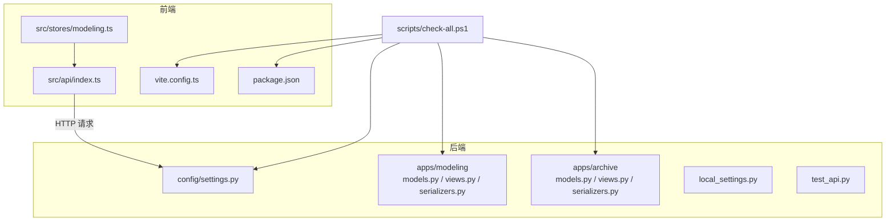
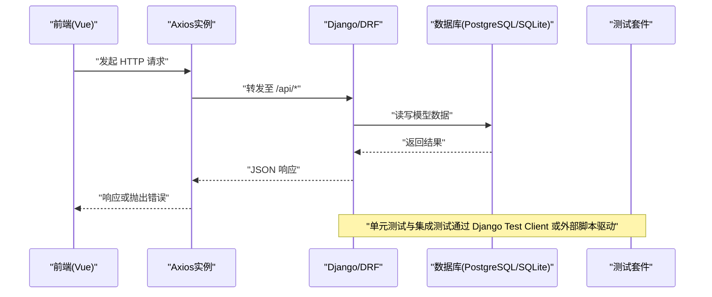
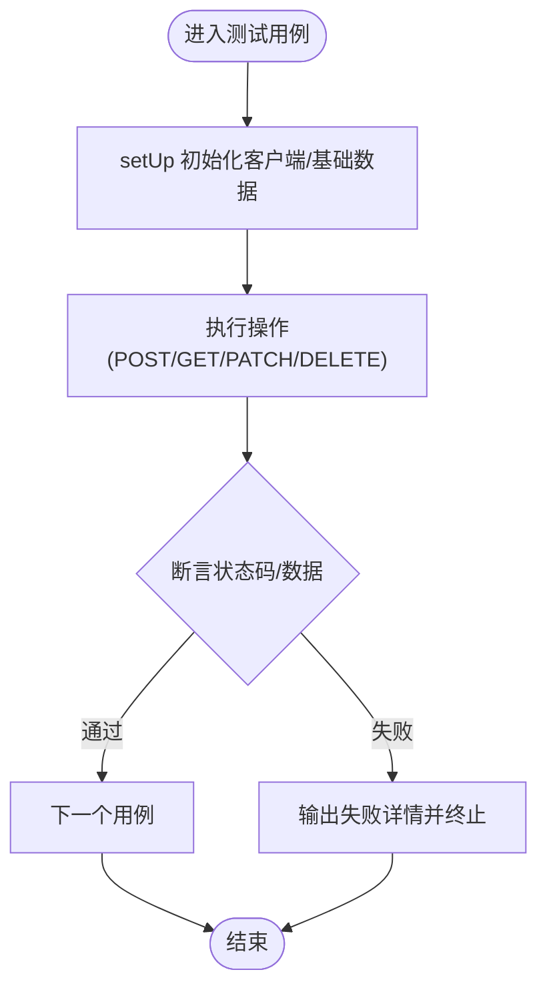
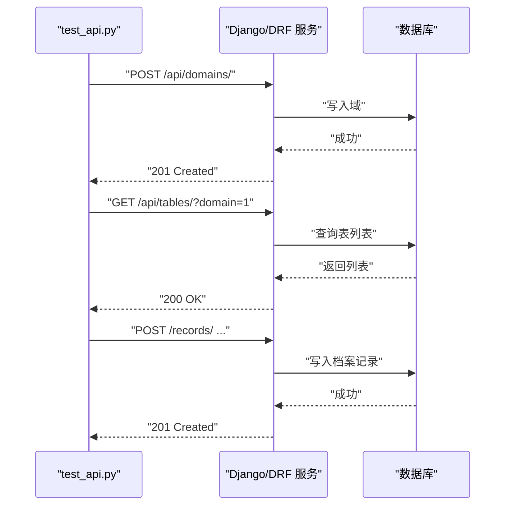
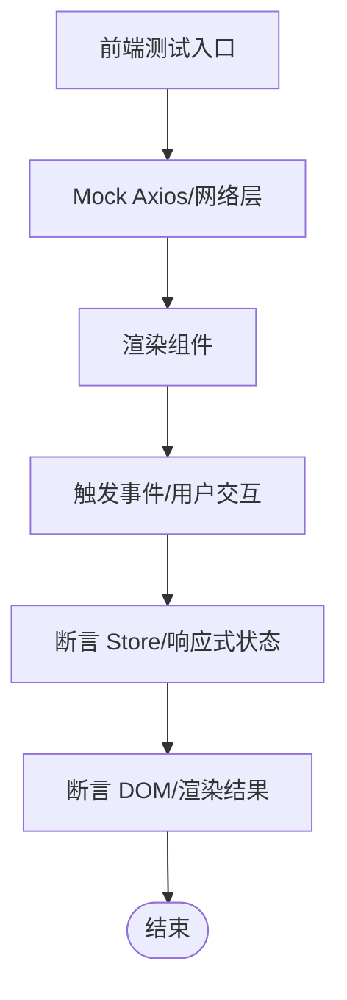
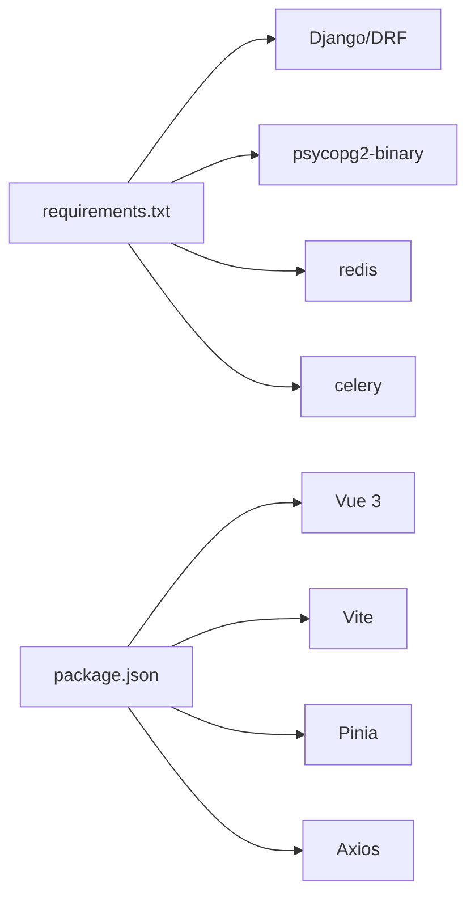

# 测试指南

<cite>
**本文引用的文件**   
- [backend/apps/archive/tests.py](file://backend/apps/archive/tests.py)
- [backend/apps/modeling/tests.py](file://backend/apps/modeling/tests.py)
- [backend/test_api.py](file://backend/test_api.py)
- [backend/config/settings.py](file://backend/config/settings.py)
- [backend/local_settings.py](file://backend/local_settings.py)
- [backend/requirements.txt](file://backend/requirements.txt)
- [frontend/package.json](file://frontend/package.json)
- [frontend/vite.config.ts](file://frontend/vite.config.ts)
- [frontend/src/api/index.ts](file://frontend/src/api/index.ts)
- [frontend/src/stores/modeling.ts](file://frontend/src/stores/modeling.ts)
- [scripts/check-all.ps1](file://scripts/check-all.ps1)
</cite>

## 更新摘要
**变更内容**   
- 新增了条件字段null处理、引用关系条件传递、明细关系隔离和API契约验证场景的测试覆盖
- 增强了FieldMapping模型的conditions字段验证测试
- 完善了reference和detail关系类型的条件传递逻辑测试
- 扩展了同步引擎的条件过滤功能测试

## 目录
1. [简介](#简介)
2. [项目结构](#项目结构)
3. [核心组件](#核心组件)
4. [架构总览](#架构总览)
5. [详细组件分析](#详细组件分析)
6. [依赖分析](#依赖分析)
7. [性能考虑](#性能考虑)
8. [故障排查指南](#故障排查指南)
9. [结论](#结论)
10. [附录](#附录)

## 简介
本指南面向 MetaData002 项目的测试实践，覆盖后端单元测试、集成测试、前端测试策略与数据准备、Mock 策略、覆盖率要求与报告生成、持续集成自动化以及性能与负载测试的实施方法。文档基于仓库现有测试代码与配置进行系统化梳理，并提供可操作的步骤与最佳实践建议。

**最新更新**：新增了针对FieldMapping模型conditions字段的全面测试覆盖，包括null值处理、引用关系条件传递、明细关系隔离等关键场景的验证。

## 项目结构
后端采用 Django + DRF，包含 modeling（建模）与 archive（档案）两个应用；前端为 Vue 3 + Vite + Pinia + Axios。测试相关的关键位置：
- 后端单元测试位于各应用的 tests.py
- 后端 API 集成测试脚本位于 backend/test_api.py
- 前端构建与类型检查通过 Vite 与 vue-tsc 执行
- CI 脚本 scripts/check-all.ps1 统一编排前后端检查与测试

**图表来源** 
- [backend/config/settings.py:1-123](file://backend/config/settings.py#L1-L123)
- [backend/local_settings.py:1-25](file://backend/local_settings.py#L1-L25)
- [backend/test_api.py:1-155](file://backend/test_api.py#L1-L155)
- [frontend/vite.config.ts:1-21](file://frontend/vite.config.ts#L1-L21)
- [frontend/package.json:1-29](file://frontend/package.json#L1-L29)
- [scripts/check-all.ps1:44-89](file://scripts/check-all.ps1#L44-L89)

**章节来源**
- [backend/config/settings.py:1-123](file://backend/config/settings.py#L1-L123)
- [backend/local_settings.py:1-25](file://backend/local_settings.py#L1-L25)
- [frontend/vite.config.ts:1-21](file://frontend/vite.config.ts#L1-L21)
- [frontend/package.json:1-29](file://frontend/package.json#L1-L29)
- [scripts/check-all.ps1:44-89](file://scripts/check-all.ps1#L44-L89)

## 核心组件
- 后端模型层
  - modeling：DataSource、Domain、Table、FieldGroup、StandardField、ComputedField、FieldMapping、DetailTableConfig 等
  - archive：Archive、ArchiveRecord、ArchiveRecordVersion、ArchiveSyncLog、ArchiveApi、ArchiveOperationLog 等
- 后端测试套件
  - apps/modeling/tests.py：模型导入、URL 解析、CRUD 冒烟测试
  - apps/archive/tests.py：模型导入、URL 解析、记录访问、版本追踪、变更日志、API 模型、**新增条件字段测试**
- 后端集成测试
  - test_api.py：对 Modeling 与 Archive 的端到端 API 调用流程验证
- 前端基础
  - src/api/index.ts：Axios 实例与错误拦截器
  - src/stores/modeling.ts：Pinia Store 示例
  - vite.config.ts：开发服务器与代理配置
  - package.json：脚本与依赖声明

**章节来源**
- [backend/apps/modeling/tests.py:1-567](file://backend/apps/modeling/tests.py#L1-L567)
- [backend/apps/archive/tests.py:1-1151](file://backend/apps/archive/tests.py#L1-L1151)
- [backend/test_api.py:1-155](file://backend/test_api.py#L1-L155)
- [frontend/src/api/index.ts:1-22](file://frontend/src/api/index.ts#L1-L22)
- [frontend/src/stores/modeling.ts:1-14](file://frontend/src/stores/modeling.ts#L1-L14)
- [frontend/vite.config.ts:1-21](file://frontend/vite.config.ts#L1-L21)
- [frontend/package.json:1-29](file://frontend/package.json#L1-L29)

## 架构总览
下图展示从前端到后端的典型请求链路，以及测试在其中的介入点。

**图表来源** 
- [frontend/src/api/index.ts:1-22](file://frontend/src/api/index.ts#L1-L22)
- [backend/config/settings.py:1-123](file://backend/config/settings.py#L1-L123)
- [backend/test_api.py:1-155](file://backend/test_api.py#L1-L155)

## 详细组件分析

### 后端单元测试：Django 模型与视图
- 模型导入校验：确保所有模型具备 _meta，避免未注册或命名错误
- URL 路由解析：验证关键端点路径与 reverse 映射一致
- CRUD 冒烟测试：创建、列表、检索、更新、删除、唯一性约束
- 业务规则验证：如表主键唯一、主表切换逻辑、字段分组层级、档案双层存储与版本追踪、变更日志完整性

**新增测试覆盖**：
- **条件字段null处理测试**：验证FieldMapping模型的conditions字段不接受null值，确保API契约一致性
- **引用关系条件传递测试**：测试reference类型映射的条件透传到查询函数
- **明细关系隔离测试**：确保detail类型映射不传递conditions参数
- **API契约验证测试**：验证空数组、列表等不同输入格式的处理

**图表来源** 
- [backend/apps/modeling/tests.py:65-118](file://backend/apps/modeling/tests.py#L65-L118)
- [backend/apps/archive/tests.py:50-73](file://backend/apps/archive/tests.py#L50-L73)

**章节来源**
- [backend/apps/modeling/tests.py:1-567](file://backend/apps/modeling/tests.py#L1-L567)
- [backend/apps/archive/tests.py:1-1151](file://backend/apps/archive/tests.py#L1-L1151)

### 后端集成测试：API 端点与数据库操作
- 使用独立脚本 test_api.py 启动服务后进行真实 HTTP 调用
- 覆盖 Domain、Table、Field、FieldGroup、Archive Record、版本对比与回滚、操作日志等关键流程
- 通过统一的 check 函数统计通过/失败数量，便于快速定位问题

**图表来源** 
- [backend/test_api.py:1-155](file://backend/test_api.py#L1-L155)

**章节来源**
- [backend/test_api.py:1-155](file://backend/test_api.py#L1-L155)

### 序列化器测试（建议）
- 针对 DRF Serializer 的输入校验、默认值、嵌套序列化、反序列化的边界条件编写用例
- 覆盖非法输入、必填字段缺失、枚举值越界、JSON 字段结构异常等场景
- 结合模型约束（唯一性、外键、JSON 字段）进行端到端断言

**新增序列化器验证**：
- FieldMapping序列化器的conditions字段验证
- DetailTableConfig序列化器的条件字段处理
- 不同relation_type下的序列化行为差异

[本节为通用指导，不直接分析具体文件]

### 前端测试策略：Vue 组件、API 调用、状态管理
- 组件测试：建议使用 @vue/test-utils 对单文件组件进行渲染与交互断言
- API 调用测试：对 axios 实例进行拦截与 Mock，验证请求参数、错误处理分支
- 状态管理测试：对 Pinia Store 的 ref 变化与副作用进行断言
- 当前仓库未包含前端测试框架与用例，建议在后续迭代中引入 Jest/Vitest + Vue Testing Library

[本节为通用指导，不直接分析具体文件]

**章节来源**
- [frontend/src/api/index.ts:1-22](file://frontend/src/api/index.ts#L1-L22)
- [frontend/src/stores/modeling.ts:1-14](file://frontend/src/stores/modeling.ts#L1-L14)
- [frontend/vite.config.ts:1-21](file://frontend/vite.config.ts#L1-L21)
- [frontend/package.json:1-29](file://frontend/package.json#L1-L29)

### 新增测试覆盖详解：条件字段与关系映射

#### FieldMappingConditionsApiTest 类
该类专门测试FieldMapping模型的conditions字段的API契约：

- **null值拒绝测试**：验证后端不接受null值，返回400状态码
- **空数组接受测试**：验证空数组作为无条件情况被正确接受
- **条件列表测试**：验证有效的条件列表能够正确保存

#### ReferenceConditionsSyncTest 类
该类测试引用关系的条件传递机制：

- **条件透传测试**：验证reference类型映射的条件能够透传到查询函数
- **无条件处理测试**：验证无条件的reference映射传递None
- **detail关系隔离测试**：确保detail类型映射不传递conditions参数

#### DetailSyncEngineTest 类
该类测试明细同步引擎的功能：

- **代表行写入测试**：验证明细同步时代表行的正确写入
- **聚合变更日志测试**：测试批量同步产生的聚合变更条目
- **条件SQL构建测试**：验证复杂条件的SQL生成逻辑

**章节来源**
- [backend/apps/archive/tests.py:1031-1151](file://backend/apps/archive/tests.py#L1031-L1151)
- [backend/apps/modeling/models.py:519-625](file://backend/apps/modeling/models.py#L519-L625)

## 依赖分析
- 后端依赖：Django、DRF、django-filter、drf-spectacular、psycopg2-binary、redis、celery、gunicorn、python-dotenv、openpyxl
- 前端依赖：Vue 3、Vite、Pinia、Axios、Ant Design Vue、X6 图形库
- 测试工具链：Django TestCase、DRF APIClient、外部脚本、vue-tsc、Vite 构建

**图表来源** 
- [backend/requirements.txt:1-11](file://backend/requirements.txt#L1-L11)
- [frontend/package.json:1-29](file://frontend/package.json#L1-L29)

**章节来源**
- [backend/requirements.txt:1-11](file://backend/requirements.txt#L1-L11)
- [frontend/package.json:1-29](file://frontend/package.json#L1-L29)

## 性能考虑
- 数据库索引：archive 模型已定义常用查询索引，确保列表与过滤性能
- 分页与过滤：DRF 分页与 django-filter 后端启用，避免大结果集传输
- 缓存：Redis 缓存用于热点数据，测试环境可使用内存缓存加速
- 异步任务：Celery 可用于耗时同步与批量操作，测试中需 Mock 或禁用

**新增性能优化**：
- 条件字段的JSONField查询性能优化
- 关系映射的条件过滤减少不必要的数据传输
- 明细同步的聚合变更日志减少数据库写入次数

[本节为通用指导，不直接分析具体文件]

## 故障排查指南
- 常见后端问题
  - 数据库连接失败：检查 settings 与 local_settings 中的 DATABASES 配置
  - Redis 不可用：CACHES 配置与本地缓存回退
  - CORS 跨域：开发环境启用 corsheaders 中间件
- 常见前端问题
  - 代理未生效：确认 vite.config.ts 的 proxy 配置与端口
  - Axios 错误拦截：检查响应拦截器错误消息提取逻辑
- 运行与诊断
  - 使用 scripts/check-all.ps1 统一执行 Django check、测试、TypeScript 检查与构建
  - 查看 test_api.py 输出统计，定位失败的端点与期望状态码

**新增故障排查**：
- FieldMapping conditions字段null值错误：检查前端是否正确发送空数组而非null
- 引用关系条件过滤失效：验证conditions参数的传递和解析逻辑
- 明细同步条件不生效：检查detail_config中的conditions配置

**章节来源**
- [backend/config/settings.py:1-123](file://backend/config/settings.py#L1-L123)
- [backend/local_settings.py:1-25](file://backend/local_settings.py#L1-L25)
- [frontend/vite.config.ts:1-21](file://frontend/vite.config.ts#L1-L21)
- [frontend/src/api/index.ts:1-22](file://frontend/src/api/index.ts#L1-L22)
- [scripts/check-all.ps1:44-89](file://scripts/check-all.ps1#L44-L89)

## 结论
本项目已具备完善的后端单元测试与 API 集成测试基础，覆盖了建模与档案两大核心领域的关键流程。**最新增强的测试覆盖**重点解决了FieldMapping模型的conditions字段处理、引用关系条件传递、明细关系隔离等关键场景的验证问题。前端测试尚未落地，建议尽快引入现代前端测试框架以保障 UI 与状态管理的稳定性。通过统一脚本与清晰的测试分层，可在持续集成中实现高效的自动化质量门禁。

**新增测试价值**：
- 确保了API契约的一致性和向后兼容性
- 防止了条件字段的null值导致的运行时错误
- 验证了不同类型关系映射的正确行为
- 提高了同步引擎的可靠性和性能

[本节为总结性内容，不直接分析具体文件]

## 附录

### 测试数据准备与 Mock 策略
- 后端
  - 使用 Django TestCase.setUp 构造最小数据集，确保每个用例自包含
  - 对第三方服务（AI、外部数据库）使用 unittest.mock.patch 或 DRF 的 APIClient 隔离
  - 对 Celery 任务使用 eager 模式或禁用以避免异步影响
- 前端
  - 使用 vitest/jest 的 mock 能力拦截 axios 请求，返回固定响应
  - 对 Pinia Store 使用 createTestingPinia 或手动重置状态

**新增Mock策略**：
- FieldMapping条件字段的Mock：模拟不同的conditions输入格式
- 关系映射的Mock：区分reference和detail类型的行为差异
- 同步引擎的Mock：隔离外部数据库查询和条件过滤逻辑

[本节为通用指导，不直接分析具体文件]

### 测试覆盖率要求与报告生成
- 后端覆盖率：建议使用 coverage.py 收集 Django 测试覆盖率，设置阈值（如行覆盖率≥80%）
- 前端覆盖率：建议使用 Vitest/Jest 的内置覆盖率插件，生成 HTML 报告
- 报告输出：将覆盖率报告纳入 CI 阶段，失败时阻断合并

**新增覆盖率关注点**：
- FieldMapping序列化器的conditions字段处理逻辑
- 关系映射的条件传递和过滤逻辑
- 同步引擎的条件SQL构建和执行逻辑

[本节为通用指导，不直接分析具体文件]

### 持续集成中的测试自动化配置
- 使用 scripts/check-all.ps1 统一执行：
  - Django check
  - Django 测试（apps.modeling、apps.archive）
  - 前端 TypeScript 检查（vue-tsc --noEmit）
  - 前端构建检查（vite build --mode production）
- 建议在 GitHub Actions/GitLab CI 中复现相同步骤，确保跨平台一致性

**章节来源**
- [scripts/check-all.ps1:44-89](file://scripts/check-all.ps1#L44-L89)

### 性能测试与负载测试实施方法
- 后端
  - 使用 Locust 或 k6 模拟并发请求，重点压测列表、批量创建、版本对比接口
  - 监控数据库慢查询与 Redis 命中率，优化索引与缓存策略
- 前端
  - 使用 Lighthouse 评估首屏加载与交互性能
  - 对大数据量页面进行虚拟滚动与分页优化

**新增性能测试场景**：
- 大量FieldMapping记录的conditions字段查询性能
- 复杂条件过滤的数据库查询效率
- 明细同步时的批量数据处理性能

[本节为通用指导，不直接分析具体文件]