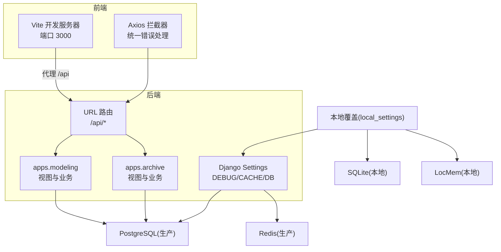
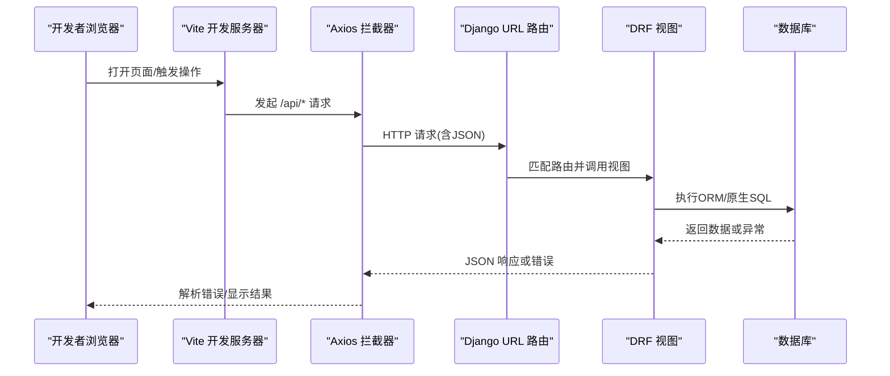
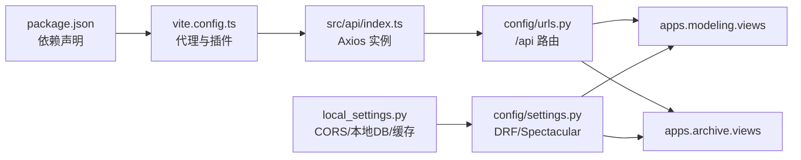

# 调试与工具

<cite>
**本文引用的文件**   
- [backend/config/settings.py](file://backend/config/settings.py)
- [backend/local_settings.py](file://backend/local_settings.py)
- [backend/manage.py](file://backend/manage.py)
- [backend/config/urls.py](file://backend/config/urls.py)
- [backend/apps/modeling/views.py](file://backend/apps/modeling/views.py)
- [backend/apps/archive/views.py](file://backend/apps/archive/views.py)
- [backend/test_api.py](file://backend/test_api.py)
- [frontend/vite.config.ts](file://frontend/vite.config.ts)
- [frontend/package.json](file://frontend/package.json)
- [frontend/src/api/index.ts](file://frontend/src/api/index.ts)
- [frontend/src/utils/apiError.ts](file://frontend/src/utils/apiError.ts)
</cite>

## 目录
1. [简介](#简介)
2. [项目结构](#项目结构)
3. [核心组件](#核心组件)
4. [架构总览](#架构总览)
5. [详细组件分析](#详细组件分析)
6. [依赖关系分析](#依赖关系分析)
7. [性能考虑](#性能考虑)
8. [故障排查指南](#故障排查指南)
9. [结论](#结论)
10. [附录](#附录)

## 简介
本指南面向 MetaData002 项目的开发与运维人员，提供覆盖后端（Django/DRF）、前端（Vue/Vite）、数据库、API 以及错误处理与性能监控的完整调试方法与技巧。内容基于仓库中的实际配置与实现，帮助快速定位问题、优化查询、提升稳定性，并给出生产环境的安全注意事项。

## 项目结构
本项目采用前后端分离架构：
- 后端：Django + DRF，模块化应用 apps.modeling 与 apps.archive，统一路由在 config.urls 下挂载到 /api。
- 前端：Vue 3 + Vite，开发服务器通过代理将 /api 请求转发至后端 8000 端口。
- 配置：settings.py 管理全局设置，local_settings.py 用于本地开发覆盖（SQLite、内存缓存、CORS）。

图表来源
- [frontend/vite.config.ts:12-21](file://frontend/vite.config.ts#L12-L21)
- [backend/config/urls.py:4-8](file://backend/config/urls.py#L4-L8)
- [backend/config/settings.py:56-74](file://backend/config/settings.py#L56-L74)
- [backend/local_settings.py:3-15](file://backend/local_settings.py#L3-L15)

章节来源
- [frontend/vite.config.ts:1-22](file://frontend/vite.config.ts#L1-L22)
- [backend/config/settings.py:1-123](file://backend/config/settings.py#L1-L123)
- [backend/local_settings.py:1-26](file://backend/local_settings.py#L1-L26)
- [backend/config/urls.py:1-9](file://backend/config/urls.py#L1-L9)

## 核心组件
- Django 运行入口与配置加载
  - manage.py 设置 DJANGO_SETTINGS_MODULE 为 config.settings，并通过 execute_from_command_line 启动命令。
  - settings.py 定义 DEBUG、数据库、缓存、中间件、REST_FRAMEWORK、SPECTACULAR 等关键配置。
  - local_settings.py 在本地覆盖数据库为 SQLite、缓存为 LocMem，并启用 CORS 中间件。
- 路由与 API
  - config.urls 将 /admin 和 /api 下的 modeling、archive 子路由集中管理。
- 前端开发服务器与代理
  - vite.config.ts 配置开发端口 3000，并将 /api 代理到 http://localhost:8000。
- 前端网络与错误处理
  - src/api/index.ts 使用 axios 创建实例，统一超时与响应拦截，提取结构化错误消息。
  - src/utils/apiError.ts 从多种 DRF 错误格式中提取可读消息。

章节来源
- [backend/manage.py:7-17](file://backend/manage.py#L7-L17)
- [backend/config/settings.py:6-8,56-74,92-107:6-8](file://backend/config/settings.py#L6-L8)
- [backend/local_settings.py:3-26](file://backend/local_settings.py#L3-L26)
- [backend/config/urls.py:4-8](file://backend/config/urls.py#L4-L8)
- [frontend/vite.config.ts:12-21](file://frontend/vite.config.ts#L12-L21)
- [frontend/src/api/index.ts:3-19](file://frontend/src/api/index.ts#L3-L19)
- [frontend/src/utils/apiError.ts:6-28](file://frontend/src/utils/apiError.ts#L6-L28)

## 架构总览
下图展示一次典型的前端发起、后端处理、数据库访问的调用链，便于理解调试切入点。

图表来源
- [frontend/vite.config.ts:12-21](file://frontend/vite.config.ts#L12-L21)
- [frontend/src/api/index.ts:9-19](file://frontend/src/api/index.ts#L9-L19)
- [backend/config/urls.py:4-8](file://backend/config/urls.py#L4-L8)
- [backend/apps/modeling/views.py:31-78](file://backend/apps/modeling/views.py#L31-L78)
- [backend/apps/archive/views.py:106-145](file://backend/apps/archive/views.py#L106-L145)

## 详细组件分析

### 后端调试方法（Django/DRF）
- 调试模式与日志
  - DEBUG 由环境变量控制，开启后可获得详细的错误页与堆栈。
  - 各模块通过 logging.getLogger(__name__) 输出信息，便于按模块过滤日志。
- SQL 查询与优化
  - 使用 select_related/prefetch_related 减少 N+1 查询。
  - 对高频查询字段建立索引；利用数据库 EXPLAIN/EXPLAIN ANALYZE 分析慢查询。
  - 动态连接测试接口可验证多数据库类型连通性，便于排查连接参数与驱动问题。
- 常用命令
  - python manage.py runserver 启动服务（默认 8000）。
  - python manage.py shell 交互式调试 ORM 与业务逻辑。
  - python manage.py migrate 同步模型变更。
  - python manage.py test 运行测试。

章节来源
- [backend/config/settings.py:6-8](file://backend/config/settings.py#L6-L8)
- [backend/apps/modeling/views.py:148-200](file://backend/apps/modeling/views.py#L148-L200)
- [backend/apps/archive/views.py:300-311](file://backend/apps/archive/views.py#L300-L311)
- [backend/apps/modeling/views.py:531-532](file://backend/apps/modeling/views.py#L531-L532)
- [backend/apps/modeling/views.py:734-735](file://backend/apps/modeling/views.py#L734-L735)

### 前端调试技术（Vue/Vite/Axios）
- 浏览器开发者工具
  - Network 面板查看请求/响应、状态码、耗时、Payload。
  - Console 面板查看 JS 错误与日志。
  - Sources 面板断点调试 Vue 组件与方法。
- Vue DevTools
  - 安装浏览器扩展，检查组件树、状态、事件与路由。
- 网络请求调试
  - Vite 代理确保 /api 指向后端，避免跨域问题。
  - Axios 拦截器统一捕获错误，保留原始 response 以便上层读取结构化错误。
  - apiError.ts 支持解析 DRF 的多类错误格式，便于前端提示。

章节来源
- [frontend/vite.config.ts:12-21](file://frontend/vite.config.ts#L12-L21)
- [frontend/src/api/index.ts:3-19](file://frontend/src/api/index.ts#L3-L19)
- [frontend/src/utils/apiError.ts:6-28](file://frontend/src/utils/apiError.ts#L6-L28)

### 数据库调试与优化
- 慢查询分析
  - 使用数据库自带工具（如 PostgreSQL 的 pg_stat_statements、EXPLAIN）识别热点 SQL。
  - 结合 DRF 的日志与 Django 的 SQL 日志（DEBUG=True 时记录所有查询）定位问题。
- 索引优化
  - 对频繁过滤、排序、关联字段添加索引。
  - 避免全表扫描与大表 JOIN 未命中索引。
- 连接与缓存
  - 生产使用 Redis 缓存，本地使用内存缓存加速开发。
  - 动态连接测试接口可用于验证不同数据库类型的连通性与权限。

章节来源
- [backend/config/settings.py:56-74](file://backend/config/settings.py#L56-L74)
- [backend/local_settings.py:11-15](file://backend/local_settings.py#L11-L15)
- [backend/apps/modeling/views.py:94-146](file://backend/apps/modeling/views.py#L94-L146)

### API 调试工具
- Postman
  - 导入 Swagger/OpenAPI 文档（DRF Spectacular），快速生成集合与示例。
  - 使用环境变量管理 BASE_URL、认证 Token。
- curl
  - 使用命令行快速验证接口，适合脚本化测试与 CI。
- 内置集成测试
  - backend/test_api.py 提供端到端 API 测试用例，覆盖建模与档案模块的关键流程。

章节来源
- [backend/config/settings.py:103-107](file://backend/config/settings.py#L103-L107)
- [backend/test_api.py:1-155](file://backend/test_api.py#L1-155)

### 错误处理与异常捕获最佳实践
- 后端
  - 使用 DRF 的 Response 与 status 常量返回结构化错误。
  - 在视图中捕获异常并返回友好消息，避免泄露敏感信息。
  - 使用 logging 记录关键路径与异常上下文。
- 前端
  - Axios 拦截器统一处理错误，提取 detail/message/error/non_field_errors。
  - 调用方根据 error.response 读取结构化数据（如 sync_stats、errors 列表）。

章节来源
- [backend/apps/modeling/views.py:140-144](file://backend/apps/modeling/views.py#L140-L144)
- [backend/apps/archive/views.py:300-311](file://backend/apps/archive/views.py#L300-L311)
- [frontend/src/api/index.ts:9-19](file://frontend/src/api/index.ts#L9-L19)
- [frontend/src/utils/apiError.ts:6-28](file://frontend/src/utils/apiError.ts#L6-L28)

### 性能分析与监控
- 后端
  - 使用 django-debug-toolbar（开发）分析请求耗时、SQL 数量与大小。
  - 使用 Sentry 或 ELK 收集异常与日志，构建告警规则。
- 前端
  - 使用 Performance 面板录制关键交互，定位渲染瓶颈。
  - 使用 Lighthouse 评估打包体积与首屏性能。
- 数据库
  - 启用慢查询日志，定期分析 top-N 慢查询。
  - 监控连接池、缓存命中率与磁盘 I/O。

[本节为通用指导，不直接分析具体文件]

### 生产环境调试注意事项与安全
- 关闭 DEBUG，限制 ALLOWED_HOSTS，禁用不必要的中间件。
- 使用强密钥（DJANGO_SECRET_KEY），严格数据库凭据管理。
- 仅暴露必要端口，启用 HTTPS 与 WAF。
- 最小权限原则：数据库用户仅授予所需权限。
- 日志脱敏：避免记录密码、Token、个人身份信息。
- 灰度发布与回滚策略，配合健康检查与熔断。

[本节为通用指导，不直接分析具体文件]

## 依赖关系分析
- 前端依赖
  - package.json 声明了 Vue、Ant Design Vue、Axios、Pinia、Vite 等依赖。
  - vite.config.ts 配置代理与别名，简化开发体验。
- 后端依赖
  - settings.py 引入 rest_framework、django_filters、drf_spectacular 等。
  - local_settings.py 追加 corsheaders 中间件，允许跨域。

图表来源
- [frontend/package.json:11-27](file://frontend/package.json#L11-L27)
- [frontend/vite.config.ts:12-21](file://frontend/vite.config.ts#L12-L21)
- [backend/config/settings.py:10-24,92-107:10-24](file://backend/config/settings.py#L10-L24)
- [backend/local_settings.py:17-26](file://backend/local_settings.py#L17-L26)
- [backend/config/urls.py:4-8](file://backend/config/urls.py#L4-L8)

章节来源
- [frontend/package.json:1-29](file://frontend/package.json#L1-L29)
- [backend/config/settings.py:10-24,92-107:10-24](file://backend/config/settings.py#L10-L24)
- [backend/local_settings.py:17-26](file://backend/local_settings.py#L17-L26)

## 性能考虑
- 减少 N+1 查询：合理使用 select_related/prefetch_related。
- 分页与限流：DRF 已配置 StandardPagination，避免一次性返回大量数据。
- 缓存策略：热点数据入 Redis，合理设置过期时间。
- 前端懒加载：路由与组件按需加载，减小首屏体积。
- 数据库索引：对过滤、排序、关联字段建立合适索引。
- 监控与告警：接入 APM 与日志平台，设定阈值告警。

[本节为通用指导，不直接分析具体文件]

## 故障排查指南
- 常见问题定位步骤
  - 确认前端代理是否生效（Network 面板查看请求目标）。
  - 检查后端 DEBUG 日志与模块日志，定位异常堆栈。
  - 使用数据库 EXPLAIN 分析慢查询，补充索引。
  - 使用内置 test_api.py 验证关键接口连通性。
- 常见错误与修复
  - 跨域失败：检查 CORS 配置与代理设置。
  - 数据库连接失败：核对连接参数、驱动与权限。
  - 序列化错误：检查 DRF 序列化器字段映射与校验规则。
  - 前端错误提示不明确：确认 apiError.ts 解析逻辑与后端错误格式一致。

章节来源
- [frontend/vite.config.ts:12-21](file://frontend/vite.config.ts#L12-L21)
- [backend/apps/modeling/views.py:140-144](file://backend/apps/modeling/views.py#L140-L144)
- [backend/apps/archive/views.py:300-311](file://backend/apps/archive/views.py#L300-L311)
- [backend/test_api.py:1-155](file://backend/test_api.py#L1-155)
- [frontend/src/utils/apiError.ts:6-28](file://frontend/src/utils/apiError.ts#L6-L28)

## 结论
通过系统化的调试方法与工具链，可以快速定位前后端问题、优化数据库性能、提升用户体验与系统稳定性。建议在日常开发中养成“先复现、再定位、后优化”的习惯，并结合监控与告警体系持续改进。

[本节为总结，不直接分析具体文件]

## 附录
- 常用命令速查
  - 后端：python manage.py runserver、shell、migrate、test
  - 前端：npm run dev、build、preview
  - API：curl 与 Postman 导入 OpenAPI
- 环境变量清单
  - DJANGO_SECRET_KEY、DEBUG、ALLOWED_HOSTS
  - DB_NAME、DB_USER、DB_PASSWORD、DB_HOST、DB_PORT
  - REDIS_HOST、REDIS_PORT
  - AI_API_BASE、AI_API_KEY、AI_MODEL、AI_TIMEOUT

[本节为通用参考，不直接分析具体文件]