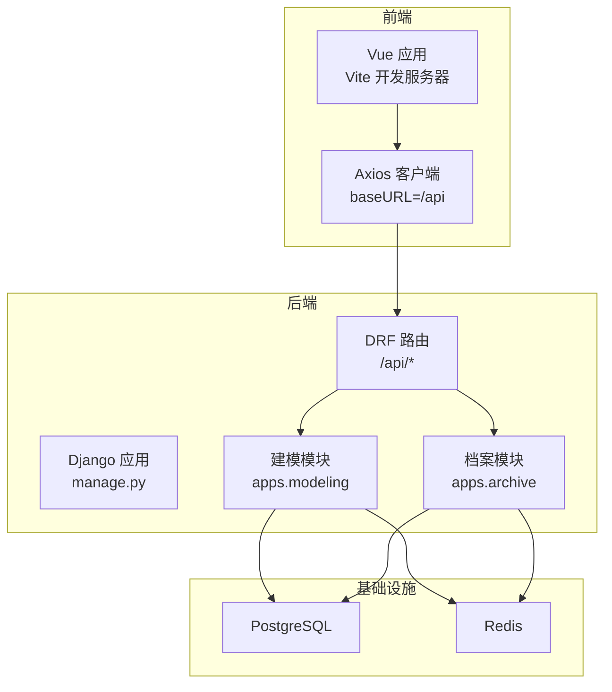
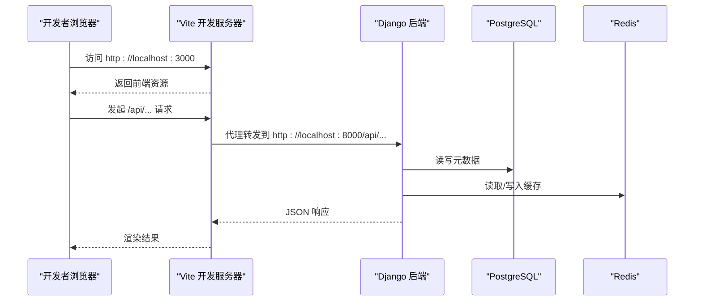
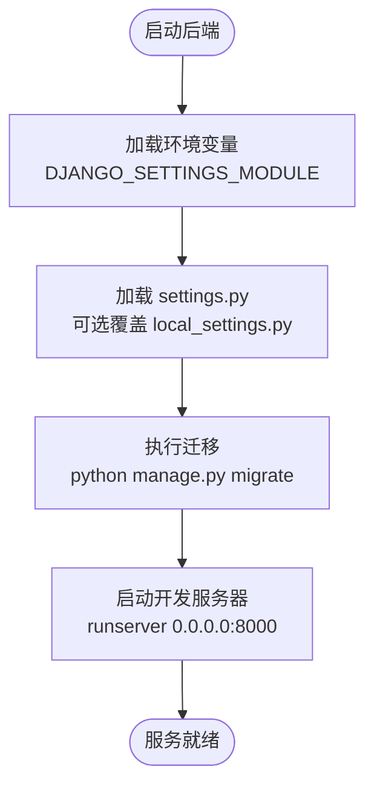
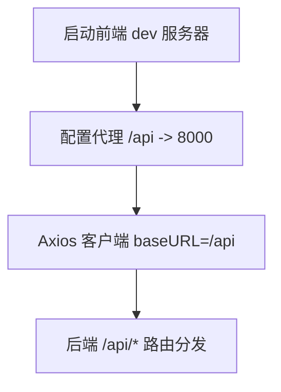
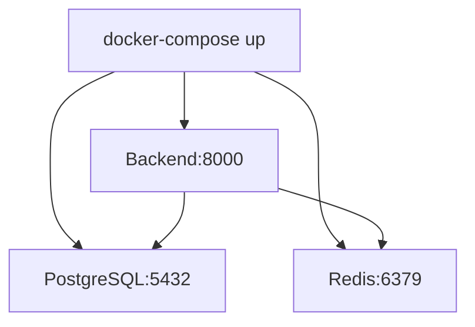
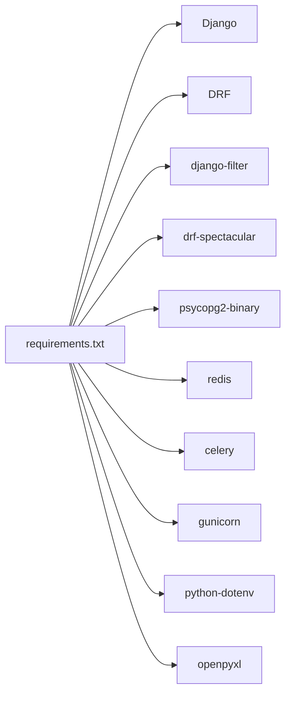

# 快速开始

<cite>
**本文引用的文件**   
- [backend/requirements.txt](file://backend/requirements.txt)
- [backend/config/settings.py](file://backend/config/settings.py)
- [backend/local_settings.py](file://backend/local_settings.py)
- [backend/manage.py](file://backend/manage.py)
- [backend/docker-compose.yml](file://backend/docker-compose.yml)
- [backend/Dockerfile](file://backend/Dockerfile)
- [backend/config/urls.py](file://backend/config/urls.py)
- [backend/apps/modeling/urls.py](file://backend/apps/modeling/urls.py)
- [backend/apps/archive/urls.py](file://backend/apps/archive/urls.py)
- [frontend/package.json](file://frontend/package.json)
- [frontend/vite.config.ts](file://frontend/vite.config.ts)
- [frontend/src/api/index.ts](file://frontend/src/api/index.ts)
- [backend/test_api.py](file://backend/test_api.py)
</cite>

## 目录
1. [简介](#简介)
2. [项目结构](#项目结构)
3. [核心组件](#核心组件)
4. [架构总览](#架构总览)
5. [详细组件分析](#详细组件分析)
6. [依赖分析](#依赖分析)
7. [性能考虑](#性能考虑)
8. [故障排查指南](#故障排查指南)
9. [结论](#结论)
10. [附录](#附录)

## 简介
本指南面向首次接触 MetaData002 的用户，目标是在 30 分钟内完成环境搭建、启动后端与前端、并通过 Docker Compose 一键拉起完整环境。你将学会：
- 准备 Python 环境与安装依赖
- 配置数据库（PostgreSQL）与缓存（Redis），或本地 SQLite + 内存缓存
- 启动后端服务与前端开发服务器
- 使用 Docker Compose 一键部署
- 创建第一个数据域、导入表结构、配置字段映射等基础操作
- 常见环境问题定位与解决

## 项目结构
MetaData002 采用前后端分离架构：
- 后端：Django + DRF，提供 REST API，内置建模与档案模块
- 前端：Vue 3 + Vite + Ant Design Vue，提供可视化建模与档案管理界面
- 基础设施：PostgreSQL（主库）、Redis（缓存/会话）

图表来源
- [backend/config/urls.py:1-9](file://backend/config/urls.py#L1-L9)
- [backend/apps/modeling/urls.py:1-20](file://backend/apps/modeling/urls.py#L1-L20)
- [backend/apps/archive/urls.py:1-21](file://backend/apps/archive/urls.py#L1-L21)
- [frontend/src/api/index.ts:1-22](file://frontend/src/api/index.ts#L1-L22)

章节来源
- [backend/config/urls.py:1-9](file://backend/config/urls.py#L1-L9)
- [backend/apps/modeling/urls.py:1-20](file://backend/apps/modeling/urls.py#L1-L20)
- [backend/apps/archive/urls.py:1-21](file://backend/apps/archive/urls.py#L1-L21)
- [frontend/src/api/index.ts:1-22](file://frontend/src/api/index.ts#L1-L22)

## 核心组件
- 后端服务
  - Django 应用入口与命令管理：[backend/manage.py](file://backend/manage.py)
  - 全局配置（数据库、缓存、中间件、REST 框架、AI 接口等）：[backend/config/settings.py](file://backend/config/settings.py)
  - 开发环境覆盖（SQLite + 内存缓存 + CORS）：[backend/local_settings.py](file://backend/local_settings.py)
  - 依赖清单：[backend/requirements.txt](file://backend/requirements.txt)
- 前端服务
  - 包管理与脚本：[frontend/package.json](file://frontend/package.json)
  - Vite 开发与代理配置（将 /api 请求转发到后端）：[frontend/vite.config.ts](file://frontend/vite.config.ts)
  - Axios 客户端封装（统一 baseURL、超时、错误处理）：[frontend/src/api/index.ts](file://frontend/src/api/index.ts)
- 容器化
  - Docker 镜像构建：[backend/Dockerfile](file://backend/Dockerfile)
  - 一键编排（PostgreSQL、Redis、后端）：[backend/docker-compose.yml](file://backend/docker-compose.yml)

章节来源
- [backend/manage.py:1-22](file://backend/manage.py#L1-L22)
- [backend/config/settings.py:1-123](file://backend/config/settings.py#L1-L123)
- [backend/local_settings.py:1-26](file://backend/local_settings.py#L1-L26)
- [backend/requirements.txt:1-11](file://backend/requirements.txt#L1-L11)
- [frontend/package.json:1-29](file://frontend/package.json#L1-L29)
- [frontend/vite.config.ts:1-22](file://frontend/vite.config.ts#L1-L22)
- [frontend/src/api/index.ts:1-22](file://frontend/src/api/index.ts#L1-L22)
- [backend/Dockerfile:1-20](file://backend/Dockerfile#L1-L20)
- [backend/docker-compose.yml:1-58](file://backend/docker-compose.yml#L1-L58)

## 架构总览
系统通过 Vite 开发服务器提供前端页面，并将所有 /api 请求代理至 Django 后端。后端基于 DRF 暴露 RESTful 接口，连接 PostgreSQL 存储元数据，使用 Redis 做缓存。

图表来源
- [frontend/vite.config.ts:12-21](file://frontend/vite.config.ts#L12-L21)
- [backend/config/settings.py:56-74](file://backend/config/settings.py#L56-L74)

## 详细组件分析

### 后端服务启动流程
- 设置环境变量与加载配置
  - 入口命令由 manage.py 设置 DJANGO_SETTINGS_MODULE 并调用 Django 命令行工具
  - settings.py 从环境变量读取数据库、缓存、调试开关等；若存在 local_settings.py 则覆盖默认配置（开发时启用 SQLite 与内存缓存）
- 运行步骤
  - 安装依赖：pip install -r requirements.txt
  - 初始化数据库：python manage.py migrate
  - 启动服务：python manage.py runserver 0.0.0.0:8000

图表来源
- [backend/manage.py:1-22](file://backend/manage.py#L1-L22)
- [backend/config/settings.py:1-123](file://backend/config/settings.py#L1-L123)
- [backend/local_settings.py:1-26](file://backend/local_settings.py#L1-L26)

章节来源
- [backend/manage.py:1-22](file://backend/manage.py#L1-L22)
- [backend/config/settings.py:1-123](file://backend/config/settings.py#L1-L123)
- [backend/local_settings.py:1-26](file://backend/local_settings.py#L1-L26)

### 前端开发服务器与代理
- 包依赖与脚本在 package.json 中定义，使用 vite 启动开发服务器
- vite.config.ts 将 /api 请求代理到 http://localhost:8000，避免跨域问题
- 前端 Axios 客户端 baseURL 设置为 /api，统一错误处理

图表来源
- [frontend/package.json:1-29](file://frontend/package.json#L1-L29)
- [frontend/vite.config.ts:12-21](file://frontend/vite.config.ts#L12-L21)
- [frontend/src/api/index.ts:1-22](file://frontend/src/api/index.ts#L1-L22)

章节来源
- [frontend/package.json:1-29](file://frontend/package.json#L1-L29)
- [frontend/vite.config.ts:12-21](file://frontend/vite.config.ts#L12-L21)
- [frontend/src/api/index.ts:1-22](file://frontend/src/api/index.ts#L1-L22)

### Docker Compose 一键部署
- 服务组成
  - db：PostgreSQL 15，端口 5432，持久化卷 postgres_data
  - redis：Redis 7 Alpine，端口 6379
  - backend：基于 Python 3.12-slim 构建，自动执行 migrate 并启动 runserver
- 环境变量
  - DEBUG、DB_*、REDIS_* 等用于控制行为与连接
- 健康检查
  - db 使用 pg_isready，redis 使用 redis-cli ping

图表来源
- [backend/docker-compose.yml:1-58](file://backend/docker-compose.yml#L1-L58)
- [backend/Dockerfile:1-20](file://backend/Dockerfile#L1-L20)

章节来源
- [backend/docker-compose.yml:1-58](file://backend/docker-compose.yml#L1-L58)
- [backend/Dockerfile:1-20](file://backend/Dockerfile#L1-L20)

### 基本使用示例（30 分钟上手）
以下示例基于后端 API 测试脚本与路由定义，帮助你快速验证系统可用并完成基础操作。

- 前置条件
  - 本地已安装 PostgreSQL 与 Redis，或使用 Docker Compose 一键启动
  - 后端运行在 http://localhost:8000，前端运行在 http://localhost:3000（可选）

- 步骤一：创建第一个数据域
  - 调用 POST /api/domains/，提交 name、code、description 等字段
  - 参考测试用例中的域创建逻辑

- 步骤二：导入表结构
  - 调用 POST /api/tables/，指定 domain、name、code、type（local/source）
  - 若为 source 类型，需填写 source_config（host、port、db_name、table_name）

- 步骤三：批量保存字段
  - 调用 POST /api/fields/batch/?table=<id>，提交 fields 数组（name、code、sort_order）

- 步骤四：配置字段映射
  - 调用 POST /api/field-mappings/，指定 source_table、source_field、target_table、target_field

- 步骤五：创建档案记录
  - 调用 POST /api/records/，提交 domain、table、data（键值对）、created_by

- 步骤六：查看版本与回滚
  - 获取版本列表：GET /api/records/<id>/versions/
  - 对比差异：GET /api/records/<id>/versions/compare/?v1=1&v2=2
  - 回滚到指定版本：POST /api/records/<id>/rollback/，提交 target_version 与 operated_by

- 步骤七：操作日志
  - 查询操作日志：GET /api/operation-logs/

章节来源
- [backend/test_api.py:1-155](file://backend/test_api.py#L1-L155)
- [backend/apps/modeling/urls.py:1-20](file://backend/apps/modeling/urls.py#L1-L20)
- [backend/apps/archive/urls.py:1-21](file://backend/apps/archive/urls.py#L1-L21)

## 依赖分析
- 后端依赖
  - Django、DRF、django-filter、drf-spectacular、psycopg2-binary、redis、celery、gunicorn、python-dotenv、openpyxl
- 前端依赖
  - Vue 3、Ant Design Vue、Axios、Pinia、Vite、TypeScript
- 运行时依赖
  - PostgreSQL（主库）、Redis（缓存）

图表来源
- [backend/requirements.txt:1-11](file://backend/requirements.txt#L1-L11)

章节来源
- [backend/requirements.txt:1-11](file://backend/requirements.txt#L1-L11)
- [frontend/package.json:1-29](file://frontend/package.json#L1-L29)

## 性能考虑
- 数据库连接
  - 开发环境使用 SQLite（local_settings.py），生产建议使用 PostgreSQL 并合理设置连接池
- 缓存
  - 开发环境使用内存缓存，生产建议启用 Redis 以提升性能
- 分页与过滤
  - DRF 已启用标准分页与过滤后端，注意合理设置 PAGE_SIZE
- 静态资源
  - 生产环境应收集静态文件并使用 Nginx 或 CDN 加速

## 故障排查指南
- 无法连接数据库
  - 检查环境变量 DB_HOST、DB_PORT、DB_NAME、DB_USER、DB_PASSWORD 是否正确
  - 确认 PostgreSQL 服务已启动且端口可达
- 缓存连接失败
  - 检查 REDIS_HOST、REDIS_PORT 是否指向正确的 Redis 实例
- 前端请求 404 或跨域
  - 确认 Vite 代理配置已将 /api 转发到 http://localhost:8000
  - 开发环境下 local_settings.py 已开启 CORS，确保未被覆盖
- 端口冲突
  - 后端默认 8000，前端默认 3000，请修改 vite.config.ts 的 server.port 或 Django 的 runserver 端口
- 依赖安装失败
  - 确保 Python 版本满足要求，重新安装依赖：pip install -r requirements.txt
- Docker Compose 启动失败
  - 检查端口占用与网络连通性，查看各服务日志
  - 确认 healthcheck 通过后再启动 backend

章节来源
- [backend/config/settings.py:56-74](file://backend/config/settings.py#L56-L74)
- [backend/local_settings.py:1-26](file://backend/local_settings.py#L1-L26)
- [frontend/vite.config.ts:12-21](file://frontend/vite.config.ts#L12-L21)
- [backend/docker-compose.yml:1-58](file://backend/docker-compose.yml#L1-L58)

## 结论
通过本指南，你可以在 30 分钟内完成 MetaData002 的环境搭建与服务启动，掌握创建数据域、导入表结构、配置字段映射等核心操作。推荐使用 Docker Compose 进行快速部署，结合前端开发服务器的代理能力，实现高效的前后端联调。遇到问题时，可依据故障排查指南逐步定位与解决。

## 附录
- 常用命令
  - 后端启动（本地）
    - pip install -r requirements.txt
    - python manage.py migrate
    - python manage.py runserver 0.0.0.0:8000
  - 前端启动（本地）
    - npm install
    - npm run dev
  - Docker Compose 启动
    - docker-compose up --build
- 关键路径
  - 后端根 URL：/api/
  - 建模模块 API：/api/data-sources, /api/domains, /api/tables, /api/fields, /api/field-groups, /api/field-options, /api/field-mappings, /api/standard-fields, /api/ai-config, /api/computed-fields
  - 档案模块 API：/api/archives, /api/records, /api/sync-logs, /api/operation-logs, /api/record-versions, /api/archive-apis, /api/change-batches, /api/change-details, /api/consistency-issues, /api/consistency-rules

章节来源
- [backend/config/urls.py:1-9](file://backend/config/urls.py#L1-L9)
- [backend/apps/modeling/urls.py:1-20](file://backend/apps/modeling/urls.py#L1-L20)
- [backend/apps/archive/urls.py:1-21](file://backend/apps/archive/urls.py#L1-L21)