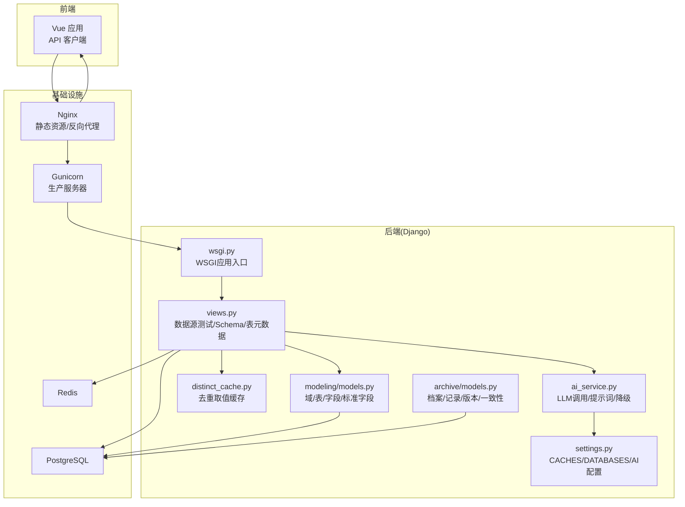
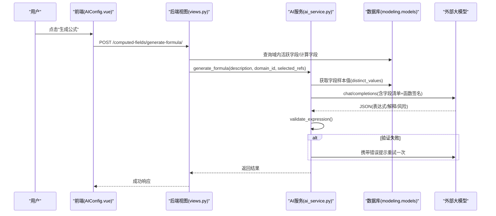
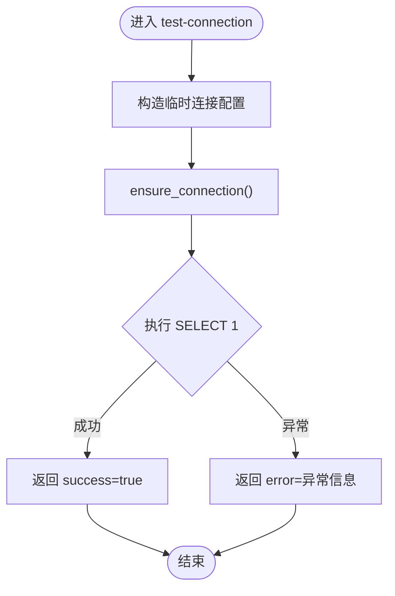
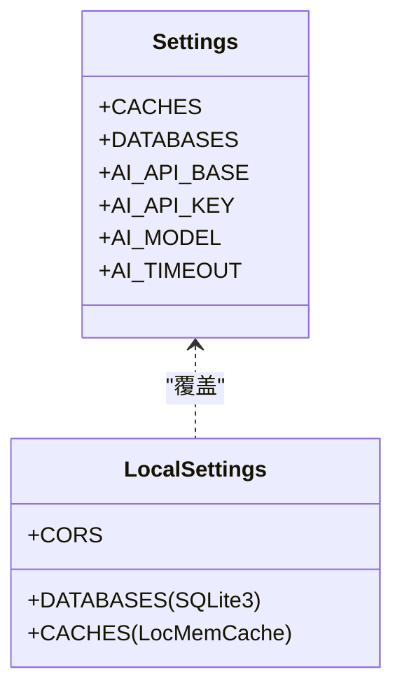
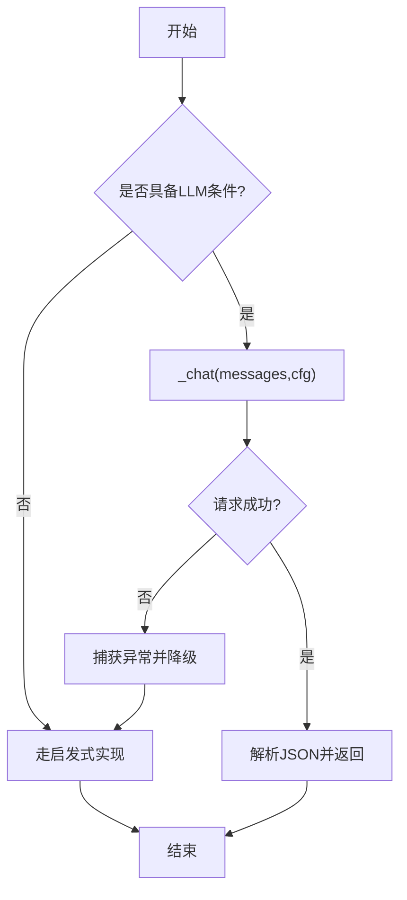
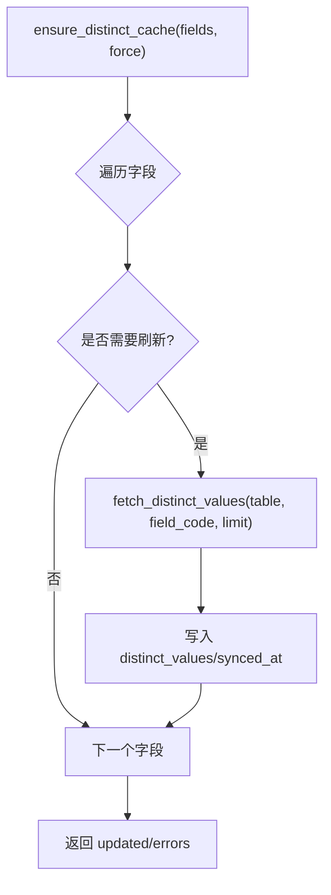
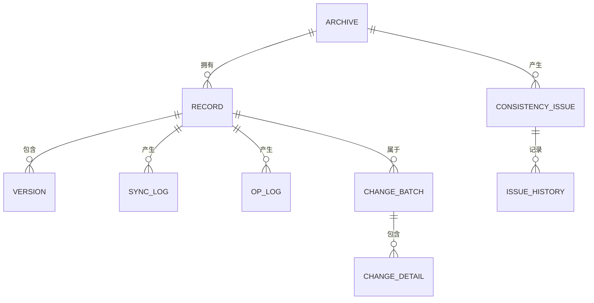
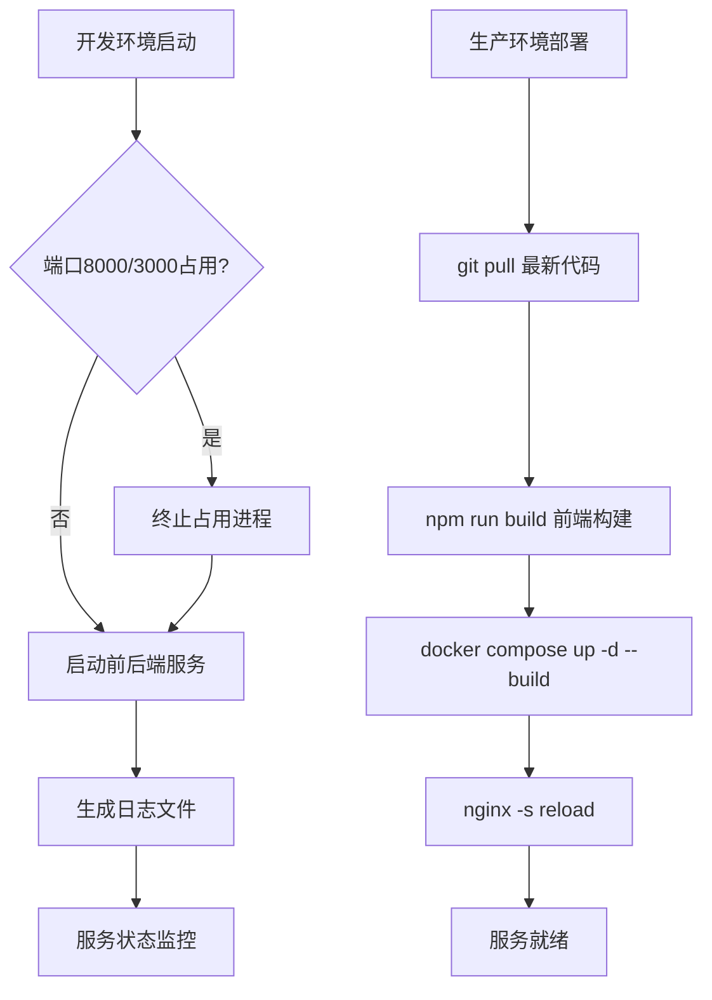
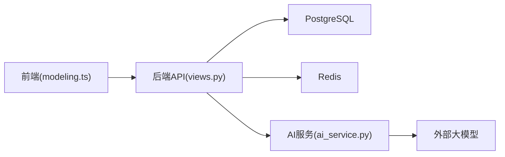
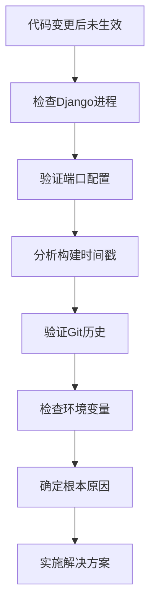

# 故障排查

<cite>
**本文引用的文件**   
- [settings.py](file://backend/config/settings.py)
- [local_settings.py](file://backend/local_settings.py)
- [docker-compose.yml](file://backend/docker-compose.yml)
- [deploy/docker-compose.yml](file://deploy/docker-compose.yml)
- [wsgi.py](file://backend/config/wsgi.py)
- [Dockerfile](file://backend/Dockerfile)
- [ai_service.py](file://backend/apps/modeling/ai_service.py)
- [views.py](file://backend/apps/modeling/views.py)
- [distinct_cache.py](file://backend/apps/modeling/distinct_cache.py)
- [models.py（modeling）](file://backend/apps/modeling/models.py)
- [models.py（archive）](file://backend/apps/archive/models.py)
- [AIConfig.vue](file://frontend/src/views/settings/AIConfig.vue)
- [apiError.ts](file://frontend/src/utils/apiError.ts)
- [modeling.ts](file://frontend/src/api/modeling.ts)
- [error_output.html](file://error_output.html)
- [dev.ps1](file://scripts/dev.ps1)
- [release.ps1](file://scripts/release.ps1)
- [sync.sh](file://deploy/sync.sh)
</cite>

## 更新摘要
**变更内容**   
- 新增部署效果问题排查方法论章节，涵盖Django服务器进程、端口配置、构建时间戳分析和Git历史验证
- 增强服务启动和停止的故障排查指南
- 完善生产环境部署流程的问题诊断方法
- 添加开发环境和生产环境的差异化排查策略

## 目录
1. [简介](#简介)
2. [项目结构](#项目结构)
3. [核心组件](#核心组件)
4. [架构总览](#架构总览)
5. [详细组件分析](#详细组件分析)
6. [依赖关系分析](#依赖关系分析)
7. [性能注意事项](#性能注意事项)
8. [故障排查指南](#故障排查指南)
9. [结论](#结论)
10. [附录](#附录)

## 简介
本故障排查文档面向 MetaData002 系统的运维与研发人员，覆盖数据库连接、Redis 缓存、AI 服务调用等常见问题的定位与解决；提供系统监控指标与告警建议；说明日志分析方法（Django 日志、前端错误收集、性能分析）；给出性能瓶颈定位与优化建议（慢查询、内存泄漏、并发问题）；并提供数据一致性诊断工具与方法、紧急恢复流程与回滚策略，以及问题上报与协作规范。**特别增强了部署效果问题排查的系统化方法论，帮助快速定位代码变更后未生效的根本原因。**

## 项目结构
后端采用 Django + DRF，使用 PostgreSQL 作为主库，Redis 作为缓存；前端为 Vue 3 + TypeScript，通过 API 与后端交互。关键配置集中在 settings.py，本地开发通过 local_settings.py 覆盖为 SQLite3 + 内存缓存；AI 能力由 ai_service.py 统一封装，支持真实 LLM 与启发式降级；档案模块在 apps/archive 下，包含版本、变更批次、一致性检查等模型。



**图表来源** 
- [settings.py:56-74](file://backend/config/settings.py#L56-L74)
- [ai_service.py:19-54](file://backend/apps/modeling/ai_service.py#L19-L54)
- [views.py:40-72](file://backend/apps/modeling/views.py#L40-L72)
- [distinct_cache.py:27-97](file://backend/apps/modeling/distinct_cache.py#L27-L97)
- [models.py（modeling）:32-100](file://backend/apps/modeling/models.py#L32-L100)
- [models.py（archive）:5-70](file://backend/apps/archive/models.py#L5-L70)
- [wsgi.py:1-5](file://backend/config/wsgi.py#L1-L5)
- [deploy/docker-compose.yml:37-83](file://deploy/docker-compose.yml#L37-L83)

**章节来源**
- [settings.py:56-74](file://backend/config/settings.py#L56-L74)
- [local_settings.py:1-26](file://backend/local_settings.py#L1-L26)
- [docker-compose.yml:1-57](file://backend/docker-compose.yml#L1-L57)
- [deploy/docker-compose.yml:1-87](file://deploy/docker-compose.yml#L1-L87)

## 核心组件
- 配置中心：DATABASES、CACHES、AI_API_* 环境变量驱动，支持本地覆盖。
- AI 服务层：优先读取数据库 AIConfig（enabled=True），失败或无密钥时回退到启发式方案。
- 数据源访问：动态构建临时连接别名，执行跨库元数据查询与去重采样。
- 档案与一致性：版本快照、变更批次、差异检测与历史追踪。
- **部署管理：支持开发环境（runserver）和生产环境（gunicorn）双模式运行，具备完善的进程管理和端口控制机制。**

**章节来源**
- [settings.py:56-74](file://backend/config/settings.py#L56-L74)
- [ai_service.py:19-54](file://backend/apps/modeling/ai_service.py#L19-L54)
- [views.py:40-72](file://backend/apps/modeling/views.py#L40-L72)
- [distinct_cache.py:27-97](file://backend/apps/modeling/distinct_cache.py#L27-L97)
- [models.py（archive）:206-272](file://backend/apps/archive/models.py#L206-L272)
- [dev.ps1:48-95](file://scripts/dev.ps1#L48-L95)
- [deploy/docker-compose.yml:37-67](file://deploy/docker-compose.yml#L37-L67)

## 架构总览
下图展示一次"AI 公式生成"的端到端调用链，包括字段样本采集、LLM 调用、表达式验证与重试。



**图表来源** 
- [ai_service.py:558-747](file://backend/apps/modeling/ai_service.py#L558-L747)
- [views.py:1-200](file://backend/apps/modeling/views.py#L1-L200)
- [models.py（modeling）:162-200](file://backend/apps/modeling/models.py#L162-L200)

## 详细组件分析

### 数据库连接与数据源管理
- 动态连接：按 db_type 映射引擎，构造临时 alias，确保连接后执行简单 SQL 校验。
- 多数据库类型：PostgreSQL、MySQL、SQL Server、Oracle 均有对应 SQL 片段。
- 常见问题：未安装驱动、端口不通、权限不足、schema 名称不匹配、ATOMIC_REQUESTS 缺失导致 KeyError。



**图表来源** 
- [views.py:94-146](file://backend/apps/modeling/views.py#L94-L146)

**章节来源**
- [views.py:40-72](file://backend/apps/modeling/views.py#L40-L72)
- [views.py:94-146](file://backend/apps/modeling/views.py#L94-L146)
- [error_output.html:519-532](file://error_output.html#L519-L532)

### Redis 缓存配置与异常
- 默认使用 django_redis 后端，地址由 REDIS_HOST/REDIS_PORT 决定。
- 本地开发被 local_settings.py 覆盖为 LocMemCache。
- 常见问题：Redis 不可达、认证失败、网络超时、键序列化异常。



**图表来源** 
- [settings.py:68-74](file://backend/config/settings.py#L68-L74)
- [local_settings.py:1-26](file://backend/local_settings.py#L1-L26)

**章节来源**
- [settings.py:68-74](file://backend/config/settings.py#L68-L74)
- [local_settings.py:11-15](file://backend/local_settings.py#L11-L15)

### AI 服务调用与降级
- 配置优先级：数据库 AIConfig(enabled=True) > 环境变量。
- 调用流程：_chat -> requests.post -> raise_for_status -> 解析 JSON。
- 降级策略：无密钥或请求失败时回退到启发式算法，保证功能可用。
- 常见问题：缺少 requests 依赖、API Key 为空、超时、JSON 解析失败。



**图表来源** 
- [ai_service.py:19-54](file://backend/apps/modeling/ai_service.py#L19-L54)
- [ai_service.py:56-90](file://backend/apps/modeling/ai_service.py#L56-L90)
- [ai_service.py:171-186](file://backend/apps/modeling/ai_service.py#L171-L186)

**章节来源**
- [ai_service.py:19-54](file://backend/apps/modeling/ai_service.py#L19-54)
- [ai_service.py:56-90](file://backend/apps/modeling/ai_service.py#L56-L90)
- [ai_service.py:171-186](file://backend/apps/modeling/ai_service.py#L171-L186)

### 去重取值缓存与外部数据源
- 本地表直接查询；外部表通过动态别名连接，按 db_type 构造 SQL。
- ensure_distinct_cache 批量填充 distinct_values，失败记录 errors。
- 常见问题：不支持的 db_type、外部表名/schema 不匹配、权限不足。



**图表来源** 
- [distinct_cache.py:100-122](file://backend/apps/modeling/distinct_cache.py#L100-L122)
- [distinct_cache.py:27-97](file://backend/apps/modeling/distinct_cache.py#L27-L97)

**章节来源**
- [distinct_cache.py:27-97](file://backend/apps/modeling/distinct_cache.py#L27-L97)
- [distinct_cache.py:100-122](file://backend/apps/modeling/distinct_cache.py#L100-L122)

### 档案与一致性检查
- 版本快照、变更批次、变更明细、操作日志、一致性差异与规则失效。
- 用于审计、回滚、差异修复与趋势追踪。



**图表来源** 
- [models.py（archive）:5-70](file://backend/apps/archive/models.py#L5-L70)
- [models.py（archive）:75-110](file://backend/apps/archive/models.py#L75-L110)
- [models.py（archive）:112-137](file://backend/apps/archive/models.py#L112-L137)
- [models.py（archive）:174-204](file://backend/apps/archive/models.py#L174-L204)
- [models.py（archive）:206-272](file://backend/apps/archive/models.py#L206-L272)
- [models.py（archive）:274-332](file://backend/apps/archive/models.py#L274-L332)
- [models.py（archive）:334-362](file://backend/apps/archive/models.py#L334-L362)
- [models.py（archive）:364-379](file://backend/apps/archive/models.py#L364-L379)

**章节来源**
- [models.py（archive）:5-70](file://backend/apps/archive/models.py#L5-L70)
- [models.py（archive）:206-272](file://backend/apps/archive/models.py#L206-L272)
- [models.py（archive）:274-332](file://backend/apps/archive/models.py#L274-L332)

### 部署服务管理与进程控制
- **开发环境**：使用 `scripts/dev.ps1` 脚本管理前后端服务，支持端口占用检测和进程PID管理。
- **生产环境**：通过 Docker Compose 部署，后端使用 Gunicorn WSGI 服务器，前端使用 Nginx 静态资源服务。
- **进程管理**：支持幂等操作，自动检测端口占用并清理残留进程，避免端口冲突。
- **服务状态**：提供完整的服务状态查看功能，区分通过脚本启动和非脚本启动的服务。



**图表来源** 
- [dev.ps1:48-95](file://scripts/dev.ps1#L48-L95)
- [dev.ps1:97-127](file://scripts/dev.ps1#L97-L127)
- [deploy/sync.sh:1-10](file://deploy/sync.sh#L1-L10)
- [deploy/docker-compose.yml:37-83](file://deploy/docker-compose.yml#L37-L83)

**章节来源**
- [dev.ps1:21-46](file://scripts/dev.ps1#L21-L46)
- [dev.ps1:48-95](file://scripts/dev.ps1#L48-L95)
- [dev.ps1:97-127](file://scripts/dev.ps1#L97-L127)
- [deploy/sync.sh:1-10](file://deploy/sync.sh#L1-L10)
- [deploy/docker-compose.yml:37-83](file://deploy/docker-compose.yml#L37-L83)

## 依赖关系分析
- 后端依赖：Django、DRF、django-redis、requests（可选）。
- 外部依赖：PostgreSQL、Redis、OpenAI 兼容接口。
- 前端依赖：Vue 3、TypeScript、Ant Design Vue、axios。



**图表来源** 
- [modeling.ts:440-445](file://frontend/src/api/modeling.ts#L440-L445)
- [views.py:1-200](file://backend/apps/modeling/views.py#L1-L200)
- [ai_service.py:56-90](file://backend/apps/modeling/ai_service.py#L56-L90)

**章节来源**
- [modeling.ts:440-445](file://frontend/src/api/modeling.ts#L440-L445)
- [settings.py:56-74](file://backend/config/settings.py#L56-L74)

## 性能注意事项
- 数据库连接池：CONN_MAX_AGE、CONN_HEALTH_CHECKS 合理设置；避免频繁创建临时连接。
- 缓存命中率：distinct_values 缓存上限 100，避免重复采样；必要时扩大 limit。
- AI 调用耗时：timeout 默认 30s，超时需调优；减少 payload 大小（精选字段）。
- 前端分页：默认 PAGE_SIZE=20，列表页按需拉全量（FULL_PAGE=100000）需谨慎。
- **部署性能：生产环境 Gunicorn workers 数量应根据CPU核数调整，默认4个worker适合中等负载场景。**

[本节为通用指导，无需特定文件引用]

## 故障排查指南

### 常见问题场景与解决方案
- 数据库连接失败
  - 现象：test-connection 报错、页面加载缓慢或崩溃。
  - 排查：检查环境变量 DB_HOST/PORT/NAME/USER/PASSWORD；确认驱动已安装；核对 schema 与权限。
  - 参考：[views.py:94-146](file://backend/apps/modeling/views.py#L94-L146)、[settings.py:56-66](file://backend/config/settings.py#L56-L66)
- Redis 缓存异常
  - 现象：缓存读写失败、性能下降。
  - 排查：检查 REDIS_HOST/REDIS_PORT；确认 Redis 运行与健康检查；本地开发使用 LocMemCache。
  - 参考：[settings.py:68-74](file://backend/config/settings.py#L68-L74)、[local_settings.py:11-15](file://backend/local_settings.py#L11-L15)
- AI 服务调用失败
  - 现象：AI 功能不可用或返回空结果。
  - 排查：检查 AI_API_KEY 是否为空；确认 requests 已安装；查看 timeout 与 api_base；前端"测试连接"反馈。
  - 参考：[ai_service.py:19-54](file://backend/apps/modeling/ai_service.py#L19-L54)、[ai_service.py:56-90](file://backend/apps/modeling/ai_service.py#L56-L90)、[AIConfig.vue:275-289](file://frontend/src/views/settings/AIConfig.vue#L275-L289)
- 外部数据源元数据查询失败
  - 现象：schemas/external-tables 查询报错。
  - 排查：db_type 映射是否正确；schema 名称是否匹配；权限是否足够；SQL 方言差异。
  - 参考：[views.py:148-302](file://backend/apps/modeling/views.py#L148-L302)、[distinct_cache.py:27-97](file://backend/apps/modeling/distinct_cache.py#L27-L97)
- 前端错误收集
  - 现象：用户看到模糊错误消息。
  - 排查：使用 extractApiError 提取后端 detail/message/non_field_errors；补充兜底文案。
  - 参考：[apiError.ts:1-29](file://frontend/src/utils/apiError.ts#L1-L29)

**章节来源**
- [views.py:94-146](file://backend/apps/modeling/views.py#L94-L146)
- [settings.py:56-74](file://backend/config/settings.py#L56-L74)
- [local_settings.py:11-15](file://backend/local_settings.py#L11-L15)
- [ai_service.py:19-54](file://backend/apps/modeling/ai_service.py#L19-L54)
- [ai_service.py:56-90](file://backend/apps/modeling/ai_service.py#L56-L90)
- [AIConfig.vue:275-289](file://frontend/src/views/settings/AIConfig.vue#L275-L289)
- [views.py:148-302](file://backend/apps/modeling/views.py#L148-L302)
- [distinct_cache.py:27-97](file://backend/apps/modeling/distinct_cache.py#L27-L97)
- [apiError.ts:1-29](file://frontend/src/utils/apiError.ts#L1-L29)

### 部署效果问题排查方法论
**新增** 针对代码变更后未生效问题的系统化排查流程：

#### 1. Django服务器进程排查
- **开发环境**：检查 `scripts/dev.ps1` 管理的进程状态，确认8000端口是否被正确监听
- **生产环境**：验证 Gunicorn 进程是否正常运行，检查 worker 数量和超时配置
- **进程验证命令**：
  ```bash
  # 检查端口占用
  netstat -ano | findstr :8000
  
  # 检查Django进程
  ps aux | grep python
  
  # 检查Gunicorn进程
  ps aux | grep gunicorn
  ```

#### 2. 端口配置验证
- **开发环境**：确认 `dev.ps1` 中配置的8000端口未被其他进程占用
- **生产环境**：验证 Docker Compose 中的端口映射配置
- **防火墙检查**：确保相关端口在防火墙中开放

#### 3. 构建时间戳分析
- **前端构建产物**：检查 `frontend/dist` 目录的修改时间戳
- **Python字节码**：验证 `.pyc` 文件的更新时间
- **静态文件**：确认 collectstatic 生成的静态资源是否最新

#### 4. Git历史验证
- **当前分支**：确认部署的是预期的代码分支
- **提交历史**：验证包含所需变更的最新提交
- **标签版本**：生产环境建议使用 git tag 进行版本标记

#### 5. 环境变量检查
- **配置文件**：验证 `settings.py` 中的 DEBUG 和其他关键配置
- **环境变量**：检查 Docker Compose 中的环境变量传递
- **配置文件优先级**：确认 local_settings.py 的正确覆盖行为



**图表来源** 
- [dev.ps1:48-95](file://scripts/dev.ps1#L48-L95)
- [deploy/docker-compose.yml:37-67](file://deploy/docker-compose.yml#L37-L67)
- [settings.py:7](file://backend/config/settings.py#L7)

**章节来源**
- [dev.ps1:21-46](file://scripts/dev.ps1#L21-L46)
- [dev.ps1:48-95](file://scripts/dev.ps1#L48-L95)
- [deploy/docker-compose.yml:37-67](file://deploy/docker-compose.yml#L37-L67)
- [settings.py:7](file://backend/config/settings.py#L7)
- [deploy/sync.sh:1-10](file://deploy/sync.sh#L1-L10)

### 系统监控指标与告警建议
- CPU/内存：进程级监控（psutil/top），阈值建议 CPU>80% 持续 5min、内存>85% 持续 5min。
- 数据库连接池：活跃连接数、等待队列长度、连接建立耗时；超过阈值触发扩容或限流。
- Redis：连接数、命中率、内存使用率、延迟；命中率<80% 或内存>80% 告警。
- AI 服务：调用成功率、平均耗时、超时率；失败率>5% 或 P95>timeout*1.5 告警。
- 应用：QPS、错误率、P95/P99 响应时间；错误率>1% 或 P99>3s 告警。
- **部署监控：服务启动时间、进程存活状态、端口监听状态、构建成功率。**

[本节为通用指导，无需特定文件引用]

### 日志分析方法
- Django 日志：当前 LOGGING 为空字典，建议启用控制台/文件输出，分级记录 request/response、SQL、异常堆栈。
- 前端错误：统一使用 extractApiError 解析后端错误，结合浏览器控制台与 Sentry 等采集。
- 性能分析：开启 DRF 请求日志、数据库慢查询日志（PostgreSQL log_min_duration_statement）、Redis 慢日志。
- **部署日志：关注 dev.ps1 和 docker-compose 的输出日志，记录服务启动过程和错误信息。**

**章节来源**
- [error_output.html:1713-1720](file://error_output.html#L1713-L1720)
- [apiError.ts:1-29](file://frontend/src/utils/apiError.ts#L1-L29)
- [dev.ps1:60-65](file://scripts/dev.ps1#L60-L65)
- [deploy/docker-compose.yml:37-46](file://deploy/docker-compose.yml#L37-L46)

### 性能瓶颈定位与优化
- 慢查询分析：对 views.py 中 schemas/tables 查询进行 EXPLAIN，添加必要索引；限制返回字段与行数。
- 内存泄漏检测：关注 distinct_values 缓存大小与生命周期；避免一次性加载超大集合。
- 并发问题：减少临时连接创建频率；合理设置 CONN_MAX_AGE；对 AI 调用增加限流与重试。
- **部署性能：优化 Gunicorn worker 数量，调整 Nginx 缓存策略，减少前端资源体积。**

**章节来源**
- [views.py:148-302](file://backend/apps/modeling/views.py#L148-L302)
- [distinct_cache.py:100-122](file://backend/apps/modeling/distinct_cache.py#L100-L122)
- [deploy/docker-compose.yml:46](file://deploy/docker-compose.yml#L46)

### 数据一致性问题诊断工具与方法
- 一致性差异：ConsistencyIssue 记录组合字段成员不一致、档案侧与源侧差异、孤立记录、Schema 漂移。
- 历史追踪：ConsistencyIssueHistory 保留每次检查的差异轨迹；ChangeBatch/Detail 记录变更来源与字段级旧值→新值。
- 方法：定期运行一致性检查，过滤失效规则，导出差异报表，人工审核并修复。

**章节来源**
- [models.py（archive）:274-332](file://backend/apps/archive/models.py#L274-L332)
- [models.py（archive）:334-362](file://backend/apps/archive/models.py#L334-L362)
- [models.py（archive）:364-379](file://backend/apps/archive/models.py#L364-L379)
- [models.py（archive）:206-272](file://backend/apps/archive/models.py#L206-L272)

### 紧急恢复流程与回滚策略
- 快速恢复：优先恢复 Redis 与数据库连接；若 AI 服务不可用，确保启发式降级可用。
- 回滚策略：基于 ArchiveRecordVersion 快照进行回滚；使用 ChangeDetail.version_before/after 定位变更范围；对受保护字段（overrides）避免自动覆盖。
- 操作步骤：暂停同步任务 → 评估影响面 → 选择目标版本 → 执行回滚 → 验证一致性 → 恢复服务。
- **部署回滚：使用 git revert 回退代码，重新构建并部署之前稳定的版本。**

**章节来源**
- [models.py（archive）:75-110](file://backend/apps/archive/models.py#L75-L110)
- [models.py（archive）:206-272](file://backend/apps/archive/models.py#L206-L272)
- [deploy/sync.sh:1-10](file://deploy/sync.sh#L1-L10)

### 问题上报与协作解决流程规范
- 上报模板：问题标题、环境（dev/stage/prod）、复现步骤、期望行为、实际行为、日志与截图、影响范围。
- 处理流程：一线排查（日志/配置）→ 二线深入（代码/依赖）→ 三线专家（架构/性能）→ 复盘改进。
- 工具建议：统一日志平台、错误采集（Sentry）、监控看板（Prometheus/Grafana）、工单系统（Jira）。
- **部署协作：建立标准化的部署检查清单，确保团队成员遵循统一的发布流程。**

[本节为通用指导，无需特定文件引用]

## 结论
MetaData002 系统在配置、AI 服务、数据源访问与档案一致性方面具备完善的容错与降级机制。**通过增强的部署效果排查方法论，系统现在能够更有效地诊断和解决代码变更后未生效的问题，涵盖从进程管理到构建验证的全方位排查流程。** 通过规范的监控、日志与故障排查流程，可快速定位并解决数据库、缓存、AI 调用等问题；借助版本快照与变更明细，可实现安全回滚与一致性修复。建议在生产环境完善日志与监控配置，持续提升稳定性与可观测性。

[本节为总结，无需特定文件引用]

## 附录
- Docker Compose 健康检查：PostgreSQL 与 Redis 均配置 healthcheck，便于编排启动顺序与可用性探测。
- 前端 API 客户端：统一封装 dataSource/field/computedField/AIConfig 等接口，便于错误处理与调试。
- **部署脚本：提供完整的开发环境启动脚本和生产环境部署脚本，简化运维操作。**

**章节来源**
- [docker-compose.yml:1-57](file://backend/docker-compose.yml#L1-L57)
- [deploy/docker-compose.yml:1-87](file://deploy/docker-compose.yml#L1-L87)
- [modeling.ts:9-25](file://frontend/src/api/modeling.ts#L9-L25)
- [modeling.ts:440-445](file://frontend/src/api/modeling.ts#L440-L445)
- [dev.ps1:1-128](file://scripts/dev.ps1#L1-L128)
- [release.ps1:1-69](file://scripts/release.ps1#L1-L69)
- [sync.sh:1-10](file://deploy/sync.sh#L1-L10)