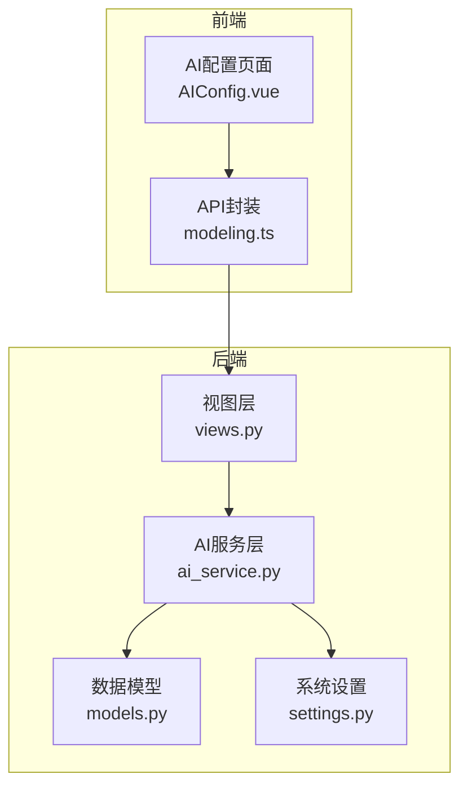
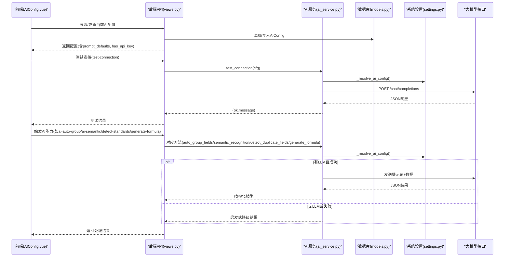
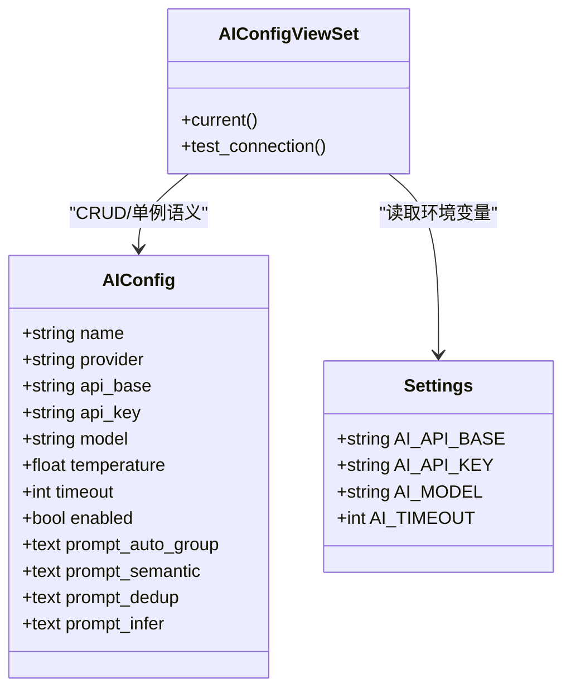
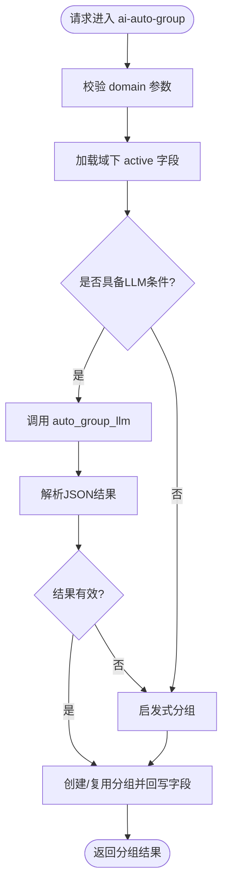
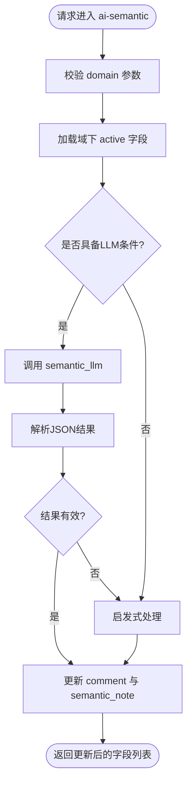
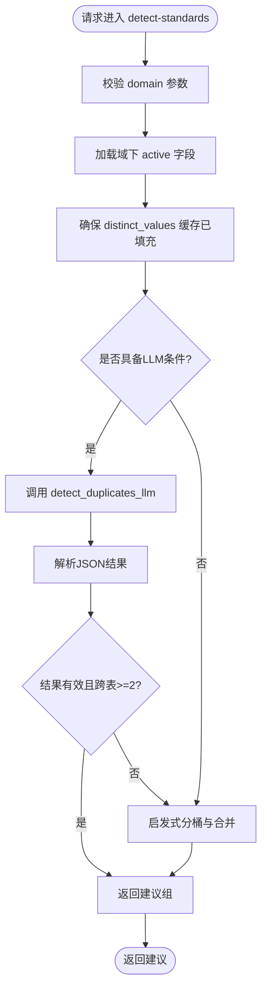
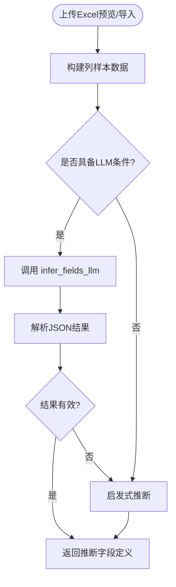
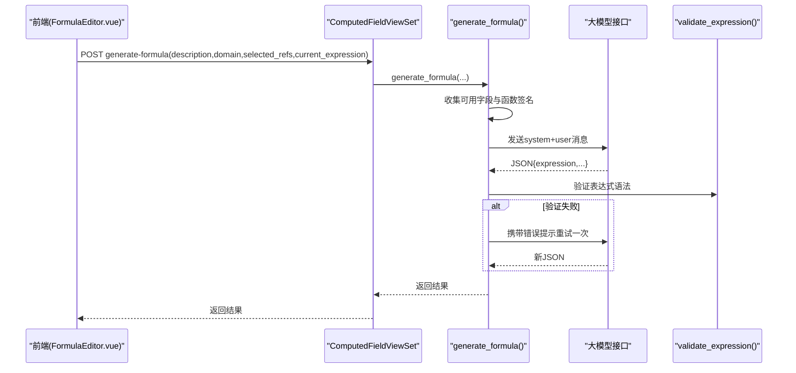
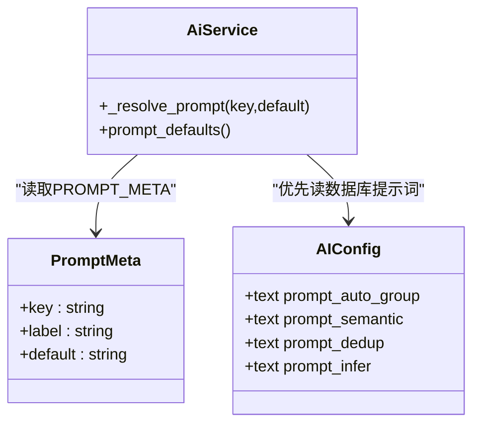
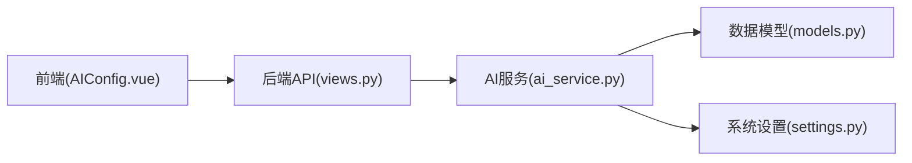

# AI智能服务

<cite>
**本文引用的文件**   
- [ai_service.py](file://backend/apps/modeling/ai_service.py)
- [models.py](file://backend/apps/modeling/models.py)
- [settings.py](file://backend/config/settings.py)
- [views.py](file://backend/apps/modeling/views.py)
- [AIConfig.vue](file://frontend/src/views/settings/AIConfig.vue)
- [modeling.ts](file://frontend/src/api/modeling.ts)
</cite>

## 目录
1. [简介](#简介)
2. [项目结构](#项目结构)
3. [核心组件](#核心组件)
4. [架构总览](#架构总览)
5. [详细组件分析](#详细组件分析)
6. [依赖关系分析](#依赖关系分析)
7. [性能考量](#性能考量)
8. [故障排查指南](#故障排查指南)
9. [结论](#结论)
10. [附录：配置与API参考](#附录配置与api参考)

## 简介
本文件为 MetaData002 的“AI智能服务”提供完整技术文档。内容涵盖：
- 支持 OpenAI 兼容接口的多提供商（deepseek、openai、qwen、zhipu、moonshot）配置与管理
- 字段自动分组、语义识别、跨表去重检测、Excel 字段推断、自然语言生成计算表达式等场景应用
- 提示词工程设计与可配置模板机制
- 调用流程、错误处理与重试策略
- 环境变量与数据库配置的优先级关系
- 完整的配置指南、API接口说明与最佳实践建议

## 项目结构
AI智能服务主要位于后端 modeling 应用中，前端通过设置页进行配置管理，并通过REST API驱动各项能力。

**图表来源** 
- [AIConfig.vue:1-305](file://frontend/src/views/settings/AIConfig.vue#L1-L305)
- [modeling.ts:409-445](file://frontend/src/api/modeling.ts#L409-L445)
- [views.py:1780-1822](file://backend/apps/modeling/views.py#L1780-L1822)
- [ai_service.py:19-54](file://backend/apps/modeling/ai_service.py#L19-L54)
- [models.py:387-419](file://backend/apps/modeling/models.py#L387-L419)
- [settings.py:109-113](file://backend/config/settings.py#L109-L113)

**章节来源**
- [ai_service.py:19-54](file://backend/apps/modeling/ai_service.py#L19-L54)
- [models.py:387-419](file://backend/apps/modeling/models.py#L387-L419)
- [settings.py:109-113](file://backend/config/settings.py#L109-L113)
- [views.py:1780-1822](file://backend/apps/modeling/views.py#L1780-L1822)
- [AIConfig.vue:1-305](file://frontend/src/views/settings/AIConfig.vue#L1-L305)
- [modeling.ts:409-445](file://frontend/src/api/modeling.ts#L409-L445)

## 核心组件
- AI服务层（ai_service.py）：统一封装OpenAI兼容接口调用、提示词解析、各业务能力的实现与降级策略
- 数据模型（models.py）：AIConfig存储连接参数与提示词模板；Field/StandardField/Table等承载业务数据
- 视图层（views.py）：暴露AI配置管理与字段AI能力（自动分组、语义识别、去重检测、公式生成等）的REST API
- 前端配置（AIConfig.vue + modeling.ts）：提供厂商预设、模型选择、提示词编辑、连接测试与保存

**章节来源**
- [ai_service.py:1-100](file://backend/apps/modeling/ai_service.py#L1-L100)
- [models.py:301-367](file://backend/apps/modeling/models.py#L301-L367)
- [models.py:387-419](file://backend/apps/modeling/models.py#L387-L419)
- [views.py:1154-1226](file://backend/apps/modeling/views.py#L1154-L1226)
- [views.py:1780-1822](file://backend/apps/modeling/views.py#L1780-L1822)
- [AIConfig.vue:1-305](file://frontend/src/views/settings/AIConfig.vue#L1-L305)
- [modeling.ts:409-445](file://frontend/src/api/modeling.ts#L409-L445)

## 架构总览
AI智能服务采用“视图层 -> 服务层 -> 模型/设置”的分层架构，支持OpenAI兼容接口的多提供商接入，并在无LLM或调用失败时回退到启发式算法保证可用性。

**图表来源** 
- [views.py:1780-1822](file://backend/apps/modeling/views.py#L1780-L1822)
- [ai_service.py:19-76](file://backend/apps/modeling/ai_service.py#L19-L76)
- [ai_service.py:171-203](file://backend/apps/modeling/ai_service.py#L171-L203)
- [ai_service.py:240-280](file://backend/apps/modeling/ai_service.py#L240-L280)
- [ai_service.py:326-433](file://backend/apps/modeling/ai_service.py#L326-L433)
- [ai_service.py:558-748](file://backend/apps/modeling/ai_service.py#L558-L748)
- [settings.py:109-113](file://backend/config/settings.py#L109-L113)
- [models.py:387-419](file://backend/apps/modeling/models.py#L387-L419)

## 详细组件分析

### AI配置管理与提供商支持
- 支持提供商：deepseek、openai、qwen、zhipu、moonshot、custom
- 前端在模型选择时自动填充对应的api_base与模型列表；用户也可切换为自定义模式手动填写接口地址
- 配置项包括：name、provider、api_base、api_key、model、temperature、timeout、enabled
- 提示词模板可在数据库中覆盖默认值，未设置则使用内置默认

**图表来源** 
- [models.py:387-419](file://backend/apps/modeling/models.py#L387-L419)
- [settings.py:109-113](file://backend/config/settings.py#L109-L113)
- [views.py:1780-1822](file://backend/apps/modeling/views.py#L1780-L1822)
- [AIConfig.vue:114-121](file://frontend/src/views/settings/AIConfig.vue#L114-L121)

**章节来源**
- [models.py:387-419](file://backend/apps/modeling/models.py#L387-L419)
- [settings.py:109-113](file://backend/config/settings.py#L109-L113)
- [views.py:1780-1822](file://backend/apps/modeling/views.py#L1780-L1822)
- [AIConfig.vue:114-121](file://frontend/src/views/settings/AIConfig.vue#L114-L121)
- [modeling.ts:409-445](file://frontend/src/api/modeling.ts#L409-L445)

### 字段自动分组
- 入口：/fields/ai-auto-group/?domain=...
- 逻辑：优先调用LLM按业务主题分组；失败或未启用时回退到关键词启发式分组
- 输出：创建或复用FieldGroup，并批量更新字段的group外键

**图表来源** 
- [views.py:1154-1181](file://backend/apps/modeling/views.py#L1154-L1181)
- [ai_service.py:171-203](file://backend/apps/modeling/ai_service.py#L171-L203)
- [ai_service.py:205-236](file://backend/apps/modeling/ai_service.py#L205-L236)

**章节来源**
- [views.py:1154-1181](file://backend/apps/modeling/views.py#L1154-L1181)
- [ai_service.py:171-203](file://backend/apps/modeling/ai_service.py#L171-L203)
- [ai_service.py:205-236](file://backend/apps/modeling/ai_service.py#L205-L236)

### 语义识别（注释补全 + 同义/歧义标识）
- 入口：/fields/ai-semantic/?domain=...
- 逻辑：优先LLM生成中文注释与语义标记；失败或未启用时回退到启发式（空注释回填、英文注释保留、名称规范化聚类）
- 输出：更新字段的comment与semantic_note字段

**图表来源** 
- [views.py:1183-1226](file://backend/apps/modeling/views.py#L1183-L1226)
- [ai_service.py:240-280](file://backend/apps/modeling/ai_service.py#L240-L280)
- [ai_service.py:282-310](file://backend/apps/modeling/ai_service.py#L282-L310)

**章节来源**
- [views.py:1183-1226](file://backend/apps/modeling/views.py#L1183-L1226)
- [ai_service.py:240-280](file://backend/apps/modeling/ai_service.py#L240-L280)
- [ai_service.py:282-310](file://backend/apps/modeling/ai_service.py#L282-L310)

### 跨表去重检测（等价组检测）
- 入口：/fields/detect-standards/?domain=...
- 逻辑：优先LLM综合编码归一化、中文名称归一化、去重值集合一致性判断；失败或未启用时回退到启发式（编码/名称归一化分桶 + 去重值集合完全相同）
- 输出：仅返回建议，不落库；应用时需调用apply-standards

**图表来源** 
- [views.py:1227-1265](file://backend/apps/modeling/views.py#L1227-L1265)
- [ai_service.py:326-433](file://backend/apps/modeling/ai_service.py#L326-L433)
- [ai_service.py:347-408](file://backend/apps/modeling/ai_service.py#L347-L408)

**章节来源**
- [views.py:1227-1265](file://backend/apps/modeling/views.py#L1227-L1265)
- [ai_service.py:326-433](file://backend/apps/modeling/ai_service.py#L326-L433)
- [ai_service.py:347-408](file://backend/apps/modeling/ai_service.py#L347-L408)

### Excel 字段推断
- 入口：/tables/preview-excel/ 与 import-excel/ 中返回 inferred_fields
- 逻辑：优先LLM根据列名与样本行推断字段类型、长度、必填、注释；失败或未启用时回退到启发式（布尔/日期/数字/字符串判定）

**图表来源** 
- [ai_service.py:437-479](file://backend/apps/modeling/ai_service.py#L437-L479)
- [ai_service.py:481-552](file://backend/apps/modeling/ai_service.py#L481-L552)
- [modeling.ts:65-82](file://frontend/src/api/modeling.ts#L65-L82)

**章节来源**
- [ai_service.py:437-479](file://backend/apps/modeling/ai_service.py#L437-L479)
- [ai_service.py:481-552](file://backend/apps/modeling/ai_service.py#L481-L552)
- [modeling.ts:65-82](file://frontend/src/api/modeling.ts#L65-L82)

### 自然语言生成计算表达式
- 入口：/computed-fields/generate-formula/
- 逻辑：收集域内活跃字段与函数签名，构造system prompt；首次生成后自动验证表达式语法，失败携带错误信息重试一次；无LLM配置时报错不降级
- 输出：包含expression、explanation、reasoning、risk、code、name、output_type

**图表来源** 
- [views.py:2051-2061](file://backend/apps/modeling/views.py#L2051-L2061)
- [ai_service.py:558-748](file://backend/apps/modeling/ai_service.py#L558-L748)
- [FormulaEditor.vue:764-789](file://frontend/src/views/modeling/components/FormulasEditor.vue#L764-L789)

**章节来源**
- [views.py:2051-2061](file://backend/apps/modeling/views.py#L2051-L2061)
- [ai_service.py:558-748](file://backend/apps/modeling/ai_service.py#L558-L748)
- [modeling.ts:375-381](file://frontend/src/api/modeling.ts#L375-L381)

### 提示词工程与模板管理
- 内置默认提示词：字段分组、语义识别、跨表去重检测、Excel字段推断
- 可通过AIConfig的prompt_*字段覆盖默认指令；未设置时使用内置默认
- 前端提供“恢复默认”按钮，便于快速回退

**图表来源** 
- [ai_service.py:101-167](file://backend/apps/modeling/ai_service.py#L101-L167)
- [models.py:404-408](file://backend/apps/modeling/models.py#L404-L408)
- [AIConfig.vue:86-101](file://frontend/src/views/settings/AIConfig.vue#L86-L101)

**章节来源**
- [ai_service.py:101-167](file://backend/apps/modeling/ai_service.py#L101-L167)
- [models.py:404-408](file://backend/apps/modeling/models.py#L404-L408)
- [AIConfig.vue:86-101](file://frontend/src/views/settings/AIConfig.vue#L86-L101)

## 依赖关系分析
- 视图层依赖ai_service完成具体AI能力
- ai_service依赖models中的AIConfig与业务实体（Field/Table等），以及settings中的环境变量
- 前端通过modeling.ts封装API调用，AIConfig.vue负责配置交互

**图表来源** 
- [modeling.ts:409-445](file://frontend/src/api/modeling.ts#L409-L445)
- [views.py:1780-1822](file://backend/apps/modeling/views.py#L1780-L1822)
- [ai_service.py:19-54](file://backend/apps/modeling/ai_service.py#L19-L54)
- [models.py:387-419](file://backend/apps/modeling/models.py#L387-L419)
- [settings.py:109-113](file://backend/config/settings.py#L109-L113)

**章节来源**
- [modeling.ts:409-445](file://frontend/src/api/modeling.ts#L409-L445)
- [views.py:1780-1822](file://backend/apps/modeling/views.py#L1780-L1822)
- [ai_service.py:19-54](file://backend/apps/modeling/ai_service.py#L19-L54)
- [models.py:387-419](file://backend/apps/modeling/models.py#L387-L419)
- [settings.py:109-113](file://backend/config/settings.py#L109-L113)

## 性能考量
- 网络超时：通过AI_TIMEOUT控制HTTP请求超时时间，避免阻塞
- 降级策略：无LLM或调用失败时自动回退到启发式算法，保障功能可用
- 缓存优化：distinct_values缓存减少重复采样开销；AIConfig查询仅取enabled=True的一条
- 并发与资源：requests库调用外部接口，注意服务端并发限制与限流策略

[本节为通用指导，无需特定文件引用]

## 故障排查指南
- 连接测试失败：检查AI_API_KEY是否为空、requests依赖是否安装、api_base是否正确
- 返回非JSON：LLM可能未按约定返回JSON，系统将尝试解析代码块包裹的JSON；若仍失败将回退启发式
- 表达式生成失败：确认描述清晰、所选引用字段存在且激活；系统会在验证失败后自动重试一次
- 配置优先级：数据库AIConfig（enabled=True）优先于环境变量；未启用时回退到环境变量

**章节来源**
- [ai_service.py:78-90](file://backend/apps/modeling/ai_service.py#L78-L90)
- [ai_service.py:92-99](file://backend/apps/modeling/ai_service.py#L92-L99)
- [ai_service.py:558-579](file://backend/apps/modeling/ai_service.py#L558-L579)
- [views.py:1801-1822](file://backend/apps/modeling/views.py#L1801-L1822)

## 结论
MetaData002的AI智能服务以OpenAI兼容接口为核心，结合可配置提示词与多提供商支持，实现了字段自动分组、语义识别、跨表去重检测、Excel字段推断与公式生成等关键能力。通过数据库与环境变量的双轨配置、严格的错误处理与降级策略，系统在稳定性与灵活性之间取得平衡。建议在生产环境中合理设置超时与温度参数，并根据业务需求定制提示词以提升效果。

[本节为总结性内容，无需特定文件引用]

## 附录：配置与API参考

### 环境变量与数据库配置优先级
- 优先级：数据库AIConfig（enabled=True） > 环境变量（AI_API_BASE/AI_API_KEY/AI_MODEL/AI_TIMEOUT）
- 未启用AIConfig时，系统回退到环境变量配置

**章节来源**
- [ai_service.py:19-48](file://backend/apps/modeling/ai_service.py#L19-L48)
- [settings.py:109-113](file://backend/config/settings.py#L109-L113)

### 前端配置界面要点
- 提供商预设：deepseek/openai/qwen/zhipu/moonshot/custom
- 模型选择：自动带出对应api_base与模型列表
- 提示词编辑：支持恢复默认与逐条覆盖
- 连接测试：支持临时覆盖配置进行测试

**章节来源**
- [AIConfig.vue:114-121](file://frontend/src/views/settings/AIConfig.vue#L114-L121)
- [AIConfig.vue:86-101](file://frontend/src/views/settings/AIConfig.vue#L86-L101)
- [AIConfig.vue:275-289](file://frontend/src/views/settings/AIConfig.vue#L275-L289)

### REST API清单（节选）
- AI配置
  - GET/PUT/PATCH /ai-config/current/
  - POST /ai-config/test-connection/
- 字段AI能力
  - POST /fields/ai-auto-group/?domain=...
  - POST /fields/ai-semantic/?domain=...
  - POST /fields/detect-standards/?domain=...
  - POST /fields/apply-standards/?domain=...
- 计算字段AI
  - POST /computed-fields/generate-formula/

**章节来源**
- [views.py:1780-1822](file://backend/apps/modeling/views.py#L1780-L1822)
- [views.py:1154-1181](file://backend/apps/modeling/views.py#L1154-L1181)
- [views.py:1183-1226](file://backend/apps/modeling/views.py#L1183-L1226)
- [views.py:1227-1265](file://backend/apps/modeling/views.py#L1227-L1265)
- [views.py:2051-2061](file://backend/apps/modeling/views.py#L2051-L2061)
- [modeling.ts:409-445](file://frontend/src/api/modeling.ts#L409-L445)
- [modeling.ts:375-381](file://frontend/src/api/modeling.ts#L375-L381)