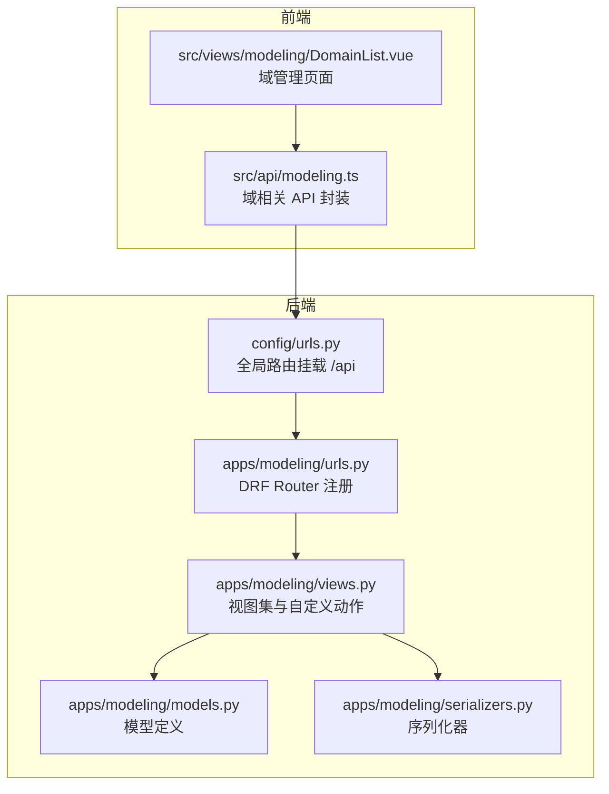
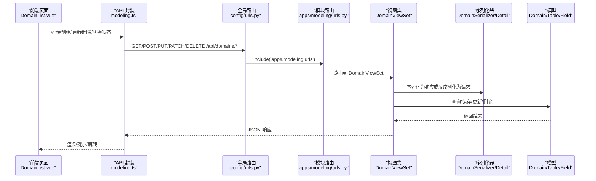
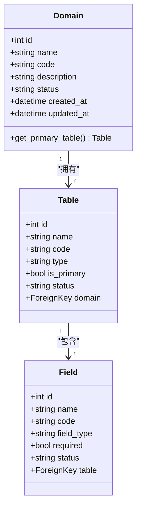
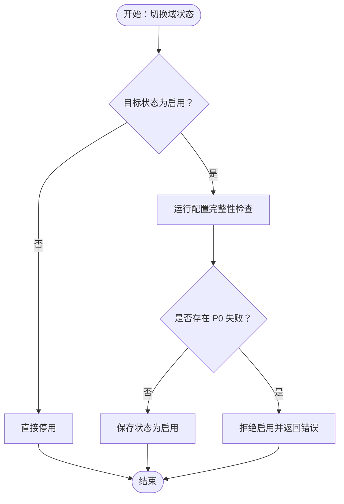
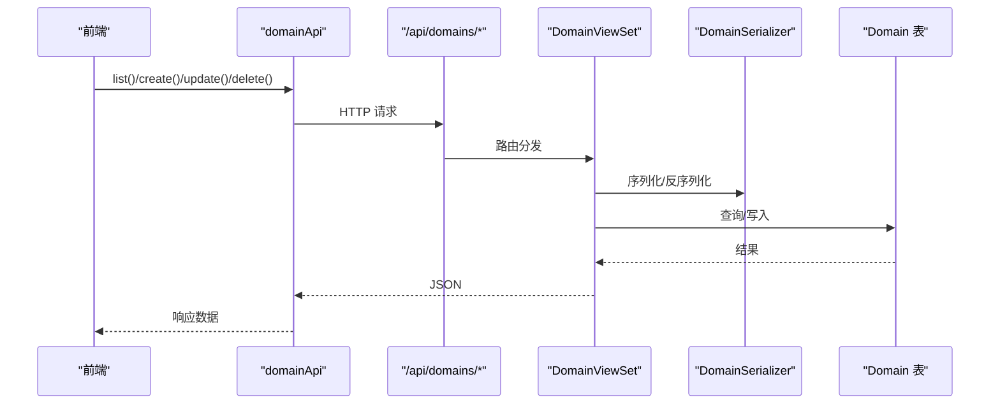
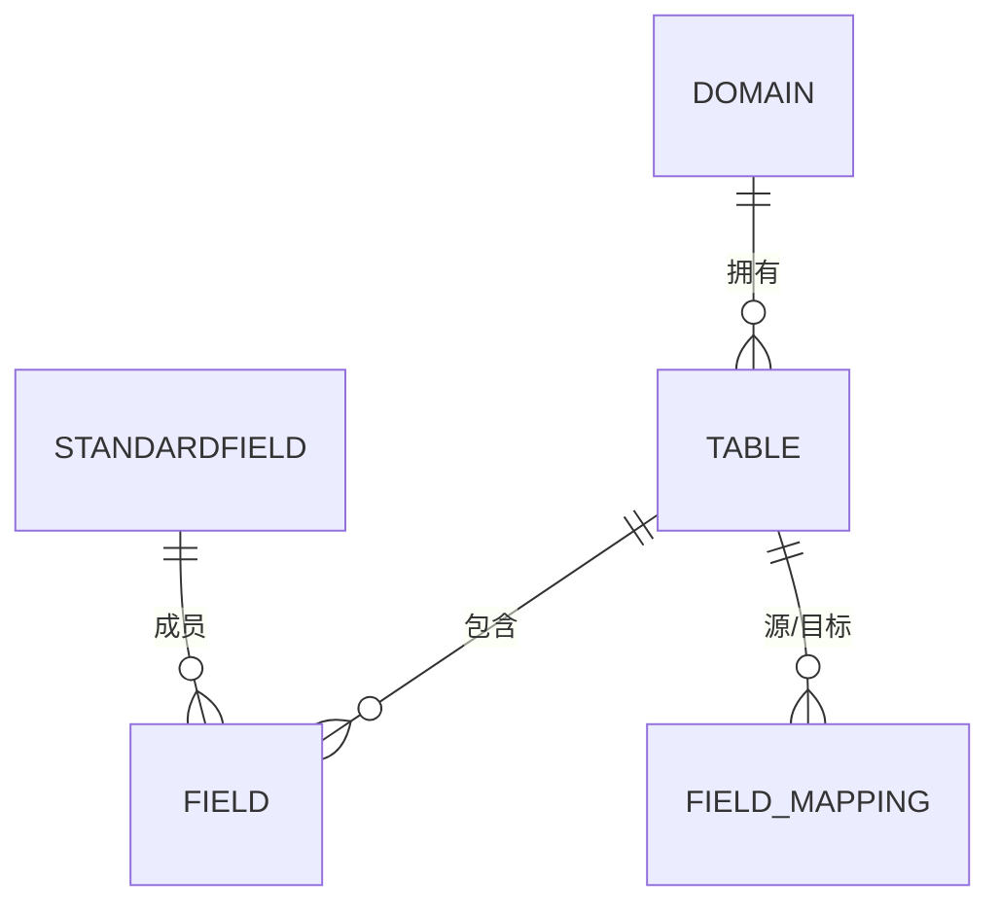
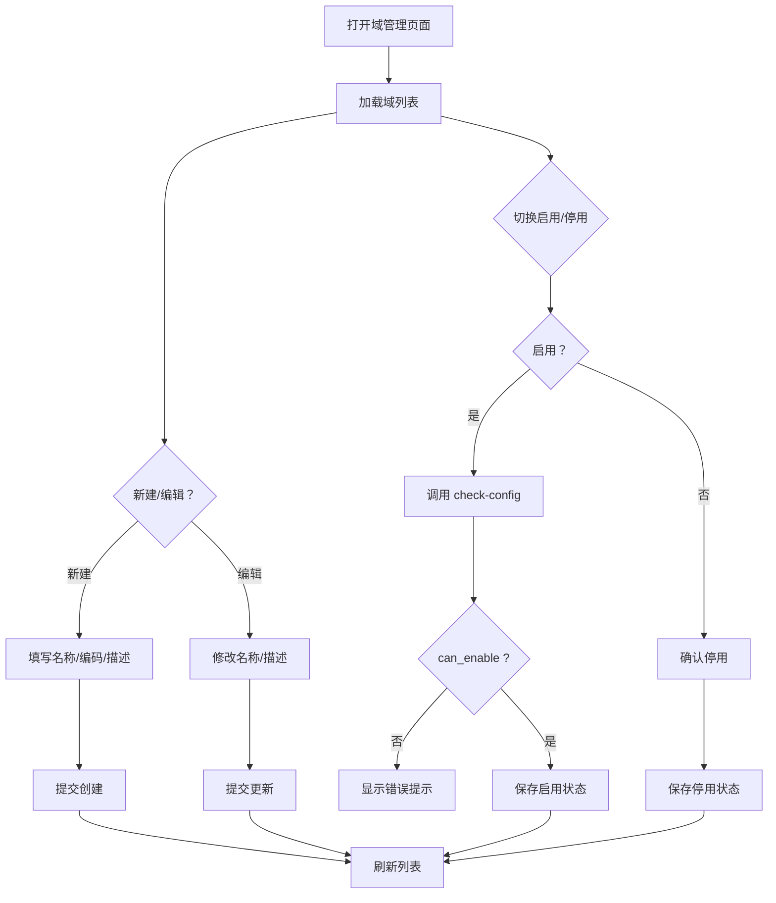
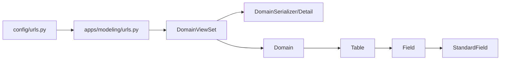

# 域管理

<cite>
**本文引用的文件**   
- [models.py](file://backend/apps/modeling/models.py)
- [views.py](file://backend/apps/modeling/views.py)
- [serializers.py](file://backend/apps/modeling/serializers.py)
- [urls.py](file://backend/apps/modeling/urls.py)
- [urls.py](file://backend/config/urls.py)
- [DomainList.vue](file://frontend/src/views/modeling/DomainList.vue)
- [modeling.ts](file://frontend/src/api/modeling.ts)
- [tests.py](file://backend/apps/modeling/tests.py)
</cite>

## 目录
1. [简介](#简介)
2. [项目结构](#项目结构)
3. [核心组件](#核心组件)
4. [架构总览](#架构总览)
5. [详细组件分析](#详细组件分析)
6. [依赖关系分析](#依赖关系分析)
7. [性能考虑](#性能考虑)
8. [故障排查指南](#故障排查指南)
9. [结论](#结论)
10. [附录：API 与前端操作手册](#附录api-与前端操作手册)

## 简介
本文件为 MetaData002 的“域管理”功能提供系统化、可操作的文档。内容涵盖主数据域（Domain）的概念与作用、域作为业务领域边界的划分原则、域与表/字段的层级关系，以及域的完整 CRUD 流程、状态管理机制（启用/已废弃）及其对关联实体的影响。同时提供后端 API 接口说明与前端界面操作流程示例，帮助读者快速上手并深入理解实现细节。

## 项目结构
- 后端采用 Django + DRF，模型定义在 modeling 应用下，路由通过 DefaultRouter 注册，RESTful 端点以 /api/domains 为根路径。
- 前端使用 Vue 3 + Ant Design Vue，域管理页面位于 views/modeling/DomainList.vue，API 调用封装在 api/modeling.ts。

**图表来源** 
- [urls.py:1-9](file://backend/config/urls.py#L1-L9)
- [urls.py:1-20](file://backend/apps/modeling/urls.py#L1-L20)
- [views.py:430-503](file://backend/apps/modeling/views.py#L430-L503)
- [serializers.py:15-32](file://backend/apps/modeling/serializers.py#L15-L32)
- [models.py:32-58](file://backend/apps/modeling/models.py#L32-L58)

**章节来源**
- [urls.py:1-9](file://backend/config/urls.py#L1-L9)
- [urls.py:1-20](file://backend/apps/modeling/urls.py#L1-L20)

## 核心组件
- Domain（域）：主数据域实体，包含名称、编码、描述、状态等字段，用于划分业务边界。
- Table（表）：属于某个域下的实体表，支持本地表与外部数据源表，具备主表标记与状态。
- Field（字段）：表的字段定义，支持类型、校验规则、分组、标准字段归属等。
- StandardField（标准字段）：概念层一等公民，跨表去重后的统一语义承载体。
- FieldGroup（字段分组）、FieldOption（枚举选项）、FieldMapping（字段映射）、ComputedField（计算字段）等辅助实体。

重点：
- Domain 与 Table 是 1:N 关系；Table 与 Field 是 1:N 关系；StandardField 与 Field 是多对多（成员）。
- 域的状态控制启用/停用，启用前需通过配置完整性检查（P0/P1/P2 级别）。

**章节来源**
- [models.py:32-58](file://backend/apps/modeling/models.py#L32-L58)
- [models.py:60-123](file://backend/apps/modeling/models.py#L60-L123)
- [models.py:162-300](file://backend/apps/modeling/models.py#L162-L300)
- [models.py:301-367](file://backend/apps/modeling/models.py#L301-L367)

## 架构总览
域管理的整体架构由“前端页面 → API 封装 → DRF 路由 → 视图集 → 序列化器 → 模型”组成。

**图表来源** 
- [urls.py:1-9](file://backend/config/urls.py#L1-L9)
- [urls.py:1-20](file://backend/apps/modeling/urls.py#L1-L20)
- [views.py:430-503](file://backend/apps/modeling/views.py#L430-L503)
- [serializers.py:15-32](file://backend/apps/modeling/serializers.py#L15-L32)
- [models.py:32-58](file://backend/apps/modeling/models.py#L32-L58)

## 详细组件分析

### 域（Domain）模型与状态管理
- 字段与约束：
  - name（名称）、code（唯一编码）、description（描述）、status（启用/已废弃），时间戳自动维护。
  - get_primary_table() 方法返回该域的主表（is_primary=True 且 active）。
- 状态机制：
  - 启用（active）：表示域可用，参与档案与字段管理。
  - 已废弃（deprecated）：表示域不可用，通常用于下线或归档。
- 与表的关系：
  - 域通过外键关联多个表，表也有独立的状态与主表标记。
  - 主表变更会影响组合字段的主字段自动分配逻辑。

**图表来源** 
- [models.py:32-58](file://backend/apps/modeling/models.py#L32-L58)
- [models.py:60-123](file://backend/apps/modeling/models.py#L60-L123)
- [models.py:301-367](file://backend/apps/modeling/models.py#L301-L367)

**章节来源**
- [models.py:32-58](file://backend/apps/modeling/models.py#L32-L58)
- [models.py:60-123](file://backend/apps/modeling/models.py#L60-L123)

### 域的状态检查与启用策略
- 启用前置检查：当尝试将域状态从非 active 切换到 active 时，后端执行 _check_domain_config()，汇总 8 项检查结果（P0 阻断、P1 警告、P2 建议）。
- 若存在 P0 失败项，则抛出验证错误，阻止启用。
- 前端在切换开关时根据后端返回的错误信息提示用户完善配置。

**图表来源** 
- [views.py:430-453](file://backend/apps/modeling/views.py#L430-L453)
- [views.py:327-428](file://backend/apps/modeling/views.py#L327-L428)

**章节来源**
- [views.py:430-453](file://backend/apps/modeling/views.py#L430-L453)
- [views.py:327-428](file://backend/apps/modeling/views.py#L327-L428)

### 域的 CRUD 接口与流程
- 列表：GET /api/domains/，返回分页结果，支持按 name/code 搜索与 status 过滤。
- 详情：GET /api/domains/{id}/
- 创建：POST /api/domains/，校验 name/code 必填，code 唯一。
- 更新：PUT/PATCH /api/domains/{id}/，支持部分更新。
- 删除：DELETE /api/domains/{id}/
- 自定义动作：
  - check-config：GET /api/domains/{id}/check-config/，返回配置检查清单与是否可启用。
  - pk-status：GET /api/domains/{id}/pk-status/，返回各表主键与关系配置状态。

**图表来源** 
- [urls.py:1-20](file://backend/apps/modeling/urls.py#L1-L20)
- [views.py:430-503](file://backend/apps/modeling/views.py#L430-L503)
- [serializers.py:15-32](file://backend/apps/modeling/serializers.py#L15-L32)

**章节来源**
- [views.py:430-503](file://backend/apps/modeling/views.py#L430-L503)
- [serializers.py:15-32](file://backend/apps/modeling/serializers.py#L15-L32)

### 域与表/字段的层级关系
- 域（Domain）→ 表（Table）→ 字段（Field）
- 表支持两种类型：本地表（local）与数据源表（source）。
- 字段支持类型、长度、必填、默认值、日期格式、校验规则、分组、标准字段归属等。
- 标准字段（StandardField）用于跨表去重与属性统一管理，成员字段（Field）可同步属性。

**图表来源** 
- [models.py:32-58](file://backend/apps/modeling/models.py#L32-L58)
- [models.py:60-123](file://backend/apps/modeling/models.py#L60-L123)
- [models.py:162-300](file://backend/apps/modeling/models.py#L162-L300)
- [models.py:301-367](file://backend/apps/modeling/models.py#L301-L367)
- [models.py:474-489](file://backend/apps/modeling/models.py#L474-L489)

**章节来源**
- [models.py:60-123](file://backend/apps/modeling/models.py#L60-L123)
- [models.py:162-300](file://backend/apps/modeling/models.py#L162-L300)
- [models.py:301-367](file://backend/apps/modeling/models.py#L301-L367)
- [models.py:474-489](file://backend/apps/modeling/models.py#L474-L489)

### 前端界面操作流程
- 列表页展示域的名称、编码、描述、状态、配置状态、表数量与创建时间。
- 新建域：弹窗表单输入名称、编码、描述，提交后刷新列表。
- 编辑域：点击名称进入编辑弹窗，修改后保存。
- 启用/停用：通过开关切换状态，启用前进行配置检查，失败时弹出错误提示。
- 配置检查详情：点击配置状态标签查看 8 项检查结果与级别。
- 删除域：确认后删除，提示不可恢复。

**图表来源** 
- [DomainList.vue:1-338](file://frontend/src/views/modeling/DomainList.vue#L1-L338)
- [modeling.ts:27-47](file://frontend/src/api/modeling.ts#L27-L47)

**章节来源**
- [DomainList.vue:1-338](file://frontend/src/views/modeling/DomainList.vue#L1-L338)
- [modeling.ts:27-47](file://frontend/src/api/modeling.ts#L27-L47)

## 依赖关系分析
- 路由依赖：
  - 全局路由 config/urls.py 将 /api 指向 apps.modeling.urls。
  - apps.modeling.urls 使用 DefaultRouter 注册 domains、tables、fields 等视图集。
- 视图依赖：
  - DomainViewSet 依赖 DomainSerializer/Detail 进行序列化。
  - 自定义动作 check-config 与 pk-status 依赖 _check_domain_config() 与数据库查询。
- 模型依赖：
  - Domain 与 Table、Field、StandardField 之间存在外键与集合关系。
  - Table.save() 中强制 type 与 data_source 的一致性。
  - StandardField.save() 中属性变更会同步到成员字段。

**图表来源** 
- [urls.py:1-9](file://backend/config/urls.py#L1-L9)
- [urls.py:1-20](file://backend/apps/modeling/urls.py#L1-L20)
- [views.py:430-503](file://backend/apps/modeling/views.py#L430-L503)
- [serializers.py:15-32](file://backend/apps/modeling/serializers.py#L15-L32)
- [models.py:32-58](file://backend/apps/modeling/models.py#L32-L58)

**章节来源**
- [urls.py:1-9](file://backend/config/urls.py#L1-L9)
- [urls.py:1-20](file://backend/apps/modeling/urls.py#L1-L20)
- [views.py:430-503](file://backend/apps/modeling/views.py#L430-L503)
- [serializers.py:15-32](file://backend/apps/modeling/serializers.py#L15-L32)
- [models.py:32-58](file://backend/apps/modeling/models.py#L32-L58)

## 性能考虑
- 列表查询：
  - DomainViewSet 支持 search_fields 与 filterset_fields，合理使用索引提升查询效率。
- 配置检查：
  - _check_domain_config() 涉及多次聚合与计数，建议在高频使用时缓存结果或优化 SQL。
- 外部数据源表字段同步：
  - TableViewSet._sync_external_table_fields() 动态连接外部数据库，注意连接复用与异常处理。
- 前端全量拉取：
  - 前端 API 封装使用 page_size=100000 避免分页截断，适用于小数据集场景。

[本节为通用指导，不直接分析具体文件]

## 故障排查指南
- 启用失败：
  - 检查 P0 配置项是否全部通过（主表、主键、字段编码、标准编码唯一性等）。
  - 查看 check-config 返回的 checks 列表与 can_enable 标志。
- 停用失败：
  - 若表参与字段映射，则不允许停用，需先解除映射关系。
- 删除失败：
  - 确认域下无强依赖实体或权限不足。
- 外部数据源连接失败：
  - 检查数据源配置（主机、端口、用户名、密码、schema）与驱动兼容性。

**章节来源**
- [views.py:327-428](file://backend/apps/modeling/views.py#L327-L428)
- [views.py:690-722](file://backend/apps/modeling/views.py#L690-L722)
- [tests.py:67-118](file://backend/apps/modeling/tests.py#L67-L118)

## 结论
域管理是 MetaData002 的核心能力之一，通过清晰的模型设计与完善的 API 支持，实现了业务领域的边界划分与生命周期管理。结合前端的直观操作与后端严格的配置检查，确保域在启用前的完整性与一致性。建议在生产环境中关注配置检查的性能优化与外部数据源的连接稳定性。

[本节为总结性内容，不直接分析具体文件]

## 附录：API 与前端操作手册

### 后端 API 定义
- 列表：GET /api/domains/
  - 参数：search=name|code, status=active|deprecated
  - 返回：分页结果，包含 id、name、code、description、status、table_count、created_at、updated_at
- 详情：GET /api/domains/{id}/
  - 返回：域详细信息
- 创建：POST /api/domains/
  - 请求体：{name, code, description}
  - 校验：name/code 必填，code 唯一
- 更新：PUT/PATCH /api/domains/{id}/
  - 请求体：部分字段更新
- 删除：DELETE /api/domains/{id}/
- 自定义动作：
  - GET /api/domains/{id}/check-config/
    - 返回：checks（8 项检查）、can_enable、p0/p1/p2 计数
  - GET /api/domains/{id}/pk-status/
    - 返回：tables（主键与关系配置状态）、all_configured、total、configured_count

**章节来源**
- [views.py:430-503](file://backend/apps/modeling/views.py#L430-L503)
- [serializers.py:15-32](file://backend/apps/modeling/serializers.py#L15-L32)

### 前端操作示例
- 新建域：
  - 点击“新建域”，填写名称、编码、描述，提交后刷新列表。
- 编辑域：
  - 点击域名称进入编辑弹窗，修改后保存。
- 启用/停用：
  - 通过开关切换状态，启用前进行配置检查，失败时提示错误。
- 配置检查详情：
  - 点击配置状态标签查看检查结果与级别。
- 删除域：
  - 点击删除按钮，确认后删除。

**章节来源**
- [DomainList.vue:1-338](file://frontend/src/views/modeling/DomainList.vue#L1-L338)
- [modeling.ts:27-47](file://frontend/src/api/modeling.ts#L27-L47)