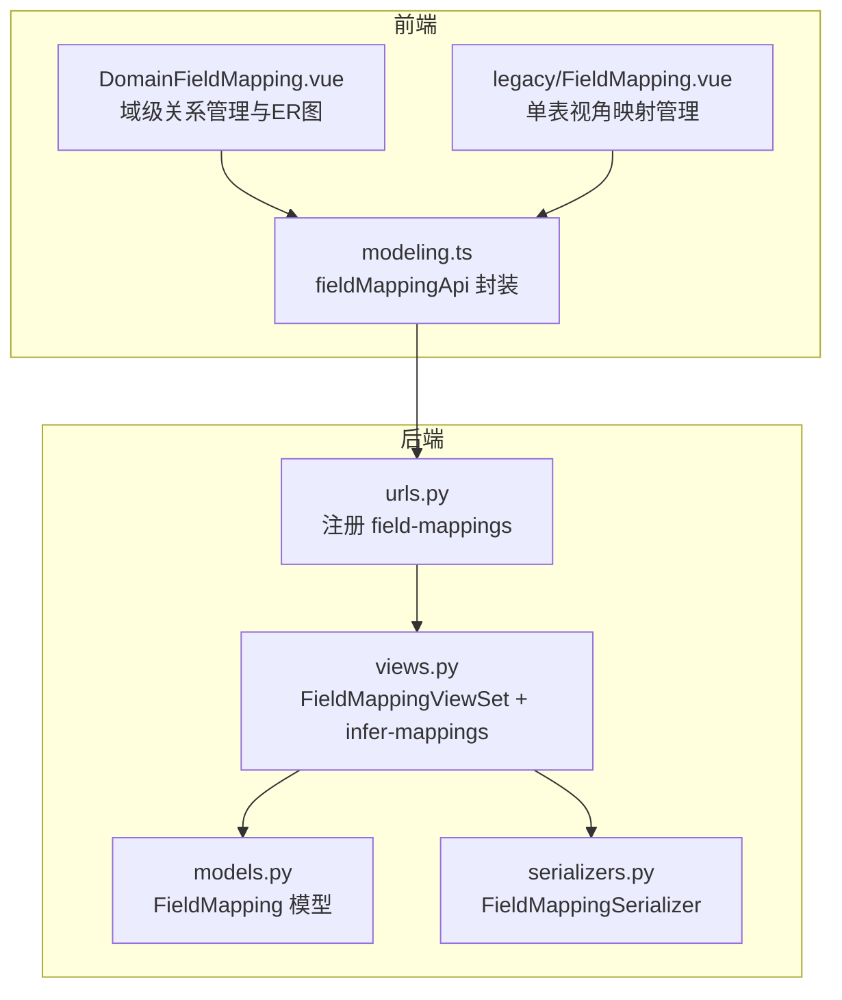
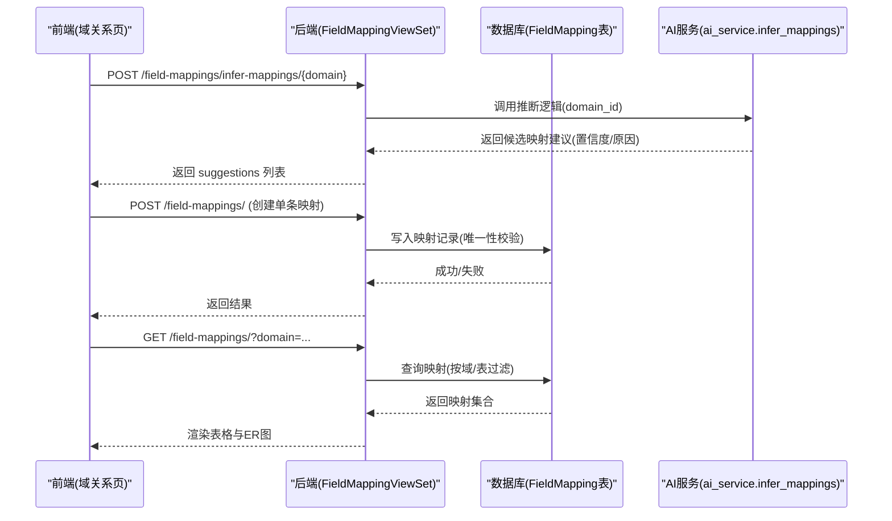
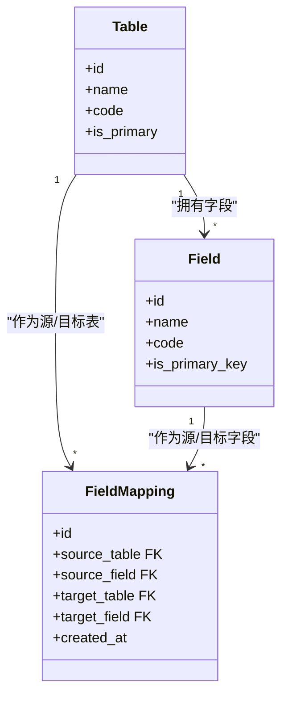
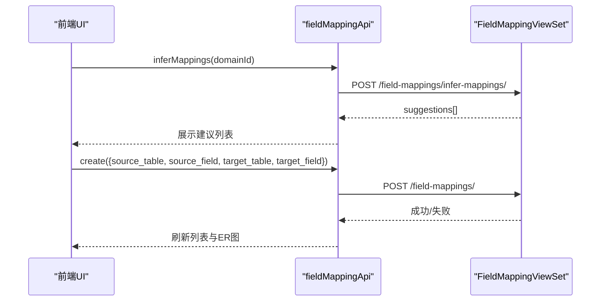
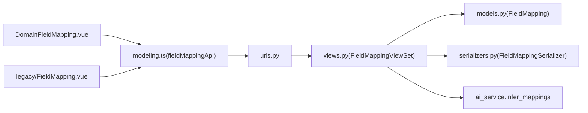

# 字段映射

<cite>
**本文引用的文件**   
- [models.py](file://backend/apps/modeling/models.py)
- [views.py](file://backend/apps/modeling/views.py)
- [serializers.py](file://backend/apps/modeling/serializers.py)
- [urls.py](file://backend/apps/modeling/urls.py)
- [DomainFieldMapping.vue](file://frontend/src/views/modeling/DomainFieldMapping.vue)
- [FieldMapping.vue](file://frontend/src/views/modeling/legacy/FieldMapping.vue)
- [modeling.ts](file://frontend/src/api/modeling.ts)
</cite>

## 目录
1. [引言](#引言)
2. [项目结构](#项目结构)
3. [核心组件](#核心组件)
4. [架构总览](#架构总览)
5. [详细组件分析](#详细组件分析)
6. [依赖关系分析](#依赖关系分析)
7. [性能与约束](#性能与约束)
8. [故障排查指南](#故障排查指南)
9. [结论](#结论)
10. [附录：API 接口文档](#附录api-接口文档)

## 引言
本文件围绕 MetaData002 的“字段映射（FieldMapping）”能力进行系统化说明，重点解释表间关系如何通过“源表、源字段、目标表、目标字段”的四元组模型实现，并覆盖其在数据集成与 ETL 中的作用、映射关系的验证与约束、CRUD 接口（含批量与冲突处理）、与标准字段归并的关系，以及在数据同步中的应用场景。同时提供完整的后端 API 定义与前端配置界面说明，帮助读者快速理解与落地使用。

## 项目结构
字段映射功能涉及后端模型、序列化器、视图集、URL 路由以及前端的域级关系管理页面和旧版单表映射页。

图表来源
- [models.py:474-489](file://backend/apps/modeling/models.py#L474-L489)
- [serializers.py:230-241](file://backend/apps/modeling/serializers.py#L230-L241)
- [views.py:1824-1879](file://backend/apps/modeling/views.py#L1824-L1879)
- [urls.py:12](file://backend/apps/modeling/urls.py#L12)
- [DomainFieldMapping.vue:206-214](file://frontend/src/views/modeling/DomainFieldMapping.vue#L206-L214)
- [FieldMapping.vue:54-61](file://frontend/src/views/modeling/legacy/FieldMapping.vue#L54-L61)
- [modeling.ts:465-480](file://frontend/src/api/modeling.ts#L465-L480)

章节来源
- [models.py:474-489](file://backend/apps/modeling/models.py#L474-L489)
- [serializers.py:230-241](file://backend/apps/modeling/serializers.py#L230-L241)
- [views.py:1824-1879](file://backend/apps/modeling/views.py#L1824-L1879)
- [urls.py:12](file://backend/apps/modeling/urls.py#L12)
- [DomainFieldMapping.vue:206-214](file://frontend/src/views/modeling/DomainFieldMapping.vue#L206-L214)
- [FieldMapping.vue:54-61](file://frontend/src/views/modeling/legacy/FieldMapping.vue#L54-L61)
- [modeling.ts:465-480](file://frontend/src/api/modeling.ts#L465-L480)

## 核心组件
- 数据模型 FieldMapping：四元组（source_table, source_field, target_table, target_field），唯一性约束保证同一对源/目标字段组合不重复。
- 序列化器 FieldMappingSerializer：对外暴露映射项及可读名称字段，便于前端展示。
- 视图集 FieldMappingViewSet：提供标准 CRUD，支持按 table/domain 过滤；提供 infer-mappings 动作用于 AI 推断建议。
- 前端 DomainFieldMapping.vue：域级关系管理，支持新建/编辑/删除映射、AI 自动推断、ER 图可视化、联合主键支持。
- 前端 legacy/FieldMapping.vue：单表视角的映射管理（历史兼容）。
- API 封装 modeling.ts：统一调用后端 /field-mappings/* 接口。

章节来源
- [models.py:474-489](file://backend/apps/modeling/models.py#L474-L489)
- [serializers.py:230-241](file://backend/apps/modeling/serializers.py#L230-L241)
- [views.py:1824-1879](file://backend/apps/modeling/views.py#L1824-L1879)
- [DomainFieldMapping.vue:206-214](file://frontend/src/views/modeling/DomainFieldMapping.vue#L206-L214)
- [FieldMapping.vue:54-61](file://frontend/src/views/modeling/legacy/FieldMapping.vue#L54-L61)
- [modeling.ts:465-480](file://frontend/src/api/modeling.ts#L465-L480)

## 架构总览
字段映射在系统内承担“将多表间的语义关联显式化”的职责，为后续的标准字段归并、档案 schema 生成、数据同步与质量校验提供基础。其整体交互如下：

图表来源
- [views.py:1824-1879](file://backend/apps/modeling/views.py#L1824-L1879)
- [modeling.ts:465-480](file://frontend/src/api/modeling.ts#L465-L480)
- [DomainFieldMapping.vue:711-734](file://frontend/src/views/modeling/DomainFieldMapping.vue#L711-L734)

## 详细组件分析

### 数据模型与四元组关系
- FieldMapping 模型包含四个外键：source_table、source_field、target_table、target_field，构成“源表→源字段→目标表→目标字段”的映射关系。
- 通过 unique_together 约束确保同一对源/目标字段组合的唯一性，避免重复映射。
- 该模型是“表间关系”的核心载体，支撑 ER 图连线、数据同步路径、一致性检查等上层能力。

图表来源
- [models.py:60-123](file://backend/apps/modeling/models.py#L60-L123)
- [models.py:301-367](file://backend/apps/modeling/models.py#L301-L367)
- [models.py:474-489](file://backend/apps/modeling/models.py#L474-L489)

章节来源
- [models.py:474-489](file://backend/apps/modeling/models.py#L474-L489)

### 序列化器与对外数据结构
- FieldMappingSerializer 暴露 id、source/target 表与字段的 ID 及其可读名称，便于前端直接展示。
- 所有读操作均返回完整映射项，写操作接受四元组参数。

章节来源
- [serializers.py:230-241](file://backend/apps/modeling/serializers.py#L230-L241)

### 视图集与业务逻辑
- FieldMappingViewSet 继承 ModelViewSet，默认提供 list/create/update/delete 等标准能力。
- get_queryset 支持按 table 或 domain 过滤，便于前端按域或表维度加载。
- infer-mappings 动作调用 ai_service.infer_mappings 获取建议，并回填字段与表的显示信息（编码、名称、是否主键等）。

图表来源
- [views.py:1845-1879](file://backend/apps/modeling/views.py#L1845-L1879)

章节来源
- [views.py:1824-1879](file://backend/apps/modeling/views.py#L1824-L1879)

### 前端界面与交互
- 域级关系管理（DomainFieldMapping.vue）
  - 支持新建/编辑/删除映射，支持联合主键（多个 PK 字段合并为一个虚拟字段）。
  - 提供 AI 自动推断弹窗，用户勾选建议后批量创建映射。
  - 内置 ER 图可视化，节点为表，边为字段映射；支持拖拽布局并持久化坐标。
- 单表视角（legacy/FieldMapping.vue）
  - 针对某张表查看与其相关的映射，支持新建与删除。

图表来源
- [DomainFieldMapping.vue:711-734](file://frontend/src/views/modeling/DomainFieldMapping.vue#L711-L734)
- [modeling.ts:465-480](file://frontend/src/api/modeling.ts#L465-L480)

章节来源
- [DomainFieldMapping.vue:206-214](file://frontend/src/views/modeling/DomainFieldMapping.vue#L206-L214)
- [FieldMapping.vue:54-61](file://frontend/src/views/modeling/legacy/FieldMapping.vue#L54-L61)
- [modeling.ts:465-480](file://frontend/src/api/modeling.ts#L465-L480)

### 与标准字段归并的关系
- 标准字段（StandardField）用于跨表去重与概念层建模，物理字段通过 standard_field 外键挂靠到标准字段。
- 字段映射与标准字段归并协同工作：
  - 映射明确“哪张表的哪个字段”参与归档/同步，标准字段负责“语义等价”的聚合与属性下发。
  - 主表变更时，标准字段的主字段可自动跟随（人工指定除外），影响数据更新源头选择。
- 在 ETL/数据同步中，映射决定数据流向，标准字段决定字段属性与释放策略。

章节来源
- [models.py:162-300](file://backend/apps/modeling/models.py#L162-L300)
- [models.py:301-367](file://backend/apps/modeling/models.py#L301-L367)

### 数据集成与 ETL 应用场景
- 数据集成：通过映射建立源系统与档案系统之间的字段对应关系，驱动数据抽取、转换与装载。
- ETL 过程：
  - 抽取：根据映射确定读取哪些源表/字段。
  - 转换：结合标准字段属性（类型、格式、枚举、校验规则）进行转换。
  - 装载：依据映射写入目标表字段，必要时进行一致性校验与冲突处理。
- 质量与一致性：映射关系可作为一致性检查规则的基础，配合领域配置完整性检查（如多表域需配置映射）。

章节来源
- [views.py:327-427](file://backend/apps/modeling/views.py#L327-L427)

## 依赖关系分析
- URL 注册：field-mappings 路由指向 FieldMappingViewSet。
- ViewSet 依赖：
  - 模型 FieldMapping（读写）
  - 序列化器 FieldMappingSerializer（序列化/反序列化）
  - AI 服务 ai_service.infer_mappings（推断建议）
- 前端依赖：
  - modeling.ts 中的 fieldMappingApi 封装 HTTP 调用
  - DomainFieldMapping.vue 与 legacy/FieldMapping.vue 分别承载不同视角的管理界面

图表来源
- [urls.py:12](file://backend/apps/modeling/urls.py#L12)
- [views.py:1824-1879](file://backend/apps/modeling/views.py#L1824-L1879)
- [modeling.ts:465-480](file://frontend/src/api/modeling.ts#L465-L480)

章节来源
- [urls.py:12](file://backend/apps/modeling/urls.py#L12)
- [views.py:1824-1879](file://backend/apps/modeling/views.py#L1824-L1879)
- [modeling.ts:465-480](file://frontend/src/api/modeling.ts#L465-L480)

## 性能与约束
- 唯一性约束：unique_together(source_table, source_field, target_table, target_field) 防止重复映射，减少冗余与歧义。
- 查询优化：ViewSet 使用 select_related 预加载关联对象，降低 N+1 查询开销。
- 过滤能力：支持按 table 或 domain 过滤，便于前端按需加载。
- 联合主键：前端支持将多个 PK 字段合并为虚拟字段，简化 ER 图与编辑体验。
- 性能建议：
  - 大批量创建映射时，建议在前端分批提交，避免单次请求过大。
  - ER 图渲染时仅加载参与映射的表字段，减少不必要的数据传输。

章节来源
- [models.py:474-489](file://backend/apps/modeling/models.py#L474-L489)
- [views.py:1824-1843](file://backend/apps/modeling/views.py#L1824-L1843)
- [DomainFieldMapping.vue:418-441](file://frontend/src/views/modeling/DomainFieldMapping.vue#L418-L441)

## 故障排查指南
- 常见错误
  - 未传入 domain：infer-mappings 需要 domain 参数，缺失将返回错误。
  - 重复映射：违反唯一性约束，后端会拒绝创建。
  - 表停用限制：若表存在映射关系，则不允许停用（toggle-status 拦截）。
- 定位方法
  - 查看浏览器网络面板，确认请求体与响应体。
  - 检查后端日志，关注异常堆栈与数据库错误。
  - 使用 pk-status 接口检查域下各表的主键与映射配置状态。

章节来源
- [views.py:1845-1879](file://backend/apps/modeling/views.py#L1845-L1879)
- [views.py:690-721](file://backend/apps/modeling/views.py#L690-L721)
- [views.py:470-502](file://backend/apps/modeling/views.py#L470-L502)

## 结论
字段映射以四元组模型为核心，清晰表达表间关系，为数据集成与 ETL 提供可靠基础。通过标准化 API 与友好的前端界面，用户可以高效完成映射的创建、编辑、删除与 AI 辅助推断。结合标准字段归并与域配置完整性检查，系统在数据质量与一致性方面具备完善的保障机制。

## 附录：API 接口文档

### 通用说明
- 基础路径：/field-mappings/
- 认证：遵循项目全局认证策略（由框架统一处理）
- 分页：默认分页，前端可使用 withFullPage 拉取全量

### 列表与过滤
- 接口：GET /field-mappings/
- 查询参数：
  - table: 按表过滤（作为源表或目标表）
  - domain: 按域过滤（源表或目标表所属域）
- 返回：映射列表（包含 id、source/target 表与字段 ID 及名称、创建时间）

章节来源
- [views.py:1824-1843](file://backend/apps/modeling/views.py#L1824-L1843)
- [serializers.py:230-241](file://backend/apps/modeling/serializers.py#L230-L241)

### 创建映射
- 接口：POST /field-mappings/
- 请求体：
  - source_table: 源表 ID
  - source_field: 源字段 ID
  - target_table: 目标表 ID
  - target_field: 目标字段 ID
- 返回：创建的映射对象

章节来源
- [modeling.ts:467](file://frontend/src/api/modeling.ts#L467)
- [serializers.py:230-241](file://backend/apps/modeling/serializers.py#L230-L241)

### 删除映射
- 接口：DELETE /field-mappings/{id}/
- 返回：删除结果

章节来源
- [modeling.ts:468](file://frontend/src/api/modeling.ts#L468)

### AI 推断映射
- 接口：POST /field-mappings/infer-mappings/
- 请求体：
  - domain: 域 ID
- 返回：
  - suggestions: 建议列表，每项包含 source/target 表与字段 ID、名称、编码、是否主键、置信度、原因
  - count: 建议数量

章节来源
- [views.py:1845-1879](file://backend/apps/modeling/views.py#L1845-L1879)
- [modeling.ts:469-480](file://frontend/src/api/modeling.ts#L469-L480)

### 前端 API 封装
- fieldMappingApi.list(params)
- fieldMappingApi.create(data)
- fieldMappingApi.delete(id)
- fieldMappingApi.inferMappings(domainId)

章节来源
- [modeling.ts:465-480](file://frontend/src/api/modeling.ts#L465-L480)

### 前端界面说明
- 域级关系管理（DomainFieldMapping.vue）
  - 功能：新建/编辑/删除映射、AI 自动推断、ER 图可视化、联合主键支持、布局持久化
  - 关键交互：
    - “AI建立关系”按钮触发推断流程
    - 弹窗勾选建议后批量创建映射
    - ER 图节点可拖动，位置保存至表记录
- 单表视角（legacy/FieldMapping.vue）
  - 功能：针对某张表查看与创建映射，支持删除

章节来源
- [DomainFieldMapping.vue:206-214](file://frontend/src/views/modeling/DomainFieldMapping.vue#L206-L214)
- [FieldMapping.vue:54-61](file://frontend/src/views/modeling/legacy/FieldMapping.vue#L54-L61)