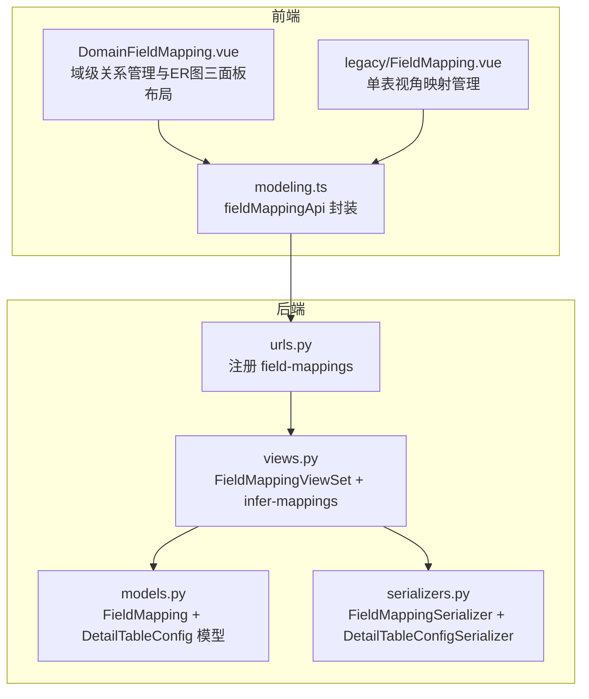
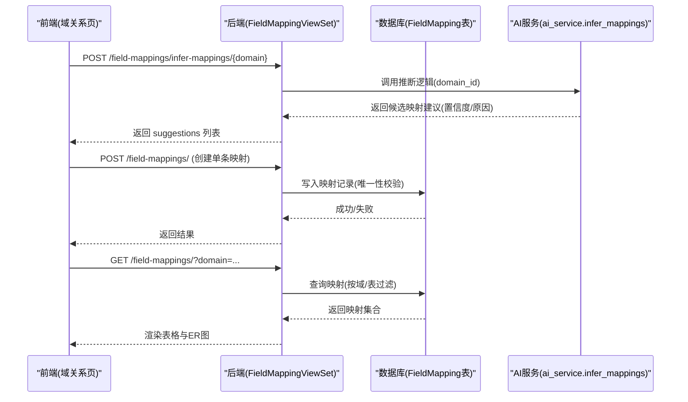
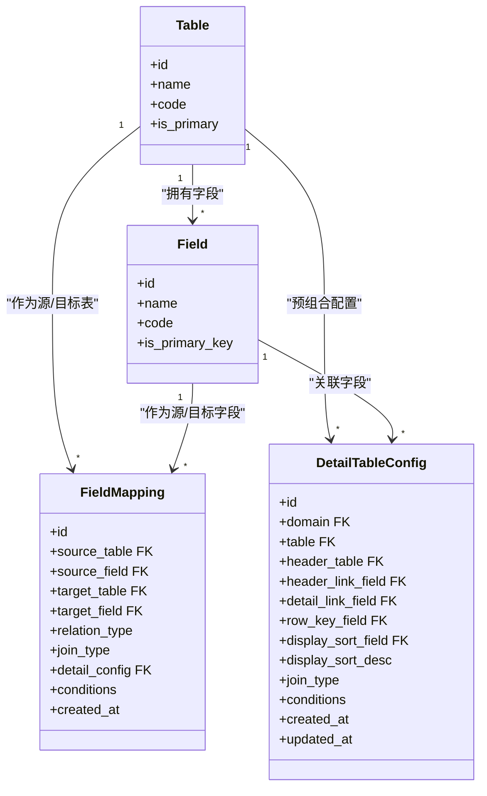
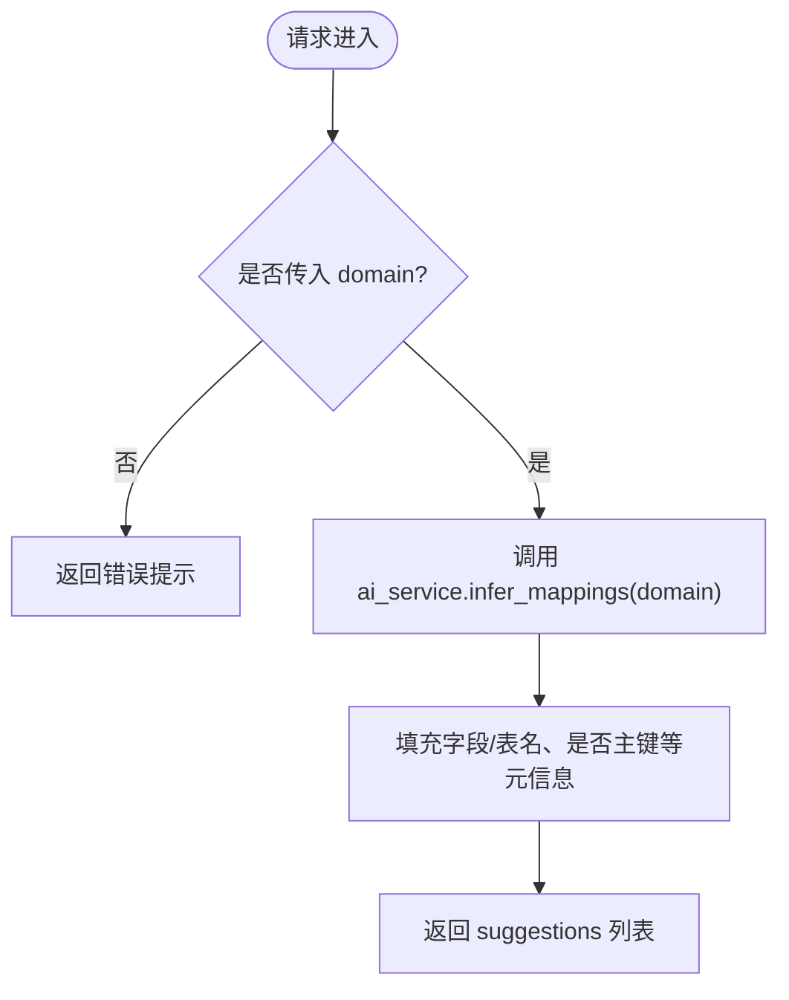
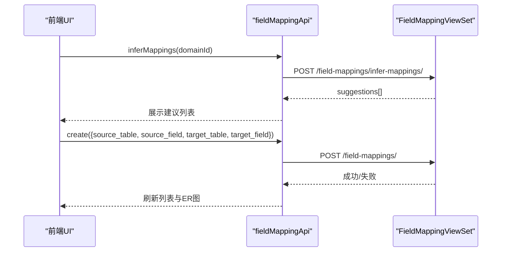
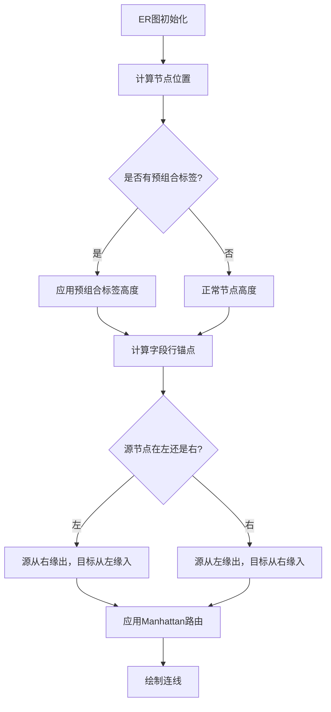
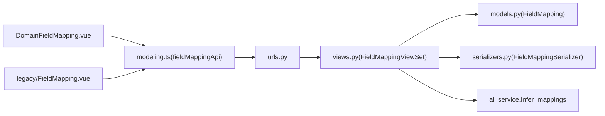

# 字段映射

<cite>
**本文引用的文件**   
- [models.py](file://backend/apps/modeling/models.py)
- [views.py](file://backend/apps/modeling/views.py)
- [serializers.py](file://backend/apps/modeling/serializers.py)
- [urls.py](file://backend/apps/modeling/urls.py)
- [DomainFieldMapping.vue](file://frontend/src/views/modeling/DomainFieldMapping.vue)
- [FieldMapping.vue](file://frontend/src/views/modeling/legacy/FieldMapping.vue)
- [modeling.ts](file://frontend/src/api/modeling.ts)
</cite>

## 更新摘要
**所做更改**   
- **重大更新**：ER图可视化功能显著增强，包括改进的连接点计算、节点定位、视觉一致性和智能路由
- **新增功能**：实现了固定的锚点函数erFieldRowAnchor，解决了连接点偏移问题
- **性能优化**：添加了erRenderInProgress标志位，防止初始渲染时触发位置保存导致的重复请求
- **智能路由**：基于节点位置的智能连接路由，自动判断源节点和目标节点的相对位置
- **节点高度计算**：增强了erNodeHeight函数，支持预组合标签的高度计算
- **过滤显示**：ER图中只显示参与映射的字段，提升可视化效果
- **UI优化**：改进了按钮层次结构，将"预组合"降为次要操作，保持"新建映射"为主按钮

## 目录
1. [引言](#引言)
2. [项目结构](#项目结构)
3. [核心组件](#核心组件)
4. [架构总览](#架构总览)
5. [详细组件分析](#详细组件分析)
6. [依赖关系分析](#依赖关系分析)
7. [性能与约束](#性能与约束)
8. [故障排查指南](#故障排查指南)
9. [结论](#结论)
10. [附录：API 接口文档](#附录api-接口文档)

## 引言
本文件围绕 MetaData002 的"字段映射（FieldMapping）"能力进行系统化说明，重点解释表间关系如何通过"源表、源字段、目标表、目标字段"的四元组模型实现，并覆盖其在数据集成与 ETL 中的作用、映射关系的验证与约束、CRUD 接口（含批量与冲突处理）、与标准字段归并的关系，以及在数据同步中的应用场景。同时提供完整的后端 API 定义与前端配置界面说明，帮助读者快速理解与落地使用。

**更新** 本次更新重点增强了ER图可视化的用户体验，通过改进的连接点计算、智能路由和性能优化，使得ER图的连线更加准确和流畅。**新增了强大的列表筛选和条件构建功能**，用户现在可以通过关键词搜索和关系类型过滤快速定位所需的映射关系，同时支持为引用关系配置复杂的筛选条件。

## 项目结构
字段映射功能涉及后端模型、序列化器、视图集、URL 路由以及前端的域级关系管理页面和旧版单表映射页。

**图表来源**
- [models.py:519-625](file://backend/apps/modeling/models.py#L519-L625)
- [serializers.py:230-278](file://backend/apps/modeling/serializers.py#L230-L278)
- [views.py:2049-2177](file://backend/apps/modeling/views.py#L2049-L2177)
- [urls.py:12](file://backend/apps/modeling/urls.py#L12)
- [DomainFieldMapping.vue:138-200](file://frontend/src/views/modeling/DomainFieldMapping.vue#L138-L200)
- [FieldMapping.vue:54-61](file://frontend/src/views/modeling/legacy/FieldMapping.vue#L54-L61)
- [modeling.ts:465-480](file://frontend/src/api/modeling.ts#L465-L480)

章节来源
- [models.py:519-625](file://backend/apps/modeling/models.py#L519-L625)
- [serializers.py:230-278](file://backend/apps/modeling/serializers.py#L230-L278)
- [views.py:2049-2177](file://backend/apps/modeling/views.py#L2049-L2177)
- [urls.py:12](file://backend/apps/modeling/urls.py#L12)
- [DomainFieldMapping.vue:138-200](file://frontend/src/views/modeling/DomainFieldMapping.vue#L138-L200)
- [FieldMapping.vue:54-61](file://frontend/src/views/modeling/legacy/FieldMapping.vue#L54-L61)
- [modeling.ts:465-480](file://frontend/src/api/modeling.ts#L465-L480)

## 核心组件
- 数据模型 FieldMapping：四元组（source_table, source_field, target_table, target_field），唯一性约束保证同一对源/目标字段组合不重复，新增JOIN类型支持。
- 数据模型 DetailTableConfig：预组合配置，支持头表+明细表的组合关系，包含JOIN类型配置。
- 序列化器 FieldMappingSerializer：对外暴露映射项及可读名称字段，新增预组合全名展示。
- 序列化器 DetailTableConfigSerializer：预组合配置的序列化和校验。
- 视图集 FieldMappingViewSet：提供标准 CRUD，支持按 table/domain 过滤；提供 infer-mappings 动作用于 AI 推断建议。
- 前端 DomainFieldMapping.vue：域级关系管理，支持新建/编辑/删除映射、AI 自动推断、ER 图可视化、联合主键支持、**三面板布局**。
- 前端 legacy/FieldMapping.vue：单表视角的映射管理（历史兼容）。
- API 封装 modeling.ts：统一调用后端 /field-mappings/* 接口。

**更新** ER图可视化功能得到显著增强，包括改进的连接点计算、智能路由和性能优化。**新增了强大的列表筛选功能**，支持按关系类型（普通关联/明细子表）和关键词搜索，用户可以快速定位所需的映射关系。

章节来源
- [models.py:519-625](file://backend/apps/modeling/models.py#L519-L625)
- [serializers.py:230-278](file://backend/apps/modeling/serializers.py#L230-L278)
- [views.py:2049-2177](file://backend/apps/modeling/views.py#L2049-L2177)
- [DomainFieldMapping.vue:138-200](file://frontend/src/views/modeling/DomainFieldMapping.vue#L138-L200)
- [FieldMapping.vue:54-61](file://frontend/src/views/modeling/legacy/FieldMapping.vue#L54-L61)
- [modeling.ts:465-480](file://frontend/src/api/modeling.ts#L465-L480)

## 架构总览
字段映射在系统内承担"将多表间的语义关联显式化"的职责，为后续的标准字段归并、档案 schema 生成、数据同步与质量校验提供基础。其整体交互如下：

**图表来源**
- [views.py:2098-2132](file://backend/apps/modeling/views.py#L2098-L2132)
- [modeling.ts:465-480](file://frontend/src/api/modeling.ts#L465-L480)
- [DomainFieldMapping.vue:1341-1364](file://frontend/src/views/modeling/DomainFieldMapping.vue#L1341-L1364)

## 详细组件分析

### 数据模型与四元组关系
- FieldMapping 模型包含四个外键：source_table、source_field、target_table、target_field，构成"源表→源字段→目标表→目标字段"的映射关系。
- 通过 unique_together 约束确保同一对源/目标字段组合的唯一性，避免重复映射。
- 新增 join_type 字段支持 LEFT JOIN 和 INNER JOIN 两种连接方式。
- 该模型是"表间关系"的核心载体，支撑 ER 图连线、数据同步路径、一致性检查等上层能力。

**更新** 移除了target_field必须为主键的严格验证，现在支持任意字段类型作为挂载点。这一变更使得字段映射能够适应更复杂的数据集成场景，特别是当目标字段不是主键时的情况。

**图表来源**
- [models.py:60-123](file://backend/apps/modeling/models.py#L60-L123)
- [models.py:301-367](file://backend/apps/modeling/models.py#L301-L367)
- [models.py:519-625](file://backend/apps/modeling/models.py#L519-L625)

章节来源
- [models.py:519-625](file://backend/apps/modeling/models.py#L519-L625)

### 序列化器与对外数据结构
- FieldMappingSerializer 暴露 id、source/target 表与字段的 ID 及其可读名称，新增预组合全名展示（detail_config_combo）。
- DetailTableConfigSerializer 提供预组合配置的完整序列化和校验，包括头表与明细表的关联字段验证。
- 所有读操作均返回完整映射项，写操作接受四元组参数。

**更新** 移除了对target_field的主键验证，现在支持任意字段类型。序列化器中的validate方法已更新以反映这一变更。

章节来源
- [serializers.py:230-278](file://backend/apps/modeling/serializers.py#L230-L278)
- [serializers.py:337-399](file://backend/apps/modeling/serializers.py#L337-L399)

### 视图集与业务逻辑
- FieldMappingViewSet 继承 ModelViewSet，默认提供 list/create/update/delete 等标准能力。
- get_queryset 支持按 table 或 domain 过滤，便于前端按域或表维度加载。
- infer-mappings 动作调用 ai_service.infer_mappings 获取建议，并回填字段与表的显示信息（编码、名称、是否主键等）。
- 新增 detail-check 动作用于检测存量 detail 映射的注册状态与方向异常。

**更新** 增强了预组合相关的业务逻辑，包括头表与明细表的关联字段自动检测、预组合配置的校验等。移除了对target_field的主键强校验。

**图表来源**
- [views.py:2098-2132](file://backend/apps/modeling/views.py#L2098-L2132)

章节来源
- [views.py:2049-2177](file://backend/apps/modeling/views.py#L2049-L2177)

### 前端界面与交互
- 域级关系管理（DomainFieldMapping.vue）
  - 支持新建/编辑/删除映射，支持联合主键（多个 PK 字段合并为一个虚拟字段）。
  - 提供 AI 自动推断弹窗，用户勾选建议后批量创建映射。
  - 内置 ER 图可视化，节点为表，边为字段映射；支持拖拽布局并持久化坐标。
  - **重大更新**：采用三面板布局设计，支持头表+关联字段+明细表的预组合配置。
  - **新增功能**：预组合关系的可视化展示，包括虚线连接和标签显示。
  - **新增筛选功能**：支持按关系类型（普通关联/明细子表）和关键词搜索，提升查找效率。
- 单表视角（legacy/FieldMapping.vue）
  - 针对某张表查看与其相关的映射，支持新建与删除。

**更新** 界面重构为三面板布局，提供更直观的预组合配置体验，包括头表选择、关联字段配置、明细表选择的完整流程。新的三面板布局包括：
- 左侧面板：头表选择和头表关联字段
- 中间面板：箭头指示和检测按钮
- 右侧面板：明细表选择和明细表关联字段

**重要更新** 移除了target_field必须为主键的限制，现在前端允许选择所有父表字段，不再限制只能选择主键字段。这一变更体现在loadTargetFields函数中，当relation_type为'detail'时，默认推荐单一主键但用户可改选任意字段。

**新增筛选功能**：
- 搜索框：支持搜索表名、字段名或编码
- 关系类型过滤器：区分普通关联和明细子表关系
- 实时过滤：输入时即时过滤映射列表

**图表来源**
- [DomainFieldMapping.vue:1341-1364](file://frontend/src/views/modeling/DomainFieldMapping.vue#L1341-L1364)
- [modeling.ts:465-480](file://frontend/src/api/modeling.ts#L465-L480)

章节来源
- [DomainFieldMapping.vue:138-200](file://frontend/src/views/modeling/DomainFieldMapping.vue#L138-L200)
- [FieldMapping.vue:54-61](file://frontend/src/views/modeling/legacy/FieldMapping.vue#L54-L61)
- [modeling.ts:465-480](file://frontend/src/api/modeling.ts#L465-L480)

### ER图可视化增强功能
**重大更新**：ER图可视化功能得到了显著增强，包括以下关键改进：

#### 连接点计算优化
- **固定锚点函数**：实现了`erFieldRowAnchor`函数，用于精确计算字段行的连接点位置
- **解决偏移问题**：修复了x6内置bbox anchor的dy语义导致的连接点偏移问题
- **异步渲染处理**：解决了HTML节点异步渲染完成前bbox高度为0的问题

#### 智能路由算法
- **基于位置的智能路由**：根据源节点和目标节点的相对位置自动判断连线方向
- **左右出线优化**：源节点在左时从右缘出、目标从左缘入；源在右时反向
- **Manhattan路由**：使用曼哈顿路由算法，确保连线清晰美观

#### 性能优化
- **渲染进度标记**：添加`erRenderInProgress`标志位，防止初始渲染时触发位置保存
- **防重注册机制**：使用`force=true`参数注册锚点，避免SPA路由切换时的重复注册错误
- **节点高度计算**：增强的`erNodeHeight`函数，支持预组合标签的高度计算

#### 视觉效果改进
- **过滤字段显示**：ER图中只显示参与映射的字段，提升可视化效果
- **预组合高亮**：支持绿色边框和阴影效果的高亮显示
- **智能连线**：连线颜色区分普通映射（金色）和预组合关系（绿色）

**图表来源**
- [DomainFieldMapping.vue:1016-1027](file://frontend/src/views/modeling/DomainFieldMapping.vue#L1016-L1027)
- [DomainFieldMapping.vue:1336-1363](file://frontend/src/views/modeling/DomainFieldMapping.vue#L1336-L1363)

章节来源
- [DomainFieldMapping.vue:1016-1027](file://frontend/src/views/modeling/DomainFieldMapping.vue#L1016-L1027)
- [DomainFieldMapping.vue:1336-1363](file://frontend/src/views/modeling/DomainFieldMapping.vue#L1336-L1363)

### 与标准字段归并的关系
- 标准字段（StandardField）用于跨表去重与概念层建模，物理字段通过 standard_field 外键挂靠到标准字段。
- 字段映射与标准字段归并协同工作：
  - 映射明确"哪张表的哪个字段"参与归档/同步，标准字段负责"语义等价"的聚合与属性下发。
  - 主表变更时，标准字段的主字段可自动跟随（人工指定除外），影响数据更新源头选择。
- 在 ETL/数据同步中，映射决定数据流向，标准字段决定字段属性与释放策略。

**更新** 移除了target_field必须为主键的限制后，预组合能力进一步增强了标准字段归并的灵活性，支持更复杂的头表+明细表组合场景。

章节来源
- [models.py:162-300](file://backend/apps/modeling/models.py#L162-L300)
- [models.py:301-367](file://backend/apps/modeling/models.py#L301-L367)

### 数据集成与 ETL 应用场景
- 数据集成：通过映射建立源系统与档案系统之间的字段对应关系，驱动数据抽取、转换与装载。
- ETL 过程：
  - 抽取：根据映射确定读取哪些源表/字段。
  - 转换：结合标准字段属性（类型、格式、枚举、校验规则）进行转换。
  - 装载：依据映射写入目标表字段，必要时进行一致性校验与冲突处理。
- 质量与一致性：映射关系可作为一致性检查规则的基础，配合领域配置完整性检查（如多表域需配置映射）。

**更新** 移除了target_field必须为主键的限制后，预组合能力支持更复杂的数据集成场景，特别是头表+明细表的平铺输出模式，满足价格表、分组表等业务需求。

章节来源
- [views.py:1820-1851](file://backend/apps/modeling/views.py#L1820-L1851)

## 依赖关系分析
- URL 注册：field-mappings 路由指向 FieldMappingViewSet。
- ViewSet 依赖：
  - 模型 FieldMapping（读写）
  - 序列化器 FieldMappingSerializer（序列化/反序列化）
  - AI 服务 ai_service.infer_mappings（推断建议）
- 前端依赖：
  - modeling.ts 中的 fieldMappingApi 封装 HTTP 调用
  - DomainFieldMapping.vue 与 legacy/FieldMapping.vue 分别承载不同视角的管理界面

**更新** 新增了对 DetailTableConfig 模型的依赖，支持预组合配置的管理。移除了对target_field主键的强依赖。

**图表来源**
- [urls.py:12](file://backend/apps/modeling/urls.py#L12)
- [views.py:2049-2177](file://backend/apps/modeling/views.py#L2049-L2177)
- [modeling.ts:465-480](file://frontend/src/api/modeling.ts#L465-L480)

章节来源
- [urls.py:12](file://backend/apps/modeling/urls.py#L12)
- [views.py:2049-2177](file://backend/apps/modeling/views.py#L2049-L2177)
- [modeling.ts:465-480](file://frontend/src/api/modeling.ts#L465-L480)

## 性能与约束
- 唯一性约束：unique_together(source_table, source_field, target_table, target_field) 防止重复映射，减少冗余与歧义。
- 查询优化：ViewSet 使用 select_related 预加载关联对象，降低 N+1 查询开销。
- 过滤能力：支持按 table 或 domain 过滤，便于前端按需加载。
- 联合主键：前端支持将多个 PK 字段合并为虚拟字段，简化 ER 图与编辑体验。
- **新增约束**：预组合配置的唯一性约束（同一域内一张明细表只能注册一次）。
- 性能建议：
  - 大批量创建映射时，建议在前端分批提交，避免单次请求过大。
  - ER 图渲染时仅加载参与映射的表字段，减少不必要的数据传输。

**更新** ER图性能得到显著优化，包括：
- **渲染进度控制**：通过`erRenderInProgress`标志位防止初始渲染时触发位置保存
- **防重注册机制**：使用`force=true`参数避免SPA路由切换时的重复注册错误
- **智能字段过滤**：ER图中只显示参与映射的字段，减少DOM元素数量
- **优化的节点高度计算**：`erNodeHeight`函数支持预组合标签的高度计算

章节来源
- [models.py:519-625](file://backend/apps/modeling/models.py#L519-L625)
- [views.py:2060-2071](file://backend/apps/modeling/views.py#L2060-2071)
- [DomainFieldMapping.vue:1005-1046](file://frontend/src/views/modeling/DomainFieldMapping.vue#L1005-L1046)

## 故障排查指南
- 常见错误
  - 未传入 domain：infer-mappings 需要 domain 参数，缺失将返回错误。
  - 重复映射：违反唯一性约束，后端会拒绝创建。
  - 表停用限制：若表存在映射关系，则不允许停用（toggle-status 拦截）。
  - **新增**：预组合配置冲突：同一明细表重复注册会返回详细的冲突信息。
- 定位方法
  - 查看浏览器网络面板，确认请求体与响应体。
  - 检查后端日志，关注异常堆栈与数据库错误。
  - 使用 pk-status 接口检查域下各表的主键与映射配置状态。
  - **新增**：使用 detail-check 接口检查预组合配置的注册状态和方向异常。

**更新** ER图相关故障排查：
- **连接点偏移问题**：检查`erFieldRowAnchor`函数是否正确计算锚点位置
- **重复注册错误**：确认Graph.registerAnchor使用了正确的force参数
- **性能问题**：监控`erRenderInProgress`标志位的状态，确保渲染完成后才启用位置保存
- **路由问题**：验证智能路由算法是否正确判断节点相对位置

章节来源
- [views.py:2098-2132](file://backend/apps/modeling/views.py#L2098-L2132)
- [views.py:2134-2177](file://backend/apps/modeling/views.py#L2134-L2177)
- [serializers.py:231-254](file://backend/apps/modeling/serializers.py#L231-L254)

## 结论
字段映射以四元组模型为核心，清晰表达表间关系，为数据集成与 ETL 提供可靠基础。通过标准化 API 与友好的前端界面，用户可以高效完成映射的创建、编辑、删除与 AI 辅助推断。结合标准字段归并与域配置完整性检查，系统在数据质量与一致性方面具备完善的保障机制。

**更新** 本次增强显著提升了字段映射的灵活性和用户体验：
- **ER图可视化大幅改进**：通过改进的连接点计算、智能路由和性能优化，使得ER图的连线更加准确和流畅
- **移除target_field主键限制**：现在支持任意字段类型作为挂载点，适应更复杂的数据集成场景
- **三面板布局优化**：提供更直观的预组合配置体验，通过左右分栏的设计让用户能够更清晰地看到头表与明细表的关联关系
- **新增筛选和条件构建功能**：用户可以通过关键词搜索和关系类型过滤快速定位所需映射，同时支持为引用关系配置复杂的筛选条件

## 附录：API 接口文档

### 通用说明
- 基础路径：/field-mappings/
- 认证：遵循项目全局认证策略（由框架统一处理）
- 分页：默认分页，前端可使用 withFullPage 拉取全量

### 列表与过滤
- 接口：GET /field-mappings/
- 查询参数：
  - table: 按表过滤（作为源表或目标表）
  - domain: 按域过滤（源表或目标表所属域）
- 返回：映射列表（包含 id、source/target 表与字段 ID 及名称、创建时间、预组合信息）

**更新** 返回列表现在包含预组合相关的字段，如 detail_config_combo、join_type 等。

章节来源
- [views.py:2060-2071](file://backend/apps/modeling/views.py#L2060-2071)
- [serializers.py:337-358](file://backend/apps/modeling/serializers.py#L337-L358)

### 创建映射
- 接口：POST /field-mappings/
- 请求体：
  - source_table: 源表 ID
  - source_field: 源字段 ID
  - target_table: 目标表 ID
  - target_field: 目标字段 ID（**更新**：不再要求必须是主键字段）
  - **新增**：join_type: 连接类型（left/inner）
  - **新增**：detail_config: 预组合配置 ID（当 relation_type=detail 时）
  - **新增**：conditions: 筛选条件数组
- 返回：创建的映射对象

**更新** 新增了对 JOIN 类型和预组合配置的支持，移除了target_field必须为主键的限制。

章节来源
- [modeling.ts:467](file://frontend/src/api/modeling.ts#L467)
- [serializers.py:337-399](file://backend/apps/modeling/serializers.py#L337-L399)

### 删除映射
- 接口：DELETE /field-mappings/{id}/
- 返回：删除结果

章节来源
- [modeling.ts:468](file://frontend/src/api/modeling.ts#L468)

### AI 推断映射
- 接口：POST /field-mappings/infer-mappings/
- 请求体：
  - domain: 域 ID
- 返回：
  - suggestions: 建议列表，每项包含 source/target 表与字段 ID、名称、编码、是否主键、置信度、原因
  - count: 建议数量

章节来源
- [views.py:2098-2132](file://backend/apps/modeling/views.py#L2098-L2132)
- [modeling.ts:469-480](file://frontend/src/api/modeling.ts#L469-L480)

### 预组合配置检查
- 接口：GET /field-mappings/detail-check/
- 查询参数：
  - domain: 域 ID
- 返回：
  - registered: 已注册的映射列表
  - unregistered: 未注册的映射列表及原因
  - suspect: 方向可疑的映射列表及原因

**新增** 此接口用于检查存量 detail 映射的注册状态和方向异常。

章节来源
- [views.py:2134-2177](file://backend/apps/modeling/views.py#L2134-L2177)

### 前端 API 封装
- fieldMappingApi.list(params)
- fieldMappingApi.create(data)
- fieldMappingApi.delete(id)
- fieldMappingApi.inferMappings(domainId)

**更新** 新增了对预组合相关接口的支持，移除了对target_field主键的限制。

章节来源
- [modeling.ts:465-480](file://frontend/src/api/modeling.ts#L465-L480)

### 前端界面说明
- 域级关系管理（DomainFieldMapping.vue）
  - 功能：新建/编辑/删除映射、AI 自动推断、ER 图可视化、联合主键支持、布局持久化
  - **重大更新**：采用三面板布局设计，支持头表+关联字段+明细表的预组合配置
  - **新增功能**：预组合关系的可视化展示，包括虚线连接和标签显示
  - **新增筛选功能**：支持按关系类型和关键词搜索，提升查找效率
  - **三面板布局特点**：
    - 左侧面板：头表选择和头表关联字段
    - 中间面板：箭头指示和检测按钮  
    - 右侧面板：明细表选择和明细表关联字段
  - 关键交互：
    - "AI建立关系"按钮触发推断流程
    - 弹窗勾选建议后批量创建映射
    - ER 图节点可拖动，位置保存至表记录
    - **新增**：预组合高亮显示，支持绿色边框和阴影效果
    - **新增**：搜索框和关系类型过滤器，支持实时过滤映射列表
- 单表视角（legacy/FieldMapping.vue）
  - 功能：针对某张表查看与创建映射，支持删除

**更新** 界面重构为三面板布局，提供更直观的预组合配置体验。新的布局设计通过左右分栏的方式，让用户能够更清晰地看到头表与明细表的关联关系，大大提升了配置效率。

**重要更新** 移除了target_field必须为主键的限制，现在前端允许选择所有父表字段。在loadTargetFields函数中，当relation_type为'detail'时，默认推荐单一主键但用户可改选任意字段。selectDetailTargetField函数现在允许选择任何字段而不仅仅是主键字段。

**新增筛选功能**：
- 搜索框：支持搜索表名、字段名或编码
- 关系类型过滤器：区分普通关联和明细子表关系
- 实时过滤：输入时即时过滤映射列表
- 过滤逻辑：通过computed属性filteredMappings实现高效的前端过滤

**ER图增强功能**：
- **智能连接点计算**：通过erFieldRowAnchor函数精确计算字段行连接点
- **智能路由算法**：基于节点位置自动判断连线方向，使用Manhattan路由
- **性能优化**：erRenderInProgress标志位防止重复位置保存请求
- **过滤显示**：ER图中只显示参与映射的字段，提升可视化效果
- **预组合高亮**：支持绿色边框和阴影效果的预组合关系高亮显示

章节来源
- [DomainFieldMapping.vue:138-200](file://frontend/src/views/modeling/DomainFieldMapping.vue#L138-L200)
- [FieldMapping.vue:54-61](file://frontend/src/views/modeling/legacy/FieldMapping.vue#L54-L61)
- [DomainFieldMapping.vue:1016-1027](file://frontend/src/views/modeling/DomainFieldMapping.vue#L1016-L1027)
- [DomainFieldMapping.vue:1336-1363](file://frontend/src/views/modeling/DomainFieldMapping.vue#L1336-L1363)
- [modeling.ts:465-480](file://frontend/src/api/modeling.ts#L465-L480)