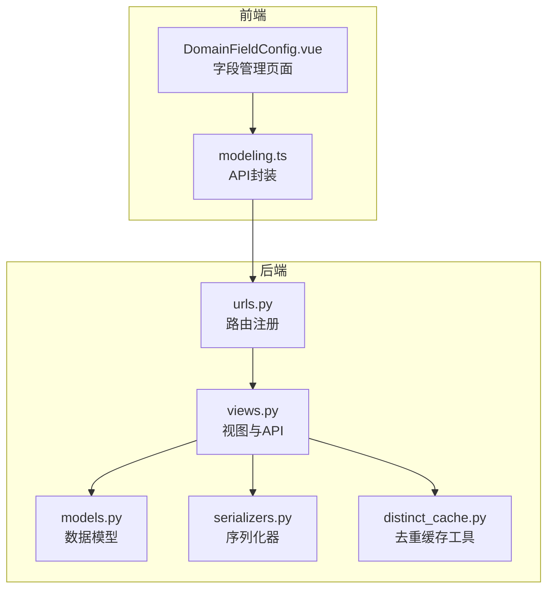
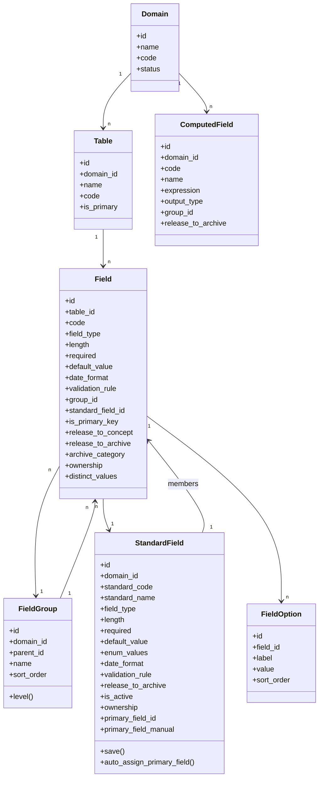
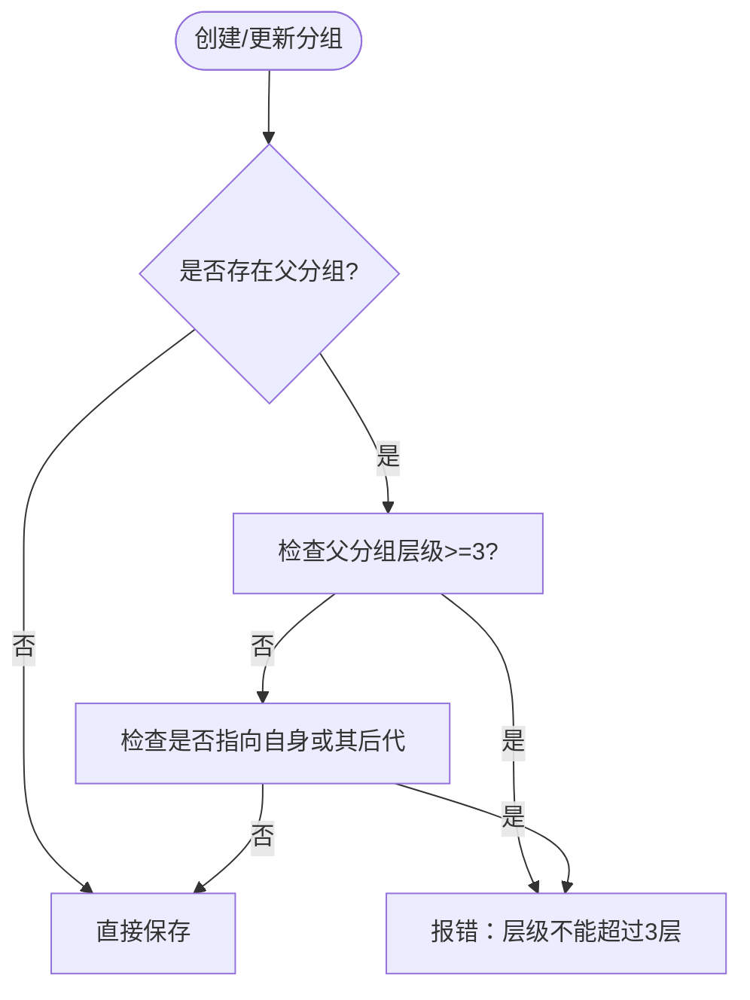
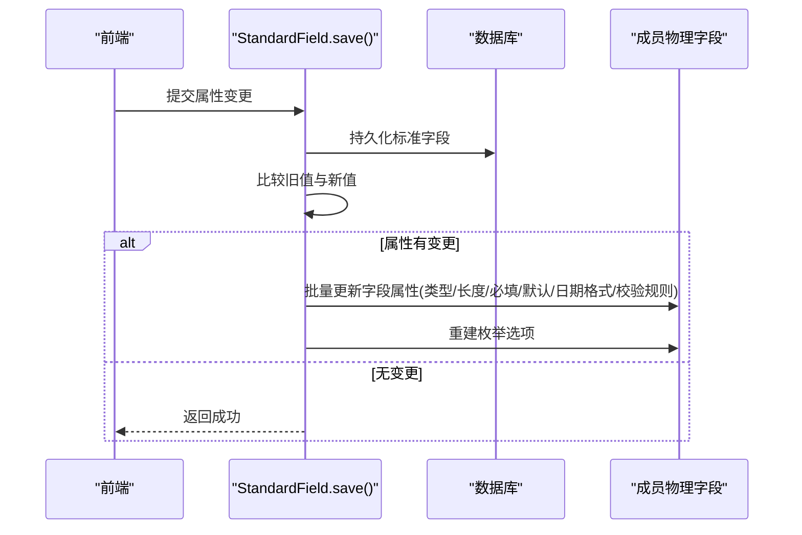
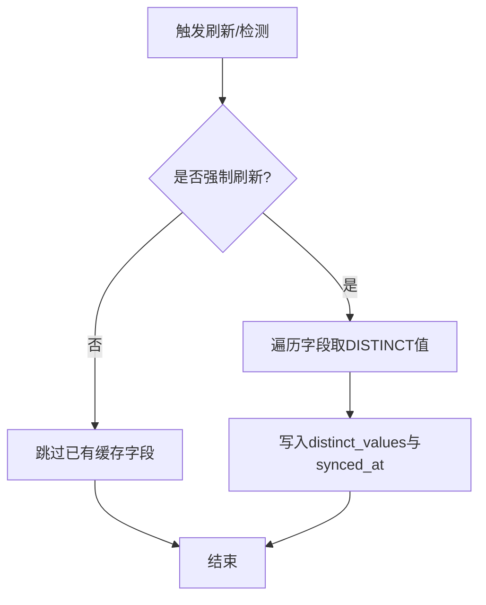
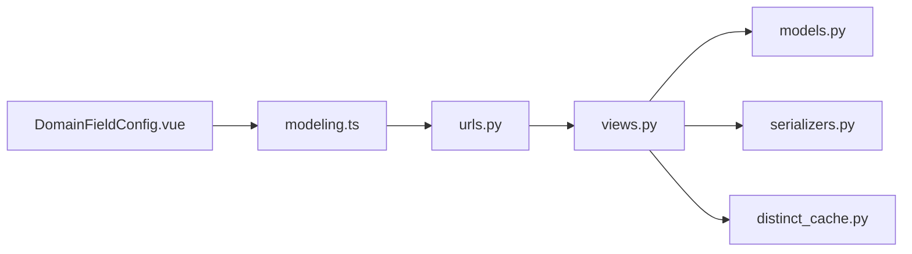

# 字段管理

<cite>
**本文引用的文件**   
- [models.py](file://backend/apps/modeling/models.py)
- [serializers.py](file://backend/apps/modeling/serializers.py)
- [views.py](file://backend/apps/modeling/views.py)
- [distinct_cache.py](file://backend/apps/modeling/distinct_cache.py)
- [urls.py](file://backend/apps/modeling/urls.py)
- [DomainFieldConfig.vue](file://frontend/src/views/modeling/DomainFieldConfig.vue)
- [modeling.ts](file://frontend/src/api/modeling.ts)
</cite>

## 目录
1. [简介](#简介)
2. [项目结构](#项目结构)
3. [核心组件](#核心组件)
4. [架构总览](#架构总览)
5. [详细组件分析](#详细组件分析)
6. [依赖关系分析](#依赖关系分析)
7. [性能考量](#性能考量)
8. [故障排查指南](#故障排查指南)
9. [结论](#结论)
10. [附录：API与前端配置说明](#附录api与前端配置说明)

## 简介
本文件面向 MetaData002 的“字段管理”能力，围绕物理字段（Field）的属性定义、分组机制、释放控制、主键与维护方设置、去重内容缓存、以及标准字段（StandardField）的归并与同步等主题进行系统化说明。文档同时覆盖后端模型、序列化器、视图接口与前端界面交互，帮助读者从概念到实现全面理解字段管理的完整闭环。

## 项目结构
字段管理涉及建模域下的表、字段、分组、标准字段、计算字段、枚举选项等实体，以及对应的 API 路由、序列化器与前端页面。关键文件如下：
- 后端模型与业务逻辑：models.py、views.py、serializers.py、distinct_cache.py、urls.py
- 前端页面与接口封装：DomainFieldConfig.vue、modeling.ts

图表来源 
- [urls.py:1-20](file://backend/apps/modeling/urls.py#L1-L20)
- [views.py:1-120](file://backend/apps/modeling/views.py#L1-L120)
- [models.py:125-160](file://backend/apps/modeling/models.py#L125-L160)
- [serializers.py:71-107](file://backend/apps/modeling/serializers.py#L71-L107)
- [distinct_cache.py:1-122](file://backend/apps/modeling/distinct_cache.py#L1-L122)
- [DomainFieldConfig.vue:1-120](file://frontend/src/views/modeling/DomainFieldConfig.vue#L1-L120)
- [modeling.ts:92-119](file://frontend/src/api/modeling.ts#L92-L119)

章节来源
- [urls.py:1-20](file://backend/apps/modeling/urls.py#L1-L20)
- [models.py:125-160](file://backend/apps/modeling/models.py#L125-L160)
- [serializers.py:71-107](file://backend/apps/modeling/serializers.py#L71-L107)
- [distinct_cache.py:1-122](file://backend/apps/modeling/distinct_cache.py#L1-L122)
- [DomainFieldConfig.vue:1-120](file://frontend/src/views/modeling/DomainFieldConfig.vue#L1-L120)
- [modeling.ts:92-119](file://frontend/src/api/modeling.ts#L92-L119)

## 核心组件
- 物理字段 Field：承载表级字段的元数据与属性，包括数据类型、长度、必填性、默认值、日期格式、校验规则、分组、是否主键、释放门控、维护方、去重缓存等。
- 标准字段 StandardField：概念层一等公民，跨表同义/同码字段归并后的统一载体，属性变更自动同步至成员物理字段。
- 字段分组 FieldGroup：支持多层嵌套（最多3层），用于组织与管理字段。
- 枚举选项 FieldOption：为枚举类型字段提供可选值列表。
- 计算字段 ComputedField：基于公式推导的虚拟字段，支持依赖解析与批量重算。
- 去重缓存 distinct_cache：按表/字段抽取取值样本，供标准字段匹配与人工识别。

章节来源
- [models.py:301-367](file://backend/apps/modeling/models.py#L301-L367)
- [models.py:162-300](file://backend/apps/modeling/models.py#L162-L300)
- [models.py:125-160](file://backend/apps/modeling/models.py#L125-L160)
- [models.py:369-385](file://backend/apps/modeling/models.py#L369-L385)
- [models.py:421-472](file://backend/apps/modeling/models.py#L421-L472)
- [distinct_cache.py:1-122](file://backend/apps/modeling/distinct_cache.py#L1-L122)

## 架构总览
字段管理采用“概念层（标准字段）+ 物理层（物理字段）”的双层设计。概念层负责统一语义与属性，物理层保留真实结构与样例数据；通过外键关联与保存钩子实现属性同步与一致性保障。

图表来源 
- [models.py:32-124](file://backend/apps/modeling/models.py#L32-L124)
- [models.py:125-160](file://backend/apps/modeling/models.py#L125-L160)
- [models.py:301-367](file://backend/apps/modeling/models.py#L301-L367)
- [models.py:162-300](file://backend/apps/modeling/models.py#L162-L300)
- [models.py:369-385](file://backend/apps/modeling/models.py#L369-L385)
- [models.py:421-472](file://backend/apps/modeling/models.py#L421-L472)

## 详细组件分析

### 物理字段（Field）属性定义
- 数据类型 field_type：字符串/数字/日期/布尔/枚举
- 长度 length：数值型或字符型长度限制
- 必填 required：布尔开关
- 默认值 default_value：文本默认值
- 日期格式 date_format：如 YYYY-MM-DD
- 校验规则 validation_rule：JSON 结构，包含模式与提示
- 分组 group：所属分组（可空）
- 标准字段 standard_field：归属的概念层标准字段（可空）
- 主键 is_primary_key：标记是否为表主键
- 释放门控 release_to_concept / release_to_archive：控制是否进入概念层与档案
- 档案分类 archive_category：基础/计算/未分配
- 维护方 ownership：源系统维护/档案维护
- 去重缓存 distinct_values / distinct_synced_at：取值样本与读取时间

章节来源
- [models.py:301-367](file://backend/apps/modeling/models.py#L301-L367)

### 字段分组（FieldGroup）与多层嵌套
- 支持 parent 自引用形成树形结构
- level 属性计算当前层级（1=顶层，最多3）
- get_descendants 递归获取后代节点
- 序列化器在创建/更新时校验层级不超过3层且不能指向自身或其子孙

图表来源 
- [models.py:125-160](file://backend/apps/modeling/models.py#L125-L160)
- [serializers.py:94-106](file://backend/apps/modeling/serializers.py#L94-L106)

章节来源
- [models.py:125-160](file://backend/apps/modeling/models.py#L125-L160)
- [serializers.py:94-106](file://backend/apps/modeling/serializers.py#L94-L106)

### 标准字段（StandardField）与属性同步
- 作为概念层一等公民，承载字段编码、名称、类型、长度、必填、默认值、枚举、日期格式、校验规则、释放与启用状态、维护方、主字段等
- save 钩子在属性变化时自动同步到所有成员物理字段（含枚举选项重建）
- auto_assign_primary_field 自动校准主字段（优先主表成员，无则置空并清除人工指定标记）

图表来源 
- [models.py:162-300](file://backend/apps/modeling/models.py#L162-L300)

章节来源
- [models.py:162-300](file://backend/apps/modeling/models.py#L162-L300)

### 字段的主键标识与维护方设置
- 主键标识：Field.is_primary_key 标记物理字段为主键；Table 支持 set_as_primary 切换主表，并自动调整组合字段的主字段归属
- 维护方：Field.ownership 与 StandardField.ownership 控制同步策略（源系统维护=档案只读覆盖；档案维护=档案可编辑保护）

章节来源
- [models.py:301-367](file://backend/apps/modeling/models.py#L301-L367)
- [models.py:110-123](file://backend/apps/modeling/models.py#L110-L123)

### 字段的释放控制机制（释放到概念层、释放到档案）
- 物理字段 release_to_concept：取消后不进入概念层，也不参与档案（常用于 ETL 审计列）
- 物理字段 release_to_archive：仅对未归并（solo）物理字段生效，取消后不释放到档案
- 标准字段 release_to_archive 与 is_active：停用或取消释放后，该标准字段不进入档案 schema 与记录

章节来源
- [models.py:301-367](file://backend/apps/modeling/models.py#L301-L367)
- [models.py:162-300](file://backend/apps/modeling/models.py#L162-L300)

### 字段去重内容缓存机制
- 目的：为 AI 去重检测、标准字段匹配与人工识别提供取值样本
- 实现：distinct_cache.fetch_distinct_values 按表/字段抽取 DISTINCT 值（上限 100），ensure_distinct_cache 批量填充缓存并记录时间
- 使用场景：detect_standards、members-distinct、refresh-distinct、load-sample-values

图表来源 
- [distinct_cache.py:27-122](file://backend/apps/modeling/distinct_cache.py#L27-L122)
- [views.py:1420-1441](file://backend/apps/modeling/views.py#L1420-L1441)

章节来源
- [distinct_cache.py:1-122](file://backend/apps/modeling/distinct_cache.py#L1-L122)
- [views.py:1420-1441](file://backend/apps/modeling/views.py#L1420-L1441)

### 前端配置界面与交互
- 字段分类 Tab：展示基础字段、组合字段、计算字段、未分配与废弃字段，支持搜索与拖拽
- 字段分组 Tab：树形分组（最多3层），支持AI分组、拖拽归类、批量移动
- 属性配置 Tab：统一编辑字段类型、长度、必填、默认值、维护方、去重内容预览等
- 组合字段抽屉：并排展示成员去重取值，支持设主字段与释放成员

章节来源
- [DomainFieldConfig.vue:1-800](file://frontend/src/views/modeling/DomainFieldConfig.vue#L1-L800)

## 依赖关系分析
- 路由注册：urls.py 将各 ViewSet 暴露为 RESTful 端点
- 视图依赖：views.py 调用 models.py 与 serializers.py，并使用 distinct_cache.py 工具
- 前端依赖：modeling.ts 封装 API 调用，DomainFieldConfig.vue 消费这些接口

图表来源 
- [urls.py:1-20](file://backend/apps/modeling/urls.py#L1-L20)
- [views.py:1-120](file://backend/apps/modeling/views.py#L1-L120)
- [models.py:1-120](file://backend/apps/modeling/models.py#L1-L120)
- [serializers.py:1-120](file://backend/apps/modeling/serializers.py#L1-L120)
- [distinct_cache.py:1-122](file://backend/apps/modeling/distinct_cache.py#L1-L122)
- [modeling.ts:1-120](file://frontend/src/api/modeling.ts#L1-L120)
- [DomainFieldConfig.vue:1-120](file://frontend/src/views/modeling/DomainFieldConfig.vue#L1-L120)

章节来源
- [urls.py:1-20](file://backend/apps/modeling/urls.py#L1-L20)
- [views.py:1-120](file://backend/apps/modeling/views.py#L1-L120)
- [modeling.ts:1-120](file://frontend/src/api/modeling.ts#L1-L120)

## 性能考量
- 去重缓存按需加载与批量刷新，避免频繁查询大表
- 外部数据源连接动态创建与及时释放，减少连接泄漏风险
- 批量更新属性与枚举选项，降低多次写库开销
- 前端分页全量拉取（page_size=100000）适用于管理页一次性加载，注意大数据集时的内存占用

[本节为通用指导，不直接分析具体文件]

## 故障排查指南
- 连接测试失败：检查数据源类型映射与驱动参数（Oracle service_name、SQL Server ODBC）
- 去重缓存为空：确认字段存在数据且表名/编码正确；必要时触发 refresh-distinct
- 主字段未设置：组合字段多成员时需人工指定或等待自动分配；主表变更后自动跟随（非人工指定）
- 分组层级错误：确保父分组层级小于3且不指向自身或其子孙

章节来源
- [views.py:74-146](file://backend/apps/modeling/views.py#L74-L146)
- [distinct_cache.py:27-122](file://backend/apps/modeling/distinct_cache.py#L27-L122)
- [models.py:162-300](file://backend/apps/modeling/models.py#L162-L300)
- [serializers.py:94-106](file://backend/apps/modeling/serializers.py#L94-L106)

## 结论
字段管理通过“概念层（标准字段）+ 物理层（物理字段）”的双层抽象，结合分组、释放门控、维护方与去重缓存等机制，实现了跨表字段归并、属性统一与档案发布的一致性保障。前端以分类、分组与属性配置三大Tab提供直观操作入口，配合AI辅助提升效率。整体架构清晰、扩展性强，适合复杂数据域的建模与治理。

[本节为总结性内容，不直接分析具体文件]

## 附录：API与前端配置说明

### 字段管理相关API（后端路由与功能）
- 字段列表与批量操作
  - GET /fields/：字段列表（支持分页与过滤）
  - POST /fields/batch/?table={id}：批量保存字段名称
  - PUT /fields/batch-attributes/：批量更新字段属性（含枚举选项）
  - PUT /fields/{id}/deprecate/：作废字段
- AI辅助
  - POST /fields/ai-auto-group/?domain={id}：域级AI自动分组
  - POST /fields/ai-semantic/?domain={id}：域级AI语义识别
  - POST /fields/detect-standards/?domain={id}：检测跨表冗余建议
  - POST /fields/apply-standards/?domain={id}：应用去重（创建/复用标准字段）
- 标准字段聚合与去重
  - GET /fields/standard-fields/?domain={id}：标准字段聚合视图（分组Tab专用）
  - POST /fields/refresh-distinct/?domain={id}：刷新域下active字段去重缓存
  - POST /fields/{id}/load-sample-values/：刷新单个字段去重值并返回样本
  - GET /fields/manual-candidates/?domain={id}：手动新增标准字段的候选字段
  - GET /fields/archive-preview/?domain={id}：只读预览最终释放到档案的字段
- 标准字段CRUD与成员管理
  - GET/POST/PUT/PATCH/DELETE /standard-fields/：标准字段列表与增删改查
  - POST /standard-fields/{id}/remove-member/：移除成员
  - POST /standard-fields/{id}/add-member/：添加成员
  - POST /standard-fields/{id}/set-primary-field/：设置主字段
  - GET /standard-fields/{id}/members-distinct/：成员去重取值
  - POST /standard-fields/{id}/rename/：组合字段改名（级联更新）
  - POST /standard-fields/rename-solo/：独立字段改名（级联更新）
- 字段分组与枚举
  - GET/POST/PATCH/DELETE /field-groups/：分组CRUD
  - POST /field-groups/reorder/：分组排序
  - GET/POST/DELETE /field-options/：枚举选项CRUD

章节来源
- [urls.py:1-20](file://backend/apps/modeling/urls.py#L1-L20)
- [views.py:1000-1799](file://backend/apps/modeling/views.py#L1000-L1799)
- [views.py:1800-2253](file://backend/apps/modeling/views.py#L1800-L2253)

### 前端配置界面说明
- 字段分类 Tab
  - 展示基础字段、组合字段、计算字段、未分配与废弃字段
  - 支持搜索、拖拽归类、刷新去重内容
- 字段分组 Tab
  - 树形分组（最多3层），支持AI分组、拖拽归类、批量移动
  - 显示分组计数与展开/收起
- 属性配置 Tab
  - 统一编辑字段类型、长度、必填、默认值、维护方、去重内容预览
  - 支持AI自动配置（语义识别）
- 组合字段抽屉
  - 并排展示成员去重取值，支持设主字段与释放成员

章节来源
- [DomainFieldConfig.vue:1-800](file://frontend/src/views/modeling/DomainFieldConfig.vue#L1-L800)
- [modeling.ts:92-119](file://frontend/src/api/modeling.ts#L92-L119)
- [modeling.ts:215-236](file://frontend/src/api/modeling.ts#L215-L236)
- [modeling.ts:447-455](file://frontend/src/api/modeling.ts#L447-L455)