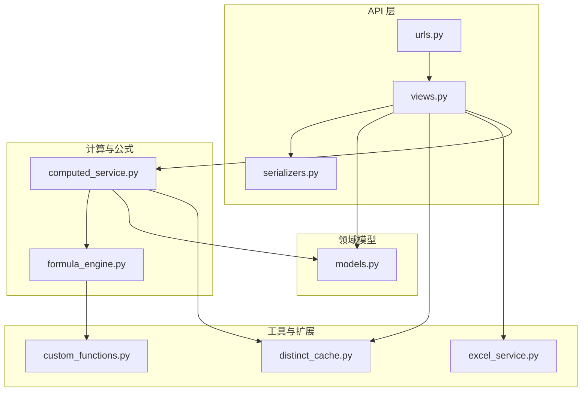
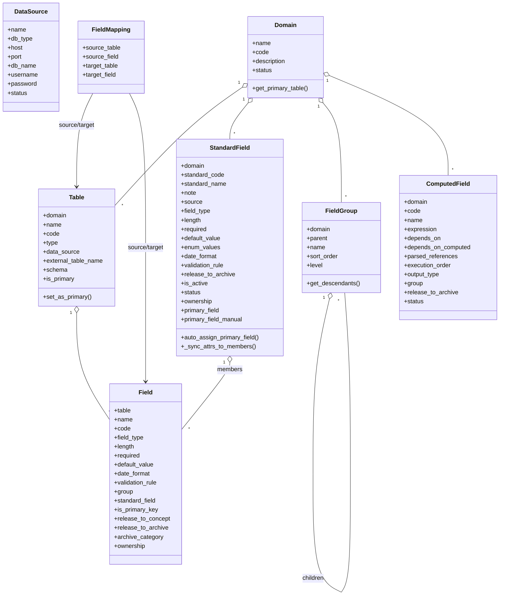
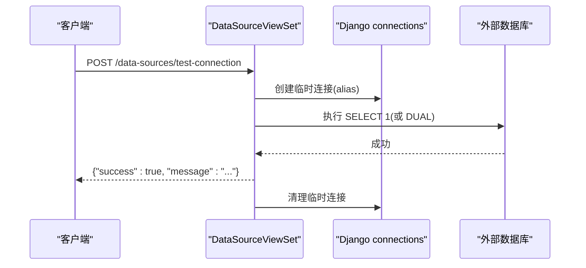
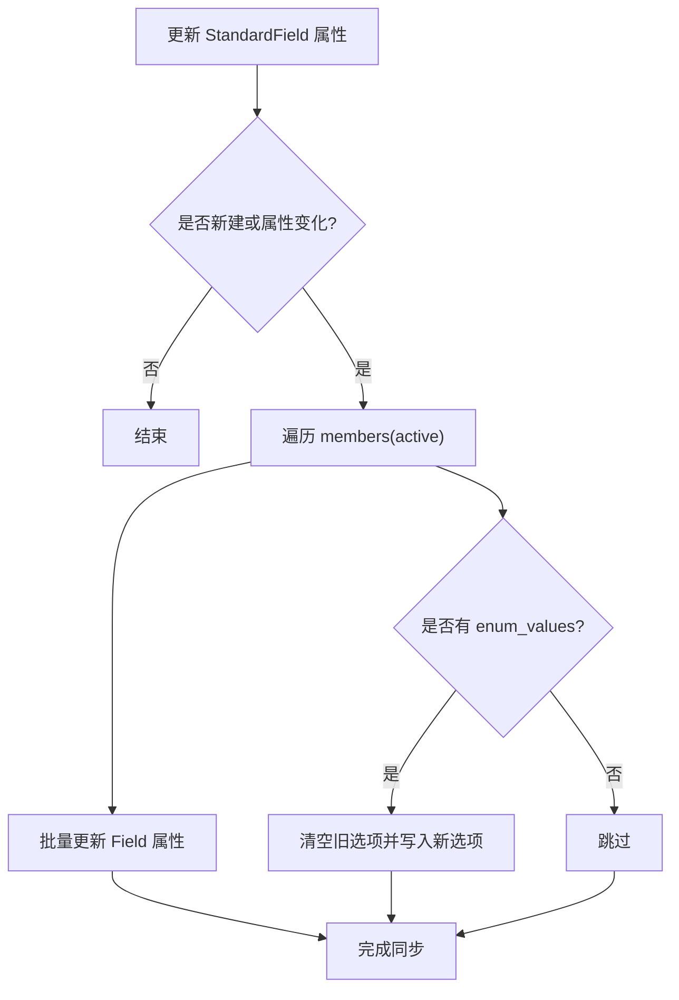
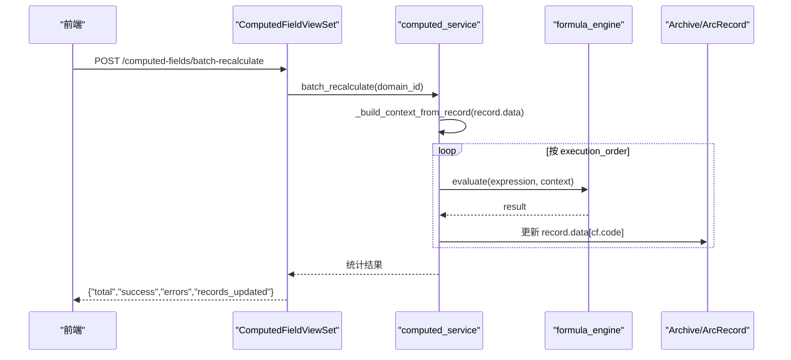
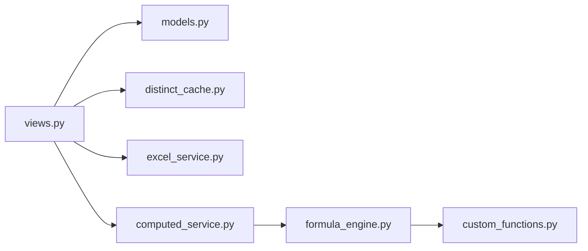

# 数据建模模块

<cite>
**本文引用的文件**   
- [models.py](file://backend/apps/modeling/models.py)
- [views.py](file://backend/apps/modeling/views.py)
- [serializers.py](file://backend/apps/modeling/serializers.py)
- [urls.py](file://backend/apps/modeling/urls.py)
- [formula_engine.py](file://backend/apps/modeling/formula_engine.py)
- [computed_service.py](file://backend/apps/modeling/computed_service.py)
- [distinct_cache.py](file://backend/apps/modeling/distinct_cache.py)
- [excel_service.py](file://backend/apps/modeling/excel_service.py)
- [custom_functions.py](file://backend/apps/modeling/custom_functions.py)
</cite>

## 目录
1. [简介](#简介)
2. [项目结构](#项目结构)
3. [核心组件](#核心组件)
4. [架构总览](#架构总览)
5. [详细组件分析](#详细组件分析)
6. [依赖关系分析](#依赖关系分析)
7. [性能考量](#性能考量)
8. [故障排查指南](#故障排查指南)
9. [结论](#结论)
10. [附录：API 接口与使用示例](#附录api-接口与使用示例)

## 简介
本模块为 MetaData002 的数据建模子系统，围绕“主数据域”进行概念建模与落地管理。核心概念包括：
- 域（Domain）：业务领域边界，聚合表、字段、标准字段与计算字段。
- 表（Table）：域下的实体表，支持本地表与外部数据源表两类。
- 字段（Field）：表的物理字段定义，承载类型、校验、分组、归档策略等属性。
- 标准字段（StandardField）：跨表去重后的概念层“一等公民”，统一属性配置并自动同步到成员物理字段。
- 字段分组（FieldGroup）：多层嵌套的层级组织（最多3层），用于分类与导航。
- 计算字段（ComputedField）：基于 Excel 风格公式从其他字段推导，支持 DAG 依赖解析与批量执行。

同时提供多数据源连接管理（PostgreSQL、MySQL、SQL Server、Oracle）、字段映射（表间关系）、Excel 导入建表、AI 辅助分组/语义识别/去重检测等功能。

## 项目结构
后端采用 Django + DRF 的分层设计：
- models.py：领域模型与数据库表映射
- views.py：REST API 控制器（含自定义 action）
- serializers.py：请求/响应序列化与校验
- urls.py：路由注册
- formula_engine.py：公式引擎（词法/语法/求值）
- computed_service.py：计算字段服务（DAG/重算/试算）
- distinct_cache.py：字段去重取值缓存工具
- excel_service.py：Excel 解析与本地建表
- custom_functions.py：技术函数插件扩展点

图表来源 
- [urls.py:1-20](file://backend/apps/modeling/urls.py#L1-L20)
- [views.py:1-120](file://backend/apps/modeling/views.py#L1-L120)
- [models.py:1-120](file://backend/apps/modeling/models.py#L1-L120)
- [formula_engine.py:1-120](file://backend/apps/modeling/formula_engine.py#L1-L120)
- [computed_service.py:1-120](file://backend/apps/modeling/computed_service.py#L1-L120)
- [distinct_cache.py:1-60](file://backend/apps/modeling/distinct_cache.py#L1-L60)
- [excel_service.py:1-60](file://backend/apps/modeling/excel_service.py#L1-L60)
- [custom_functions.py:1-40](file://backend/apps/modeling/custom_functions.py#L1-L40)

章节来源
- [urls.py:1-20](file://backend/apps/modeling/urls.py#L1-L20)
- [views.py:1-120](file://backend/apps/modeling/views.py#L1-L120)
- [models.py:1-120](file://backend/apps/modeling/models.py#L1-L120)

## 核心组件
- 数据源（DataSource）：动态连接多数据库类型，支持测试连接、列出 schema/表、预览数据。
- 域（Domain）：业务域，包含表集合、标准字段集合、计算字段集合；启用前做 P0/P1/P2 检查。
- 表（Table）：本地表或外部数据源表；支持主表标记、ER 图坐标持久化、状态切换保护。
- 字段（Field）：物理字段，支持类型、长度、必填、默认值、日期格式、校验规则、分组、归档策略、去重样本缓存。
- 标准字段（StandardField）：概念层统一属性，保存后自动同步至成员 Field；支持主字段自动分配与人工指定。
- 字段分组（FieldGroup）：树形分组，最多3层，支持排序与批量重排。
- 计算字段（ComputedField）：表达式依赖解析、DAG 拓扑排序、批量重算、枚举试算、依赖图可视化。
- 字段映射（FieldMapping）：表间字段映射关系，支撑多表关联与一致性检查。

章节来源
- [models.py:1-489](file://backend/apps/modeling/models.py#L1-L489)
- [views.py:327-503](file://backend/apps/modeling/views.py#L327-L503)
- [views.py:919-967](file://backend/apps/modeling/views.py#L919-L967)
- [views.py:1493-1778](file://backend/apps/modeling/views.py#L1493-L1778)
- [computed_service.py:1-210](file://backend/apps/modeling/computed_service.py#L1-L210)

## 架构总览
系统以 REST API 为核心入口，通过 ViewSet 暴露资源操作；模型层负责数据持久化；公式引擎与服务层实现计算字段的解析、求值与调度；工具层提供去重缓存、Excel 导入与插件扩展。

图表来源 
- [models.py:1-489](file://backend/apps/modeling/models.py#L1-L489)

章节来源
- [models.py:1-489](file://backend/apps/modeling/models.py#L1-L489)

## 详细组件分析

### 多数据源连接管理
- 动态连接：根据 DataSource.db_type 选择引擎，构造临时 alias 连接，支持 Oracle service_name 与 SQL Server ODBC 驱动参数。
- 能力：
  - 测试连接（已保存/未保存参数）
  - 列出 Schema（含可选表数量统计）
  - 列出外部表（按 schema 过滤，支持仅显示有数据的表）
  - 数据预览（本地/外部表，限制行数）
- 错误处理：捕获异常返回友好错误信息，清理临时连接。

图表来源 
- [views.py:74-147](file://backend/apps/modeling/views.py#L74-L147)
- [distinct_cache.py:7-13](file://backend/apps/modeling/distinct_cache.py#L7-L13)

章节来源
- [views.py:31-147](file://backend/apps/modeling/views.py#L31-L147)
- [distinct_cache.py:1-122](file://backend/apps/modeling/distinct_cache.py#L1-L122)

### 字段映射功能（物理字段到标准字段）
- 物理字段归属：Field.standard_field 指向 StandardField，表示跨表去重后的概念层归属。
- 标准字段属性同步：StandardField.save 时比较旧值与新值，将 field_type、length、required、default_value、date_format、validation_rule 等同步到所有成员 Field；enum_values 同步到 FieldOption。
- 主字段分配：auto_assign_primary_field 优先保留人工指定，否则回退到主表成员；主表变更时自动跟随。
- 字段映射关系：FieldMapping 记录源/目标表与字段，支撑多表关联与一致性检查。

图表来源 
- [models.py:230-300](file://backend/apps/modeling/models.py#L230-L300)

章节来源
- [models.py:162-300](file://backend/apps/modeling/models.py#L162-L300)
- [models.py:474-489](file://backend/apps/modeling/models.py#L474-L489)

### 字段分组（层级结构与组织方式）
- 层级约束：最多3层，父级 level 校验防止越界；禁止设为自身或其后代子分组。
- 查询模式：支持 tree=1 返回顶层分组，children 递归展开；支持同父级内批量重排序。
- 删除行为：子分组上浮到父级，直属字段变为未分组。

章节来源
- [models.py:125-160](file://backend/apps/modeling/models.py#L125-L160)
- [serializers.py:71-107](file://backend/apps/modeling/serializers.py#L71-L107)
- [views.py:919-967](file://backend/apps/modeling/views.py#L919-L967)

### 计算字段引擎（Excel 风格公式、DAG 依赖解析、批量计算）
- 公式引擎：
  - 词法分析 tokenize：支持数字、字符串、布尔、引用{表名.字段名}、函数调用、运算符。
  - 语法分析 Parser：递归下降，优先级明确（比较→加减拼接→乘除→一元→原子）。
  - 求值器 evaluate：AST 节点求值，内置逻辑/文本/数学/判空/日期函数，支持 IFERROR 惰性求值。
  - 函数注册：register_function 装饰器，支持自定义技术函数插件。
- 依赖解析与 DAG：
  - extract_references 提取引用，区分物理字段与计算字段依赖。
  - detect_cycle 检测环，_topological_sort 生成执行顺序，_update_execution_orders 批量更新 execution_order。
- 批量计算：
  - batch_recalculate 按拓扑序对域下档案记录逐条计算，结果写入 ArchiveRecord.data。
  - recalculate_affected 增量重算受影响的计算字段。
  - trial_calculate 枚举试算，支持自动构建参数空间与采样组合。
  - preview_expression 免实例预览，按去重值枚举组合输出。

图表来源 
- [computed_service.py:215-278](file://backend/apps/modeling/computed_service.py#L215-L278)
- [formula_engine.py:775-796](file://backend/apps/modeling/formula_engine.py#L775-L796)

章节来源
- [formula_engine.py:1-800](file://backend/apps/modeling/formula_engine.py#L1-L800)
- [computed_service.py:1-630](file://backend/apps/modeling/computed_service.py#L1-L630)
- [custom_functions.py:1-108](file://backend/apps/modeling/custom_functions.py#L1-L108)

### Excel 导入与本地建表
- 解析 Excel：读取首行作为列名，取前10行样本数据。
- 推断字段类型：优先 AI 推断，失败降级启发式。
- 本地建表：按字段类型映射生成 CREATE TABLE，创建 Table/Field 记录，包含审计字段。

章节来源
- [excel_service.py:1-156](file://backend/apps/modeling/excel_service.py#L1-L156)
- [views.py:807-884](file://backend/apps/modeling/views.py#L807-L884)

## 依赖关系分析
- 视图层依赖模型与工具：
  - DataSourceViewSet 依赖 distinct_cache.ENGINE_MAP 与 Django connections。
  - TableViewSet._sync_external_table_fields/_preview_external_data 复用动态连接模式。
  - FieldViewSet.ai_analyze/ai_auto_group/ai_semantic/detect_standards/apply_standards 依赖 ai_service 与 distinct_cache。
  - ComputedFieldViewSet 依赖 computed_service 与 formula_engine。
- 模型层内部关系：
  - StandardField 与 Field 一对多（members），属性同步与主字段分配在 save/auto_assign_primary_field 中实现。
  - ComputedField 通过 depends_on 与 depends_on_computed 维护物理与计算字段依赖。

图表来源 
- [views.py:1-120](file://backend/apps/modeling/views.py#L1-L120)
- [computed_service.py:1-120](file://backend/apps/modeling/computed_service.py#L1-L120)
- [formula_engine.py:1-120](file://backend/apps/modeling/formula_engine.py#L1-L120)

章节来源
- [views.py:1-200](file://backend/apps/modeling/views.py#L1-L200)
- [computed_service.py:1-210](file://backend/apps/modeling/computed_service.py#L1-L210)

## 性能考量
- 动态连接：每次操作创建临时 alias 连接，CONN_MAX_AGE=0，避免长连接占用；注意频繁连接开销。
- 去重缓存：Field.distinct_values 缓存减少重复查询，按需填充（ensure_distinct_cache），支持强制刷新。
- 批量更新：StandardField 属性同步使用 bulk update；FieldGroup 重排序使用 bulk_update。
- 计算字段：按 execution_order 顺序计算，避免重复计算；批量重算限制错误数量输出。
- 数据预览：限制行数（默认100，最大500），避免大表拖慢。

[本节为通用指导，不直接分析具体文件]

## 故障排查指南
- 数据源连接失败：
  - 检查 db_type 是否支持，确认 host/port/db_name/用户名密码正确。
  - Oracle 需设置 service_name；SQL Server 需安装 ODBC 驱动并配置 Encrypt=no。
  - 查看 test-connection 返回的错误消息。
- 外部表字段同步失败：
  - 确认 schema 与 external_table_name 正确；检查权限与网络连通性。
  - 查看日志警告（创建表后同步失败不影响表创建）。
- 计算字段循环依赖：
  - 使用 validate-formula 端点检测 cycle；修正表达式依赖关系。
- 去重缓存为空：
  - 调用 refresh-distinct 或 load-sample-values 刷新；检查数据源连接与权限。

章节来源
- [views.py:74-147](file://backend/apps/modeling/views.py#L74-L147)
- [views.py:536-660](file://backend/apps/modeling/views.py#L536-L660)
- [computed_service.py:110-162](file://backend/apps/modeling/computed_service.py#L110-L162)
- [distinct_cache.py:100-122](file://backend/apps/modeling/distinct_cache.py#L100-L122)

## 结论
本模块以“域”为中心，构建了从物理字段到概念标准字段的完整建模体系，并通过 Excel 风格公式与 DAG 依赖解析实现了强大的计算字段能力。多数据源支持与字段映射机制使跨库数据整合成为可能。结合 AI 辅助分组、语义识别与去重检测，显著降低建模成本，提升数据治理效率。

[本节为总结，不直接分析具体文件]

## 附录：API 接口与使用示例
- 数据源
  - POST /data-sources/test-connection（未保存参数测试）
  - GET /data-sources/{id}/test-connection（已有数据源测试）
  - GET /data-sources/{id}/schemas?include_counts=true
  - GET /data-sources/{id}/external-tables?schema=&has_data=true
  - GET /tables/{id}/preview-data?limit=100
- 域
  - GET /domains/{id}/check-config
  - PUT /domains/{id}（状态变更为 active 时触发 P0 检查）
- 表
  - POST /tables/import-excel（批量导入）
  - PUT /tables/{id}/toggle-status（停用前检查映射）
  - PUT /tables/{id}/set-primary
  - PUT /tables/{id}/save-er-position
- 字段
  - POST /fields/batch（批量保存名称）
  - PUT /fields/batch-attributes（批量更新属性与枚举）
  - POST /fields/ai-analyze?table=
  - POST /fields/ai-auto-group?domain=
  - POST /fields/ai-semantic?domain=
  - POST /fields/detect-standards?domain=
  - POST /fields/apply-standards?domain=
  - GET /fields/standard-fields?domain=
  - POST /fields/refresh-distinct?domain=
  - POST /fields/{id}/load-sample-values
- 标准字段
  - POST /standard-fields（手动新增）
  - DELETE /standard-fields/{id}（解散）
  - POST /standard-fields/{id}/remove-member
  - POST /standard-fields/{id}/add-member
  - POST /standard-fields/{id}/set-primary-field
  - GET /standard-fields/{id}/members-distinct
  - POST /standard-fields/{id}/rename
  - POST /standard-fields/rename-solo
- 计算字段
  - POST /computed-fields/validate-expression
  - POST /computed-fields/{id}/validate-formula
  - POST /computed-fields/preview-data
  - POST /computed-fields/generate-formula
  - POST /computed-fields/{id}/trial-calculate
  - GET /computed-fields/dependency-graph?domain=
  - POST /computed-fields/batch-recalculate
  - GET /computed-fields/available-functions
  - 插件管理：upload/unload/reload/list/template
  - GET /computed-fields/available-references?domain=

章节来源
- [urls.py:1-20](file://backend/apps/modeling/urls.py#L1-L20)
- [views.py:31-2253](file://backend/apps/modeling/views.py#L31-L2253)
- [serializers.py:1-310](file://backend/apps/modeling/serializers.py#L1-L310)