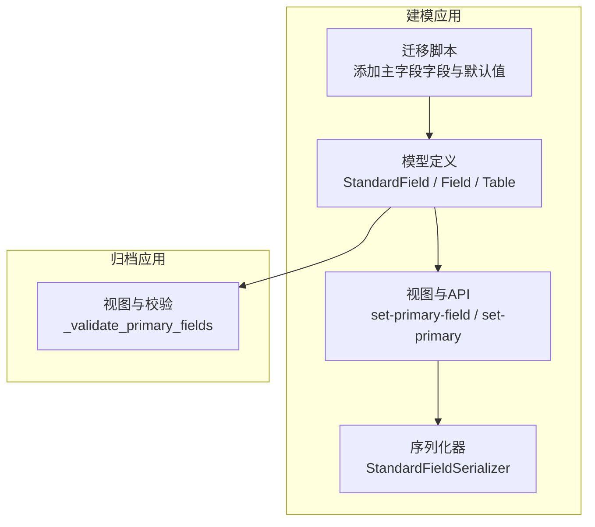
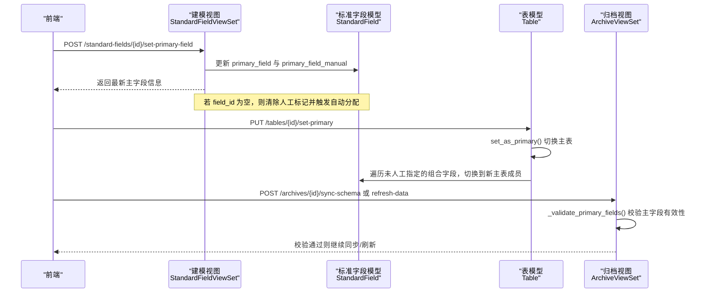
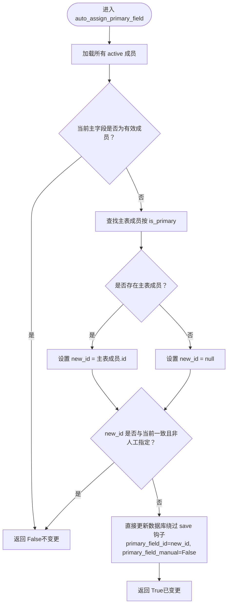
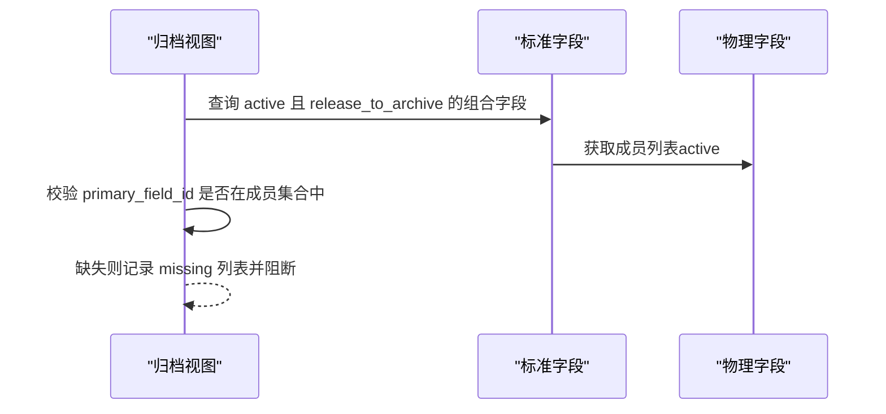
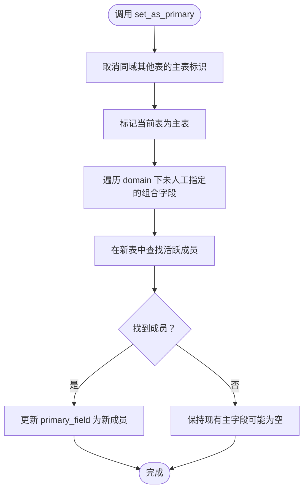
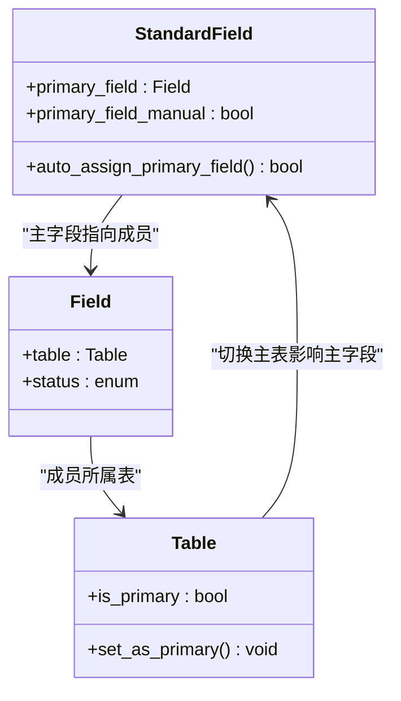

# 主字段管理

<cite>
**本文引用的文件**   
- [models.py](file://backend/apps/modeling/models.py)
- [views.py](file://backend/apps/modeling/views.py)
- [serializers.py](file://backend/apps/modeling/serializers.py)
- [0026_standardfield_primary_field_and_more.py](file://backend/apps/modeling/migrations/0026_standardfield_primary_field_and_more.py)
- [views.py](file://backend/apps/archive/views.py)
</cite>

## 目录
1. [引言](#引言)
2. [项目结构](#项目结构)
3. [核心组件](#核心组件)
4. [架构总览](#架构总览)
5. [详细组件分析](#详细组件分析)
6. [依赖关系分析](#依赖关系分析)
7. [性能考量](#性能考量)
8. [故障排查指南](#故障排查指南)
9. [结论](#结论)
10. [附录](#附录)

## 引言
本文件围绕 MetaData002 的“主字段管理”功能进行系统化说明，重点解释：
- 什么是主字段及其在档案更新中的关键作用（作为数据源头）；
- 自动分配逻辑与人工指定标记的设计目的和运行机制；
- 主字段变更时的一致性检查与其他成员字段的处理策略；
- 完整的业务流程与技术实现细节，尤其是 auto_assign_primary_field 方法。

## 项目结构
与主字段管理相关的代码主要分布在建模应用与归档应用中：
- 建模应用负责标准字段、物理字段、表与域等模型定义，以及主字段设置与自动分配的 API；
- 归档应用在刷新与一致性检查中校验主字段的有效性，确保档案拉取口径明确。

**图表来源** 
- [models.py:162-275](file://backend/apps/modeling/models.py#L162-L275)
- [views.py:1566-1586](file://backend/apps/modeling/views.py#L1566-L1586)
- [serializers.py:130-164](file://backend/apps/modeling/serializers.py#L130-L164)
- [0026_standardfield_primary_field_and_more.py:7-39](file://backend/apps/modeling/migrations/0026_standardfield_primary_field_and_more.py#L7-L39)
- [views.py:225-243](file://backend/apps/archive/views.py#L225-L243)

**章节来源**
- [models.py:162-275](file://backend/apps/modeling/models.py#L162-L275)
- [views.py:1566-1586](file://backend/apps/modeling/views.py#L1566-L1586)
- [serializers.py:130-164](file://backend/apps/modeling/serializers.py#L130-L164)
- [0026_standardfield_primary_field_and_more.py:7-39](file://backend/apps/modeling/migrations/0026_standardfield_primary_field_and_more.py#L7-L39)
- [views.py:225-243](file://backend/apps/archive/views.py#L225-L243)

## 核心组件
- StandardField（标准字段）
  - primary_field：指向某个成员物理字段，作为档案更新的“数据源头”；
  - primary_field_manual：标记是否人工指定，用于控制主表变更时的自动跟随行为。
- Field（物理字段）
  - 作为 StandardField 的成员，参与一致性检查；
  - 通过 table 关联到表，表可标记为主表（is_primary）。
- Table（实体表）
  - is_primary：标识该表为域的主表；
  - set_as_primary：切换主表后，自动将未人工指定的组合字段主字段切换到新主表的活跃成员。

**章节来源**
- [models.py:211-216](file://backend/apps/modeling/models.py#L211-L216)
- [models.py:301-366](file://backend/apps/modeling/models.py#L301-L366)
- [models.py:110-123](file://backend/apps/modeling/models.py#L110-L123)

## 架构总览
主字段管理的整体流程由“建模层”提供能力，“归档层”消费并校验：
- 建模层暴露 set-primary-field 接口，支持人工指定或清除人工标记；
- 当主表变更时，Table.set_as_primary 会触发自动跟随（仅对非人工指定生效）；
- 归档层在同步/刷新前校验组合字段是否具备有效主字段，否则阻断操作。

**图表来源** 
- [views.py:1566-1586](file://backend/apps/modeling/views.py#L1566-L1586)
- [models.py:110-123](file://backend/apps/modeling/models.py#L110-L123)
- [views.py:225-243](file://backend/apps/archive/views.py#L225-L243)

## 详细组件分析

### 主字段概念与作用
- 主字段是 StandardField 的一个成员物理字段，作为档案更新的数据源头；
- 其他成员字段不参与更新，仅用于一致性检查；
- 当组合字段存在多个成员时，必须明确一个主字段，以决定拉取口径。

**章节来源**
- [models.py:211-216](file://backend/apps/modeling/models.py#L211-L216)
- [serializers.py:130-164](file://backend/apps/modeling/serializers.py#L130-L164)

### 自动分配逻辑（auto_assign_primary_field）
- 输入：调用时机为成员变更后（如新增/停用成员、主表切换）；
- 规则：
  - 若当前主字段仍为 active 成员，则保持不变（人工指定天然保留）；
  - 若当前主字段为空或已失效，优先选择主表成员；若无主表成员则置空（留待人工设置），并清除人工指定标记；
- 输出：是否发生变更（布尔）。

**图表来源** 
- [models.py:255-274](file://backend/apps/modeling/models.py#L255-L274)

**章节来源**
- [models.py:255-274](file://backend/apps/modeling/models.py#L255-L274)

### 人工指定标记（primary_field_manual）的作用机制
- 设计目的：允许用户锁定某成员为主字段，避免主表变更导致自动跟随；
- 行为：
  - 人工指定后，即使主表切换，也不会覆盖该标记；
  - 清除人工标记（field_id=null）后，系统会重新执行自动分配；
- 使用场景：当业务需要固定数据源口径，不受主表结构调整影响。

**章节来源**
- [models.py:214-216](file://backend/apps/modeling/models.py#L214-L216)
- [views.py:1566-1586](file://backend/apps/modeling/views.py#L1566-L1586)

### 主字段变更时的处理逻辑
- 一致性检查：
  - 归档层在同步/刷新前校验组合字段是否具备有效主字段；
  - 若缺失或无效，返回缺失列表，阻止后续操作；
- 其他成员字段：
  - 不参与更新，仅用于一致性比对；
  - 可通过 members-distinct 接口查看各成员去重取值，辅助人工核对。

**图表来源** 
- [views.py:225-243](file://backend/apps/archive/views.py#L225-L243)

**章节来源**
- [views.py:225-243](file://backend/apps/archive/views.py#L225-L243)

### 主表切换与自动跟随
- 当 Table.set_as_primary 被调用：
  - 先取消同域其他表的主表标识；
  - 对每个未人工指定的组合字段，尝试切换到新主表的活跃成员；
  - 若无新主表成员，保持现状（不强制清空）。

**图表来源** 
- [models.py:110-123](file://backend/apps/modeling/models.py#L110-L123)

**章节来源**
- [models.py:110-123](file://backend/apps/modeling/models.py#L110-L123)

### API 与序列化
- set-primary-field 接口：
  - 请求体包含 field_id（可为 null）；
  - 若 field_id 为空，清除人工标记并触发自动分配；
  - 若 field_id 有效，设置为人工指定主字段；
- StandardFieldSerializer：
  - 暴露 primary_field 与 primary_field_manual；
  - read_only 限制防止直接修改，需通过专用接口。

**章节来源**
- [views.py:1566-1586](file://backend/apps/modeling/views.py#L1566-L1586)
- [serializers.py:130-164](file://backend/apps/modeling/serializers.py#L130-L164)

### 迁移与默认值
- 迁移脚本 0026：
  - 添加 primary_field 与 primary_field_manual 字段；
  - 存量数据默认主字段：优先主表成员，无主表成员则留空（强制人工设置）。

**章节来源**
- [0026_standardfield_primary_field_and_more.py:7-39](file://backend/apps/modeling/migrations/0026_standardfield_primary_field_and_more.py#L7-L39)

## 依赖关系分析
- StandardField 依赖 Field（成员）、Table（通过成员间接依赖）；
- Table 的 set_as_primary 会影响 StandardField 的主字段分配；
- Archive 视图依赖 StandardField 的主字段配置进行一致性校验。

**图表来源** 
- [models.py:162-275](file://backend/apps/modeling/models.py#L162-L275)
- [models.py:110-123](file://backend/apps/modeling/models.py#L110-L123)

**章节来源**
- [models.py:162-275](file://backend/apps/modeling/models.py#L162-L275)
- [models.py:110-123](file://backend/apps/modeling/models.py#L110-L123)

## 性能考量
- auto_assign_primary_field 使用 select_related('table') 减少 N+1 查询；
- 直接通过 QuerySet.update 绕过 save 钩子，避免属性同步开销；
- 归档校验使用 prefetch_related 批量加载成员，降低重复查询。

[本节为通用指导，无需特定文件引用]

## 故障排查指南
- 问题：组合字段缺少主字段导致同步失败
  - 现象：归档同步/刷新时报错，提示缺失主字段；
  - 排查：调用 _validate_primary_fields 获取缺失列表；
  - 解决：通过 set-primary-field 指定主字段，或清除人工标记后自动分配。
- 问题：主表切换后主字段未按预期跟随
  - 现象：主表切换后，某些组合字段主字段未变化；
  - 排查：确认 primary_field_manual 是否为 True；
  - 解决：若需跟随，清除人工标记并调用 auto_assign_primary_field。

**章节来源**
- [views.py:225-243](file://backend/apps/archive/views.py#L225-L243)
- [views.py:1566-1586](file://backend/apps/modeling/views.py#L1566-L1586)
- [models.py:255-274](file://backend/apps/modeling/models.py#L255-L274)

## 结论
主字段管理是 MetaData002 档案更新的核心机制之一，通过“自动分配 + 人工指定”的双轨设计，既保证了数据源头的稳定性，又提供了灵活的干预能力。结合主表切换的自动跟随与归档层的一致性校验，系统在复杂多表场景中仍能确保数据拉取的准确性与可控性。

[本节为总结，无需特定文件引用]

## 附录
- 相关 API 路径参考：
  - 设置主字段：POST /standard-fields/{id}/set-primary-field
  - 设置主表：PUT /tables/{id}/set-primary
  - 成员去重取值：GET /standard-fields/{id}/members-distinct
- 关键模型字段：
  - StandardField.primary_field、StandardField.primary_field_manual
  - Table.is_primary、Table.set_as_primary

[本节为补充信息，无需特定文件引用]