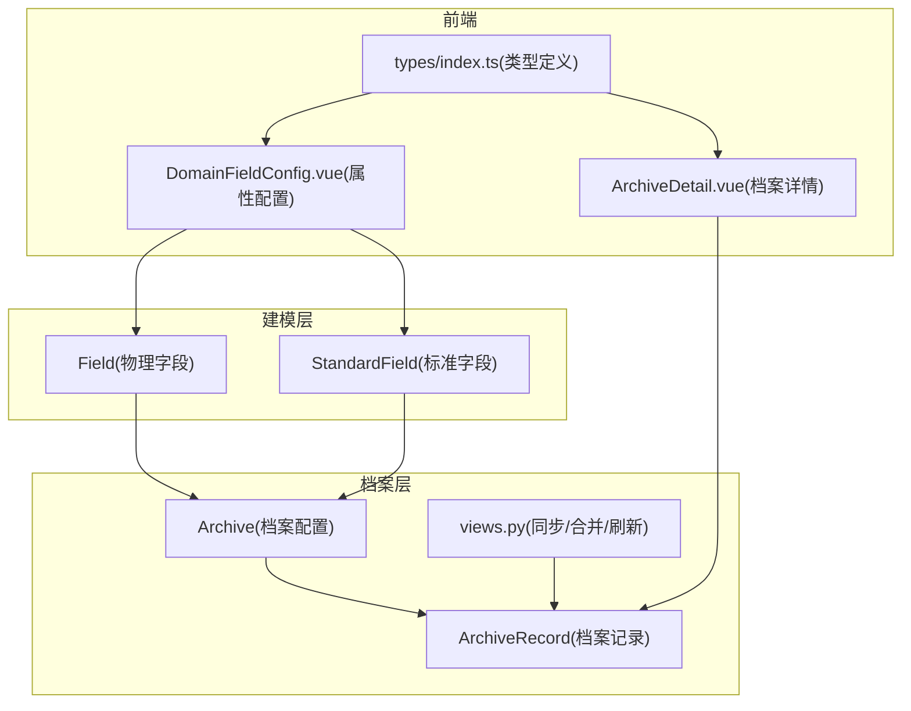
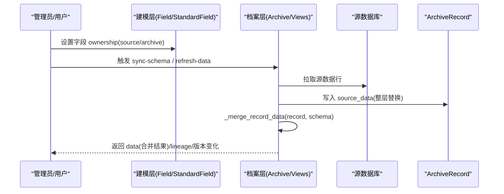
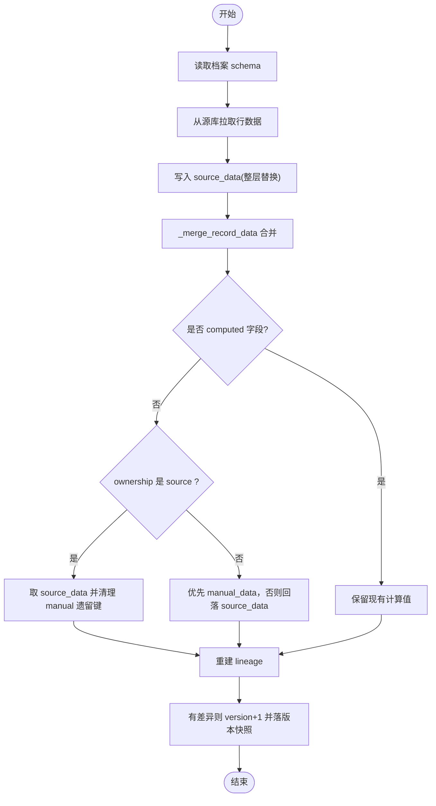
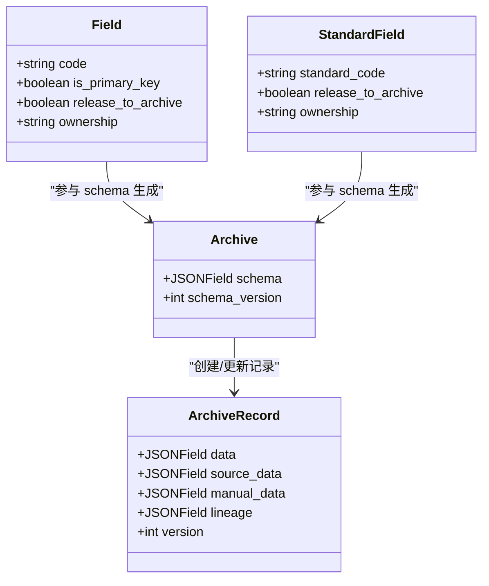

# 字段维护方管理

<cite>
**本文引用的文件**   
- [backend/apps/modeling/models.py](file://backend/apps/modeling/models.py)
- [backend/apps/archive/models.py](file://backend/apps/archive/models.py)
- [backend/apps/archive/views.py](file://backend/apps/archive/views.py)
- [backend/apps/modeling/migrations/0025_alter_field_ownership_alter_standardfield_ownership.py](file://backend/apps/modeling/migrations/0025_alter_field_ownership_alter_standardfield_ownership.py)
- [frontend/src/types/index.ts](file://frontend/src/types/index.ts)
- [frontend/src/views/modeling/domain-field-config.vue](file://frontend/src/views/modeling/DomainFieldConfig.vue)
- [frontend/src/views/archive/archive-detail.vue](file://frontend/src/views/archive/ArchiveDetail.vue)
</cite>

## 目录
1. [引言](#引言)
2. [项目结构](#项目结构)
3. [核心组件](#核心组件)
4. [架构总览](#架构总览)
5. [详细组件分析](#详细组件分析)
6. [依赖关系分析](#依赖关系分析)
7. [性能考量](#性能考量)
8. [故障排查指南](#故障排查指南)
9. [结论](#结论)
10. [附录](#附录)

## 引言
本文件围绕 MetaData002 的“字段维护方管理”能力进行系统化说明，重点解释 ownership 字段的设计与业务含义，阐述“源系统维护”和“档案维护”两种模式的区别与应用场景；并详细说明不同维护方模式下的数据同步策略、对档案 Schema 和数据记录的影响，以及与 release_to_archive 属性的协同工作机制。最后给出维护方选择的决策指南与最佳实践，包括典型业务场景的配置示例。

## 项目结构
- 建模层（modeling）：定义域、表、字段、标准字段等概念模型，其中 Field 与 StandardField 均包含 ownership 字段，用于表达“字段维护方”。
- 档案层（archive）：实现档案配置、记录、变更日志、一致性检查等，提供 schema 生成、数据拉取、合并物化、刷新预检等关键逻辑。
- 前端（frontend）：在属性配置页暴露 ownership 开关，并在档案详情中按 ownership 控制编辑态与展示标签。

图表来源
- [backend/apps/modeling/models.py:162-298](file://backend/apps/modeling/models.py#L162-L298)
- [backend/apps/modeling/models.py:301-366](file://backend/apps/modeling/models.py#L301-L366)
- [backend/apps/archive/models.py:5-73](file://backend/apps/archive/models.py#L5-L73)
- [backend/apps/archive/views.py:160-222](file://backend/apps/archive/views.py#L160-L222)
- [frontend/src/types/index.ts:174-185](file://frontend/src/types/index.ts#L174-L185)

章节来源
- [backend/apps/modeling/models.py:162-298](file://backend/apps/modeling/models.py#L162-L298)
- [backend/apps/modeling/models.py:301-366](file://backend/apps/modeling/models.py#L301-L366)
- [backend/apps/archive/models.py:5-73](file://backend/apps/archive/models.py#L5-L73)
- [backend/apps/archive/views.py:160-222](file://backend/apps/archive/views.py#L160-L222)
- [frontend/src/types/index.ts:174-185](file://frontend/src/types/index.ts#L174-L185)

## 核心组件
- Field 与 StandardField 的 ownership 字段
  - 取值：source（源系统维护）、archive（档案维护）。默认值 source。
  - 语义：决定档案侧该字段的编辑权限与拉取覆盖策略。
- ArchiveRecord 双层存储
  - source_data：源同步底层，每次刷新整层替换（零比对）。
  - manual_data：人工覆盖层，仅允许 ownership=archive 的字段写入键。
  - data：写时合并物化结果，供列表查询、搜索、排序与 API 消费。
- 合并函数 _merge_record_data
  - 规则：computed 保留现值；source 维护字段取 source_data 并清理 manual 遗留键；archive 维护字段优先 manual_data，否则回落 source_data。
  - lineage：重建血缘（manual/sync），便于溯源。

章节来源
- [backend/apps/modeling/models.py:207-210](file://backend/apps/modeling/models.py#L207-L210)
- [backend/apps/modeling/models.py:352-355](file://backend/apps/modeling/models.py#L352-L355)
- [backend/apps/archive/models.py:40-57](file://backend/apps/archive/models.py#L40-L57)
- [backend/apps/archive/views.py:160-222](file://backend/apps/archive/views.py#L160-L222)

## 架构总览
下图展示了“字段维护方”在建模层到档案层的流转路径，以及数据拉取与合并的关键节点。

图表来源
- [backend/apps/modeling/models.py:207-210](file://backend/apps/modeling/models.py#L207-L210)
- [backend/apps/modeling/models.py:352-355](file://backend/apps/modeling/models.py#L352-L355)
- [backend/apps/archive/views.py:160-222](file://backend/apps/archive/views.py#L160-L222)
- [backend/apps/archive/views.py:1332-1500](file://backend/apps/archive/views.py#L1332-L1500)

## 详细组件分析

### 1) ownership 字段设计与业务含义
- 设计目标
  - 通过字段级维护方声明，统一管控“谁有权维护该字段值”，从而在 Hub 式单向数据流（源→档案→API）下避免双向同步冲突。
- 业务含义
  - source（源系统维护）：档案侧只读，拉取直接覆盖；禁止档案侧编辑。
  - archive（档案维护）：档案侧可编辑；拉取时保护不覆盖（首次拉空值除外）。
- 默认值与迁移
  - 默认值为 source；存量 Field/StandardField 全刷为 source，确保向后兼容且默认以源为准。

章节来源
- [backend/apps/modeling/models.py:207-210](file://backend/apps/modeling/models.py#L207-L210)
- [backend/apps/modeling/models.py:352-355](file://backend/apps/modeling/models.py#L352-L355)
- [backend/apps/modeling/migrations/0025_alter_field_ownership_alter_standardfield_ownership.py:6-11](file://backend/apps/modeling/migrations/0025_alter_field_ownership_alter_standardfield_ownership.py#L6-L11)

### 2) “源系统维护”与“档案维护”模式对比
- 源系统维护（source）
  - 编辑权限：档案侧禁用编辑（前端 disabled）。
  - 拉取策略：直接覆盖 source_data，合并后 data 取自 source_data，清理 manual 遗留键。
  - 适用场景：主数据由上游系统唯一维护，档案仅做只读消费。
- 档案维护（archive）
  - 编辑权限：档案侧可编辑，写入 manual_data。
  - 拉取策略：不覆盖已有人工值；若无人工值则回落 source_data。
  - 适用场景：需要结合业务上下文补充或修正某些字段，但其他字段仍由源系统维护。

章节来源
- [frontend/src/views/archive/archive-detail.vue:182-198](file://frontend/src/views/archive/ArchiveDetail.vue#L182-L198)
- [backend/apps/archive/views.py:160-222](file://backend/apps/archive/views.py#L160-L222)

### 3) 数据同步策略与合并机制
- 双层存储
  - source_data：每次刷新整层替换，零比对，保证“源侧最新”。
  - manual_data：仅允许 ownership=archive 的字段存在键，体现“人工覆盖”。
- 合并规则（_merge_record_data）
  - computed：保留现有计算值。
  - source：取 source_data，清理 manual 遗留键。
  - archive：优先 manual_data，否则回落到 source_data。
  - lineage：重建血缘（manual/sync），便于审计与回溯。
- 刷新流程
  - sync-schema：更新 schema 快照并拉取数据。
  - refresh-data：仅刷新 source_data + 重算计算字段，不改变 schema_version。
  - refresh-preview：dry-run 预览差异，含 archive_owned_impact 告警（提醒档案维护字段可能被波及）。

图表来源
- [backend/apps/archive/views.py:160-222](file://backend/apps/archive/views.py#L160-L222)
- [backend/apps/archive/views.py:1332-1500](file://backend/apps/archive/views.py#L1332-L1500)

章节来源
- [backend/apps/archive/views.py:160-222](file://backend/apps/archive/views.py#L160-L222)
- [backend/apps/archive/views.py:1332-1500](file://backend/apps/archive/views.py#L1332-L1500)

### 4) 对档案 Schema 与数据记录的影响
- Schema 生成
  - 基于域内所有物理字段生成，应用 release_to_archive 门控；StandardField 信息优先；每个字段携带 ownership 与 group_path。
- 数据记录
  - ArchiveRecord.data 为合并物化结果；source_data/manual_data 分层存储；lineage 标注来源；version 随差异递增。
- 与 release_to_archive 的协同
  - 只有 release_to_archive=True 的字段才会进入档案 schema 与记录；ownership 仅在已进入档案的字段上生效。

章节来源
- [backend/apps/archive/views.py:25-58](file://backend/apps/archive/views.py#L25-L58)
- [backend/apps/archive/views.py:118-129](file://backend/apps/archive/views.py#L118-L129)
- [backend/apps/modeling/models.py:199-202](file://backend/apps/modeling/models.py#L199-L202)
- [backend/apps/modeling/models.py:342-343](file://backend/apps/modeling/models.py#L342-L343)

### 5) 前端交互与类型定义
- 属性配置页
  - 提供 ownership 开关（source/archive），对计算字段固定显示“档案维护”。
- 档案详情页
  - 对 ownership=source 的字段禁用编辑；对 archive 字段显示“档案维护”标签与血缘标签。
- 类型定义
  - ArchiveSchemaItem.ownership 支持 source/archive；Lineage.source 支持 manual/sync/resolve。

章节来源
- [frontend/src/views/modeling/DomainFieldConfig.vue:375-388](file://frontend/src/views/modeling/DomainFieldConfig.vue#L375-L388)
- [frontend/src/views/archive/ArchiveDetail.vue:182-198](file://frontend/src/views/archive/ArchiveDetail.vue#L182-L198)
- [frontend/src/types/index.ts:174-185](file://frontend/src/types/index.ts#L174-L185)
- [frontend/src/types/index.ts:211-215](file://frontend/src/types/index.ts#L211-L215)

## 依赖关系分析
- modeling → archive
  - 建模层 Field/StandardField 的 ownership 驱动档案层 schema 生成与合并策略。
- archive → 源库
  - 通过 views.py 中的拉数逻辑连接各类型数据库，拉取源数据至 source_data。
- 前端 → 后端
  - 属性配置页修改 ownership；档案详情页根据 ownership 控制编辑态与展示。

图表来源
- [backend/apps/modeling/models.py:301-366](file://backend/apps/modeling/models.py#L301-L366)
- [backend/apps/modeling/models.py:162-298](file://backend/apps/modeling/models.py#L162-L298)
- [backend/apps/archive/models.py:5-73](file://backend/apps/archive/models.py#L5-L73)

章节来源
- [backend/apps/modeling/models.py:301-366](file://backend/apps/modeling/models.py#L301-L366)
- [backend/apps/modeling/models.py:162-298](file://backend/apps/modeling/models.py#L162-L298)
- [backend/apps/archive/models.py:5-73](file://backend/apps/archive/models.py#L5-L73)

## 性能考量
- 双层存储优势
  - source_data 整层替换零比对，减少合并开销；data 为物化结果，提升查询/搜索/排序性能。
- 合并与版本
  - 仅当合并结果与旧 data 有差异才 bump version，降低不必要的版本膨胀。
- 刷新预检
  - refresh-preview 提供 dry-run 统计与样本，避免无谓刷新带来的性能损耗。

[本节为通用指导，无需特定文件引用]

## 故障排查指南
- 常见现象
  - 档案侧无法编辑某字段：检查该字段 ownership 是否为 source。
  - 刷新后档案值被覆盖：确认该字段 ownership 是否为 source；archive 维护字段应保留人工值。
  - 刷新预检提示“档案维护字段被波及”：表示该字段当前无人工覆盖值，将回落 source_data。
- 定位方法
  - 查看 lineage 字段来源（manual/sync）判断数据来源。
  - 检查 ArchiveRecord 的 source_data/manual_data 内容，确认合并结果是否符合预期。
  - 使用 refresh-preview 查看 would_update/would_deactivate 与 changes_sample。

章节来源
- [backend/apps/archive/views.py:160-222](file://backend/apps/archive/views.py#L160-L222)
- [backend/apps/archive/views.py:344-359](file://backend/apps/archive/views.py#L344-L359)

## 结论
ownership 字段是 MetaData002 字段维护方管理的核心，通过“源系统维护”和“档案维护”两种模式，实现了 Hub 式单向数据流下的字段级读写权限与同步策略控制。配合双层存储与写时合并，系统在保障源数据权威性的同时，允许档案侧对部分字段进行受保护的编辑与修正。正确配置 ownership 并与 release_to_archive 协同，是实现稳定、可控、可追溯的数据服务的关键。

[本节为总结性内容，无需特定文件引用]

## 附录

### A. 维护方选择决策指南
- 选择“源系统维护（source）”的场景
  - 字段由上游系统唯一维护，档案仅需只读消费（如客户编码、供应商编号）。
  - 不希望档案侧人工修改影响下游数据服务输出。
- 选择“档案维护（archive）”的场景
  - 需要在档案侧补充业务上下文或修正局部字段（如备注、扩展属性）。
  - 希望保留人工修正痕迹，同时不影响其他由源系统维护的字段。
- 组合字段注意事项
  - 组合字段需设置主字段作为档案更新的数据源头；未设置主字段时刷新将被拦截并告警。

章节来源
- [backend/apps/modeling/models.py:211-215](file://backend/apps/modeling/models.py#L211-L215)
- [backend/apps/archive/views.py:225-243](file://backend/apps/archive/views.py#L225-L243)

### B. 典型业务场景配置示例
- 场景一：客户主数据
  - 客户编码、名称、统一社会信用代码：source（源系统维护）
  - 客户备注、内部分类：archive（档案维护）
- 场景二：供应商主数据
  - 供应商编码、开户行：source
  - 联系人、收货地址：archive
- 场景三：产品主数据
  - 产品编码、规格型号：source
  - 销售描述、促销标签：archive

[本节为概念性示例，无需特定文件引用]

### C. 与 release_to_archive 的协同工作
- 释放到档案
  - 只有 release_to_archive=True 的字段才会进入档案 schema 与记录。
- 生效顺序
  - 先判断 release_to_archive，再依据 ownership 决定拉取覆盖策略。
- 建议
  - 对于仅用于内部审计或 ETL 的列，关闭 release_to_archive 以避免进入档案。

章节来源
- [backend/apps/modeling/models.py:199-202](file://backend/apps/modeling/models.py#L199-L202)
- [backend/apps/modeling/models.py:342-343](file://backend/apps/modeling/models.py#L342-L343)
- [backend/apps/archive/views.py:25-58](file://backend/apps/archive/views.py#L25-L58)