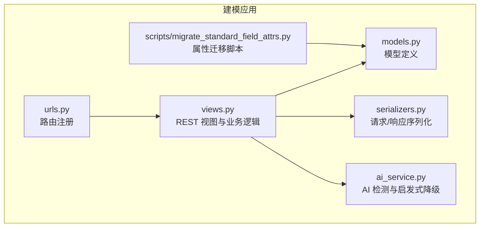
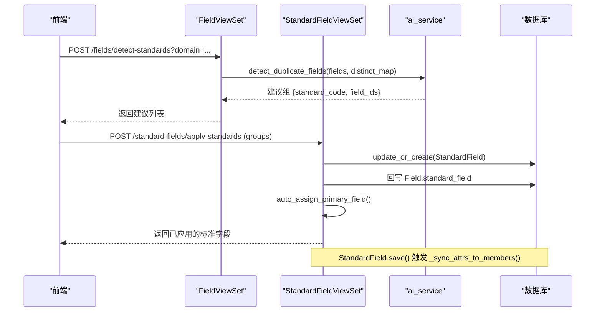
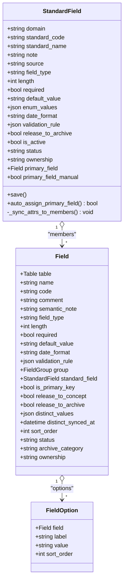
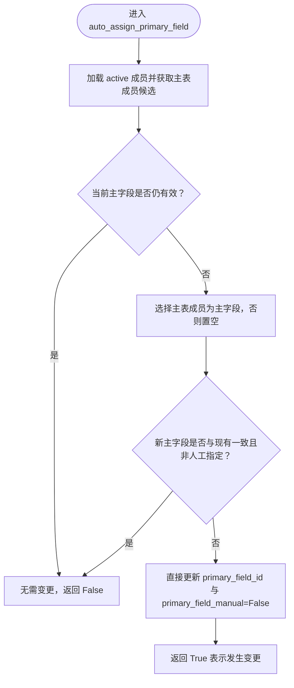
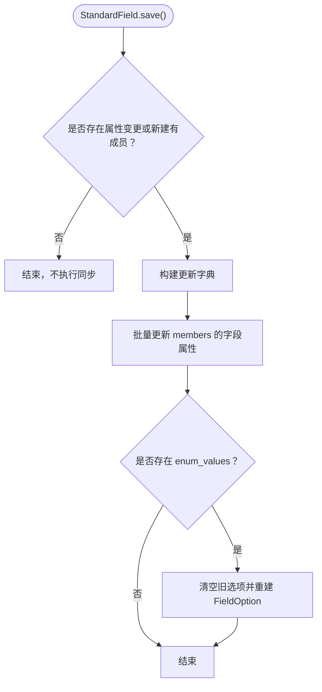
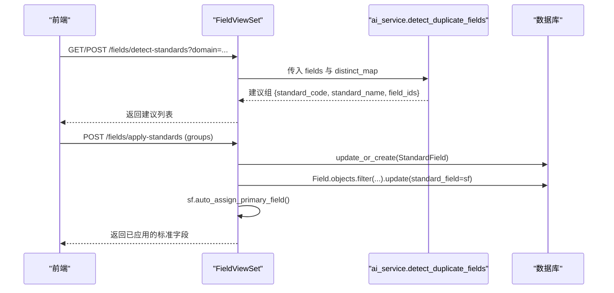
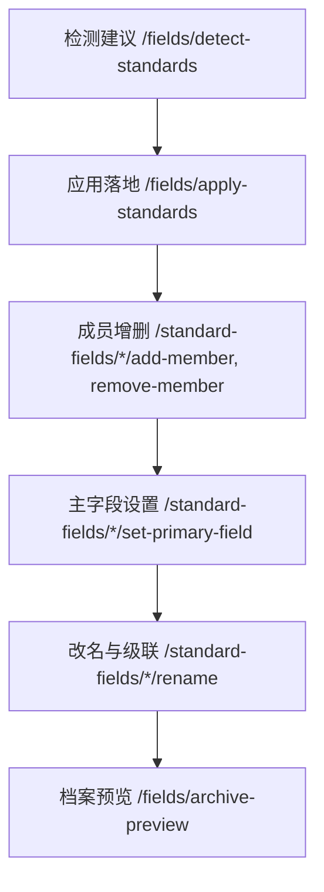
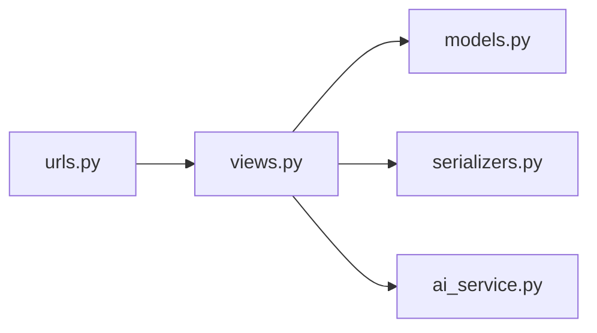

# 标准字段

<cite>
**本文引用的文件**   
- [backend/apps/modeling/models.py](file://backend/apps/modeling/models.py)
- [backend/apps/modeling/views.py](file://backend/apps/modeling/views.py)
- [backend/apps/modeling/serializers.py](file://backend/apps/modeling/serializers.py)
- [backend/apps/modeling/urls.py](file://backend/apps/modeling/urls.py)
- [backend/apps/modeling/ai_service.py](file://backend/apps/modeling/ai_service.py)
- [backend/scripts/migrate_standard_field_attrs.py](file://backend/scripts/migrate_standard_field_attrs.py)
</cite>

## 目录
1. [引言](#引言)
2. [项目结构](#项目结构)
3. [核心组件](#核心组件)
4. [架构总览](#架构总览)
5. [详细组件分析](#详细组件分析)
6. [依赖关系分析](#依赖关系分析)
7. [性能考量](#性能考量)
8. [故障排查指南](#故障排查指南)
9. [结论](#结论)
10. [附录](#附录)

## 引言
本文件围绕 MetaData002 的“标准字段（StandardField）”能力进行系统化文档化。标准字段作为概念层的一等公民，承担跨表字段归一化与去重的核心职责：将语义相同、编码一致的冗余物理字段聚合到同一概念实体上，统一承载属性配置、分组、API 开放、档案表单与质量规则。其关键设计要点包括：
- 来源分类：AI 检测 vs 手动创建
- 类型系统：字符串、数字、日期、布尔、枚举
- 属性自动同步：概念层配置变更自动下发至所有成员物理字段
- 主字段机制：自动分配与人工指定双轨并行
- 维护方策略：源系统维护 vs 档案维护，决定数据拉取时的覆盖/保护行为
- 完整业务流程：从发现、确认、应用到归档的全链路实现

## 项目结构
与标准字段相关的后端代码主要位于 modeling 应用内，包含模型定义、视图 API、序列化器、路由以及 AI 服务层；另有迁移脚本用于历史数据属性回填。

图表来源
- [backend/apps/modeling/urls.py:1-20](file://backend/apps/modeling/urls.py#L1-L20)
- [backend/apps/modeling/views.py:1493-1700](file://backend/apps/modeling/views.py#L1493-L1700)
- [backend/apps/modeling/models.py:162-300](file://backend/apps/modeling/models.py#L162-L300)
- [backend/apps/modeling/serializers.py:130-205](file://backend/apps/modeling/serializers.py#L130-L205)
- [backend/apps/modeling/ai_service.py:121-147](file://backend/apps/modeling/ai_service.py#L121-L147)
- [backend/scripts/migrate_standard_field_attrs.py:1-85](file://backend/scripts/migrate_standard_field_attrs.py#L1-L85)

章节来源
- [backend/apps/modeling/urls.py:1-20](file://backend/apps/modeling/urls.py#L1-L20)
- [backend/apps/modeling/views.py:1227-1492](file://backend/apps/modeling/views.py#L1227-L1492)
- [backend/apps/modeling/models.py:162-300](file://backend/apps/modeling/models.py#L162-L300)
- [backend/apps/modeling/serializers.py:130-205](file://backend/apps/modeling/serializers.py#L130-L205)
- [backend/apps/modeling/ai_service.py:121-147](file://backend/apps/modeling/ai_service.py#L121-L147)
- [backend/scripts/migrate_standard_field_attrs.py:1-85](file://backend/scripts/migrate_standard_field_attrs.py#L1-L85)

## 核心组件
- 标准字段 StandardField：概念层一等公民，承载跨表去重后的统一属性与元信息
- 物理字段 Field：具体表的字段定义，通过 standard_field 外键挂靠到标准字段
- 枚举选项 FieldOption：为枚举类型提供 label/value 映射
- 域 Domain/表 Table：标准字段的归属上下文与主表标识
- AI 服务 ai_service：跨表冗余检测（AI 优先 + 启发式降级）
- 视图与序列化器：暴露标准字段全生命周期管理 API
- 迁移脚本：将已有物理字段属性回填到标准字段并触发自动同步

章节来源
- [backend/apps/modeling/models.py:162-300](file://backend/apps/modeling/models.py#L162-L300)
- [backend/apps/modeling/models.py:301-385](file://backend/apps/modeling/models.py#L301-L385)
- [backend/apps/modeling/ai_service.py:121-147](file://backend/apps/modeling/ai_service.py#L121-L147)
- [backend/apps/modeling/serializers.py:130-205](file://backend/apps/modeling/serializers.py#L130-L205)
- [backend/scripts/migrate_standard_field_attrs.py:1-85](file://backend/scripts/migrate_standard_field_attrs.py#L1-L85)

## 架构总览
标准字段的核心流程由“检测建议 → 应用落地 → 属性同步 → 主字段分配 → 档案释放”构成。

图表来源
- [backend/apps/modeling/views.py:1227-1304](file://backend/apps/modeling/views.py#L1227-L1304)
- [backend/apps/modeling/views.py:1267-1304](file://backend/apps/modeling/views.py#L1267-L1304)
- [backend/apps/modeling/models.py:230-299](file://backend/apps/modeling/models.py#L230-L299)
- [backend/apps/modeling/ai_service.py:121-147](file://backend/apps/modeling/ai_service.py#L121-L147)

## 详细组件分析

### 标准字段模型与属性同步
- 来源分类：Source.AI（AI 检测）、Source.MANUAL（手动）
- 类型系统：FieldType.STRING/NUMBER/DATE/BOOLEAN/ENUM
- 关键属性：field_type、length、required、default_value、enum_values、date_format、validation_rule、release_to_archive、is_active、status、ownership、primary_field、primary_field_manual
- 保存钩子：save() 比较新旧值，必要时调用 _sync_attrs_to_members() 批量更新成员 Field 及 FieldOption
- 主字段自动分配：auto_assign_primary_field() 在成员变更后校准，优先选择主表成员，无主表成员则置空并清除人工标记

图表来源
- [backend/apps/modeling/models.py:162-300](file://backend/apps/modeling/models.py#L162-L300)
- [backend/apps/modeling/models.py:301-385](file://backend/apps/modeling/models.py#L301-L385)

章节来源
- [backend/apps/modeling/models.py:162-300](file://backend/apps/modeling/models.py#L162-L300)
- [backend/apps/modeling/models.py:301-385](file://backend/apps/modeling/models.py#L301-L385)

### 主字段自动分配与人工指定
- 自动分配：当成员集合变化或主表切换时，若当前主字段失效或为空，则优先选择主表成员；若无主表成员则置空并清除人工标记
- 人工指定：通过 set-primary-field 端点设置，标记 primary_field_manual=True，此后主表变更不再自动跟随
- 一致性保障：主字段只能由专用端点修改，序列化器将其设为只读

图表来源
- [backend/apps/modeling/models.py:255-274](file://backend/apps/modeling/models.py#L255-L274)
- [backend/apps/modeling/views.py:1566-1586](file://backend/apps/modeling/views.py#L1566-L1586)
- [backend/apps/modeling/serializers.py:144-145](file://backend/apps/modeling/serializers.py#L144-L145)

章节来源
- [backend/apps/modeling/models.py:255-274](file://backend/apps/modeling/models.py#L255-L274)
- [backend/apps/modeling/views.py:1566-1586](file://backend/apps/modeling/views.py#L1566-L1586)
- [backend/apps/modeling/serializers.py:144-145](file://backend/apps/modeling/serializers.py#L144-L145)

### 属性自动同步机制
- 触发时机：StandardField.save() 检测到属性变更或新建且有成员时
- 同步范围：field_type、length、required、default_value、date_format、validation_rule 直接更新成员 Field；enum_values 清空旧选项后重建 FieldOption
- 影响面：确保概念层配置成为唯一权威源，物理字段保持与概念层一致

图表来源
- [backend/apps/modeling/models.py:230-299](file://backend/apps/modeling/models.py#L230-L299)

章节来源
- [backend/apps/modeling/models.py:230-299](file://backend/apps/modeling/models.py#L230-L299)

### 标准字段来源分类与检测流程
- 来源分类：AI 检测（source=ai）与手动（source=manual）
- 检测入口：/fields/detect-standards 返回建议组（不落库），支持 AI 优先与启发式降级
- 应用入口：/standard-fields/apply-standards 将建议落库并回写 Field.standard_field

图表来源
- [backend/apps/modeling/views.py:1227-1304](file://backend/apps/modeling/views.py#L1227-L1304)
- [backend/apps/modeling/ai_service.py:121-147](file://backend/apps/modeling/ai_service.py#L121-L147)

章节来源
- [backend/apps/modeling/views.py:1227-1304](file://backend/apps/modeling/views.py#L1227-L1304)
- [backend/apps/modeling/ai_service.py:121-147](file://backend/apps/modeling/ai_service.py#L121-L147)

### 字段维护方与数据同步策略
- 维护方：ownership='source'（源系统维护）或 'archive'（档案维护）
- 策略含义：
  - 源系统维护：档案侧只读，拉取时直接覆盖
  - 档案维护：档案可编辑，拉取时保护不覆盖
- 作用范围：对未归并（solo）物理字段生效；组合字段由 standard_field 外键决定

章节来源
- [backend/apps/modeling/models.py:352-356](file://backend/apps/modeling/models.py#L352-L356)

### 标准字段管理的完整业务流程
- 发现阶段：/fields/detect-standards 生成建议，展示成员明细与去重内容缓存
- 确认与应用：/fields/apply-standards 落库并回写成员关系，自动分配主字段
- 成员管理：/standard-fields/{id}/add-member、remove-member 动态调整成员集合
- 主字段设置：/standard-fields/{id}/set-primary-field 支持人工指定与清除人工标记
- 改名与级联：/standard-fields/{id}/rename 支持编码/名称变更并级联更新档案 schema、记录与一致性检查
- 预览与校验：/fields/archive-preview 只读预览最终释放到档案的字段与表关系

图表来源
- [backend/apps/modeling/views.py:1227-1492](file://backend/apps/modeling/views.py#L1227-L1492)
- [backend/apps/modeling/views.py:1493-1700](file://backend/apps/modeling/views.py#L1493-L1700)

章节来源
- [backend/apps/modeling/views.py:1227-1492](file://backend/apps/modeling/views.py#L1227-L1492)
- [backend/apps/modeling/views.py:1493-1700](file://backend/apps/modeling/views.py#L1493-L1700)

### 类型系统与枚举处理
- 类型系统：STRING、NUMBER、DATE、BOOLEAN、ENUM
- 枚举处理：StandardField.enum_values 同步到各成员的 FieldOption，清空旧选项后重建，保证 label/value 与排序一致

章节来源
- [backend/apps/modeling/models.py:173-178](file://backend/apps/modeling/models.py#L173-L178)
- [backend/apps/modeling/models.py:287-299](file://backend/apps/modeling/models.py#L287-L299)

### 主表变更对主字段的联动
- 当主表切换时，仅自动分配的（primary_field_manual=False）主字段会跟随到新主表成员；人工指定的保持不变

章节来源
- [backend/apps/modeling/models.py:110-123](file://backend/apps/modeling/models.py#L110-L123)

## 依赖关系分析
- 视图依赖模型与序列化器：StandardFieldViewSet 使用 StandardFieldSerializer 输出成员、主字段信息与去重样本
- 视图依赖 AI 服务：detect_standards 调用 ai_service.detect_duplicate_fields，支持 LLM 与启发式降级
- 路由注册：urls.py 将 standard-fields 与 fields 相关端点暴露给前端

图表来源
- [backend/apps/modeling/urls.py:1-20](file://backend/apps/modeling/urls.py#L1-L20)
- [backend/apps/modeling/views.py:1493-1700](file://backend/apps/modeling/views.py#L1493-L1700)
- [backend/apps/modeling/serializers.py:130-205](file://backend/apps/modeling/serializers.py#L130-L205)
- [backend/apps/modeling/ai_service.py:121-147](file://backend/apps/modeling/ai_service.py#L121-L147)

章节来源
- [backend/apps/modeling/urls.py:1-20](file://backend/apps/modeling/urls.py#L1-L20)
- [backend/apps/modeling/views.py:1493-1700](file://backend/apps/modeling/views.py#L1493-L1700)
- [backend/apps/modeling/serializers.py:130-205](file://backend/apps/modeling/serializers.py#L130-L205)
- [backend/apps/modeling/ai_service.py:121-147](file://backend/apps/modeling/ai_service.py#L121-L147)

## 性能考量
- 去重内容缓存：Field.distinct_values 与 distinct_synced_at 用于避免频繁查询外部数据源，刷新接口支持强制重查
- 批量更新：_sync_attrs_to_members() 使用 Django 的 bulk update，减少数据库往返
- 预加载优化：视图中使用 select_related/prefetch_related 减少 N+1 查询
- 大模型调用降级：ai_service 在无可用 LLM 时回退到启发式算法，保证功能可用性

章节来源
- [backend/apps/modeling/views.py:1420-1441](file://backend/apps/modeling/views.py#L1420-L1441)
- [backend/apps/modeling/models.py:276-299](file://backend/apps/modeling/models.py#L276-L299)
- [backend/apps/modeling/ai_service.py:171-186](file://backend/apps/modeling/ai_service.py#L171-L186)

## 故障排查指南
- 主字段缺失：组合字段存在多个成员但未设置主字段时，会在域配置检查中告警；需在 set-primary-field 端点明确设置
- 属性不同步：若 StandardField 属性未同步到成员，检查 save() 是否被绕过或使用批量更新未触发钩子
- 枚举不一致：确认 enum_values 是否正确写入并重建 FieldOption
- 连接与 LLM：AI 连接失败时检查 AIConfig 或环境变量配置，确保 requests 依赖可用

章节来源
- [backend/apps/modeling/views.py:327-428](file://backend/apps/modeling/views.py#L327-L428)
- [backend/apps/modeling/models.py:230-299](file://backend/apps/modeling/models.py#L230-L299)
- [backend/apps/modeling/ai_service.py:78-90](file://backend/apps/modeling/ai_service.py#L78-L90)

## 结论
标准字段以概念层为核心，通过统一的属性配置与主字段机制，实现了跨表字段的归一化与去重，并为档案释放与数据治理提供了稳定基础。其自动同步与自动分配机制显著降低了人工维护成本，同时保留人工干预通道以满足复杂场景需求。配合 AI 检测与启发式降级，系统在智能化与可靠性之间取得平衡。

## 附录
- 历史属性迁移：migrate_standard_field_attrs.py 可将已有物理字段属性回填到标准字段，并在保存时触发自动同步，解决存量数据不一致问题

章节来源
- [backend/scripts/migrate_standard_field_attrs.py:1-85](file://backend/scripts/migrate_standard_field_attrs.py#L1-L85)