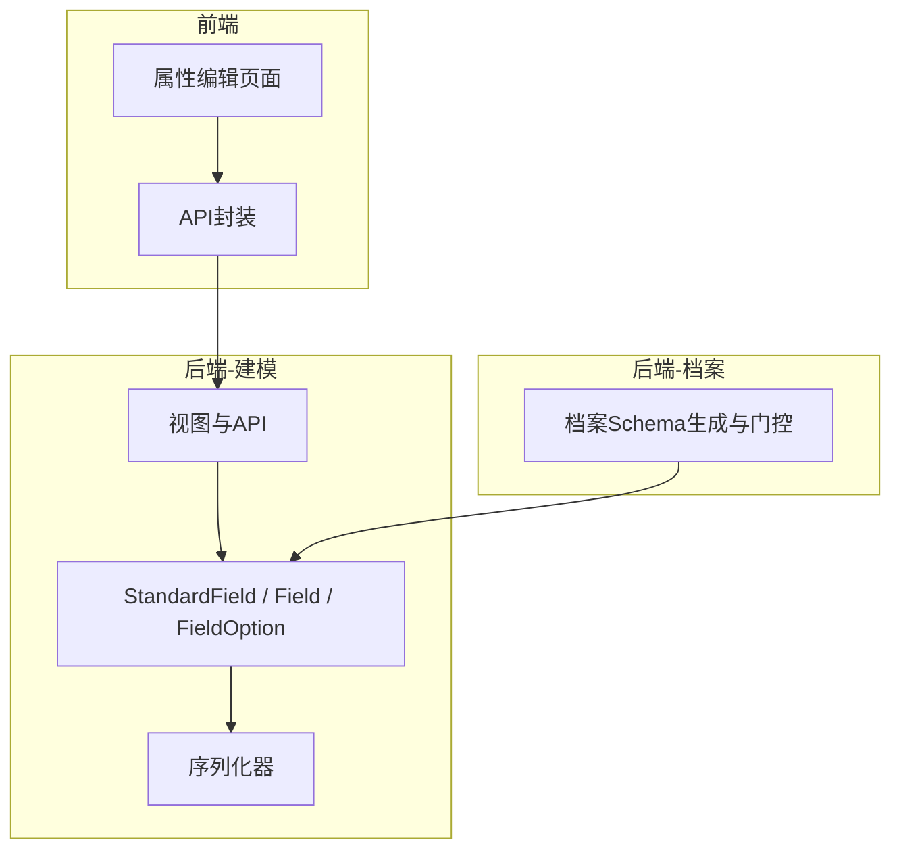
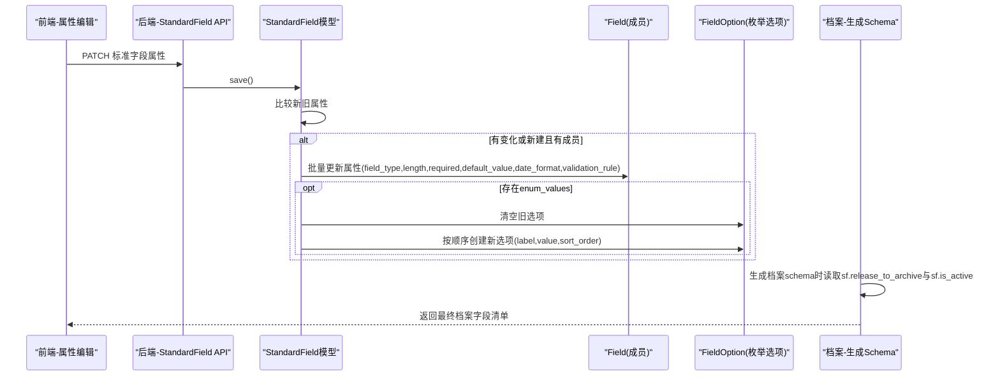
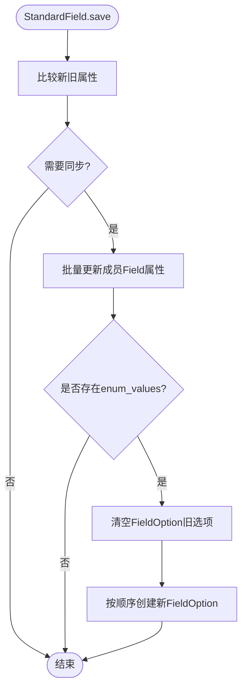
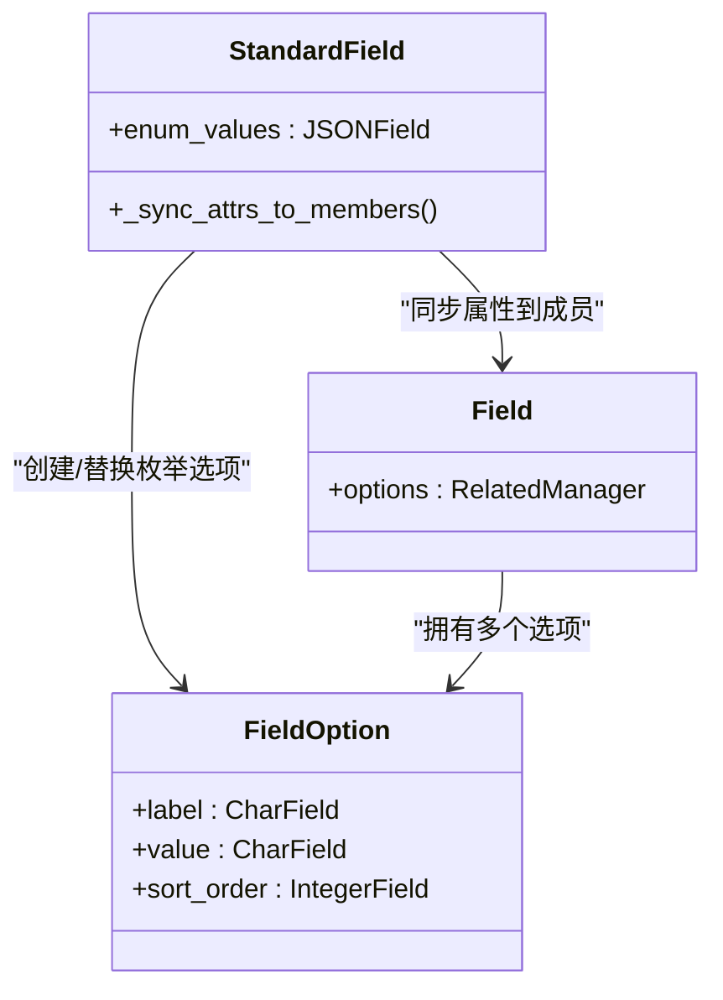
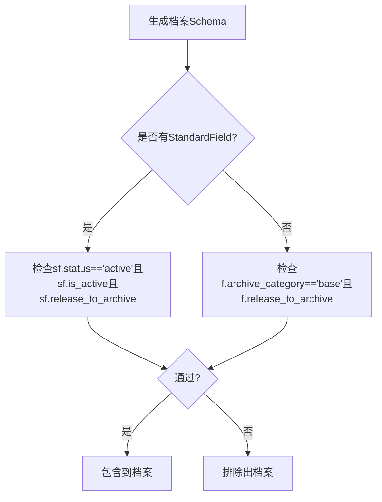
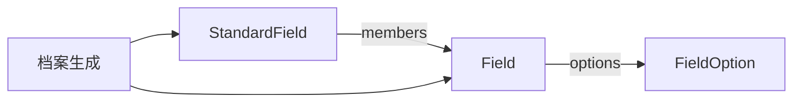

# 标准字段属性管理

<cite>
**本文引用的文件**   
- [models.py](file://backend/apps/modeling/models.py)
- [serializers.py](file://backend/apps/modeling/serializers.py)
- [views.py](file://backend/apps/modeling/views.py)
- [archive_views.py](file://backend/apps/archive/views.py)
- [migrate_standard_field_attrs.py](file://backend/scripts/migrate_standard_field_attrs.py)
- [DomainFieldConfig.vue](file://frontend/src/views/modeling/DomainFieldConfig.vue)
- [modeling.ts](file://frontend/src/api/modeling.ts)
</cite>

## 目录
1. [简介](#简介)
2. [项目结构](#项目结构)
3. [核心组件](#核心组件)
4. [架构总览](#架构总览)
5. [详细组件分析](#详细组件分析)
6. [依赖关系分析](#依赖关系分析)
7. [性能考虑](#性能考虑)
8. [故障排查指南](#故障排查指南)
9. [结论](#结论)
10. [附录](#附录)

## 简介
本文件面向 MetaData002 的“标准字段属性管理”能力，系统性说明标准字段的属性配置（数据类型、长度、必填性、默认值、枚举值、日期格式与校验规则等），并重点阐述属性的自动同步机制：当标准字段属性变更时，如何自动应用到所有成员物理字段。文档还详细说明 enum_values 的 JSON 结构与同步到 FieldOption 表的逻辑，解释 release_to_archive 与 is_active 的作用机制（控制是否释放到档案），以及 validation_rule 的 JSON 规范与验证逻辑。最后提供完整示例与常见使用场景，帮助读者快速上手与排障。

## 项目结构
围绕标准字段属性管理的代码主要分布在建模模块与档案模块中：
- 建模模块（backend/apps/modeling）：定义 StandardField、Field、FieldOption 等模型，实现属性保存与同步逻辑，暴露 REST API。
- 档案模块（backend/apps/archive）：在生成档案 schema 时应用 release_to_archive 与 is_active 的门控策略。
- 前端（frontend）：提供属性编辑界面与批量更新接口调用。

图表来源 
- [models.py:162-300](file://backend/apps/modeling/models.py#L162-L300)
- [serializers.py:130-205](file://backend/apps/modeling/serializers.py#L130-L205)
- [views.py:1493-1600](file://backend/apps/modeling/views.py#L1493-L1600)
- [archive_views.py:29-44](file://backend/apps/archive/views.py#L29-L44)
- [DomainFieldConfig.vue:1103-1144](file://frontend/src/views/modeling/DomainFieldConfig.vue#L1103-L1144)
- [modeling.ts:215-236](file://frontend/src/api/modeling.ts#L215-L236)

章节来源
- [models.py:162-300](file://backend/apps/modeling/models.py#L162-L300)
- [serializers.py:130-205](file://backend/apps/modeling/serializers.py#L130-L205)
- [views.py:1493-1600](file://backend/apps/modeling/views.py#L1493-L1600)
- [archive_views.py:29-44](file://backend/apps/archive/views.py#L29-L44)
- [DomainFieldConfig.vue:1103-1144](file://frontend/src/views/modeling/DomainFieldConfig.vue#L1103-L1144)
- [modeling.ts:215-236](file://frontend/src/api/modeling.ts#L215-L236)

## 核心组件
- 标准字段（StandardField）：概念层一等公民，承载统一属性配置，支持跨表去重归并。
- 物理字段（Field）：具体表的字段定义，可挂靠到标准字段，接收属性同步。
- 枚举选项（FieldOption）：存储枚举类型的 label/value 选项，由标准字段 enum_values 同步生成。
- 序列化器（StandardFieldSerializer、StandardFieldAggregateSerializer）：对外暴露属性字段与聚合视图。
- 视图（StandardFieldViewSet、FieldViewSet）：提供标准字段 CRUD、成员管理、主字段设置、批量更新等 API。
- 档案门控（archive views）：在生成档案 schema 时依据 release_to_archive 与 is_active 决定是否包含该字段。

章节来源
- [models.py:162-300](file://backend/apps/modeling/models.py#L162-L300)
- [models.py:301-385](file://backend/apps/modeling/models.py#L301-L385)
- [serializers.py:130-205](file://backend/apps/modeling/serializers.py#L130-L205)
- [views.py:1493-1600](file://backend/apps/modeling/views.py#L1493-L1600)
- [archive_views.py:29-44](file://backend/apps/archive/views.py#L29-L44)

## 架构总览
标准字段属性管理的核心流程如下：
- 前端通过属性编辑界面修改标准字段属性（如 field_type、length、required、default_value、enum_values、date_format、validation_rule、release_to_archive、is_active）。
- 后端 StandardField.save() 检测属性变化，触发 _sync_attrs_to_members()，将属性批量更新到所有 active 成员 Field。
- 若存在 enum_values，则清空旧 FieldOption 并写入新选项，保证 Field.options 与标准字段一致。
- 档案生成阶段，依据 release_to_archive 与 is_active 进行门控过滤，决定字段是否进入档案 schema 与记录。

图表来源 
- [models.py:230-299](file://backend/apps/modeling/models.py#L230-L299)
- [archive_views.py:29-44](file://backend/apps/archive/views.py#L29-L44)
- [views.py:1493-1600](file://backend/apps/modeling/views.py#L1493-L1600)

## 详细组件分析

### 标准字段属性与自动同步机制
- 属性字段：field_type、length、required、default_value、enum_values、date_format、validation_rule、release_to_archive、is_active、ownership、status、primary_field、primary_field_manual。
- 自动同步：
  - 保存时对比新旧值，若任一属性变化或新建且已有成员，则调用 _sync_attrs_to_members()。
  - 对 members.filter(status=active) 执行批量更新，确保概念层与实现层一致。
  - enum_values 同步到 FieldOption：先清空旧选项，再按索引创建新选项，保持排序。

图表来源 
- [models.py:230-299](file://backend/apps/modeling/models.py#L230-L299)

章节来源
- [models.py:230-299](file://backend/apps/modeling/models.py#L230-L299)

### enum_values 的JSON结构与同步逻辑
- JSON 结构：数组元素为对象，至少包含 label 与 value；可选 sort_order 用于排序（由后端在创建时按索引赋值）。
- 同步逻辑：
  - 遍历 enum_values，逐个创建 FieldOption，label 优先取 label，否则回退到 value；value 取 value。
  - 每个成员的 options 会被完全替换，确保与标准字段一致。

图表来源 
- [models.py:193-198](file://backend/apps/modeling/models.py#L193-L198)
- [models.py:287-299](file://backend/apps/modeling/models.py#L287-L299)

章节来源
- [models.py:193-198](file://backend/apps/modeling/models.py#L193-L198)
- [models.py:287-299](file://backend/apps/modeling/models.py#L287-L299)

### release_to_archive 与 is_active 的作用机制
- release_to_archive：标准字段级别的“释放到档案”开关。取消后，该标准字段不释放到档案，档案 schema 与记录都不包含它。
- is_active：标准字段启用开关。停用后视为不释放，档案 schema 与记录都不包含它。
- 档案生成逻辑：
  - 组合字段（有 StandardField）：需满足 sf.status='active' 且 sf.is_active=True 且 sf.release_to_archive=True。
  - 独立字段（无 StandardField）：需 f.archive_category='base' 且 f.release_to_archive=True。

图表来源 
- [archive_views.py:29-44](file://backend/apps/archive/views.py#L29-L44)

章节来源
- [archive_views.py:29-44](file://backend/apps/archive/views.py#L29-L44)

### validation_rule 的JSON格式与验证逻辑
- JSON 格式：对象，包含 pattern（正则表达式）与 message（提示信息）。
- 验证逻辑：
  - 当前模型仅持久化 validation_rule，未在后端内置统一的校验执行器。
  - 通常在前端或业务侧根据 pattern 进行输入校验，message 作为提示文案。
  - 迁移脚本与批量更新接口均支持读写该字段，便于数据迁移与批量维护。

章节来源
- [models.py:197-198](file://backend/apps/modeling/models.py#L197-L198)
- [views.py:1066-1099](file://backend/apps/modeling/views.py#L1066-L1099)

### 属性配置的完整示例与常见使用场景
- 示例一：字符串类型字段，设置长度、必填、默认值与校验规则
  - 适用场景：用户名、邮箱等基础文本字段。
  - 操作要点：设置 field_type='string'，length 限制最大长度，required=true，default_value 提供默认值，validation_rule.pattern 使用正则约束格式。
- 示例二：枚举类型字段，配置选项与排序
  - 适用场景：性别、状态码等离散取值字段。
  - 操作要点：设置 field_type='enum'，enum_values 为 [{label:"男",value:"M"},{label:"女",value:"F"}]，保存后自动同步到各成员 Field 的 FieldOption。
- 示例三：日期类型字段，指定日期格式
  - 适用场景：生日、入职日期等。
  - 操作要点：设置 field_type='date'，date_format='YYYY-MM-DD' 或 'YYYY/MM/DD' 等，配合前端日期选择器展示。
- 示例四：控制是否释放到档案
  - 适用场景：审计列或系统内部字段不需要进入档案。
  - 操作要点：将 release_to_archive=false 或 is_active=false，档案生成时将自动排除。

章节来源
- [models.py:189-202](file://backend/apps/modeling/models.py#L189-L202)
- [models.py:287-299](file://backend/apps/modeling/models.py#L287-L299)
- [archive_views.py:29-44](file://backend/apps/archive/views.py#L29-L44)

## 依赖关系分析
- StandardField 与 Field：一对多关系（一个标准字段对应多个成员物理字段），属性变更时通过 _sync_attrs_to_members() 批量更新。
- Field 与 FieldOption：一对多关系（一个物理字段有多个枚举选项），enum_values 同步时会清空并重建。
- 档案生成依赖 StandardField 的 status、is_active、release_to_archive 与 Field 的 archive_category、release_to_archive。

图表来源 
- [models.py:162-300](file://backend/apps/modeling/models.py#L162-L300)
- [models.py:301-385](file://backend/apps/modeling/models.py#L301-L385)
- [archive_views.py:29-44](file://backend/apps/archive/views.py#L29-L44)

章节来源
- [models.py:162-300](file://backend/apps/modeling/models.py#L162-L300)
- [models.py:301-385](file://backend/apps/modeling/models.py#L301-L385)
- [archive_views.py:29-44](file://backend/apps/archive/views.py#L29-L44)

## 性能考虑
- 批量更新：_sync_attrs_to_members() 使用 Django ORM 的 bulk update，避免逐条更新带来的开销。
- 枚举选项重建：每次同步会先删除旧选项再批量创建，注意成员数量较多时的数据库写入压力。
- 去重缓存：distinct_values 缓存减少重复查询，提升属性配置页面的加载速度。
- 建议：
  - 大批量属性变更建议使用批量接口（fields/batch-attributes）以减少请求次数。
  - 合理设置 page_size 与分页参数，避免一次性拉取过多数据。

[本节为通用指导，无需引用具体文件]

## 故障排查指南
- 问题：属性变更后未同步到成员字段
  - 排查点：确认 StandardField.save() 是否被调用；检查 sync_fields 列表中的属性是否发生变化；确认成员字段状态是否为 active。
  - 参考路径：[models.py:230-299](file://backend/apps/modeling/models.py#L230-L299)
- 问题：枚举选项未更新
  - 排查点：确认 enum_values 非空；检查 FieldOption 是否被清空并重新创建；确认 sort_order 是否正确。
  - 参考路径：[models.py:287-299](file://backend/apps/modeling/models.py#L287-L299)
- 问题：字段未进入档案
  - 排查点：检查 release_to_archive 与 is_active 是否为 True；组合字段需 sf.status='active'；独立字段需 archive_category='base'。
  - 参考路径：[archive_views.py:29-44](file://backend/apps/archive/views.py#L29-L44)
- 问题：校验规则未生效
  - 排查点：validation_rule 仅持久化，未内置执行器；需在前端或业务侧实现正则校验。
  - 参考路径：[models.py:197-198](file://backend/apps/modeling/models.py#L197-L198)

章节来源
- [models.py:230-299](file://backend/apps/modeling/models.py#L230-L299)
- [models.py:287-299](file://backend/apps/modeling/models.py#L287-L299)
- [archive_views.py:29-44](file://backend/apps/archive/views.py#L29-L44)
- [models.py:197-198](file://backend/apps/modeling/models.py#L197-L198)

## 结论
标准字段属性管理通过概念层与实现层的解耦设计，实现了属性集中配置与自动同步，提升了数据治理的一致性与效率。结合 release_to_archive 与 is_active 的门控机制，能够灵活控制字段是否进入档案。enum_values 与 validation_rule 提供了丰富的元数据描述能力，配合前端交互可实现完整的字段属性生命周期管理。建议在大规模数据场景中合理使用批量接口与缓存机制，以优化性能与用户体验。

[本节为总结性内容，无需引用具体文件]

## 附录
- 数据迁移脚本：migrate_standard_field_attrs.py 可将现有物理字段属性迁移至标准字段，并在保存时自动同步回所有成员。
- 前端集成：DomainFieldConfig.vue 与 modeling.ts 提供了属性编辑与 API 调用的完整示例，便于快速接入。

章节来源
- [migrate_standard_field_attrs.py:1-85](file://backend/scripts/migrate_standard_field_attrs.py#L1-L85)
- [DomainFieldConfig.vue:1103-1144](file://frontend/src/views/modeling/DomainFieldConfig.vue#L1103-L1144)
- [modeling.ts:215-236](file://frontend/src/api/modeling.ts#L215-L236)