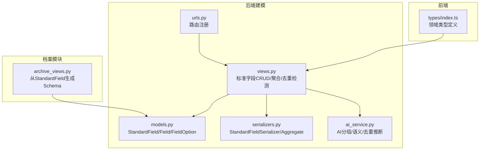
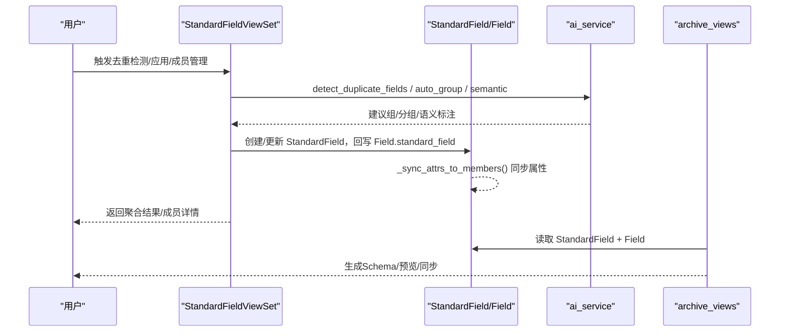
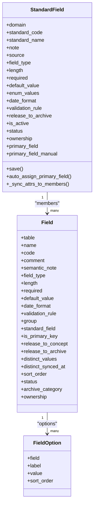
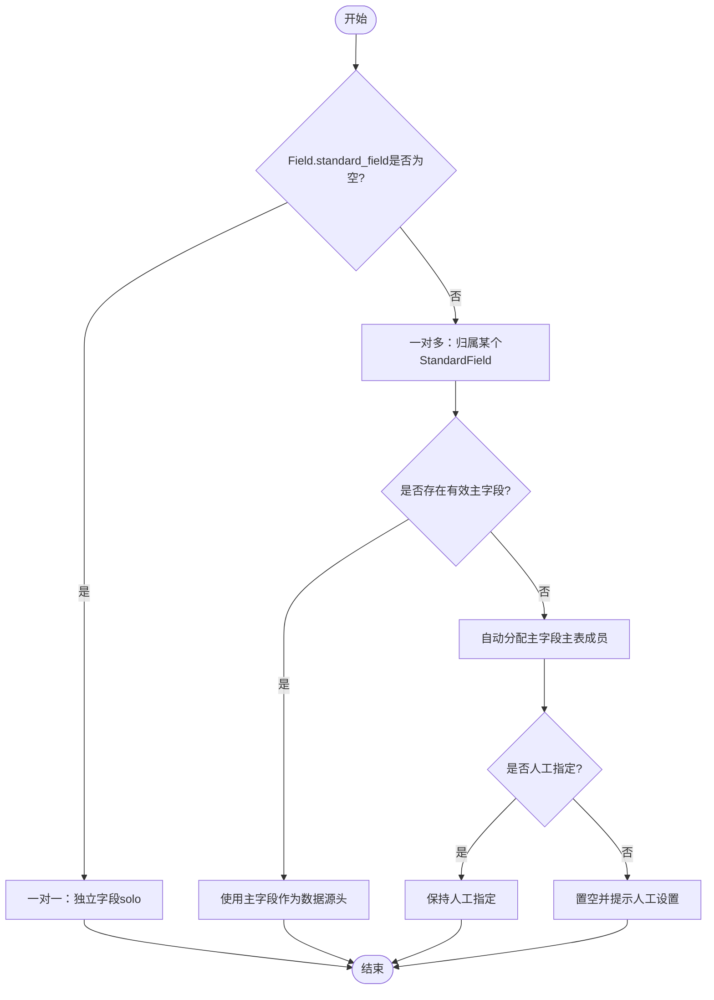
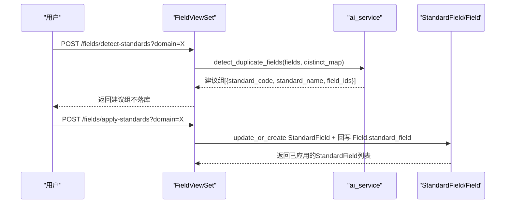
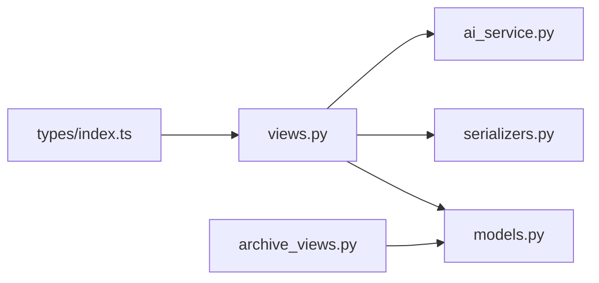

# 标准字段概念与设计

<cite>
**本文引用的文件**   
- [models.py](file://backend/apps/modeling/models.py)
- [serializers.py](file://backend/apps/modeling/serializers.py)
- [views.py](file://backend/apps/modeling/views.py)
- [ai_service.py](file://backend/apps/modeling/ai_service.py)
- [urls.py](file://backend/apps/modeling/urls.py)
- [archive_views.py](file://backend/apps/archive/views.py)
- [index.ts](file://frontend/src/types/index.ts)
</cite>

## 目录
1. [引言](#引言)
2. [项目结构](#项目结构)
3. [核心组件](#核心组件)
4. [架构总览](#架构总览)
5. [详细组件分析](#详细组件分析)
6. [依赖关系分析](#依赖关系分析)
7. [性能考量](#性能考量)
8. [故障排查指南](#故障排查指南)
9. [结论](#结论)
10. [附录](#附录)

## 引言
本文件围绕“标准字段”这一概念层一等公民，系统阐述其在跨表字段归一化与去重中的核心作用，解释来源分类（AI检测 vs 手动创建）、字段类型体系（字符串、数字、日期、布尔、枚举）的设计原理，以及标准字段与物理字段的映射模型（一对一与一对多）。同时说明其在数据建模流程中的关键位置，以及如何通过标准字段实现概念层与物理层的解耦，并给出设计模式与最佳实践建议。

## 项目结构
- 后端建模模块（modeling）承载标准字段的核心模型、序列化器、视图与AI能力；档案模块（archive）消费标准字段生成Schema与记录。
- 前端类型定义与页面交互基于后端API契约，统一使用标准字段聚合视图进行分组与属性配置。

图表来源 
- [models.py](file://backend/apps/modeling/models.py)
- [serializers.py](file://backend/apps/modeling/serializers.py)
- [views.py](file://backend/apps/modeling/views.py)
- [ai_service.py](file://backend/apps/modeling/ai_service.py)
- [urls.py](file://backend/apps/modeling/urls.py)
- [archive_views.py](file://backend/apps/archive/views.py)
- [index.ts](file://frontend/src/types/index.ts)

章节来源
- [models.py](file://backend/apps/modeling/models.py)
- [serializers.py](file://backend/apps/modeling/serializers.py)
- [views.py](file://backend/apps/modeling/views.py)
- [ai_service.py](file://backend/apps/modeling/ai_service.py)
- [urls.py](file://backend/apps/modeling/urls.py)
- [archive_views.py](file://backend/apps/archive/views.py)
- [index.ts](file://frontend/src/types/index.ts)

## 核心组件
- 标准字段（StandardField）：概念层一等公民，承载跨表等价字段的统一编码、名称、类型、校验规则、默认值、枚举、释放门控、启用状态、维护方、主字段等。
- 物理字段（Field）：具体表的字段定义，保留全部历史与细节，通过外键挂靠到标准字段，形成一对多成员集合。
- 枚举选项（FieldOption）：为枚举类型的物理字段提供选项值，随标准字段同步更新。
- AI服务（ai_service）：提供自动分组、语义识别、跨表去重检测、Excel字段推断等能力，支持真实LLM调用与启发式降级。
- 视图与序列化器：暴露标准字段列表、聚合视图、成员管理、去重检测与应用、改名级联等API。
- 档案集成：从标准字段生成Schema与记录，应用两层门控（概念→档案），确保概念与物理解耦。

章节来源
- [models.py](file://backend/apps/modeling/models.py)
- [serializers.py](file://backend/apps/modeling/serializers.py)
- [views.py](file://backend/apps/modeling/views.py)
- [ai_service.py](file://backend/apps/modeling/ai_service.py)
- [archive_views.py](file://backend/apps/archive/views.py)

## 架构总览
标准字段作为概念层枢纽，连接物理字段与下游档案/计算字段。其工作流包括：
- 物理字段采集与增强（注释、语义、去重样本缓存）
- AI或人工完成跨表去重，建立标准字段与成员映射
- 标准字段属性变更自动同步至成员
- 档案侧按标准字段信息生成Schema与记录，应用门控与一致性检查

图表来源 
- [views.py](file://backend/apps/modeling/views.py)
- [models.py](file://backend/apps/modeling/models.py)
- [ai_service.py](file://backend/apps/modeling/ai_service.py)
- [archive_views.py](file://backend/apps/archive/views.py)

## 详细组件分析

### 标准字段模型与类型体系
- 来源分类：AI检测（source='ai'）与手动创建（source='manual'），用于区分标准字段的产生方式。
- 字段类型：string、number、date、boolean、enum，覆盖常见业务数据类型；enum通过FieldOption存储选项值。
- 属性配置：长度、必填、默认值、日期格式、校验规则、是否释放到档案、启用状态、维护方、主字段等。
- 主字段机制：组合字段需指定一个有效成员作为数据源头（primary_field），支持自动分配与人工指定（primary_field_manual）。

图表来源 
- [models.py](file://backend/apps/modeling/models.py)

章节来源
- [models.py](file://backend/apps/modeling/models.py)

### 标准字段与物理字段的映射模型
- 一对多关系：一个StandardField对应多个Field成员（members），通过Field.standard_field外键关联。
- 一对一场景：当某物理字段未归属任何标准字段时，视为独立字段（solo），在聚合视图中以kind='solo'呈现。
- 主字段选择：优先取主表成员，无主表成员则留空强制人工设置；人工指定后主表变更不跟随。

图表来源 
- [models.py](file://backend/apps/modeling/models.py)
- [views.py](file://backend/apps/modeling/views.py)

章节来源
- [models.py](file://backend/apps/modeling/models.py)
- [views.py](file://backend/apps/modeling/views.py)

### 标准字段来源分类机制（AI检测 vs 手动创建）
- AI检测：通过ai_service.detect_duplicate_fields进行三层匹配（编码归一化、名称归一化、去重内容一致），支持LLM与启发式降级。
- 手动创建：通过StandardFieldViewSet.create接口，由用户输入标准编码/名称并选择成员字段。

图表来源 
- [views.py](file://backend/apps/modeling/views.py)
- [ai_service.py](file://backend/apps/modeling/ai_service.py)
- [models.py](file://backend/apps/modeling/models.py)

章节来源
- [views.py](file://backend/apps/modeling/views.py)
- [ai_service.py](file://backend/apps/modeling/ai_service.py)
- [models.py](file://backend/apps/modeling/models.py)

### 字段类型系统设计原理
- 类型枚举：string、number、date、boolean、enum，覆盖基础与结构化数据。
- 枚举实现：通过FieldOption存储label/value/sort_order，标准字段保存enum_values并在同步时重建选项。
- 类型推断：Excel导入与AI推断均能根据样本值推断类型（如日期、布尔、数字、字符串）。

章节来源
- [models.py](file://backend/apps/modeling/models.py)
- [ai_service.py](file://backend/apps/modeling/ai_service.py)

### 标准字段在数据建模流程中的核心作用
- 概念层统一：将跨表冗余字段归并为标准字段，消除重复定义，统一属性与校验。
- 属性同步：标准字段属性变更自动同步至所有成员物理字段，保证一致性。
- 档案生成：档案Schema从标准字段生成，应用两层门控（概念→档案），确保仅释放必要字段。
- 一致性检查：组合字段通过主字段进行数据比对，发现不一致时告警。

章节来源
- [models.py](file://backend/apps/modeling/models.py)
- [archive_views.py](file://backend/apps/archive/views.py)
- [views.py](file://backend/apps/modeling/views.py)

### 概念层与物理层的解耦设计
- 解耦点：Field.standard_field外键指向StandardField，物理字段保留完整历史，概念层变更不影响物理结构。
- 门控机制：release_to_concept控制物理→概念，sf.is_active与sf.release_to_archive控制概念→档案。
- 输出去重：档案Schema按code去重，首次出现为准，避免重复字段。

章节来源
- [models.py](file://backend/apps/modeling/models.py)
- [archive_views.py](file://backend/apps/archive/views.py)

### 设计模式与最佳实践
- 组合字段主字段策略：优先自动分配（主表成员），允许人工指定锁定；无主表成员时强制人工设置。
- 属性同步最小化：仅在必要时触发同步，避免频繁更新。
- 去重样本缓存：distinct_values缓存提升AI判断与前端展示性能。
- 命名规范：standard_code唯一且稳定，便于级联更新与追溯。
- 错误处理：AI调用失败降级到启发式，保证功能可用。

章节来源
- [models.py](file://backend/apps/modeling/models.py)
- [views.py](file://backend/apps/modeling/views.py)
- [ai_service.py](file://backend/apps/modeling/ai_service.py)

## 依赖关系分析
- 视图依赖模型与序列化器，AI服务提供智能能力。
- 档案模块依赖标准字段生成Schema，消费概念层输出。
- 前端类型定义与后端API契约保持一致。

图表来源 
- [views.py](file://backend/apps/modeling/views.py)
- [models.py](file://backend/apps/modeling/models.py)
- [serializers.py](file://backend/apps/modeling/serializers.py)
- [ai_service.py](file://backend/apps/modeling/ai_service.py)
- [archive_views.py](file://backend/apps/archive/views.py)
- [index.ts](file://frontend/src/types/index.ts)

章节来源
- [views.py](file://backend/apps/modeling/views.py)
- [models.py](file://backend/apps/modeling/models.py)
- [serializers.py](file://backend/apps/modeling/serializers.py)
- [ai_service.py](file://backend/apps/modeling/ai_service.py)
- [archive_views.py](file://backend/apps/archive/views.py)
- [index.ts](file://frontend/src/types/index.ts)

## 性能考量
- 去重样本缓存：distinct_values缓存减少实时查询开销。
- 批量操作：标准字段属性同步采用批量更新，降低数据库压力。
- AI降级：LLM调用失败时自动降级到启发式算法，保证可用性。
- 预加载优化：视图中使用select_related/prefetch_related减少N+1查询。

[本节为通用指导，无需特定文件引用]

## 故障排查指南
- 主字段缺失：组合字段必须设置有效主字段，否则一致性检查会报错。
- 去重样本为空：检查distinct_values缓存是否刷新，必要时调用refresh-distinct。
- AI连接失败：确认AIConfig配置正确，或回退到启发式模式。
- 属性不同步：检查StandardField.save钩子是否正常执行，确认成员状态为active。

章节来源
- [views.py](file://backend/apps/modeling/views.py)
- [models.py](file://backend/apps/modeling/models.py)
- [ai_service.py](file://backend/apps/modeling/ai_service.py)

## 结论
标准字段作为概念层一等公民，实现了跨表字段的归一化与去重，统一了属性配置与校验规则，并通过与物理字段的解耦设计，确保了概念层与物理层的独立性。结合AI智能与人工干预，提供了高效、灵活的数据建模体验。通过合理的性能优化与错误处理，系统在大规模数据场景下仍能保持稳定与可靠。

[本节为总结性内容，无需特定文件引用]

## 附录
- API端点：标准字段CRUD、聚合视图、去重检测、成员管理、改名级联等。
- 迁移历史：标准字段相关字段与约束的演进过程。
- 前端类型：领域对象与API响应结构的TypeScript定义。

章节来源
- [urls.py](file://backend/apps/modeling/urls.py)
- [models.py](file://backend/apps/modeling/models.py)
- [index.ts](file://frontend/src/types/index.ts)