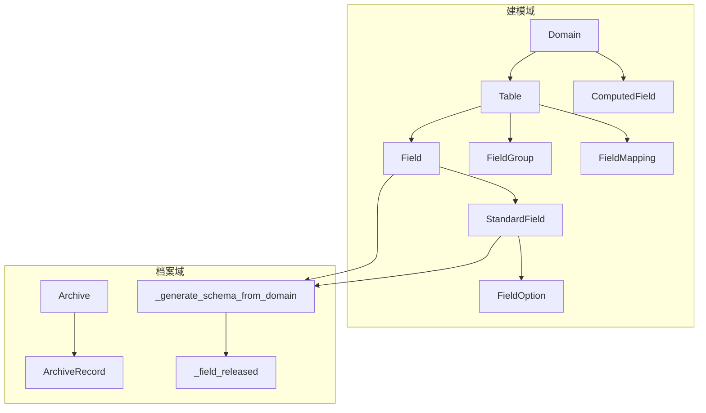
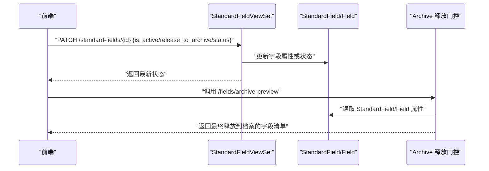
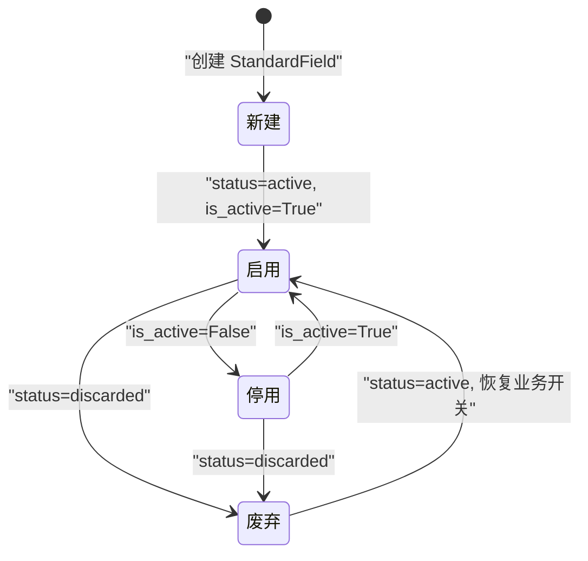
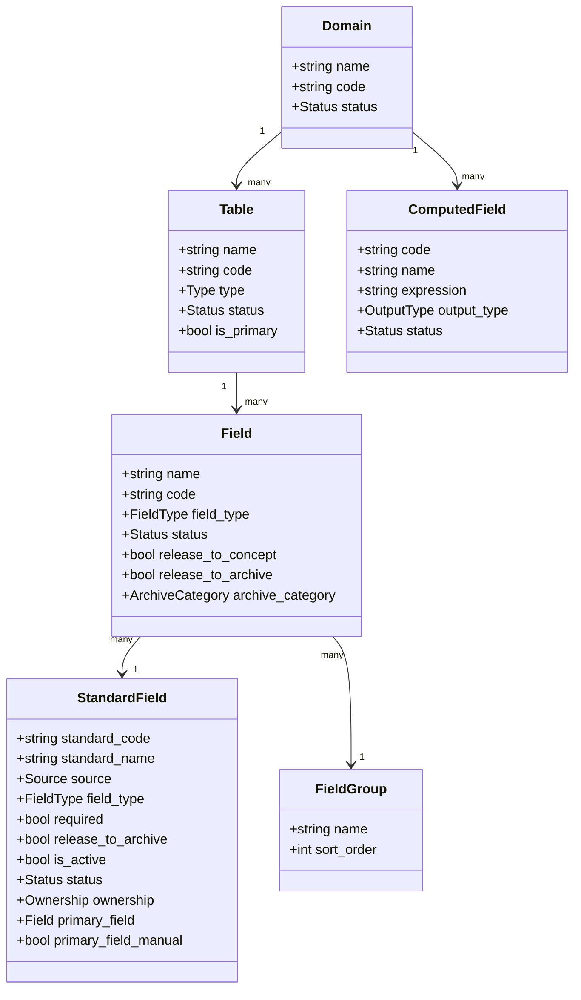

# 标准字段生命周期

<cite>
**本文档引用的文件**
- [models.py](file://backend/apps/modeling/models.py)
- [views.py](file://backend/apps/modeling/views.py)
- [serializers.py](file://backend/apps/modeling/serializers.py)
- [urls.py](file://backend/apps/modeling/urls.py)
- [archive_views.py](file://backend/apps/archive/views.py)
- [0015_standardfield_is_active.py](file://backend/apps/modeling/migrations/0015_standardfield_is_active.py)
- [0020_add_computed_field_and_standard_field_status.py](file://backend/apps/modeling/migrations/0020_add_computed_field_and_standard_field_status.py)
</cite>

## 目录
1. [简介](#简介)
2. [项目结构](#项目结构)
3. [核心组件](#核心组件)
4. [架构总览](#架构总览)
5. [详细组件分析](#详细组件分析)
6. [依赖关系分析](#依赖关系分析)
7. [性能考虑](#性能考虑)
8. [故障排查指南](#故障排查指南)
9. [结论](#结论)
10. [附录](#附录)

## 简介
本文件面向“标准字段”（StandardField）的生命周期管理，覆盖从创建、启用、停用到废弃的全流程，重点说明以下要点：
- 状态模型与转换规则：status 字段的 active/discarded 状态及其业务影响；is_active 与 status 的区别与协作关系。
- 对档案释放的影响：启用/停用在概念层与档案层的门控逻辑。
- 数据建模流程阶段：AI自动识别、人工确认、属性配置、分组管理等。
- API接口与使用示例：标准字段CRUD、成员管理、主字段设置、改名级联等。
- 最佳实践：状态迁移、归档预览、批量操作与一致性保障。

## 项目结构
后端采用 Django + DRF 的分层设计：
- models.py：领域模型定义（Domain、Table、Field、StandardField、ComputedField 等）。
- views.py：RESTful 视图集，提供标准字段及关联实体的API。
- serializers.py：序列化器，负责输入校验与输出结构。
- urls.py：路由注册，暴露 /standard-fields 等端点。
- archive 模块：档案生成与释放门控逻辑，决定标准字段是否进入档案。

图表来源
- [models.py:32-123](file://backend/apps/modeling/models.py#L32-L123)
- [models.py:162-300](file://backend/apps/modeling/models.py#L162-L300)
- [models.py:301-385](file://backend/apps/modeling/models.py#L301-L385)
- [models.py:421-472](file://backend/apps/modeling/models.py#L421-L472)
- [archive_views.py:29-55](file://backend/apps/archive/views.py#L29-L55)

章节来源
- [models.py:1-489](file://backend/apps/modeling/models.py#L1-L489)
- [views.py:1-2253](file://backend/apps/modeling/views.py#L1-L2253)
- [serializers.py:1-310](file://backend/apps/modeling/serializers.py#L1-L310)
- [urls.py:1-20](file://backend/apps/modeling/urls.py#L1-L20)

## 核心组件
- StandardField：概念层一等公民，承载跨表去重后的统一语义与属性配置，支持 is_active、status、release_to_archive、ownership、primary_field 等。
- Field：物理字段，归属 Table，可挂靠到 StandardField，具备 release_to_concept、release_to_archive、archive_category、ownership 等。
- Archive 释放门控：_field_released 决定最终是否进入档案 schema 与记录。

关键点
- StandardField.status 控制“概念层生命周期”（active/discarded）。
- StandardField.is_active 控制“概念层开关”，停用后视为不释放到档案。
- StandardField.release_to_archive 控制“档案层门控”，与 is_active 共同决定最终释放。
- Field.release_to_concept 控制“物理→概念”释放；Field.archive_category 与 release_to_archive 控制“概念→档案”。

章节来源
- [models.py:162-300](file://backend/apps/modeling/models.py#L162-L300)
- [models.py:301-385](file://backend/apps/modeling/models.py#L301-L385)
- [archive_views.py:29-55](file://backend/apps/archive/views.py#L29-L55)

## 架构总览
标准字段在“建模—档案”链路中的位置如下：
- 建模侧：StandardField 作为概念层实体，聚合多个 Field 成员，维护属性与主字段。
- 档案侧：通过 _generate_schema_from_domain 与 _field_released 过滤，决定是否纳入档案 schema 与记录。

图表来源
- [views.py:1493-1778](file://backend/apps/modeling/views.py#L1493-L1778)
- [archive_views.py:29-55](file://backend/apps/archive/views.py#L29-L55)

## 详细组件分析

### 标准字段状态模型与生命周期
- 状态字段
  - status：'active' 表示启用，'discarded' 表示废弃。废弃后进入“废弃字段列表”，不再参与常规业务流程。
  - is_active：布尔开关，停用后该标准字段视为不释放到档案（概念层开关）。
  - release_to_archive：布尔开关，控制是否释放到档案（档案层门控）。
- 生命周期阶段
  - 新建：默认 status='active'，is_active=True，release_to_archive=True（由业务场景决定）。
  - 启用/停用：切换 is_active 以控制概念层开关；不影响 status。
  - 废弃：将 status 改为 'discarded'，进入废弃列表；通常配合 is_active=False 与 release_to_archive=False。
  - 恢复：将 status 改回 'active'，并视需要恢复 is_active 与 release_to_archive。

图表来源
- [models.py:162-226](file://backend/apps/modeling/models.py#L162-L226)
- [0020_add_computed_field_and_standard_field_status.py:14-18](file://backend/apps/modeling/migrations/0020_add_computed_field_and_standard_field_status.py#L14-L18)
- [0015_standardfield_is_active.py:13-17](file://backend/apps/modeling/migrations/0015_standardfield_is_active.py#L13-L17)

章节来源
- [models.py:162-226](file://backend/apps/modeling/models.py#L162-L226)
- [0015_standardfield_is_active.py:1-18](file://backend/apps/modeling/migrations/0015_standardfield_is_active.py#L1-L18)
- [0020_add_computed_field_and_standard_field_status.py:1-41](file://backend/apps/modeling/migrations/0020_add_computed_field_and_standard_field_status.py#L1-L41)

### is_active 与 status 的区别与协作
- is_active：概念层开关，控制“是否释放到档案”。停用后，即使 status='active'，也不会进入档案。
- status：概念层生命周期状态，'discarded' 表示废弃，不参与任何流程。
- 协作关系：
  - 若 status='discarded'，无论 is_active 如何，均不释放到档案。
  - 若 status='active' 且 is_active=False，也不释放到档案。
  - 只有 status='active' 且 is_active=True 且 release_to_archive=True 时，才可能进入档案。

章节来源
- [archive_views.py:29-55](file://backend/apps/archive/views.py#L29-L55)
- [models.py:162-226](file://backend/apps/modeling/models.py#L162-L226)

### 对档案释放的影响
- 两层门控：
  - 物理→概念：Field.release_to_concept 为 True 才进入概念层。
  - 概念→档案：
    - 组合字段（有 StandardField）：需满足 sf.status='active' 且 sf.is_active 且 sf.release_to_archive。
    - 独立字段（无 StandardField）：需满足 f.archive_category='base' 且 f.release_to_archive。
- 预览能力：/fields/archive-preview 只读预览最终释放到档案的字段，不触发写操作。

章节来源
- [archive_views.py:29-55](file://backend/apps/archive/views.py#L29-L55)
- [views.py:1476-1491](file://backend/apps/modeling/views.py#L1476-L1491)

### 数据建模流程阶段
- AI自动识别：
  - /fields/ai-analyze：模拟分类与冗余检测（占位实现）。
  - /fields/ai-auto-group：域级自动分组，创建/复用分组并回写。
  - /fields/ai-semantic：语义识别，补全注释与同义/歧义标识。
  - /fields/detect-standards：跨表冗余检测建议（AI优先+启发式降级），不落库。
- 人工确认：
  - /fields/apply-standards：应用去重建议，创建/复用 StandardField 并回写 Field.standard_field。
  - /standard-fields（POST）：手动新增标准字段，挂靠成员物理字段。
- 属性配置：
  - StandardFieldSerializer 暴露 field_type、length、required、default_value、enum_values、date_format、validation_rule、release_to_archive、is_active、status、ownership、primary_field、primary_field_manual。
- 分组管理：
  - FieldGroupViewSet 支持多层嵌套（最多3层）、排序、删除时子分组上浮与直属字段解绑。

章节来源
- [views.py:1109-1305](file://backend/apps/modeling/views.py#L1109-L1305)
- [views.py:1493-1531](file://backend/apps/modeling/views.py#L1493-L1531)
- [serializers.py:130-164](file://backend/apps/modeling/serializers.py#L130-L164)
- [views.py:919-967](file://backend/apps/modeling/views.py#L919-L967)

### 标准字段API与使用示例
- 列表与详情：GET /standard-fields，返回 members、member_count、first_member_distinct_values。
- 手动新增：POST /standard-fields，请求体包含 domain、standard_code、standard_name、note、member_field_ids。
- 成员管理：
  - POST /standard-fields/{id}/add-member：添加成员，自动分配主字段。
  - POST /standard-fields/{id}/remove-member：移除成员，自动重新分配主字段。
- 主字段设置：POST /standard-fields/{id}/set-primary-field，支持人工指定或清除人工标记后自动重分配。
- 改名与级联：
  - POST /standard-fields/{id}/rename：更新 standard_code/standard_name，级联更新 Archive.schema、ArchiveRecord.data/source_data/manual_data、ConsistencyIssue.field_code。
  - POST /standard-fields/rename-solo：独立字段改名，级联更新引用。
- 预览与统计：
  - GET /fields/archive-preview：只读预览最终释放到档案的字段。
  - GET /fields/field-categories：返回 base/composite/computed/unassigned/discarded 计数。

章节来源
- [views.py:1493-1778](file://backend/apps/modeling/views.py#L1493-L1778)
- [views.py:1476-1491](file://backend/apps/modeling/views.py#L1476-L1491)
- [views.py:986-1044](file://backend/apps/modeling/views.py#L986-L1044)

### 状态迁移最佳实践
- 停用 vs 废弃：
  - 临时停用：仅切换 is_active=False，保持 status='active'，便于快速恢复。
  - 永久废弃：将 status='discarded'，同时建议 is_active=False、release_to_archive=False。
- 恢复流程：
  - 恢复停用：is_active=True，保持 status='active'。
  - 恢复废弃：status='active'，并根据业务需求恢复 is_active 与 release_to_archive。
- 批量操作：
  - 批量取消确认到档案：上表（StandardField）patch release_to_archive=false；下表（Field）batchUpdateAttributes release_to_archive=false。
- 一致性保障：
  - 改名后必须检查级联更新结果（archives_updated、records_updated、consistency_issues_updated）。
  - 预览档案 schema 确认最终释放字段是否符合预期。

章节来源
- [views.py:1616-1778](file://backend/apps/modeling/views.py#L1616-L1778)
- [views.py:1476-1491](file://backend/apps/modeling/views.py#L1476-L1491)

## 依赖关系分析
- StandardField 依赖 Field（members），Field 依赖 Table、FieldGroup。
- Archive 释放门控依赖 StandardField 与 Field 的属性。
- ComputedField 独立于 StandardField，但共享 Domain 与 FieldGroup。

图表来源
- [models.py:32-123](file://backend/apps/modeling/models.py#L32-L123)
- [models.py:162-300](file://backend/apps/modeling/models.py#L162-L300)
- [models.py:301-385](file://backend/apps/modeling/models.py#L301-L385)
- [models.py:421-472](file://backend/apps/modeling/models.py#L421-L472)

章节来源
- [models.py:1-489](file://backend/apps/modeling/models.py#L1-L489)

## 性能考虑
- 去重值缓存：Field.distinct_values 与 distinct_synced_at 用于减少重复查询，支持刷新接口 /fields/refresh-distinct 与 /fields/{id}/load-sample-values。
- 批量操作：使用 bulk_update 与 update_or_create 提升性能。
- 预览接口：/fields/archive-preview 只读，避免写锁竞争。

章节来源
- [views.py:1420-1442](file://backend/apps/modeling/views.py#L1420-L1442)
- [views.py:1476-1491](file://backend/apps/modeling/views.py#L1476-L1491)

## 故障排查指南
- 无法启用域：执行 /domains/{id}/check-config 检查 P0 失败项（主表、主键、编码唯一性等）。
- 字段停用失败：检查是否存在字段映射关系（/tables/{id}/toggle-status 会拦截）。
- 标准字段改名级联异常：检查 archives_updated、records_updated、consistency_issues_updated 计数。
- 档案预览为空：确认 StandardField.status='active' 且 is_active=True 且 release_to_archive=True；或 Field.archive_category='base' 且 release_to_archive=True。

章节来源
- [views.py:430-469](file://backend/apps/modeling/views.py#L430-L469)
- [views.py:690-722](file://backend/apps/modeling/views.py#L690-L722)
- [views.py:1616-1778](file://backend/apps/modeling/views.py#L1616-L1778)
- [archive_views.py:29-55](file://backend/apps/archive/views.py#L29-L55)

## 结论
标准字段的生命周期管理通过 status 与 is_active 的双层控制，实现了概念层与档案层的精细门控。结合 AI 自动识别、人工确认、属性配置与分组管理，形成完整的建模闭环。API 提供丰富的操作能力，包括成员管理、主字段设置、改名级联与档案预览，确保数据一致性与可追溯性。遵循最佳实践进行状态迁移与批量操作，可有效降低风险并提升效率。

## 附录
- API 路由：/standard-fields、/fields、/field-groups、/computed-fields 等。
- 迁移文件：0015_standardfield_is_active.py、0020_add_computed_field_and_standard_field_status.py。

章节来源
- [urls.py:1-20](file://backend/apps/modeling/urls.py#L1-L20)
- [0015_standardfield_is_active.py:1-18](file://backend/apps/modeling/migrations/0015_standardfield_is_active.py#L1-L18)
- [0020_add_computed_field_and_standard_field_status.py:1-41](file://backend/apps/modeling/migrations/0020_add_computed_field_and_standard_field_status.py#L1-L41)