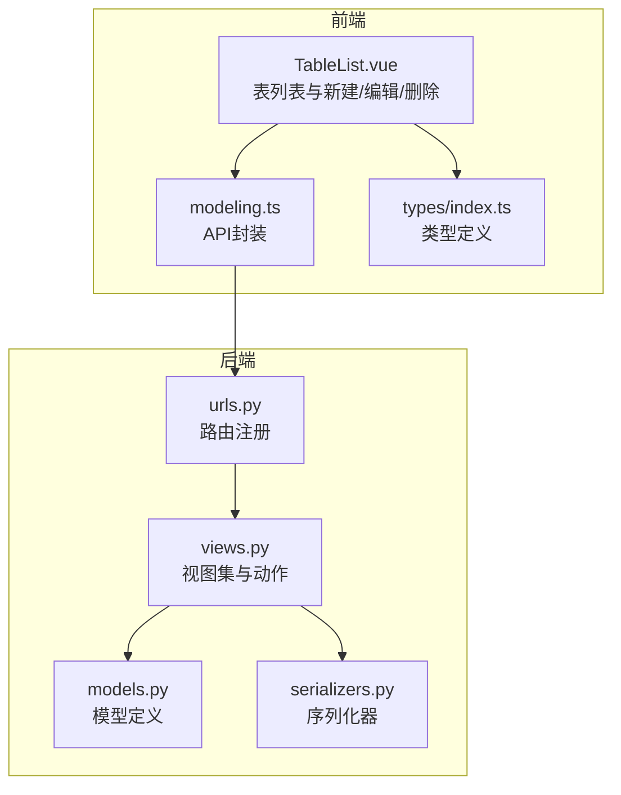
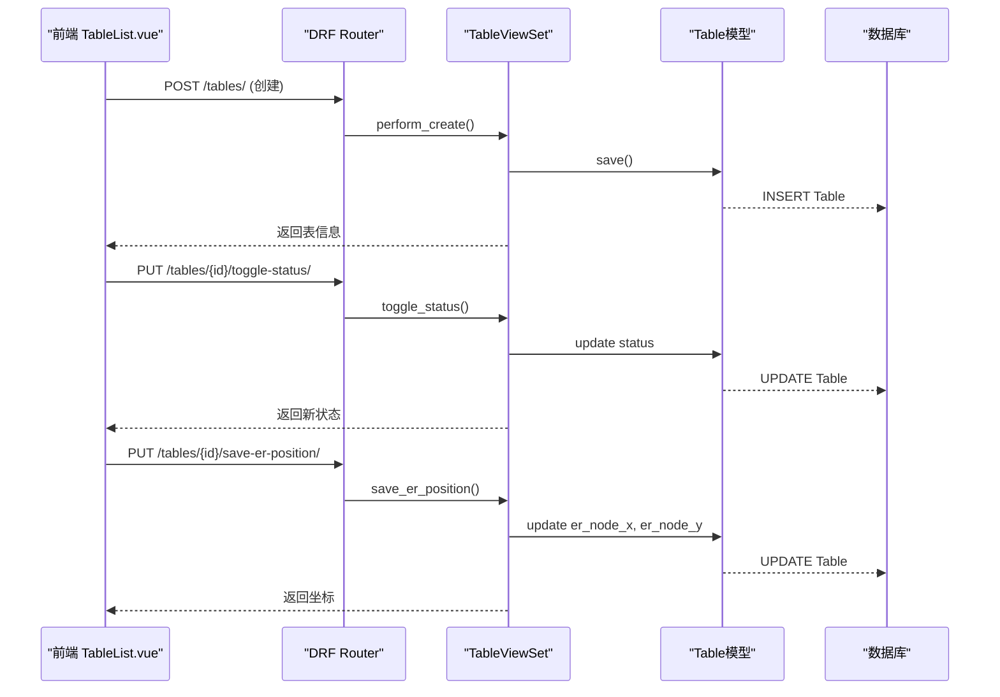
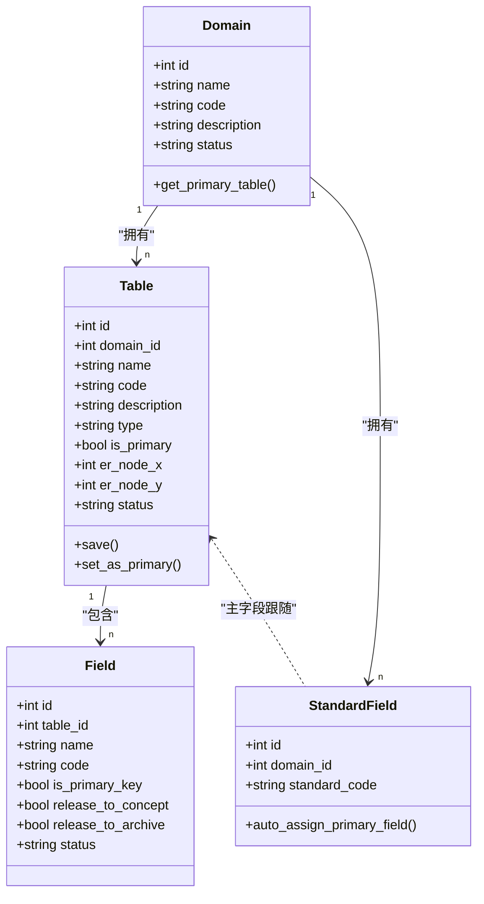
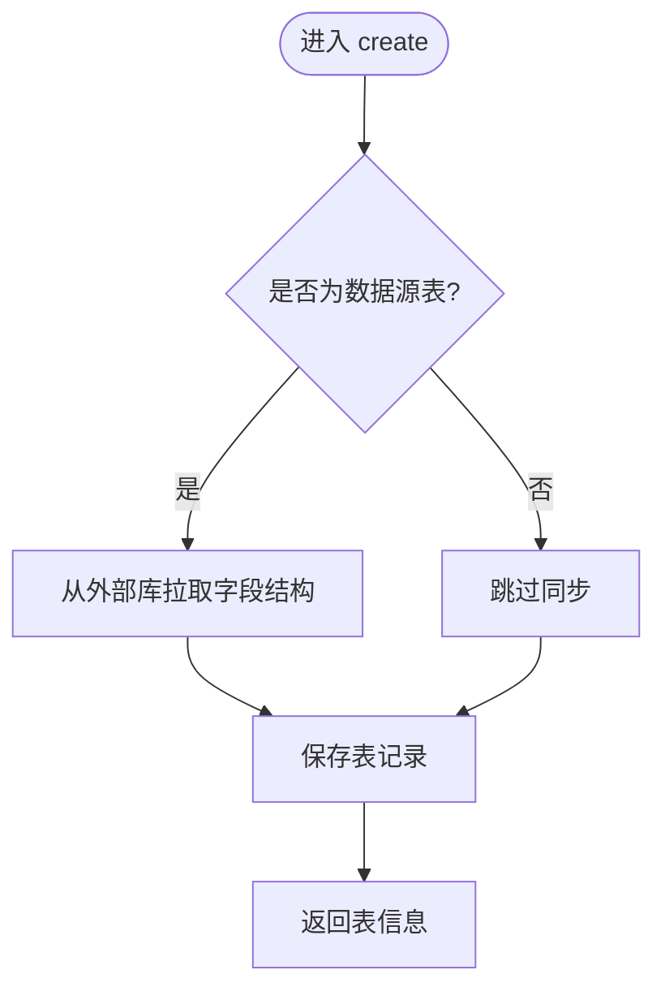
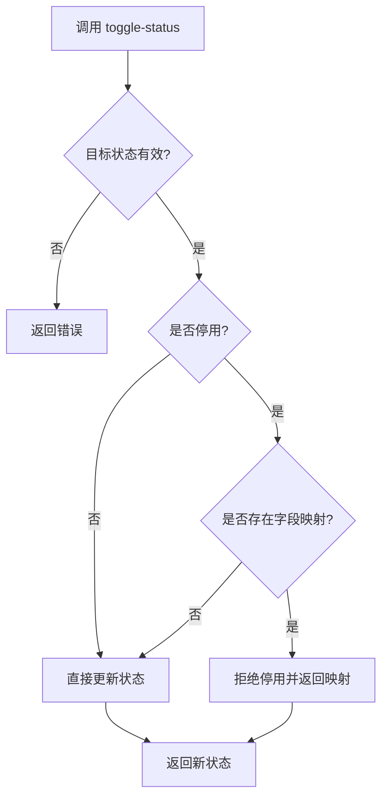
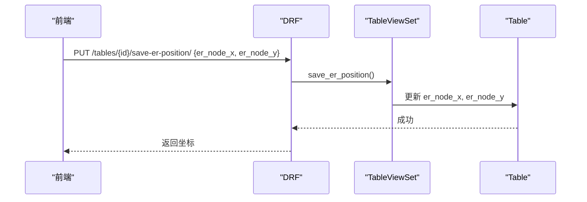
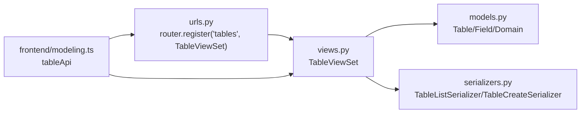

# 基础表管理

<cite>
**本文引用的文件**   
- [models.py](file://backend/apps/modeling/models.py)
- [views.py](file://backend/apps/modeling/views.py)
- [serializers.py](file://backend/apps/modeling/serializers.py)
- [urls.py](file://backend/apps/modeling/urls.py)
- [TableList.vue](file://frontend/src/views/modeling/TableList.vue)
- [modeling.ts](file://frontend/src/api/modeling.ts)
- [index.ts](file://frontend/src/types/index.ts)
- [0012_table_is_primary.py](file://backend/apps/modeling/migrations/0012_table_is_primary.py)
- [0005_table_er_node_x_table_er_node_y.py](file://backend/apps/modeling/migrations/0005_table_er_node_x_table_er_node_y.py)
</cite>

## 目录
1. [简介](#简介)
2. [项目结构](#项目结构)
3. [核心组件](#核心组件)
4. [架构总览](#架构总览)
5. [详细组件分析](#详细组件分析)
6. [依赖关系分析](#依赖关系分析)
7. [性能考量](#性能考量)
8. [故障排查指南](#故障排查指南)
9. [结论](#结论)
10. [附录：API与操作手册](#附录api与操作手册)

## 简介
本文件面向 MetaData002 的“基础表管理”功能，覆盖本地数据表的创建、编辑、删除，以及表基本信息（名称、编码、描述等）的管理；解释表与域的归属关系、is_primary主表标识的作用与影响；说明ER图节点坐标持久化（X/Y坐标保存与恢复）；提供完整的表CRUD API接口文档与前端界面操作指南；并包含表状态管理（启用/废弃）和数据验证规则。

## 项目结构
后端采用 Django + DRF，建模相关能力集中在 apps/modeling 应用内；前端使用 Vue 3 + Ant Design Vue，表管理页面位于 views/modeling/TableList.vue，API 封装在 api/modeling.ts。

图表来源
- [urls.py:1-20](file://backend/apps/modeling/urls.py#L1-L20)
- [views.py:504-916](file://backend/apps/modeling/views.py#L504-L916)
- [models.py:60-123](file://backend/apps/modeling/models.py#L60-L123)
- [serializers.py:34-69](file://backend/apps/modeling/serializers.py#L34-L69)
- [TableList.vue:1-1175](file://frontend/src/views/modeling/TableList.vue#L1-L1175)
- [modeling.ts:49-89](file://frontend/src/api/modeling.ts#L49-L89)
- [index.ts:28-47](file://frontend/src/types/index.ts#L28-L47)

章节来源
- [urls.py:1-20](file://backend/apps/modeling/urls.py#L1-L20)
- [models.py:60-123](file://backend/apps/modeling/models.py#L60-L123)
- [views.py:504-916](file://backend/apps/modeling/views.py#L504-L916)
- [serializers.py:34-69](file://backend/apps/modeling/serializers.py#L34-L69)
- [TableList.vue:1-1175](file://frontend/src/views/modeling/TableList.vue#L1-L1175)
- [modeling.ts:49-89](file://frontend/src/api/modeling.ts#L49-L89)
- [index.ts:28-47](file://frontend/src/types/index.ts#L28-L47)

## 核心组件
- 域 Domain：作为表的归属容器，支持启用/废弃状态，并提供获取主表的方法。
- 表 Table：属于某个域，支持本地表与数据源表两种类型；具备 is_primary 主表标识、ER图坐标持久化字段 er_node_x/er_node_y；支持状态 active/deprecated。
- 字段 Field：表级字段定义，含主键标记、释放到概念层/档案开关、枚举选项等。
- 标准字段 StandardField：跨表去重后的概念层字段，自动同步属性到成员物理字段。
- 序列化器：TableListSerializer、TableCreateSerializer 负责表数据的展示与创建校验。
- 视图集：TableViewSet 提供 CRUD、预览、设置主表、保存ER位置、批量重置ER位置等动作。

章节来源
- [models.py:32-123](file://backend/apps/modeling/models.py#L32-L123)
- [models.py:301-367](file://backend/apps/modeling/models.py#L301-L367)
- [models.py:162-299](file://backend/apps/modeling/models.py#L162-L299)
- [serializers.py:34-69](file://backend/apps/modeling/serializers.py#L34-L69)
- [views.py:504-916](file://backend/apps/modeling/views.py#L504-L916)

## 架构总览
表管理的请求链路：前端调用 tableApi → DRF路由匹配 → TableViewSet 处理 → 模型读写 → 返回结果。ER图坐标通过专用动作保存；数据预览根据表类型选择本地或外部数据库查询。

图表来源
- [views.py:504-916](file://backend/apps/modeling/views.py#L504-L916)
- [models.py:60-123](file://backend/apps/modeling/models.py#L60-L123)
- [modeling.ts:49-89](file://frontend/src/api/modeling.ts#L49-L89)

## 详细组件分析

### 表模型与约束
- 表归属：domain外键关联，unique_together(domain, code)保证域内编码唯一。
- 类型推断：save时若存在data_source则type强制为SOURCE，否则LOCAL。
- 主表标识：is_primary布尔值，set_as_primary方法确保同域仅一个主表，并在切换后自动调整StandardField的主字段。
- ER坐标：er_node_x/er_node_y用于持久化节点位置，支持保存与批量重置。
- 状态：active/deprecated，停用前会检查是否参与字段映射。

图表来源
- [models.py:32-123](file://backend/apps/modeling/models.py#L32-L123)
- [models.py:301-367](file://backend/apps/modeling/models.py#L301-L367)
- [models.py:162-299](file://backend/apps/modeling/models.py#L162-L299)

章节来源
- [models.py:60-123](file://backend/apps/modeling/models.py#L60-L123)
- [models.py:301-367](file://backend/apps/modeling/models.py#L301-L367)
- [models.py:162-299](file://backend/apps/modeling/models.py#L162-L299)

### 表CRUD与扩展动作（后端）
- 列表/详情：支持按domain/type/status过滤，list返回TableListSerializer，retrieve返回TableCreateSerializer。
- 创建：perform_create中若为数据源表且指定external_table_name，将自动从外部库拉取字段结构并创建Field记录。
- 更新：支持部分更新（partial=True），type/data_source等生命周期字段创建后不可改。
- 删除：遵循Django默认行为，级联删除关联字段与映射。
- 预览数据：/preview-data/ 支持本地表与外部数据源表，最多返回limit行。
- 设置主表：/set-primary/ 调用 set_as_primary，确保域内唯一主表并自动校准主字段。
- ER坐标：/save-er-position/ 保存x/y；/batch-reset-er-position/?domain= 批量清空某域坐标。
- Excel导入：/import-excel/ 批量创建本地表及字段；/preview-excel/ 解析列与推断类型。

图表来源
- [views.py:522-659](file://backend/apps/modeling/views.py#L522-L659)
- [views.py:681-688](file://backend/apps/modeling/views.py#L681-L688)
- [views.py:723-805](file://backend/apps/modeling/views.py#L723-L805)
- [views.py:807-884](file://backend/apps/modeling/views.py#L807-L884)
- [views.py:886-916](file://backend/apps/modeling/views.py#L886-L916)

章节来源
- [views.py:504-916](file://backend/apps/modeling/views.py#L504-L916)

### 表状态管理与数据验证
- 状态切换：/toggle-status/ 支持 active/deprecated；停用前检查是否存在字段映射，若有则拒绝并返回映射明细。
- 创建校验：TableCreateSerializer.validate 要求 type=source 时必须提供 data_source。
- 类型推断：save时根据 data_source 的存在性强制 type 值。
- 主表唯一性：set_as_primary 先取消同域其他主表，再设置当前为主表。

图表来源
- [views.py:690-721](file://backend/apps/modeling/views.py#L690-L721)
- [serializers.py:56-69](file://backend/apps/modeling/serializers.py#L56-L69)
- [models.py:102-123](file://backend/apps/modeling/models.py#L102-L123)

章节来源
- [views.py:690-721](file://backend/apps/modeling/views.py#L690-L721)
- [serializers.py:56-69](file://backend/apps/modeling/serializers.py#L56-L69)
- [models.py:102-123](file://backend/apps/modeling/models.py#L102-L123)

### ER图节点坐标持久化
- 保存：/save-er-position/ 接收 x/y 整数，写入 er_node_x/er_node_y。
- 恢复：列表接口返回 er_node_x/er_node_y，前端可在ER图中恢复节点位置。
- 批量重置：/batch-reset-er-position/?domain= 清空某域所有表的坐标。

图表来源
- [views.py:886-910](file://backend/apps/modeling/views.py#L886-L910)
- [0005_table_er_node_x_table_er_node_y.py:1-22](file://backend/apps/modeling/migrations/0005_table_er_node_x_table_er_node_y.py#L1-L22)

章节来源
- [views.py:886-910](file://backend/apps/modeling/views.py#L886-L910)
- [0005_table_er_node_x_table_er_node_y.py:1-22](file://backend/apps/modeling/migrations/0005_table_er_node_x_table_er_node_y.py#L1-L22)

### 前端界面操作指南（TableList.vue）
- 列表展示：显示表名称（中英文）、类型、数据源、字段数、主表标识、主键、状态、创建时间；支持展开查看字段。
- 新建表：
  - 本地表：上传Excel，自动预览列与推断类型，填写编码/中英文名后批量导入。
  - 数据源表：选择数据源→浏览schema→勾选外部表→提交创建，自动拉取字段结构。
- 编辑与删除：点击“字段管理”可编辑注释、设置主键、启停字段；点击“删除”确认删除。
- 主表设置：点击“设为主表”，确认后调用 setPrimary。
- 状态切换：通过开关切换启用/停用，停用失败时提示存在的映射关系。
- 数据预览：在字段管理弹窗的“数据预览”Tab加载数据（本地或外部）。

章节来源
- [TableList.vue:1-1175](file://frontend/src/views/modeling/TableList.vue#L1-L1175)
- [modeling.ts:49-89](file://frontend/src/api/modeling.ts#L49-L89)

## 依赖关系分析
- 路由注册：DefaultRouter 将 /tables 映射到 TableViewSet。
- 视图依赖：TableViewSet 依赖 models.Table、Field、FieldMapping、DataSourceViewSet._ENGINE_MAP 等。
- 序列化器：TableListSerializer/ TableCreateSerializer 控制输出字段与创建校验。
- 前端依赖：tableApi 封装了 list/get/create/update/delete/toggleStatus/saveErPosition/batchResetErPosition/previewData/setPrimary/importExcel/previewExcel 等方法。

图表来源
- [urls.py:1-20](file://backend/apps/modeling/urls.py#L1-L20)
- [views.py:504-916](file://backend/apps/modeling/views.py#L504-L916)
- [serializers.py:34-69](file://backend/apps/modeling/serializers.py#L34-L69)
- [modeling.ts:49-89](file://frontend/src/api/modeling.ts#L49-L89)

章节来源
- [urls.py:1-20](file://backend/apps/modeling/urls.py#L1-L20)
- [views.py:504-916](file://backend/apps/modeling/views.py#L504-L916)
- [serializers.py:34-69](file://backend/apps/modeling/serializers.py#L34-L69)
- [modeling.ts:49-89](file://frontend/src/api/modeling.ts#L49-L89)

## 性能考量
- 列表全量：前端使用 withFullPage(page_size=100000) 避免分页截断，适合小数据集；大数据量建议后端增加分页或按需加载。
- 外部库连接：预览与字段同步动态创建临时连接别名，使用后及时清理，避免连接泄漏。
- 批量操作：Excel导入与字段批量更新使用批量写入减少往返次数。
- ER坐标：保存为简单整数字段，读取开销低。

[本节为通用指导，不直接分析具体文件]

## 故障排查指南
- 停用失败：检查是否存在字段映射关系，需先在关系管理中解除映射。
- 数据源表字段同步失败：查看日志警告，不影响表创建；检查外部库连接参数与权限。
- Excel导入失败：确认configs格式正确、每个文件有code；检查文件内容与类型推断。
- ER坐标未生效：确认保存请求包含 er_node_x/er_node_y 且为整数；必要时批量重置。

章节来源
- [views.py:690-721](file://backend/apps/modeling/views.py#L690-L721)
- [views.py:522-659](file://backend/apps/modeling/views.py#L522-L659)
- [views.py:807-884](file://backend/apps/modeling/views.py#L807-L884)
- [views.py:886-910](file://backend/apps/modeling/views.py#L886-L910)

## 结论
基础表管理以域为边界组织表，支持本地与数据源两类表，具备完整CRUD、状态管理、主表标识与ER坐标持久化能力。前端提供直观的创建、编辑、删除与预览交互，后端通过严格的校验与保护逻辑保障数据一致性。建议在大规模场景下优化列表加载策略，并完善错误提示与回滚机制。

[本节为总结，不直接分析具体文件]

## 附录：API与操作手册

### 表CRUD与扩展API
- 列表：GET /tables/ （支持 domain/type/status 过滤）
- 详情：GET /tables/{id}/
- 创建：POST /tables/ （type=source时需data_source；成功后可能触发字段同步）
- 更新：PUT /tables/{id}/ （支持部分更新，type/data_source创建后不可改）
- 删除：DELETE /tables/{id}/
- 状态切换：PUT /tables/{id}/toggle-status/ （停用前检查字段映射）
- 设置主表：POST /tables/{id}/set-primary/ （域内唯一主表）
- 保存ER坐标：PUT /tables/{id}/save-er-position/ （{er_node_x, er_node_y}）
- 批量重置ER坐标：POST /tables/batch-reset-er-position/?domain={id}
- 数据预览：GET /tables/{id}/preview-data/?limit=N
- Excel预览：POST /tables/preview-excel/ （multipart file）
- Excel导入：POST /tables/import-excel/ （multipart files + configs JSON）

章节来源
- [urls.py:1-20](file://backend/apps/modeling/urls.py#L1-L20)
- [views.py:504-916](file://backend/apps/modeling/views.py#L504-L916)
- [modeling.ts:49-89](file://frontend/src/api/modeling.ts#L49-L89)

### 前端操作要点
- 新建本地表：上传Excel→预览→填写编码/中英文名→导入
- 新建数据源表：选择数据源→选择schema→勾选外部表→提交
- 设置主表：点击“设为主表”并确认
- 设置主键：在字段管理弹窗中点击主键图标，支持联合主键
- 启停字段：在字段管理弹窗中切换“启用/停用”
- 数据预览：切换到“数据预览”Tab加载数据
- 删除表：点击“删除”并确认

章节来源
- [TableList.vue:1-1175](file://frontend/src/views/modeling/TableList.vue#L1-L1175)
- [modeling.ts:49-89](file://frontend/src/api/modeling.ts#L49-L89)