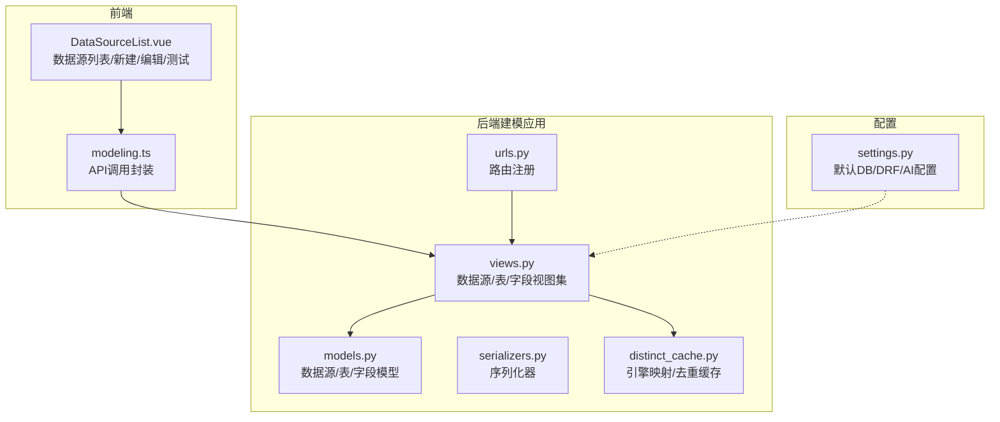
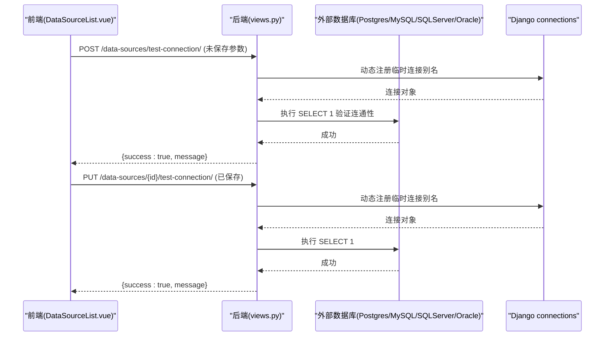
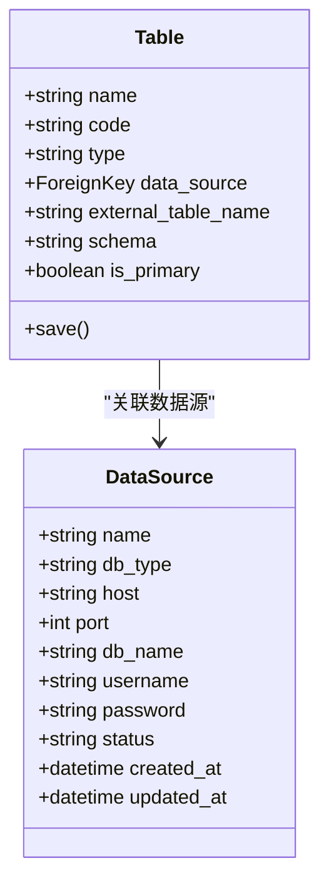
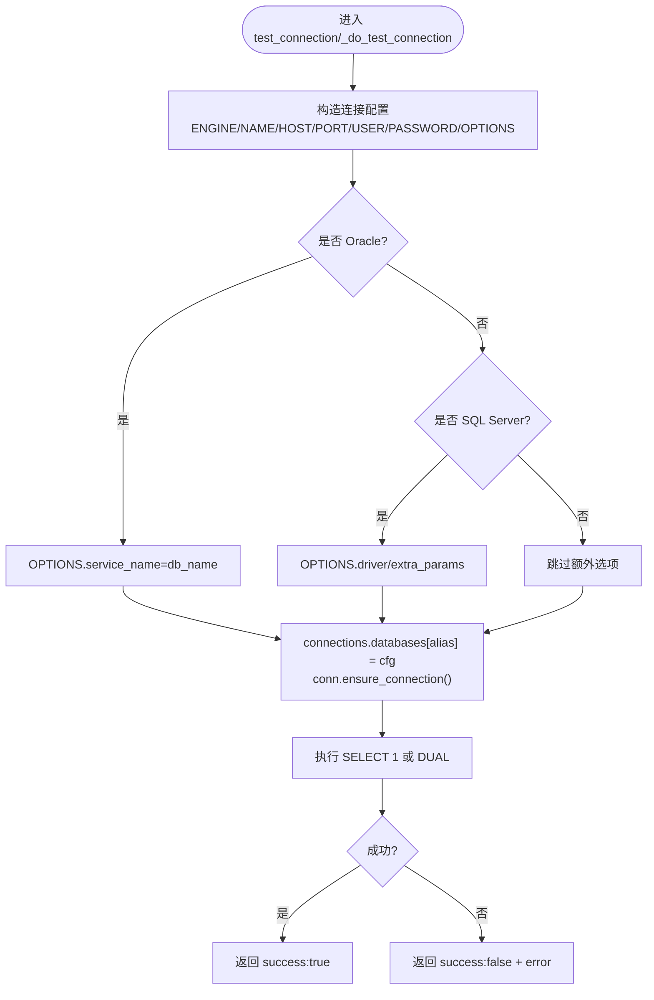
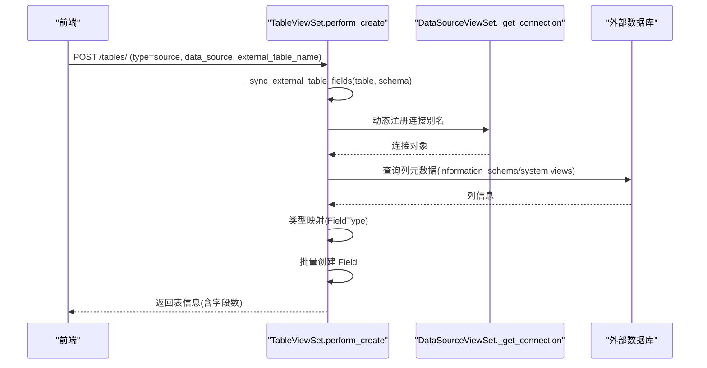
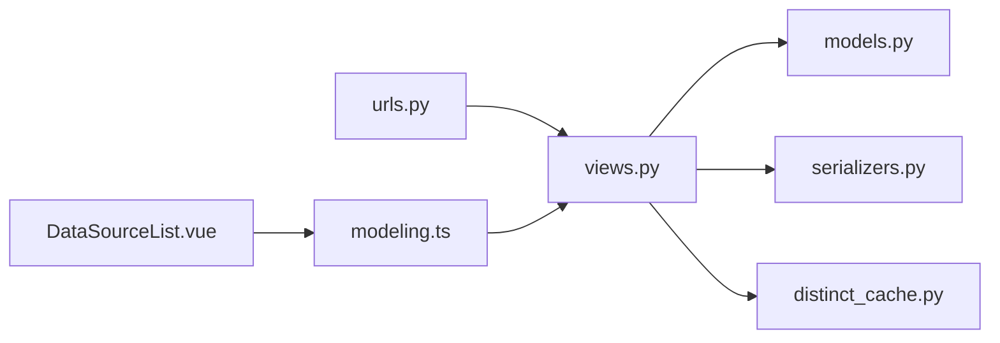

# 数据源管理

<cite>
**本文引用的文件**   
- [models.py](file://backend/apps/modeling/models.py)
- [views.py](file://backend/apps/modeling/views.py)
- [serializers.py](file://backend/apps/modeling/serializers.py)
- [urls.py](file://backend/apps/modeling/urls.py)
- [distinct_cache.py](file://backend/apps/modeling/distinct_cache.py)
- [settings.py](file://backend/config/settings.py)
- [DataSourceList.vue](file://frontend/src/views/settings/DataSourceList.vue)
- [modeling.ts](file://frontend/src/api/modeling.ts)
</cite>

## 目录
1. [简介](#简介)
2. [项目结构](#项目结构)
3. [核心组件](#核心组件)
4. [架构总览](#架构总览)
5. [详细组件分析](#详细组件分析)
6. [依赖关系分析](#依赖关系分析)
7. [性能与连接池](#性能与连接池)
8. [故障排查指南](#故障排查指南)
9. [结论](#结论)
10. [附录：API 接口与前端操作指南](#附录api-接口与前端操作指南)

## 简介
本文件为 MetaData002 的“数据源管理”功能提供全面文档，覆盖多数据源连接机制（PostgreSQL、MySQL、SQL Server、Oracle）、外部表名与 schema 配置、元数据同步、连接测试、状态监控与错误处理，以及完整的 API 接口说明和前端操作指引。同时包含安全配置建议、连接池设置与性能优化要点。

## 项目结构
后端采用 Django + DRF 构建，数据源相关能力集中在 modeling 应用内：
- 模型层：定义 DataSource、Table 等实体，支持外部表名与 schema 字段
- 视图层：实现数据源的增删改查、连接测试、schema/外部表枚举、外部表字段同步与数据预览
- 序列化器：封装数据源与表的输入输出结构
- URL 路由：注册 data-sources、tables 等 RESTful 端点
- 工具模块：统一数据库引擎映射与去重取值缓存

图表来源
- [models.py:1-120](file://backend/apps/modeling/models.py#L1-L120)
- [views.py:31-325](file://backend/apps/modeling/views.py#L31-L325)
- [serializers.py:1-120](file://backend/apps/modeling/serializers.py#L1-L120)
- [urls.py:1-20](file://backend/apps/modeling/urls.py#L1-L20)
- [distinct_cache.py:1-122](file://backend/apps/modeling/distinct_cache.py#L1-L122)
- [settings.py:56-66](file://backend/config/settings.py#L56-L66)

章节来源
- [models.py:1-120](file://backend/apps/modeling/models.py#L1-L120)
- [views.py:31-325](file://backend/apps/modeling/views.py#L31-L325)
- [serializers.py:1-120](file://backend/apps/modeling/serializers.py#L1-L120)
- [urls.py:1-20](file://backend/apps/modeling/urls.py#L1-L20)
- [distinct_cache.py:1-122](file://backend/apps/modeling/distinct_cache.py#L1-L122)
- [settings.py:56-66](file://backend/config/settings.py#L56-L66)

## 核心组件
- 数据源模型 DataSource：存储名称、类型、主机、端口、库名、用户名、密码、状态与时间戳
- 表模型 Table：支持本地表与数据源表；数据源表通过 data_source 外键关联 DataSource，并通过 external_table_name 与 schema 指定外部表定位
- 视图集 DataSourceViewSet：提供 CRUD、连接测试、schema 列表、外部表列表、外部表字段同步、数据预览
- 序列化器 DataSourceSerializer/TableListSerializer：约束字段读写权限与校验
- 引擎映射 ENGINE_MAP：统一 db_type 到 Django 数据库引擎的映射
- 去重缓存 distinct_cache：抽取动态连接与 SQL 方言差异逻辑，供多处复用

章节来源
- [models.py:4-108](file://backend/apps/modeling/models.py#L4-L108)
- [views.py:31-325](file://backend/apps/modeling/views.py#L31-L325)
- [serializers.py:5-69](file://backend/apps/modeling/serializers.py#L5-L69)
- [distinct_cache.py:7-13](file://backend/apps/modeling/distinct_cache.py#L7-L13)

## 架构总览
数据源管理的端到端流程如下：
- 前端在“数据源配置”页面创建/编辑数据源，并触发连接测试
- 后端根据 db_type 动态构造连接参数，使用 Django connections 临时别名建立连接
- 成功连接后返回结果；失败则返回错误信息
- 创建数据源表时，自动从外部数据库拉取表结构与字段元数据，生成 Field 记录
- 后续可预览外部表数据、列出 schema/外部表等

图表来源
- [views.py:74-146](file://backend/apps/modeling/views.py#L74-L146)
- [distinct_cache.py:46-97](file://backend/apps/modeling/distinct_cache.py#L46-L97)

## 详细组件分析

### 数据源模型与表模型
- DataSource：
  - 字段：name、db_type、host、port、db_name、username、password、status、created_at、updated_at
  - db_type 支持 postgresql、mysql、sqlserver、oracle
- Table：
  - type：local/source
  - data_source：外键关联 DataSource
  - external_table_name：外部表名
  - schema：外部数据库模式（如 public、dbo）
  - save() 钩子：当存在 data_source 时强制 type=source，否则 local

图表来源
- [models.py:4-108](file://backend/apps/modeling/models.py#L4-L108)

章节来源
- [models.py:4-108](file://backend/apps/modeling/models.py#L4-L108)

### 数据源视图集（CRUD、连接测试、Schema/外部表枚举）
- CRUD：继承 ModelViewSet，支持搜索与过滤
- 连接测试：
  - test_connection：对已保存的数据源进行连接测试
  - test_connection_params：对未保存的连接参数进行测试
  - _do_test_connection：动态构造连接参数，按 db_type 选择驱动选项，执行简单查询验证
- Schema 列表：list_schemas，按不同数据库方言查询 schema 及可选表数量
- 外部表列表：list_external_tables，按 schema 过滤，支持仅显示有数据的表

图表来源
- [views.py:94-146](file://backend/apps/modeling/views.py#L94-L146)

章节来源
- [views.py:31-325](file://backend/apps/modeling/views.py#L31-L325)

### 外部表字段元数据同步
- 触发时机：创建 Table（type=source）且设置了 external_table_name 时，perform_create 中自动调用 _sync_external_table_fields
- 同步过程：
  - 动态构造连接（同连接测试）
  - 按 db_type 查询 information_schema 或系统视图获取列信息（名称、类型、长度、可空、默认值、注释）
  - 将数据库类型映射为内部 FieldType（number/date/boolean/string）
  - 批量创建 Field 记录，保留排序顺序
- 异常处理：同步失败不影响表创建，仅记录警告日志

图表来源
- [views.py:522-659](file://backend/apps/modeling/views.py#L522-L659)

章节来源
- [views.py:522-659](file://backend/apps/modeling/views.py#L522-L659)

### 数据预览（本地与外部）
- preview_data：根据 table.data_source 判断走本地或外部预览
- 外部预览：按 db_type 拼接 SQL（注意 schema 与表名引用方式），限制行数（默认 100）
- 本地预览：直接查询本地 PostgreSQL

章节来源
- [views.py:723-800](file://backend/apps/modeling/views.py#L723-L800)

### 引擎映射与去重取值缓存
- ENGINE_MAP：统一 db_type 到 Django 引擎字符串
- fetch_distinct_values：按表是否为外部表选择不同连接与 SQL 方言，返回去重样本（限 100）
- ensure_distinct_cache：按需或强制刷新字段的 distinct_values 缓存

章节来源
- [distinct_cache.py:7-13](file://backend/apps/modeling/distinct_cache.py#L7-L13)
- [distinct_cache.py:27-97](file://backend/apps/modeling/distinct_cache.py#L27-L97)
- [distinct_cache.py:100-122](file://backend/apps/modeling/distinct_cache.py#L100-L122)

## 依赖关系分析
- 视图集依赖模型（DataSource、Table、Field）与序列化器
- 视图集依赖 distinct_cache.ENGINE_MAP 与连接工具
- 路由注册将 data-sources、tables 等暴露为 REST 端点
- 前端通过 modeling.ts 调用后端 API，DataSourceList.vue 负责交互

图表来源
- [views.py:1-21](file://backend/apps/modeling/views.py#L1-L21)
- [urls.py:1-20](file://backend/apps/modeling/urls.py#L1-L20)
- [modeling.ts:1-25](file://frontend/src/api/modeling.ts#L1-L25)
- [DataSourceList.vue:1-120](file://frontend/src/views/settings/DataSourceList.vue#L1-L120)

章节来源
- [views.py:1-21](file://backend/apps/modeling/views.py#L1-L21)
- [urls.py:1-20](file://backend/apps/modeling/urls.py#L1-L20)
- [modeling.ts:1-25](file://frontend/src/api/modeling.ts#L1-L25)
- [DataSourceList.vue:1-120](file://frontend/src/views/settings/DataSourceList.vue#L1-L120)

## 性能与连接池
- 当前实现采用请求级动态连接（CONN_MAX_AGE=0），每次测试/查询均新建连接，适合轻量场景
- 如需高并发与长连接，可在 settings.DATABASES 中启用连接池（例如 django-db-connector 或数据库驱动自带连接池），并调整 CONN_MAX_AGE、CONN_HEALTH_CHECKS
- 对外部表元数据同步与数据预览，建议增加超时控制与重试策略，避免阻塞请求
- 对大表预览应限制 limit，避免全量拉取

章节来源
- [settings.py:56-66](file://backend/config/settings.py#L56-L66)
- [views.py:94-146](file://backend/apps/modeling/views.py#L94-L146)
- [distinct_cache.py:46-97](file://backend/apps/modeling/distinct_cache.py#L46-L97)

## 故障排查指南
- 连接失败：检查主机、端口、用户名、密码、数据库名是否正确；Oracle 需确认 service_name；SQL Server 需确认 ODBC 驱动版本
- 权限不足：确保用户具备读取 information_schema 或系统视图的权限
- 外部表不存在：核对 external_table_name 与 schema 是否匹配
- 字段同步失败：查看日志中的警告信息，确认列元数据查询 SQL 是否被数据库方言支持
- 预览失败：确认表名引用格式（PostgreSQL 双引号、SQL Server 方括号、Oracle 双引号）

章节来源
- [views.py:94-146](file://backend/apps/modeling/views.py#L94-L146)
- [views.py:148-324](file://backend/apps/modeling/views.py#L148-L324)
- [views.py:522-659](file://backend/apps/modeling/views.py#L522-L659)

## 结论
MetaData002 的数据源管理实现了跨多种数据库的统一接入与元数据同步，提供了完善的连接测试、schema/外部表枚举、字段结构同步与数据预览能力。通过动态连接与统一的引擎映射，简化了多数据库适配复杂度。建议在生产环境引入连接池与更严格的超时/重试策略，以提升稳定性与性能。

## 附录：API 接口与前端操作指南

### 数据源 API
- 基础 CRUD
  - GET /data-sources/ 列表
  - GET /data-sources/{id}/ 详情
  - POST /data-sources/ 创建
  - PUT /data-sources/{id}/ 更新
  - DELETE /data-sources/{id}/ 删除
- 连接测试
  - GET /data-sources/{id}/test-connection/ 测试已保存数据源
  - POST /data-sources/test-connection/ 测试未保存参数
- Schema 与外部表
  - GET /data-sources/{id}/schemas/?include_counts=true/false
  - GET /data-sources/{id}/external-tables/?schema=&has_data=true/false

章节来源
- [urls.py:1-20](file://backend/apps/modeling/urls.py#L1-L20)
- [views.py:31-325](file://backend/apps/modeling/views.py#L31-L325)
- [modeling.ts:9-25](file://frontend/src/api/modeling.ts#L9-L25)

### 前端操作指南（数据源配置页）
- 新建数据源
  - 填写名称、类型、主机、端口、库名、用户名、密码
  - 点击“测试连接”验证连通性
  - 保存后返回列表
- 编辑数据源
  - 修改必要字段（密码为空表示不更新）
  - 再次测试连接
- 删除数据源
  - 确认后删除，注意已使用该数据源的档案将无法刷新数据

章节来源
- [DataSourceList.vue:1-254](file://frontend/src/views/settings/DataSourceList.vue#L1-L254)
- [modeling.ts:9-25](file://frontend/src/api/modeling.ts#L9-L25)

### 安全配置建议
- 敏感字段：password 字段设置为 write_only，避免回显
- 环境变量：数据库凭据通过环境变量注入，避免硬编码
- 最小权限：为数据源账号授予只读权限，限制对系统视图访问范围
- 传输加密：生产环境启用 HTTPS，数据库连接建议使用 SSL（由驱动/中间件保障）

章节来源
- [serializers.py:5-13](file://backend/apps/modeling/serializers.py#L5-L13)
- [settings.py:56-66](file://backend/config/settings.py#L56-L66)

### 连接池与性能优化建议
- 连接池：在生产部署中启用数据库连接池，减少频繁建连开销
- 超时控制：为外部查询设置合理超时，避免长时间阻塞
- 分页与限制：预览与去重取值限制条数，避免大表拖慢响应
- 缓存：对 schema/外部表列表做短期缓存，降低重复查询压力

章节来源
- [settings.py:56-66](file://backend/config/settings.py#L56-L66)
- [distinct_cache.py:27-97](file://backend/apps/modeling/distinct_cache.py#L27-L97)