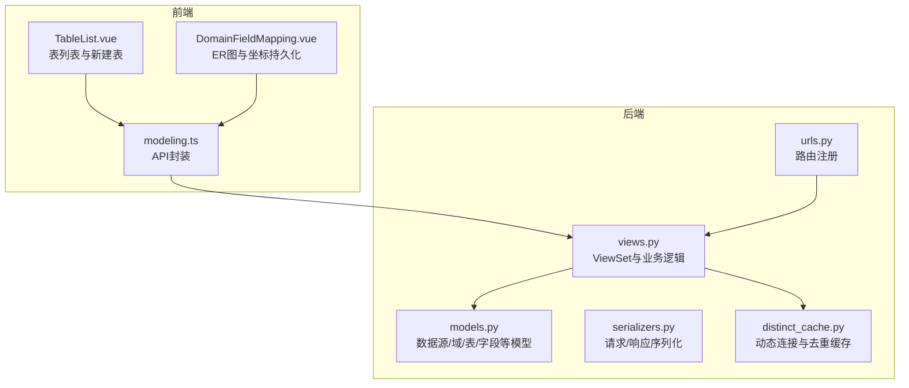
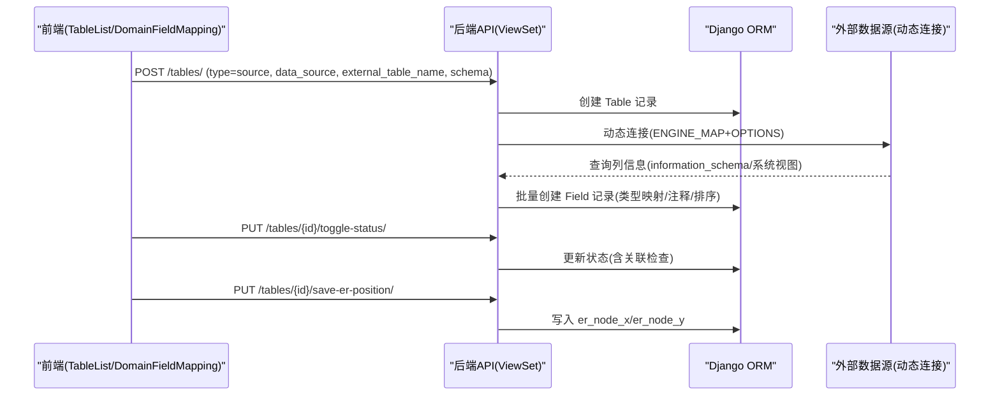
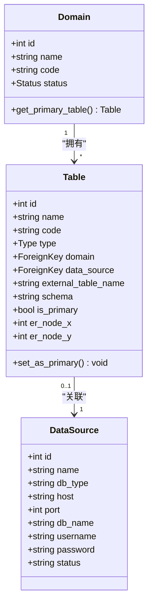
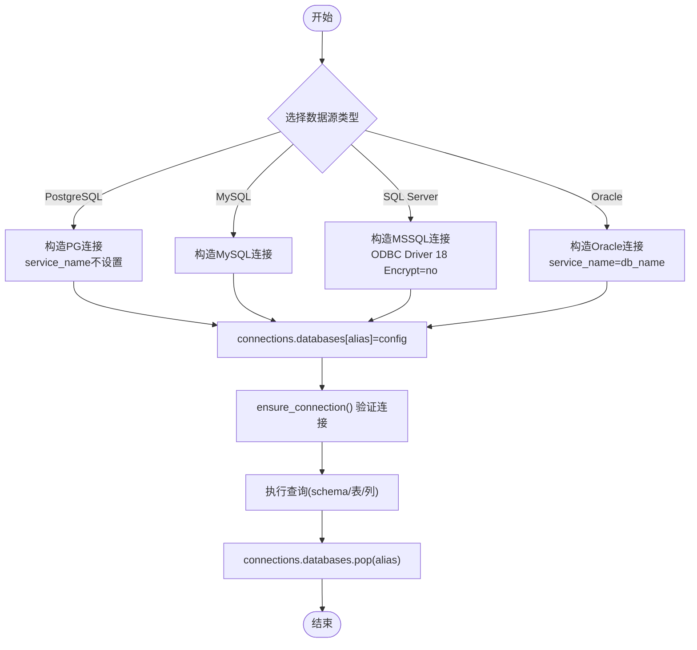
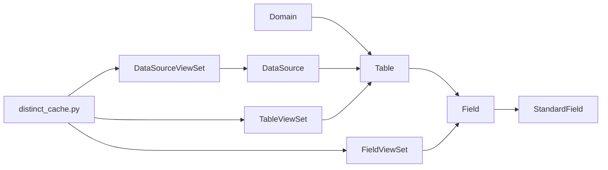

# 表管理

<cite>
**本文引用的文件**   
- [models.py](file://backend/apps/modeling/models.py)
- [views.py](file://backend/apps/modeling/views.py)
- [serializers.py](file://backend/apps/modeling/serializers.py)
- [urls.py](file://backend/apps/modeling/urls.py)
- [distinct_cache.py](file://backend/apps/modeling/distinct_cache.py)
- [modeling.ts](file://frontend/src/api/modeling.ts)
- [TableList.vue](file://frontend/src/views/modeling/TableList.vue)
- [DomainFieldMapping.vue](file://frontend/src/views/modeling/DomainFieldMapping.vue)
</cite>

## 目录
1. [简介](#简介)
2. [项目结构](#项目结构)
3. [核心组件](#核心组件)
4. [架构总览](#架构总览)
5. [详细组件分析](#详细组件分析)
6. [依赖关系分析](#依赖关系分析)
7. [性能考虑](#性能考虑)
8. [故障排查指南](#故障排查指南)
9. [结论](#结论)
10. [附录：表管理API与前端操作指南](#附录表管理api与前端操作指南)

## 简介
本文件面向 MetaData002 的“表管理”能力，系统性说明实体表（Table）的设计理念、类型区分（本地数据表 vs 数据源表）、表与域的归属关系、主表标识的作用与影响；详述多数据源连接机制（PostgreSQL、MySQL、SQL Server、Oracle），外部表名与 schema 的配置方式，以及数据源表的元数据同步机制；同时解释 ER 图节点坐标的持久化功能，并提供完整的表管理 API 接口文档与前端操作指南。

## 项目结构
后端采用 Django + DRF，建模相关模型、序列化器、视图集与路由集中在 apps/modeling 下；前端使用 Vue3 + Ant Design Vue，通过 TypeScript 封装 API 调用，页面以 TableList.vue 为主入口，DomainFieldMapping.vue 承载 ER 图交互。

图表来源
- [models.py:1-120](file://backend/apps/modeling/models.py#L1-L120)
- [views.py:1-120](file://backend/apps/modeling/views.py#L1-L120)
- [serializers.py:1-60](file://backend/apps/modeling/serializers.py#L1-L60)
- [urls.py:1-20](file://backend/apps/modeling/urls.py#L1-L20)
- [distinct_cache.py:1-122](file://backend/apps/modeling/distinct_cache.py#L1-L122)
- [modeling.ts:1-120](file://frontend/src/api/modeling.ts#L1-L120)
- [TableList.vue:1-120](file://frontend/src/views/modeling/TableList.vue#L1-L120)
- [DomainFieldMapping.vue:375-420](file://frontend/src/views/modeling/DomainFieldMapping.vue#L375-L420)

章节来源
- [models.py:1-120](file://backend/apps/modeling/models.py#L1-L120)
- [urls.py:1-20](file://backend/apps/modeling/urls.py#L1-L20)

## 核心组件
- 数据源 DataSource：系统级配置，支持 PostgreSQL、MySQL、SQL Server、Oracle 四类数据库类型，提供动态连接构造与测试连接能力。
- 域 Domain：概念层分组，表归属于域，域可设置主表，用于档案合并基准。
- 表 Table：实体表，分为本地数据表（LOCAL）与数据源表（SOURCE）。本地表由 Excel 导入生成；数据源表指向外部数据库表，支持外部表名与 schema 配置。
- 字段 Field：表级字段定义，支持主键标记、释放到概念层/档案、枚举选项、去重值缓存等。
- 标准字段 StandardField：跨表归并的概念层一等公民，自动同步属性到成员物理字段，维护主字段策略。
- ER 图坐标：Table.er_node_x / er_node_y 持久化，支持批量重置。

章节来源
- [models.py:1-120](file://backend/apps/modeling/models.py#L1-L120)
- [models.py:60-120](file://backend/apps/modeling/models.py#L60-L120)
- [models.py:162-300](file://backend/apps/modeling/models.py#L162-L300)
- [models.py:301-367](file://backend/apps/modeling/models.py#L301-L367)

## 架构总览
表管理涉及“配置-建模-同步-可视化”全链路：
- 配置阶段：创建数据源，校验连接；选择 schema 与外部表；或上传 Excel 构建本地表。
- 建模阶段：在域下创建表，设置主表与主键；为数据源表建立元数据（字段结构、注释、类型映射）。
- 同步阶段：数据源表创建时自动拉取外部表结构，生成 Field 记录；支持刷新去重值缓存。
- 可视化阶段：ER 图中拖拽保存节点坐标，持久化到 Table 记录；支持批量重置布局。

图表来源
- [views.py:522-560](file://backend/apps/modeling/views.py#L522-L560)
- [views.py:536-660](file://backend/apps/modeling/views.py#L536-L660)
- [views.py:886-910](file://backend/apps/modeling/views.py#L886-L910)
- [distinct_cache.py:27-98](file://backend/apps/modeling/distinct_cache.py#L27-L98)

## 详细组件分析

### 实体表 Table 设计与类型区分
- 类型 Type：
  - LOCAL：本地数据表，由 Excel 导入生成，存储在系统默认库中。
  - SOURCE：数据源表，指向外部数据库表，需关联 DataSource，并指定 external_table_name 与 schema。
- 归属关系：
  - 每个表属于一个 Domain，domain.tables 反向关联。
- 主表 is_primary：
  - 同一域内仅允许一个主表；设置主表会清空其他表的主表标记。
  - 主表变更时，自动调整组合字段（StandardField）的主字段分配（人工指定的除外）。
- ER 图坐标：
  - er_node_x / er_node_y 用于持久化 ER 图中的节点位置，支持批量重置。

图表来源
- [models.py:32-58](file://backend/apps/modeling/models.py#L32-L58)
- [models.py:60-120](file://backend/apps/modeling/models.py#L60-L120)
- [models.py:4-30](file://backend/apps/modeling/models.py#L4-L30)

章节来源
- [models.py:60-120](file://backend/apps/modeling/models.py#L60-L120)

### 多数据源连接机制（PostgreSQL、MySQL、SQL Server、Oracle）
- 引擎映射 ENGINE_MAP：统一将 db_type 映射到 Django 数据库引擎。
- 动态连接构造：
  - 根据 db_type 构造连接参数，Oracle 使用 service_name，SQL Server 使用 ODBC Driver 18 with Encrypt=no。
  - 临时 alias 注入 connections.databases，确保连接隔离与清理。
- Schema 与外部表：
  - list_schemas：按数据库类型查询模式列表，可选返回每模式的表数量。
  - list_external_tables：按 schema 列出表名、注释、行数估计，支持 has_data_only 过滤。
- 预览数据：
  - 本地表直接查询；外部表按 db_type 拼接 SQL（TOP/ROWNUM/LIMIT）。

图表来源
- [views.py:40-73](file://backend/apps/modeling/views.py#L40-L73)
- [views.py:148-225](file://backend/apps/modeling/views.py#L148-L225)
- [views.py:226-325](file://backend/apps/modeling/views.py#L226-L325)
- [distinct_cache.py:8-13](file://backend/apps/modeling/distinct_cache.py#L8-L13)

章节来源
- [views.py:40-73](file://backend/apps/modeling/views.py#L40-L73)
- [views.py:148-225](file://backend/apps/modeling/views.py#L148-L225)
- [views.py:226-325](file://backend/apps/modeling/views.py#L226-L325)
- [distinct_cache.py:27-98](file://backend/apps/modeling/distinct_cache.py#L27-L98)

### 外部表名与 schema 配置方式
- 新建数据源表时：
  - 选择已配置的数据源 DataSource。
  - 选择 schema（不同数据库默认值不同：PG=public，MSSQL=dbo，Oracle/MySQL为空）。
  - 选择 external_table_name（外部数据库中的真实表名）。
- 创建成功后：
  - 后端自动从外部数据库读取列信息，映射为 Field 记录（名称、类型、长度、是否可空、注释等）。
  - 若失败仅记录警告，不影响表创建。

章节来源
- [views.py:522-560](file://backend/apps/modeling/views.py#L522-L560)
- [views.py:536-660](file://backend/apps/modeling/views.py#L536-L660)

### 数据源表的元数据同步机制
- 触发时机：创建 Table（type=SOURCE）且存在 data_source 与 external_table_name 时。
- 同步流程：
  - 动态连接外部数据库。
  - 按 db_type 查询列元数据（information_schema 或系统视图）。
  - 将列信息映射为 Field.FieldType（数字/日期/布尔/字符串）。
  - 批量创建 Field 记录，包含 sort_order、required、comment 等。
- 刷新去重值缓存：
  - refresh_distinct：强制刷新域下 active 字段的 distinct_values 缓存。
  - load-sample-values：单个字段刷新并返回前10条样本值。

章节来源
- [views.py:536-660](file://backend/apps/modeling/views.py#L536-L660)
- [views.py:1420-1442](file://backend/apps/modeling/views.py#L1420-L1442)
- [distinct_cache.py:100-122](file://backend/apps/modeling/distinct_cache.py#L100-L122)

### ER 图节点坐标的持久化
- 存储字段：Table.er_node_x / er_node_y。
- 保存接口：PUT /tables/{id}/save-er-position/，请求体包含 x、y 整数坐标。
- 批量重置：POST /tables/batch-reset-er-position/?domain={domainId}，清空某域下所有表的坐标。
- 前端实现：
  - DomainFieldMapping.vue 监听节点 change:position，调用 saveErPosition 接口。
  - 加载 ER 图时优先读取已保存坐标，若无则按布局算法计算初始位置。

章节来源
- [views.py:886-910](file://backend/apps/modeling/views.py#L886-L910)
- [DomainFieldMapping.vue:385-393](file://frontend/src/views/modeling/DomainFieldMapping.vue#L385-L393)

### 主表标识的作用与影响
- 唯一性：同一域内仅允许一个主表；设置新主表会取消旧主表标记。
- 主字段自动分配：
  - StandardField.primary_field 自动跟随主表成员变化（人工指定除外）。
  - set_as_primary 方法会遍历未人工指定的主字段，切换到新主表的有效成员。
- 启用域时的前置检查：
  - P0 检查包括：有主表、主表有主键、字段编码非空、标准字段编码唯一性等。

章节来源
- [models.py:110-123](file://backend/apps/modeling/models.py#L110-L123)
- [views.py:327-428](file://backend/apps/modeling/views.py#L327-L428)

## 依赖关系分析
- 模型依赖：
  - Table 依赖 Domain 与 DataSource。
  - Field 依赖 Table，可选依赖 FieldGroup 与 StandardField。
  - StandardField 聚合多个 Field 成员，维护主字段策略。
- 视图依赖：
  - DataSourceViewSet 提供连接测试、schema/表列举、外部表元数据同步。
  - TableViewSet 提供 CRUD、状态切换、数据预览、ER 坐标保存、Excel 导入。
  - FieldViewSet 提供批量更新、AI 语义识别、去重检测、归档预览等。
- 工具模块：
  - distinct_cache.py 提供 ENGINE_MAP、fetch_distinct_values、ensure_distinct_cache，被 views 与 computed_service 共用。

图表来源
- [models.py:4-30](file://backend/apps/modeling/models.py#L4-L30)
- [models.py:32-58](file://backend/apps/modeling/models.py#L32-L58)
- [models.py:60-120](file://backend/apps/modeling/models.py#L60-L120)
- [models.py:301-367](file://backend/apps/modeling/models.py#L301-L367)
- [models.py:162-300](file://backend/apps/modeling/models.py#L162-L300)
- [distinct_cache.py:1-122](file://backend/apps/modeling/distinct_cache.py#L1-L122)

章节来源
- [models.py:4-30](file://backend/apps/modeling/models.py#L4-L30)
- [distinct_cache.py:1-122](file://backend/apps/modeling/distinct_cache.py#L1-L122)

## 性能考虑
- 动态连接复用：每次操作使用临时 alias 连接，避免全局污染；连接后立即清理。
- 去重值缓存：distinct_values 缓存减少重复查询，按需刷新（force=False/True）。
- 批量操作：字段属性批量更新、Excel 批量导入，降低往返次数。
- 分页与全量：前端管理类列表使用大 page_size 一次性拉取，避免多次分页请求。

[本节为通用指导，不直接分析具体文件]

## 故障排查指南
- 连接失败：
  - 检查 db_type 是否在 ENGINE_MAP 中。
  - Oracle 需正确设置 service_name；SQL Server 需安装 ODBC Driver 18。
  - 使用 test-connection 接口验证。
- 元数据同步失败：
  - 确认 external_table_name 与 schema 正确。
  - 查看日志警告，不影响表创建但字段缺失。
- 停用表失败：
  - 若表参与字段映射，需先解除映射关系。
- ER 坐标未保存：
  - 检查前端是否正确调用 save-er-position，坐标是否为整数。

章节来源
- [views.py:74-147](file://backend/apps/modeling/views.py#L74-L147)
- [views.py:690-722](file://backend/apps/modeling/views.py#L690-L722)
- [views.py:886-910](file://backend/apps/modeling/views.py#L886-L910)

## 结论
MetaData002 的表管理以“域-表-字段”为核心，通过数据源抽象支持多数据库类型，结合 Excel 导入与外部表元数据同步，形成统一的建模体系。主表与主字段策略保障档案合并一致性，ER 图坐标持久化提升可视化体验。API 设计遵循 RESTful 规范，前端封装清晰，便于扩展与维护。

[本节为总结，不直接分析具体文件]

## 附录：表管理API与前端操作指南

### 数据源 API
- GET /data-sources/：列表
- POST /data-sources/：新增
- PUT /data-sources/{id}/：更新
- DELETE /data-sources/{id}/：删除
- GET /data-sources/{id}/test-connection/：测试连接
- POST /data-sources/test-connection/：测试未保存的连接参数
- GET /data-sources/{id}/schemas/?include_counts=true/false：列出 schema
- GET /data-sources/{id}/external-tables/?schema=&has_data=true/false：列出外部表

章节来源
- [views.py:31-147](file://backend/apps/modeling/views.py#L31-L147)
- [views.py:148-225](file://backend/apps/modeling/views.py#L148-L225)
- [views.py:226-325](file://backend/apps/modeling/views.py#L226-L325)
- [modeling.ts:9-25](file://frontend/src/api/modeling.ts#L9-L25)

### 表 API
- GET /tables/：列表（支持 domain/type/status 过滤）
- POST /tables/：创建（type=local/source，source 需 data_source）
- PUT /tables/{id}/：更新（部分更新）
- DELETE /tables/{id}/：删除
- PUT /tables/{id}/toggle-status/：切换启用/停用（含映射检查）
- GET /tables/{id}/preview-data/?limit=100：数据预览（本地/外部）
- PUT /tables/{id}/save-er-position/：保存 ER 坐标
- POST /tables/batch-reset-er-position/?domain={id}：批量重置坐标
- POST /tables/preview-excel/：预览 Excel
- POST /tables/import-excel/：批量导入 Excel

章节来源
- [views.py:504-917](file://backend/apps/modeling/views.py#L504-L917)
- [modeling.ts:49-89](file://frontend/src/api/modeling.ts#L49-L89)

### 前端操作指南
- 新建本地表：
  - 选择“本地数据表”，上传 Excel，配置编码/中英文名称，预览字段类型后导入。
- 新建数据源表：
  - 选择“数据源表”，选择已配置的数据源，选择 schema 与外部表，确认后自动同步字段。
- 设置主表与主键：
  - 在表列表点击“设为主表”；在字段管理中点击主键图标设置单键或联合主键。
- 数据预览：
  - 打开字段管理弹窗，切换到“数据预览”Tab，支持显示中文名。
- ER 图坐标：
  - 在关系管理页面拖拽表节点，坐标自动保存；支持批量重置布局。

章节来源
- [TableList.vue:204-389](file://frontend/src/views/modeling/TableList.vue#L204-L389)
- [TableList.vue:648-692](file://frontend/src/views/modeling/TableList.vue#L648-L692)
- [DomainFieldMapping.vue:385-393](file://frontend/src/views/modeling/DomainFieldMapping.vue#L385-L393)