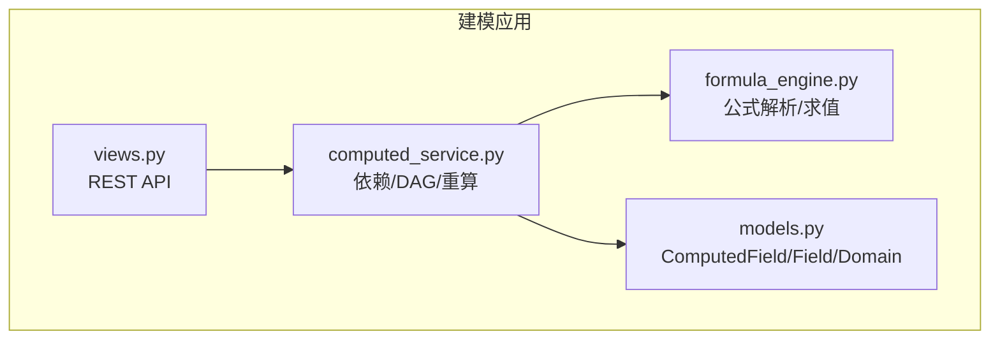
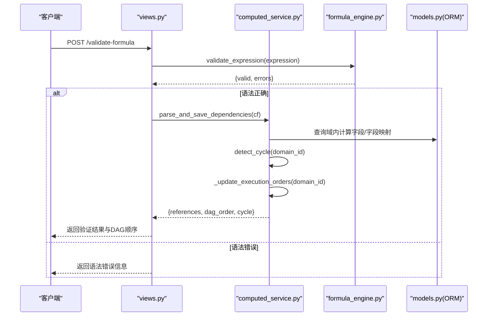
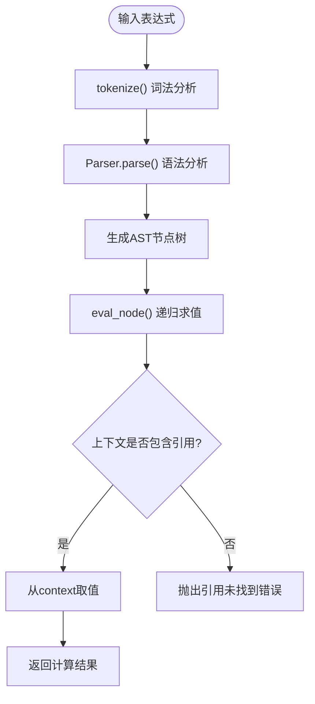
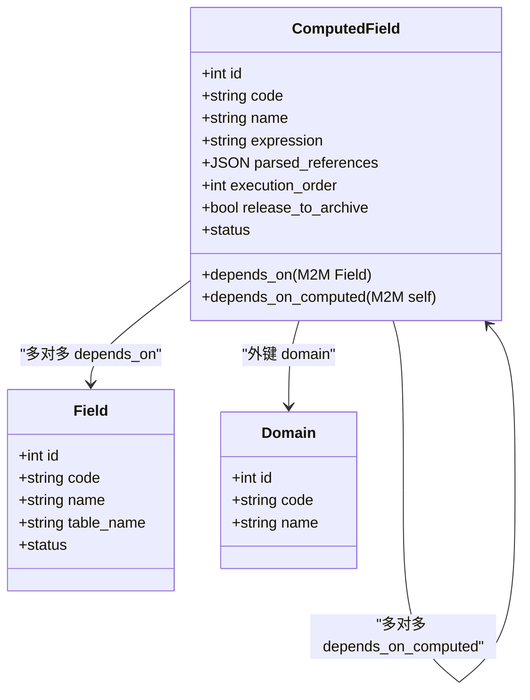
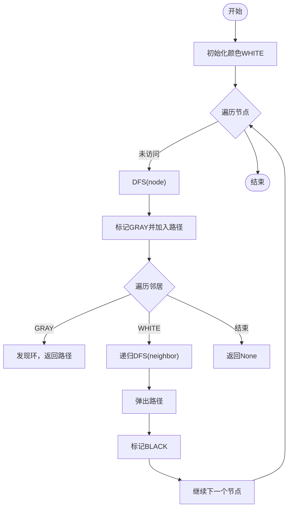
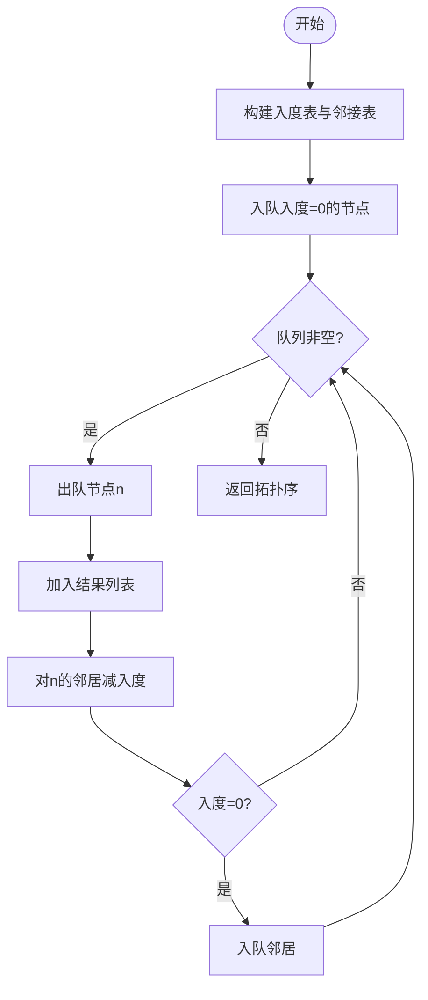
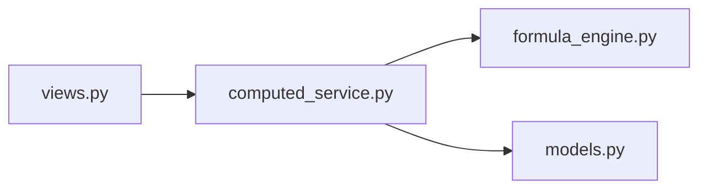

# DAG依赖解析

<cite>
**本文引用的文件**   
- [formula_engine.py](file://backend/apps/modeling/formula_engine.py)
- [computed_service.py](file://backend/apps/modeling/computed_service.py)
- [models.py](file://backend/apps/modeling/models.py)
- [views.py](file://backend/apps/modeling/views.py)
</cite>

## 目录
1. [简介](#简介)
2. [项目结构](#项目结构)
3. [核心组件](#核心组件)
4. [架构总览](#架构总览)
5. [详细组件分析](#详细组件分析)
6. [依赖关系分析](#依赖关系分析)
7. [性能考虑](#性能考虑)
8. [故障排查指南](#故障排查指南)
9. [结论](#结论)
10. [附录：API使用与示例](#附录api使用与示例)

## 简介
本技术文档围绕 MetaData002 计算引擎的“DAG依赖解析系统”展开，聚焦以下目标：
- 解释有向无环图（DAG）在计算字段依赖管理中的应用
- 说明从公式表达式中提取字段引用并构建依赖图的算法
- 详述循环依赖检测机制（深度优先搜索）与解决方案
- 阐述基于DAG的计算执行顺序优化（拓扑排序），以及并行计算的可能性与调优策略
- 提供依赖分析相关API的使用方法与故障排查指南

该能力由“公式引擎 + 计算服务 + 数据模型 + API视图”四层协同实现：公式引擎负责表达式词法/语法解析与求值；计算服务负责依赖解析、DAG构建、循环检测、拓扑排序与重算调度；数据模型承载计算字段及其依赖关系；API视图暴露依赖分析与试算接口。

## 项目结构
与DAG依赖解析直接相关的代码集中在 modeling 应用内：
- formula_engine.py：Excel风格公式解析器、函数库、求值器、引用提取
- computed_service.py：依赖解析、DAG构建、循环检测、拓扑排序、批量重算、枚举试算
- models.py：计算字段模型 ComputedField 及关联字段 Field、Domain 等
- views.py：REST API 暴露依赖验证、预览、DAG图、批量重算等能力

图表来源
- [formula_engine.py:1-120](file://backend/apps/modeling/formula_engine.py#L1-L120)
- [computed_service.py:1-120](file://backend/apps/modeling/computed_service.py#L1-L120)
- [models.py:421-472](file://backend/apps/modeling/models.py#L421-L472)
- [views.py:1931-2096](file://backend/apps/modeling/views.py#L1931-L2096)

章节来源
- [formula_engine.py:1-120](file://backend/apps/modeling/formula_engine.py#L1-L120)
- [computed_service.py:1-120](file://backend/apps/modeling/computed_service.py#L1-L120)
- [models.py:421-472](file://backend/apps/modeling/models.py#L421-L472)
- [views.py:1931-2096](file://backend/apps/modeling/views.py#L1931-L2096)

## 核心组件
- 公式引擎（formula_engine.py）
  - 引用提取：正则匹配 {表名.字段名} 形式的字段引用
  - 词法分析：tokenize() 将表达式拆分为 Token 流
  - 语法分析：递归下降 Parser 生成 AST
  - 求值器：eval_node() 遍历AST并结合上下文求值
  - 错误类型：FormulaError 及其子类（语法错误、引用未找到、运行时错误、循环依赖异常）
- 计算服务（computed_service.py）
  - parse_and_save_dependencies()：解析表达式、更新 M2M 依赖、检测循环、重算执行顺序
  - build_dag()：构建域内所有计算字段的节点、边与拓扑序
  - detect_cycle()：DFS三色标记法检测环，返回环路径
  - _topological_sort()：Kahn算法BFS拓扑排序
  - batch_recalculate()/recalculate_affected()：按DAG顺序批量或增量重算
  - trial_calculate()/preview_expression()：参数空间枚举与免实例预览
- 数据模型（models.py）
  - ComputedField：包含 expression、depends_on（物理字段）、depends_on_computed（计算字段）、parsed_references、execution_order 等
  - Field/Domain：基础实体，支撑字段映射与域级范围
- API视图（views.py）
  - validate-expression：纯语法验证
  - validate-formula：语法+依赖+循环检测
  - dependency-graph：返回完整DAG图
  - preview-data：免实例数据预览
  - trial-calculate：枚举试算
  - batch-recalculate：触发批量重算

章节来源
- [formula_engine.py:1-120](file://backend/apps/modeling/formula_engine.py#L1-L120)
- [computed_service.py:21-208](file://backend/apps/modeling/computed_service.py#L21-L208)
- [models.py:421-472](file://backend/apps/modeling/models.py#L421-L472)
- [views.py:1931-2096](file://backend/apps/modeling/views.py#L1931-L2096)

## 架构总览
下图展示从用户请求到DAG构建与执行的端到端流程：

图表来源
- [views.py:1958-2010](file://backend/apps/modeling/views.py#L1958-L2010)
- [computed_service.py:21-84](file://backend/apps/modeling/computed_service.py#L21-L84)
- [formula_engine.py:798-800](file://backend/apps/modeling/formula_engine.py#L798-L800)

## 详细组件分析

### 公式引擎：表达式解析与引用提取
- 引用提取
  - 通过正则匹配 {表名.字段名}，输出 [{"table_name":"...","field_code":"..."}]
  - 用于后续区分物理字段与计算字段依赖
- 词法/语法/求值
  - tokenize() 支持数字、字符串、布尔、括号、运算符、函数调用、字段引用
  - Parser 递归下降，优先级：比较→加减拼接→乘除→一元→原子
  - eval_node() 结合上下文 {"表名.字段名": 值} 求值，支持 IFERROR 惰性求值
- 错误处理
  - FormulaSyntaxError、FormulaReferenceError、FormulaRuntimeError、CircularDependencyError

图表来源
- [formula_engine.py:99-197](file://backend/apps/modeling/formula_engine.py#L99-L197)
- [formula_engine.py:253-366](file://backend/apps/modeling/formula_engine.py#L253-L366)
- [formula_engine.py:669-768](file://backend/apps/modeling/formula_engine.py#L669-L768)

章节来源
- [formula_engine.py:58-64](file://backend/apps/modeling/formula_engine.py#L58-L64)
- [formula_engine.py:99-197](file://backend/apps/modeling/formula_engine.py#L99-L197)
- [formula_engine.py:253-366](file://backend/apps/modeling/formula_engine.py#L253-L366)
- [formula_engine.py:669-768](file://backend/apps/modeling/formula_engine.py#L669-L768)

### 计算服务：依赖解析、DAG构建与循环检测
- 依赖解析
  - parse_and_save_dependencies() 解析表达式中的引用，区分物理字段与计算字段，写入 M2M 关系
  - 保存 parsed_references 以便后续快速定位依赖
- 循环检测
  - detect_cycle() 使用 DFS 三色标记（白/灰/黑）检测环，返回环路径（如 ["A","B","C","A"]）
- 拓扑排序
  - _topological_sort() 使用 Kahn 算法（BFS）计算执行顺序，避免环时返回完整拓扑序
- 执行顺序更新
  - _update_execution_orders() 批量更新 execution_order，供批量重算使用
- 重算调度
  - batch_recalculate() 按 execution_order 顺序对每条记录逐字段求值，并将结果注入 context 供后续字段引用
  - recalculate_affected() 根据变更字段反向传播受影响计算字段，仅重算必要部分

图表来源
- [models.py:421-472](file://backend/apps/modeling/models.py#L421-L472)

章节来源
- [computed_service.py:21-84](file://backend/apps/modeling/computed_service.py#L21-L84)
- [computed_service.py:110-161](file://backend/apps/modeling/computed_service.py#L110-L161)
- [computed_service.py:164-207](file://backend/apps/modeling/computed_service.py#L164-L207)
- [computed_service.py:215-329](file://backend/apps/modeling/computed_service.py#L215-L329)

### 循环依赖检测算法（DFS三色标记）
- 颜色状态
  - WHITE（未访问）、GRAY（正在访问）、BLACK（已访问完成）
- 过程
  - 对每个未访问节点启动DFS，进入时置为GRAY，回溯时置为BLACK
  - 若遇到GRAY邻居，说明存在回边，即环；截取当前路径得到环序列
- 复杂度
  - 时间 O(V+E)，空间 O(V)（递归栈与颜色数组）

图表来源
- [computed_service.py:110-161](file://backend/apps/modeling/computed_service.py#L110-L161)

章节来源
- [computed_service.py:110-161](file://backend/apps/modeling/computed_service.py#L110-L161)

### 拓扑排序与执行顺序优化
- Kahn算法（BFS）
  - 构建入度表与邻接表
  - 初始将所有入度为0的节点入队
  - 出队节点加入结果，减少其邻居入度，若为0则入队
- 执行顺序
  - 结果即为DAG的执行顺序，保证依赖先于被依赖者执行
  - 批量更新 execution_order 字段，便于后续按序重算

图表来源
- [computed_service.py:164-192](file://backend/apps/modeling/computed_service.py#L164-L192)

章节来源
- [computed_service.py:164-192](file://backend/apps/modeling/computed_service.py#L164-L192)

### 依赖图存储结构与查询优化
- 存储结构
  - ComputedField.depends_on：多对多指向 Field（物理字段）
  - ComputedField.depends_on_computed：多对多自引用（计算字段间依赖）
  - ComputedField.parsed_references：JSON缓存解析后的引用列表
  - ComputedField.execution_order：整数位次，表示拓扑序位置
- 查询优化
  - 使用 prefetch_related('depends_on_computed') 减少N+1查询
  - values_list('id', flat=True) 高效获取依赖ID集合
  - 批量 update(execution_order=order) 降低数据库写放大

章节来源
- [computed_service.py:120-130](file://backend/apps/modeling/computed_service.py#L120-L130)
- [computed_service.py:195-207](file://backend/apps/modeling/computed_service.py#L195-L207)
- [models.py:442-458](file://backend/apps/modeling/models.py#L442-L458)

### 基于DAG的计算执行顺序与并行可能性
- 串行执行
  - 按 execution_order 依次计算，确保依赖可用
  - 将计算结果注入 context["$computed.{code}"] 供后续字段引用
- 并行潜力
  - 同一拓扑层（入度归零同时入队的节点）可并行计算
  - 需要引入任务队列/线程池，注意共享上下文与锁
  - 当前实现为串行，便于调试与一致性保障

章节来源
- [computed_service.py:215-277](file://backend/apps/modeling/computed_service.py#L215-L277)

## 依赖关系分析
- 模块耦合
  - views.py 依赖 computed_service.py 暴露API
  - computed_service.py 依赖 formula_engine.py 进行表达式验证与求值
  - computed_service.py 依赖 models.py 读取/写入计算字段与依赖关系
- 外部依赖
  - Django ORM（prefetch_related、values_list、bulk update）
  - 标准库 collections（defaultdict、deque）
  - 标准库 itertools、random（组合采样）

图表来源
- [views.py:1931-2096](file://backend/apps/modeling/views.py#L1931-L2096)
- [computed_service.py:1-14](file://backend/apps/modeling/computed_service.py#L1-L14)

章节来源
- [views.py:1931-2096](file://backend/apps/modeling/views.py#L1931-L2096)
- [computed_service.py:1-14](file://backend/apps/modeling/computed_service.py#L1-L14)

## 性能考虑
- 表达式解析
  - 词法/语法分析为线性扫描，AST求值为递归遍历，整体O(n)
- 依赖解析
  - 正则提取引用O(n)，M2M设置与去重O(k)
- 循环检测
  - DFS O(V+E)，V为计算字段数，E为依赖边数
- 拓扑排序
  - Kahn算法 O(V+E)
- 批量重算
  - 记录数R × 计算字段数F，每次求值O(expr_len)
  - 建议：限制最大组合数、按需增量重算、缓存中间结果
- 并行化建议
  - 按拓扑层并发执行，控制并发度与内存占用
  - 使用线程池或异步任务框架（如Celery）

[本节为通用指导，不直接分析具体文件]

## 故障排查指南
- 常见错误类型
  - 语法错误：validate_expression 返回 valid=False，检查表达式格式与函数参数数量
  - 字段引用未找到：eval_node 抛 FormulaReferenceError，确认上下文中是否存在对应字段
  - 运行时错误：除零、类型不匹配等，检查数值转换与函数约束
  - 循环依赖：detect_cycle 返回环路径，需调整依赖关系消除环
- 定位步骤
  - 使用 validate-expression 快速校验语法
  - 使用 validate-formula 进行依赖与循环检测
  - 使用 dependency-graph 查看完整DAG图
  - 使用 preview-data 与 trial-calculate 进行参数空间试算
- 日志与调试
  - 捕获 FormulaError 子类，打印堆栈与上下文
  - 关注 parsed_references 是否正确解析
  - 检查 execution_order 是否符合预期

章节来源
- [formula_engine.py:23-52](file://backend/apps/modeling/formula_engine.py#L23-L52)
- [formula_engine.py:798-800](file://backend/apps/modeling/formula_engine.py#L798-L800)
- [computed_service.py:110-161](file://backend/apps/modeling/computed_service.py#L110-L161)
- [views.py:1931-2010](file://backend/apps/modeling/views.py#L1931-L2010)

## 结论
MetaData002 的DAG依赖解析系统以公式引擎为基础，通过计算服务实现依赖解析、循环检测与拓扑排序，配合数据模型与API视图形成完整的计算字段管理与执行体系。该方案具备清晰的职责划分、良好的可扩展性与较强的可观测性，适合复杂主数据场景下的字段推导与批量重算需求。未来可在并行执行、缓存优化与增量重算方面进一步演进。

[本节为总结性内容，不直接分析具体文件]

## 附录：API使用与示例
- 验证表达式（无需实例）
  - 方法：POST /validate-expression
  - 请求体：{"expression": "...", "domain": X}
  - 返回：{"valid": bool, "references": [...], "errors": [...]}
- 验证公式（含依赖与循环检测）
  - 方法：POST /validate-formula/{pk}
  - 请求体：{"expression": "..."}（可选，不传则使用当前保存的表达式）
  - 返回：{"valid": bool, "references": [...], "cycle": None|[...], "errors": [...], "dag_order": [...]}
- 依赖图
  - 方法：GET /dependency-graph?domain=X
  - 返回：{"nodes": [...], "edges": [...], "topo_order": [...]}
- 数据预览（免实例）
  - 方法：POST /preview-data
  - 请求体：{"expression": "...", "domain": X, "max_combinations": N}
  - 返回：{"valid": bool, "errors": [...], "columns": [...], "rows": [...], "total_possible": N, "truncated": bool}
- 枚举试算
  - 方法：POST /trial-calculate/{pk}
  - 请求体：{"params": {"表名.字段名": [值1,值2,...]}, "auto_enumerate": bool, "max_combinations": N}
  - 返回：{"combinations": [...], "total_possible": N, "truncated": bool}
- 批量重算
  - 方法：POST /batch-recalculate
  - 请求体：{"domain": X}
  - 返回：{"total": N, "success": M, "errors": [...], "records_updated": K}

章节来源
- [views.py:1931-2096](file://backend/apps/modeling/views.py#L1931-L2096)