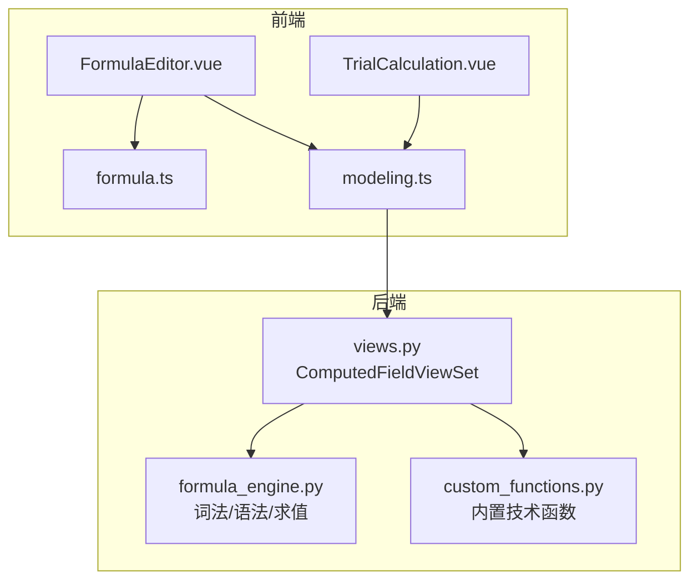
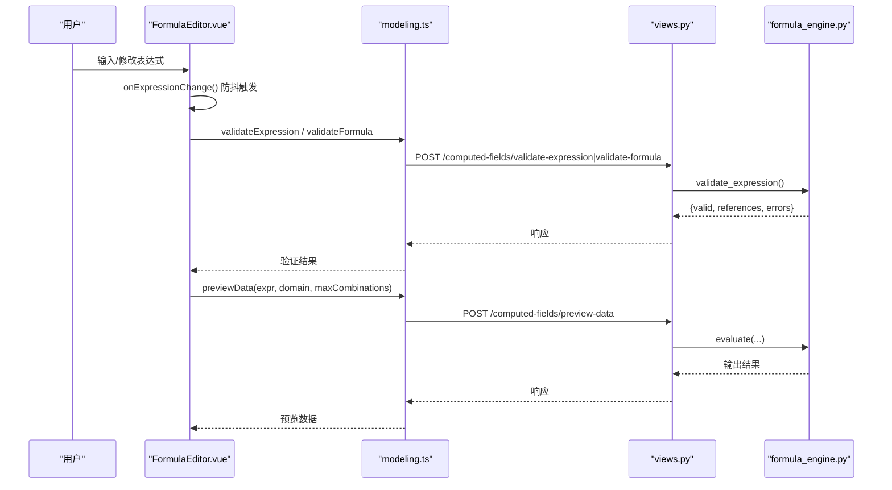
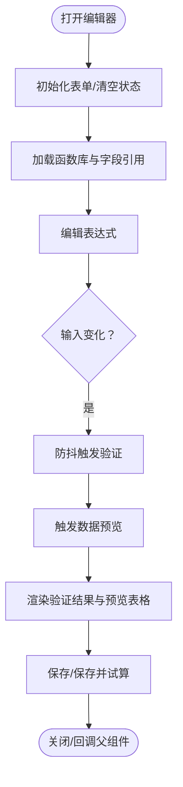
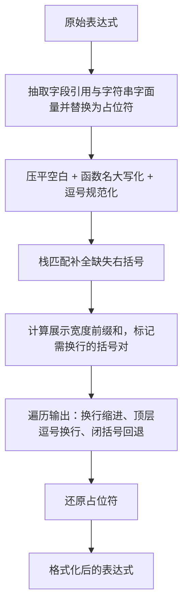
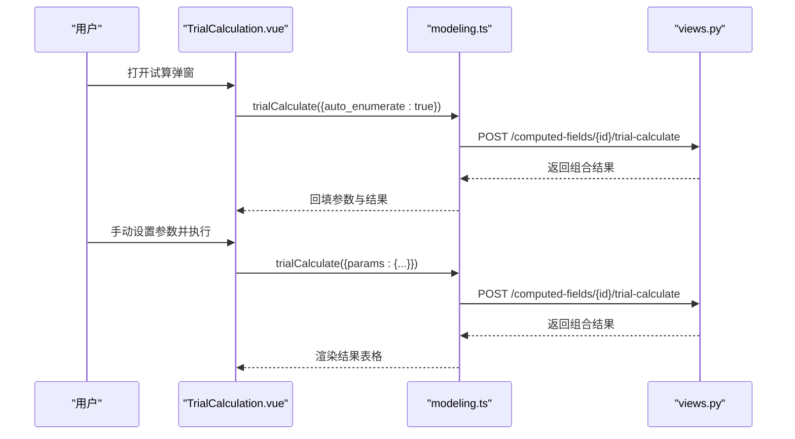
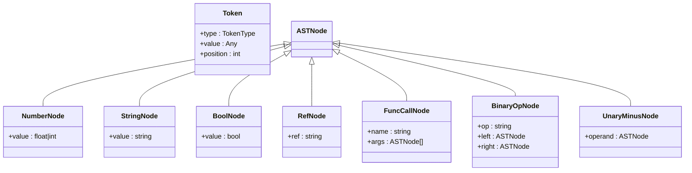
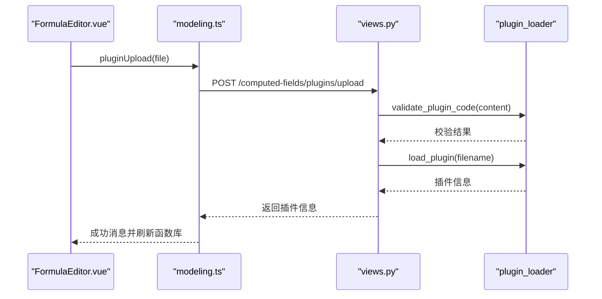
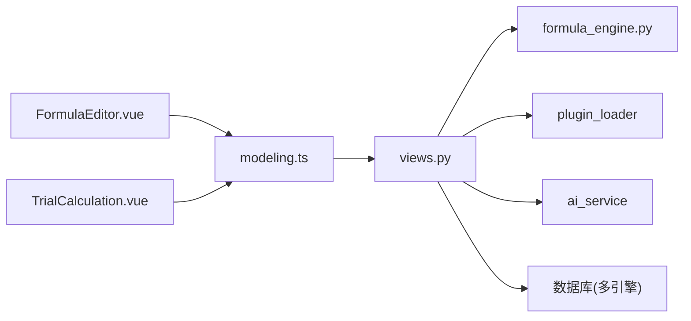

# 公式编辑器

<cite>
**本文引用的文件**   
- [FormulaEditor.vue](file://frontend/src/views/modeling/components/FormulaEditor.vue)
- [formula.ts](file://frontend/src/utils/formula.ts)
- [TrialCalculation.vue](file://frontend/src/views/modeling/components/TrialCalculation.vue)
- [modeling.ts](file://frontend/src/api/modeling.ts)
- [formula_engine.py](file://backend/apps/modeling/formula_engine.py)
- [custom_functions.py](file://backend/apps/modeling/custom_functions.py)
- [views.py](file://backend/apps/modeling/views.py)
</cite>

## 目录
1. [简介](#简介)
2. [项目结构](#项目结构)
3. [核心组件](#核心组件)
4. [架构总览](#架构总览)
5. [详细组件分析](#详细组件分析)
6. [依赖关系分析](#依赖关系分析)
7. [性能考量](#性能考量)
8. [故障排查指南](#故障排查指南)
9. [结论](#结论)
10. [附录：使用示例与配置](#附录使用示例与配置)

## 简介
本文件为 MetaData002 前端“公式编辑器”组件（FormulaEditor）的完整技术文档。内容覆盖：
- 实时语法检查、智能代码补全、错误提示与公式验证
- 交互设计：字段引用自动插入、函数参数提示、公式预览
- 与后端计算引擎集成：公式验证API、实时计算结果展示、错误信息反馈
- 自定义扩展机制：自定义函数注册、主题定制、快捷键配置
- 使用示例、配置选项、样式定制方法
- 常见问题排查与性能优化建议

## 项目结构
公式编辑器位于建模模块的前端页面中，配套工具函数与试算弹窗共同构成完整的编辑体验；后端提供表达式解析、函数库、插件加载与AI生成等能力。

**图表来源** 
- [FormulaEditor.vue:1-120](file://frontend/src/views/modeling/components/FormulaEditor.vue#L1-L120)
- [formula.ts:1-95](file://frontend/src/utils/formula.ts#L1-L95)
- [TrialCalculation.vue:1-120](file://frontend/src/views/modeling/components/TrialCalculation.vue#L1-L120)
- [modeling.ts:356-407](file://frontend/src/api/modeling.ts#L356-L407)
- [views.py:1882-2253](file://backend/apps/modeling/views.py#L1882-L2253)
- [formula_engine.py:1-120](file://backend/apps/modeling/formula_engine.py#L1-L120)

**章节来源**
- [FormulaEditor.vue:1-120](file://frontend/src/views/modeling/components/FormulaEditor.vue#L1-L120)
- [modeling.ts:356-407](file://frontend/src/api/modeling.ts#L356-L407)

## 核心组件
- FormulaEditor.vue：公式编辑主界面，包含AI自然语言生成、基础信息表单、表达式编辑区、侧边栏（字段引用/函数库/技术函数插件）、数据预览面板、保存与试算流程。
- formula.ts：表达式格式化与代码风格处理（函数名大写化、括号补全、长调用换行缩进），供编辑器与试算弹窗复用。
- TrialCalculation.vue：枚举试算弹窗，支持按参数笛卡尔积组合执行并展示结果。
- modeling.ts：前端API封装，统一调用后端计算字段相关接口（验证、预览、AI生成、函数库、可用字段、插件管理等）。

**章节来源**
- [FormulaEditor.vue:1-120](file://frontend/src/views/modeling/components/FormulaEditor.vue#L1-L120)
- [formula.ts:1-95](file://frontend/src/utils/formula.ts#L1-L95)
- [TrialCalculation.vue:1-120](file://frontend/src/views/modeling/components/TrialCalculation.vue#L1-L120)
- [modeling.ts:356-407](file://frontend/src/api/modeling.ts#L356-L407)

## 架构总览
公式编辑器采用前后端分离架构：
- 前端通过REST API与后端交互，完成公式验证、数据预览、AI生成、函数库与字段引用获取、插件管理。
- 后端基于自研公式引擎（词法分析→语法分析→AST→求值器）实现表达式校验与执行，并提供函数注册表与插件加载机制。

**图表来源** 
- [FormulaEditor.vue:686-754](file://frontend/src/views/modeling/components/FormulaEditor.vue#L686-L754)
- [modeling.ts:365-381](file://frontend/src/api/modeling.ts#L365-L381)
- [views.py:1931-2032](file://backend/apps/modeling/views.py#L1931-L2032)
- [formula_engine.py:775-796](file://backend/apps/modeling/formula_engine.py#L775-L796)

## 详细组件分析

### FormulaEditor 组件
- 功能特性
  - AI自然语言生成表达式：支持描述驱动生成，可附带已选字段参考与当前表达式进行增量修改。
  - 实时语法检查：输入变化后防抖触发验证，新建模式调用纯语法验证，编辑模式调用实例级验证并检测循环依赖。
  - 智能代码补全：侧边栏函数库分类展示，点击插入函数模板；字段引用两级级联，点击插入引用占位符。
  - 错误提示：验证失败时显示具体错误项；预览失败或无缓存时给出友好提示。
  - 公式预览：底部常驻表格，展示输入参数去重组合与输出结果，支持切换全部/前50条。
- 交互设计
  - 字段引用自动插入：从侧边栏选择表→字段，插入 {表名.字段名} 占位符，并同步到AI参考集合。
  - 函数参数提示：根据函数description提取签名模板，插入时光标定位到第一个参数位置。
  - 公式格式化：一键格式化，提升可读性（函数名大写、括号补全、长调用换行缩进）。
- 与后端集成
  - 验证API：新建模式调用 validateExpression，编辑模式调用 validateFormula（含循环依赖检测）。
  - 预览API：previewData 返回 columns、rows、total_possible、truncated 等元数据。
  - 函数库与字段引用：availableFunctions、availableReferences 提供侧边栏数据源。
  - 插件管理：上传、重载、卸载、模板下载，动态刷新函数库。
- 状态与事件
  - 表单状态：code、name、expression、output_type。
  - 验证与预览状态：validationResult、previewResult、sidebarLoading、pluginsLoading 等。
  - 事件：saved、save-and-trial、update:open。

**图表来源** 
- [FormulaEditor.vue:540-570](file://frontend/src/views/modeling/components/FormulaEditor.vue#L540-L570)
- [FormulaEditor.vue:686-754](file://frontend/src/views/modeling/components/FormulaEditor.vue#L686-L754)
- [FormulaEditor.vue:878-930](file://frontend/src/views/modeling/components/FormulaEditor.vue#L878-L930)

**章节来源**
- [FormulaEditor.vue:1-120](file://frontend/src/views/modeling/components/FormulaEditor.vue#L1-L120)
- [FormulaEditor.vue:540-570](file://frontend/src/views/modeling/components/FormulaEditor.vue#L540-L570)
- [FormulaEditor.vue:686-754](file://frontend/src/views/modeling/components/FormulaEditor.vue#L686-L754)
- [FormulaEditor.vue:878-930](file://frontend/src/views/modeling/components/FormulaEditor.vue#L878-L930)

### 表达式格式化（formula.ts）
- 目标：将原始表达式转换为代码编辑器风格，便于阅读与维护。
- 关键步骤：
  - 保护字段引用与字符串字面量，避免误改。
  - 压平空白、函数名大写化、逗号规范化。
  - 栈匹配补全缺失右括号。
  - 计算字符展示宽度前缀和，判断括号内容是否超长以决定是否换行展开。
  - 输出时按层级缩进，顶层逗号后换行，闭括号回退缩进独立成行。
  - 还原占位符，得到最终格式化文本。

**图表来源** 
- [formula.ts:7-94](file://frontend/src/utils/formula.ts#L7-L94)

**章节来源**
- [formula.ts:1-95](file://frontend/src/utils/formula.ts#L1-L95)

### 试算弹窗（TrialCalculation.vue）
- 功能：针对已保存的计算字段，支持自动枚举或手动设置参数，执行笛卡尔积组合并展示结果。
- 特点：
  - 自动枚举：打开弹窗即尝试自动枚举，回填测试值与下拉选项。
  - 参数表格：显示参数字段与可选值，支持多选构建组合。
  - 结果表格：展示输入与输出，错误行高亮。
  - 表达式展示：复用同一格式化逻辑，保证一致性。

**图表来源** 
- [TrialCalculation.vue:163-227](file://frontend/src/views/modeling/components/TrialCalculation.vue#L163-L227)
- [modeling.ts:382-387](file://frontend/src/api/modeling.ts#L382-L387)
- [views.py:2062-2081](file://backend/apps/modeling/views.py#L2062-L2081)

**章节来源**
- [TrialCalculation.vue:1-120](file://frontend/src/views/modeling/components/TrialCalculation.vue#L1-L120)
- [TrialCalculation.vue:163-227](file://frontend/src/views/modeling/components/TrialCalculation.vue#L163-L227)

### 后端公式引擎（formula_engine.py）
- 架构：表达式字符串 → tokenize() → Token流 → parse() → AST → evaluate(context) → 结果。
- 支持语法：
  - 字段引用：{表名.字段名}
  - 函数调用：FUNC_NAME(arg1, arg2, ...)
  - 运算符：+,-,*,/,>,<,>=,<=,=,<>,&（文本拼接）
- 内置函数：逻辑函数（IF/AND/OR/NOT/IFS/SWITCH/IFERROR）、字符串函数（CONCAT/LEFT/RIGHT/MID/LEN/TRIM/UPPER/LOWER/SUBSTITUTE）、数字函数（ABS/ROUND/CEILING/FLOOR/MOD/MAX/MIN）、判空函数（ISBLANK/ISNA/ISNUMBER/ISTEXT）、日期函数（TODAY/YEAR/MONTH/DAY/DATEDIF）。
- 公开API：evaluate(expression, context)、validate_expression(expression)。

**图表来源** 
- [formula_engine.py:84-96](file://backend/apps/modeling/formula_engine.py#L84-L96)
- [formula_engine.py:205-246](file://backend/apps/modeling/formula_engine.py#L205-L246)

**章节来源**
- [formula_engine.py:1-120](file://backend/apps/modeling/formula_engine.py#L1-L120)
- [formula_engine.py:775-796](file://backend/apps/modeling/formula_engine.py#L775-L796)

### 自定义函数与插件（custom_functions.py 与 views.py 插件管理）
- custom_functions.py：使用 @register_function 装饰器注册业务函数，category固定为“技术函数”，description必须写明签名与用途。
- 插件管理：
  - 上传 .py 文件，AST安全校验通过后写入 tech_plugins/ 目录并加载。
  - 支持重载、卸载、模板下载，无需重启服务。
  - 前端侧边栏“技术函数”Tab展示插件与函数清单，点击即可插入函数模板。

**图表来源** 
- [views.py:2122-2161](file://backend/apps/modeling/views.py#L2122-L2161)
- [modeling.ts:396-406](file://frontend/src/api/modeling.ts#L396-L406)

**章节来源**
- [custom_functions.py:1-108](file://backend/apps/modeling/custom_functions.py#L1-L108)
- [views.py:2122-2161](file://backend/apps/modeling/views.py#L2122-L2161)

## 依赖关系分析
- 前端依赖：
  - FormulaEditor.vue 依赖 modeling.ts API 与 formula.ts 工具函数。
  - TrialCalculation.vue 依赖 modeling.ts API 与 formula.ts 工具函数。
- 后端依赖：
  - ComputedFieldViewSet 依赖 formula_engine.py（表达式解析与求值）、computed_service（依赖解析、DAG构建、批量重算）、ai_service（AI生成）、plugin_loader（插件管理）。
- 外部依赖：
  - 数据库连接（多类型支持：PostgreSQL、MySQL、SQL Server、Oracle）。
  - 去重值缓存（distinct_cache）用于预览与试算。

**图表来源** 
- [modeling.ts:356-407](file://frontend/src/api/modeling.ts#L356-L407)
- [views.py:1882-2253](file://backend/apps/modeling/views.py#L1882-L2253)

**章节来源**
- [modeling.ts:356-407](file://frontend/src/api/modeling.ts#L356-L407)
- [views.py:1882-2253](file://backend/apps/modeling/views.py#L1882-L2253)

## 性能考量
- 前端防抖：表达式变化后延迟800ms触发验证与预览，避免频繁请求。
- 预览限制：默认最多50条组合，支持切换“全部”模式（后端不截断）。
- 侧边栏数据：函数库与字段引用一次性加载，减少重复请求。
- 插件热加载：无需重启服务，降低开发调试成本。
- 数据库访问：预览与试算依赖去重值缓存，避免频繁查询大表。

[本节为通用指导，不直接分析具体文件]

## 故障排查指南
- 验证失败
  - 检查表达式语法是否正确，注意字段引用格式 {表名.字段名}。
  - 查看验证错误列表，定位具体错误项。
- 预览无数据
  - 确认引用字段存在去重值缓存；若无缓存，请先刷新或等待缓存生成。
  - 检查域配置与数据源连接是否正常。
- 插件加载失败
  - 确保上传 .py 文件且编码为UTF-8。
  - 查看AST安全校验错误详情，修正后再上传。
- 试算结果为空
  - 检查参数是否至少选择一个值；若自动枚举未回填，请手动输入测试值。

**章节来源**
- [FormulaEditor.vue:686-754](file://frontend/src/views/modeling/components/FormulaEditor.vue#L686-L754)
- [views.py:2122-2161](file://backend/apps/modeling/views.py#L2122-L2161)
- [TrialCalculation.vue:163-227](file://frontend/src/views/modeling/components/TrialCalculation.vue#L163-L227)

## 结论
FormulaEditor组件提供了强大的公式编辑能力，结合后端公式引擎与AI生成，实现了从自然语言到可执行表达式的无缝转换。其交互设计注重用户体验，实时验证与预览帮助用户快速定位问题。插件机制与函数库扩展性强，满足复杂业务需求。通过合理的性能优化与故障排查策略，可保障系统稳定高效运行。

[本节为总结，不直接分析具体文件]

## 附录：使用示例与配置

### 使用示例
- 新建计算字段
  - 打开编辑器，填写字段编码与名称。
  - 在表达式区域输入Excel风格公式，或使用AI自然语言生成。
  - 点击“验证公式”查看语法与依赖；点击“保存”创建字段。
- 编辑已有字段
  - 打开编辑器自动填充现有表达式。
  - 修改表达式后自动触发验证与预览。
  - 点击“保存”更新字段。
- 数据预览
  - 输入表达式后，底部表格自动展示输入参数去重组合与输出结果。
  - 点击“全部”按钮切换显示所有组合。
- 试算
  - 打开试算弹窗，自动枚举或手动设置参数。
  - 点击“执行试算”查看笛卡尔积组合的结果。

### 配置选项
- 编辑器属性
  - open：控制弹窗显示。
  - domainId：域ID，用于获取字段引用与函数库。
  - field：编辑模式下的计算字段对象。
- 事件
  - saved：保存成功后回调，传递保存的对象。
  - save-and-trial：保存并打开试算弹窗。
  - update:open：控制弹窗显示状态。

### 样式定制
- 编辑器布局：通过CSS类 .formula-editor-layout、.formula-main、.formula-sidebar 调整布局。
- 字体与字号：.formula-textarea 设置等宽字体与字号。
- 预览表格：.preview-table、.preview-th-sub、.preview-td-output 等类控制表格样式。
- AI提示：.ai-tips-alert、.ai-reasoning-collapse 等类控制AI生成提示样式。

**章节来源**
- [FormulaEditor.vue:933-1435](file://frontend/src/views/modeling/components/FormulaEditor.vue#L933-L1435)
- [modeling.ts:356-407](file://frontend/src/api/modeling.ts#L356-L407)