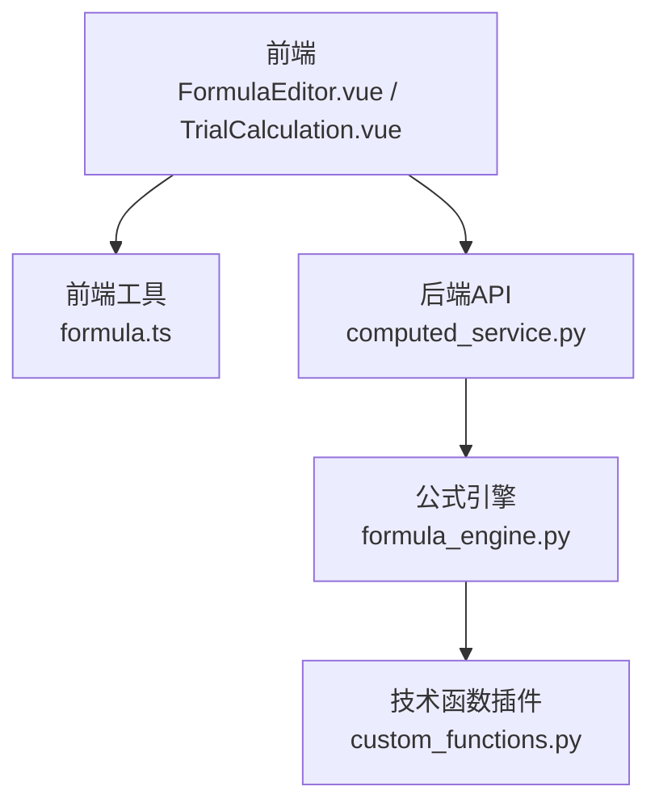
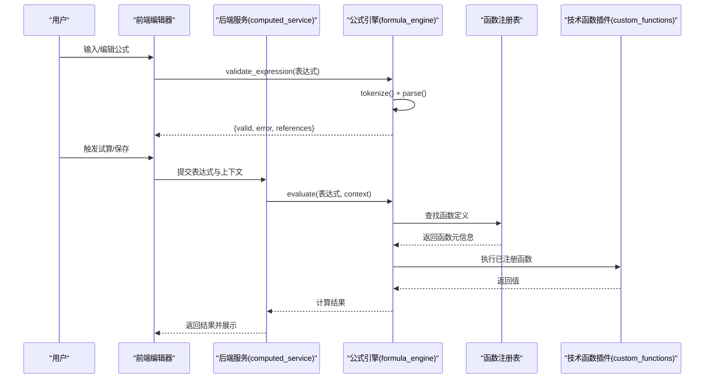
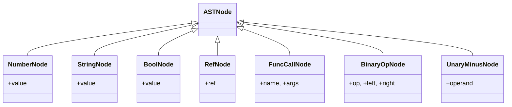
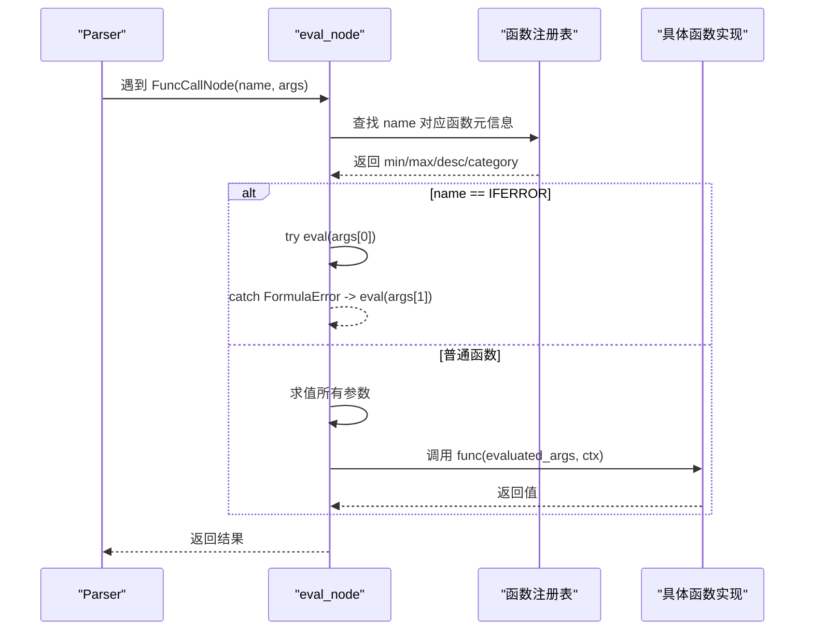
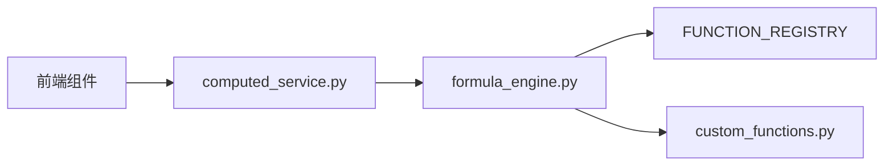

# 公式语法参考

<cite>
**本文引用的文件**   
- [formula_engine.py](file://backend/apps/modeling/formula_engine.py)
- [custom_functions.py](file://backend/apps/modeling/custom_functions.py)
- [computed_service.py](file://backend/apps/modeling/computed_service.py)
- [formula.ts](file://frontend/src/utils/formula.ts)
- [FormulaEditor.vue](file://frontend/src/views/modeling/components/FormulaEditor.vue)
- [TrialCalculation.vue](file://frontend/src/views/modeling/components/TrialCalculation.vue)
</cite>

## 目录
1. [简介](#简介)
2. [项目结构](#项目结构)
3. [核心组件](#核心组件)
4. [架构总览](#架构总览)
5. [详细组件分析](#详细组件分析)
6. [依赖关系分析](#依赖关系分析)
7. [性能考量](#性能考量)
8. [故障排查指南](#故障排查指南)
9. [结论](#结论)
10. [附录：函数速查与示例](#附录函数速查与示例)

## 简介
本文件为 MetaData002 计算引擎的“Excel 风格公式语法”完整参考。内容涵盖字段引用语法、运算符优先级、数据类型支持、内置函数规范（逻辑、文本、数学、判空、日期）、错误处理机制、调试技巧以及最佳实践，帮助使用者快速编写稳定、可维护的计算表达式。

## 项目结构
公式引擎由后端解析与求值、前端格式化与展示、以及服务层组合调用三部分构成：
- 后端公式引擎：词法分析、语法分析、AST 构建、函数注册与求值、表达式验证
- 技术函数插件：扩展自定义函数，统一通过装饰器注册
- 前端工具：表达式格式化、试算面板、编辑器集成



**图表来源** 
- [FormulaEditor.vue:111-146](file://frontend/src/views/modeling/components/FormulaEditor.vue#L111-L146)
- [formula.ts:1-95](file://frontend/src/utils/formula.ts#L1-L95)
- [computed_service.py:1-200](file://backend/apps/modeling/computed_service.py#L1-L200)
- [formula_engine.py:1-120](file://backend/apps/modeling/formula_engine.py#L1-L120)
- [custom_functions.py:1-108](file://backend/apps/modeling/custom_functions.py#L1-L108)

**章节来源**
- [formula_engine.py:1-120](file://backend/apps/modeling/formula_engine.py#L1-L120)
- [custom_functions.py:1-108](file://backend/apps/modeling/custom_functions.py#L1-L108)
- [computed_service.py:1-200](file://backend/apps/modeling/computed_service.py#L1-L200)
- [formula.ts:1-95](file://frontend/src/utils/formula.ts#L1-L95)
- [FormulaEditor.vue:111-146](file://frontend/src/views/modeling/components/FormulaEditor.vue#L111-L146)

## 核心组件
- 表达式字符串 → 词法分析(tokenize) → Token流 → 语法分析(Parser) → AST → 求值(eval_node) → 结果
- 字段引用语法：{表名.字段名}
- 函数调用语法：FUNC_NAME(arg1, arg2, ...)
- 运算符：+ - * / > < >= <= = <> &

**章节来源**
- [formula_engine.py:1-120](file://backend/apps/modeling/formula_engine.py#L1-L120)

## 架构总览
公式引擎采用经典的“词法→语法→语义”三段式架构，配合函数注册表实现可扩展的函数体系。



**图表来源** 
- [formula_engine.py:775-867](file://backend/apps/modeling/formula_engine.py#L775-L867)
- [custom_functions.py:1-108](file://backend/apps/modeling/custom_functions.py#L1-L108)
- [computed_service.py:360-629](file://backend/apps/modeling/computed_service.py#L360-L629)

## 详细组件分析

### 词法分析与 Token 流
- 支持的 Token 类型：数字、字符串、布尔、字段引用、函数名、逗号、括号、运算符、EOF
- 字段引用使用正则提取，要求包含“表名.字段名”，否则抛出语法错误
- 字符串支持双引号或单引号，支持转义字符
- 数字支持整数与浮点数
- 布尔字面量 TRUE/FALSE（不区分大小写）
- 运算符按长度降序匹配，避免歧义

**章节来源**
- [formula_engine.py:61-198](file://backend/apps/modeling/formula_engine.py#L61-L198)

### 语法分析与 AST
- 递归下降解析器，产出 AST 节点
- 优先级（从低到高）：比较运算 > 加减拼接 > 乘除 > 一元负号 > 原子（数字/字符串/布尔/引用/函数/括号）
- 函数调用参数以逗号分隔，支持嵌套表达式



**图表来源** 
- [formula_engine.py:205-246](file://backend/apps/modeling/formula_engine.py#L205-L246)

**章节来源**
- [formula_engine.py:253-366](file://backend/apps/modeling/formula_engine.py#L253-L366)

### 求值器与二元运算
- 求值器根据 AST 节点类型递归求值
- 二元运算：& 文本拼接；= 与 <> 字符串等价比较；> < >= <= 数值比较；+ - * / 算术运算
- 除法与取模对零除进行保护，抛出运行时错误

```mermaid
flowchart TD
Start(["进入 _eval_binary_op"]) --> CheckOp{"运算符类型"}
CheckOp --> |&| Concat["拼接为字符串"]
CheckOp --> |=|<>| EqStr["转为字符串比较"]
CheckOp --> |>|<|>=|<=| NumCmp["转为数值比较"]
CheckOp --> |+|-|*|/| Arith["数值算术运算"]
Arith --> DivCheck{"是否除/取模且除数为0?"}
DivCheck --> |是| RaiseErr["抛出运行时错误"]
DivCheck --> |否| ReturnRes["返回结果"]
Concat --> ReturnRes
EqStr --> ReturnRes
NumCmp --> ReturnRes
```

**图表来源** 
- [formula_engine.py:701-736](file://backend/apps/modeling/formula_engine.py#L701-L736)

**章节来源**
- [formula_engine.py:669-736](file://backend/apps/modeling/formula_engine.py#L669-L736)

### 函数注册与执行
- 使用装饰器 @register_function 注册函数，指定名称、最小/最大参数、描述与分类
- 函数签名固定为 (args, ctx)，args 为已求值的参数列表
- IFERROR 特殊处理：惰性求值第一个参数，捕获异常后返回第二个参数



**图表来源** 
- [formula_engine.py:739-767](file://backend/apps/modeling/formula_engine.py#L739-L767)

**章节来源**
- [formula_engine.py:372-388](file://backend/apps/modeling/formula_engine.py#L372-L388)
- [formula_engine.py:739-767](file://backend/apps/modeling/formula_engine.py#L739-L767)

### 技术函数插件
- 在 custom_functions.py 中通过 @register_function 注册业务性函数
- 常见扩展：PAD_LEFT、REGEX_EXTRACT、REGEX_REPLACE、SPLIT_INDEX、MAP_VALUE、HASH_MD5
- 业务性错误应抛出 FormulaRuntimeError，以便被 IFERROR 捕获

**章节来源**
- [custom_functions.py:1-108](file://backend/apps/modeling/custom_functions.py#L1-L108)

### 前端表达式格式化
- 将函数名大写化、补全缺失右括号、长函数调用换行缩进
- 保护字段引用 {...} 和字符串字面量 "..." 不被误改
- 用于 FormulaEditor 与 TrialCalculation 复用

**章节来源**
- [formula.ts:1-95](file://frontend/src/utils/formula.ts#L1-L95)

### 服务层与试算
- computed_service.py 负责依赖解析、DAG 构建、重算调度、枚举试算
- 构建上下文时将记录数据转换为 {"表名.字段名": 值} 格式供引擎求值
- 支持自动枚举 distinct_values 生成笛卡尔积组合

**章节来源**
- [computed_service.py:360-629](file://backend/apps/modeling/computed_service.py#L360-L629)

## 依赖关系分析
- formula_engine.py 为核心，提供 evaluate、validate_expression、extract_references、get_available_functions
- custom_functions.py 通过末尾导入注入到注册表
- computed_service.py 依赖公式引擎进行表达式验证与求值
- 前端通过 API 调用服务层，并使用本地工具进行表达式格式化



**图表来源** 
- [formula_engine.py:849-867](file://backend/apps/modeling/formula_engine.py#L849-L867)
- [custom_functions.py:1-108](file://backend/apps/modeling/custom_functions.py#L1-L108)
- [computed_service.py:1-200](file://backend/apps/modeling/computed_service.py#L1-L200)

**章节来源**
- [formula_engine.py:849-867](file://backend/apps/modeling/formula_engine.py#L849-L867)
- [custom_functions.py:1-108](file://backend/apps/modeling/custom_functions.py#L1-L108)
- [computed_service.py:1-200](file://backend/apps/modeling/computed_service.py#L1-L200)

## 性能考量
- 表达式验证与求值为 O(n) 线性扫描（词法/语法/求值），适合短小公式
- 函数参数校验在 AST 遍历阶段完成，避免重复计算
- 建议将复杂逻辑拆分为多个简单公式，降低单次求值复杂度
- 试算时限制最大组合数，避免笛卡尔积爆炸

[本节为通用指导，无需特定文件来源]

## 故障排查指南
- 语法错误：检查字段引用是否闭合、字符串是否成对、运算符是否正确
- 引用未找到：确认上下文中存在该“表名.字段名”键
- 运行时错误：注意除零、类型转换失败、函数参数数量不符
- IFERROR 用法：包裹可能出错的表达式，提供默认值

**章节来源**
- [formula_engine.py:23-52](file://backend/apps/modeling/formula_engine.py#L23-L52)
- [formula_engine.py:798-818](file://backend/apps/modeling/formula_engine.py#L798-L818)

## 结论
MetaData002 公式引擎提供了完整的 Excel 风格表达式能力，覆盖常用逻辑、文本、数学、判空与日期函数，并通过插件机制支持扩展。结合前端的格式化与试算工具，可实现高效、可靠的计算字段配置与验证。

[本节为总结，无需特定文件来源]

## 附录：函数速查与示例

### 数据类型支持
- 数字：整数与浮点数
- 字符串：双引号或单引号包裹，支持转义
- 布尔：TRUE/FALSE（不区分大小写）
- 空值：None、空字符串、空列表视为空

**章节来源**
- [formula_engine.py:140-192](file://backend/apps/modeling/formula_engine.py#L140-L192)

### 运算符与优先级
- 比较：> < >= <= = <>
- 加减拼接：+ - &
- 乘除：* /
- 一元：-
- 优先级从高到低：一元 > 乘除 > 加减拼接 > 比较

**章节来源**
- [formula_engine.py:253-322](file://backend/apps/modeling/formula_engine.py#L253-L322)

### 内置函数速查

#### 逻辑函数
- IF(条件, 真值, [假值])
- AND(条件1, 条件2, ...)
- OR(条件1, 条件2, ...)
- NOT(条件)
- IFS(条件1, 值1, 条件2, 值2, ...)
- SWITCH(表达式, 值1, 结果1, [值2, 结果2, ...], [默认值])
- IFERROR(表达式, 错误时返回值)

**章节来源**
- [formula_engine.py:392-443](file://backend/apps/modeling/formula_engine.py#L392-L443)

#### 文本函数
- CONCAT(文本1, 文本2, ...)
- LEFT(文本, [长度])
- RIGHT(文本, [长度])
- MID(文本, 起始位置, 长度)
- LEN(文本)
- TRIM(文本)
- UPPER(文本)
- LOWER(文本)
- SUBSTITUTE(文本, 旧文本, 新文本, [第N次])

**章节来源**
- [formula_engine.py:447-516](file://backend/apps/modeling/formula_engine.py#L447-L516)

#### 数学函数
- ABS(数字)
- ROUND(数字, [小数位])
- CEILING(数字, [基数])
- FLOOR(数字, [基数])
- MOD(被除数, 除数)
- MAX(数字1, 数字2, ...)
- MIN(数字1, 数字2, ...)

**章节来源**
- [formula_engine.py:520-570](file://backend/apps/modeling/formula_engine.py#L520-L570)

#### 判空函数
- ISBLANK(值)
- ISNA(值)
- ISNUMBER(值)
- ISTEXT(值)

**章节来源**
- [formula_engine.py:574-594](file://backend/apps/modeling/formula_engine.py#L574-L594)

#### 日期函数
- TODAY()
- YEAR(日期)
- MONTH(日期)
- DAY(日期)
- DATEDIF(开始日期, 结束日期, 单位)

**章节来源**
- [formula_engine.py:598-631](file://backend/apps/modeling/formula_engine.py#L598-L631)

### 示例与最佳实践
- 条件判断：IF({员工表.等级}="A", {员工表.基本工资}*1.5, {员工表.基本工资})
- 文本拼接：CONCAT({客户表.姓名}, "-", {客户表.城市})
- 数值计算：ROUND({订单表.金额}*0.1, 2)
- 日期差：DATEDIF({入职表.入职日期}, TODAY(), "Y")
- 错误处理：IFERROR({订单表.金额}/{订单表.数量}, 0)
- 多条件分支：IFS({产品表.类别}="A", 1, {产品表.类别}="B", 2, 0)
- 映射替换：MAP_VALUE({物料表.编码}, "A:B;C:D", {物料表.编码})

**章节来源**
- [FormulaEditor.vue:111-146](file://frontend/src/views/modeling/components/FormulaEditor.vue#L111-L146)
- [custom_functions.py:78-94](file://backend/apps/modeling/custom_functions.py#L78-L94)