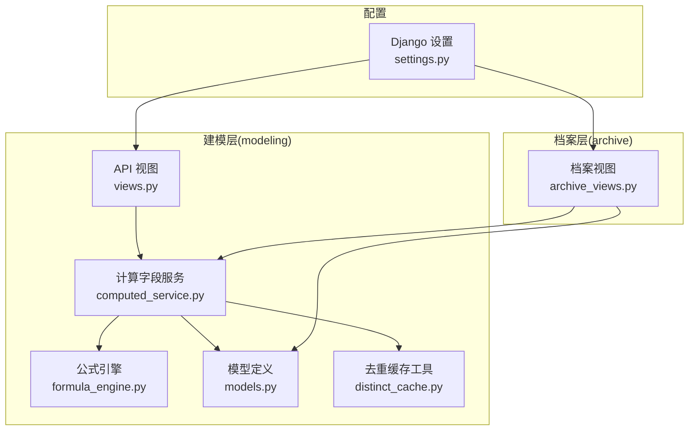
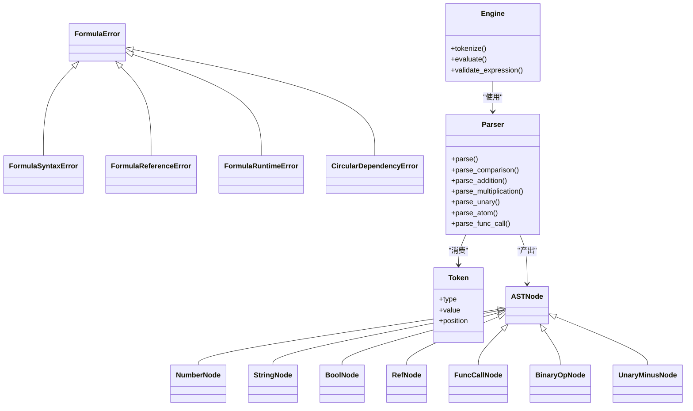
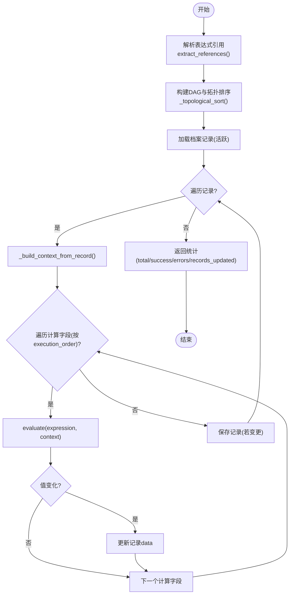
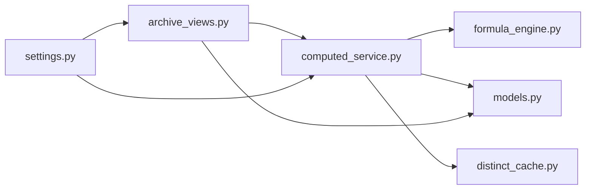

# 批量计算执行

<cite>
**本文引用的文件**   
- [computed_service.py](file://backend/apps/modeling/computed_service.py)
- [formula_engine.py](file://backend/apps/modeling/formula_engine.py)
- [models.py](file://backend/apps/modeling/models.py)
- [views.py](file://backend/apps/modeling/views.py)
- [distinct_cache.py](file://backend/apps/modeling/distinct_cache.py)
- [archive_views.py](file://backend/apps/archive/views.py)
- [settings.py](file://backend/config/settings.py)
</cite>

## 目录
1. [简介](#简介)
2. [项目结构](#项目结构)
3. [核心组件](#核心组件)
4. [架构总览](#架构总览)
5. [详细组件分析](#详细组件分析)
6. [依赖关系分析](#依赖关系分析)
7. [性能与并发优化](#性能与并发优化)
8. [监控、日志与可观测性](#监控日志与可观测性)
9. [配置项与参数调优](#配置项与参数调优)
10. [故障恢复与容错策略](#故障恢复与容错策略)
11. [使用示例与最佳实践](#使用示例与最佳实践)
12. [结论](#结论)

## 简介
本文件面向 MetaData002 计算引擎的“批量计算”能力，系统性阐述其设计理念与实现原理，覆盖数据批次划分、内存管理、并发控制、计算字段批量求值（上下文构建、缓存机制、增量更新）、大规模数据集的性能优化（分块处理、结果缓存、异步执行）、监控与日志记录（进度跟踪、错误处理、性能指标），以及配置选项、参数调优与故障恢复策略。文档同时提供实际使用场景的代码级参考路径与最佳实践建议，帮助读者快速落地并稳定运行。

## 项目结构
围绕批量计算的核心代码主要分布在 modeling 与 archive 两个应用：
- modeling.app：公式引擎、计算字段服务、模型定义、视图接口、去重缓存工具等
- archive.app：档案同步/刷新流程中触发批量重算的入口与统计汇总

图表来源
- [computed_service.py:1-120](file://backend/apps/modeling/computed_service.py#L1-L120)
- [formula_engine.py:1-120](file://backend/apps/modeling/formula_engine.py#L1-L120)
- [models.py:421-472](file://backend/apps/modeling/models.py#L421-L472)
- [views.py:2060-2120](file://backend/apps/modeling/views.py#L2060-L2120)
- [distinct_cache.py:1-122](file://backend/apps/modeling/distinct_cache.py#L1-L122)
- [archive_views.py:300-330](file://backend/apps/archive/views.py#L300-L330)
- [settings.py:56-123](file://backend/config/settings.py#L56-L123)

章节来源
- [computed_service.py:1-120](file://backend/apps/modeling/computed_service.py#L1-L120)
- [formula_engine.py:1-120](file://backend/apps/modeling/formula_engine.py#L1-L120)
- [models.py:421-472](file://backend/apps/modeling/models.py#L421-L472)
- [views.py:2060-2120](file://backend/apps/modeling/views.py#L2060-L2120)
- [distinct_cache.py:1-122](file://backend/apps/modeling/distinct_cache.py#L1-L122)
- [archive_views.py:300-330](file://backend/apps/archive/views.py#L300-L330)
- [settings.py:56-123](file://backend/config/settings.py#L56-L123)

## 核心组件
- 公式引擎(formula_engine.py)：Excel风格表达式解析器+函数库+求值器，支持引用语法{表名.字段名}、运算符、函数调用、错误分类与惰性求值(IFERROR)。
- 计算字段服务(computed_service.py)：依赖解析、DAG构建、拓扑排序、批量重算、受影响字段增量重算、枚举试算、表达式预览。
- 模型(models.py)：域、表、字段、标准字段、计算字段等实体定义；计算字段包含表达式、依赖、执行顺序、输出类型、是否释放到档案等。
- 视图(API)(views.py)：暴露批量重算、依赖图、试算、可用函数、可用引用等接口。
- 去重缓存(distinct_cache.py)：跨数据库类型的去重取值采样与缓存填充，为试算参数空间构建提供支撑。
- 档案视图(archive_views.py)：在数据同步/刷新后自动触发批量重算，并将结果纳入统计。

章节来源
- [formula_engine.py:1-120](file://backend/apps/modeling/formula_engine.py#L1-L120)
- [computed_service.py:1-120](file://backend/apps/modeling/computed_service.py#L1-L120)
- [models.py:421-472](file://backend/apps/modeling/models.py#L421-L472)
- [views.py:2060-2120](file://backend/apps/modeling/views.py#L2060-L2120)
- [distinct_cache.py:1-122](file://backend/apps/modeling/distinct_cache.py#L1-L122)
- [archive_views.py:300-330](file://backend/apps/archive/views.py#L300-L330)

## 架构总览
批量计算的整体流程如下：
- 触发点：档案同步/刷新完成后，或手动通过 API 触发。
- 依赖解析与DAG：按计算字段的表达式解析引用，构建依赖图并进行拓扑排序，得到稳定的执行顺序。
- 逐记录批处理：对每个档案记录构建上下文，按执行顺序依次求值计算字段，写入记录 data 字段。
- 结果持久化：仅当值发生变化时更新记录，减少不必要的写放大。
- 监控与统计：返回总计算字段数、成功数、错误列表、更新记录数等统计信息。

```mermaid
sequenceDiagram
participant U as "用户/调度器"
participant API as "建模API<br/>views.py"
participant SVC as "计算字段服务<br/>computed_service.py"
participant ENG as "公式引擎<br/>formula_engine.py"
participant DB as "数据库"
participant ARC as "档案视图<br/>archive_views.py"
U->>ARC : 触发同步/刷新
ARC->>SVC : 调用 batch_recalculate(domain_id)
SVC->>DB : 查询活跃计算字段(按execution_order)
SVC->>DB : 查询档案记录(活跃)
loop 每条记录
SVC->>SVC : _build_context_from_record()
loop 按执行顺序遍历计算字段
SVC->>ENG : evaluate(expression, context)
ENG-->>SVC : 计算结果
SVC->>SVC : 比较旧值/新值
alt 值变化
SVC->>DB : 更新记录data
else 无变化
SVC-->>SVC : 跳过
end
end
end
SVC-->>ARC : 返回统计(total/success/errors/records_updated)
ARC-->>U : 返回响应
```

图表来源
- [archive_views.py:300-330](file://backend/apps/archive/views.py#L300-L330)
- [computed_service.py:215-278](file://backend/apps/modeling/computed_service.py#L215-L278)
- [formula_engine.py:775-796](file://backend/apps/modeling/formula_engine.py#L775-L796)

章节来源
- [archive_views.py:300-330](file://backend/apps/archive/views.py#L300-L330)
- [computed_service.py:215-278](file://backend/apps/modeling/computed_service.py#L215-L278)
- [formula_engine.py:775-796](file://backend/apps/modeling/formula_engine.py#L775-L796)

## 详细组件分析

### 公式引擎(formula_engine.py)
- 词法分析：将表达式字符串切分为 Token 流，支持数字、字符串、布尔、引用{表名.字段名}、函数名、括号、逗号、运算符。
- 语法分析：递归下降解析生成 AST，优先级从低到高：比较→加减拼接→乘除→一元→原子。
- 求值器：递归求值 AST 节点，支持二元运算、函数调用、IFERROR惰性求值。
- 函数库：逻辑、文本、数学、判空、日期等常用函数，统一注册表管理。
- 错误体系：语法错误、引用未找到、运行时错误、循环依赖错误等。

图表来源
- [formula_engine.py:23-52](file://backend/apps/modeling/formula_engine.py#L23-L52)
- [formula_engine.py:84-98](file://backend/apps/modeling/formula_engine.py#L84-L98)
- [formula_engine.py:205-247](file://backend/apps/modeling/formula_engine.py#L205-L247)
- [formula_engine.py:253-366](file://backend/apps/modeling/formula_engine.py#L253-L366)
- [formula_engine.py:775-796](file://backend/apps/modeling/formula_engine.py#L775-L796)

章节来源
- [formula_engine.py:1-120](file://backend/apps/modeling/formula_engine.py#L1-L120)
- [formula_engine.py:253-366](file://backend/apps/modeling/formula_engine.py#L253-L366)
- [formula_engine.py:775-796](file://backend/apps/modeling/formula_engine.py#L775-L796)

### 计算字段服务(computed_service.py)
- 依赖解析与保存：解析表达式中的引用，区分物理字段与计算字段依赖，检测循环依赖，更新 execution_order。
- DAG构建与拓扑排序：基于 depends_on_computed 构建边，Kahn算法排序，确保计算顺序正确。
- 批量重算(batch_recalculate)：按 execution_order 遍历计算字段，逐条记录构建上下文，调用 evaluate 求值，差异写入记录。
- 受影响字段增量重算(recalculate_affected)：根据变更字段反向传播影响范围，按执行顺序重算受影响字段。
- 枚举试算(trial_calculate)：支持手动参数或自动枚举（基于 distinct_values），限制最大组合数，采样保证多样性。
- 表达式预览(preview_expression)：无需保存计算字段即可预览表达式在不同输入下的输出。

图表来源
- [computed_service.py:21-85](file://backend/apps/modeling/computed_service.py#L21-L85)
- [computed_service.py:164-208](file://backend/apps/modeling/computed_service.py#L164-L208)
- [computed_service.py:215-278](file://backend/apps/modeling/computed_service.py#L215-L278)
- [computed_service.py:597-630](file://backend/apps/modeling/computed_service.py#L597-L630)

章节来源
- [computed_service.py:21-85](file://backend/apps/modeling/computed_service.py#L21-L85)
- [computed_service.py:164-208](file://backend/apps/modeling/computed_service.py#L164-L208)
- [computed_service.py:215-278](file://backend/apps/modeling/computed_service.py#L215-L278)
- [computed_service.py:280-330](file://backend/apps/modeling/computed_service.py#L280-L330)
- [computed_service.py:373-440](file://backend/apps/modeling/computed_service.py#L373-L440)
- [computed_service.py:508-590](file://backend/apps/modeling/computed_service.py#L508-L590)
- [computed_service.py:597-630](file://backend/apps/modeling/computed_service.py#L597-L630)

### 模型定义(models.py)
- ComputedField：存储表达式、依赖关系、解析后的引用、执行顺序、输出类型、是否释放到档案等。
- Field/Table/Domain：基础元数据，用于构建上下文与依赖解析。
- StandardField：概念层字段聚合，辅助主字段选择与属性同步。

章节来源
- [models.py:421-472](file://backend/apps/modeling/models.py#L421-L472)
- [models.py:301-367](file://backend/apps/modeling/models.py#L301-L367)
- [models.py:32-58](file://backend/apps/modeling/models.py#L32-L58)

### 视图接口与集成点
- 建模API：提供批量重算、依赖图、试算、可用函数、可用引用等端点。
- 档案视图：在数据同步/刷新后自动调用批量重算，并将结果纳入统计。

章节来源
- [views.py:2060-2120](file://backend/apps/modeling/views.py#L2060-L2120)
- [archive_views.py:300-330](file://backend/apps/archive/views.py#L300-L330)

### 去重缓存(distinct_cache.py)
- 跨数据库类型获取字段去重取值样本（上限 limit 条）。
- 按需填充 distinct_values 缓存，失败不阻断上层流程。
- 为试算参数空间构建提供数据源。

章节来源
- [distinct_cache.py:27-98](file://backend/apps/modeling/distinct_cache.py#L27-L98)
- [distinct_cache.py:100-122](file://backend/apps/modeling/distinct_cache.py#L100-L122)

## 依赖关系分析
- 计算字段服务依赖公式引擎进行表达式求值。
- 计算字段服务依赖模型定义进行依赖解析与执行顺序维护。
- 计算字段服务依赖去重缓存进行试算参数空间构建。
- 档案视图在数据同步/刷新后触发批量重算。
- 所有模块受 Django 设置影响（数据库连接、Redis缓存等）。

图表来源
- [computed_service.py:1-120](file://backend/apps/modeling/computed_service.py#L1-L120)
- [formula_engine.py:1-120](file://backend/apps/modeling/formula_engine.py#L1-L120)
- [models.py:421-472](file://backend/apps/modeling/models.py#L421-L472)
- [distinct_cache.py:1-122](file://backend/apps/modeling/distinct_cache.py#L1-L122)
- [archive_views.py:300-330](file://backend/apps/archive/views.py#L300-L330)
- [settings.py:56-123](file://backend/config/settings.py#L56-L123)

章节来源
- [computed_service.py:1-120](file://backend/apps/modeling/computed_service.py#L1-L120)
- [formula_engine.py:1-120](file://backend/apps/modeling/formula_engine.py#L1-L120)
- [models.py:421-472](file://backend/apps/modeling/models.py#L421-L472)
- [distinct_cache.py:1-122](file://backend/apps/modeling/distinct_cache.py#L1-L122)
- [archive_views.py:300-330](file://backend/apps/archive/views.py#L300-L330)
- [settings.py:56-123](file://backend/config/settings.py#L56-L123)

## 性能与并发优化
当前实现要点与优化建议：
- 分块处理：当前 batch_recalculate 以单进程串行方式遍历记录与计算字段。对于大规模数据集，建议引入分块（如每批 N 条记录）以降低内存峰值与锁竞争。
- 结果缓存：公式引擎本身无全局缓存，可在服务层增加表达式AST缓存与上下文键值缓存，避免重复解析与求值。
- 并发控制：可通过线程池或任务队列（Celery/RQ）并行处理不同记录或不同计算字段，但需注意数据库连接与事务隔离。
- 增量更新：recalculate_affected 已实现受影响字段的最小化重算，建议在高频更新场景中优先使用。
- 数据库I/O：批量更新建议使用 bulk_update 替代逐条 save，减少往返次数。
- 内存管理：上下文构建应避免大对象复制，尽量使用引用传递；对超大记录集采用迭代器模式。

[本节为通用指导，不直接分析具体文件]

## 监控、日志与可观测性
- 错误处理：公式引擎抛出结构化异常（语法错误、引用未找到、运行时错误），服务层捕获并汇总到 errors 列表。
- 进度跟踪：当前 batch_recalculate 返回最终统计，未实现中间进度上报；可在外层包装任务状态机，定期更新进度。
- 性能指标：建议采集 evaluate 耗时、记录数、字段数、错误率、更新行数等指标，接入 Prometheus/Grafana。
- 日志记录：关键路径（依赖解析、DAG构建、批量重算、错误）应记录结构化日志，便于问题定位。

章节来源
- [formula_engine.py:23-52](file://backend/apps/modeling/formula_engine.py#L23-L52)
- [computed_service.py:215-278](file://backend/apps/modeling/computed_service.py#L215-L278)
- [archive_views.py:300-330](file://backend/apps/archive/views.py#L300-L330)

## 配置项与参数调优
- 数据库连接：settings.py 中 DATABASES 配置，确保连接池与超时合理。
- Redis缓存：CACHES 配置可用于公式AST缓存、上下文缓存、去重值缓存等。
- 档案自动刷新：ARCHIVE_AUTO_REFRESH_MINUTES 控制定时刷新间隔，0禁用进程内定时。
- 试算参数：trial_calculate 支持 max_combinations 限制组合数，避免组合爆炸。
- 表达式验证：validate_expression 可在前端或后端预校验，减少无效计算。

章节来源
- [settings.py:56-123](file://backend/config/settings.py#L56-L123)
- [computed_service.py:373-440](file://backend/apps/modeling/computed_service.py#L373-L440)
- [formula_engine.py:798-800](file://backend/apps/modeling/formula_engine.py#L798-L800)

## 故障恢复与容错策略
- 表达式错误：公式引擎抛出 FormulaError，服务层捕获并记录，不影响其他字段/记录计算。
- 依赖环检测：detect_cycle 返回环路径，阻止非法依赖生效。
- 数据源连接失败：distinct_cache 在取去重值失败时降级为占位，不阻断整体流程。
- 批量重算中断：建议外层任务支持断点续算，记录已处理记录ID集合，重启后跳过已处理记录。
- 回滚策略：批量更新建议使用事务包裹，失败时回滚至一致状态。

章节来源
- [computed_service.py:110-162](file://backend/apps/modeling/computed_service.py#L110-L162)
- [distinct_cache.py:100-122](file://backend/apps/modeling/distinct_cache.py#L100-L122)
- [formula_engine.py:23-52](file://backend/apps/modeling/formula_engine.py#L23-L52)

## 使用示例与最佳实践
- 手动触发批量重算：
  - 调用建模API /api/computed-fields/batch-recalculate/，请求体 {"domain": X}
  - 参考路径：[views.py:2098-2111](file://backend/apps/modeling/views.py#L2098-L2111)
- 数据同步后自动重算：
  - 档案视图在 sync-schema 或 refresh-data 后自动调用 batch_recalculate
  - 参考路径：[archive_views.py:300-330](file://backend/apps/archive/views.py#L300-L330)
- 表达式试算：
  - 调用 /api/computed-fields/{id}/trial-calculate/，支持 auto_enumerate 与 params
  - 参考路径：[views.py:2062-2081](file://backend/apps/modeling/views.py#L2062-L2081)
- 依赖图可视化：
  - 调用 /api/computed-fields/dependency-graph/?domain=X
  - 参考路径：[views.py:2083-2096](file://backend/apps/modeling/views.py#L2083-L2096)
- 最佳实践：
  - 复杂表达式拆分为多个简单计算字段，降低单次求值复杂度
  - 合理使用 DISTINCT_VALUES 缓存，提升试算效率
  - 高频更新场景优先使用 recalculate_affected 增量重算
  - 对大规模数据集启用分块与异步任务队列

章节来源
- [views.py:2062-2081](file://backend/apps/modeling/views.py#L2062-L2081)
- [views.py:2083-2096](file://backend/apps/modeling/views.py#L2083-L2096)
- [views.py:2098-2111](file://backend/apps/modeling/views.py#L2098-L2111)
- [archive_views.py:300-330](file://backend/apps/archive/views.py#L300-L330)

## 结论
MetaData002 的批量计算功能以公式引擎为核心，结合计算字段服务的依赖解析、DAG构建与拓扑排序，实现了安全、可控、可扩展的计算执行框架。当前实现已具备完整的错误处理、增量更新与试算能力，但在大规模数据集下仍需引入分块处理、结果缓存、并发控制与更完善的监控日志。通过合理的配置与最佳实践，可在保证数据一致性的前提下显著提升计算性能与系统稳定性。

[本节为总结性内容，不直接分析具体文件]