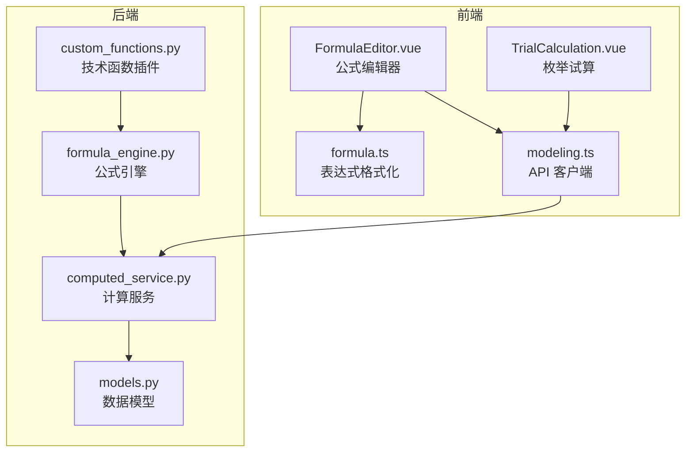
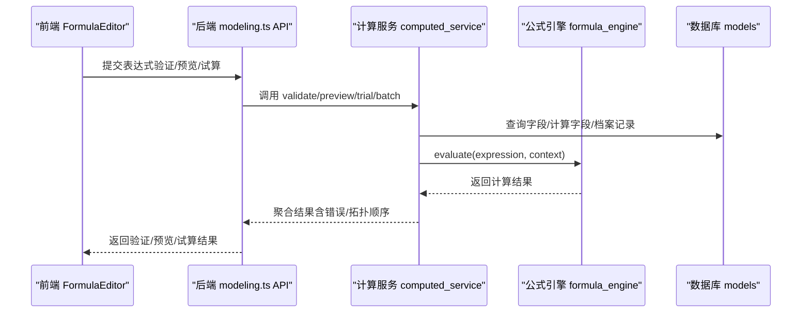
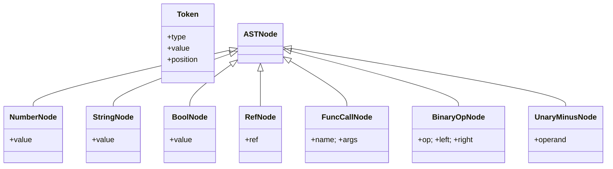
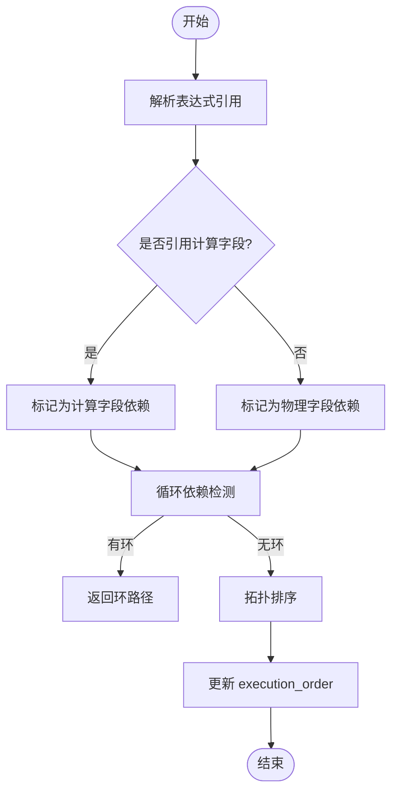
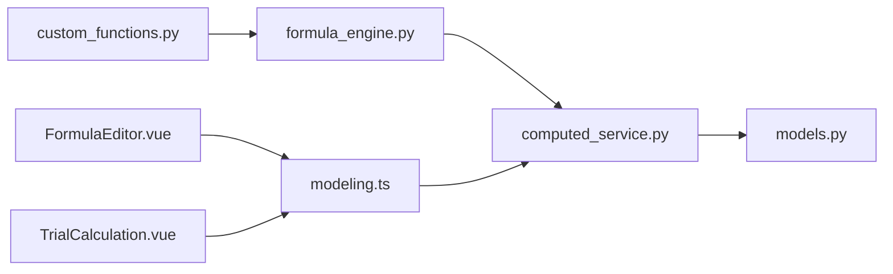

# 计算引擎

<cite>
**本文档引用的文件**   
- [formula_engine.py](file://backend/apps/modeling/formula_engine.py)
- [computed_service.py](file://backend/apps/modeling/computed_service.py)
- [custom_functions.py](file://backend/apps/modeling/custom_functions.py)
- [models.py](file://backend/apps/modeling/models.py)
- [modeling.ts](file://frontend/src/api/modeling.ts)
- [FormulaEditor.vue](file://frontend/src/views/modeling/components/FormulaEditor.vue)
- [TrialCalculation.vue](file://frontend/src/views/modeling/components/TrialCalculation.vue)
- [formula.ts](file://frontend/src/utils/formula.ts)
</cite>

## 目录
1. [简介](#简介)
2. [项目结构](#项目结构)
3. [核心组件](#核心组件)
4. [架构总览](#架构总览)
5. [详细组件分析](#详细组件分析)
6. [依赖关系分析](#依赖关系分析)
7. [性能与优化](#性能与优化)
8. [故障排查指南](#故障排查指南)
9. [结论](#结论)
10. [附录：API 接口与公式语法参考](#附录api-接口与公式语法参考)

## 简介
本文件为 MetaData002 的“计算字段（ComputedField）”计算引擎全面文档。内容涵盖：
- Excel 风格公式语法与解析器设计
- DAG 依赖构建、循环依赖检测与拓扑排序执行
- 表达式解析流程（字段引用语法 {表名.字段名}、函数支持、错误处理）
- 批量重算与增量重算策略
- 计算字段与基础字段、组合字段的区别与应用场景
- 完整 API 接口、公式语法参考与前端公式编辑器使用说明

## 项目结构
后端核心由三部分组成：
- 公式引擎：词法分析、语法分析、AST 求值、内置函数库与注册机制
- 计算服务：依赖解析、DAG 构建、循环检测、拓扑排序、批量/增量重算、枚举试算与预览
- 模型定义：计算字段实体、字段与域等数据模型

前端提供：
- 公式编辑器：表达式输入、验证、格式化、数据预览、AI 生成
- 枚举试算：参数设置、笛卡尔积组合、结果展示
- 工具函数：表达式格式化（代码编辑器风格）

图表来源 
- [formula_engine.py:1-800](file://backend/apps/modeling/formula_engine.py#L1-L800)
- [computed_service.py:1-630](file://backend/apps/modeling/computed_service.py#L1-L630)
- [custom_functions.py:1-108](file://backend/apps/modeling/custom_functions.py#L1-L108)
- [models.py:421-472](file://backend/apps/modeling/models.py#L421-L472)
- [modeling.ts:356-407](file://frontend/src/api/modeling.ts#L356-L407)
- [FormulaEditor.vue:1-800](file://frontend/src/views/modeling/components/FormulaEditor.vue#L1-L800)
- [TrialCalculation.vue:1-300](file://frontend/src/views/modeling/components/TrialCalculation.vue#L1-L300)
- [formula.ts:1-95](file://frontend/src/utils/formula.ts#L1-L95)

章节来源
- [formula_engine.py:1-800](file://backend/apps/modeling/formula_engine.py#L1-L800)
- [computed_service.py:1-630](file://backend/apps/modeling/computed_service.py#L1-L630)
- [models.py:421-472](file://backend/apps/modeling/models.py#L421-L472)
- [modeling.ts:356-407](file://frontend/src/api/modeling.ts#L356-L407)
- [FormulaEditor.vue:1-800](file://frontend/src/views/modeling/components/FormulaEditor.vue#L1-L800)
- [TrialCalculation.vue:1-300](file://frontend/src/views/modeling/components/TrialCalculation.vue#L1-L300)
- [formula.ts:1-95](file://frontend/src/utils/formula.ts#L1-L95)

## 核心组件
- 公式引擎（formula_engine.py）
  - 词法分析器 tokenize：将表达式字符串切分为 Token 流，支持数字、字符串、布尔、字段引用 {表名.字段名}、函数调用、括号、运算符
  - 语法分析器 Parser（递归下降）：按优先级构建 AST，支持比较、加减拼接、乘除、一元负号、原子节点、函数调用
  - 求值器 eval_node：遍历 AST 节点并求值，支持二元运算、一元负号、字段引用解析、函数调用
  - 函数注册表 FUNCTION_REGISTRY：通过装饰器 register_function 注册函数，支持参数数量校验与分类描述
  - 内置函数：逻辑（IF/AND/OR/NOT/IFS/SWITCH/IFERROR）、字符串（CONCAT/LEFT/RIGHT/MID/LEN/TRIM/UPPER/LOWER/SUBSTITUTE）、数字（ABS/ROUND/CEILING/FLOOR/MOD/MAX/MIN）、判空（ISBLANK/ISNA/ISNUMBER/ISTEXT）、日期（TODAY/YEAR/MONTH/DAY/DATEDIF）
  - 公开 API：evaluate(expression, context)、validate_expression(expression)

- 计算服务（computed_service.py）
  - parse_and_save_dependencies：解析表达式中的字段引用，区分物理字段与计算字段依赖，保存 parsed_references，检测循环依赖，更新 execution_order
  - build_dag：构建域内所有计算字段的 DAG（节点、边、拓扑顺序）
  - detect_cycle：DFS 环检测，返回环路径或 None
  - _topological_sort：Kahn 算法拓扑排序，返回执行顺序 ID 列表
  - batch_recalculate：按拓扑顺序对档案记录批量重算，写入 ArchiveRecord.data
  - recalculate_affected：根据变更字段定位受影响计算字段并重算
  - trial_calculate / preview_expression：枚举试算与免实例数据预览，支持自动枚举 distinct_values 与采样截断

- 技术函数插件（custom_functions.py）
  - 使用 @register_function 注册自定义函数，统一纳入校验、求值、前端函数库与 AI 生成可用清单
  - 内置示例：PAD_LEFT、REGEX_EXTRACT、REGEX_REPLACE、SPLIT_INDEX、MAP_VALUE、HASH_MD5

- 数据模型（models.py）
  - ComputedField：包含 expression、depends_on、depends_on_computed、parsed_references、execution_order、output_type、release_to_archive 等字段
  - Field/Table/Domain：基础元数据，支撑上下文构建与引用解析

章节来源
- [formula_engine.py:1-800](file://backend/apps/modeling/formula_engine.py#L1-L800)
- [computed_service.py:1-630](file://backend/apps/modeling/computed_service.py#L1-L630)
- [custom_functions.py:1-108](file://backend/apps/modeling/custom_functions.py#L1-L108)
- [models.py:421-472](file://backend/apps/modeling/models.py#L421-L472)

## 架构总览
计算引擎采用“表达式 → Token → AST → 求值”的标准编译器流水线，结合 Django ORM 进行依赖解析与 DAG 管理，前端提供可视化编辑与试算能力。

图表来源 
- [formula_engine.py:775-796](file://backend/apps/modeling/formula_engine.py#L775-L796)
- [computed_service.py:215-278](file://backend/apps/modeling/computed_service.py#L215-L278)
- [modeling.ts:356-407](file://frontend/src/api/modeling.ts#L356-L407)

## 详细组件分析

### 公式引擎（formula_engine.py）
- 词法分析
  - 支持空白跳过、字段引用 {表名.字段名}、字符串字面量（单双引号，转义）、数字（整数/浮点）、括号与逗号、运算符（>=, <=, <>, +, -, *, /, >, <, =, &）、标识符（函数名/TRUE/FALSE）
  - 输出 Token 流，包含类型、值与位置信息

- 语法分析（递归下降）
  - 优先级从低到高：比较运算 → 加法/拼接 → 乘法 → 一元负号 → 原子（数字/字符串/布尔/引用/函数/括号）
  - 产出 AST 节点：NumberNode/StringNode/BoolNode/RefNode/FuncCallNode/BinaryOpNode/UnaryMinusNode

- 求值器
  - 字段引用解析：context 中查找 "表名.字段名" 键，未找到抛出引用错误
  - 二元运算：& 文本拼接；=/<>/>=/<= 数值比较；+/-/*/ 算术运算，除零抛运行时错误
  - 函数调用：查表 FUNCTION_REGISTRY，参数数量校验，IFERROR 惰性求值第一个参数

- 函数注册与扩展
  - register_function(name, min_args, max_args, description, category) 装饰器
  - 内置函数覆盖逻辑、字符串、数字、判空、日期等常用场景
  - custom_functions.py 可动态注册“技术函数”，无需修改主引擎

图表来源 
- [formula_engine.py:84-98](file://backend/apps/modeling/formula_engine.py#L84-L98)
- [formula_engine.py:205-246](file://backend/apps/modeling/formula_engine.py#L205-L246)

章节来源
- [formula_engine.py:1-800](file://backend/apps/modeling/formula_engine.py#L1-L800)

### 计算服务（computed_service.py）
- 依赖解析与 DAG 构建
  - parse_and_save_dependencies：提取表达式中的字段引用，区分物理字段与计算字段依赖，保存 parsed_references，检测循环依赖，更新 execution_order
  - build_dag：收集域内启用的计算字段，构建节点与边，执行拓扑排序

- 循环依赖检测
  - detect_cycle：基于 DFS 三色标记（白/灰/黑），发现回边即构成环，返回环路径（字段 code 序列）

- 拓扑排序执行
  - _topological_sort：Kahn 算法，入度表 + BFS 队列，得到稳定执行顺序

- 批量重算与增量重算
  - batch_recalculate：按 execution_order 遍历计算字段，对每条档案记录构建上下文（表名.字段码映射 + $computed.code），逐字段 evaluate，差异写入 data
  - recalculate_affected：根据 changed_fields 反向传播影响范围，按执行顺序重算受影响字段

- 枚举试算与预览
  - trial_calculate：支持手动指定参数或自动枚举 distinct_values，限制最大组合数，采样保证多样性
  - preview_expression：免实例数据预览，语法错误时仍展示输入参数去重组合

图表来源 
- [computed_service.py:21-85](file://backend/apps/modeling/computed_service.py#L21-L85)
- [computed_service.py:110-162](file://backend/apps/modeling/computed_service.py#L110-L162)
- [computed_service.py:164-208](file://backend/apps/modeling/computed_service.py#L164-L208)

章节来源
- [computed_service.py:1-630](file://backend/apps/modeling/computed_service.py#L1-L630)

### 技术函数插件（custom_functions.py）
- 使用 @register_function 注册函数，统一纳入全链路（校验、求值、前端函数库、AI 生成）
- 示例函数：PAD_LEFT、REGEX_EXTRACT、REGEX_REPLACE、SPLIT_INDEX、MAP_VALUE、HASH_MD5
- 规范：函数名大写、category='技术函数'、description 清晰签名与用途、签名 (args, ctx)、业务错误抛 FormulaRuntimeError

章节来源
- [custom_functions.py:1-108](file://backend/apps/modeling/custom_functions.py#L1-L108)

### 数据模型（models.py）
- ComputedField：expression、depends_on、depends_on_computed、parsed_references、execution_order、output_type、release_to_archive、status
- Field/Table/Domain：支撑上下文构建与引用解析

章节来源
- [models.py:421-472](file://backend/apps/modeling/models.py#L421-L472)

### 前端公式编辑器（FormulaEditor.vue）
- 功能：表达式输入、验证、格式化、数据预览、AI 生成、函数库与字段引用侧栏、技术函数插件管理
- 交互：
  - 验证：调用 validateFormula/validateExpression，显示语法正确性与引用字段
  - 预览：调用 previewData，展示输入参数去重组合与输出结果
  - 格式化：使用 formatExpressionText 实现代码编辑器风格格式化
  - AI 生成：传入自然语言描述与可选 selectedRefs/currentExpression，自动生成表达式与基础信息

章节来源
- [FormulaEditor.vue:1-800](file://frontend/src/views/modeling/components/FormulaEditor.vue#L1-L800)
- [formula.ts:1-95](file://frontend/src/utils/formula.ts#L1-L95)
- [modeling.ts:356-407](file://frontend/src/api/modeling.ts#L356-L407)

### 枚举试算（TrialCalculation.vue）
- 功能：参数设置（多选构建笛卡尔积）、自动枚举 distinct_values、执行试算、结果表格展示
- 交互：
  - 打开弹窗自动枚举试算，回填测试值与下拉选项
  - 用户选择参数后执行试算，展示组合结果与错误信息

章节来源
- [TrialCalculation.vue:1-300](file://frontend/src/views/modeling/components/TrialCalculation.vue#L1-L300)
- [modeling.ts:356-407](file://frontend/src/api/modeling.ts#L356-L407)

## 依赖关系分析
- 组件耦合
  - 公式引擎独立于 ORM，仅依赖 Python 标准库与 datetime
  - 计算服务依赖公式引擎与 Django ORM，负责依赖解析、DAG 与执行调度
  - 技术函数插件通过装饰器注入公式引擎，解耦良好
  - 前端通过 modeling.ts API 与后端交互，不直接访问 ORM

- 外部依赖
  - Django ORM：查询 Field/Table/Domain/ComputedField/ArchiveRecord
  - 前端 Ant Design Vue：表单、表格、上传、提示等 UI 组件

- 潜在循环依赖
  - 计算字段之间可能形成环，detect_cycle 已实现 DFS 环检测并返回路径

图表来源 
- [formula_engine.py:1-800](file://backend/apps/modeling/formula_engine.py#L1-L800)
- [computed_service.py:1-630](file://backend/apps/modeling/computed_service.py#L1-L630)
- [custom_functions.py:1-108](file://backend/apps/modeling/custom_functions.py#L1-L108)
- [models.py:421-472](file://backend/apps/modeling/models.py#L421-L472)
- [modeling.ts:356-407](file://frontend/src/api/modeling.ts#L356-L407)
- [FormulaEditor.vue:1-800](file://frontend/src/views/modeling/components/FormulaEditor.vue#L1-L800)
- [TrialCalculation.vue:1-300](file://frontend/src/views/modeling/components/TrialCalculation.vue#L1-L300)

章节来源
- [formula_engine.py:1-800](file://backend/apps/modeling/formula_engine.py#L1-L800)
- [computed_service.py:1-630](file://backend/apps/modeling/computed_service.py#L1-L630)
- [custom_functions.py:1-108](file://backend/apps/modeling/custom_functions.py#L1-L108)
- [models.py:421-472](file://backend/apps/modeling/models.py#L421-L472)
- [modeling.ts:356-407](file://frontend/src/api/modeling.ts#L356-L407)
- [FormulaEditor.vue:1-800](file://frontend/src/views/modeling/components/FormulaEditor.vue#L1-L800)
- [TrialCalculation.vue:1-300](file://frontend/src/views/modeling/components/TrialCalculation.vue#L1-L300)

## 性能与优化
- 批量重算优化
  - 按 execution_order 顺序遍历，避免重复计算
  - 上下文复用：record_changed 标志减少不必要的 save
  - 错误限制：errors[:50] 控制响应大小

- 增量重算
  - recalculate_affected 通过反向依赖图定位受影响字段，避免全量重算

- 枚举试算优化
  - total_possible 超过阈值时采样截断，固定种子保证可复现
  - 自动枚举 distinct_values 失败时降级为占位值，不阻断流程

- 表达式格式化
  - 保护字段引用与字符串字面量，避免误改
  - 长函数调用换行缩进提升可读性

章节来源
- [computed_service.py:215-278](file://backend/apps/modeling/computed_service.py#L215-L278)
- [computed_service.py:280-330](file://backend/apps/modeling/computed_service.py#L280-L330)
- [computed_service.py:373-439](file://backend/apps/modeling/computed_service.py#L373-L439)
- [formula.ts:1-95](file://frontend/src/utils/formula.ts#L1-L95)

## 故障排查指南
- 常见错误类型
  - FormulaSyntaxError：语法错误（位置信息）
  - FormulaReferenceError：字段引用未找到
  - FormulaRuntimeError：运行时错误（除零、类型不匹配、函数参数数量错误）
  - CircularDependencyError：循环依赖（含路径）

- 排查步骤
  - 检查表达式语法：使用 validate_expression 或前端验证按钮
  - 检查字段引用：确保 {表名.字段名} 存在且活跃
  - 检查函数参数：确认参数数量与类型符合函数定义
  - 检查循环依赖：使用 dependencyGraph 查看环路径

章节来源
- [formula_engine.py:23-52](file://backend/apps/modeling/formula_engine.py#L23-L52)
- [computed_service.py:110-162](file://backend/apps/modeling/computed_service.py#L110-L162)

## 结论
MetaData002 的计算引擎以 Excel 风格公式为核心，通过词法/语法分析构建 AST，结合 Django ORM 实现依赖解析与 DAG 管理，支持批量与增量重算、枚举试算与预览。前端提供完善的公式编辑器与试算界面，便于用户快速开发与调试。整体架构清晰、扩展性强，适合复杂数据建模与计算需求。

## 附录：API 接口与公式语法参考

### 计算字段 API（前端 modeling.ts）
- 列表/详情/创建/更新/删除：/computed-fields/
- 验证公式：POST /computed-fields/{id}/validate-formula/
- 验证表达式：POST /computed-fields/validate-expression/
- 数据预览：POST /computed-fields/preview-data/
- AI 生成表达式：POST /computed-fields/generate-formula/
- 枚举试算：POST /computed-fields/{id}/trial-calculate/
- 依赖图：GET /computed-fields/dependency-graph/
- 批量重算：POST /computed-fields/batch-recalculate/
- 可用函数：GET /computed-fields/available-functions/
- 可用引用：GET /computed-fields/available-references/
- 技术函数插件：/computed-fields/plugins/*

章节来源
- [modeling.ts:356-407](file://frontend/src/api/modeling.ts#L356-L407)

### 公式语法参考
- 字段引用：{表名.字段名}
- 函数调用：FUNC_NAME(arg1, arg2, ...)
- 运算符：+, -, *, /, >, <, >=, <=, =, <>, &（文本拼接）
- 内置函数类别：逻辑、字符串、数字、判空、日期
- 技术函数：通过 custom_functions.py 注册，统一纳入全链路

章节来源
- [formula_engine.py:1-10](file://backend/apps/modeling/formula_engine.py#L1-L10)
- [formula_engine.py:390-631](file://backend/apps/modeling/formula_engine.py#L390-L631)
- [custom_functions.py:1-108](file://backend/apps/modeling/custom_functions.py#L1-L108)