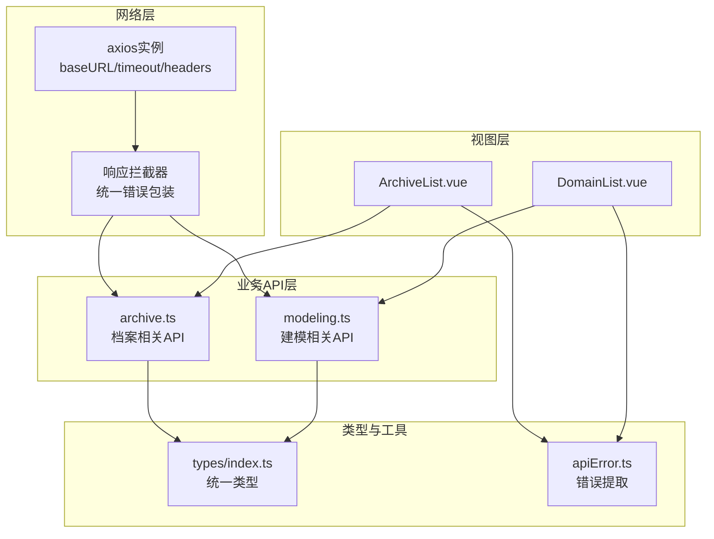
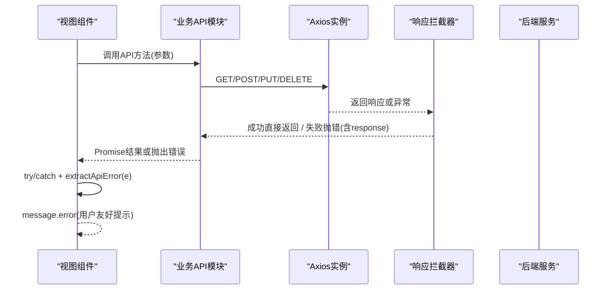
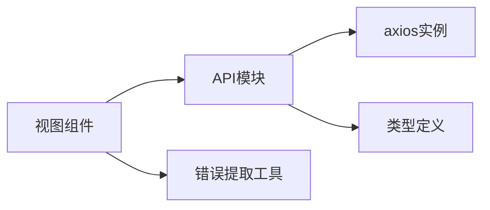

# API集成

<cite>
**本文引用的文件**   
- [frontend/src/api/index.ts](file://frontend/src/api/index.ts)
- [frontend/src/api/archive.ts](file://frontend/src/api/archive.ts)
- [frontend/src/api/modeling.ts](file://frontend/src/api/modeling.ts)
- [frontend/src/utils/apiError.ts](file://frontend/src/utils/apiError.ts)
- [frontend/src/types/index.ts](file://frontend/src/types/index.ts)
- [frontend/package.json](file://frontend/package.json)
- [frontend/src/views/archive/ArchiveList.vue](file://frontend/src/views/archive/ArchiveList.vue)
- [frontend/src/views/modeling/DomainList.vue](file://frontend/src/views/modeling/DomainList.vue)
</cite>

## 目录
1. [简介](#简介)
2. [项目结构](#项目结构)
3. [核心组件](#核心组件)
4. [架构总览](#架构总览)
5. [详细组件分析](#详细组件分析)
6. [依赖关系分析](#依赖关系分析)
7. [性能考量](#性能考量)
8. [故障排查指南](#故障排查指南)
9. [结论](#结论)
10. [附录](#附录)

## 简介
本文件为 MetaData002 前端的API集成文档，聚焦于Axios封装、HTTP请求拦截器、RESTful调用模式、统一数据格式与错误响应封装、按业务域划分的API服务层设计、异步数据处理（Promise链式与async/await）、错误处理策略与用户友好提示，以及最佳实践与性能优化建议。读者可据此快速理解前端如何与后端DRF接口交互，并规范地组织与扩展API模块。

## 项目结构
前端采用“按业务域划分”的API服务层：
- 基础网络层：统一的Axios实例与响应拦截器
- 业务API模块：archive（档案）、modeling（建模）等
- 类型定义：集中管理前后端数据结构
- 工具函数：错误提取与格式化
- 视图层：通过async/await调用API，结合Ant Design消息提示

图表来源
- [frontend/src/api/index.ts:1-22](file://frontend/src/api/index.ts#L1-L22)
- [frontend/src/api/archive.ts:1-139](file://frontend/src/api/archive.ts#L1-L139)
- [frontend/src/api/modeling.ts:1-481](file://frontend/src/api/modeling.ts#L1-L481)
- [frontend/src/types/index.ts:1-388](file://frontend/src/types/index.ts#L1-L388)
- [frontend/src/utils/apiError.ts:1-29](file://frontend/src/utils/apiError.ts#L1-L29)
- [frontend/src/views/archive/ArchiveList.vue:151-200](file://frontend/src/views/archive/ArchiveList.vue#L151-L200)
- [frontend/src/views/modeling/DomainList.vue:127-191](file://frontend/src/views/modeling/DomainList.vue#L127-L191)

章节来源
- [frontend/src/api/index.ts:1-22](file://frontend/src/api/index.ts#L1-L22)
- [frontend/src/api/archive.ts:1-139](file://frontend/src/api/archive.ts#L1-L139)
- [frontend/src/api/modeling.ts:1-481](file://frontend/src/api/modeling.ts#L1-L481)
- [frontend/src/types/index.ts:1-388](file://frontend/src/types/index.ts#L1-L388)
- [frontend/src/utils/apiError.ts:1-29](file://frontend/src/utils/apiError.ts#L1-L29)
- [frontend/src/views/archive/ArchiveList.vue:151-200](file://frontend/src/views/archive/ArchiveList.vue#L151-L200)
- [frontend/src/views/modeling/DomainList.vue:127-191](file://frontend/src/views/modeling/DomainList.vue#L127-L191)

## 核心组件
- Axios实例与拦截器
  - baseURL设置为/api，超时30秒，默认Content-Type为application/json
  - 响应拦截器统一捕获错误，构造Error对象并保留原始response，便于上层读取结构化错误明细
- 业务API模块
  - archive.ts：档案、记录、版本、变更日志、一致性检查、规则管理等
  - modeling.ts：数据源、域、表、字段、标准字段、计算字段、AI配置、分组、选项、映射等
- 类型系统
  - types/index.ts：统一的数据模型与分页结构
- 错误提取工具
  - apiError.ts：从axios错误中提取可读的后端错误消息，兼容多种DRF错误格式

章节来源
- [frontend/src/api/index.ts:1-22](file://frontend/src/api/index.ts#L1-L22)
- [frontend/src/api/archive.ts:1-139](file://frontend/src/api/archive.ts#L1-L139)
- [frontend/src/api/modeling.ts:1-481](file://frontend/src/api/modeling.ts#L1-L481)
- [frontend/src/types/index.ts:1-388](file://frontend/src/types/index.ts#L1-L388)
- [frontend/src/utils/apiError.ts:1-29](file://frontend/src/utils/apiError.ts#L1-L29)

## 架构总览
整体调用流程：视图层使用async/await调用API模块方法；API模块基于Axios发起HTTP请求；响应拦截器统一处理成功与失败；失败时抛出带response的错误，视图层通过extractApiError解析出用户友好的错误信息并提示。

图表来源
- [frontend/src/api/index.ts:1-22](file://frontend/src/api/index.ts#L1-L22)
- [frontend/src/api/archive.ts:1-139](file://frontend/src/api/archive.ts#L1-L139)
- [frontend/src/api/modeling.ts:1-481](file://frontend/src/api/modeling.ts#L1-L481)
- [frontend/src/utils/apiError.ts:1-29](file://frontend/src/utils/apiError.ts#L1-L29)
- [frontend/src/views/archive/ArchiveList.vue:151-200](file://frontend/src/views/archive/ArchiveList.vue#L151-L200)
- [frontend/src/views/modeling/DomainList.vue:127-191](file://frontend/src/views/modeling/DomainList.vue#L127-L191)

## 详细组件分析

### Axios封装与拦截器
- 基础配置
  - baseURL: /api
  - timeout: 30000ms
  - headers: Content-Type application/json
- 响应拦截器
  - 成功路径：透传响应
  - 失败路径：构造Error，优先取data.detail/message/error或err.message，并将原始response挂载到error.response上，供上层读取结构化错误（如sync_stats等）
- 请求头设置
  - 当前默认仅设置Content-Type；如需认证token，可在请求拦截器中统一注入（当前代码未实现）
- 超时处理
  - 全局30s超时；对长耗时操作建议在视图层展示loading与用户提示
- 重试机制
  - 当前未实现自动重试；可按需添加请求拦截器重试逻辑（例如针对5xx或网络抖动）

章节来源
- [frontend/src/api/index.ts:1-22](file://frontend/src/api/index.ts#L1-L22)

### RESTful API调用模式
- 常用方法
  - get/post/put/delete/patch，均使用泛型指定返回类型，增强类型安全
- 分页约定
  - 统一PaginatedResponse<T>结构：count/next/previous/results
  - 列表页通常以params传递分页参数
- 文件上传
  - 使用FormData与multipart/form-data，显式设置Content-Type
- Blob下载
  - 提供downloadBlob工具，从Content-Disposition解析文件名并触发浏览器下载

章节来源
- [frontend/src/api/archive.ts:1-139](file://frontend/src/api/archive.ts#L1-L139)
- [frontend/src/api/modeling.ts:1-481](file://frontend/src/api/modeling.ts#L1-L481)
- [frontend/src/types/index.ts:1-388](file://frontend/src/types/index.ts#L1-L388)

### 统一数据格式与错误响应封装
- 成功响应
  - 视图层通常访问res.data.results获取列表数据
- 错误响应
  - 拦截器将错误包装为Error并保留response
  - 视图层使用extractApiError(e)提取可读消息，支持多种DRF错误结构：error/detail/message/non_field_errors/字段级错误
  - 若无法解析，则回退到调用方提供的兜底文案

章节来源
- [frontend/src/utils/apiError.ts:1-29](file://frontend/src/utils/apiError.ts#L1-L29)
- [frontend/src/api/index.ts:1-22](file://frontend/src/api/index.ts#L1-L22)
- [frontend/src/views/archive/ArchiveList.vue:151-200](file://frontend/src/views/archive/ArchiveList.vue#L151-L200)
- [frontend/src/views/modeling/DomainList.vue:127-191](file://frontend/src/views/modeling/DomainList.vue#L127-L191)

### 按业务域划分的API服务层
- archive.ts
  - 档案CRUD、同步与刷新、版本管理与对比、变更日志与回滚、一致性检查与规则管理、API数据导出等
- modeling.ts
  - 数据源连接测试、域/表/字段管理、标准字段与计算字段、AI配置、字段分组与选项、字段映射推断等
- 设计原则
  - 每个业务域一个模块，职责单一，方法命名清晰
  - 全量拉取场景通过withFullPage辅助函数避免分页截断

章节来源
- [frontend/src/api/archive.ts:1-139](file://frontend/src/api/archive.ts#L1-L139)
- [frontend/src/api/modeling.ts:1-481](file://frontend/src/api/modeling.ts#L1-L481)

### 异步数据处理与调用模式
- async/await
  - 视图层普遍使用async函数包裹API调用，配合try/catch进行错误处理
- Promise链式
  - 部分场景可使用.then().catch()，但推荐async/await提升可读性
- 并发与降级
  - 列表加载后异步并行加载非关键数据（如配置检查），失败不影响主流程

章节来源
- [frontend/src/views/modeling/DomainList.vue:172-191](file://frontend/src/views/modeling/DomainList.vue#L172-L191)
- [frontend/src/views/archive/ArchiveList.vue:151-200](file://frontend/src/views/archive/ArchiveList.vue#L151-L200)

### 错误处理策略与用户友好提示
- 统一错误提取
  - extractApiError(e)优先取结构化错误，拼接多字段错误，最终回退undefined由调用方兜底
- 用户提示
  - 使用message.error显示错误信息，必要时附加上下文（如记录ID）
- 健壮性
  - 非关键错误（如配置检查）允许静默失败，保证主流程可用

章节来源
- [frontend/src/utils/apiError.ts:1-29](file://frontend/src/utils/apiError.ts#L1-L29)
- [frontend/src/views/archive/ArchiveList.vue:151-200](file://frontend/src/views/archive/ArchiveList.vue#L151-L200)
- [frontend/src/views/modeling/DomainList.vue:172-191](file://frontend/src/views/modeling/DomainList.vue#L172-L191)

## 依赖关系分析
- 依赖层级
  - 视图层依赖API模块
  - API模块依赖Axios实例与类型定义
  - 工具函数被视图层广泛复用
- 外部依赖
  - axios用于HTTP通信
  - ant-design-vue用于UI与消息提示
  - vue/vue-router/pinia用于框架能力

图表来源
- [frontend/package.json:1-29](file://frontend/package.json#L1-L29)
- [frontend/src/api/index.ts:1-22](file://frontend/src/api/index.ts#L1-L22)
- [frontend/src/api/archive.ts:1-139](file://frontend/src/api/archive.ts#L1-L139)
- [frontend/src/api/modeling.ts:1-481](file://frontend/src/api/modeling.ts#L1-L481)
- [frontend/src/utils/apiError.ts:1-29](file://frontend/src/utils/apiError.ts#L1-L29)

章节来源
- [frontend/package.json:1-29](file://frontend/package.json#L1-L29)

## 性能考量
- 分页与全量拉取
  - 列表页遵循分页；管理类页面使用withFullPage一次性拉取，避免多次分页请求
- 并发与非阻塞
  - 主列表加载完成后，再异步并行加载非关键数据（如配置检查），失败不阻断主流程
- 大文件与二进制
  - 文件预览与导入使用FormData与multipart/form-data；下载使用Blob与URL.createObjectURL
- 超时与用户体验
  - 全局30s超时；长耗时操作在视图层展示loading与提示，避免用户无感知等待

章节来源
- [frontend/src/api/modeling.ts:1-481](file://frontend/src/api/modeling.ts#L1-L481)
- [frontend/src/views/modeling/DomainList.vue:172-191](file://frontend/src/views/modeling/DomainList.vue#L172-L191)

## 故障排查指南
- 常见错误定位
  - 查看error.response.data的结构，确认是否为DRF标准错误格式
  - 使用extractApiError(e)获取可读消息，若仍为空，检查后端返回是否包含error/detail/message
- 网络问题
  - 检查baseURL与代理配置，确认跨域与鉴权头是否正确
- 超时问题
  - 适当调整timeout或拆分请求；对长耗时任务增加进度提示
- 文件上传/下载
  - 确保Content-Type正确；下载时检查Content-Disposition是否包含filename

章节来源
- [frontend/src/utils/apiError.ts:1-29](file://frontend/src/utils/apiError.ts#L1-L29)
- [frontend/src/api/index.ts:1-22](file://frontend/src/api/index.ts#L1-L22)

## 结论
本项目的前端API集成采用清晰的层次化设计与统一的错误处理策略，既保证了类型安全与可维护性，也提供了良好的用户体验。通过按业务域划分的API服务层与统一的Axios封装，开发者可以快速扩展新的接口并保持风格一致。建议在后续迭代中按需补充请求拦截器的认证与重试机制，进一步提升健壮性与可用性。

## 附录
- 最佳实践清单
  - 使用async/await组织异步逻辑，避免深层嵌套回调
  - 统一错误处理：拦截器包装+extractApiError+用户提示
  - 明确分页与全量拉取的使用场景，避免不必要的请求
  - 文件上传/下载遵循multipart/form-data与Blob规范
  - 对长耗时操作提供loading与反馈，提升用户体验
- 扩展建议
  - 在请求拦截器中统一注入认证头（如Authorization）
  - 实现指数退避重试策略，提高网络抖动下的成功率
  - 引入请求取消（AbortController）避免组件卸载后的无效请求